= Manual de neptUNO+
:author: kounch
:revnumber: 1.0.1
:doctype: book
:media: prepress
:docinfo: shared
:notitle:
:front-cover-image: 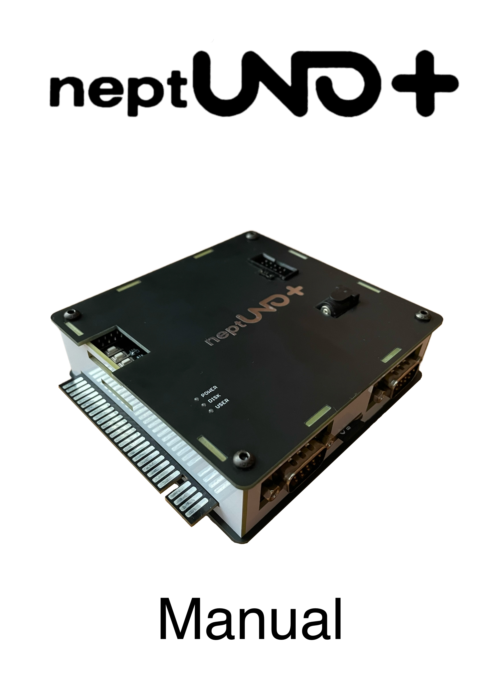
:email: kounch@users.noreply.github.com
:Revision: 1.0
:description: Manual en castellano de neptUNO+
:keywords: Manual, Castellano, neptUNO+
:icons: font
:source-highlighter: rouge
:toc: macro
:toc-title: Índice
:toclevels: 5
:version-label: Versión
:last-update-label: Última actualización
:!show-link-uri:

// SPDX-License-Identifier: CC-BY-NC-SA-4.0

<<<

== Introducción

neptUNO+ es un proyecto de hardware y software basado en una placa FPGA programada para trabajar como un ordenador, consola o arcade. Es posible usar distintas configuraciones de software (cores) y que funcionen como distintos sistemas, pudiendo elegir la configuración que se desee de entre varias disponibles.

La página oficial del proyecto neptUNO+ es https://github.com/neptunoplus[https://github.com/neptunoplus].

En este documento, _mando_ se utiliza para hablar de un joystick o gamepad.

=== Agradecimientos

Gran parte del contenido de este documento se basa en información compartida anteriormente:

- En los canales oficiales de Telegram de https://t.me/neptuno_plus[neptUNO+]
- En la https://github.com/mist-devel/mist-board/wiki/WhatIsThis[documentación oficial de Mist FPGA]
- En https://www.forofpga.es/[foroFPGA]

Sin el trabajo previo de todas estas personas (y más), este manual no podría existir.

=== Licencia

Esta obra está bajo una
https://creativecommons.org/licenses/by-nc-sa/4.0[Licencia Creative Commons Atribución-NoComercial-CompartirIgual 4.0 Internacional].

<<<

=== Puertos y Conectores

[role="center",width="85%",cols="1a", frame=none, grid=none]
|===
|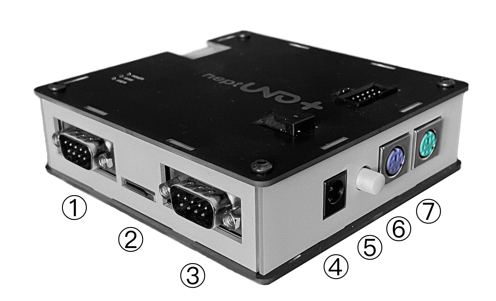
|===

[role="center",width="95%",cols="1,10,1,10"]
|===
|1
|Puerto de Mando Izquierdo
|2
|Ranura microSD
|3
|Puerto de Mando Derecho
|4
|Enchufe de Alimentación
|5
|Interruptor
|6
|Puerto de Teclado PS/2
|7
|Puerto de Ratón PS/2
|8
|Entrada de Sonido
|9
|Salida de Sonido
|10
|Puerto USB
|11
|Salida RGB/VGA
|12
|Puerto de expansión
|===

[role="center",width="85%",cols="1a", frame=none, grid=none]
|===
|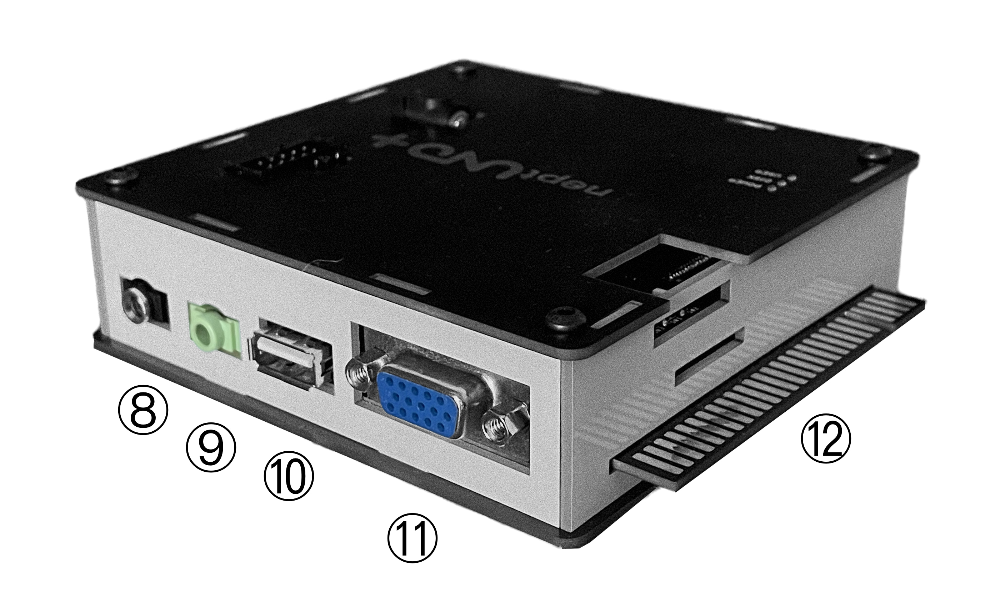
|===

<<<

[role="center",width="60%",cols="1a", frame=none, grid=none]
|===
|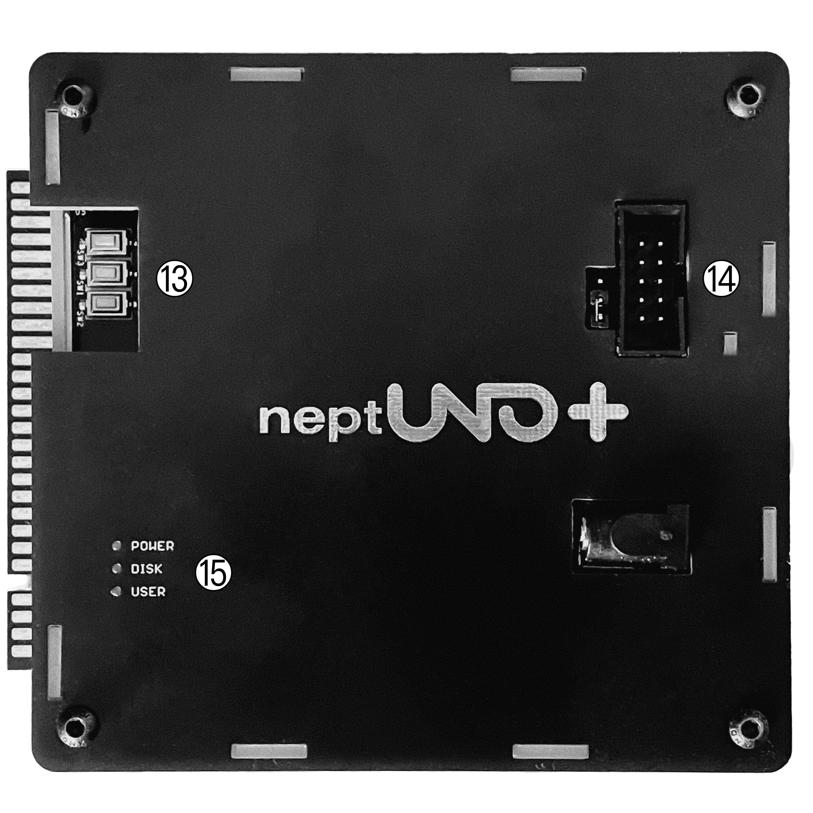
|===

[role="center",width="95%",cols="1,10,1,10"]
|===
|13
|Botones de control
|14
|Conector JTAG
|15
|Indicadores LED
|16
|Interruptor selector de sonido (https://es.wikipedia.org/wiki/Modulación_Sigma-Delta[Sigma-Delta] o https://es.wikipedia.org/wiki/I²S[I^2^S])
|17
|Botón Reset del microcontrolador RP2040
|18
|Botón BOOTSEL del microcontrolador RP2040
|===

[role="center",width="60%",cols="1a", frame=none, grid=none]
|===
|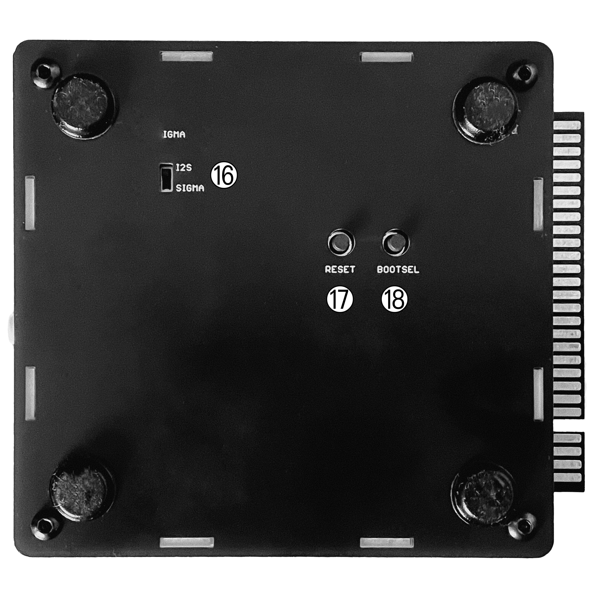
|===

<<<

=== Configuración Inicial

Para poder poner en marcha un neptUNO+ hace falta, al menos, lo siguiente:

- Un cargador USB, una TV u otro dispositivo que ofrezca alimentación USB (5VDC y, al menos, 1A). El conector es un jack de barril de 5,5mm en el exterior y 2,1mm en el interior, con polaridad positiva (el centro positivo y el exterior negativo)
- Un cable y un monitor o TV con soporte VGA o RGB (la conexión RGB también se puede utilizar con un adaptador VGA a SCART y conectado a TV compatibles)
- Un teclado PS/2 o USB
- Una tarjeta microSD

[TIP]
====
Es importante que la fuente tenga un voltaje estable y suficiente intensidad, o es posible que ocurran comportamientos erráticos (fallo del teclado, imagen, etc.). Algunos teclados y periféricos podrían requerir el uso de una fuente de alimentación similar pero que ofrezca 2 amperios o más.

[role="center",width="20%",cols="1a", frame=none, grid=none]
|===
|image:img/power_connector.png[scaledwidth=100%]
|===
====

<<<

Para poder aprovechar todo su potencial, es útil tener también:

- Unos altavoces de PC para conectar a la salida de audio, o un cable jack-stereo a dos conectores RCA rojo/blanco para conectar a la TV
- Al menos un mando norma Atari, como por ejemplo, un <<#_compatibilidad_de_mandos_db9,gamepad DB9>>, o bien un mando USB compatible (<<#_mandos_usb_compatibles,véase referencia>>)
- Un ratón PS/2
- Un cable con un jack estéreo de 3,5 mm en un extremo y los dos canales de sonido divididos en dos salidas mono en el otro, si se quiere usar algún dispositivo de reproducción y/o grabación de audio, como por ejemplo un Miniduino o Maxduino (<<#_miniduino,ver la sección correspondiente>>), un PC/Mac/Raspberry PI, etc. o un reproductor/grabador de https://es.wikipedia.org/wiki/Casete[cassette]. El canal derecho se utiliza como entrada (EAR) y el canal izquierdo se puede usar como salida de grabación (MIC).
- Un hub USB de varios puertos si se desea conectar varios dispositivos USB (como mandos o teclados). El hub debe ser USB 2.0 o 3.0 retrocompatible con USB 2.0

[NOTE]
====
Si se utiliza un adaptador VGA a https://es.wikipedia.org/wiki/Euroconector[Euroconector o SCART] activo, este emplea pines no utilizados del puerto VGA para transmitir el audio, pero sólo si no hay nada conectado al puerto jack de 3,5 mm de salida de sonido.
====

[TIP]
====
Algunos teclados PS/2 no funcionan, tras un arranque en frío, a no ser que se conecten después de que haya cargado el firmware de Mist (véase <<#_firmware_de_mist,más adelante>> para más información).
====

[WARNING]
====
No todos los hub USB son adecuados, ya que el conector USB tiene un límite en la alimentación eléctrica que provee, por lo que existe el riesgo de problemas si se conecta un conjunto de dispositivos que superen dicho límite.

En este caso (dispositivos que fallan al azar, etc.), es útil usar un hub con alimentación externa suficiente. Una forma de validar un hub de este tipo consiste en comprobar, en un ordenador, que sea capaz de mantener conectados a la vez entre 2 y 3 discos duros USBs externos simultáneamente.
====

<<<

==== Creación de microSD básica

Asegurarse de que la tarjeta microSD a utilizar está con formato exFAT o FAT32. De no ser así se puede utilizar https://www.sdcard.org/downloads/formatter/[la herramienta oficial de la SD Association].

Es necesario, al menos, que haya un fichero de core, llamado `core.rbf`, en el directorio raíz de la tarjeta. Este puede ser tanto el <<#_menú,core "Menú">>, como cualquier otro que se desee, y es el que se iniciará por defecto al encender.

Además, se puede copiar también un fichero <<#_configuración_avanzada,mist.ini>> con opciones extra de configuración.

==== Primer arranque

Antes de comenzar, asegurarse de que se ha insertado la tarjeta microSD y, al menos, se ha conectado el cable de alimentación, un cable de vídeo conectado a un monitor o televisión compatible, y un teclado.

[role="center",width="50%",cols="1a", frame=none, grid=none]
|===
|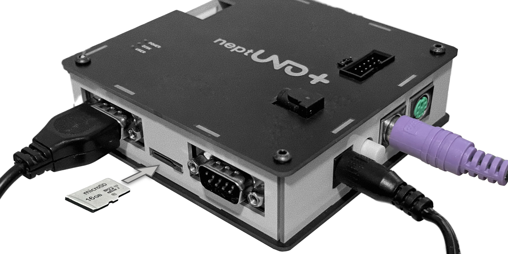
|===

Pulsar el interruptor y comprobar en la pantalla que el core por defecto inicia correctamente. Por ejemplo, si se utiliza el <<#_menú,core "Menú">>:

[role="center",width="60%",cols="1a", frame=none, grid=none]
|===
|image:img/quickstart_guide5.png[scaledwidth=100%]
|===

Utilizar las teclas de cursor o un mando para desplazarse por la lista, y pulsar `Enter` o el botón principal del mando para cargar el core deseado.

Tras unos segundos, el core elegido se activará en la FPGA y se podrá utilizar.

<<<

== Firmware de MiST

El neptUNO+ arranca por defecto usando una versión, adaptada para el https://www.raspberrypi.com/documentation/microcontrollers/raspberry-pi-pico.html%23rp2040-device[microcontrolador RP2040], del firmware que utiliza el microcontrolador de otra familia de FPGAs (MiST, MiSTica y SiDi). Este firmware se utiliza para inicializar la FPGA en el arranque cargando el core por defecto. Luego, una vez que la FPGA está en marcha, el microcontrolador actúa como un chip de soporte y permite implementar en software algunas cosas costosas de hacer dentro de la FPGA (como por ejemplo, el uso de mandos o teclados USB).

Para que se inicie el firmware de MiST, debe existir en la raíz de la tarjeta microSD al menos un fichero de core por defecto, llamado `core.rbf` y, opcionalmente, un fichero de configuración llamado `mist.ini`.

=== Menú de MiST

Pulsando la tecla `F12` desde cualquier core compatible con el firmware de MiST se accede al menú de configuración de dicho core. Desde este menú, pulsando la tecla de cursor derecha se puede acceder al menú del firmware de MiST.

Por ejemplo, desde la configuración del <<#_menú,core "Menú">>:

[role="center",width="100%",cols="1a,1a", frame=none, grid=none]
|===
|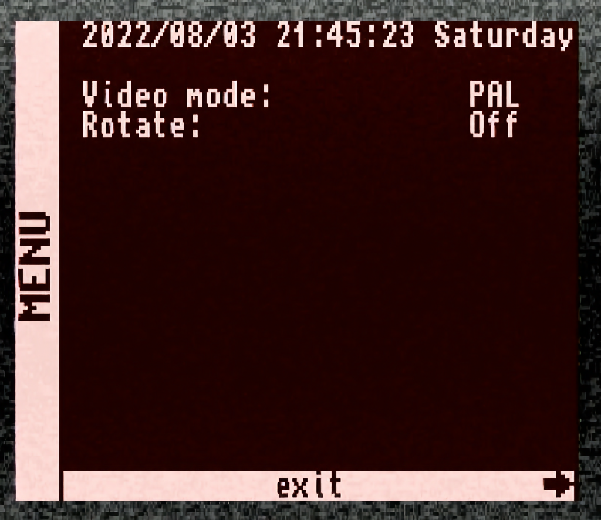
|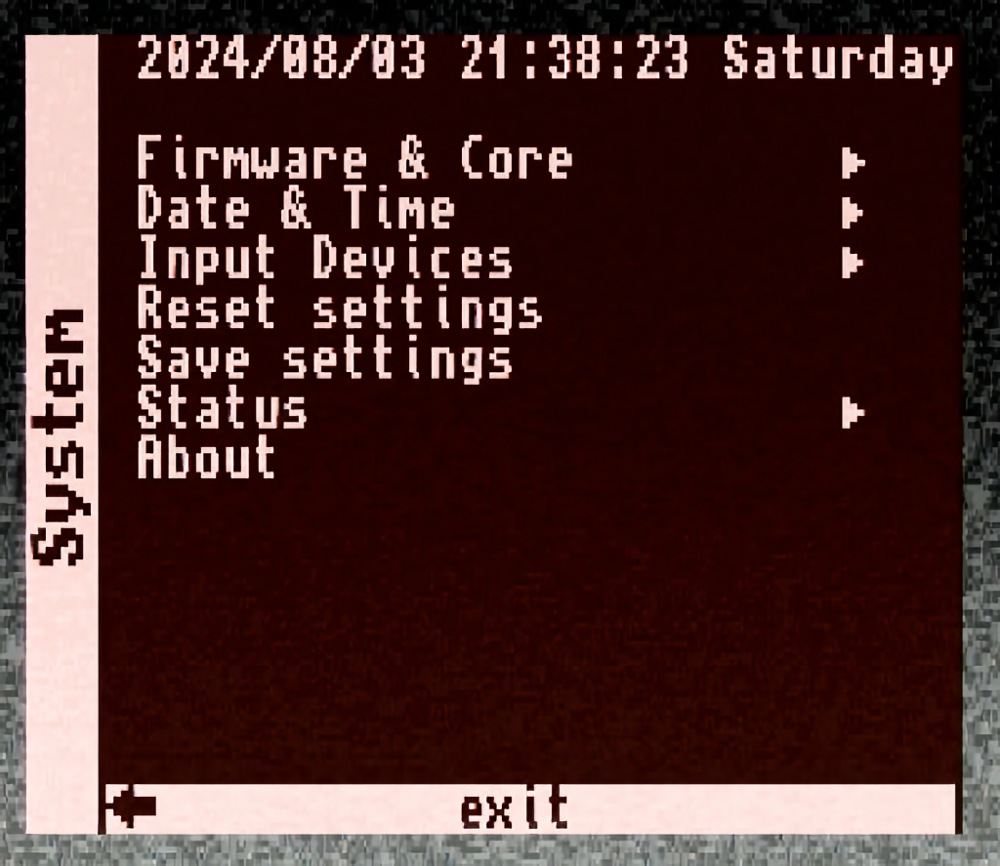
|===

Algunas de las opciones del menú de MiST muestran otros menús secundarios. que se explican a continuación.

<<<

==== Firmware y Core

Desde este menú se puede acceder a la <<#_configuración_de_mandos_db9,configuración de mandos DB9>> y a la <<#_actualizaciones,actualización del firmware>>, así como volver a ver el contenido de la tarjeta microSd, y cargar un core distinto del actual.

[role="center",width="50%",cols="1a", frame=none, grid=none]
|===
|image:img/mist03.png[scaledwidth=100%]
|===

==== Fecha y hora

Desde este otro menú se puede <<#_configurar_la_fecha_y_la_hora,configurar la fecha y la hora>> del reloj RTC.

[role="center",width="50%",cols="1a", frame=none, grid=none]
|===
|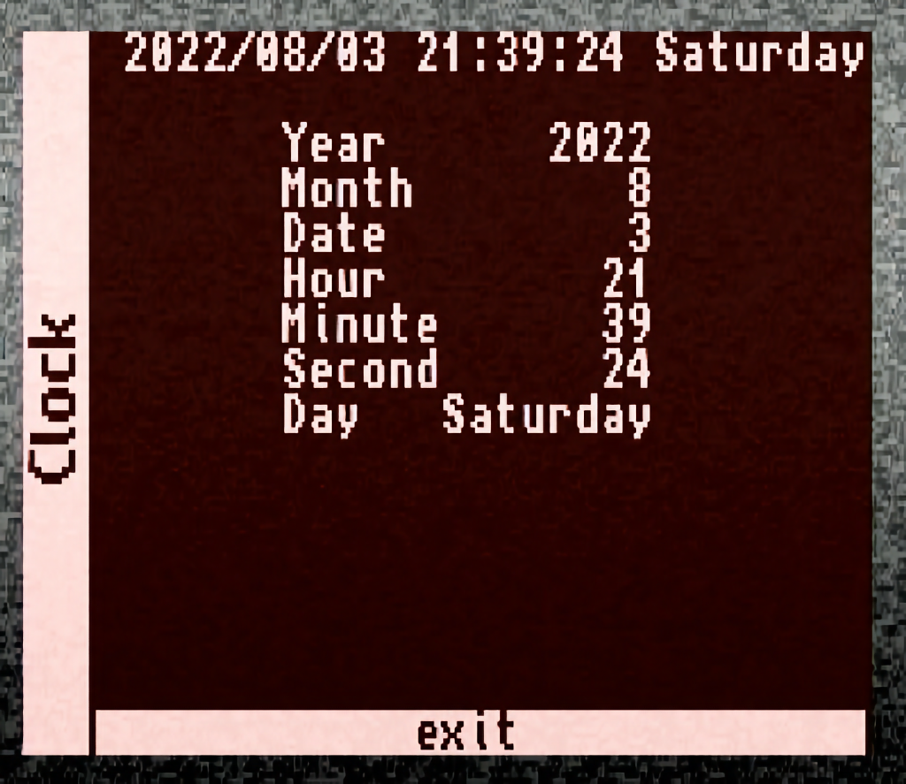
|===

Usar la opción `Exit` para volver al menú anterior.

<<<

==== Dispositivos de Entrada

Este menú ofrece opciones para comprobar el funcionamiento de mandos, teclado, y dispositivos USB conectados, así como para personalizar los mandos de juegos conectados.

[role="center",width="50%",cols="1a", frame=none, grid=none]
|===
|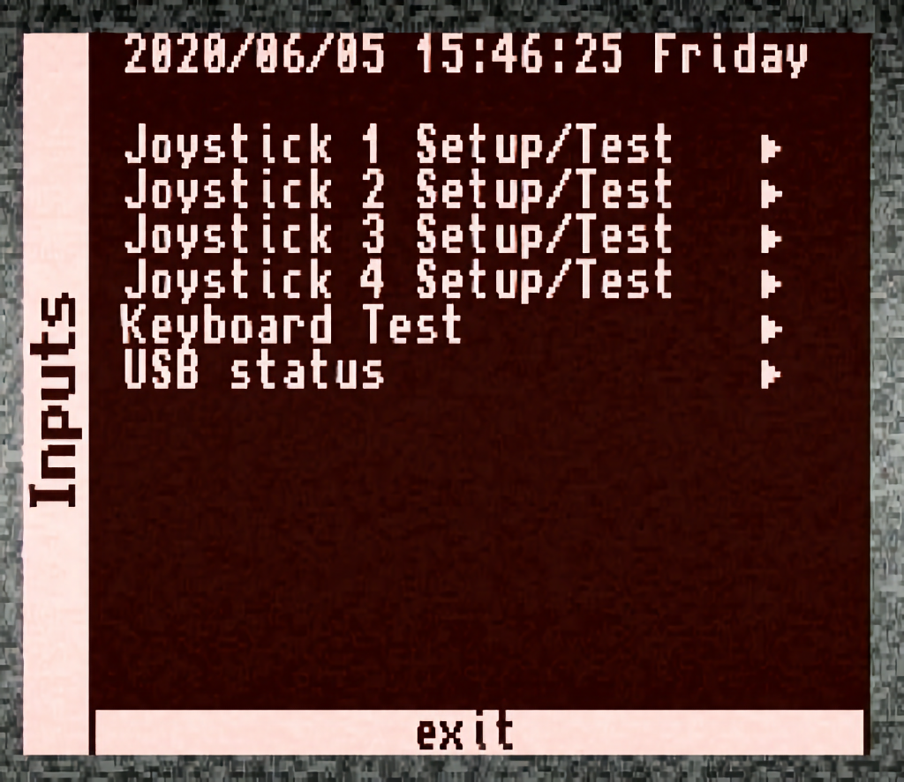
|===

Las primeras opciones sirven para verificar los joystick conectados.

[role="center",width="50%",cols="1a", frame=none, grid=none]
|===
|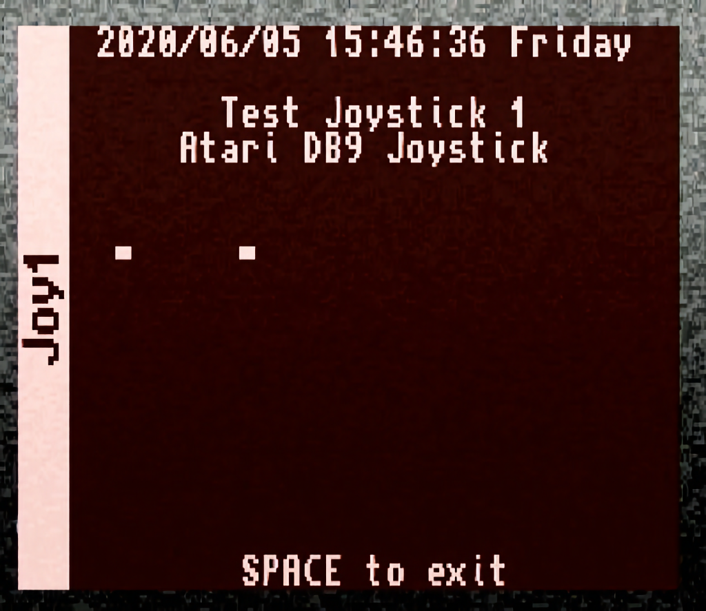
|===

Si se pulsa la tecla `F1`, se accede a las <<#_personalización_de_mandos,opciones para personalizar los mandos>>.

Pulsar la tecla `Espacio` del teclado para volver al menú anterior.

<<<

La comprobación de teclado muestra los códigos internos recibidos al pulsar las distintas teclas.

[role="center",width="50%",cols="1a", frame=none, grid=none]
|===
|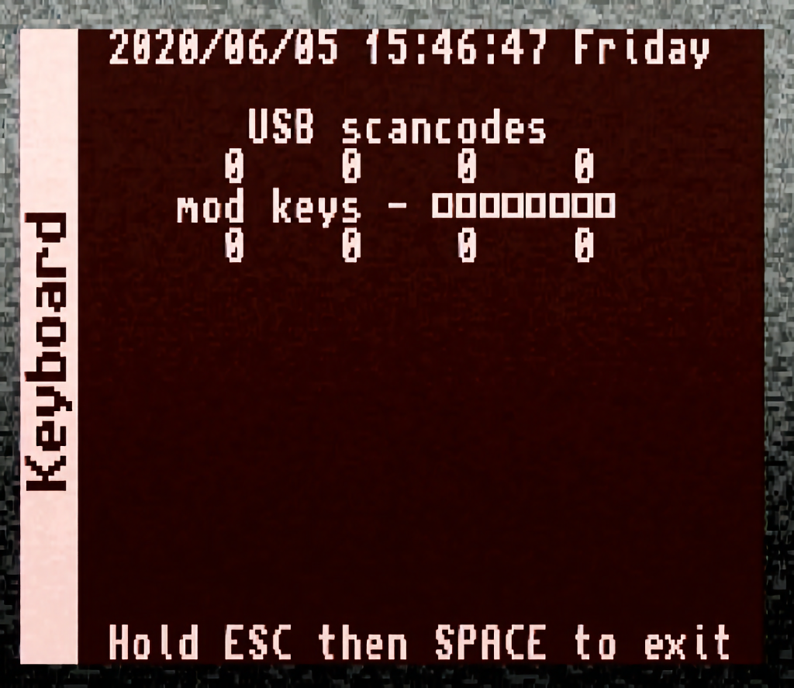
|===

Pulsar simultáneamente la tecla `Esc` y `Espacio` para volver al menú anterior.

El último submenú de dispositivos de entrada sirve para ver la información de los dispositivos USB detectados.

[role="center",width="50%",cols="1a", frame=none, grid=none]
|===
|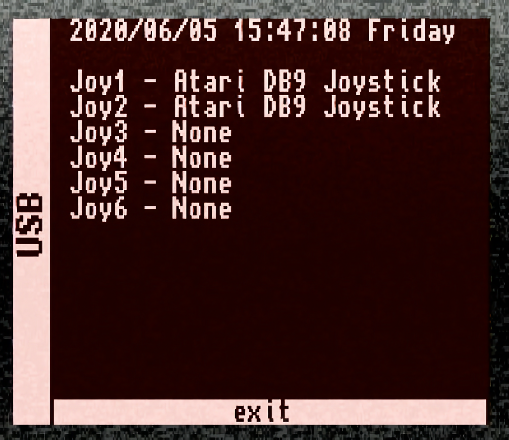
|===

Usar la opción `Exit` para volver al menú anterior.

<<<

==== Estado

Desde este menú se puede ver información relativa a la tarjeta, teclados, ratón y otros dispositivos de hardware que haya disponibles.

[role="center",width="50%",cols="1a", frame=none, grid=none]
|===
|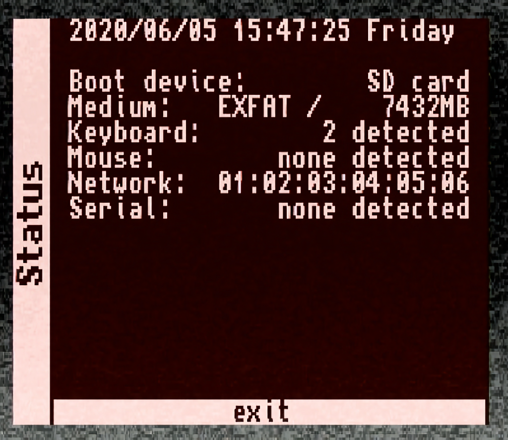
|===

Usar la opción `Exit` para volver al menú anterior.

<<<

=== Configuración avanzada

Se puede crear un fichero de configuración llamado `mist.ini`, dentro de la raíz de la tarjeta microSD, con el siguiente formato:

[source,ini]
----
[mist]
opcion1=valor1
opcion2=valor2
(...)

[nombredecore1]
opcion1core1=valor1core1
(...)

[nombredecore2]
(...)
----

Las opciones y valores introducidos tras `[mist]` se aplicarán en general a todos los cores que los soporten. Estas son algunas:

- `scandoubler_disable`: Con valor 1, algunos cores desactivarán scandoubler para producir una señal de vídeo de 15 kHz. Necesario para utilizar un cable VGA a SCART.
- `csync_disable`: Por defecto, en el modo de 15 kHz, se produce una señal de sincronización compuesta en el pin 13 (Hsync) y un nivel alto constante en el pin 14. Algunos monitores antiguos compatibles con vídeo a 15 kHz no funcionan correctamente así, y necesitan HSync y VSync separados, lo que se activa poniendo el valor 1 en esta opción.
- `key_menu_as_rgui`: Cuando el valor es 1, cambia la tecla del Menú (`F12`) por la tecla derecha de menú . Opción para teclados pequeños sin teclas de función.
- `mouse_boot_mode`: Si el ratón no funciona correctamente, poner el valor 1 podría solucionarlo
- `mouse_speed`: Velocidad del ratón, en porcentaje. Por defecto: 100
- `rom`: Permite personalizar el fichero de ROM por defecto, normalmente para un core específico
- `joystick_ignore_hat`: Poner con valor 1 para solucionar problemas con mandos con cruceta y palanca analógica
- `joystick_disable_shortcuts`: Con valor 1, desactiva la emulación de mando con teclado
- `joystick_emu_fixed_index`: Al activarlo, con valor 1, se emulan simultáneamente los dos primeros mandos con el teclado

El resto de opciones se pueden consultar en la https://github.com/neptunoplus/Binaries/wiki/Mist.ini[wiki de neptUNO+] y la  https://github.com/mist-devel/mist-board/wiki/Configuration-files-%28.ini%29[documentación oficial de Mist]. Notar que no todas las opciones son aplicables en el caso de neptUNO+.

<<<

Se pueden indicar también particularmente para cada core concreto o para una ROM específica, usando el nombre adecuado para cada uno de ellos. En la siguiente tabla hay algunos ejemplos:

[role="center",options="header",cols=2*]
|===
|Core ó ROM (ARC)|Cabecera
|Sinclair QL|[ql]
|ZX Spectrum 128|[spectrum]
|Journey (Midway MCR-2)|[journey]
|Rampage (Midway MCR-3)|[rampage]
|===

<<<

Este sería un ejemplo de fichero `mist.ini` con varias personalizaciones, y la salida de vídeo por defecto en RGB (para uso con scart). Notar cómo esta configuración se ha cambiado para algunos cores, que sólo funcionarían en modo VGA:

[source,ini]
----
[mist]
keyrah_mode=0
sdram64=0
scandoubler_disable=1
mouse_boot_mode=1
mouse_speed=100
joystick_ignore_hat=0
joystick_ignore_osd=0
joystick_disable_shortcuts=0
joystick0_prefer_db9=0
joystick_db9_fixed_index=0
joystick_emu_fixed_index=0
key_menu_as_rgui=0
reset_combo=0
ypbpr=0
keep_video_mode=0
led_animation=0
hid_button_remap=
joystick_remap=
joy_key_map=

[minimig_config]
kick1x_memory_detection_patch=1
conf_default="Amiga 1200"
conf_1="Amiga 500"
;conf_2="68000 OCS"
;conf_3=
clock_freq=0 

[c16]
rom=1541KRNL
rom=KERNAL

[ql]
scandoubler_disable=0

[kick]
scandoubler_disable=0

[solarfox]
scandoubler_disable=0

[tron]
scandoubler_disable=0
----

<<<

=== Configuración de mandos DB9

Por cuestiones de compatibilidad, por defecto, la detección de mandos DB9 utiliza la norma atari, pero es posible cambiarla para que utilice otras normas como la de mega drive (hasta 6 botones), o bien redirigir internamente la conexión si se utiliza un modelo de NeptUNO+ compatible con conexión https://es.wikipedia.org/wiki/Japanese_Amusement_Machine_Manufacturers%27_Association[JAMMA].

. Pulsar `F12` para mostrar el menú

[role="center",width="65%",cols="1a", frame=none, grid=none]
|===
|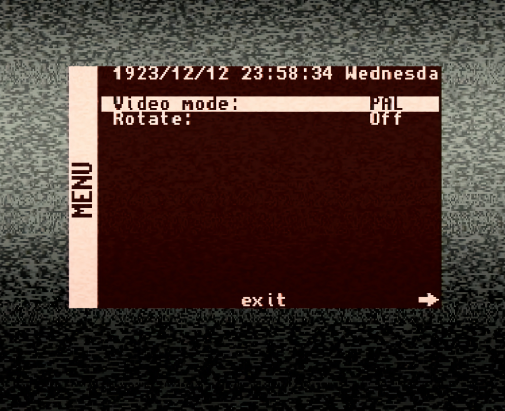
|===

[start=2]
. Usar la tecla de cursor derecha o el mando para mostrar las opciones, elegir `Firmware & Core` y pulsar `Enter`

[role="center",width="50%",cols="1a", frame=none, grid=none]
|===
|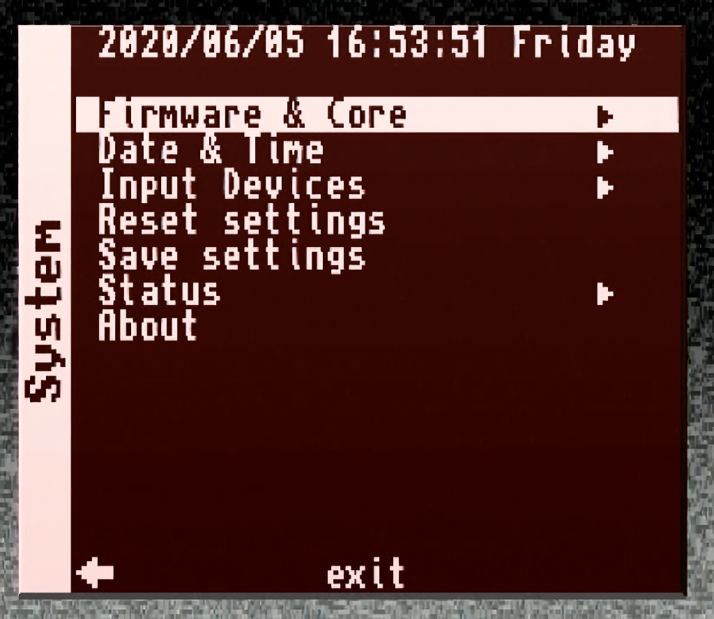
|===

<<<

[start=3]
. Usar las teclas de cursor o el mando para elegir `Plaftorm Settings` y pulsar `Enter`

[role="center",width="50%",cols="1a", frame=none, grid=none]
|===
|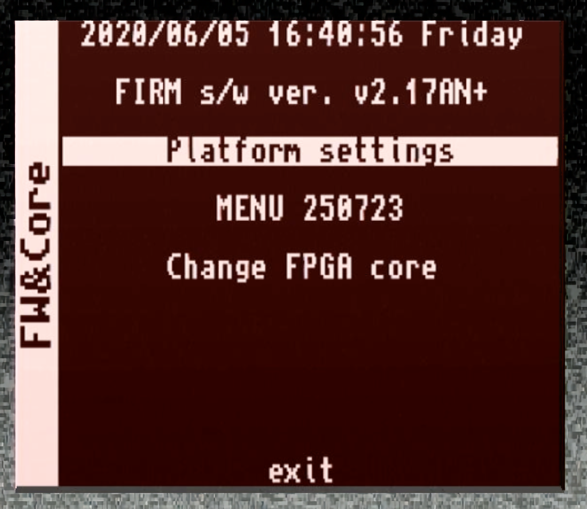
|===

[start=4]
. Ahora, usar de nuevo las teclas de cursor o el mando para elegir `DB9 Mode` y pulsar `Enter` o el botón 1 del mando.

[role="center",width="50%",cols="1a", frame=none, grid=none]
|===
|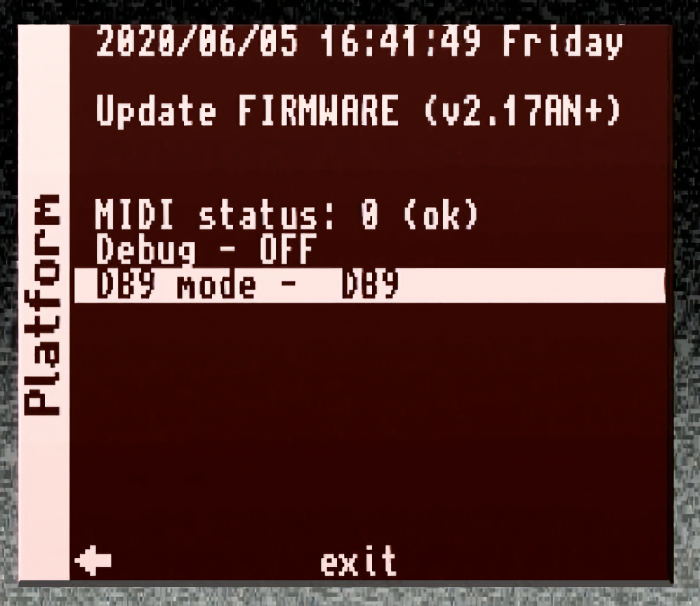
|===

<<<

[start=5]
. Elegir la opción deseada entre:

- DB9: para usar el estándar Atari en los conectores DB9
- Jamma: Para redirigir los controles desde el adaptador JAMMA (en modelos de neptUNO+ compatibles)
- Megadrive: Para activar el soporte de mandos de 6 botones (norma mega drive) en los conectores DB9

[role="center",width="50%",cols="1a", frame=none, grid=none]
|===
|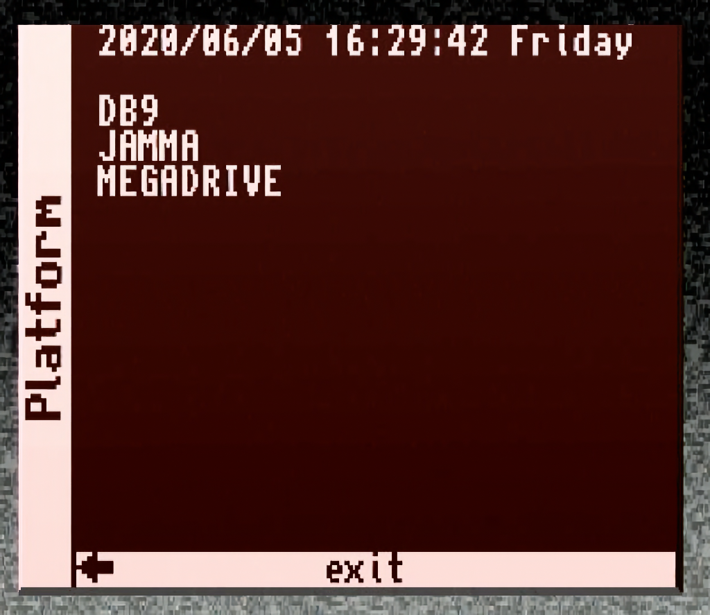
|===

[start=6]
. Finalmente, confirmar y guardar los ajustes deseados:

[role="center",width="50%",cols="1a", frame=none, grid=none]
|===
|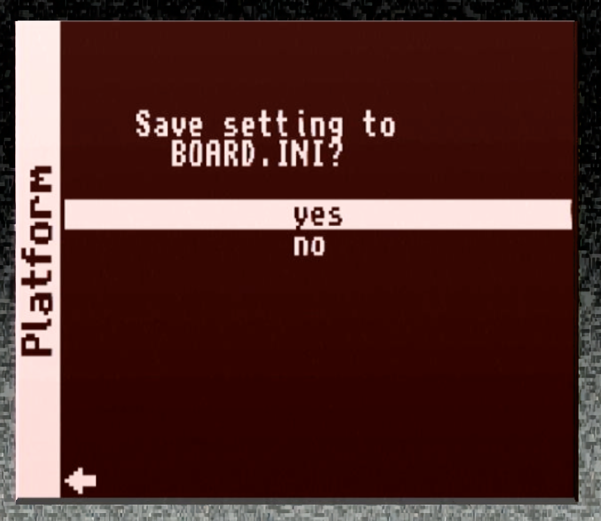
|===

<<<

=== Personalización de mandos

Por defecto, los botones de los mandos conectados son asignados con los siguientes nombres.

[role="center",width="75%",cols="1a", frame=none, grid=none]
|===
|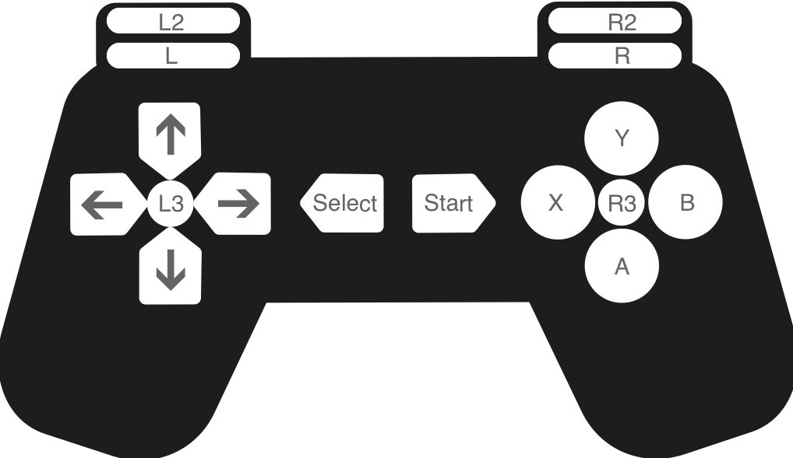
|===

Sin embargo, la asignación automática no siempre coincide con la realidad, o podría suceder que para algún core en concreto no sea la más adecuada.

Desde el <<#_dispositivos_de_entrada,menú de dispositivos de entrada>>, es posible asignar los controles de los mandos de forma personalizada.

Pulsar `F1` para comenzar el proceso de configuración.

A continuación, ir pulsando el botón deseado para cada asignación. Si el botón no existe (o no se quiere usar). pulsar `F1`.

Cuando finalice el proceso de asignación de botones, se pueden guardar los cambios usando la tecla `F2`, bien de forma global para todos los cores (en el fichero `MISTCFG.INI`), bien para core actual (en el fichero `[NOMBRE DE CORE].CFG`).

En el caso de haber configuraciones para el mismo mando en varios ficheros, la prioridad por la que se consideran es la siguiente:

[source]
----
MIST.INI
MISTCFG.INI
[NOMBRE DE CORE].CFG
----

<<<

=== Personalización de tipo de letra

También es posible cambiar el tipo de letra (fuente) a utilizar en los menús de Mist, guardando en el directorio `mist` un fichero llamado `system.fnt` conteniendo una fuente 8x8, y con un tamaño de 768 bytes (caracteres ASCII 32-127) o 1024 bytes (caracteres ASCII 0-127). Se pueden obtener ficheros `.fnt` desde el repositorio oficial https://github.com/MiSTer-devel/Fonts_MiSTer/blob/master/README.md[Fonts_MiSTer].

=== Personalización de imagen de fondo

Se puede añadir una imagen de fondo para mostrar detrás del <<#_menú,core "Menú">>. Para ello, copiar un fichero llamado `menu.rom` en la raíz de la tarjeta microSD, con las siguientes características:

- Formato BMP (antiguo, Windows 3.x)
- 640 pixeles de ancho
- 312 píxeles de alto
- 32 bits de color (24-bit con canal alfa)

Por ejemplo, para construir un fichero usando https://imagemagick.org/script/download.php[imagemagick], se puede utilizar un comando como el siguiente:

[source,shell]
----
magick <...imagen original> -define bmp3:alpha=true BMP3:menu.rom
----

[TIP]
====
Es útil construirlo partiendo de una imagen de 640x480 de tamaño y luego escalarla a 640x312 para que se muestre con las proporciones correctas.
====

<<<
=== Configurar la fecha y la hora

La tarjeta intermedia instalada, donde se encuentra el https://www.raspberrypi.com/documentation/microcontrollers/raspberry-pi-pico.html%23rp2040-device[microcontrolador RP2040] dispone de un https://es.wikipedia.org/wiki/Reloj_en_tiempo_real[reloj en tiempo real] que puede ser aprovechado por los distintos cores.

El reloj se puede ajustar fácilmente desde el <<#_menú,menú>> de MiST.

. Pulsar `F12` para mostrar el menú

[role="center",width="65%",cols="1a", frame=none, grid=none]
|===
|
|===

[start=2]
. Usar la tecla de cursor derecha o el mando para mostrar las opciones, elegir `Date & Time` y pulsar `Enter`

[role="center",width="65%",cols="1a", frame=none, grid=none]
|===
|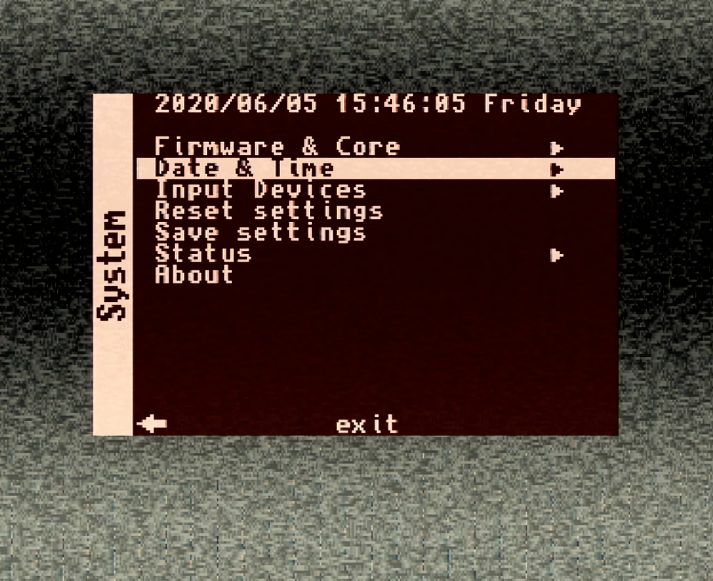
|===

<<<

[start=3]
. Usar las teclas de cursor o el mando para ir modificando los valores que se desee. Al terminar, elegir `Exit` y pulsar `Enter`

[role="center",width="65%",cols="1a", frame=none, grid=none]
|===
|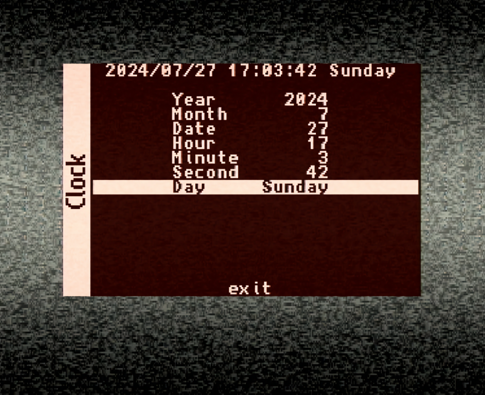
|===

[start=4]
. Finalmente, elegir la opción `Save Settings` del menú de opciones del sistema y pulsar `Enter` para guardar los cambios.

[role="center",width="65%",cols="1a", frame=none, grid=none]
|===
|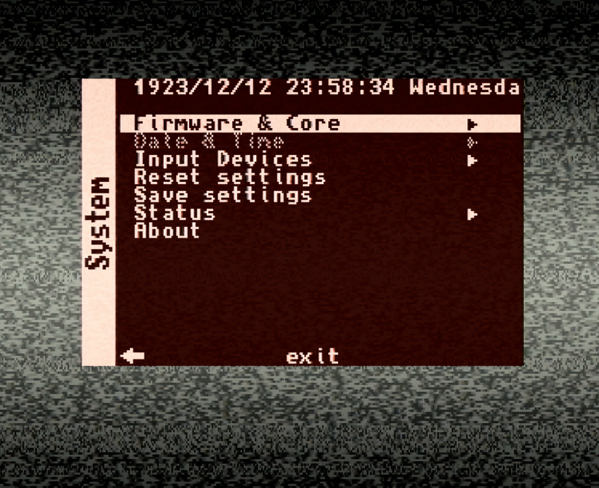
|===

<<<

=== Actualizaciones

Las actualizaciones de firmware de MiST para el https://www.raspberrypi.com/documentation/microcontrollers/raspberry-pi-pico.html%23rp2040-device[microcontrolador RP2040] suelen ser distribuidas en ficheros con un nombre del tipo mist-neptuno2-xxxx.zip. En su interior, se suelen encontrar un fichero llamado `mistusb.ufs`

*Material necesario*:

- Ordenador con USB y compatible con Raspberry Pi Pico
- Cable con un extremo USB-A (para conectar con el neptUNO+) y el otro extremo adecuado para conectar con el ordenador (USB-C, USB-A, etc.)

[TIP]
====
Si no se dispone de un cable USB-A a USB-A, puede ser útil utilizar un cable USB-A a USB-C y luego un adaptador de USB-C a USB-A
====

*Software necesario*:

- Obtener el archivo UF2 adecuado para el microcontrolador a actualizar (normalmente `mistusb.uf2`) desde la página web oficial: https://github.com/neptunoplus/Binaries/tree/main/Firmware.

*Pasos a seguir*:

. Conectar el neptUNO+ con el cable USB al ordenador y asegurarse de que está encendido

[start=2]
. Pulsar la tecla `F12` para acceder al menú de configuración del core por defecto.

[role="center",width="65%",cols="1a", frame=none, grid=none]
|===
|
|===

<<<

[start=3]
. Usar la tecla de cursor derecha o el mando para mostrar las opciones, elegir `Firmware & Core` y pulsar `Enter`

[role="center",width="70%",cols="1a", frame=none, grid=none]
|===
|
|===

[start=4]
. Usar las teclas de cursor o el mando para  elegir `Platform Settings` y pulsar `Enter`

[role="center",width="70%",cols="1a", frame=none, grid=none]
|===
|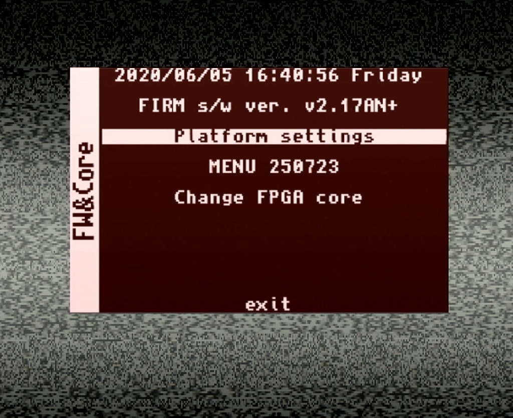
|===

<<<

[start=5]
. Usar las teclas de cursor o el mando para  elegir `Update FIRMWARE…` y pulsar `Enter`

[role="center",width="70%",cols="1a", frame=none, grid=none]
|===
|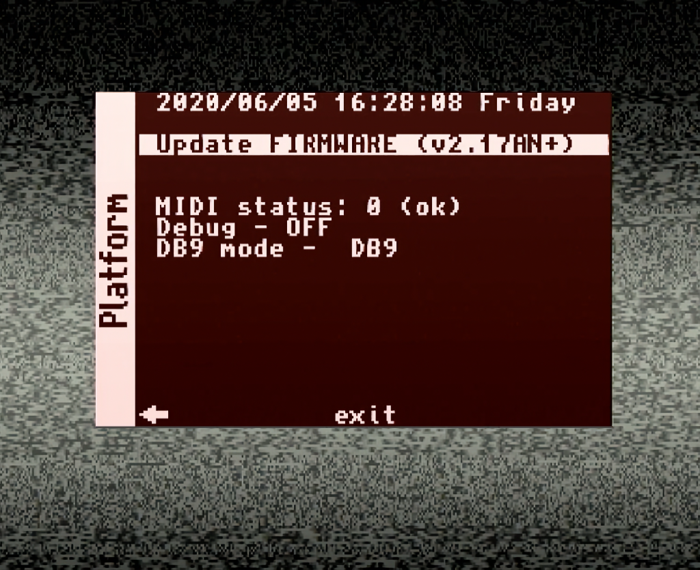
|===

[start=6]
. Se deberá confirmar en la pantalla siguiente que se desea realizar la actualización

[role="center",width="70%",cols="1a", frame=none, grid=none]
|===
|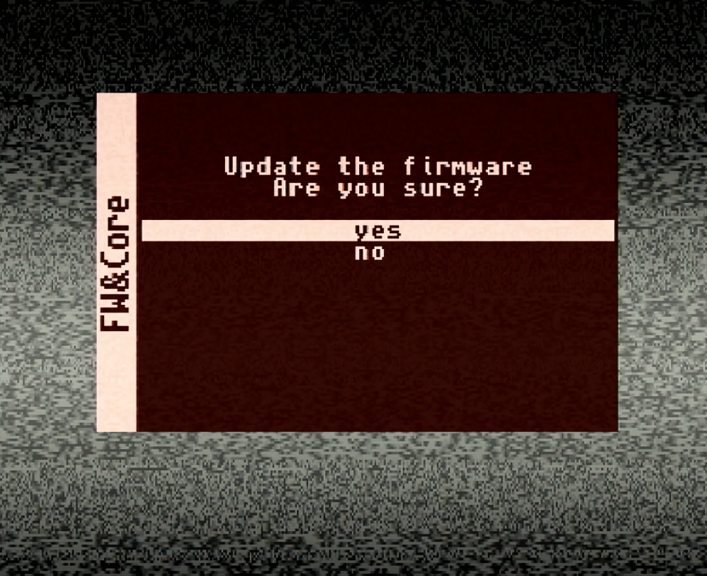
|===

<<<

[start=7]
. Se mostrará una imagen como la siguiente

[role="center",width="70%",cols="1a", frame=none, grid=none]
|===
|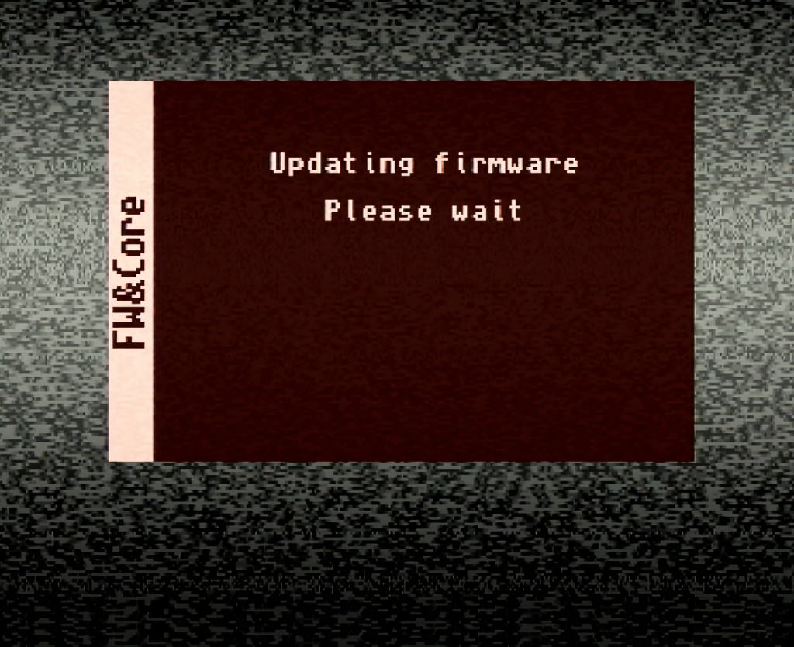
|===

[start=8]
. Copiar el fichero `.UF2` correspondiente a la unidad de disco que aparecerá disponible en el ordenador. Una vez se haya grabado correctamente, la unidad desaparecerá de forma automática

[role="center",width="40%",cols="1a", frame=none, grid=none]
|===
|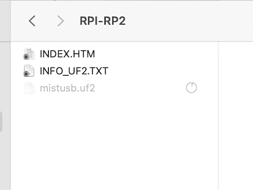
|===

La FPGA se reiniciará automáticamente, y volverá a cargar el core por defecto.

[TIP]
====
También se puede actualizar el firmware si no se dispone de TV o monitor cerca del ordenador de la siguiente forma:

- Mantener pulsado el botón `BOOTSEL` de la parte inferior mientras se enciende el neptUNO+ .
- Dejar de pulsar el botón.

Como se ha visto anteriormente aparecerá una unidad de disco donde copiar el fichero `.UF2`.
====

<<<

=== Recuperación del firmware

En algunas situaciones (como por ejemplo, si el estado de la emulación de MIDI es incorrecta) puede ser necesario reinstalar completamente el firmware del https://www.raspberrypi.com/documentation/microcontrollers/raspberry-pi-pico.html%23rp2040-device[microcontrolador RP2040].

*Material necesario*:

- Ordenador con USB y compatible con Raspberry Pi Pico
- Cable con un extremo USB-A (para conectar con el neptUNO+) y el otro extremo adecuado para conectar con el ordenador (USB-C, USB-A, etc.)

[TIP]
====
Si no se dispone de un cable USB-A a USB-A, puede ser útil utilizar un cable USB-A a USB-C y luego un adaptador de USB-C a USB-A
====

*Software necesario*:

- Obtener los archivos 
UF2 adecuados para el microcontrolador a recuperar, desde el https://github.com/ZXMicroJack/mist-firmware-rp2040/releases[repositorio del proyecto] (fichero con un nombre del tipo `debrick…zip`):

** `common/ct2mgm8ba.uf2`
** `common/ct8mgm.uf2`
** `common/luttables2.uf2`
** `neptuno/mistusb.uf2`

*Pasos a seguir*:

. Apagar el neptUNO+ si estuviera encendido, y conectar con el cable USB al ordenador
. Mantener pulsado el botón `BOOTSEL` de la parte inferior mientras se enciende.
. Dejar de pulsar el botón.
. Copiar el fichero y esperar brevemente a que se apliquen los cambios

Repetir los tres pasos anteriores, para cada fichero, exactamente en el orden que se indica a continuación

[role="center",width="90%",options="header",cols=2*]
|===
|Orden|Fichero
|1|`ct2mgm8ba.uf2`
|2|`ct8mgm.uf2`
|3|`luttables2.uf2`
|4|`mistusb.uf2`
|===

<<<

== Cores

Un core consiste en la información necesaria para que la FPGA se comporte como el sistema a implementar (ZX Spectrum, etc.). esta información se puede cargar desde varios lugares distintos: una tarjeta microSD, o desde algún dispositivo externo (PC, etc.) utilizando un cable programador especial (JTAG).

=== Menú

Normalmente cuando se inicia la FPGA con el firmware de MiST se configura el core por defecto para que sea el menú de carga de cores, que accede al contenido de la tarjeta microSD y muestra los nombres de los ficheros `.rbf` que encuentre en su interior.

[role="center",width="55%",cols="1a", frame=none, grid=none]
|===
|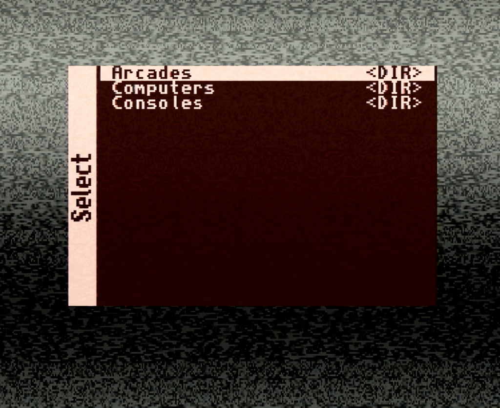
|===

Se pueden utilizar las teclas de cursor o el mando para desplazarse por la lista, y pulsar `Enter` o el botón principal del mando para cargar el core deseado. También se puede utilizar el teclado de forma que, al pulsar una tecla de una letra, se desplazará la lista al primer fichero cuyo nombre comience con la misma (o si no, con la letra más cercana).

<<<

Pulsando la tecla `F12` se accede al menú de configuración del core.

[role="center",width="75%",cols="1a", frame=none, grid=none]
|===
|
|===

Cuando la salida está configurada como RGB, es posible cambiar el tipo de señal de vídeo entre PAL y NTSC.

También se puede rotar 90 grados a izquierda o derecha el menú. Esto es útil para cores en los que el vídeo se muestra en un formato vertical en vez de horizontal.

[role="center",width="50%",cols="1a", frame=none, grid=none]
|===
|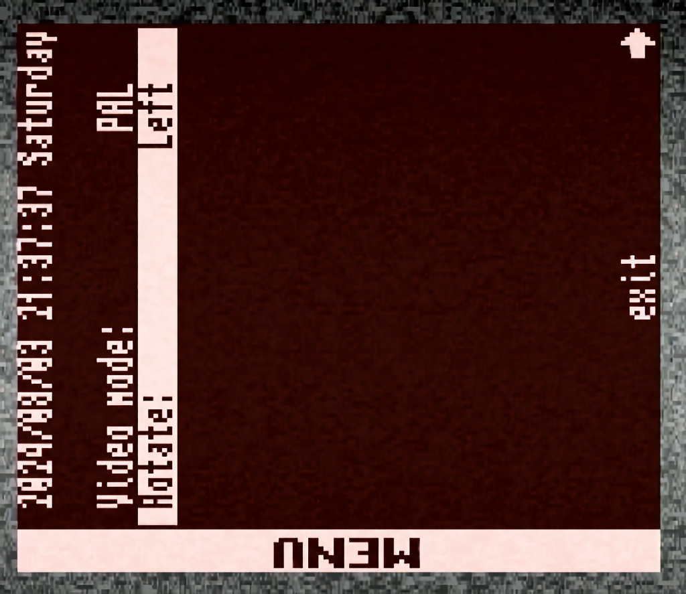
|===

<<<

==== Formato de Tarjeta microSD

Como ya se ha <<#_creación_de_microsd_básica,explicado anteriormente>>, la tarjeta microSD a utilizar ha de tener formato exFAT o FAT32, y se han de copiar en la raíz los ficheros `.rbf` de los cores que se desee utilizar.

===== Incluir cores en subdirectorios

También es posible agrupar los distintos cores dentro de directorios y subdirectorios. Estos deben tener https://en.wikipedia.org/wiki/Design_of_the_FAT_file_system#attributes[el atributo `system`] asignado. Esto se puede conseguir utilizando los comandos `fatattr` en Linux, `attrib` en Windows o `mattrib` en macOS.

El atributo se tiene asignar al directorio donde se encuentre el fichero de core, y a todos los directorios intermedios desde la raíz.

Por ejemplo

[source]
----
    /
    +-Arcades/ [+s]
    |  +-jtoutrun.rbf
    |  +-Tetris.rbf
    |  (...)
    |
    +-Consolas/ [+s]
    |  +-1a Generacion/ [+s]
    |    +-NES.rbf
    |  (...)
    |  +-2a Generacion/ [+s]
    |  (...)
    |
    +-ROMs/
    |  +-NES/
    |    (...)
    |
    +-core.rbf
    +-mist.ini
----

[NOTE]
====
`[+s]` indica un directorio que tiene asignado el atributo `system`
====

<<<

====== Windows

Ejecutar el comando `attrib` para añadir el atributo de sistema a todos los directorios donde haya archivos RBF de core (incluyendo los directorios superiores, si los hubiera).

Por ejemplo, para los directorios `Computer` y `Console` en la raíz de la tarjeta (que, en este ejemplo, tendría asignada la unidad `E:`):

[source,shell]
----
attrib +S E:\Computer
attrib +S E:\Console
----

Al finalizar, expulsar la microSD para usarla.

====== Linux

Se puede utilizar https://manpages.org/fatattr/1[fatattr]:

Ejecutar el comando para añadir el atributo de sistema a todos los directorios donde haya archivos RBF de core (incluyendo los directorios superiores, si los hubiera).

Por ejemplo, para los directorios `Computer` y `Console` en la raíz de una tarjeta montada en `/mnt/SD`:

[source,shell]
----
fatattr +s /mnt/SD/Computer
fatattr +s /mnt/SD/Console
----

Finalmente, expulsar la SD para usarla.

<<<

====== macOS

Este procedimiento para añadir el atributo de sistema sólo es válido para discos formateados con FAT16 o FAT32. Para unidades con formato exFat, se ha de usar otro sistema operativo que no sea macOS.

Primero se han de instalar https://www.gnu.org/software/mtools[mtools], por ejemplo, usando https://www.jetify.com/devbox[devbox] o https://brew.sh[Homebrew]:

[source,shell]
----
brew install mtools
----

Averiguar el dispositivo asociado a la tarjeta microSD

[source,shell]
----
diskutil list
----

Editar `~/.mtoolsrc` (en este ejemplo, el dispositivo encontrado es `/dev/disk9s1`)

[source]
----
drive s: file="/dev/disk9s1"
mtools_skip_check=1
----

Desmontar la unidad

[source,shell]
----
diskutil unmount /dev/disk6s1
----

Ejecutar, con permisos elevados, el comando `mattrib` para añadir permisos a todos los directorios donde haya archivos RBF de core (incluyendo los directorios superiores, si los hubiera).

Por ejemplo, para los directorios `Computer` y `Console` en la raíz de la tarjeta:

[source,shell]
----
sudo mattrib +s s:/Computer
sudo mattrib +s s:/Console
----

Finalmente, expulsar la SD completa para usarla:

[source,shell]
----
diskutil unmountDisk /dev/disk6
----

<<<

===== Ocultar ficheros de core

Útil cuando un core (RBF) se invoca desde varios <<#_mra_tool,ficheros ARC>, y sólo se quieren ver estos últimos.

====== Windows

Se puede usar el comando `attrib`. Por ejemplo (para un fichero RBF en la unidad `E:`):

[source,shell]
----
attrib +H E:\Arcade\JOTEGO-CPS1\jtcps1.rbf
----

Para volver a hacer visible el fichero:

[source,shell]
----
attrib -H E:\Arcade\JOTEGO-CPS1\jtcps1.rbf
----

====== Linux

Se puede utilizar https://manpages.org/fatattr/1[fatattr]:

Por ejemplo,(para un fichero RBF en una tarjeta montada en `/mnt/SD`):

[source,shell]
----
fatattr +h /mnt/SD/Arcade/JOTEGO-CPS1/jtcps1.rbf
----

Para volver a hacer visible el fichero:

[source,shell]
----
fatattr -h /mnt/SD/Arcade/JOTEGO-CPS1/jtcps1.rbf
----

====== macOS

Se puede usar el comando `chflags`. Por ejemplo:

[source,shell]
----
chflags hidden /Volumes/NeptunoPlus/Arcade/JOTEGO-CPS1/jtcps1.rbf
----

Para volver a hacer visible el fichero:

[source,shell]
----
chflags nohidden /Volumes/NeptunoPlus/Arcade/JOTEGO-CPS1/jtcps1.rbf
----

<<<

[%always]
<<<

=== Arcades (Máquinas recreativas)

La mayoría de los cores de máquina recreativa (o arcade) necesitan para funcionar ficheros con las https://es.wikipedia.org/wiki/Imagen_ROM[imágenes ROM] de los chips de la máquina original, agregados dentro de un único fichero `.ROM`, junto con un fichero `.ARC` que contiene el nombre del core RBF, el nombre del fichero ROM a cargar, así como la configuración de los https://es.wikipedia.org/wiki/Interruptor_DIP[interruptores DIP].

Tanto los ficheros ROM como los ficheros ARC se pueden crear utilizando <<#_mra_tool,MRA Tool>>, tomando como referencia los <<#_juegos_por_core,ficheros MRA>> normalmente disponibles en el repositorio del creador del core original.

Los ficheros ARC y ROM se pueden alojar en cualquier lugar de la tarjeta microSD, pero siempre en el mismo directorio que el fichero RBF correspondiente.

==== Utilidades y herramientas

===== MRA Tool

Esta es una herramienta que sirve para fusionar ficheros ROM de https://www.mamedev.org[MAME] de distintas maneras, usando un fichero de configuración MRA. También es útil para generar todo tipo de blobs binarios. Se puede descargar desde https://github.com/kounch/mra-tools-c/tree/master/release[GitHub], y se utiliza de la siguiente manera.

Para generar los correspondientes ficheros ROM y ARC para su uso con un core de máquina recreativa (arcade) de neptUNO+

[source,shell]
----
...mra <fichero.mra> -A -z <directorio ROMs> -O <directorio resultado>
----

Donde `<fichero.mra>` es la ruta al fichero MRA a tomar como referencia, `<directorio ROMs>` es la ubicación donde estén los ficheros ZIP com imágenes ROM de MAME, y `<directorio destino>` es la ubicación donde se desea que se creen los nuevos archivos ARC y ROM.

Para obtener una descripción de los distintos parámetros de uso de la herramienta:

[source,shell]
----
...mra -h
----

[WARNING]
====
En algunos casos, es importante asegurarse de que el fichero `MRA` sea de una versión creada en una fecha cercana a cuando se sintetizó el core correspondiente.

Algunos proyectos realizan actualizaciones no sólo en el core sino en los ficheros `MRA` asociados, y utilizar una versión incorrecta de estos (y por tanto de los ficheros `ARC` y `ROM` generados), puede provocar que la ROM se comporte de forma extraña, los gráficos aparezcan en pantalla distorsionados, o incluso que no funcione en absoluto.
====

<<<

===== ARC and ROM Builder

https://github.com/kounch/ARC_ROM_Builder[ARC and ROM Builder] es una herramienta que facilita la creación de ARC y ROM para algunos cores arcade. Existe versión binaria para Windows y macOS, así como una versión en script que requiere Python 3.9 para funcionar.

Para utilizarla, copiar el fichero `ARC_ROM_Builder…` correspondiente junto con `cores_neptunoplus.json` en un directorio con suficiente espacio disponible (al menos, 3,5GB), y usar el ejecutable o el script:

[source]
----
python3 ARC_ROM_Builder.py -d neptunoplus
----

En el caso de Windows:

[source]
----
ARC_ROM_Builder.exe -d neptunoplus
----

o bien (para usar el script de Python directamente en Windows)

[source]
----
..python.exe ARC_ROM_Builder.py -d neptunoplus
----

'''

A continuación se enumeran los cores de máquina recreativa existentes en el momento de redactarse este manual.

<<<

==== Alpha Denshi M68000

Alpha Densi (posteriormente https://es.wikipedia.org/wiki/ADK_Corporation[ADK]) es un fabricante de videojuegos para máquinas recreativas arcade en los años 80.

Este core implementa el hardware de las placas arcade basadas en M68000 (ALPHA68K96V), y permite ejecutar ROM de varios juegos (consultar <<#_alpha_densi_m68000_hardware,la sección de referencias para más información>>)

La versión para neptUNO+ está basada en https://github.com/mist-devel/mist-binaries/tree/master/cores/arcade/Alpha%20Densi%20M68000%20Hardware[la implementación para MiST], que está a su vez basada en la https://github.com/va7deo/alpha68k/tree/main[implementación para MiSTer].

Algunas de las características del core son:

- Salida de vídeo VGA y RGB
- Simulación de línea de exploración (Scanlines)
- Suavizado de imagen (Blending)

===== Formato de Tarjeta microSD

Se debe utilizar una tarjeta microSD, con la primera partición en formato exFAT o FAT32, donde se hayan copiado los ficheros ARC y ROM correspondientes de los juegos.

Para <<#_mra_tool,crear los ficheros ROM y ARC>>, se pueden obtener los ficheros MRA correspondientes del https://github.com/Gehstock/Mist_FPGA_Cores/tree/master/Arcade_MiST/Alpha%20Densi%20M68000%20Hardware/meta[repositorio de la versión original para MiST].

===== Controles

====== Teclas especiales y botones

Durante la ejecución del core:

- `F12` o botones `Start+Select` de un mando: mostrar el menú de control del core
- Teclas de cursor: Controles de dirección del jugador uno
- `Ctrl`, `Alt` y `Espacio`: Botones 1, 2 y 3 del jugador uno
- `R`,`D`,`F`,`G`: Movimiento del jugador dos
- `A`, `S` y `Q`: Botones 1, 2 y 3 del jugador dos
- `1` ó `2`: Iniciar partida 1 ó 2 jugadores
- `5` y `6`: Insertar una moneda

<<<

===== Guía básica

Al pulsar `F12`, se mostrará el menú con las distintas opciones del core. Se puede navegar utilizando las teclas de cursor. `Enter` selecciona un elemento.

[role="center",width="50%",cols="1a", frame=none, grid=none]
|===
|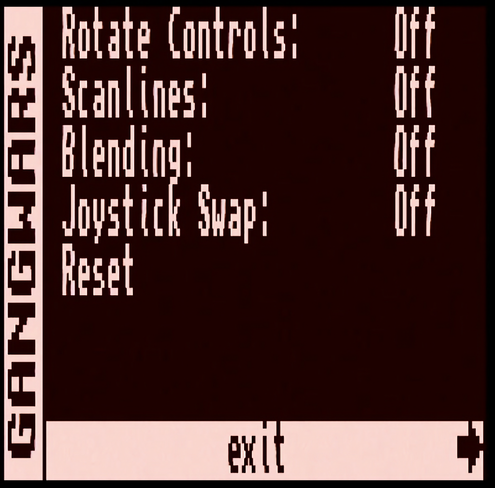
|===

Estas son las principales:

- `Rotate Controls`: Para girar el texto del menú de opciones, así como el comportamiento de los controles de dirección
- `Scanlines`: Para añadir un efecto de líneas de exploración (sólo con salida VGA)
- `Blending`: Para activar si se desea, un efecto de suavizado de la imagen
- `Joystick Swap`: Para intercambiar los controles del jugador 1 y el jugador 2
- `Switches`: Accede a ver y modificar el estado de los https://es.wikipedia.org/wiki/Interruptor_DIP[interruptores DIP] que haya definidos en el fichero ARC cargado actualmente
- `Reset`: Soft Reset (reinicia el Core)
- `Exit`: Cierra el menú

<<<

==== Atari Centipede

https://es.wikipedia.org/wiki/Centipede_(videojuego][Atari Centipede] es un videojuego de arcade publicado en 1981 por Atari.

Este core permite ejecutar ROM de varios juegos (consultar <<#_atari_centipede_hardware,la sección de referencias para más información>>).

La versión para neptUNO+ está basada en https://github.com/mist-devel/mist-binaries/tree/master/cores/arcade/Atari%20Centipede%20Hardware[la implementación existente para MiST].

Algunas de las características del core son:

- Salida de vídeo VGA y RGB
- Simulación de línea de exploración (Scanlines)
- Suavizado de imagen (Blending)
- Soporte para mando

===== Formato de Tarjeta microSD

Se debe utilizar una tarjeta microSD, con la primera partición en formato exFAT o FAT32, donde se hayan copiado los ficheros ARC y ROM correspondientes de los juegos.

Para <<#_mra_tool,crear los ficheros ROM y ARC>>, se pueden obtener los ficheros MRA correspondientes del https://github.com/mist-devel/mist-binaries/tree/master/cores/arcade/Atari%20Centipede%20Hardware[repositorio de la versión original para MiST].

===== Controles

====== Teclas especiales y botones

Durante la ejecución del core:

- `F12` o botones `Start+Select` de un mando: mostrar el menú de control del core
- Teclas de cursor o el mando 1: Controles de dirección
- `Ctrl`, o botón `A` del mando 1: Botón 1 del jugador uno
- `1`: Iniciar partida 1 jugador
- `5`: Insertar una moneda

<<<

===== Guía básica

Al pulsar `F12`, se mostrará el menú con las distintas opciones del core. Se puede navegar utilizando las teclas de cursor. `Enter` selecciona un elemento.

[role="center",width="50%",cols="1a", frame=none, grid=none]
|===
|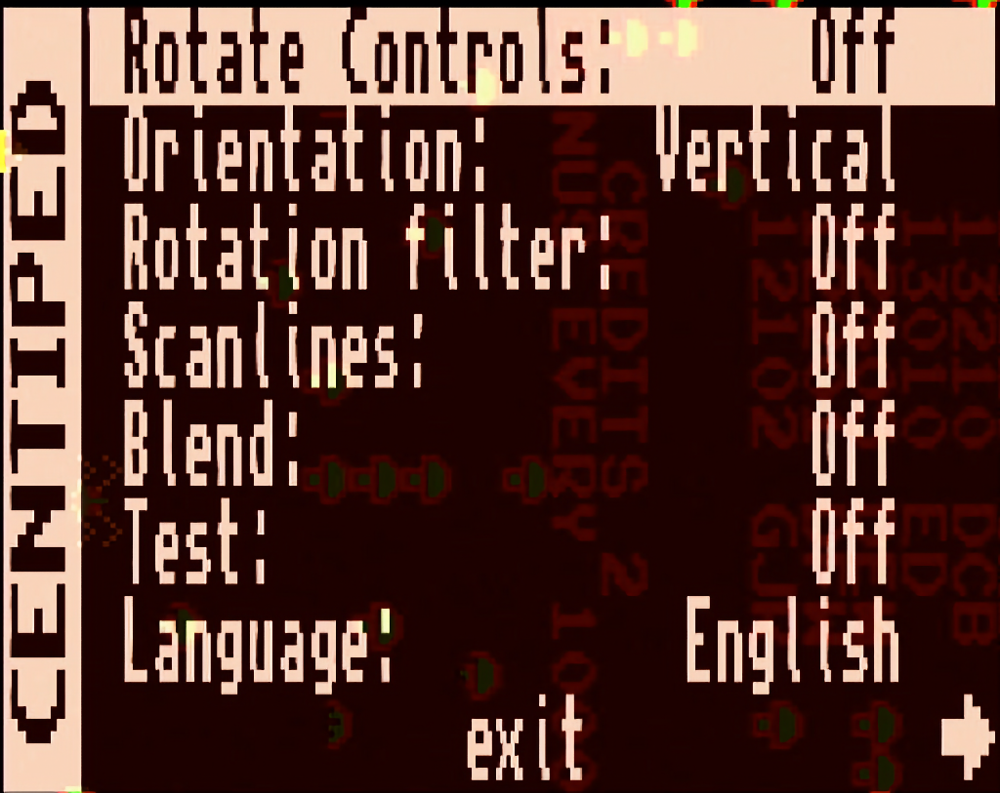
|===

Estas son las principales:

- `Rotate Controls`: Para girar el texto del menú de opciones, así como el comportamiento de los controles de dirección
- `Orientation`:  Define la orientación
- `Rotation Filter`: Define filtro de rotado
- `Scanlines`: Para añadir un efecto de líneas de exploración (sólo con salida VGA)
- `Blend`: Para activar si se desea, un efecto de suavizado de la imagen
- `Test`: Para activar el modo test de la placa (requiere realizar reset)
- `Language`: Para definir el idioma a utilizar
- `Save highscores`: Guarda en la tarjeta microSD los récords
- `Reset`: Soft Reset (reinicia el Core)
- `Exit`: Cierra el menú

Además, aparecerán otras opciones para ver y modificar el estado de los https://es.wikipedia.org/wiki/Interruptor_DIP[interruptores DIP] que haya definidos en el fichero ARC cargado actualmente.

<<<

==== Bagman

https://en.wikipedia.org/wiki/Bagman_(video_game)[Bagman] es un videojuego de arcade publicado en 1983 por Valadon Automation.

Este core permite ejecutar ROM de varios juegos (consultar <<#_bagman_hardware,la sección de referencias para más información>>).

La versión para neptUNO+ está basada en https://github.com/mist-devel/mist-binaries/tree/master/cores/arcade/Bagman%20Hardware[la implementación existente para MiST].

Algunas de las características del core son:

- Salida de vídeo VGA y RGB
- Simulación de línea de exploración (Scanlines)
- Suavizado de imagen (Blending)
- Soporte para mando

===== Formato de Tarjeta microSD

Se debe utilizar una tarjeta microSD, con la primera partición en formato exFAT o FAT32, donde se hayan copiado los ficheros ARC y ROM correspondientes de los juegos.

Para <<#_mra_tool,crear los ficheros ROM y ARC>>, se pueden obtener los ficheros MRA correspondientes del https://github.com/mist-devel/mist-binaries/tree/master/cores/arcade/Bagman%20Hardware[repositorio de la versión original para MiST].

===== Controles

====== Teclas especiales y botones

Durante la ejecución del core:

- `F12` o botones `Start+Select` de un mando: mostrar el menú de control del core
- Teclas de cursor o el mando 1: Controles de dirección
- `Ctrl` o botón `A` del mando 1: Botón del jugador uno
- `R`,`D`,`F`,`G` o el mando 2: Movimiento del jugador dos
- `A` o botón `A` del mando 2: Botón del jugador dos
- `1` ó `2`: Iniciar partida 1 ó 2 jugadores
- `5` y `6`: Insertar una moneda

<<<

===== Guía básica

Al pulsar `F12`, se mostrará el menú con las distintas opciones del core. Se puede navegar utilizando las teclas de cursor. `Enter` selecciona un elemento.

[role="center",width="50%",cols="1a", frame=none, grid=none]
|===
|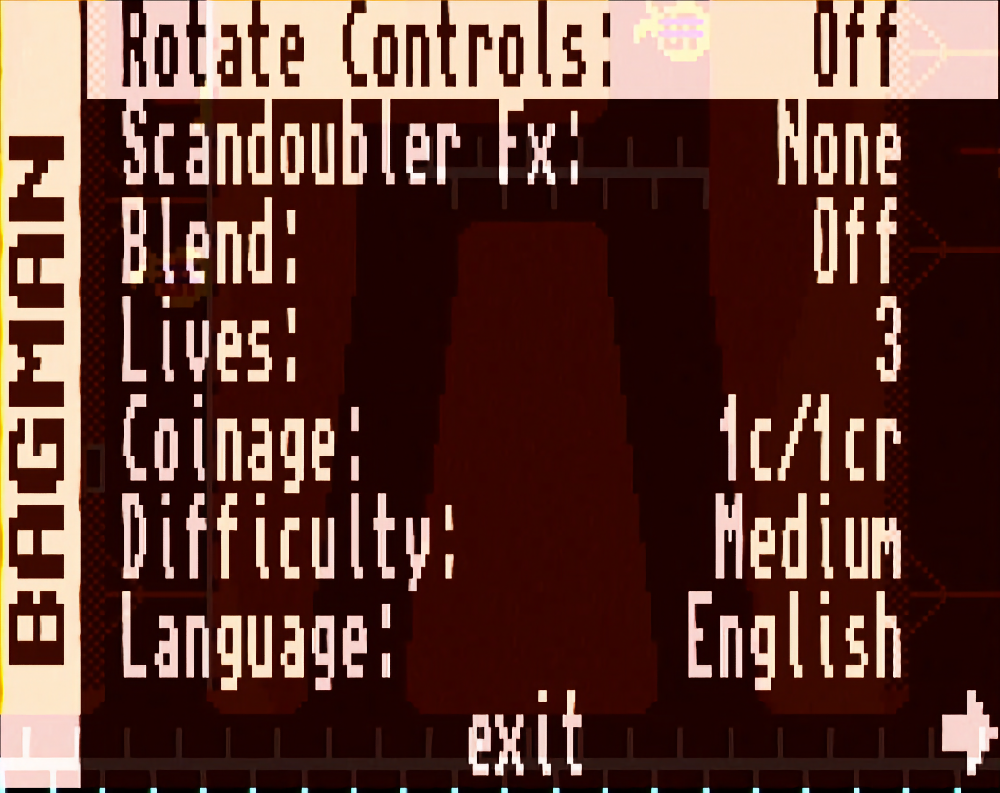
|===

Estas son las principales:

- `Rotate Controls`: Para girar el texto del menú de opciones, así como el comportamiento de los controles de dirección
- `Scandoubler Fx`: Para añadir un efecto de líneas de exploración (sólo con salida VGA)
- `Blend`: Para activar si se desea, un efecto de suavizado de la imagen
- `Reset`: Soft Reset (reinicia el Core)
- `Exit`: Cierra el menú

<<<

==== Crazy Climber

https://es.wikipedia.org/wiki/Crazy_Climber[Crazy Climber] es un videojuego producido por Nichibutsu (Nihon Bussan) y lanzado en salas recreativas en 1980.

Este core permite ejecutar ROM de varios juegos (consultar <<#_crazy_climber_hardware,la sección de referencias para más información>>).

La versión para neptUNO+ está basada en https://github.com/mist-devel/mist-binaries/tree/master/cores/arcade/Crazy%20Climber%20Hardware[la implementación existente para MiST].

Algunas de las características del core son:

- Salida de vídeo VGA y RGB
- Simulación de línea de exploración (Scanlines)
- Suavizado de imagen (Blending)
- Soporte para mando

===== Formato de Tarjeta microSD

Se debe utilizar una tarjeta microSD, con la primera partición en formato exFAT o FAT32, donde se hayan copiado los ficheros ARC y ROM correspondientes de los juegos.

Para <<#_mra_tool,crear los ficheros ROM y ARC>>, se pueden obtener los ficheros MRA correspondientes del https://github.com/mist-devel/mist-binaries/tree/master/cores/arcade/Crazy%20Climber%20Hardware[repositorio de la versión original para MiST].

===== Controles

====== Teclas especiales y botones

Durante la ejecución del core:

- `F12` o botones `Start+Select` de un mando: mostrar el menú de control del core
- Teclas de cursor o el mando: Controles de dirección
- `Ctrl` o botón `A` del mando: Botón del jugador
- `1` ó `2`: Iniciar partida 1 ó 2 jugadores
- `5` y `6`: Insertar una moneda

<<<

===== Guía básica

Al pulsar `F12`, se mostrará el menú con las distintas opciones del core. Se puede navegar utilizando las teclas de cursor. `Enter` selecciona un elemento.

[role="center",width="50%",cols="1a", frame=none, grid=none]
|===
|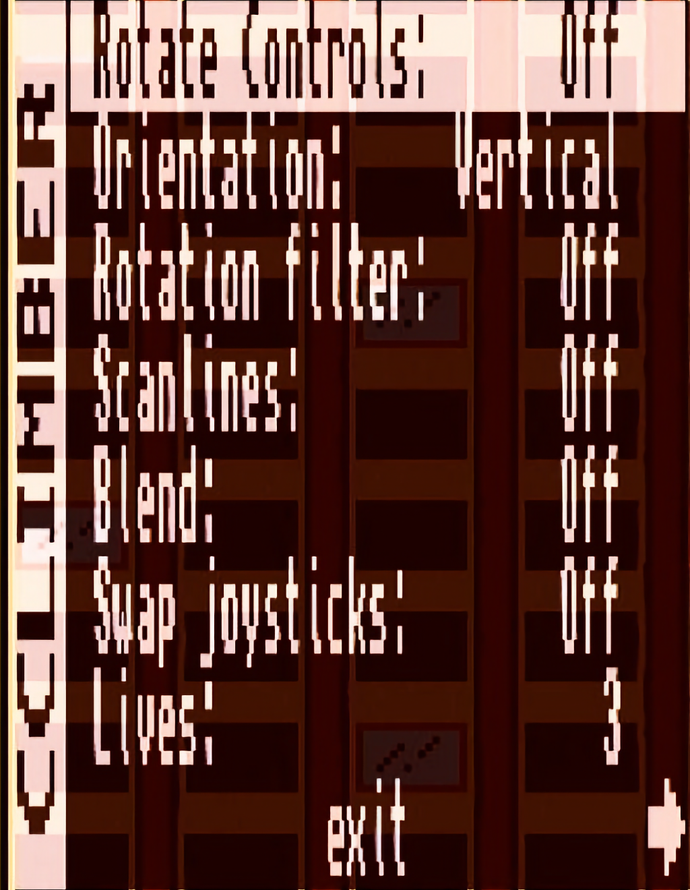
|===

- `Rotate Controls`: Para girar el texto del menú de opciones, así como el comportamiento de los controles de dirección
- `Orientation`:  Define la orientación
- `Rotation Filter`: Define filtro de rotado
- `Scanlines`: Para añadir un efecto de líneas de exploración (sólo con salida VGA)
- `Blend`: Para activar si se desea, un efecto de suavizado de la imagen
- `Swap Joystick`: Para intercambiar los controles del jugador 1 y el jugador 2
- `Reset`: Soft Reset (reinicia el Core)
- `Exit`: Cierra el menú

Además, aparecerán otras opciones para ver y modificar el estado de los https://es.wikipedia.org/wiki/Interruptor_DIP[interruptores DIP] que haya definidos en el fichero ARC cargado actualmente.

<<<

==== Data East Express Raider

Express Raider, conocido en Japón es un juego de acción desarrollado por Data East y lanzado en 1986 para máquinas recreativas.

La versión de core para neptUNO+ está basada en https://github.com/mist-devel/mist-binaries/tree/master/cores/arcade/Data%20East%20Express%20Raider[la implementación existente para MiST].

Algunas de las características del core son:

- Salida de vídeo VGA y RGB
- Simulación de línea de exploración (Scanlines)
- Suavizado de imagen (Blending)
- Soporte para mando

===== Formato de Tarjeta microSD

Se debe utilizar una tarjeta microSD, con la primera partición en formato exFAT o FAT32, donde se hayan copiado los ficheros ARC y ROM correspondientes de los juegos.

Para <<#_mra_tool,crear los ficheros ROM y ARC>>, se pueden obtener los ficheros MRA correspondientes del https://github.com/mist-devel/mist-binaries/tree/master/cores/arcade/Data%20East%20Express%20Raider[repositorio de la versión original para MiST].

===== Controles

====== Teclas especiales y botones

Durante la ejecución del core:

- `F12` o botones `Start+Select` de un mando: mostrar el menú de control del core
- Teclas de cursor o el mando: Controles de dirección
- `Ctrl`, `Alt` o botones `A`, `B` del mando: Botones 1, 2 del jugador
- `1` y `2`: Iniciar partida
- `5` y `6`: Insertar una moneda

<<<

===== Guía básica

Al pulsar `F12`, se mostrará el menú con las distintas opciones del core. Se puede navegar utilizando las teclas de cursor. `Enter` selecciona un elemento.

[role="center",width="50%",cols="1a", frame=none, grid=none]
|===
|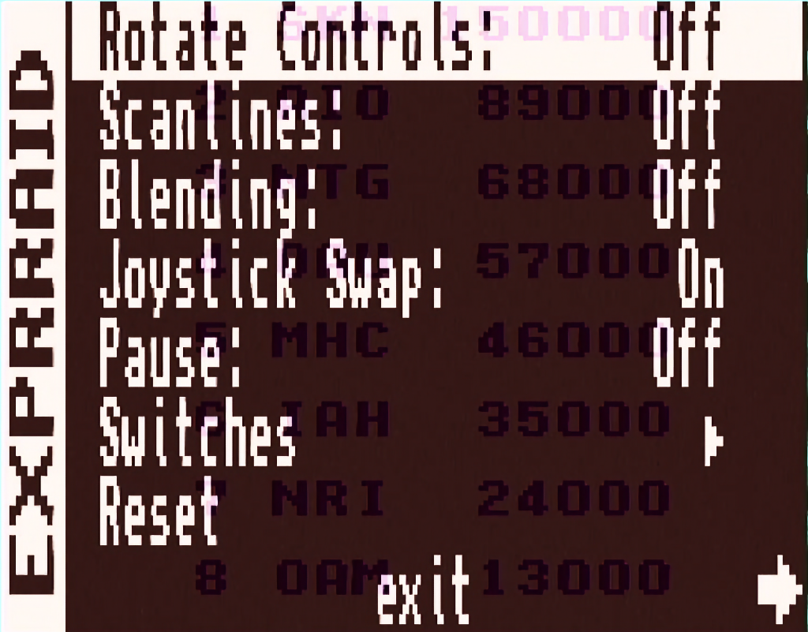
|===

Estas son las principales:

- `Rotate Controls`: Para girar el texto del menú de opciones, así como el comportamiento de los controles de dirección
- `Scanlines`: Para añadir un efecto de líneas de exploración (sólo con salida VGA)
- `Blending`: Para activar si se desea, un efecto de suavizado de la imagen
- `Joystick Swap`: Para intercambiar el puerto utilizado para los controles del jugador
- `Pause`: Para activar y desactivar la pausa
- `Switches`: Permite ver y modificar el estado de los https://es.wikipedia.org/wiki/Interruptor_DIP[interruptores DIP] que haya definidos en el fichero ARC cargado actualmente.
- `Reset`: Soft Reset (reinicia el Core)
- `Exit`: Cierra el menú

<<<

==== Irem M-52

https://es.wikipedia.org/wiki/Irem_M-52[Irem M-52] es una placa de máquina recreativa creada y lanzada por Irem en 1982.

Este core permite ejecutar ROM de varios juegos ejecutar ROM de varios juegos (consultar <<#_irem_m_52_hardware,la sección de referencias para más información>>).

La versión para neptUNO+ está basada en https://github.com/mist-devel/mist-binaries/tree/master/cores/arcade/IremM52%20Hardware[la implementación existente para MiST].

Algunas de las características del core son:

- Salida de vídeo VGA y RGB
- Simulación de línea de exploración (Scanlines)
- Suavizado de imagen (Blending)
- Soporte para mando

===== Formato de Tarjeta microSD

Se debe utilizar una tarjeta microSD, con la primera partición en formato exFAT o FAT32, donde se hayan copiado los ficheros ARC y ROM correspondientes de los juegos.

Para <<#_mra_tool,crear los ficheros ROM y ARC>>, se pueden obtener los ficheros MRA correspondientes del https://github.com/mist-devel/mist-binaries/tree/master/cores/arcade/IremM52%20Hardware[repositorio de la versión original para MiST].

===== Controles

====== Teclas especiales y botones

Durante la ejecución del core:

- `F12` o botones `Start+Select` de un mando: mostrar el menú de control del core
- Teclas de cursor o el mando: Controles de dirección
- `Ctrl` o botón `A` del mando: Botón 1 del jugador
- `1` y `2`: Iniciar partida
- `5`: Insertar una moneda

<<<

===== Guía básica

Al pulsar `F12`, se mostrará el menú con las distintas opciones del core. Se puede navegar utilizando las teclas de cursor. `Enter` selecciona un elemento.

[role="center",width="50%",cols="1a", frame=none, grid=none]
|===
|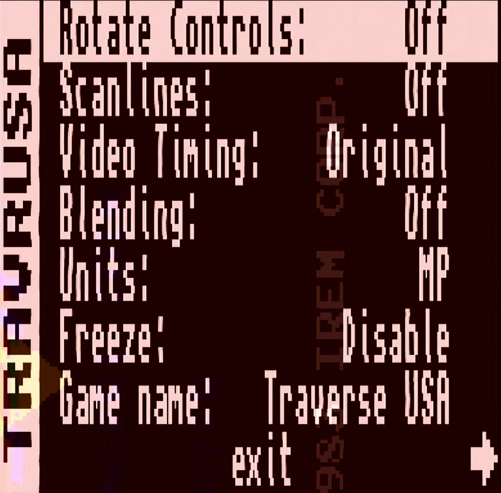
|===

Estas son las principales:

- `Rotate Controls`: Para girar el texto del menú de opciones, así como el comportamiento de los controles de dirección
- `Scanlines`: Para añadir un efecto de líneas de exploración (sólo con salida VGA)
- `Video Timing`: Para modificar la configuración de la sincronización de vídeo
- `Blending`: Para activar si se desea, un efecto de suavizado de la imagen
- `Units`: Para configurar las unidades de velocidad
- `Freeze`: Para activar y desactivar la pausa
- `Game Name`: Nombre del juego cargado
- `Demo Mode`: Activar o desactivar el modo de demostración
- `Test Mode` Activar o desactivar el modo de prueba
- `Reset`: Soft Reset (reinicia el Core)
- `Exit`: Cierra el menú

<<<

==== Irem M-57

Irem M-57 es una placa de máquina recreativa creada y lanzada por Irem en 1983.

Este core permite ejecutar ROM de varios juegos (consultar <<#_irem_m_57_hardware,la sección de referencias para más información>>).

La versión para neptUNO+ está basada en https://github.com/mist-devel/mist-binaries/tree/master/cores/arcade/IremM57%20Hardware[la implementación existente para MiST].

Algunas de las características del core son:

- Salida de vídeo VGA y RGB
- Simulación de línea de exploración (Scanlines)
- Suavizado de imagen (Blending)
- Soporte para mando

===== Formato de Tarjeta microSD

Se debe utilizar una tarjeta microSD, con la primera partición en formato exFAT o FAT32, donde se hayan copiado los ficheros ARC y ROM correspondientes de los juegos.

Para <<#_mra_tool,crear los ficheros ROM y ARC>>, se pueden obtener los ficheros MRA correspondientes del https://github.com/mist-devel/mist-binaries/tree/master/cores/arcade/IremM57%20Hardware[repositorio de la versión original para MiST].

===== Controles

====== Teclas especiales y botones

Durante la ejecución del core:

- `F12` o botones `Start+Select` de un mando: mostrar el menú de control del core
- Teclas de cursor o el mando: Controles de dirección
- `Ctrl`, `Alt` o botones `A`, `B` del mando: Botones 1, 2 del jugador
- `1` y `2`: Iniciar partida
- `5` y `6`: Insertar una moneda

<<<

===== Guía básica

Al pulsar `F12`, se mostrará el menú con las distintas opciones del core. Se puede navegar utilizando las teclas de cursor. `Enter` selecciona un elemento.

[role="center",width="50%",cols="1a", frame=none, grid=none]
|===
|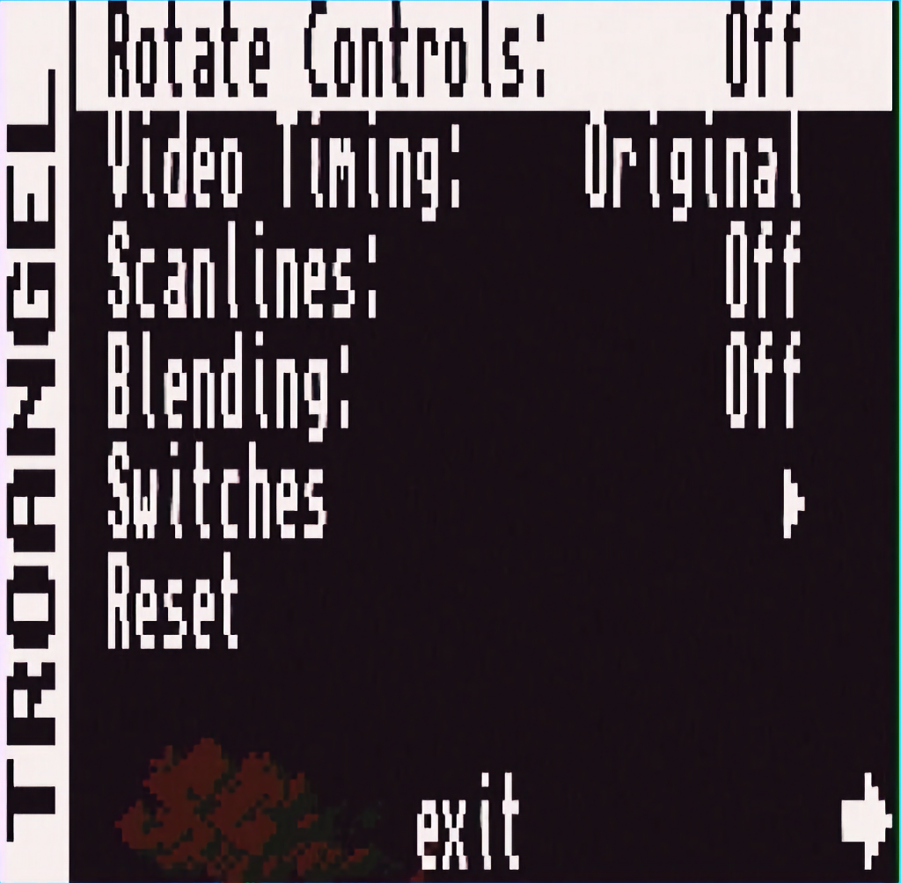
|===

Estas son las principales:

- `Rotate Controls`: Para girar el texto del menú de opciones, así como el comportamiento de los controles de dirección
- `Video Timing`: Para modificar la configuración de la sincronización de vídeo
- `Scanlines`: Para añadir un efecto de líneas de exploración (sólo con salida VGA)
- `Blending`: Para activar si se desea, un efecto de suavizado de la imagen
- `Switches`: Accede a ver y modificar el estado de los https://es.wikipedia.org/wiki/Interruptor_DIP[interruptores DIP] que haya definidos en el fichero ARC cargado actualmente
- `Reset`: Soft Reset (reinicia el Core)
- `Exit`: Cierra el menú

<<<

==== Irem M-62

https://es.wikipedia.org/wiki/Irem_M-62Irem M-62[Irem M-63] es una placa de máquina recreativa creada y lanzada por Irem en 1984.

Este core permite ejecutar ROM de varios juegos (consultar <<#_irem_m_62_hardware,la sección de referencias para más información>>).

La versión para neptUNO+ está basada en https://github.com/mist-devel/mist-binaries/tree/master/cores/arcade/IremM62%20Hardware[la implementación existente para MiST].

Algunas de las características del core son:

- Salida de vídeo VGA y RGB
- Simulación de línea de exploración (Scanlines)
- Suavizado de imagen (Blending)
- Soporte para mando

===== Formato de Tarjeta microSD

Se debe utilizar una tarjeta microSD, con la primera partición en formato exFAT o FAT32, donde se hayan copiado los ficheros ARC y ROM correspondientes de los juegos.

Para <<#_mra_tool,crear los ficheros ROM y ARC>>, se pueden obtener los ficheros MRA correspondientes del https://github.com/mist-devel/mist-binaries/tree/master/cores/arcade/IremM62%20Hardware[repositorio de la versión original para MiST].

===== Controles

====== Teclas especiales y botones

Durante la ejecución del core:

- `F12` o botones `Start+Select` de un mando: mostrar el menú de control del core
- Teclas de cursor o el mando: Controles de dirección
- `Ctrl`, `Alt` o botones `A`, `B` del mando: Botones 1, 2 del jugador
- `1` y `2`: Iniciar partida
- `5` y `6`: Insertar una moneda

<<<

===== Guía básica

Al pulsar `F12`, se mostrará el menú con las distintas opciones del core. Se puede navegar utilizando las teclas de cursor. `Enter` selecciona un elemento.

[role="center",width="50%",cols="1a", frame=none, grid=none]
|===
|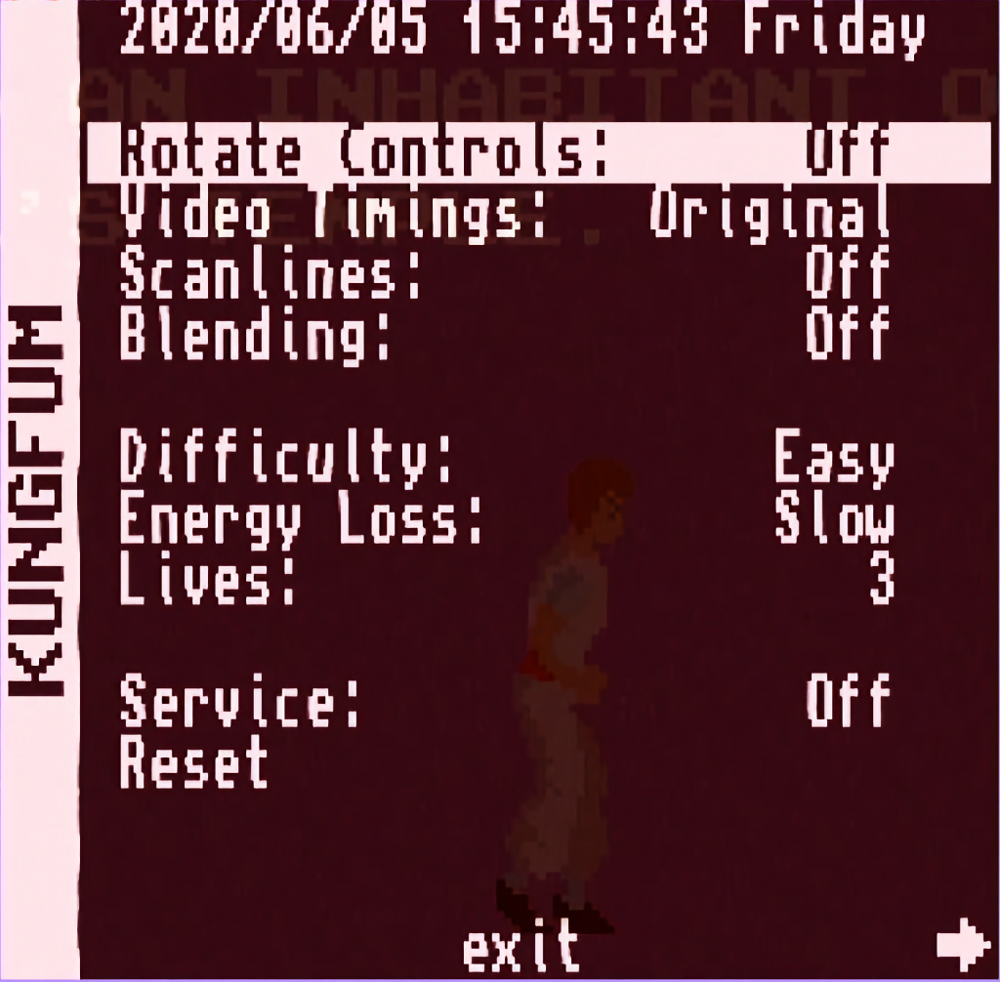
|===

Estas son las principales:

- `Rotate Controls`: Para girar el texto del menú de opciones, así como el comportamiento de los controles de dirección
- `Video Timings`: Para modificar la configuración de la sincronización de vídeo
- `Scanlines`: Para añadir un efecto de líneas de exploración (sólo con salida VGA)
- `Blending`: Para activar si se desea, un efecto de suavizado de la imagen
- `Reset`: Soft Reset (reinicia el Core)
- `Exit`: Cierra el menú

Además, aparecerán otras opciones para ver y modificar el estado de los https://es.wikipedia.org/wiki/Interruptor_DIP[interruptores DIP] que haya definidos en el fichero ARC cargado actualmente.

<<<

==== Irem M-72

https://es.wikipedia.org/wiki/Irem_M-72[Irem M-72] es una Placa de máquina recreativa creada por Irem y lanzada en 1984.

Este core permite ejecutar ROM de varios juegos (consultar <<#_irem_m_72_hardware,la sección de referencias para más información>>).

La versión para neptUNO+ está basada en https://github.com/mist-devel/mist-binaries/tree/master/cores/arcade/IremM72%20Hardware[la implementación existente para MiST].

Algunas de las características del core son:

[la implementación existente para MiST].

Algunas de las características del core son:

- Salida de vídeo VGA y RGB
- Simulación de línea de exploración (Scanlines)
- Suavizado de imagen (Blending)
- Control sobre la sincronización de vídeo
- Soporte para mando

===== Formato de Tarjeta microSD

Se debe utilizar una tarjeta microSD, con la primera partición en formato exFAT o FAT32, donde se hayan copiado los ficheros ARC y ROM correspondientes de los juegos.

Para <<#_mra_tool,crear los ficheros ROM y ARC>>, se pueden obtener los ficheros MRA correspondientes del https://github.com/mist-devel/mist-binaries/tree/master/cores/arcade/IremM72%20Hardware[repositorio de la versión original para MiST].

===== Controles

====== Teclas especiales y botones

Durante la ejecución del core:

- `F12` o botones `Start+Select` de un mando: mostrar el menú de control del core
- Teclas de cursor o el mando 1: Controles de dirección
- `Ctrl`, `Alt`: Botones 1, 2 del jugador uno
- `R`,`D`,`F`,`G`: Movimiento del jugador dos
- `A`, `S`: Botones 1, 2 del jugador dos
- `1` ó `2`: Iniciar partida 1 ó 2 jugadores
- `5` y `6`: Insertar una moneda

<<<

===== Guía básica

Al pulsar `F12`, se mostrará el menú con las distintas opciones del core. Se puede navegar utilizando las teclas de cursor. `Enter` selecciona un elemento.

[role="center",width="50%",cols="1a", frame=none, grid=none]
|===
|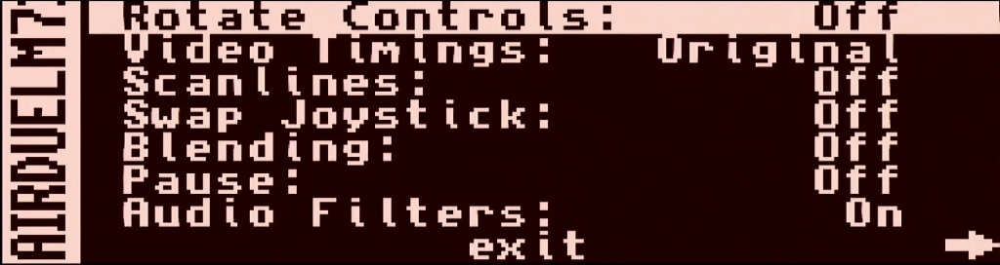
|===

Estas son las principales:

- `Rotate Controls`: Para girar el texto del menú de opciones, así como el comportamiento de los controles de dirección
- `Video Timings`: Para modificar la configuración de la sincronización de vídeo
- `Scanlines`: Para añadir un efecto de líneas de exploración (sólo con salida VGA)
- `Swap Joystick`: Para intercambiar los controles del jugador 1 y el jugador 2
- `Blending`: Para activar si se desea, un efecto de suavizado de la imagen
- `Pause`: Para activar y desactivar la pausa
- `Audio Filters`: Para desactivar o activar los filtros de audio
- `Switches`: Accede a ver y modificar el estado de los https://es.wikipedia.org/wiki/Interruptor_DIP[interruptores DIP] que haya definidos en el fichero ARC cargado actualmente
- `Reset`: Soft Reset (reinicia el Core)
- `Exit`: Cierra el menú

<<<

==== Irem M-92

https://es.wikipedia.org/wiki/Irem_M-92[Irem M-92] es una placa de máquina recreativa creada y lanzada por Irem en 1991.

Este core permite ejecutar ROM de varios juegos (consultar <<#_irem_m_92_hardware,la sección de referencias para más información>>).

La versión para neptUNO+ está basada en https://github.com/mist-devel/mist-binaries/tree/master/cores/arcade/IremM92%20Hardware[la implementación existente para MiST].

Algunas de las características del core son:

- Salida de vídeo VGA y RGB
- Simulación de línea de exploración (Scanlines)
- Soporte para mando
- Guardado de puntuaciones en microSD

===== Formato de Tarjeta microSD

Se debe utilizar una tarjeta microSD, con la primera partición en formato exFAT o FAT32, donde se hayan copiado los ficheros ARC y ROM correspondientes de los juegos.

Para <<#_mra_tool,crear los ficheros ROM y ARC>>, se pueden obtener los ficheros MRA correspondientes del https://github.com/mist-devel/mist-binaries/tree/master/cores/arcade/IremM92%20Hardware[repositorio de la versión original para MiST].

===== Controles

====== Teclas especiales y botones

Durante la ejecución del core:

- `F12` o botones `Start+Select` de un mando: mostrar el menú de control del core
- Teclas de cursor o el mando 1: Controles de dirección
- `Ctrl`, `Alt`: Botones 1, 2 del jugador uno
- `R`,`D`,`F`,`G`: Movimiento del jugador dos
- `A`, `S`: Botones 1, 2 del jugador dos
- `1` ó `2`: Iniciar partida 1 ó 2 jugadores
- `5` y `6`: Insertar una moneda

<<<

===== Guía básica

Al pulsar `F12`, se mostrará el menú con las distintas opciones del core. Se puede navegar utilizando las teclas de cursor. `Enter` selecciona un elemento.

[role="center",width="50%",cols="1a", frame=none, grid=none]
|===
|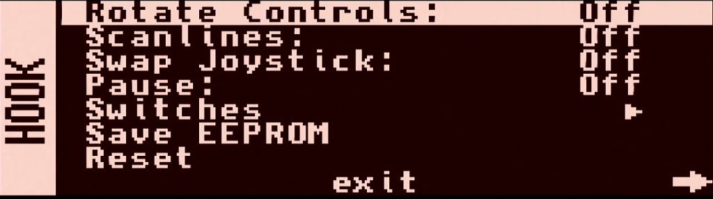
|===

Estas son las principales:

- `Rotate Controls`: Para girar el texto del menú de opciones, así como el comportamiento de los controles de dirección
- `Scanlines`: Para añadir un efecto de líneas de exploración (sólo con salida VGA)
- `Swap Joystick`: Para intercambiar los controles del jugador 1 y el jugador 2
- `Pause`: Para activar y desactivar la pausa
- `Switches`: Accede a ver y modificar el estado de los https://es.wikipedia.org/wiki/Interruptor_DIP[interruptores DIP] que haya definidos en el fichero ARC cargado actualmente
- `Save EEPROM`: Para guardar el contenido de la EEPROM (récords de puntuación) en la tarjeta microSD
- `Reset`: Soft Reset (reinicia el Core)
- `Exit`: Cierra el menú

<<<

==== Jaleco Mega System 1 A

Placa de sistema para máquinas recreativas fabricada por Jaleco en 1988. Fue sucedida por la placa Jaleco Mega System 32 en 1993.

Este core permite ejecutar ROM de varios juegos (consultar <<#_jaleco_mega_system_1_a_hardware,la sección de referencias para más información>>).

La versión para neptUNO+ está basada en la https://github.com/va7deo/MegaSys1_A/tree/main[versión original para MiSTer].

Algunas de las características del core son:

- La salida de vídeo mantiene la rotación del original
- Salida de vídeo VGA
- Salida de vídeo RGB (utilizando el puerto VGA)
- Soporte de mando real y mando emulado en teclado

===== Formato de Tarjeta microSD

Se debe utilizar una tarjeta microSD, con la primera partición en formato exFAT o FAT32, donde se hayan copiado los ficheros ARC y ROM correspondientes de los juegos.

Para <<#_mra_tool,crear los ficheros ROM y ARC>>, se pueden obtener los ficheros MRA correspondientes del https://github.com/ManuFerHi/SiDi-FPGA/tree/master/Cores/Arcade/MRA[repositorio de la versión del core para la FPGA SiDi 128].

===== Controles

====== Teclas especiales y botones

Durante la ejecución del core:

- `F12` o botones `Start+Select` de un mando: mostrar el menú de control del core
- Teclas de cursor o el mando 1: Controles de dirección del jugador uno
- `Ctrl`, `Alt` o botones `A`, `B` del mando 1: Botones 1, 2 del jugador uno
- `R`,`D`,`F`,`G` o mando 2: Movimiento del jugador dos
- `A`, `S` o botones `A`, `B` del mando 2: Botones 1, 2 del jugador dos
- `1` y `2` o botón `X` de un mando: Iniciar partida jugador 1 o jugador 2
- `5` y `6` o botón `R` o `L` de un mando: Insertar una moneda
- Botón `L2` de un mando: Pausa

<<<

===== Guía básica

Al pulsar `F12`, se mostrará el menú con las distintas opciones del core. Se puede navegar utilizando las teclas de cursor. `Enter` selecciona un elemento.

[role="center",width="50%",cols="1a", frame=none, grid=none]
|===
|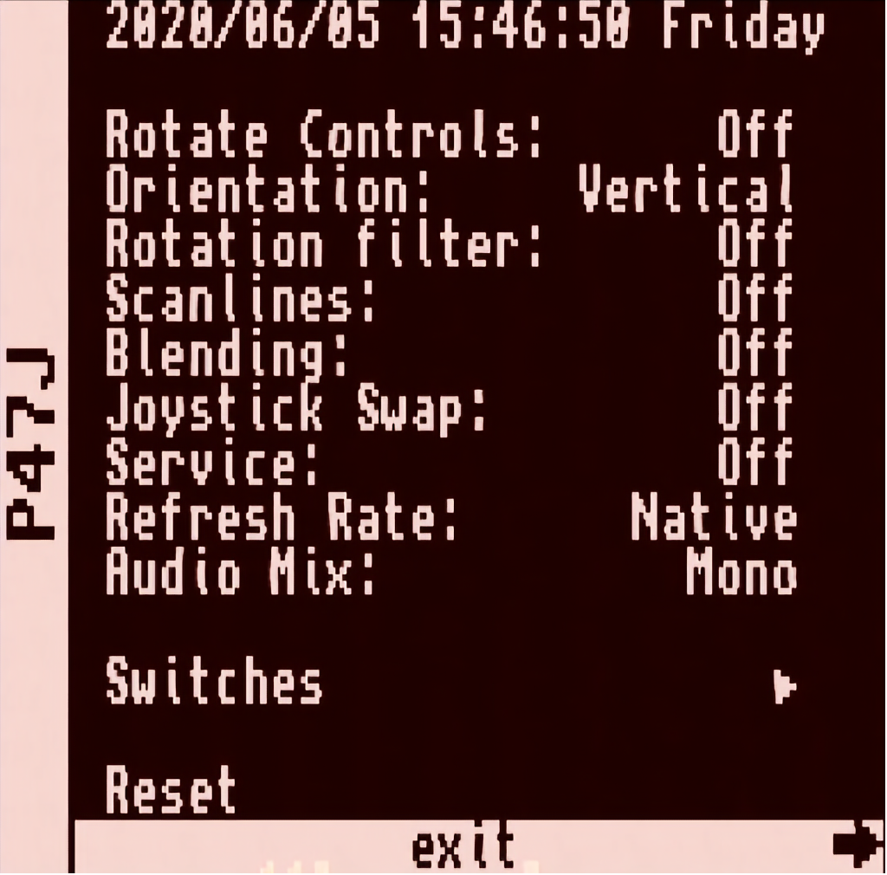
|===

- `Rotate Controls`: Para girar el texto del menú de opciones, así como el comportamiento de los controles de dirección
- `Orientation`:  Define la orientación
- `Rotation Filter`: Define filtro de rotado 
- `Scanlines`: Para añadir un efecto de líneas de exploración (sólo con salida VGA)
- `Blending`: Activa o desactiva un modo de suavizad de los bordes de la imagen
- `Joystick Swap`: Para intercambiar los controles del jugador 1 y el jugador 2
- `Service`: Activa o desactiva el modo de servicio
- `Refresh Rate`: Permite cambiar el modo de refresco de pantalla entre el nativo y otras opciones (NTSC)
- `Audio Mix`: Para configurar el modo de sonido entre mono y estéreo
- `Switches`: Accede a ver y modificar el estado de los https://es.wikipedia.org/wiki/Interruptor_DIP[interruptores DIP] que haya definidos en el fichero ARC
- `Reset`: Soft Reset (reinicia el Core)
- `Exit`: Cierra el menú de opciones

<<<

==== 1942 (Jotego)

https://es.wikipedia.org/wiki/1942_(videojuego)[1942] es un videojuego lanzado para máquinas recreativas en 1984.

Este core permite ejecutar ROM de varios juegos (consultar <<#_1942_hardware,la sección de referencias para más información>>).

La versión para neptUNO+ está basada en la https://github.com/jotego/jtcores/tree/master/cores/1942[versión original de Jotego].

Algunas de las características del core son:

- La salida de vídeo mantiene la rotación del original
- Salida de vídeo VGA
- Salida de vídeo RGB (utilizando el puerto VGA)
- Soporte de mando real y mando emulado en teclado

===== Formato de Tarjeta microSD

Se debe utilizar una tarjeta microSD, con la primera partición en formato exFAT o FAT32, donde se hayan copiado los ficheros ARC y ROM correspondientes de los juegos.

Para <<#_mra_tool,crear los ficheros ROM y ARC>>, se pueden obtener los ficheros MRA correspondientes del https://github.com/jotego/jtbin/tree/master/mra[repositorio de la versión original].

===== Controles

====== Teclas especiales y botones

Durante la ejecución del core:

- `F12` o botones `Start+Select` de un mando: mostrar el menú de control del core
- Teclas de cursor o el mando 1: Controles de dirección
- `Ctrl`, `Alt` o botones `A`, `B` del mando 1: Botones del jugador
- `1` y `2` o botón `Select` de un mando: Iniciar partida 1 ó 2 jugadores
- `5` y `6` o botón `Start` de un mando: Insertar una moneda
- `P` o botón `X` de un mando: Pausa
- `F3`: Soft Reset (reinicia el Core)

<<<

===== Guía básica

Al pulsar `F12`, se mostrará el menú con las distintas opciones del core. Se puede navegar utilizando las teclas de cursor. `Enter` selecciona un elemento.

[role="center",width="50%",cols="1a", frame=none, grid=none]
|===
|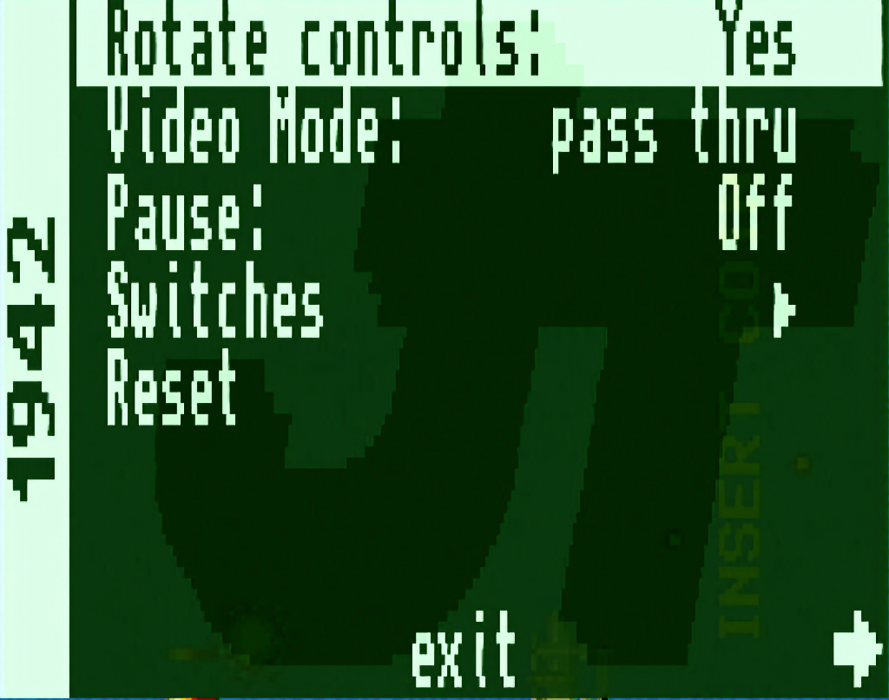
|===

- `Rotate Controls`: Para girar el texto del menú de opciones, así como el comportamiento de los controles de dirección
- `Video Mode`: Sólo en el caso de salida de vídeo VGA, para aplicar distintos filtros a la imagen
- `Pause`: Para detener el core
- `Switches`: Accede a ver y modificar el estado de los https://es.wikipedia.org/wiki/Interruptor_DIP[interruptores DIP] que haya definidos en el fichero ARC
- `Reset`: Soft Reset (reinicia el Core)
- `Exit`: Cierra el menú de opciones

<<<

==== 1943 (Jotego)

https://es.wikipedia.org/wiki/1943:_The_Battle_of_Midway[1943: The Battle of Midway] (1943: Midway Kaisen en Japón), es un videojuego desarrollado por Capcom y lanzado inicialmente para máquinas recreativas en 1987

Este core implementa permite ejecutar ROM de varios juegos (consultar <<#_1943_hardware,la sección de referencias para más información>>).

La versión para neptUNO+ está basada en la https://github.com/jotego/jtcores/tree/master/cores/1943[versión original de Jotego].

Algunas de sus características son:

- La salida de vídeo mantiene la rotación del original
- Salida de vídeo VGA
- Salida de vídeo RGB (utilizando el puerto VGA)
- Soporte de mando real y mando emulado en teclado

===== Formato de Tarjeta microSD

Se debe utilizar una tarjeta microSD, con la primera partición en formato exFAT o FAT32, donde se hayan copiado los ficheros ARC y ROM correspondientes de los juegos.

Para <<#_mra_tool,crear los ficheros ROM y ARC>>, se pueden obtener los ficheros MRA correspondientes del https://github.com/jotego/jtbin/tree/master/mra[repositorio de la versión original].

===== Controles

====== Teclas especiales y botones

Durante la ejecución del core:

- `F12` o botones `Start+Select` de un mando: mostrar el menú de control del core
- Teclas de cursor o el mando 1: Controles de dirección del jugador uno
- `Ctrl`, `Alt` y `Espacio` o botones `A`, `B`, `X` del mando 1: Botones 1, 2 y 3 del jugador uno
- `R`,`D`,`F`,`G` o mando 2: Movimiento del jugador dos
- `A`, `S` y `Q` o botones `A`, `B`, `X` del mando 2: Botones 1, 2 y 3 del jugador dos
- `1` y `2` o botón `Start` de un mando: Iniciar partida 1 ó 2 jugadores
- `5` y `6` o botón `X` de un mando: Insertar una moneda
- `P` o botón `Y` de un mando: Pausa
- `F3`: Soft Reset (reinicia el Core)

<<<

===== Guía básica

Al pulsar `F12`, se mostrará el menú con las distintas opciones del core. Se puede navegar utilizando las teclas de cursor. `Enter` selecciona un elemento.

[role="center",width="50%",cols="1a", frame=none, grid=none]
|===
|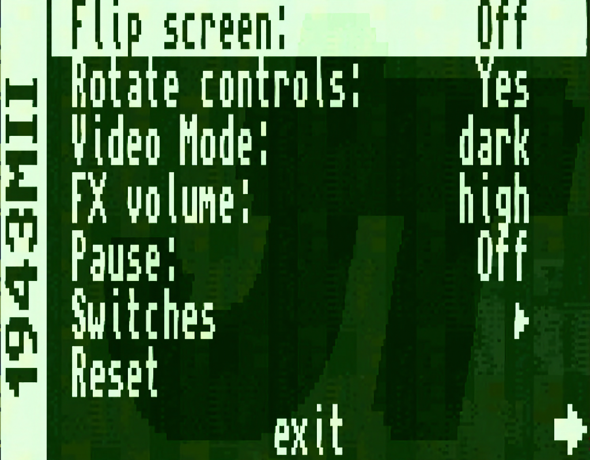
|===

Estas son las principales:

- `Flip Screen`: Para rotar 180º cómo se muestra la imagen en la pantalla
- `Rotate Controls`: Para girar el texto del menú de opciones, así como el comportamiento de los controles de dirección
- `Video Mode`: Sólo en el caso de salida de vídeo VGA, para aplicar distintos filtros a la imagen
- `FX Volume`: Volumen de los efectos de sonido
- `Pause`: Para detener el core
- `Switches`: Accede a ver y modificar el estado de los https://es.wikipedia.org/wiki/Interruptor_DIP[interruptores DIP] que haya definidos en el fichero ARC
- `Reset`: Soft Reset (reinicia el Core)
- `Exit`: Cierra el menú de opciones

<<<

==== A-Jax (Jotego)

https://es.wikipedia.org/wiki/Typhoon_(videojuego)[A-Jax] (Typhoon en Europa), es un videojuego desarrollado por Konami y lanzado inicialmente para máquinas recreativas en 1987.

Este core implementa permite ejecutar ROM de varios juegos (consultar <<#_a_jax_hardware,la sección de referencias para más información>>).

La versión para neptUNO+ está basada en la https://github.com/jotego/jtcores/tree/master/cores/ajax[versión original de Jotego].

Algunas de sus características son:

- La salida de vídeo mantiene la rotación del original
- Salida de vídeo VGA
- Salida de vídeo RGB (utilizando el puerto VGA)
- Soporte de mando real y mando emulado en teclado

===== Formato de Tarjeta microSD

Se debe utilizar una tarjeta microSD, con la primera partición en formato exFAT o FAT32, donde se hayan copiado los ficheros ARC y ROM correspondientes de los juegos.

Para <<#_mra_tool,crear los ficheros ROM y ARC>>, se pueden obtener los ficheros MRA correspondientes del https://github.com/jotego/jtbin/tree/master/mra[repositorio de la versión original].

===== Controles

====== Teclas especiales y botones

Durante la ejecución del core:

- `F12` o botones `Start+Select` de un mando: mostrar el menú de control del core
- Teclas de cursor o el mando 1: Controles de dirección
- `Ctrl`, `Alt` y `Espacio` o botones `A`, `B`, `Select` del mando 1: Botones 1, 2 y 3 del jugador
- `1` y `2` o botón `L1` de un mando: Iniciar partida 1 ó 2 jugadores
- `5` y `6` o botón `R1` de un mando: Insertar una moneda
- `P` o botón `L2` de un mando: Pausa
- `F3`: Soft Reset (reinicia el Core)

<<<

===== Guía básica

Al pulsar `F12`, se mostrará el menú con las distintas opciones del core. Se puede navegar utilizando las teclas de cursor. `Enter` selecciona un elemento.

[role="center",width="50%",cols="1a", frame=none, grid=none]
|===
|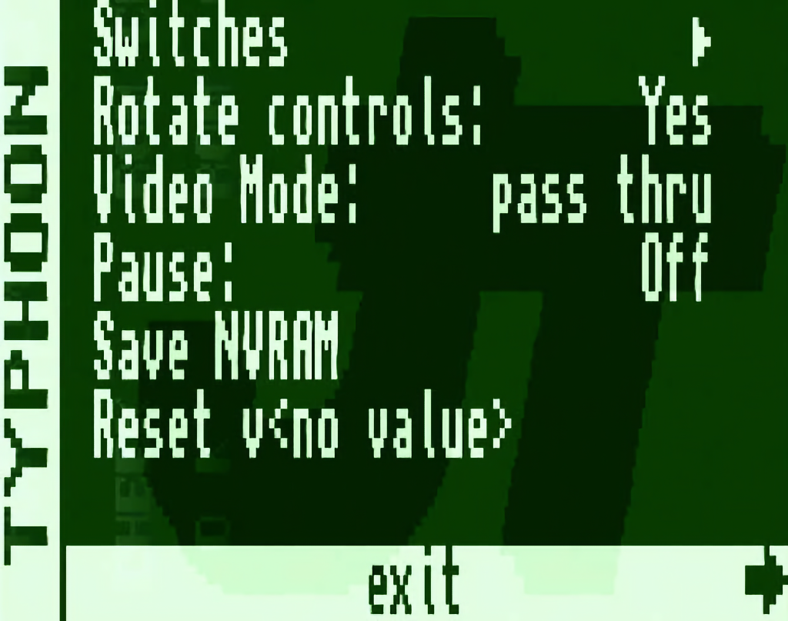
|===

Estas son las principales:

- `Switches`: Accede a ver y modificar el estado de los https://es.wikipedia.org/wiki/Interruptor_DIP[interruptores DIP] que haya definidos en el fichero ARC
- `Rotate Controls`: Para girar el texto del menú de opciones, así como el comportamiento de los controles de dirección
- `Video Mode`: Sólo en el caso de salida de vídeo VGA, para aplicar distintos filtros a la imagen
- `Pause`: Para detener el core
- `Save NVRAM`: Para guardar el contenido de la NVRAM (récords de puntuación) en la tarjeta microSD
- `Reset`: Soft Reset (reinicia el Core)
- `Exit`: Cierra el menú de opciones

<<<

==== Aliens (Jotego)

https://en.wikipedia.org/wiki/Aliens_(1990_video_game)[Aliens], es un videojuego desarrollado por Konami para máquinas recreativas.

Este core implementa permite ejecutar ROM de varios juegos (consultar <<#_aliens_hardware,la sección de referencias para más información>>).

La versión para neptUNO+ está basada en la https://github.com/jotego/jtcores/tree/master/cores/aliens[versión original de Jotego].

Algunas de las características del core son:

- La salida de vídeo mantiene la rotación del original
- Salida de vídeo VGA
- Salida de vídeo RGB (utilizando el puerto VGA)
- Soporte de mando real y mando emulado en teclado

===== Formato de Tarjeta microSD

Se debe utilizar una tarjeta microSD, con la primera partición en formato exFAT o FAT32, donde se hayan copiado los ficheros ARC y ROM correspondientes de los juegos.

Para <<#_mra_tool,crear los ficheros ROM y ARC>>, se pueden obtener los ficheros MRA correspondientes del https://github.com/jotego/jtbin/tree/master/mra[repositorio de la versión original].

===== Controles

====== Teclas espaciales y botones

Durante la ejecución del core:

- `F12` o botones `Start+A` de un mando: mostrar el menú de control del core
- Teclas de cursor o el mando 1: Controles de dirección del jugador uno
- `Ctrl`, `Alt` y `Espacio` o botones `A`, `B` del mando 1: Botones 1, 2 del jugador uno
- `R`,`D`,`F`,`G` o mando 2: Movimiento del jugador dos
- `A`, `S` y `Q` o botones `A`, `B` del mando 2: Botones 1, 2 del jugador dos
- `1` y `2` o botón `Start` de un mando: Iniciar partida 1 ó 2 jugadores
- `5` y `6` o botón `X` de un mando: Insertar una moneda
- `P` o botón `Y` de un mando: Pausa
- `F3`: Soft Reset (reinicia el Core)

<<<

===== Guía básica

Al pulsar `F12`, se mostrará el menú con las distintas opciones del core. Se puede navegar utilizando las teclas de cursor. `Enter` selecciona un elemento.

[role="center",width="50%",cols="1a", frame=none, grid=none]
|===
|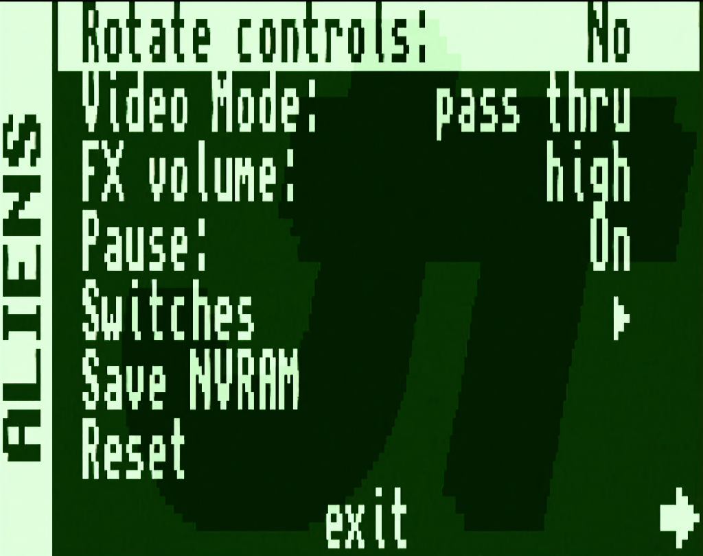
|===

Estas son las principales:

- `Rotate Controls`: Para girar el texto del menú de opciones, así como el comportamiento de los controles de dirección
- `Video Mode`: Sólo en el caso de salida de vídeo VGA, para aplicar distintos filtros a la imagen
- `FX Volume`: Volumen de los efectos de sonido
- `Pause`: Para poner el core en pausa o quitarla
- `Switches`: Accede a ver y modificar el estado de los https://es.wikipedia.org/wiki/Interruptor_DIP[interruptores DIP] que haya definidos en el fichero ARC
- `Save NVRAM`: Para guardar el contenido de la NVRAM (récords de puntuación) en la tarjeta microSD
- `Reset`: Soft Reset (reinicia el Core)
- `Exit`: Cierra el menú de opciones

<<<

==== Bionic Commando (Jotego)

https://es.wikipedia.org/wiki/Bionic_Commando_(arcade)[Bionic Commando] es un videojuego de plataformas de acción de 1987 lanzado por Capcom para máquinas recreativas.

Este core permite ejecutar ROM de varios juegos (consultar <<#_bionic_commando_hardware,la sección de referencias para más información>>).

La versión para neptUNO+ está basada en la https://github.com/jotego/jtcores/tree/master/cores/biocom[versión original de Jotego].

Algunas de las características del core son:

- Salida de vídeo VGA
- Salida de vídeo RGB (utilizando el puerto VGA)
- Soporte de mando real y mando emulado en teclado

===== Formato de Tarjeta microSD

Se debe utilizar una tarjeta microSD, con la primera partición en formato exFAT o FAT32, donde se hayan copiado los ficheros ARC y ROM correspondientes de los juegos.

Para <<#_mra_tool,crear los ficheros ROM y ARC>>, se pueden obtener los ficheros MRA correspondientes del https://github.com/jotego/jtbin/tree/master/mra[repositorio del creador] del core original.

===== Controles

====== Teclas especiales y botones

Durante la ejecución del core:

- `F12` o botones `Start+Select` de un mando: mostrar el menú de control del core
- Teclas de cursor o el mando 1: Controles de dirección del jugador
- `Ctrl`, `Alt` o botones `A`, `B` del mando 1: Botones del jugador
- `1` y `2` o botón `Select` de un mando: Iniciar partida 1 ó 2 jugadores
- `5` y `6` o botón `Start` de un mando: Insertar una moneda
- `P` o botón `X` de un mando: Pausa

<<<

===== Guía básica

Al pulsar `F12`, se mostrará el menú con las distintas opciones del core. Se puede navegar utilizando las teclas de cursor. `Enter` selecciona un elemento.

[role="center",width="50%",cols="1a", frame=none, grid=none]
|===
|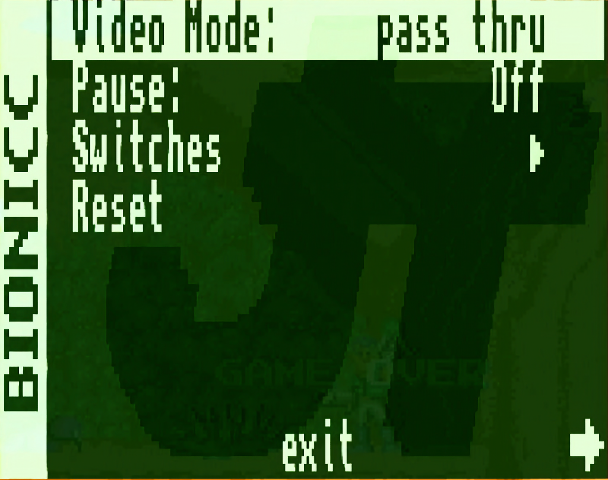
|===

Estas son las principales:

- `Video Mode`: Sólo en el caso de salida de vídeo VGA, para aplicar distintos filtros a la imagen
- `Pause`: Para detener el core
- `Switches`: Accede a ver y modificar el estado de los https://es.wikipedia.org/wiki/Interruptor_DIP[interruptores DIP] que haya definidos en el fichero ARC
- `Reset`: Soft Reset (reinicia el Core)
- `Exit`: Cierra el menú de opciones

<<<

==== Black Tiger (Jotego)

https://es.wikipedia.org/wiki/Black_Tiger_(videojuego)[Black Tiger] es un videojuego de plataformas creado en 1987 por la compañía japonesa Capcom, y que originalmente fue lanzado para máquina recreativa.

La versión para neptUNO+ está basada en la https://github.com/jotego/jtcores/tree/master/cores/btiger[versión original de Jotego].

Algunas de las características del core son:

- Salida de vídeo VGA
- Salida de vídeo RGB (utilizando el puerto VGA)
- Soporte de mando real y mando emulado en teclado

===== Formato de Tarjeta microSD

Se debe utilizar una tarjeta microSD, con la primera partición en formato exFAT o FAT32, donde se hayan copiado los ficheros ARC y ROM correspondientes de los juegos.

Para <<#_mra_tool,crear los ficheros ROM y ARC>>, se pueden obtener los ficheros MRA correspondientes del https://github.com/jotego/jtbin/tree/master/mra[repositorio del creador] del core original.

===== Controles

====== Teclas especiales y botones

- `F12` o botones `Start+Select` de un mando: mostrar el menú de control del core
- Teclas de cursor o el mando 1: Controles de dirección del jugador
- `Ctrl`, `Alt` o botones `A`, `B` del mando: Botones del jugador
- `1` y `2` o botón `Select` de un mando: Iniciar partida 1 ó 2 jugadores
- `5` y `6` o botón `Start` de un mando: Insertar una moneda
- `P` o botón `X` de un mando: Pausa
- `F3`: Soft Reset (reinicia el Core)

<<<

===== Guía básica

Al pulsar `F12`, se mostrará el menú con las distintas opciones del core. Se puede navegar utilizando las teclas de cursor. `Enter` selecciona un elemento.

[role="center",width="50%",cols="1a", frame=none, grid=none]
|===
|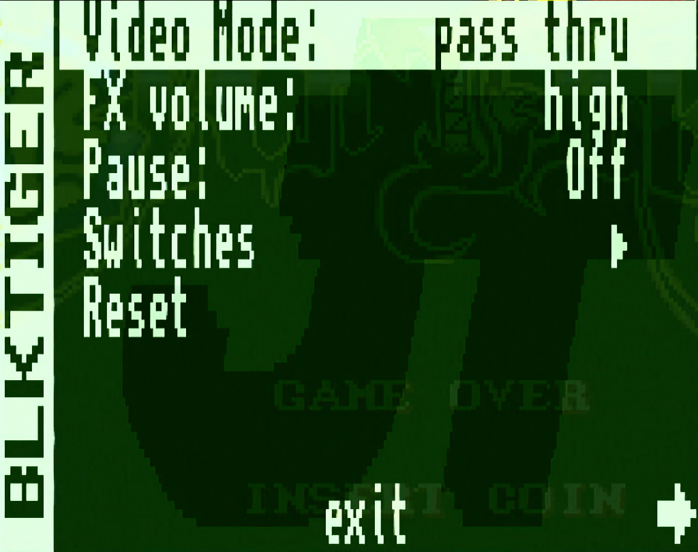
|===

Estas son las principales:

- `Video Mode`: Sólo en el caso de salida de vídeo VGA, para aplicar distintos filtros a la imagen
- `FX Volume`: Volumen de los efectos de sonido
- `Pause`: Para detener el core
- `Switches`: Accede a ver y modificar el estado de los https://es.wikipedia.org/wiki/Interruptor_DIP[interruptores DIP] que haya definidos en el fichero ARC
- `Reset`: Soft Reset (reinicia el Core)
- `Exit`: Cierra el menú de opciones

<<<

==== Bubble Bobble (Jotego)

https://es.wikipedia.org/wiki/Bubble_Bobble[Bubble Bobble] es un videojuego, creado por Taito para máquinas recreativas en el año 1986.

Este core permite ejecutar ROM de varios juegos (consultar <<#_bubble_bobble_hardware,la sección de referencias para más información>>).

La versión para neptUNO+ está basada en la https://github.com/jotego/jtcores/tree/master/cores/bubl[versión original de Jotego].

Algunas de las características del core son:

- Salida de vídeo VGA
- Salida de vídeo RGB (utilizando el puerto VGA)
- Soporte de mando real y mando emulado en teclado

===== Formato de Tarjeta microSD

Se debe utilizar una tarjeta microSD, con la primera partición en formato exFAT o FAT32, donde se hayan copiado los ficheros ARC y ROM correspondientes de los juegos.

Para <<#_mra_tool,crear los ficheros ROM y ARC>>, se pueden obtener los ficheros MRA correspondientes del https://github.com/jotego/jtbin/tree/master/mra[repositorio del creador] del core original.

===== Controles

====== Teclas especiales y botones

Durante la ejecución del core:

- `F12` o botones `Start+Select` de un mando: mostrar el menú de control del core
- Teclas de cursor o el mando 1: Controles de dirección del jugador uno
- `Ctrl`, `Alt` o botones `A`, `B` del mando 1: Botones del jugador uno
- `R`,`D`,`F`,`G` o mando 2: Movimiento del jugador dos
- `A`, `S` o botones `A`, `B` del mando 2: Botones del jugador dos
- `1` y `2` o botón `Select` de un mando: Iniciar partida jugador 1 o jugador 2
- `5` y `6` o botón `Start` de un mando: Insertar una moneda
- `P` o botón `X` de un mando: Pausa
- `F3`: Soft Reset (reinicia el Core)

<<<

===== Guía básica

Al pulsar `F12`, se mostrará el menú con las distintas opciones del core. Se puede navegar utilizando las teclas de cursor. `Enter` selecciona un elemento.

[role="center",width="50%",cols="1a", frame=none, grid=none]
|===
|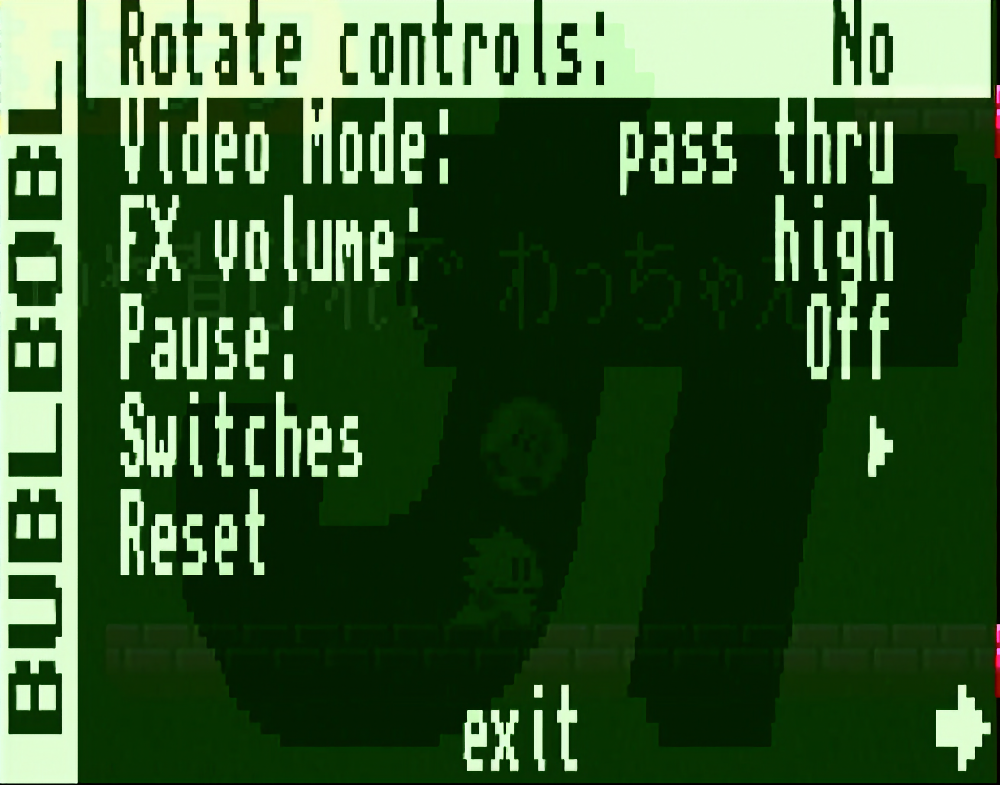
|===

Estas son las principales:

- `Video Mode`: Sólo en el caso de salida de vídeo VGA, para aplicar distintos filtros a la imagen
- `FX Volume`: Volumen de los efectos de sonido
- `Pause`: Para detener el core
- `Switches`: Accede a ver y modificar el estado de los https://es.wikipedia.org/wiki/Interruptor_DIP[interruptores DIP] que haya definidos en el fichero ARC
- `Reset`: Soft Reset (reinicia el Core)
- `Exit`: Cierra el menú de opciones

<<<

==== Haunted Castle (Jotego)

https://es.wikipedia.org/wiki/Haunted_Castle[Haunted Castle] es un videojuego para máquinas recreativas, lanzado al mercado en 1988 por la empresa Konami Corporation.

Este core permite ejecutar ROM de varios juegos (consultar <<#_haunted_castle_hardware,la sección de referencias para más información>>).

La versión para neptUNO+ está basada en la https://github.com/jotego/jtcores/tree/master/cores/castle[versión original de Jotego].

Algunas de las características del core son:

- Salida de vídeo VGA
- Salida de vídeo RGB (utilizando el puerto VGA)
- Soporte de mando real y mando emulado en teclado

===== Formato de Tarjeta microSD

Se debe utilizar una tarjeta microSD, con la primera partición en formato exFAT o FAT32, donde se hayan copiado los ficheros ARC y ROM correspondientes de los juegos.

Para <<#_mra_tool,crear los ficheros ROM y ARC>>, se pueden obtener los ficheros MRA correspondientes del https://github.com/jotego/jtbin/tree/master/mra[repositorio del creador] del core original.

===== Controles

====== Teclas especiales y botones

Durante la ejecución del core:

- `F12` o botones `Start+Select` de un mando: mostrar el menú de control del core
- Teclas de cursor o el mando 1: Controles de dirección del jugador
- `Ctrl`, `Alt` o botones `A`, `B` del mando 1: Botones del jugador
- `1` y `2` o botón `X` de un mando: Iniciar partida 1 ó 2 jugadores
- `5` y `6` o botón `Start` de un mando: Insertar una moneda
- `P` o botón `Y` de un mando: Pausa
- `F3`: Soft Reset (reinicia el Core)

<<<

===== Guía básica

Al pulsar `F12`, se mostrará el menú con las distintas opciones del core. Se puede navegar utilizando las teclas de cursor. `Enter` selecciona un elemento.

[role="center",width="50%",cols="1a", frame=none, grid=none]
|===
|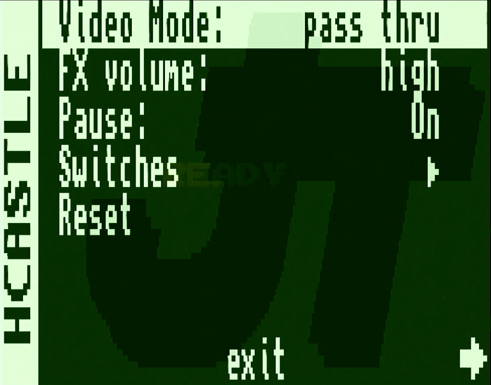
|===

Estas son las principales:

- `Video Mode`: Sólo en el caso de salida de vídeo VGA, para aplicar distintos filtros a la imagen
- `FX Volume`: Volumen de los efectos de sonido
- `Pause`: Para detener el core
- `Switches`: Accede a ver y modificar el estado de los https://es.wikipedia.org/wiki/Interruptor_DIP[interruptores DIP] que haya definidos en el fichero ARC
- `Reset`: Soft Reset (reinicia el Core)
- `Exit`: Cierra el menú de opciones

<<<

==== Circus Charlie (Jotego)

https://es.wikipedia.org/wiki/Circus_Charlie[Circus Charlie] es es un videojuego para máquinas recreativas publicado por Konami en 1984.

La versión para neptUNO+ está basada en la https://github.com/jotego/jtcores/tree/master/cores/circus[versión original de Jotego].

Algunas de las características del core son:

- Salida de vídeo VGA
- Salida de vídeo RGB (utilizando el puerto VGA)
- Soporte de mando real y mando emulado en teclado

===== Formato de Tarjeta microSD

Se debe utilizar una tarjeta microSD, con la primera partición en formato exFAT o FAT32, donde se hayan copiado los ficheros ARC y ROM correspondientes de los juegos.

Para <<#_mra_tool,crear los ficheros ROM y ARC>>, se pueden obtener los ficheros MRA correspondientes del https://github.com/jotego/jtbin/tree/master/mra[repositorio del creador] del core original.

===== Controles

====== Teclas especiales y botones

Durante la ejecución del core:

- `F12` o botones `Start+Select` de un mando: mostrar el menú de control del core
- Teclas de cursor o el mando 1: Controles de dirección del jugador
- `Ctrl`o botón `A` del mando 1: Botones del jugador
- `1` y `2` o botón `L` de un mando: Iniciar partida 1 ó 2 jugadores
- `5` y `6` o botón `R` de un mando: Insertar una moneda
- `P` o botón `L2` de un mando: Pausa
- `F3`: Soft Reset (reinicia el Core)

<<<

===== Guía básica

Al pulsar `F12`, se mostrará el menú con las distintas opciones del core. Se puede navegar utilizando las teclas de cursor. `Enter` selecciona un elemento.

[role="center",width="50%",cols="1a", frame=none, grid=none]
|===
|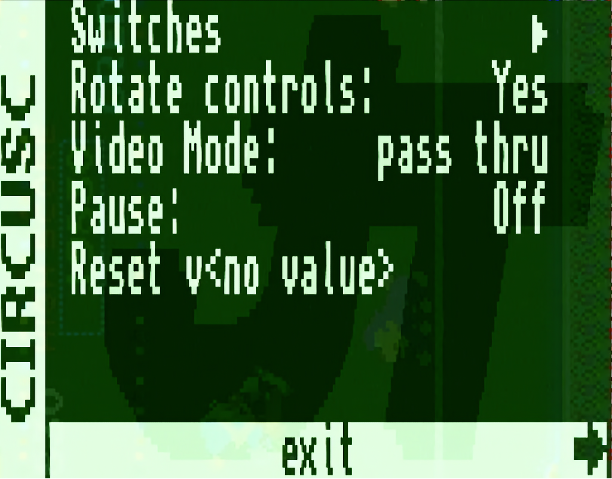
|===

Estas son las principales:

- `Switches`: Accede a ver y modificar el estado de los https://es.wikipedia.org/wiki/Interruptor_DIP[interruptores DIP] que haya definidos en el fichero ARC
- `Rotate Controls`: Para girar el comportamiento de los controles de dirección
- `Video Mode`: Sólo en el caso de salida de vídeo VGA, para aplicar distintos filtros a la imagen
- `Pause`: Para detener el core
- `Reset`: Soft Reset (reinicia el Core)
- `Exit`: Cierra el menú de opciones

[TIP]
====
En algunas ocasiones el core no inicializa bien la primra vez, y es necesario pulsar `F3` para hacer un reset y que arranque correctamente.
====

<<<

==== Commando (Jotego)

https://es.wikipedia.org/wiki/Commando_(videojuego)[Commando] es un juego de máquina recreativa de desplazamiento vertical lanzado en 1985.

La versión para neptUNO+ está basada en la https://github.com/jotego/jtcores/tree/master/cores/commnd[versión original de Jotego].

Algunas de las características del core son:

- Salida de vídeo VGA
- Salida de vídeo RGB (utilizando el puerto VGA)
- Soporte de mando real y mando emulado en teclado

===== Formato de Tarjeta microSD

Se debe utilizar una tarjeta microSD, con la primera partición en formato exFAT o FAT32, donde se hayan copiado los ficheros ARC y ROM correspondientes de los juegos.

Para <<#_mra_tool,crear los ficheros ROM y ARC>>, se pueden obtener los ficheros MRA correspondientes del https://github.com/jotego/jtbin/tree/master/mra[repositorio del creador] del core original.

===== Controles

====== Teclas especiales y botones

Durante la ejecución del core:

- `F12` o botones `Start+Select` de un mando: mostrar el menú de control del core
- Teclas de cursor o el mando 1: Controles de dirección del jugador
- `Ctrl`, `Alt` o botones `A`, `B` del mando 1: Botones del jugador
- `1` y `2` o botón `Select` de un mando: Iniciar partida 1 ó 2 jugadores
- `5` y `6` o botón `Start` de un mando: Insertar una moneda
- `P` o botón `X` de un mando: Pausa
- `F3`: Soft Reset (reinicia el Core)

<<<

===== Guía básica

Al pulsar `F12`, se mostrará el menú con las distintas opciones del core. Se puede navegar utilizando las teclas de cursor. `Enter` selecciona un elemento.

[role="center",width="50%",cols="1a", frame=none, grid=none]
|===
|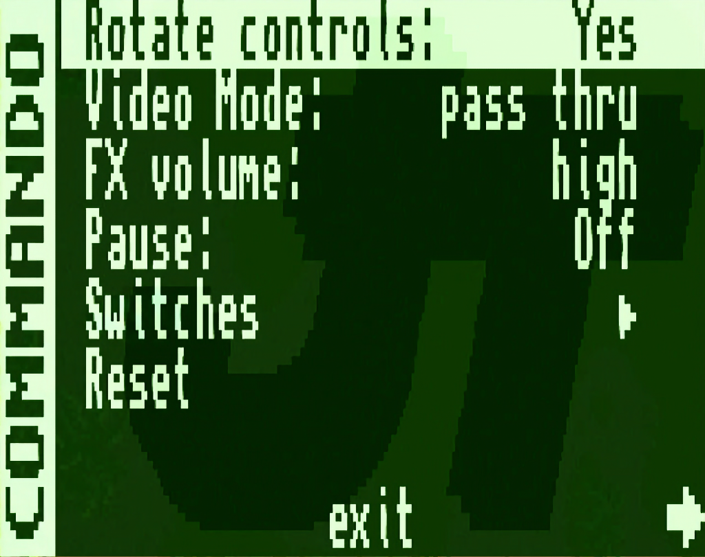
|===

Estas son las principales:

- `Rotate Controls`: Para girar el texto del menú de opciones, así como el comportamiento de los controles de dirección
- `Video Mode`: Sólo en el caso de salida de vídeo VGA, para aplicar distintos filtros a la imagen
- `FX Volume`: Volumen de los efectos de sonido
- `Pause`: Para detener el core
- `Switches`: Accede a ver y modificar el estado de los https://es.wikipedia.org/wiki/Interruptor_DIP[interruptores DIP] que haya definidos en el fichero ARC
- `Reset`: Soft Reset (reinicia el Core)
- `Exit`: Cierra el menú de opciones

<<<

==== Combat School (Jotego)

https://es.wikipedia.org/wiki/Combat_School[Combat School] es un videojuego desarrollado por Konami para máquinas recreativas y ordenador de8 bits. También se le conoce con el nombre de "Boot Camp".

La versión para neptUNO+ está basada en la https://github.com/jotego/jtcores/tree/master/cores/comsc[versión original de Jotego].

Algunas de las características del core son:

- Salida de vídeo VGA
- Salida de vídeo RGB (utilizando el puerto VGA)
- Soporte de mando real y mando emulado en teclado

===== Formato de Tarjeta microSD

Se debe utilizar una tarjeta microSD, con la primera partición en formato exFAT o FAT32, donde se hayan copiado los ficheros ARC y ROM correspondientes de los juegos.

Para <<#_mra_tool,crear los ficheros ROM y ARC>>, se pueden obtener los ficheros MRA correspondientes del https://github.com/jotego/jtbin/tree/master/mra[repositorio del creador] del core original.

===== Controles

====== Teclas especiales y botones

Durante la ejecución del core:

- `F12` o botones `Start+Select` de un mando: mostrar el menú de control del core
- Teclas de cursor o el mando 1: Controles de dirección del jugador
- `Ctrl`, `Alt` o botones `A`, `B` del mando 1: Botones del jugador
- `1` y `2` o botón `Select` de un mando: Iniciar partida 1 ó 2 jugadores
- `5` y `6` o botón `Start` de un mando: Insertar una moneda
- `P` o botón `X` de un mando: Pausa
- `F3`: Soft Reset (reinicia el Core)

<<<

===== Guía básica

Al pulsar `F12`, se mostrará el menú con las distintas opciones del core. Se puede navegar utilizando las teclas de cursor. `Enter` selecciona un elemento.

[role="center",width="50%",cols="1a", frame=none, grid=none]
|===
|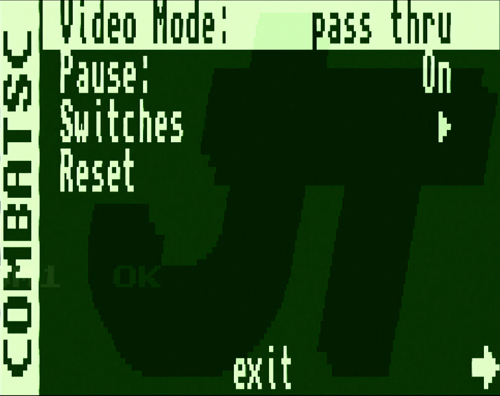
|===

Estas son las principales:

- `Video Mode`: Sólo en el caso de salida de vídeo VGA, para aplicar distintos filtros a la imagen
- `Pause`: Para detener el core
- `Switches`: Accede a ver y modificar el estado de los https://es.wikipedia.org/wiki/Interruptor_DIP[interruptores DIP] que haya definidos en el fichero ARC
- `Reset`: Soft Reset (reinicia el Core)
- `Exit`: Cierra el menú de opciones

<<<

==== Contra (Jotego)

https://es.wikipedia.org/wiki/Contra_(videojuego)[Contra] es un videojuego, lanzado originalmente para máquina recreativa en 1987.

La versión para neptUNO+ está basada en la https://github.com/jotego/jtcores/tree/master/cores/contra[versión original de Jotego].

Algunas de las características del core son:

- Salida de vídeo VGA
- Salida de vídeo RGB (utilizando el puerto VGA)
- Soporte de mando real y mando emulado en teclado

===== Formato de Tarjeta microSD

Se debe utilizar una tarjeta microSD, con la primera partición en formato exFAT o FAT32, donde se hayan copiado los ficheros ARC y ROM correspondientes de los juegos.

Para <<#_mra_tool,crear los ficheros ROM y ARC>>, se pueden obtener los ficheros MRA correspondientes del https://github.com/jotego/jtbin/tree/master/mra[repositorio del creador] del core original.

===== Controles

====== Teclas especiales y botones

Durante la ejecución del core:

- `F12` o botones `Start+Select` de un mando: mostrar el menú de control del core
- Teclas de cursor o el mando 1: Controles de dirección del jugador uno
- `Ctrl`, `Alt` o botones `A`, `B` del mando 1: Botones 1, 2 del jugador uno
- `R`,`D`,`F`,`G` o mando 2: Movimiento del jugador dos
- `A`, `S` o botones `A`, `B` del mando 2: Botones 1, 2 del jugador dos
- `1` y `2` o botón `Select` de un mando: para iniciar partida jugador 1 o jugador 2
- `5` y `6` o botón `Start` de un mando: para insertar una moneda
- `P` o botón `X` de un mando: Pausa
- `F3`: Soft Reset (reinicia el Core)

<<<

===== Guía básica

Al pulsar `F12`, se mostrará el menú con las distintas opciones del core. Se puede navegar utilizando las teclas de cursor. `Enter` selecciona un elemento.

[role="center",width="50%",cols="1a", frame=none, grid=none]
|===
|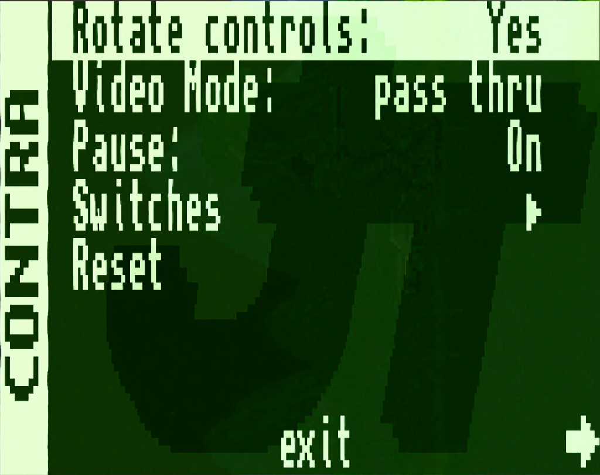
|===

Estas son las principales:

- `Load ARC`: Para cargar desde la tarjeta microSD un fichero .ARC
- `Rotate Controls`: Para girar el texto del menú de opciones, así como el comportamiento de los controles de dirección
- `Video Mode`: Sólo en el caso de salida de vídeo VGA, para aplicar distintos filtros a la imagen
- `Pause`: Para detener el core
- `Switches`: Accede a ver y modificar el estado de los https://es.wikipedia.org/wiki/Interruptor_DIP[interruptores DIP] que haya definidos en el fichero ARC
- `Reset`: Soft Reset (reinicia el Core)
- `Exit`: Cierra el menú de opciones

<<<

==== Robocop (Jotego)

https://es.wikipedia.org/wiki/RoboCop_(videojuego_de_1988)[Robocop] es un videojuego desarrollado y publicado por Data East en 1988, y basado en la película del mismo nombre de 1987.

Este core permite ejecutar ROM de varios juegos (consultar <<#_robocop_hardware,la sección de referencias para más información>>).

La versión para neptUNO+ está basada en la https://github.com/jotego/jtcores/tree/master/cores/cop[versión original de Jotego].

Algunas de las características del core son:

- Salida de vídeo VGA
- Salida de vídeo RGB (utilizando el puerto VGA)
- Soporte de mando real y mando emulado en teclado

===== Formato de Tarjeta microSD

Se debe utilizar una tarjeta microSD, con la primera partición en formato exFAT o FAT32, donde se hayan copiado los ficheros ARC y ROM correspondientes de los juegos.

Para <<#_mra_tool,crear los ficheros ROM y ARC>>, se pueden obtener los ficheros MRA correspondientes del https://github.com/jotego/jtbin/tree/master/mra[repositorio del creador] del core original.

===== Controles

====== Teclas especiales y botones

Durante la ejecución del core:

- `F12` o botones `Start+Select` del mando: mostrar el menú de control del core
- Teclas de cursor o el mando 1: Controles de dirección del jugador
- `Ctrl`, `Alt` o botones `A`, `B` del mando 1: Botones del jugador
- `1` y `2` o botones `Start+Y` de un mando: Iniciar partida 1 o 2 jugadores
- `5` y `6` o botón `L` de un mando: Insertar una moneda
- `F3`: Soft Reset (reinicia el Core)

<<<

===== Guía básica

Al pulsar `F12`, se mostrará el menú con las distintas opciones del core. Se puede navegar utilizando las teclas de cursor. `Enter` selecciona un elemento.

[role="center",width="50%",cols="1a", frame=none, grid=none]
|===
|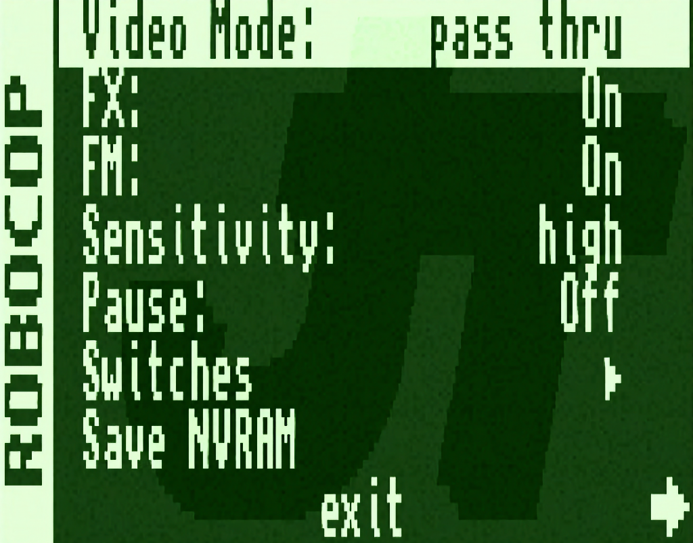
|===

Estas son las principales:

- `Video Mode`: Sólo en el caso de salida de vídeo VGA, para aplicar distintos filtros a la imagen
- `FX`: Activar o desactivar efectos de sonido
- `FM`: Activar o desactivar efectos de sonido FM
- `Sensitivity`: Ajusta la sensibilidad
- `Pause`: Para detener el core
- `Switches`: Accede a ver y modificar el estado de los https://es.wikipedia.org/wiki/Interruptor_DIP[interruptores DIP] que haya definidos en el fichero ARC
- `Save NVRAM`: Para guardar el contenido de la NVRAM (récords de puntuación) en la tarjeta microSD
- `Reset`: Soft Reset (reinicia el Core)
- `Exit`: Cierra el menú de opciones

<<<

==== Capcom Play System 1 (Jotego)

https://es.wikipedia.org/wiki/CP_System[CP System], CPS-1, o Capcom Play System 1 es una placa de máquina recreativa hecha por Capcom, que se utilizó para múltiples máquinas recreativas.

Este core permite ejecutar ROM de varios juegos (consultar <<#_capcom_play_system_1_hardware,la sección de referencias para más información>>).

La versión para neptUNO+ está basada en la https://github.com/jotego/jtcps[versión original de Jotego].

Algunas de las características del core son:

- Salida de vídeo VGA
- Salida de vídeo RGB (utilizando el puerto VGA)
- Soporte de mando real y mando emulado en teclado

===== Formato de Tarjeta microSD

Se debe utilizar una tarjeta microSD, con la primera partición en formato exFAT o FAT32, donde se hayan copiado los ficheros ARC y ROM correspondientes de los juegos.

Para <<#_mra_tool,crear los ficheros ROM y ARC>>, se pueden obtener los ficheros MRA correspondientes del https://github.com/jotego/jtbin/tree/master/mra[repositorio del creador] del core original.

===== Controles

====== Teclas especiales y botones

Durante la ejecución del core:

- `F12` o botones `Start+Select` de un mando: mostrar el menú de control del core
- Teclas de cursor o el mando 1: Controles de dirección del jugador uno
- `Ctrl`, `Alt` y `Espacio` o botones `A`, `B`, `X` del mando 1: Botones 1, 2 y 3 del jugador uno
- `Z`, `X`, `C` o botones X, Y, Z del mando 1: Botones 4, 5, 6 del jugador uno
- `R`,`D`,`F`,`G` o mando 2: Movimiento del jugador dos
- `A`, `S` y `Q` o botones `A`, `B`, `X` del mando 2: Botones 1, 2 y 3 del jugador dos
- `W`, `I`, `K` o botones `A`, `B`, `X` del mando 2: Botones 4, 5, 6 del jugador dos
- `1` y `2` o botón `L` de un mando: para iniciar partida jugador 1 o jugador 2
- `5` y `6` o botón `R` de un mando: para insertar una moneda
- `P` o botón `R2` de un mando: Pausa
- `F3`: Soft Reset (reinicia el Core)

<<<

===== Guía básica

Al pulsar `F12`, se mostrará el menú con las distintas opciones del core. Se puede navegar utilizando las teclas de cursor. `Enter` selecciona un elemento.

[role="center",width="50%",cols="1a", frame=none, grid=none]
|===
|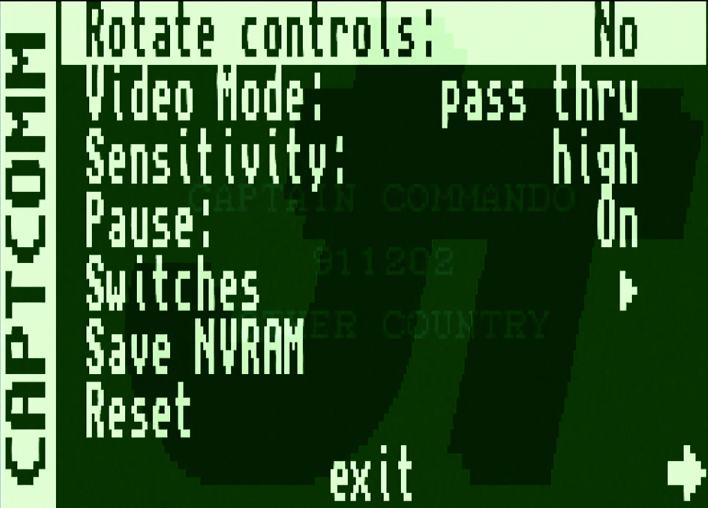
|===

Estas son las principales:

- `Rotate Controls`: Para girar el texto del menú de opciones, así como el comportamiento de los controles de dirección
- `Video Mode`: Sólo en el caso de salida de vídeo VGA, para aplicar distintos filtros a la imagen
- `Sensitivity`: Ajusta la sensibilidad
- `Pause`: Para detener el core
- `Switches`: Accede a ver y modificar el estado de los https://es.wikipedia.org/wiki/Interruptor_DIP[interruptores DIP] que haya definidos en el fichero ARC
- `Save NVRAM`: Para guardar el contenido de la NVRAM (récords de puntuación) en la tarjeta microSD
- `Reset`: Soft Reset (reinicia el Core)
- `Exit`: Cierra el menú de opciones

<<<

==== Capcom Play System 1.5 (Jotego)

Capcom Play System 1.5 o https://en.wikipedia.org/wiki/CP_System#CP_System_Dash[CP System Dash] es una revisión mejorada de CPS-1 (Capcom Play System 1).

Este core permite ejecutar ROM de varios juegos (consultar <<#_capcom_play_system_1_5_hardware,la sección de referencias para más información>>).

La versión para neptUNO+ está basada en la https://github.com/jotego/jtcps[versión original de Jotego].

Algunas de las características del core son:

- Salida de vídeo VGA
- Salida de vídeo RGB (utilizando el puerto VGA)
- Soporte de mando real y mando emulado en teclado

===== Formato de Tarjeta microSD

Se debe utilizar una tarjeta microSD, con la primera partición en formato exFAT o FAT32, donde se hayan copiado los ficheros ARC y ROM correspondientes de los juegos.

Para <<#_mra_tool,crear los ficheros ROM y ARC>>, se pueden obtener los ficheros MRA correspondientes del https://github.com/jotego/jtbin/tree/master/mra[repositorio del creador] del core original.

===== Controles

====== Teclas especiales y botones

Durante la ejecución del core:

- `F12` o botones `Start+Select` de un mando: mostrar el menú de control del core
- Teclas de cursor o el mando 1: Controles de dirección del jugador uno
- `Ctrl`, `Alt` y `Espacio` o botones `A`, `B`, `X` del mando 1: Botones 1, 2 y 3 del jugador uno
- `Z`, `X`, `C` o botones X, Y, Z del mando 1: Botones 4, 5, 6 del jugador uno
- `R`,`D`,`F`,`G` o mando 2: Movimiento del jugador dos
- `A`, `S` y `Q` o botones `A`, `B`, `X` del mando 2: Botones 1, 2 y 3 del jugador dos
- `W`, `I`, `K` o botones X, Y, Z del mando 2: Botones 4, 5, 6 del jugador dos
- `1` y `2` o botón `L` de un mando: para iniciar partida jugador 1 o jugador 2
- `5` y `6` o botón `R` de un mando: para insertar una moneda
- `P` o botón `R2` de un mando: Pausa
- `F3`: Soft Reset (reinicia el Core)

<<<

===== Guía básica

Al pulsar `F12`, se mostrará el menú con las distintas opciones del core. Se puede navegar utilizando las teclas de cursor. `Enter` selecciona un elemento.

[role="center",width="50%",cols="1a", frame=none, grid=none]
|===
|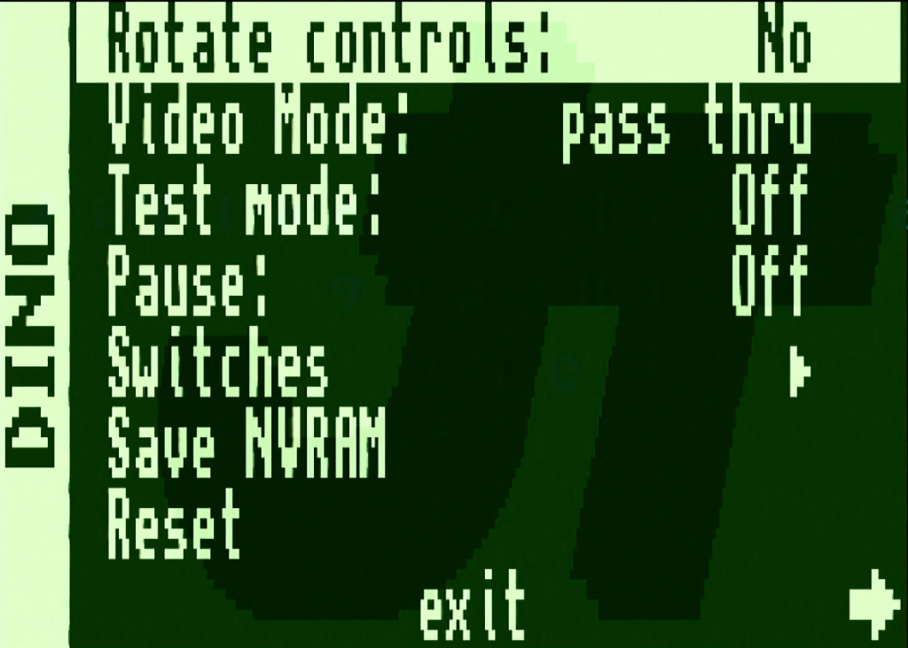
|===

Estas son las principales:

- `Rotate Controls`: Para girar el texto del menú de opciones, así como el comportamiento de los controles de dirección
- `Video Mode`: Sólo en el caso de salida de vídeo VGA, para aplicar distintos filtros a la imagen
- `Test Mode`: Activa o desactiva el modo de prueba
- `Pause`: Para detener el core
- `Switches`: Accede a ver y modificar el estado de los https://es.wikipedia.org/wiki/Interruptor_DIP[interruptores DIP] que haya definidos en el fichero ARC
- `Save NVRAM`: Para guardar el contenido de la NVRAM (récords de puntuación) en la tarjeta microSD
- `Reset`: Soft Reset (reinicia el Core)
- `Exit`: Cierra el menú de opciones

<<<

==== Capcom Play System 2 (Jotego)

CP System II, CPS-2 o https://es.wikipedia.org/wiki/CP_System_II[Capcom Play System 2] es un sistema de placa base para máquinas recreativas que se lanzó en 1993, y sucesor de CPS-1 y CPS-1.5

Este core permite ejecutar ROM de varios juegos (consultar <<#_capcom_play_system_2_hardware,la sección de referencias para más información>>).

La versión para neptUNO+ está basada en la https://github.com/jotego/jtcps[versión original de Jotego].

Algunas de las características del core son:

- Salida de vídeo VGA
- Salida de vídeo RGB (utilizando el puerto VGA)
- Soporte de mando real y mando emulado en teclado

===== Formato de Tarjeta microSD

Se debe utilizar una tarjeta microSD, con la primera partición en formato exFAT o FAT32, donde se hayan copiado los ficheros ARC y ROM correspondientes de los juegos.

Para <<#_mra_tool,crear los ficheros ROM y ARC>>, se pueden obtener los ficheros MRA correspondientes del https://github.com/jotego/jtbin/tree/master/mra[repositorio del creador] del core original.

===== Controles

====== Teclas especiales y botones

Durante la ejecución del core:

- `F12` o botones `Start+Select` de un mando: mostrar el menú de control del core
- Teclas de cursor o el mando 1: Controles de dirección del jugador uno
- `Ctrl`, `Alt` y `Espacio` o botones `A`, `B`, `X` del mando 1: Botones 1, 2 y 3 del jugador uno
- `Z`, `X`, `C` o botones X, Start, Select del mando 1: Botones 4, 5, 6 del jugador uno
- `R`,`D`,`F`,`G` o mando 2: Movimiento del jugador dos
- `A`, `S` y `Q` o botones `A`, `B`, `X` del mando 2: Botones 1, 2 y 3 del jugador dos
- `W`, `I`, `K` o botones `Y`, `Start`, `Select` del mando 2: Botones 4, 5, 6 del jugador dos
- `1` y `2` o botón `L` de un mando: para iniciar partida jugador 1 o jugador 2
- `5` y `6` o botón `R` de un mando: para insertar una moneda
- `P` o botón `R2` de un mando: Pausa
- `F3`: Soft Reset (reinicia el Core)

<<<

===== Guía básica

Al pulsar `F12`, se mostrará el menú con las distintas opciones del core. Se puede navegar utilizando las teclas de cursor. `Enter` selecciona un elemento.

[role="center",width="50%",cols="1a", frame=none, grid=none]
|===
|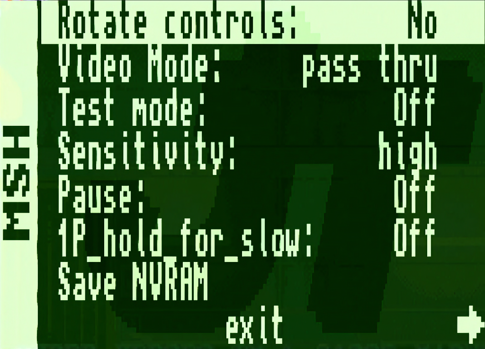
|===

Estas son las principales:

- `Rotate Controls`: Para girar el texto del menú de opciones, así como el comportamiento de los controles de dirección
- `Video Mode`: Sólo en el caso de salida de vídeo VGA, para aplicar distintos filtros a la imagen
- `Test Mode`: Activa o desactiva el modo de prueba
- `Sensitivity`: Ajusta la sensibilidad
- `Pause`: Para detener el core
- `1P Hold For Slow`: Si se activa, al mantener pulsado el botón Start de algún jugador el juego funcionará a mitad de velocidad
- `Save NVRAM`: Para guardar el contenido de la NVRAM (récords de puntuación) en la tarjeta microSD
- `Reset`: Soft Reset (reinicia el Core)
- `Exit`: Cierra el menú de opciones

<<<

==== Double Dragon (Jotego)

Double Dragon es un https://es.wikipedia.org/wiki/Double_Dragon[videojuego lanzado para máquinas recreativas] en 1987, desarrollado por Technos Japan.

La versión para neptUNO+ está basada en  la https://github.com/jotego/jtcores/tree/master/cores/dd[versión original de Jotego].

Algunas de las características del core son:

- Salida de vídeo VGA
- Salida de vídeo RGB (utilizando el puerto VGA)
- Soporte de mando real y mando emulado en teclado

===== Formato de Tarjeta microSD

Se debe utilizar una tarjeta microSD, con la primera partición en formato exFAT o FAT32, donde se hayan copiado los ficheros ARC y ROM correspondientes de los juegos.

Para <<#_mra_tool,crear los ficheros ROM y ARC>>, se pueden obtener los ficheros MRA correspondientes del https://github.com/jotego/jtbin/tree/master/mra[repositorio del creador] del core original.

===== Controles

====== Teclas especiales y botones

Durante la ejecución del core:

- `F12` o botones `Start+Select` de un mando: mostrar el menú de control del core
- Teclas de cursor o el mando 1: Controles de dirección del jugador uno
- `Ctrl`, `Alt` y `Espacio` o botones `A`, `B`, `Select` del mando 1: Botones 1, 2 y 3 del jugador uno
- `R`,`D`,`F`,`G` o mando 2: Movimiento del jugador dos
- `A`, `S` y `Q` o botones `A`, `B`, `Select` del mando 2: Botones 1, 2 y 3 del jugador dos
- `1` y `2` o botón `Start` de un mando: Iniciar partida jugador 1 o jugador 2
- `5` y `6` o botón `X` de un mando: Insertar una moneda
- `P` o botón `Y` de un mando: Pausa
- `F3`: Soft Reset (reinicia el Core)

<<<

===== Guía básica

Al pulsar `F12`, se mostrará el menú con las distintas opciones del core. Se puede navegar utilizando las teclas de cursor. `Enter` selecciona un elemento.

[role="center",width="50%",cols="1a", frame=none, grid=none]
|===
|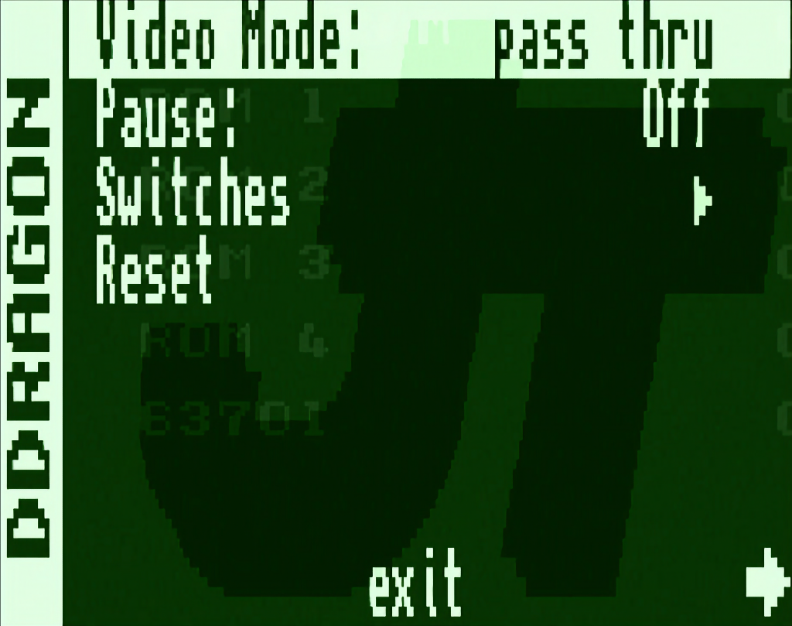
|===

Estas son las principales:

- `Video Mode`: Sólo en el caso de salida de vídeo VGA, para aplicar distintos filtros a la imagen
- `Pause`: Para detener el core
- `Switches`: Accede a ver y modificar el estado de los https://es.wikipedia.org/wiki/Interruptor_DIP[interruptores DIP] que haya definidos en el fichero ARC
- `Reset`: Soft Reset (reinicia el Core)
- `Exit`: Cierra el menú de opciones

<<<

==== Double Dragon 2 (Jotego)

Double Dragon 2 es un https://es.wikipedia.org/wiki/Double_Dragon_II:_The_Revenge[videojuego lanzado para máquinas recreativas] en 1988 por Technos Japan y es la primera secuela de Double Dragon.

La versión para neptUNO+ está basada en la https://github.com/jotego/jtcores/tree/master/cores/dd2[versión original de Jotego].

Algunas de las características del core son:

- Salida de vídeo VGA
- Salida de vídeo RGB (utilizando el puerto VGA)
- Soporte de mando real y mando emulado en teclado

===== Formato de Tarjeta microSD

Se debe utilizar una tarjeta microSD, con la primera partición en formato exFAT o FAT32, donde se hayan copiado los ficheros ARC y ROM correspondientes de los juegos.

Para <<#_mra_tool,crear los ficheros ROM y ARC>>, se pueden obtener los ficheros MRA correspondientes del https://github.com/jotego/jtbin/tree/master/mra[repositorio del creador] del core original.

===== Controles

====== Teclas especiales y botones

Durante la ejecución del core:

- `F12` o botones `Start+Select` de un mando: mostrar el menú de control del core
- Teclas de cursor o el mando 1: Controles de dirección del jugador uno
- `Ctrl`, `Alt` y `Espacio` o botones `A`, `B`, `Select` del mando 1: Botones 1, 2 y 3 del jugador uno
- `R`,`D`,`F`,`G` o mando 2: Movimiento del jugador dos
- `A`, `S` y `Q` o botones `A`, `B`, `Select` del mando 2: Botones 1, 2 y 3 del jugador dos
- `1` y `2` o botón `Start` de un mando: Iniciar partida jugador 1 o jugador 2
- `5` y `6` o botón `X` de un mando: Insertar una moneda
- `P` o botón `Y` de un mando: Pausa
- `F3`: Soft Reset (reinicia el Core)

<<<

===== Guía básica

Al pulsar `F12`, se mostrará el menú con las distintas opciones del core. Se puede navegar utilizando las teclas de cursor. `Enter` selecciona un elemento.

[role="center",width="50%",cols="1a", frame=none, grid=none]
|===
|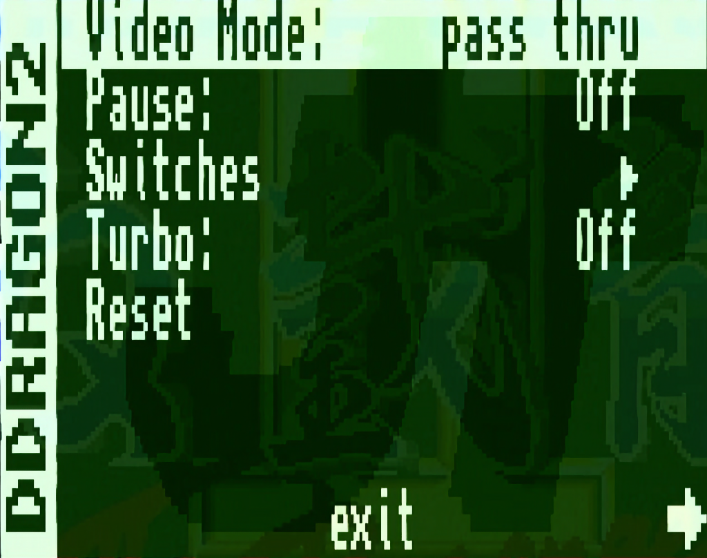
|===

Estas son las principales:

- `Video Mode`: Sólo en el caso de salida de vídeo VGA, para aplicar distintos filtros a la imagen
- `Pause`: Para detener el core
- `Switches`: Accede a ver y modificar el estado de los https://es.wikipedia.org/wiki/Interruptor_DIP[interruptores DIP] que haya definidos en el fichero ARC
- `Turbo`: Activa o desactiva el modo turbo
- `Reset`: Soft Reset (reinicia el Core)
- `Exit`: Cierra el menú de opciones

<<<

==== Exed Exes (Jotego)

https://en.wikipedia.org/wiki/Exed_Exes[Exed Exes] es un juego de desplazamiento vertical que fue lanzado en máquinas recreativas en 1985 por Capcom.

La versión para neptUNO+ está basada en la https://github.com/jotego/jtcores/tree/master/cores/exed[versión original de Jotego].

Algunas de las características del core son:

- La salida de vídeo mantiene la rotación del original
- Salida de vídeo VGA
- Salida de vídeo RGB (utilizando el puerto VGA)
- Soporte de mando real y mando emulado en teclado

===== Formato de Tarjeta microSD

Se debe utilizar una tarjeta microSD, con la primera partición en formato exFAT o FAT32, donde se hayan copiado los ficheros ARC y ROM correspondientes de los juegos.

Para <<#_mra_tool,crear los ficheros ROM y ARC>>, se pueden obtener los ficheros MRA correspondientes del https://github.com/jotego/jtbin/tree/master/mra[repositorio del creador] del core original.

===== Controles

====== Teclas especiales y botones

- `F12` o botones `Start+Select` de un mando: mostrar el menú de control del core
- Teclas de cursor o el mando 1: Controles de dirección
- `Ctrl`, `Alt` o botones `A`, `B` del mando: Botones 1, 2 del jugador
- `1` y `2` o botón `Select` de un mando: Iniciar partida de 1 ó 2 jugadores
- `5` y `6` o botón `Start` de un mando: Insertar una moneda
- `P` o botón `X` de un mando: Pausa
- `F3`: Soft Reset (reinicia el Core)

<<<

===== Guía básica

Al pulsar `F12` o los botones `Start+A` de un mando, se mostrará el menú con las distintas opciones del core. Se puede navegar utilizando las teclas de cursor o un mando. `Enter` o el botón B del mando selecciona un elemento.

[role="center",width="50%",cols="1a", frame=none, grid=none]
|===
|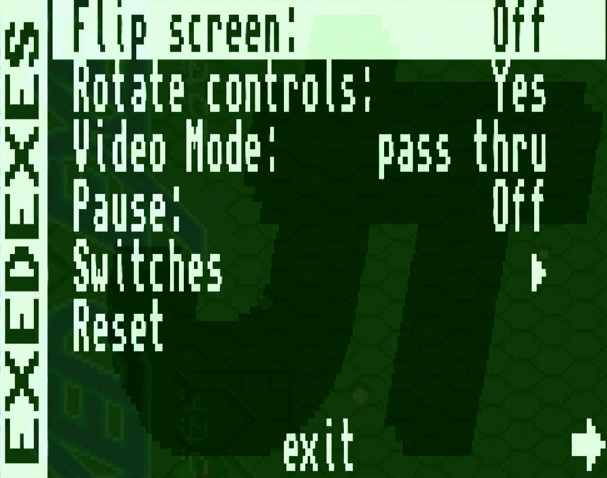
|===

Estas son las principales:

- `Flip Screen`: Para rotar 180º cómo se muestra la imagen en la pantalla
- `Rotate Controls`: Para girar el texto del menú de opciones, así como el comportamiento de los controles de dirección
- `Video Mode`: Sólo en el caso de salida de vídeo VGA, para aplicar distintos filtros a la imagen
- `Pause`: Para detener el core
- `Switches`: Accede a ver y modificar el estado de los https://es.wikipedia.org/wiki/Interruptor_DIP[interruptores DIP] que haya definidos en el fichero ARC
- `Reset`: Soft Reset (reinicia el Core)
- `Exit`: Cierra el menú de opciones

<<<

==== Fast Lane (Jotego)

Fast Lane es un juego de máquina recreativa de 1987 creado por Konami.

La versión para neptUNO+ está basada en la https://github.com/jotego/jtcores/tree/master/cores/flane[versión original de Jotego].

Algunas de las características del core son:

- Salida de vídeo VGA
- Salida de vídeo RGB (utilizando el puerto VGA)
- Soporte de mando real y mando emulado en teclado

===== Formato de Tarjeta microSD

Se debe utilizar una tarjeta microSD, con la primera partición en formato exFAT o FAT32, donde se hayan copiado los ficheros ARC y ROM correspondientes de los juegos.

Para <<#_mra_tool,crear los ficheros ROM y ARC>>, se pueden obtener los ficheros MRA correspondientes del https://github.com/jotego/jtbin/tree/master/mra[repositorio del creador] del core original.

===== Controles

====== Teclas especiales y botones

Durante la ejecución del core:

- `F12` o botones `Start+Select` del mando: mostrar el menú de control del core
- Teclas de cursor o el mando 1: Controles de dirección del jugador
- `Ctrl`, `Alt` o botones `A`, `B` del mando 1: Botones del jugador
- `1` y `2` o botón `Select` de un mando: Iniciar partida 1 o 2 jugadores
- `5` y `6` o botón `Start` de un mando: Insertar una moneda
- `P` o botón `X` de un mando: Pausa
- `F3`: Soft Reset (reinicia el Core)

<<<

===== Guía básica

Al pulsar `F12`, se mostrará el menú con las distintas opciones del core. Se puede navegar utilizando las teclas de cursor. `Enter` selecciona un elemento.

[role="center",width="50%",cols="1a", frame=none, grid=none]
|===
|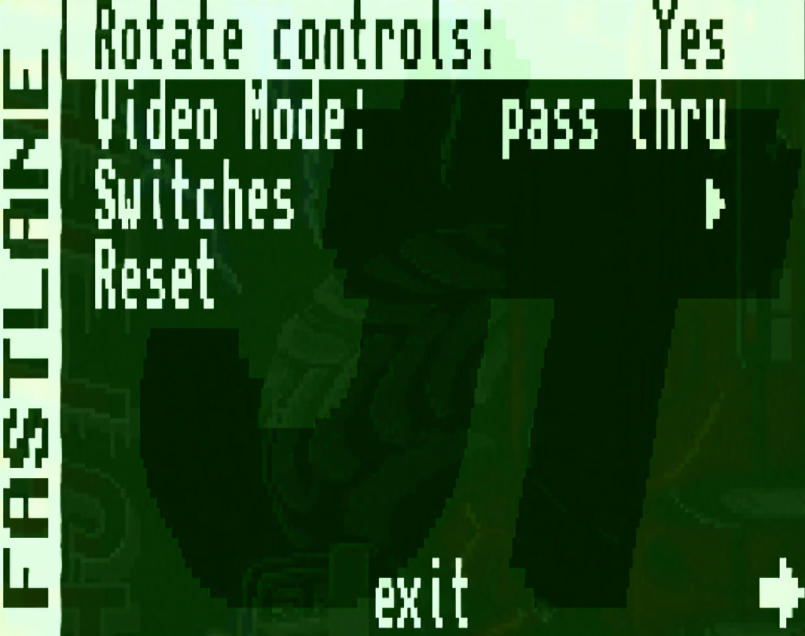
|===

Estas son las principales:

- `Rotate Controls`: Para girar el texto del menú de opciones, así como el comportamiento de los controles de dirección
- `Video Mode`: Sólo en el caso de salida de vídeo VGA, para aplicar distintos filtros a la imagen
- `Switches`: Accede a ver y modificar el estado de los https://es.wikipedia.org/wiki/Interruptor_DIP[interruptores DIP] que haya definidos en el fichero ARC
- `Reset`: Soft Reset (reinicia el Core)
- `Exit`: Cierra el menú de opciones

<<<

==== The FairyLand Story (Jotego)

https://es.wikipedia.org/wiki/The_Fairyland_Story[The Fairyland Story], es un videojuego de plataformas desarrollado por Taito y lanzado en julio de 1985 en Japón para máquina recreativa.

Este core permite ejecutar ROM de varios juegos (consultar <<#_the_fairyland_story_hardware,la sección de referencias para más información>>).

La versión para neptUNO+ está basada en la https://github.com/jotego/jtcores/tree/master/cores/flstory[versión original de Jotego].

Algunas de las características del core son:

- Salida de vídeo VGA
- Salida de vídeo RGB (utilizando el puerto VGA)
- Soporte de mando real y mando emulado en teclado

===== Formato de Tarjeta microSD

Se debe utilizar una tarjeta microSD, con la primera partición en formato exFAT o FAT32, donde se hayan copiado los ficheros ARC y ROM correspondientes de los juegos.

Para <<#_mra_tool,crear los ficheros ROM y ARC>>, se pueden obtener los ficheros MRA correspondientes del https://github.com/jotego/jtbin/tree/master/mra[repositorio del creador] del core original.

===== Controles

====== Teclas especiales y botones

Durante la ejecución del core:

- `F12` o botones `Start+Select` de un mando: mostrar el menú de control del core
- Teclas de cursor o el mando 1: Controles de dirección del jugador uno
- Ratón: Apuntar y disparar en juegos que utilizan una https://es.wikipedia.org/wiki/Pistola_de_luz[pistola de luz]
- `Ctrl`, `Alt` y `Espacio` o botones `A`, `B`, `Select` del mando 1: Botones 1, 2 y 3 del jugador uno
- `R`,`D`,`F`,`G` o mando 2: Movimiento del jugador dos
- `A`, `S` y `Q` o botones `A`, `B`, `Select` del mando 2: Botones 1, 2 y 3 del jugador dos
- `1` y `2` o botón `L` de un mando: Iniciar partida jugador 1 o jugador 2
- `5` y `6` o botón `R` de un mando: Insertar una moneda
- `P` o botón `L2` de un mando: Pausa
- `F3`: Soft Reset (reinicia el Core)

<<<

===== Guía básica

Al pulsar `F12`, se mostrará el menú con las distintas opciones del core. Se puede navegar utilizando las teclas de cursor. `Enter` selecciona un elemento.

[role="center",width="50%",cols="1a", frame=none, grid=none]
|===
|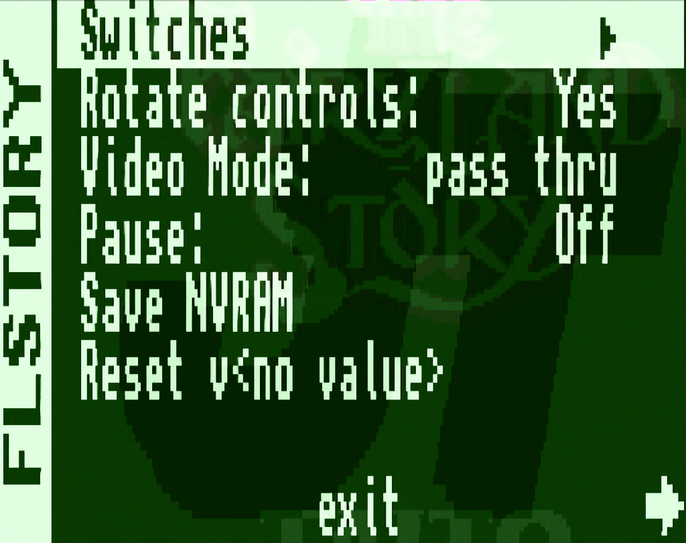
|===

Estas son las principales:

- `Switches`: Accede a ver y modificar el estado de los https://es.wikipedia.org/wiki/Interruptor_DIP[interruptores DIP] que haya definidos en el fichero ARC
- `Rotate Controls`: Para girar el texto del menú de opciones, así como el comportamiento de los controles de dirección
- `Video Mode`: Sólo en el caso de salida de vídeo VGA, para aplicar distintos filtros a la imagen
- `Pause`: Para detener el core
- `Save NVRAM`: Para guardar el contenido de la NVRAM (récords de puntuación) en la tarjeta microSD
- `Reset`: Soft Reset (reinicia el Core)
- `Exit`: Cierra el menú de opciones

<<<

==== The Final Round (Jotego)

https://es.wikipedia.org/wiki/The_Final_Round[The Final Round], es un videojuego de boxeo para máquina recreativa lanzado por Konami en 1988.

La versión para neptUNO+ está basada en la https://github.com/jotego/jtcores/tree/master/cores/fround[versión original de Jotego].

Algunas de las características del core son:

- Salida de vídeo VGA
- Salida de vídeo RGB (utilizando el puerto VGA)
- Soporte de mando real y mando emulado en teclado

===== Formato de Tarjeta microSD

Se debe utilizar una tarjeta microSD, con la primera partición en formato exFAT o FAT32, donde se hayan copiado los ficheros ARC y ROM correspondientes de los juegos.

Para <<#_mra_tool,crear los ficheros ROM y ARC>>, se pueden obtener los ficheros MRA correspondientes del https://github.com/jotego/jtbin/tree/master/mra[repositorio del creador] del core original.

===== Controles

====== Teclas especiales y botones

Durante la ejecución del core:

- `F12` o botones `Start+Select` de un mando: mostrar el menú de control del core
- Teclas de cursor o el mando 1: Controles de dirección del jugador uno
- `Ctrl`, `Alt` y `Espacio` o botones `A`, `B`, `Select` del mando 1: Botones 1, 2 y 3 del jugador uno
- `R`,`D`,`F`,`G` o mando 2: Movimiento del jugador dos
- `A`, `S` y `Q` o botones `A`, `B`, `Select` del mando 2: Botones 1, 2 y 3 del jugador dos
- `1` y `2` o botón `R` de un mando: Iniciar partida jugador 1 o jugador 2
- `5` y `6` o botón `L` de un mando: Insertar una moneda
- `P` o botón `L2` de un mando: Pausa
- `F3`: Soft Reset (reinicia el Core)

<<<

===== Guía básica

Al pulsar `F12`, se mostrará el menú con las distintas opciones del core. Se puede navegar utilizando las teclas de cursor. `Enter` selecciona un elemento.

[role="center",width="50%",cols="1a", frame=none, grid=none]
|===
|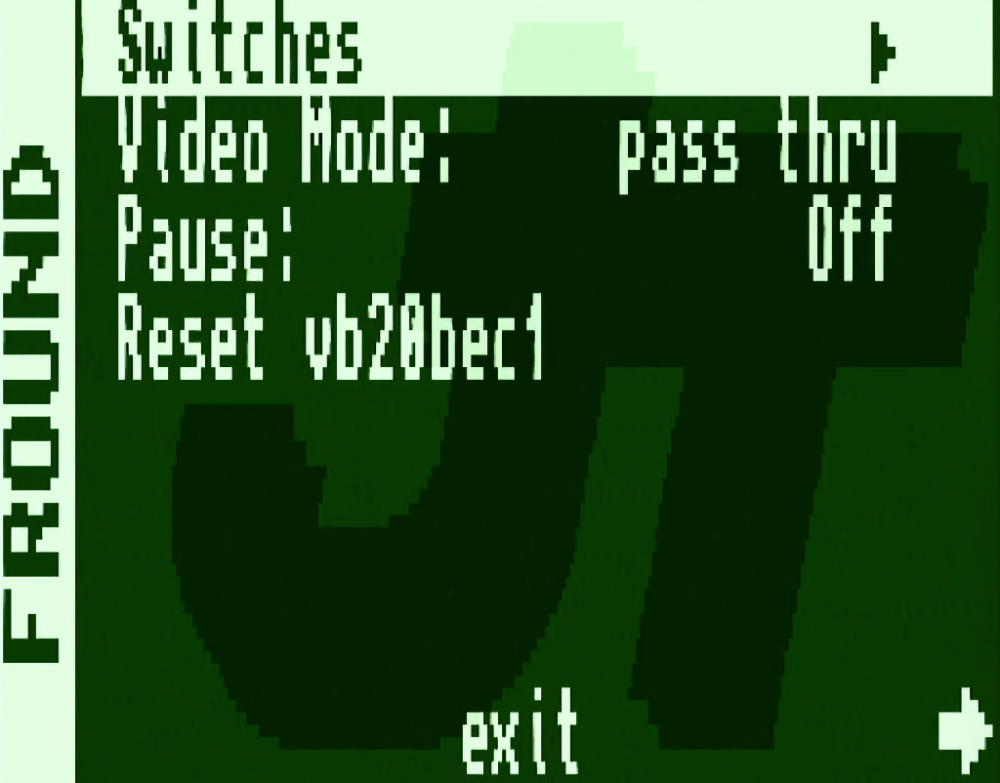
|===

Estas son las principales:

- `Switches`: Accede a ver y modificar el estado de los https://es.wikipedia.org/wiki/Interruptor_DIP[interruptores DIP] que haya definidos en el fichero ARC
- `Video Mode`: Sólo en el caso de salida de vídeo VGA, para aplicar distintos filtros a la imagen
- `Pause`: Para detener el core
- `Reset`: Soft Reset (reinicia el Core)
- `Exit`: Cierra el menú de opciones

<<<

==== Ninja Gaiden (Jotego)

https://es.wikipedia.org/wiki/Ninja_Gaiden_(juego_de_arcade)[Ninja Gaiden], lanzado en Japón como Ninja Ryukenden y en Europa como Shadow Warriors, es un juego de 1988, lanzado por Tecmo como para máquinas recreativas.

Este core permite ejecutar ROM de varios juegos (consultar <<#_ninja_gaiden_hardware,la sección de referencias para más información>>).

La versión para neptUNO+ está basada en la https://github.com/jotego/jtcores/tree/master/cores/gaiden[versión original de Jotego].

Algunas de las características del core son:

- Salida de vídeo VGA
- Salida de vídeo RGB (utilizando el puerto VGA)
- Soporte de mando real y mando emulado en teclado

===== Formato de Tarjeta microSD

Se debe utilizar una tarjeta microSD, con la primera partición en formato exFAT o FAT32, donde se hayan copiado los ficheros ARC y ROM correspondientes de los juegos.

Para <<#_mra_tool,crear los ficheros ROM y ARC>>, se pueden obtener los ficheros MRA correspondientes del https://github.com/jotego/jtbin/tree/master/mra[repositorio del creador] del core original.

===== Controles

====== Teclas especiales y botones

Durante la ejecución del core:

- `F12` o botones `Start+Select` de un mando: mostrar el menú de control del core
- Teclas de cursor o el mando 1: Controles de dirección del jugador uno
- `Ctrl`, `Alt` y `Espacio` o botones `A`, `B`, `Select` del mando 1: Botones 1, 2 y 3 del jugador uno
- `R`,`D`,`F`,`G` o mando 2: Movimiento del jugador dos
- `A`, `S` y `D` o botones `A`, `B`, `Select` del mando 2: Botones 1, 2 y 3 del jugador dos
- `1` y `2` o botón `L` de un mando: para iniciar partida jugador 1 o jugador 2
- `5` y `6` o botón `R` de un mando: para insertar una moneda
- `P` o botón `L2` de un mando: Pausa
- `F3`: Soft Reset (reinicia el Core)

<<<

===== Guía básica

Al pulsar `F12`, se mostrará el menú con las distintas opciones del core. Se puede navegar utilizando las teclas de cursor. `Enter` selecciona un elemento.

[role="center",width="50%",cols="1a", frame=none, grid=none]
|===
|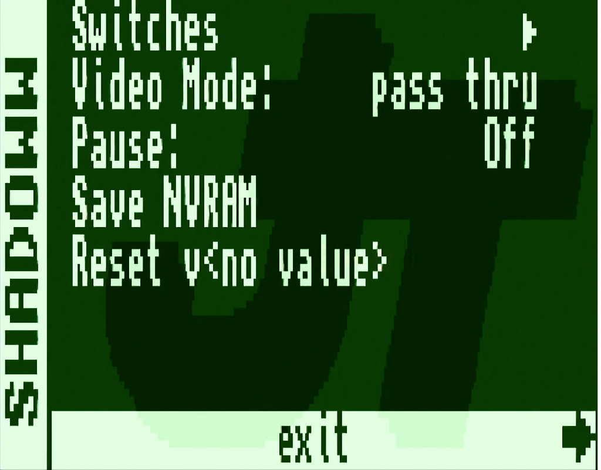
|===

Estas son las principales:

- `Switches`: Accede a ver y modificar el estado de los https://es.wikipedia.org/wiki/Interruptor_DIP[interruptores DIP] que haya definidos en el fichero ARC
- `Video Mode`: Sólo en el caso de salida de vídeo VGA, para aplicar distintos filtros a la imagen
- `Pause`: Para detener el core
- `Save NVRAM`: Para guardar el contenido de la NVRAM (récords de puntuación) en la tarjeta microSD
- `Reset`: Soft Reset (reinicia el Core)
- `Exit`: Cierra el menú de opciones

<<<

==== Ghosts'n Goblins (Jotego)

https://es.wikipedia.org/wiki/Ghosts_%27n_Goblins[Ghosts 'n Goblins] es un videojuego de plataformas de máquina recreativa creado por Capcom y lanzado en 1985.

La versión para neptUNO+ está basada en la https://github.com/jotego/jtcores/tree/master/cores/gng[versión original de Jotego].

Algunas de las características del core son:

- Salida de vídeo VGA
- Salida de vídeo RGB (utilizando el puerto VGA)
- Soporte de mando real y mando emulado en teclado

===== Formato de Tarjeta microSD

Se debe utilizar una tarjeta microSD, con la primera partición en formato exFAT o FAT32, donde se hayan copiado los ficheros ARC y ROM correspondientes de los juegos.

Para <<#_mra_tool,crear los ficheros ROM y ARC>>, se pueden obtener los ficheros MRA correspondientes del https://github.com/jotego/jtbin/tree/master/mra[repositorio del creador] del core original.

===== Controles

====== Teclas especiales y botones

Durante la ejecución del core:

- `F12` o botones `Start+Select` de un mando: mostrar el menú de control del core
- Teclas de cursor o el mando 1: Controles de dirección
- `Ctrl`, `Alt` o botones `A`, `B` del mando 1: botones `A`, `B`
- `1` y `2` o botón `Select` de un mando: Iniciar partida de 1 ó 2 jugadores
- `5` y `6` o botón `Start` de un mando: Insertar una moneda
- `P` o botón `X` de un mando: Pausa
- `F3`: Soft Reset (reinicia el Core)

<<<

===== Guía básica

Al pulsar `F12`, se mostrará el menú con las distintas opciones del core. Se puede navegar utilizando las teclas de cursor. `Enter` selecciona un elemento.

[role="center",width="50%",cols="1a", frame=none, grid=none]
|===
|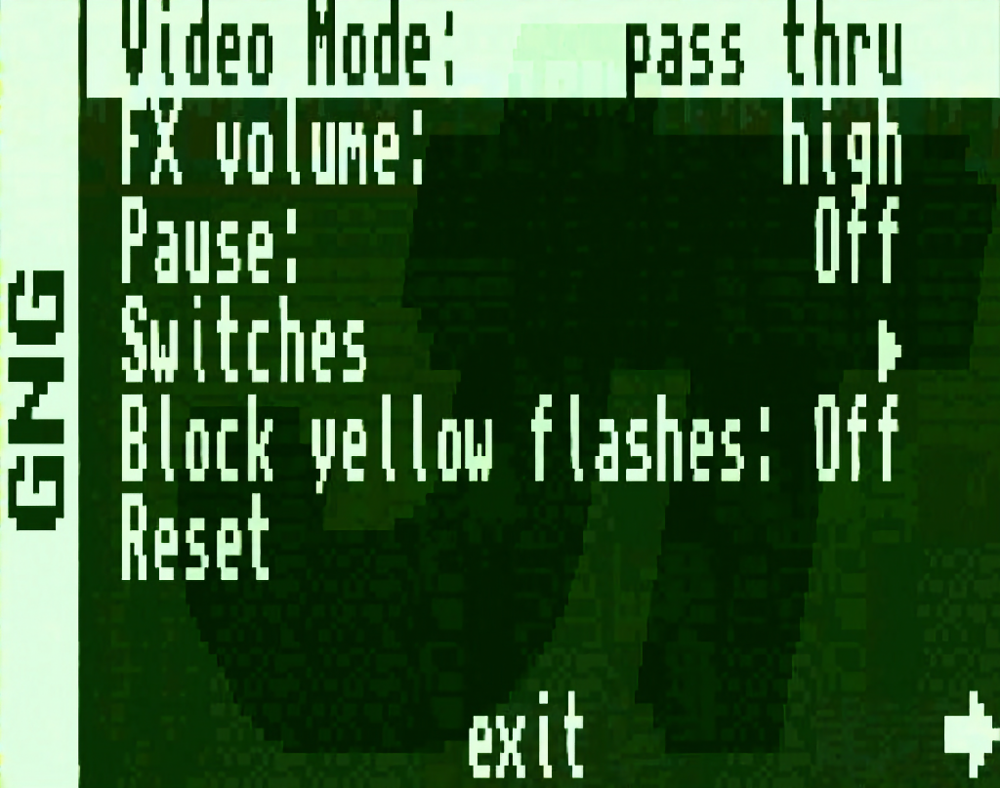
|===

Estas son las principales:

- `Video Mode`: Sólo en el caso de salida de vídeo VGA, para aplicar distintos filtros a la imagen
- `FX Volume`: Volumen de los efectos de sonido
- `Pause`: Para detener el core
- `Switches`: Accede a ver y modificar el estado de los https://es.wikipedia.org/wiki/Interruptor_DIP[interruptores DIP] que haya definidos en el fichero ARC
- `Block yellow flashes`: Permite desactivar o activar los parpadeos en amarillo del hardware original
- `Reset`: Soft Reset (reinicia el Core)
- `Exit`: Cierra el menú de opciones

<<<

==== Gun.Smoke (Jotego)

https://en.wikipedia.org/wiki/Gun.Smoke[Gun.Smoke] es un videojuego de desplazamiento vertical lanzado como máqina recreativa en 1985.

La versión para neptUNO+ está basada en la https://github.com/jotego/jtcores/tree/master/cores/gunsmk[versión original de Jotego].

Algunas de las características del core son:

- La salida de vídeo mantiene la rotación del original
- Salida de vídeo VGA
- Salida de vídeo RGB (utilizando el puerto VGA)
- Soporte de mando real y mando emulado en teclado

===== Formato de Tarjeta microSD

Se debe utilizar una tarjeta microSD, con la primera partición en formato exFAT o FAT32, donde se hayan copiado los ficheros ARC y ROM correspondientes de los juegos.

Para <<#_mra_tool,crear los ficheros ROM y ARC>>, se pueden obtener los ficheros MRA correspondientes del https://github.com/jotego/jtbin/tree/master/mra[repositorio del creador] del core original.

===== Controles

====== Teclas especiales y botones

Durante la ejecución del core:

- `F12` o botones `Start+Select` de un mando: mostrar el menú de control del core
- Teclas de cursor o el mando 1: Controles de dirección
- `Ctrl`, `Alt` y `Espacio` o botones `A`, `B`, `Select` del mando 1: Botones 1, 2 y 3 del jugador
- `1` y `2` o botón `Start` de un mando: Iniciar partida de 1 ó 2 jugadores
- `5` y `6` o botón `X` de un mando: Insertar una moneda
- `P` o botón `Y` de un mando: Pausa
- `F3`: Soft Reset (reinicia el Core)

<<<

===== Guía básica

Al pulsar `F12`, se mostrará el menú con las distintas opciones del core. Se puede navegar utilizando las teclas de cursor. `Enter` selecciona un elemento.

[role="center",width="50%",cols="1a", frame=none, grid=none]
|===
|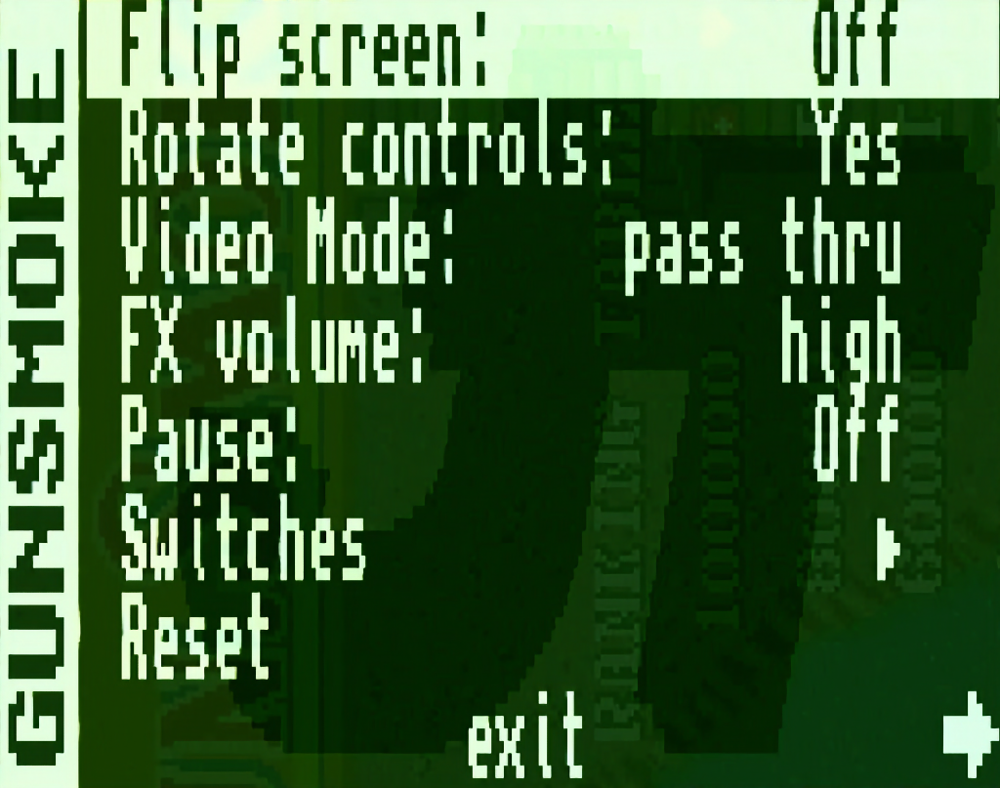
|===

Estas son las principales:

Estas son las principales:

- `Flip Screen`: Para rotar 180º cómo se muestra la imagen en la pantalla
- `Rotate Controls`: Para girar el texto del menú de opciones, así como el comportamiento de los controles de dirección
- `Video Mode`: Sólo en el caso de salida de vídeo VGA, para aplicar distintos filtros a la imagen
- `FX Volume`: Volumen de los efectos de sonido
- `Pause`: Para detener el core
- `Switches`: Accede a ver y modificar el estado de los https://es.wikipedia.org/wiki/Interruptor_DIP[interruptores DIP] que haya definidos en el fichero ARC
- `Reset`: Soft Reset (reinicia el Core)
- `Exit`: Cierra el menú de opciones

<<<

==== Karnov (Jotego)

https://es.wikipedia.org/wiki/Karnov{Karnov}es juego de máquina recreativa de plataformas lanzado en 1987 por Data East.

Este core permite ejecutar ROM de varios juegos (consultar <<#_karnov_hardware,la sección de referencias para más información>>).

La versión para neptUNO+ está basada en https://github.com/jotego/jtcores/tree/master/cores/karnov[versión original de Jotego].

Algunas de las características del core son:

- La salida de vídeo mantiene la rotación del original
- Salida de vídeo VGA
- Salida de vídeo RGB (utilizando el puerto VGA)
- Soporte de mando real y mando emulado en teclado

===== Formato de Tarjeta microSD

Se debe utilizar una tarjeta microSD, con la primera partición en formato exFAT o FAT32, donde se hayan copiado los ficheros ARC y ROM correspondientes de los juegos.

Para <<#_mra_tool,crear los ficheros ROM y ARC>>, se pueden obtener los ficheros MRA correspondientes del del https://github.com/jotego/jtbin/tree/master/mra[repositorio del creador] del core original.

===== Controles

====== Teclas especiales y botones

Durante la ejecución del core:

- `F12` o botones `Start+Select` del mando: mostrar el menú de control del core
- Teclas de cursor o el mando 1: Controles de dirección del jugador
- `Ctrl`, `Alt` o botones `A`, `B` del mando 1: Botones del jugador
- `1` y `2` o botón `X` de un mando: Iniciar partida 1 o 2 jugadores
- `5` y `6` o botón `Y` de un mando: Insertar una moneda
- `P` o botón `L` de un mando: Pausa
- `F3`: Soft Reset (reinicia el Core)

<<<

===== Guía básica

Al pulsar `F12`, se mostrará el menú con las distintas opciones del core. Se puede navegar utilizando las teclas de cursor. `Enter` selecciona un elemento.

[role="center",width="50%",cols="1a", frame=none, grid=none]
|===
|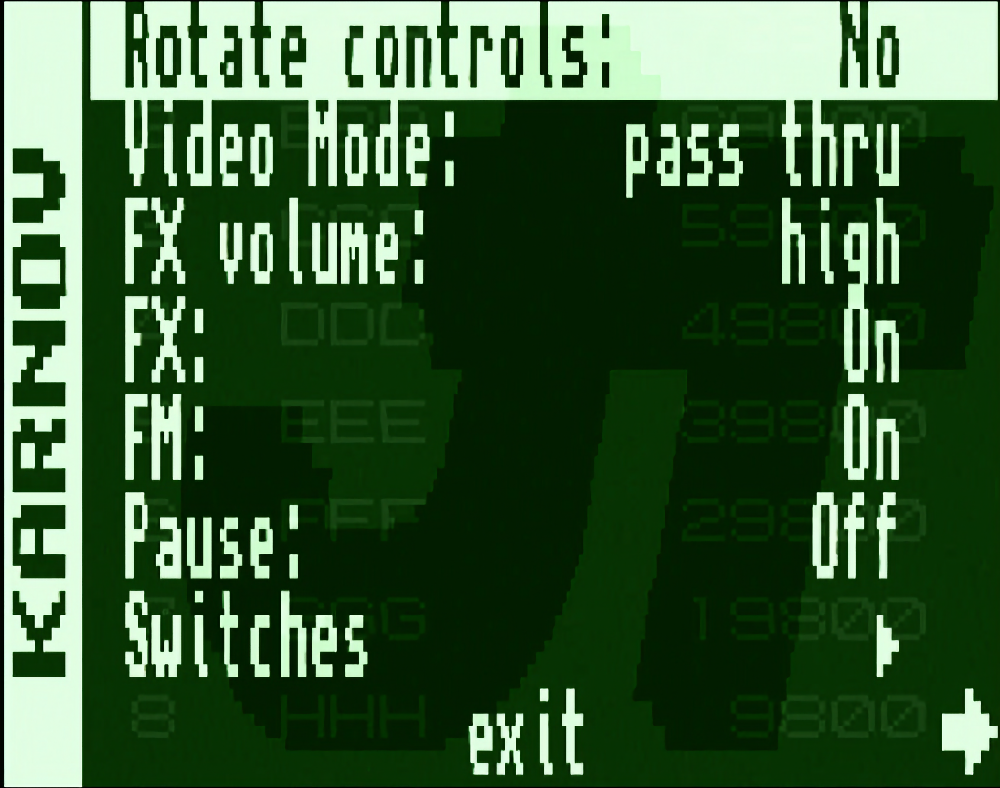
|===

Estas son las principales:

- `Rotate Controls`: Para girar el texto del menú de opciones, así como el comportamiento de los controles de dirección
- `Video Mode`: Sólo en el caso de salida de vídeo VGA, para aplicar distintos filtros a la imagen
- `FX Volume`: Volumen de los efectos de sonido
- `FX`: Activar o desactivar efectos de sonido
- `FM`: Activar o desactivar efectos de sonido FM
- `Pause`: Para detener el core
- `Switches`: Accede a ver y modificar el estado de los https://es.wikipedia.org/wiki/Interruptor_DIP[interruptores DIP] que haya definidos en el fichero ARC
- `Reset`: Soft Reset (reinicia el Core)
- `Exit`: Cierra el menú de opciones

<<<

==== Karate Champ (Jotego)

https://es.wikipedia.org/wiki/Karate_Champ[Karate Champ] conocido en Japón como Karate Dō es un videojuego desarrollado por Technos Japan para Data East lanzado en máquina recreativa en 1984.

La versión para neptUNO+ está basada en la la https://github.com/jotego/jtcores/tree/master/cores/kchamp[versión original de Jotego].

Algunas de las características del core son:

- La salida de vídeo mantiene la rotación del original
- Salida de vídeo VGA
- Salida de vídeo RGB (utilizando el puerto VGA)
- Soporte de mando real y mando emulado en teclado

===== Formato de Tarjeta microSD

Se debe utilizar una tarjeta microSD, con la primera partición en formato exFAT o FAT32, donde se hayan copiado los ficheros ARC y ROM correspondientes de los juegos.

Para <<#_mra_tool,crear los ficheros ROM y ARC>>, se pueden obtener los ficheros MRA correspondientes del https://github.com/jotego/jtbin/tree/master/mra[repositorio del creador] del core original.

===== Controles

====== Teclas especiales y botones

Durante la ejecución del core:

- `F12` o botones `Start+Select` de un mando: mostrar el menú de control del core
- Teclas de cursor o el mando 1: Controles de dirección
- `Ctrl`, `Alt`, `Espacio` y `Z` o botones `A`, `B`, `Start` y `Select` del mando 1: Botones 1, 2, 3 y 4 del jugador
- `1` y `2` o botón `X` de un mando: Iniciar partida 1 ó 2 jugadores
- `5` y `6` o botón `Y` de un mando: Insertar una moneda
- `P` o botón `L` de un mando: Pausa
- `F3`: Soft Reset (reinicia el Core)

<<<

===== Guía básica

Al pulsar `F12`, se mostrará el menú con las distintas opciones del core. Se puede navegar utilizando las teclas de cursor. `Enter` selecciona un elemento.

[role="center",width="50%",cols="1a", frame=none, grid=none]
|===
|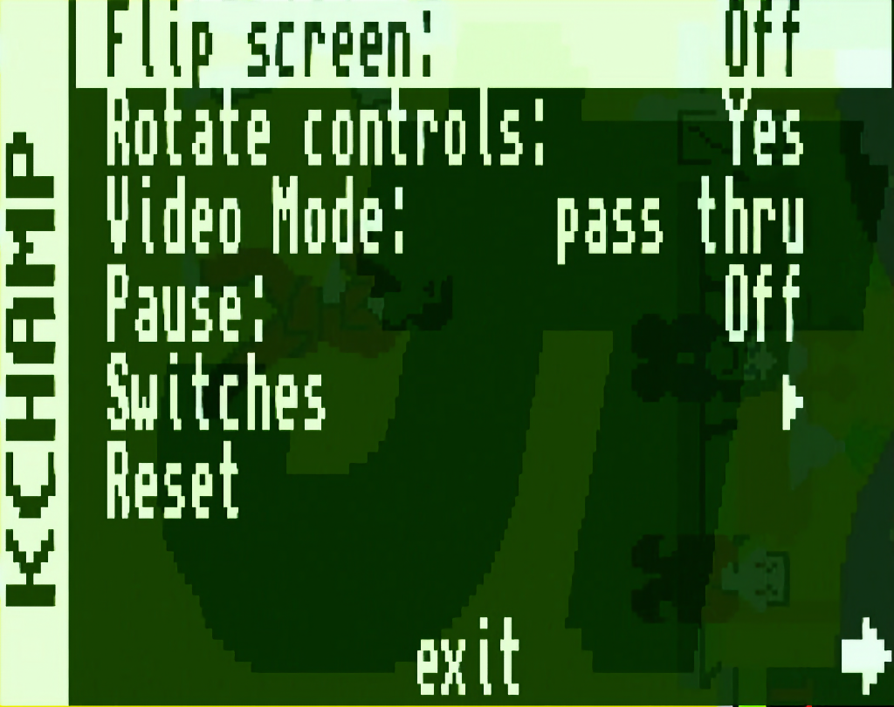
|===

Estas son las principales:

- `Flip Screen`: Para rotar 180º cómo se muestra la imagen en la pantalla
- `Rotate Controls`: Para girar el texto del menú de opciones, así como el comportamiento de los controles de dirección
- `Video Mode`: Sólo en el caso de salida de vídeo VGA, para aplicar distintos filtros a la imagen
- `Pause`: Para detener el core
- `Switches`: Accede a ver y modificar el estado de los https://es.wikipedia.org/wiki/Interruptor_DIP[interruptores DIP] que haya definidos en el fichero ARC
- `Reset`: Soft Reset (reinicia el Core)
- `Exit`: Cierra el menú de opciones

<<<

==== Kicker (Jotego)

Kicker (o Shao-lin's Road) es un https://en.wikipedia.org/wiki/Shao-lin%27s_Road[videojuego lanzado para máquinas recreativas] en 1985, por Konami.

La versión para neptUNO+ está basada en la https://github.com/jotego/jtcores/tree/master/cores/kicker[versión original de Jotego].

Algunas de las características del core son:

- La salida de vídeo mantiene la rotación del original
- Salida de vídeo VGA
- Salida de vídeo RGB (utilizando el puerto VGA)
- Soporte de mando real y mando emulado en teclado

===== Formato de Tarjeta microSD

Se debe utilizar una tarjeta microSD, con la primera partición en formato exFAT o FAT32, donde se hayan copiado los ficheros ARC y ROM correspondientes de los juegos.

Para <<#_mra_tool,crear los ficheros ROM y ARC>>, se pueden obtener los ficheros MRA correspondientes del https://github.com/jotego/jtbin/tree/master/mra[repositorio del creador] del core original.

===== Controles

====== Teclas especiales y botones

Durante la ejecución del core:

- `F12` o botones `Start+Select` de un mando: mostrar el menú de control del core
- Teclas de cursor o el mando 1: Controles de dirección
- `Ctrl`, `Alt` o botones `A`, `B` del mando 1: Botones 1, 2
- `1` y `2` o botón `Select` de un mando: Iniciar partida de 1 o 2 jugadores
- `5` y `6` o botón `Start` de un mando: Insertar una moneda
- `P` o botón `X` de un mando: Pausa
- `F3`: Soft Reset (reinicia el Core)

<<<

===== Guía básica

Al pulsar `F12`, se mostrará el menú con las distintas opciones del core. Se puede navegar utilizando las teclas de cursor. `Enter` selecciona un elemento.

[role="center",width="50%",cols="1a", frame=none, grid=none]
|===
|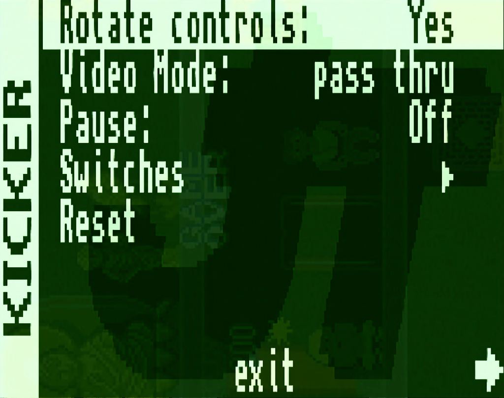
|===

Estas son las principales:

- `Rotate Controls`: Para girar el texto del menú de opciones, así como el comportamiento de los controles de dirección
- `Video Mode`: Sólo en el caso de salida de vídeo VGA, para aplicar distintos filtros a la imagen
- `Pause`: Para detener el core
- `Switches`: Accede a ver y modificar el estado de los https://es.wikipedia.org/wiki/Interruptor_DIP[interruptores DIP] que haya definidos en el fichero ARC
- `Reset`: Soft Reset (reinicia el Core)
- `Exit`: Cierra el menú de opciones

<<<

==== The NewZealand Story (Jotego)

https://es.wikipedia.org/wiki/The_New_Zealand_Story[The NewZealand Story] es un videojuego desarrollado por la compañía Taito Corporation, que fue lanzado, originalmente como máquina recreativa, en septiembre de 1988 y posteriormente fue convertido a múltiples sistemas de la época, incluyendo consolas de videojuegos y ordenadores.

Este core permite ejecutar ROM de varios juegos (consultar <<#_the_newzealand_story_hardware,la sección de referencias para más información>>).

La versión para neptUNO+ está basada en la https://github.com/jotego/jtcores/tree/master/cores/kiwi[versión original de Jotego].

Algunas de las características del core son:

- Salida de vídeo VGA
- Salida de vídeo RGB (utilizando el puerto VGA)
- Soporte de mando real y mando emulado en teclado

===== Formato de Tarjeta microSD

Se debe utilizar una tarjeta microSD, con la primera partición en formato exFAT o FAT32, donde se hayan copiado los ficheros ARC y ROM correspondientes de los juegos.

Para <<#_mra_tool,crear los ficheros ROM y ARC>>, se pueden obtener los ficheros MRA correspondientes del https://github.com/jotego/jtbin/tree/master/mra[repositorio del creador] del core original.

===== Controles

====== Teclas especiales y botones

Durante la ejecución del core:

- `F12` o botones `Start+Select` de un mando: mostrar el menú de control del core
- Teclas de cursor o el mando 1: Controles de dirección del jugador uno
- `Ctrl`, `Alt` y `Espacio` o botones `A`, `B`, `Select` del mando 1: Botones 1, 2 y 3 del jugador uno
- `R`,`D`,`F`,`G` o mando 2: Movimiento del jugador dos
- `A`, `S` y `Q` o botones `A`, `B`, `Select` del mando 2: Botones 1, 2 y 3 del jugador dos
- `1` y `2` o botón `Start` de un mando: Iniciar partida jugador 1 o jugador 2
- `5` y `6` o botón `X` de un mando: Insertar una moneda
- `P` o botón `Y` de un mando: Pausa
- `F3`: Soft Reset (reinicia el Core)

<<<

===== Guía básica

Al pulsar `F12`, se mostrará el menú con las distintas opciones del core. Se puede navegar utilizando las teclas de cursor. `Enter` selecciona un elemento.

[role="center",width="50%",cols="1a", frame=none, grid=none]
|===
|image:img/jtkiwi.png[scaledwidth=100%]
|===

Estas son las principales:

Estas son las principales:

- `Switches`: Accede a ver y modificar el estado de los https://es.wikipedia.org/wiki/Interruptor_DIP[interruptores DIP] que haya definidos en el fichero ARC
- `Rotate Controls`: Para girar el texto del menú de opciones, así como el comportamiento de los controles de dirección
- `Video Mode`: Sólo en el caso de salida de vídeo VGA, para aplicar distintos filtros a la imagen
- `Sensitivity`: Ajusta la sensibilidad de los controles
- `Pause`: Para detener el core
- `Reset`: Soft Reset (reinicia el Core)
- `Exit`: Cierra el menú de opciones

<<<

==== Renegade (Jotego)

https://es.wikipedia.org/wiki/Renegade_(videojuego)[Renegade] es un videojuego lanzado para máquinas recreativas en América y Europa en 1986 por Taito.

La versión para neptUNO+ está basada en la https://github.com/jotego/jtcores/tree/master/cores/kunio[versión original de Jotego].

Algunas de las características del core son:

- Salida de vídeo VGA
- Salida de vídeo RGB (utilizando el puerto VGA)
- Soporte de mando real y mando emulado en teclado

===== Formato de Tarjeta microSD

Se debe utilizar una tarjeta microSD, con la primera partición en formato exFAT o FAT32, donde se hayan copiado los ficheros ARC y ROM correspondientes de los juegos.

Para <<#_mra_tool,crear los ficheros ROM y ARC>>, se pueden obtener los ficheros MRA correspondientes del https://github.com/jotego/jtbin/tree/master/mra[repositorio del creador] del core original.

===== Controles

====== Teclas especiales y botones

Durante la ejecución del core:

- `F12` o botones `Start+Select` de un mando: mostrar el menú de control del core
- Teclas de cursor o el mando 1: Controles de dirección del jugador
- `Ctrl`, `Alt` y `Espacio` o botones `A`, `B` y `X` del mando 1: Botones 1, 2, 3 del jugador
- `1` y `2` o botón `Start` de un mando: para iniciar partida 1 ó 2 jugadores
- `5` y `6` o botón `X` de un mando: para insertar una moneda
- `P` o botón `Y` de un mando: Pausa
- `F3`: Soft Reset (reinicia el Core)

<<<

===== Guía básica

Al pulsar `F12`, se mostrará el menú con las distintas opciones del core. Se puede navegar utilizando las teclas de cursor. `Enter` selecciona un elemento.

[role="center",width="50%",cols="1a", frame=none, grid=none]
|===
|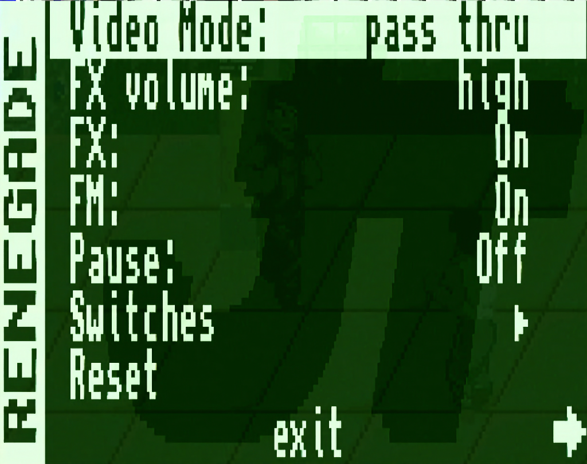
|===

Estas son las principales:

- `Video Mode`: Sólo en el caso de salida de vídeo VGA, para aplicar distintos filtros a la imagen
- `FX Volume`: Volumen de los efectos de sonido
- `FX`: Activar o desactivar efectos de sonido
- `FM`: Activar o desactivar efectos de sonido FM
- `Pause`: Para detener el core
- `Switches`: Accede a ver y modificar el estado de los https://es.wikipedia.org/wiki/Interruptor_DIP[interruptores DIP] que haya definidos en el fichero ARC
- `Reset`: Soft Reset (reinicia el Core)
- `Exit`: Cierra el menú de opciones

<<<

==== Trick Trap (Jotego)

http://adb.arcadeitalia.net/dettaglio_mame.php?game_name=tricktrp[Trick Trap], también conocido como Labyrinth Run,  es un juego publicado por Konami en 1987.

La versión para neptUNO+ está basada en la https://github.com/jotego/jtcores/tree/master/cores/labrun[versión original de Jotego].

Algunas de las características del core son:

- Salida de vídeo VGA
- Salida de vídeo RGB (utilizando el puerto VGA)
- Soporte de mando real y mando emulado en teclado

===== Formato de Tarjeta microSD

Se debe utilizar una tarjeta microSD, con la primera partición en formato exFAT o FAT32, donde se hayan copiado los ficheros ARC y ROM correspondientes de los juegos.

Para <<#_mra_tool,crear los ficheros ROM y ARC>>, se pueden obtener los ficheros MRA correspondientes del https://github.com/jotego/jtbin/blob/master/mra/Pang%20(World).mra[repositorio del creador] del core original.

===== Controles

====== Teclas especiales y botones

Durante la ejecución del core:

- `F12` o botones `Start+Select` de un mando: mostrar el menú de control del core
- Teclas de cursor o el mando 1: Controles de dirección
- `Ctrl`, `Alt` o botones `A`, `B` del mando 1: Botones 1, 2 del jugador
- `1` y `2` o botón `Select` de un mando: Iniciar partida
- `5` y `6` o botón `Start` de un mando: Insertar una moneda
- `P` o botón `X` de un mando: Pausa
- `F3`: Soft Reset (reinicia el Core)

<<<

===== Guía básica

Al pulsar `F12`, se mostrará el menú con las distintas opciones del core. Se puede navegar utilizando las teclas de cursor. `Enter` selecciona un elemento.

[role="center",width="50%",cols="1a", frame=none, grid=none]
|===
|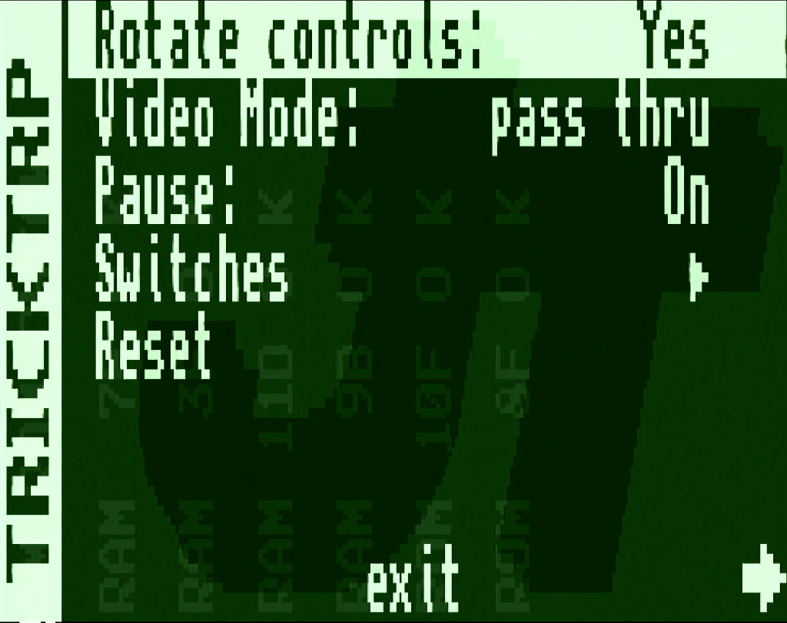
|===

Estas son las principales:

- `Rotate Controls`: Para girar el comportamiento de los controles de dirección
- `Video Mode`: Sólo en el caso de salida de vídeo VGA, para aplicar distintos filtros a la imagen
- `Pause`: Activa o desactiva la pausa
- `Switches`: Accede a ver y modificar el estado de los https://es.wikipedia.org/wiki/Interruptor_DIP[interruptores DIP] que haya definidos en el fichero ARC
- `Reset`: Soft Reset (reinicia el Core)
- `Exit`: Cierra el menú de opciones

<<<

==== Midnight Resistance (Jotego)

https://en.wikipedia.org/wiki/Midnight_Resistance[Midnight Resistance] es un juego de desplazamiento lateral producido por Data East y lanzado en máquinas recreativas en 1989.

La versión para neptUNO+ está basada en la https://github.com/jotego/jtcores/tree/master/cores/midres[versión original de Jotego].

Algunas de las características del core son:

- Salida de vídeo VGA
- Salida de vídeo RGB (utilizando el puerto VGA)
- Soporte de mando real y mando emulado en teclado

===== Formato de Tarjeta microSD

Se debe utilizar una tarjeta microSD, con la primera partición en formato exFAT o FAT32, donde se hayan copiado los ficheros ARC y ROM correspondientes de los juegos.

Para <<#_mra_tool,crear los ficheros ROM y ARC>>, se pueden obtener los ficheros MRA correspondientes del https://github.com/jotego/jtbin/tree/master/mra[repositorio del creador] del core original.

===== Controles

====== Teclas especiales y botones

Durante la ejecución del core:

- `F12` o botones `Start+Select` de un mando: mostrar el menú de control del core
- Teclas de cursor o el mando 1: Controles de dirección del jugador uno
- `Ctrl`, `Alt`, `Espacio` y `Z` o botones `A`, `B`, `Start` y `Select` del mando 1: Botones 1, 2, 3 y 4 del jugador uno
- `R`,`D`,`F`,`G` o mando 2: Movimiento del jugador dos
- `A`, `S`. `Q` y `W` o botones `A`, `B`, `Start` y `Select` del mando 2: Botones 1, 2, 3 y 4 del jugador dos
- `1` y `2` o botón `Y` de un mando: para iniciar partida jugador 1 o jugador 2
- `5` y `6` o botón `L` de un mando: para insertar una moneda
- `P` o botón `R2` de un mando: Pausa
- `F3`: Soft Reset (reinicia el Core)

<<<

===== Guía básica

Al pulsar `F12`, se mostrará el menú con las distintas opciones del core. Se puede navegar utilizando las teclas de cursor. `Enter` selecciona un elemento.

[role="center",width="50%",cols="1a", frame=none, grid=none]
|===
|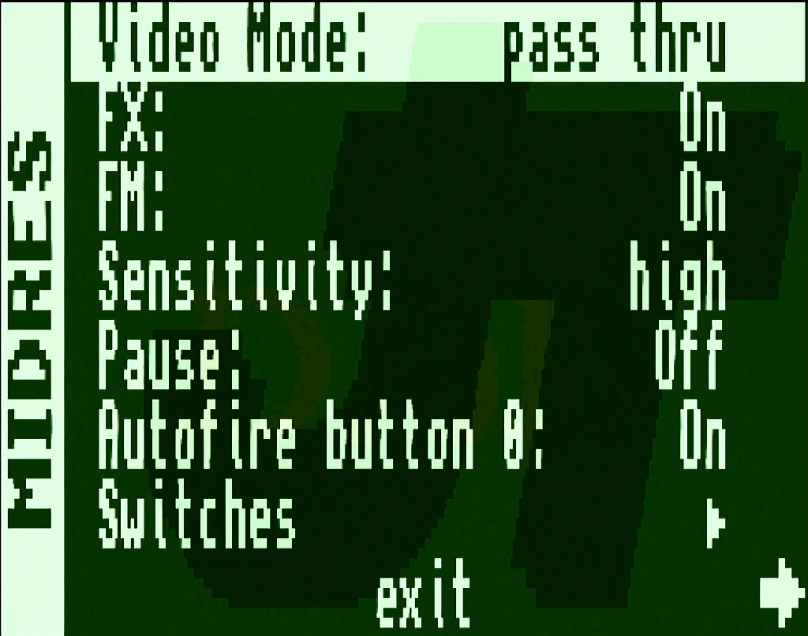
|===

Estas son las principales:

- `Video Mode`: Sólo en el caso de salida de vídeo VGA, para aplicar distintos filtros a la imagen
- `FX`: Activar o desactivar efectos de sonido
- `FM`: Activar o desactivar efectos de sonido FM
- `Sensitivity`: Ajusta la sensibilidad de los controles
- `Pause`: Para detener el core
- `Auto fire button 0`: Para activar o desactivar el disparo automático
- `Switches`: Accede a ver y modificar el estado de los https://es.wikipedia.org/wiki/Interruptor_DIP[interruptores DIP] que haya definidos en el fichero ARC
- `Save NVRAM`: Para guardar el contenido de la NVRAM (récords de puntuación) en la tarjeta microSD
- `Reset`: Soft Reset (reinicia el Core)
- `Exit`: Cierra el menú de opciones

<<<

==== Mikie (Jotego)

https://en.wikipedia.org/wiki/Mikie[Mikie] es un videojuego de máquina recreativa desarrollado y lanzado por Konami en 1984.

La versión para neptUNO+ está basada en la https://github.com/jotego/jtcores/tree/master/cores/mikie[versión original de Jotego].

Algunas de las características del core son:

- Salida de vídeo VGA
- Salida de vídeo RGB (utilizando el puerto VGA)
- Soporte de mando real y mando emulado en teclado

===== Formato de Tarjeta microSD

Se debe utilizar una tarjeta microSD, con la primera partición en formato exFAT o FAT32, donde se hayan copiado los ficheros ARC y ROM correspondientes de los juegos.

Para <<#_mra_tool,crear los ficheros ROM y ARC>>, se pueden obtener los ficheros MRA correspondientes del https://github.com/jotego/jtbin/tree/master/mra[repositorio del creador] del core original.

===== Controles

====== Teclas especiales y botones

Durante la ejecución del core:

- `F12` o botones `Start+Select` de un mando: mostrar el menú de control del core
- Teclas de cursor o el mando 1: Controles de dirección del jugador
- `Ctrl`, `Alt` o botones `A`, `B` del mando 1: Botones 1, 2 del jugador
- `1` y `2` o botón `Select` de un mando: para iniciar partida 1 ó 2 jugadores
- `5` y `6` o botón `Start` de un mando: para insertar una moneda
- `P` o botón `X` de un mando: Pausa
- `F3`: Soft Reset (reinicia el Core)

<<<

===== Guía básica

Al pulsar `F12`, se mostrará el menú con las distintas opciones del core. Se puede navegar utilizando las teclas de cursor. `Enter` selecciona un elemento.

[role="center",width="50%",cols="1a", frame=none, grid=none]
|===
|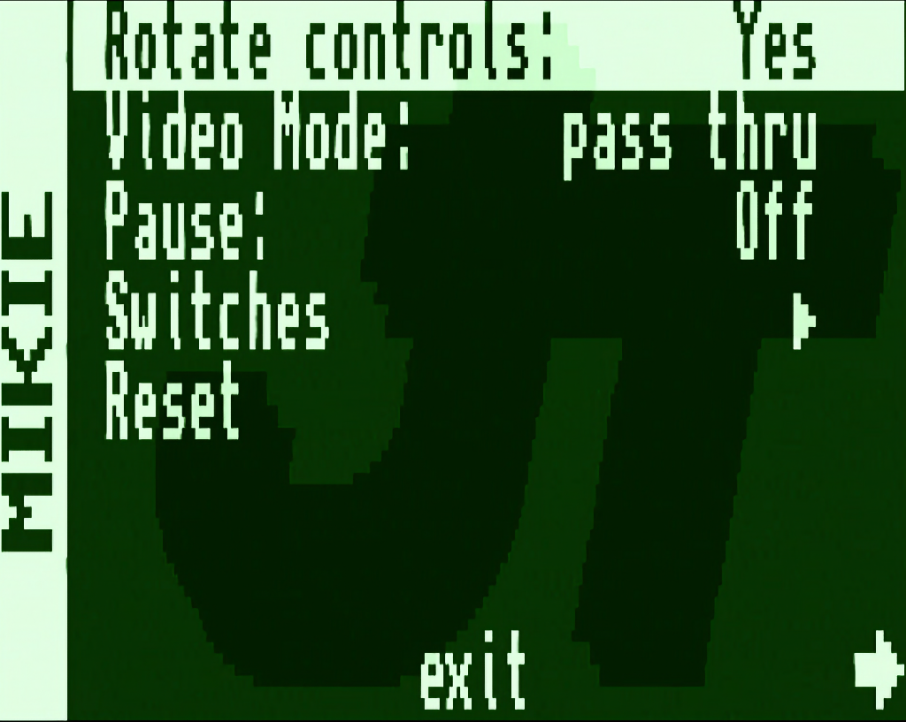
|===

Estas son las principales:

- `Rotate Controls`: Para girar el comportamiento de los controles de dirección
- `Video Mode`: Sólo en el caso de salida de vídeo VGA, para aplicar distintos filtros a la imagen
- `Pause`: Para detener el core
- `Switches`: Accede a ver y modificar el estado de los https://es.wikipedia.org/wiki/Interruptor_DIP[interruptores DIP] que haya definidos en el fichero ARC
- `Reset`: Soft Reset (reinicia el Core)
- `Exit`: Cierra el menú de opciones

<<<

==== MX 5000 (Jotego)

https://es.wikipedia.org/wiki/Flak_Attack[MX 5000], conocido en Japón como Flak Attack, es un videojuego con scroll vertical de Konami publicado originalmente como máquina recreativa en agosto de 1987.

La versión para neptUNO+ está basada en la https://github.com/jotego/jtcores/tree/master/cores/mx5k[versión original de Jotego].

Algunas de las características del core son:

- Salida de vídeo VGA
- Salida de vídeo RGB (utilizando el puerto VGA)
- Soporte de mando real y mando emulado en teclado

===== Formato de Tarjeta microSD

Se debe utilizar una tarjeta microSD, con la primera partición en formato exFAT o FAT32, donde se hayan copiado los ficheros ARC y ROM correspondientes de los juegos.

Para <<#_mra_tool,crear los ficheros ROM y ARC>>, se pueden obtener los ficheros MRA correspondientes del https://github.com/jotego/jtbin/tree/master/mra[repositorio del creador] del core original.

===== Controles

====== Teclas especiales y botones

Durante la ejecución del core:

- `F12` o botones `Start+Select` de un mando: mostrar el menú de control del core
- Teclas de cursor o el mando 1: Controles de dirección del jugador
- `Ctrl`, `Alt` o botones `A`, `B` del mando 1: Botones 1, 2 del jugador
- `1` y `2` o botón `Start` de un mando: para iniciar partida 1 ó 2 jugadores
- `5` y `6` o botón `X` de un mando: para insertar una moneda
- `P` o botón `Y` de un mando: Pausa
- `F3`: Soft Reset (reinicia el Core)

<<<

===== Guía básica

Al pulsar `F12`, se mostrará el menú con las distintas opciones del core. Se puede navegar utilizando las teclas de cursor. `Enter` selecciona un elemento.

[role="center",width="50%",cols="1a", frame=none, grid=none]
|===
|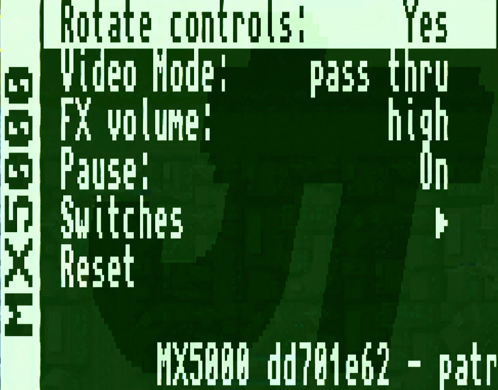
|===

Estas son las principales:

- `Rotate Controls`: Para girar el comportamiento de los controles de dirección
- `Video Mode`: Sólo en el caso de salida de vídeo VGA, para aplicar distintos filtros a la imagen
- `FX Volume`: Volumen de los efectos de sonido
- `Pause`: Para detener el core
- `Switches`: Accede a ver y modificar el estado de los https://es.wikipedia.org/wiki/Interruptor_DIP[interruptores DIP] que haya definidos en el fichero ARC
- `Reset`: Soft Reset (reinicia el Core)
- `Exit`: Cierra el menú de opciones

<<<

==== Bad Dudes Vs. DragonNinja (Jotego)

https://es.wikipedia.org/wiki/Bad_Dudes_Vs._DragonNinja[Bad Dudes Vs. DragonNinja] es un videojuego creado en 1988 por Data East para máquinas recreativas.

Este core permite ejecutar ROM de varios juegos (consultar <<#_bad_dudes_vs_dragonninja_hardware,la sección de referencias para más información>>).

La versión para neptUNO+ está basada en la https://github.com/jotego/jtcores/tree/master/cores/ninja[versión original de Jotego].

Algunas de sus características son:

- Salida de vídeo VGA
- Salida de vídeo RGB (utilizando el puerto VGA)
- Soporte de mando real y mando emulado en teclado

===== Formato de Tarjeta microSD

Se debe utilizar una tarjeta microSD, con la primera partición en formato exFAT o FAT32, donde se hayan copiado los ficheros ARC y ROM correspondientes de los juegos.

Para <<#_mra_tool,crear los ficheros ROM y ARC>>, se pueden obtener los ficheros MRA correspondientes del https://github.com/jotego/jtbin/tree/master/mra[repositorio del creador] del core original.

===== Controles

====== Teclas especiales y botones

Durante la ejecución del core:

- `F12` o botones `Start+Select` de un mando: mostrar el menú de control del core
- Teclas de cursor o el mando 1: Controles de dirección del jugador uno
- `Ctrl`, `Alt`, `Espacio` y `Mayús Izda` o botones `A`, `B`, `Start` y `Select` del mando 1: Botones 1, 2, 3 y 4 del jugador uno
- `R`,`D`,`F`,`G` o mando 2: Movimiento del jugador dos
- `A`, `S`. `Q` y `W` o botones `A`, `B`, `Start` y `Select` del mando 2: Botones 1, 2, 3 y 4 del jugador dos
- `1` y `2` o botón `Y` de un mando: para iniciar partida jugador 1 o jugador 2
- `5` y `6` o botón `L` de un mando: para insertar una moneda
- `P` o botón `R2` de un mando: Pausa
- `F3`: Soft Reset (reinicia el Core)

<<<

===== Guía básica

Al pulsar `F12`, se mostrará el menú con las distintas opciones del core. Se puede navegar utilizando las teclas de cursor. `Enter` selecciona un elemento.

[role="center",width="50%",cols="1a", frame=none, grid=none]
|===
|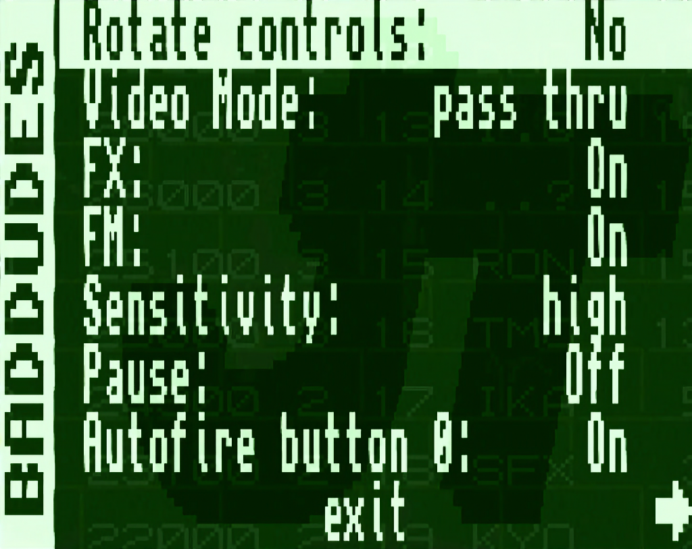
|===

Estas son las principales:

- `Rotate Controls`: Para girar el comportamiento de los controles de dirección
- `Video Mode`: Sólo en el caso de salida de vídeo VGA, para aplicar distintos filtros a la imagen
- `FX`: Activar o desactivar efectos de sonido
- `FM`: Activar o desactivar efectos de sonido FM
- `Sensitivity`: Ajusta la sensibilidad de los controles
- `Pause`: Para detener el core
- `Auto fire button 0`: Para activar o desactivar el disparo automático
- `Switches`: Accede a ver y modificar el estado de los https://es.wikipedia.org/wiki/Interruptor_DIP[interruptores DIP] que haya definidos en el fichero ARC
- `Save NVRAM`: Para guardar el contenido de la NVRAM (récords de puntuación) en la tarjeta microSD
- `Reset`: Soft Reset (reinicia el Core)
- `Exit`: Cierra el menú de opciones

<<<

==== Out Run (Jotego)

https://es.wikipedia.org/wiki/Out_Run[Out Run] es un videojuego de carreras publicado inicialmente para máquinas recreativas en 1986.

Este core permite ejecutar ROM de varios juegos (consultar <<#_out_run_hardware,la sección de referencias para más información>>).

La versión para neptUNO+ está basada en la https://github.com/jotego/jtcores/tree/master/cores/outrun[versión original de Jotego].

Algunas de las características del core son:

- Salida de vídeo VGA
- Salida de vídeo RGB (utilizando el puerto VGA)
- Soporte de mando real y mando emulado en teclado

===== Formato de Tarjeta microSD

Se debe utilizar una tarjeta microSD, con la primera partición en formato exFAT o FAT32, donde se hayan copiado los ficheros ARC y ROM correspondientes de los juegos.

Para <<#_mra_tool,crear los ficheros ROM y ARC>>, se pueden obtener los ficheros MRA correspondientes del https://github.com/jotego/jtbin/tree/master/mra[repositorio del creador] del core original.

===== Controles

====== Teclas especiales y botones

Durante la ejecución del core:

- `F12` o botones `Start+Select` de un mando: mostrar el menú de control del core
- Teclas de cursor o el mando 1: Controles de dirección
- `Ctrl`, o el botón `A` del mando 1: Acelerador
- `Alt`, o el botón `B` del mando 1: Freno
- `Espacio` o el botón `Select` del mando 1: Marcha baja
- `1` o el botón `X` del mando 1: comienzo de partida
- `5` o el botón `Y` del mando 1 para insertar una moneda
- `P` o botón `L` de un mando: Pausa
- `F3`: Soft Reset (reinicia el Core)

<<<

===== Guía básica

Al pulsar `F12`, se mostrará el menú con las distintas opciones del core. Se puede navegar utilizando las teclas de cursor. `Enter` selecciona un elemento.

[role="center",width="50%",cols="1a", frame=none, grid=none]
|===
|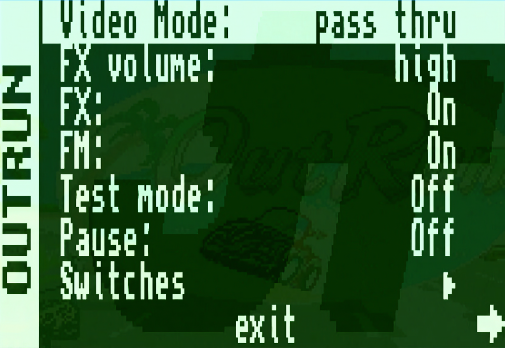
|===

Estas son las principales:

- `Video Mode`: Sólo en el caso de salida de vídeo VGA, para aplicar distintos filtros a la imagen
- `FX Volume`: Volumen de los efectos de sonido
- `FX`: Activar o desactivar efectos de sonido
- `FM`: Activar o desactivar efectos de sonido FM
- `Test Mode`: Activa o desactiva el modo de prueba
- `Pause`: Activa o desactiva la pausa
- `Switches`: Accede a ver y modificar el estado de los https://es.wikipedia.org/wiki/Interruptor_DIP[interruptores DIP] que haya definidos en el fichero ARC
- `Save NVRAM`: Para guardar el contenido de la NVRAM (récords de puntuación) en la tarjeta microSD
- `Reset`: Soft Reset (reinicia el Core)
- `Exit`: Cierra el menú de opciones

<<<

==== Pac-Land (Jotego)

https://es.wikipedia.org/wiki/Pac-Land[Pac-Land] es un videojuego de plataformas publicado para máquinas recreativas en 1984 por Namco y Bally Midway.

La versión para neptUNO+ está basada en la https://github.com/jotego/jtcores/tree/master/cores/paclan[versión original de Jotego].

Algunas de las características del core son:

- Salida de vídeo VGA
- Salida de vídeo RGB (utilizando el puerto VGA)
- Soporte de mando real y mando emulado en teclado

===== Formato de Tarjeta microSD

Se debe utilizar una tarjeta microSD, con la primera partición en formato exFAT o FAT32, donde se hayan copiado los ficheros ARC y ROM correspondientes de los juegos.

Para <<#_mra_tool,crear los ficheros ROM y ARC>>, se pueden obtener los ficheros MRA correspondientes del https://github.com/jotego/jtbin/blob/master/mra/Pac-Land%20(World).mra[repositorio del creador] del core original.

===== Controles

====== Teclas especiales y botones

Durante la ejecución del core:

- `F12` o botones `Start+Select` de un mando: mostrar el menú de control del core
- Teclas de cursor o el mando 1: Controles de dirección del jugador
- `Ctrl`, o el botón `A` del mando: botón 1, jugador
- `1` y `2` o botón `L` de un mando: para partida de 1 o 2 jugadores
- `5` y `6` o botón `R` de un mando: para insertar una moneda
- `P` o botón `L2` de un mando: Pausa
- `F3`: Soft Reset (reinicia el Core)

<<<

===== Guía básica

Al pulsar `F12`, se mostrará el menú con las distintas opciones del core. Se puede navegar utilizando las teclas de cursor. `Enter` selecciona un elemento.

[role="center",width="50%",cols="1a", frame=none, grid=none]
|===
|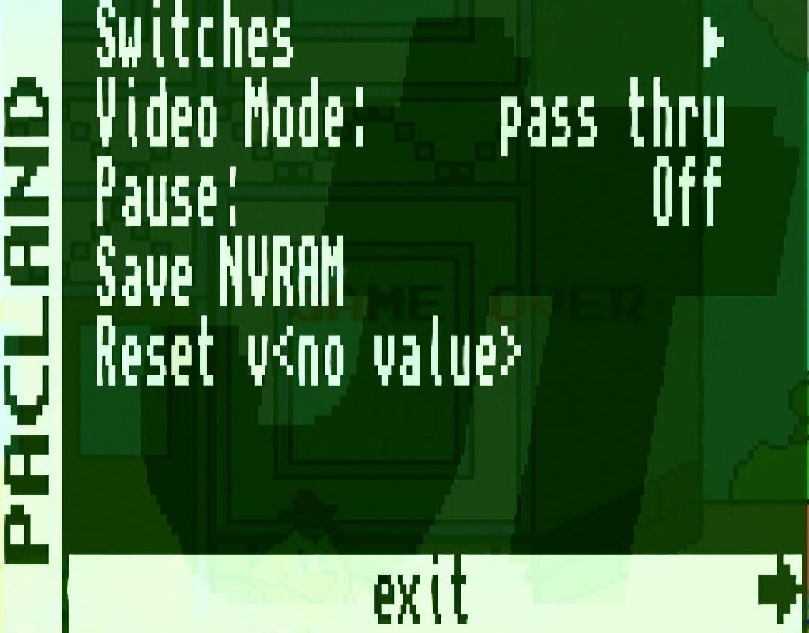
|===

Estas son las principales:

- `Switches`: Accede a ver y modificar el estado de los https://es.wikipedia.org/wiki/Interruptor_DIP[interruptores DIP] que haya definidos en el fichero ARC
- `Video Mode`: Sólo en el caso de salida de vídeo VGA, para aplicar distintos filtros a la imagen
- `Pause`: Activa o desactiva la pausa
- `Save NVRAM`: Para guardar el contenido de la NVRAM (récords de puntuación) en la tarjeta microSD
- `Reset`: Soft Reset (reinicia el Core)
- `Exit`: Cierra el menú de opciones

<<<

==== Pang (Jotego)

La https://es.wikipedia.org/wiki/Pang[versión de máquina recreativa de Pang], conocida como Pang! y Pomping World es un juego de uno o dos jugadores diseñado por Mitchell Corporation en 1989.

Este core permite ejecutar ROM de varios juegos (consultar <<#_pang_hardware,la sección de referencias para más información>>).

La versión para neptUNO+ está basada en la https://github.com/jotego/jtcores/tree/master/cores/pang[versión original de Jotego].

Algunas de las características del core son:

- Salida de vídeo VGA
- Salida de vídeo RGB (utilizando el puerto VGA)
- Soporte de mando real y mando emulado en teclado

===== Formato de Tarjeta microSD

Se debe utilizar una tarjeta microSD, con la primera partición en formato exFAT o FAT32, donde se hayan copiado los ficheros ARC y ROM correspondientes de los juegos.

Para <<#_mra_tool,crear los ficheros ROM y ARC>>, se pueden obtener los ficheros MRA correspondientes del https://github.com/jotego/jtbin/blob/master/mra/Pang%20(World).mra[repositorio del creador] del core original.

===== Controles

====== Teclas especiales y botones

Durante la ejecución del core:

- `F12` o botones `Start+Select` de un mando: mostrar el menú de control del core
- Teclas de cursor o el mando 1: Controles de dirección del jugador uno
- `Ctrl`, `Alt` o los botones `A`, `B` del mando 1: botones 1, 2 del jugador uno
- `I`,`J`,`K`,`L` o mando 2: Movimiento del jugador dos
- `A`, `S` o los botones `A`, `B` del mando 2: botones 1, 2 del jugador dos
- `1` y `2` o botón `X` de un mando: para partida de 1 o 2 jugadores
- `5` y `6` o botón `Y` de un mando: para insertar una moneda
- `P` o botón `L` de un mando: Pausa
- `F3`: Soft Reset (reinicia el Core)

<<<

===== Guía básica

Al pulsar `F12`, se mostrará el menú con las distintas opciones del core. Se puede navegar utilizando las teclas de cursor. `Enter` selecciona un elemento.

[role="center",width="50%",cols="1a", frame=none, grid=none]
|===
|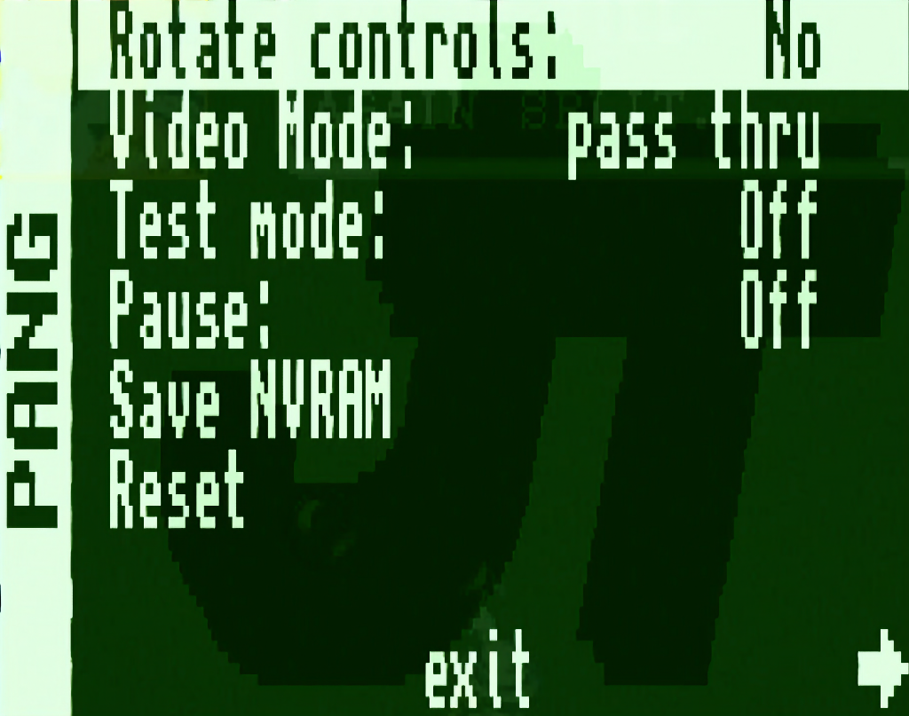
|===

Estas son las principales:

- `Rotate Controls`: Para girar el comportamiento de los controles de dirección
- `Video Mode`: Sólo en el caso de salida de vídeo VGA, para aplicar distintos filtros a la imagen
- `Test Mode`: Activa o desactiva el modo de prueba
- `Pause`: Activa o desactiva la pausa
- `Save NVRAM`: Para guardar el contenido de la NVRAM (récords de puntuación) en la tarjeta microSD
- `Reset`: Soft Reset (reinicia el Core)
- `Exit`: Cierra el menú de opciones

<<<

==== Parodius Da! (Jotego)

https://es.wikipedia.org/wiki/Parodius_Da![Parodius Da!] es el segundo juego de la serie Parodius producido por Konami y su funcionamiento y aspectos es por ende, semejante a los demás de la serie, todos ellos clara parodia de Gradius. Fue lanzado como máquina recreativa en abril de 1990 siendo después convertido a diferentes plataformas domésticas.

Este core permite ejecutar ROM de varios juegos (consultar <<#_parodius_da_hardware,la sección de referencias para más información>>).

La versión para neptUNO+ está basada en la https://github.com/jotego/jtcores/tree/master/cores/paroda[versión original de Jotego].

Algunas de las características del core son:

- Salida de vídeo VGA
- Salida de vídeo RGB (utilizando el puerto VGA)
- Soporte de mando real y mando emulado en teclado

===== Formato de Tarjeta microSD

Se debe utilizar una tarjeta microSD, con la primera partición en formato exFAT o FAT32, donde se hayan copiado los ficheros ARC y ROM correspondientes de los juegos.

Para <<#_mra_tool,crear los ficheros ROM y ARC>>, se pueden obtener los ficheros MRA correspondientes del https://github.com/jotego/jtbin/tree/master/mra[repositorio del creador] del core original.

===== Controles

====== Teclas especiales y botones

Durante la ejecución del core:

- `F12` o botones `Start+Select` de un mando: mostrar el menú de control del core
- Teclas de cursor o el mando 1: Controles de dirección del jugador
- `Ctrl`, `Alt` o botones `A`, `B` del mando 1: Botones 1, 2 del jugador
- `1` y `2` o botón `L` de un mando: para iniciar partida 1 ó 2 jugadores
- `5` y `6` o botón `R` de un mando: para insertar una moneda
- `P` o botón `L2` de un mando: Pausa
- `F3`: Soft Reset (reinicia el Core)

<<<

===== Guía básica

Al pulsar `F12`, se mostrará el menú con las distintas opciones del core. Se puede navegar utilizando las teclas de cursor. `Enter` selecciona un elemento.

[role="center",width="50%",cols="1a", frame=none, grid=none]
|===
|image:img/jtparoda.png[scaledwidth=100%]
|===

Estas son las principales:

- `Switches`: Accede a ver y modificar el estado de los https://es.wikipedia.org/wiki/Interruptor_DIP[interruptores DIP] que haya definidos en el fichero ARC
- `Video Mode`: Sólo en el caso de salida de vídeo VGA, para aplicar distintos filtros a la imagen
- `Test Mode`: Activa o desactiva el modo de prueba
- `Pause`: Activa o desactiva la pausa
- `Save NVRAM`: Para guardar el contenido de la NVRAM (récords de puntuación) en la tarjeta microSD
- `Reset`: Soft Reset (reinicia el Core)
- `Exit`: Cierra el menú de opciones

<<<

==== Konami's Ping-Pong (Jotego)

https://en.wikipedia.org/wiki/Konami%27s_Ping_Pong[Konami's Ping Pong] es un juego de deportes de máquina recreativa creado por Konami en 1985.

La versión para neptUNO+ está basada en la https://github.com/jotego/jtcores/tree/master/cores/pinpon[versión original de Jotego].

Algunas de las características del core son:

- Salida de vídeo VGA
- Salida de vídeo RGB (utilizando el puerto VGA)
- Soporte de mando real y mando emulado en teclado

===== Formato de Tarjeta microSD

Se debe utilizar una tarjeta microSD, con la primera partición en formato exFAT o FAT32, donde se hayan copiado los ficheros ARC y ROM correspondientes de los juegos.

Para <<#_mra_tool,crear los ficheros ROM y ARC>>, se pueden obtener los ficheros MRA correspondientes del https://github.com/jotego/jtbin/tree/master/mra[repositorio del creador] del core original.

===== Controles

====== Teclas especiales y botones

Durante la ejecución del core:

- `F12` o botones `Start+Select` de un mando: mostrar el menú de control del core
- Teclas de cursor o el mando 1: Controles de dirección del jugador uno
- `Ctrl`, `Alt`, o botones `A`, `B` del mando 1: botones 1, 2 del jugador uno
- `I`,`J`,`K`,`L` o mando 2: Movimiento del jugador dos
- `A`, `S` o botones `A`, `B` del mando 2: botones 1, 2 del jugador dos
- `1` y `2`: o botón `Select` de un mando para partida de 1 o 2 jugadores
- `5` y `6` o botón `Start` de un mando: para insertar una moneda
- `P` o botón `X` de un mando: Pausa
- `F3`: Soft Reset (reinicia el Core)

<<<

===== Guía básica

Al pulsar `F12`, se mostrará el menú con las distintas opciones del core. Se puede navegar utilizando las teclas de cursor. `Enter` selecciona un elemento.

[role="center",width="50%",cols="1a", frame=none, grid=none]
|===
|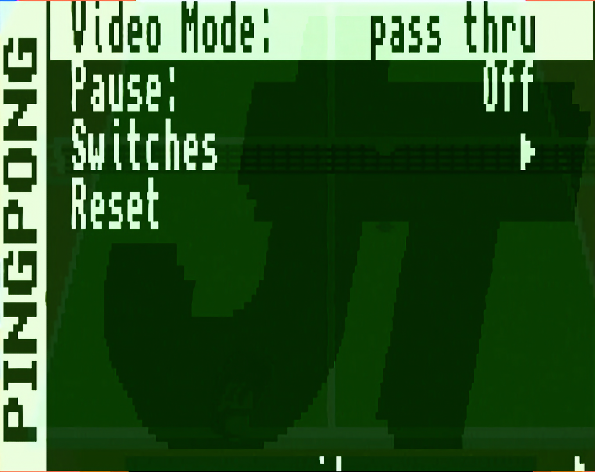
|===

Estas son las principales:

- `Video Mode`: Sólo en el caso de salida de vídeo VGA, para aplicar distintos filtros a la imagen
- `Pause`: Para activar y desactivar la pausa
- `Switches`: Accede a ver y modificar el estado de los https://es.wikipedia.org/wiki/Interruptor_DIP[interruptores DIP] que haya definidos en el fichero ARC
- `Reset`: Soft Reset (reinicia el Core)
- `Exit`: Cierra el menú de opciones

<<<

==== Rastan Saga (Jotego)

https://es.wikipedia.org/wiki/Rastan_Saga[Rastan Saga] es un juego de acción de desplazamiento lateral lanzado originalmente para máquinas recreativas en 1987 por Taito.

La versión para neptUNO+ está basada en la https://github.com/jotego/jtcores/tree/master/cores/rastan[versión original de Jotego].

Algunas de las características del core son:

- Salida de vídeo VGA
- Salida de vídeo RGB (utilizando el puerto VGA)
- Soporte de mando real y mando emulado en teclado

===== Formato de Tarjeta microSD

Se debe utilizar una tarjeta microSD, con la primera partición en formato exFAT o FAT32, donde se hayan copiado los ficheros ARC y ROM correspondientes de los juegos.

Para <<#_mra_tool,crear los ficheros ROM y ARC>>, se pueden obtener los ficheros MRA correspondientes del https://github.com/jotego/jtbin/tree/master/mra[repositorio del creador] del core original.

===== Controles

====== Teclas especiales y botones

Durante la ejecución del core:

- `F12` o botones `Start+Select` de un mando: mostrar el menú de control del core
- Teclas de cursor o el mando 1: Controles de dirección del jugador
- `Ctrl`, `Alt`, o botones `A`, `B` del mando 1: botones 1, 2 del jugador
- `1` y `2`: o botón `Select` de un mando para partida de 1 o 2 jugadores
- `5` y `6` o botón `Start` de un mando: para insertar una moneda
- `P` o botón `X` de un mando: Pausa
- `F3`: Soft Reset (reinicia el Core)

<<<

===== Guía básica

Al pulsar `F12`, se mostrará el menú con las distintas opciones del core. Se puede navegar utilizando las teclas de cursor. `Enter` selecciona un elemento.

[role="center",width="50%",cols="1a", frame=none, grid=none]
|===
|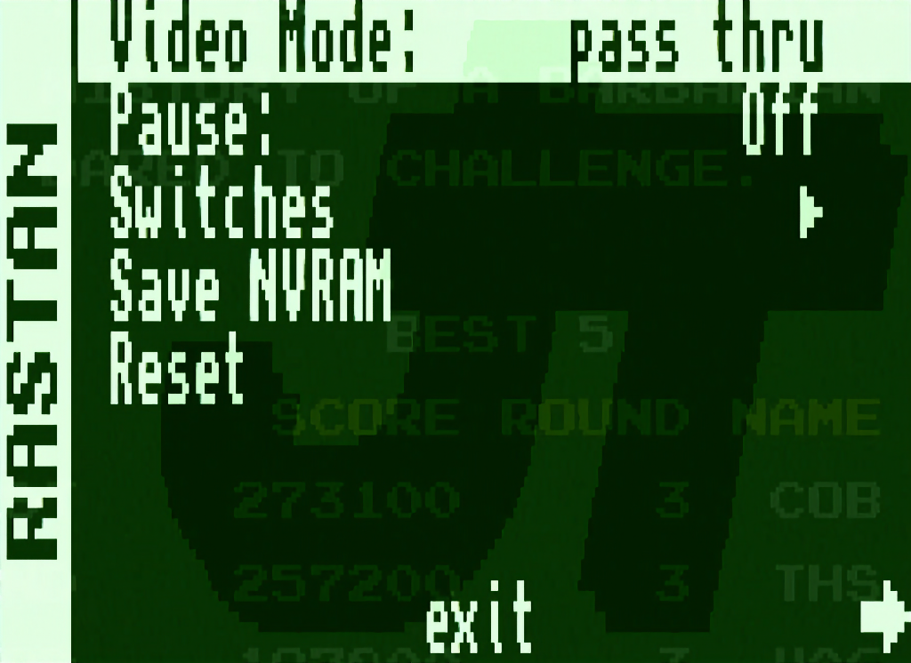
|===

Estas son las principales:

- `Video Mode`: Sólo en el caso de salida de vídeo VGA, para aplicar distintos filtros a la imagen
- `Pause`: Para detener el core
- `Switches`: Accede a ver y modificar el estado de los https://es.wikipedia.org/wiki/Interruptor_DIP[interruptores DIP] que haya definidos en el fichero ARC
- `Save NVRAM`: Para guardar el contenido de la NVRAM (récords de puntuación) en la tarjeta microSD
- `Reset`: Soft Reset (reinicia el Core)
- `Exit`: Cierra el menú de opciones

<<<

==== Road Fighter (Jotego)

https://es.wikipedia.org/wiki/Road_Fighter[Road Fighter] es un videojuego de carreras yproducido por Konami y lanzado en máquinas recreativas en 1984.

Este core permite ejecutar ROM de varios juegos (consultar <<#_road_fighter_hardware,la sección de referencias para más información>>).

La versión para neptUNO+ está basada en la https://github.com/jotego/jtcores/tree/master/cores/roadf[versión original de Jotego].

Algunas de las características del core son:

- Salida de vídeo VGA
- Salida de vídeo RGB (utilizando el puerto VGA)
- Soporte de mando real y mando emulado en teclado

===== Formato de Tarjeta microSD

Se debe utilizar una tarjeta microSD, con la primera partición en formato exFAT o FAT32, donde se hayan copiado los ficheros ARC y ROM correspondientes de los juegos.

Para <<#_mra_tool,crear los ficheros ROM y ARC>>, se pueden obtener los ficheros MRA correspondientes del https://github.com/jotego/jtbin/tree/master/mra[repositorio del creador] del core original.

===== Controles

====== Teclas especiales y botones

Durante la ejecución del core:

- `F12` o botones `Start+Select` de un mando: mostrar el menú de control del core
- Teclas de cursor o el mando 1: Controles de dirección del jugador
- `Ctrl`, `Alt`, o botones `A`, `B` del mando 1: botones 1, 2 del jugador
- `1` y `2`: o botón `Start` de un mando para partida de 1 o 2 jugadores
- `5` y `6` o botón `X` de un mando: para insertar una moneda
- `P` o botón `Y` de un mando: Pausa
- `F3`: Soft Reset (reinicia el Core)

<<<

===== Guía básica

Al pulsar `F12`, se mostrará el menú con las distintas opciones del core. Se puede navegar utilizando las teclas de cursor. `Enter` selecciona un elemento.

[role="center",width="50%",cols="1a", frame=none, grid=none]
|===
|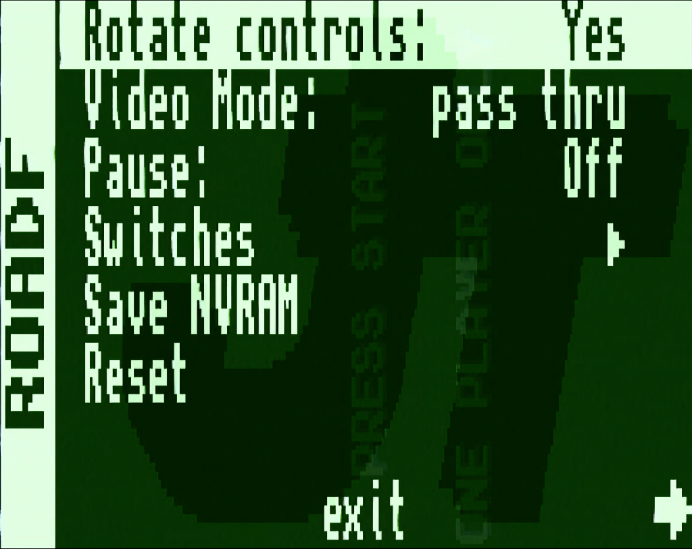
|===

Estas son las principales:

- `Rotate Controls`: Para girar el comportamiento de los controles de dirección
- `Video Mode`: Sólo en el caso de salida de vídeo VGA, para aplicar distintos filtros a la imagen
- `Pause`: Para detener el core
- `Switches`: Accede a ver y modificar el estado de los https://es.wikipedia.org/wiki/Interruptor_DIP[interruptores DIP] que haya definidos en el fichero ARC
- `Save NVRAM`: Para guardar el contenido de la NVRAM (récords de puntuación) en la tarjeta microSD
- `Reset`: Soft Reset (reinicia el Core)
- `Exit`: Cierra el menú de opciones

<<<

==== Roc'n Rope (Jotego)

https://es.wikipedia.org/wiki/Roc%27n_Rope[Roc'n Rope] es un videojuego de máquina recreativa de 1983 desarrollado y publicado por Konami.

La versión para neptUNO+ está basada en la https://github.com/jotego/jtcores/tree/master/cores/roc[versión original de Jotego].

Algunas de las características del core son:

- La salida de vídeo mantiene la rotación del original
- Salida de vídeo VGA
- Salida de vídeo RGB (utilizando el puerto VGA)
- Soporte de mando real y mando emulado en teclado

===== Formato de Tarjeta microSD

Se debe utilizar una tarjeta microSD, con la primera partición en formato exFAT o FAT32, donde se hayan copiado los ficheros ARC y ROM correspondientes de los juegos.

Para <<#_mra_tool,crear los ficheros ROM y ARC>>, se pueden obtener los ficheros MRA correspondientes del https://github.com/jotego/jtbin/tree/master/mra[repositorio del creador] del core original.

===== Controles

====== Teclas especiales y botones

Durante la ejecución del core:

- `F12` o botones `Start+Select` de un mando: mostrar el menú de control del core
- Teclas de cursor o el mando 1: Controles de dirección del jugador
- `Ctrl`, `Alt`, o botones `A`, `B` del mando 1: botones 1, 2 del jugador
- `1` y `2`: o botón `Select` de un mando para partida de 1 o 2 jugadores
- `5` y `6` o botón `Start` de un mando: para insertar una moneda
- `P` o botón `X` de un mando: Pausa
- `F3`: Soft Reset (reinicia el Core)

<<<

===== Guía básica

Al pulsar `F12`, se mostrará el menú con las distintas opciones del core. Se puede navegar utilizando las teclas de cursor. `Enter` selecciona un elemento.

[role="center",width="50%",cols="1a", frame=none, grid=none]
|===
|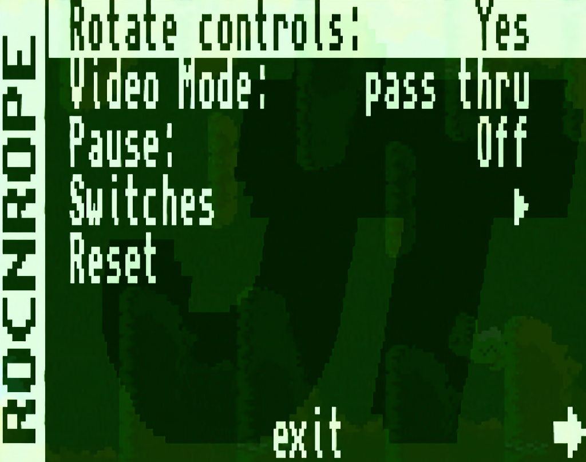
|===

Estas son las principales:

- `Rotate Controls`: Para girar el comportamiento de los controles de dirección
- `Video Mode`: Sólo en el caso de salida de vídeo VGA, para aplicar distintos filtros a la imagen
- `Pause`: Para detener el core
- `Switches`: Accede a ver y modificar el estado de los https://es.wikipedia.org/wiki/Interruptor_DIP[interruptores DIP] que haya definidos en el fichero ARC
- `Reset`: Soft Reset (reinicia el Core)
- `Exit`: Cierra el menú de opciones

<<<

==== The Speed Rumbler (Jotego)

https://capcom.fandom.com/wiki/The_Speed_Rumbler[The Speed Rumbler], conocido como Rush & Crash en Japón, es un juego de máquina recreativa de 1986 lanzado por Capcom.

La versión para neptUNO+ está basada en la https://github.com/jotego/jtcores/tree/master/cores/rumble[versión original de Jotego].

Algunas de las características del core son:

- La salida de vídeo mantiene la rotación del original
- Salida de vídeo VGA
- Salida de vídeo RGB (utilizando el puerto VGA)
- Soporte de mando real y mando emulado en teclado

===== Formato de Tarjeta microSD

Se debe utilizar una tarjeta microSD, con la primera partición en formato exFAT o FAT32, donde se hayan copiado los ficheros ARC y ROM correspondientes de los juegos.

Para <<#_mra_tool,crear los ficheros ROM y ARC>>, se pueden obtener los ficheros MRA correspondientes del https://github.com/jotego/jtbin/tree/master/mra[repositorio del creador] del core original.

===== Controles

====== Teclas especiales y botones

Durante la ejecución del core:

- `F12` o botones `Start+Select` de un mando: mostrar el menú de control del core
- Teclas de cursor o el mando 1: Controles de dirección
- `Ctrl`, `Alt` o botones `A`, `B` del mando 1: Botones 1, 2 del jugador
- `1` y `2` o botón `Select` de un mando: Iniciar partida 1 ó 2 jugadores
- `5` y `6` o botón `Start` de un mando: Insertar una moneda
- `P` o botón  `X` de un mando: Pausa
- `F3`: Soft Reset (reinicia el Core)

<<<

===== Guía básica

Al pulsar `F12`, se mostrará el menú con las distintas opciones del core. Se puede navegar utilizando las teclas de cursor. `Enter` selecciona un elemento.

[role="center",width="50%",cols="1a", frame=none, grid=none]
|===
|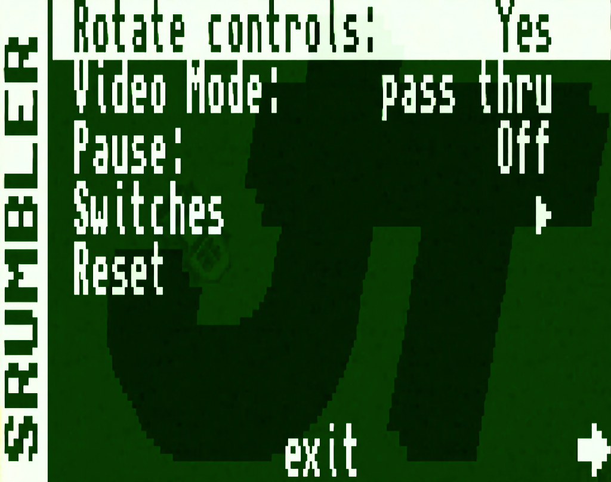
|===

Estas son las principales:

- `Rotate Controls`: Para girar el texto del menú de opciones, así como el comportamiento de los controles de dirección
- `Video Mode`: Sólo en el caso de salida de vídeo VGA, para aplicar distintos filtros a la imagen
- `Pause`: Para detener el core
- `Switches`: Accede a ver y modificar el estado de los https://es.wikipedia.org/wiki/Interruptor_DIP[interruptores DIP] que haya definidos en el fichero ARC
- `Reset`: Soft Reset (reinicia el Core)
- `Exit`: Cierra el menú de opciones

<<<

==== Sega System 16 (Jotego)

La https://es.wikipedia.org/wiki/Sega_System_16[Sega System 16] una placa de máquina recreativa lanzada en 1985 por Sega. En su período de vida, fueron lanzados aproximadamente 40 juegos para las distintas variantes del sistema, convirtiéndolo en una de las placas más exitosas producidas por Sega.

Este core permite ejecutar ROM de varios juegos (consultar <<#_sega_system_16_hardware,la sección de referencias para más información>>).

La versión para neptUNO+ está basada en la https://github.com/jotego/jtcores/tree/master/cores/s16[versión original de Jotego].

Algunas de las características del core son:

- Salida de vídeo VGA
- Salida de vídeo RGB (utilizando el puerto VGA)
- Soporte de mando real y mando emulado en teclado

===== Formato de Tarjeta microSD

Se debe utilizar una tarjeta microSD, con la primera partición en formato exFAT o FAT32, donde se hayan copiado los ficheros ARC y ROM correspondientes de los juegos.

Para <<#_mra_tool,crear los ficheros ROM y ARC>>, se pueden obtener los ficheros MRA correspondientes del https://github.com/jotego/jtbin/tree/master/mra[repositorio del creador] del core original.

===== Controles

====== Teclas especiales y botones

Durante la ejecución del core:

- `F12` o botones `Start+Select` de un mando: mostrar el menú de control del core
- Teclas de cursor o el mando 1: Controles de dirección del jugador uno
- `Ctrl`, `Alt`, `Espacio` o botones `A`, `B`, `Select` del mando 1: Botones 1, 2, 3 del jugador uno
- `R`,`D`,`F`,`G` o mando 2: Movimiento del jugador dos
- `A`, `S`, `Q` o botones `A`, `B`, `Select` del mando 2: Botones 1, 2, 3 del jugador dos
- `1` y `2` o botón `X` de un mando: Iniciar partida jugador 1 o jugador 2
- `5` y `6` o botón `Y` de un mando: Insertar una moneda
- `P o botón `L` de un mando: : Pausa
- `F3`: Soft Reset (reinicia el Core)

<<<

===== Guía básica

Al pulsar `F12`, se mostrará el menú con las distintas opciones del core. Se puede navegar utilizando las teclas de cursor. `Enter` selecciona un elemento.

[role="center",width="50%",cols="1a", frame=none, grid=none]
|===
|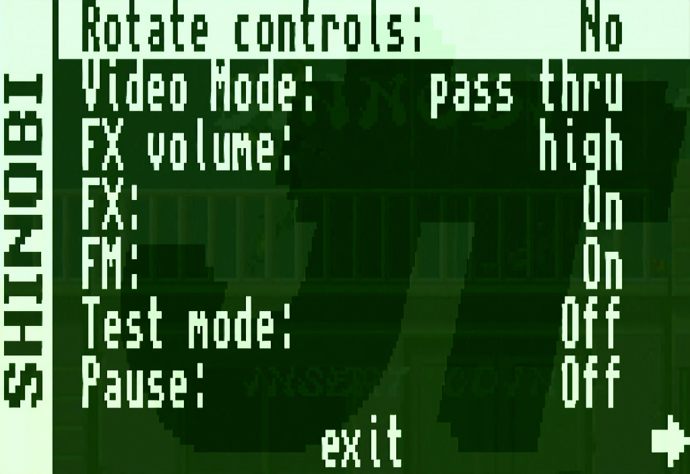
|===

Estas son las principales:

- `Rotate Controls`: Para girar el comportamiento de los controles de dirección
- `Video Mode`: Sólo en el caso de salida de vídeo VGA, para aplicar distintos filtros a la imagen
- `FX Volume`: Volumen de los efectos de sonido
- `FX`: Activar o desactivar efectos de sonido
- `FM`: Activar o desactivar efectos de sonido FM
- `Test Mode`: Activa o desactiva el modo de prueba
- `Pause`: Activa o desactiva la pausa
- `Switches`: Accede a ver y modificar el estado de los https://es.wikipedia.org/wiki/Interruptor_DIP[interruptores DIP] que haya definidos en el fichero ARC
- `Reset`: Soft Reset (reinicia el Core)
- `Exit`: Cierra el menú de opciones

<<<

==== Sega System 16B (Jotego)

La https://es.wikipedia.org/wiki/Sega_System_16[Sega System 16B] es la segunda variante de la placa Sega System 16 de máquina recreativa, lanzada en 1985 por Sega.

Este core y permite ejecutar ROM de varios juegos (consultar <<#_sega_system_16b_hardware,la sección de referencias para más información>>).

La versión para neptUNO+ está basada en la https://github.com/jotego/jtcores/tree/master/cores/s16b[versión original de Jotego].

Algunas de las características del core son:

- Salida de vídeo VGA
- Salida de vídeo RGB (utilizando el puerto VGA)
- Soporte de mando real y mando emulado en teclado

===== Formato de Tarjeta microSD

Se debe utilizar una tarjeta microSD, con la primera partición en formato exFAT o FAT32, donde se hayan copiado los ficheros ARC y ROM correspondientes de los juegos.

Para <<#_mra_tool,crear los ficheros ROM y ARC>>, se pueden obtener los ficheros MRA correspondientes del https://github.com/jotego/jtbin/tree/master/mra[repositorio del creador] del core original.

===== Controles

====== Teclas especiales y botones

Durante la ejecución del core:

- `F12` o botones `Start+Select` de un mando: mostrar el menú de control del core
- Teclas de cursor o el mando 1: Controles de dirección del jugador uno
- `Ctrl`, `Alt`, `Espacio` o botones `A`, `B`, `Select` del mando 1: Botones 1, 2, 3 del jugador uno
- `R`,`D`,`F`,`G` o mando 2: Movimiento del jugador dos
- `A`, `S`, `Q` o botones `A`, `B`, `Select` del mando 2: Botones 1, 2, 3 del jugador dos
- `1` y `2` o botón `X` de un mando: Iniciar partida jugador 1 o jugador 2
- `5` y `6` o botón `Y` de un mando: Insertar una moneda
- `P o botón `L` de un mando: : Pausa
- `F3`: Soft Reset (reinicia el Core)

<<<

===== Guía básica

Al pulsar `F12`, se mostrará el menú con las distintas opciones del core. Se puede navegar utilizando las teclas de cursor. `Enter` selecciona un elemento.

[role="center",width="50%",cols="1a", frame=none, grid=none]
|===
|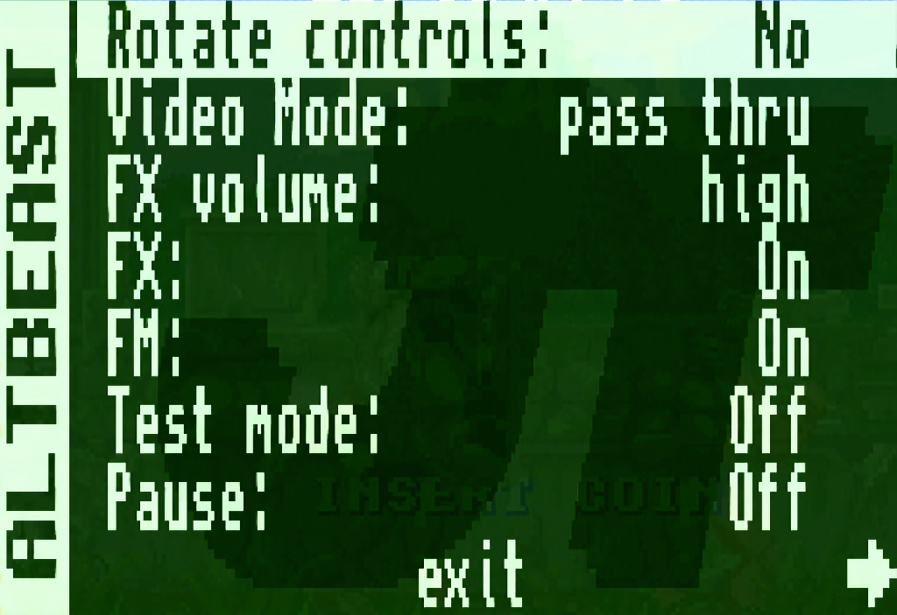
|===

Estas son las principales:

- `Rotate Controls`: Para girar el comportamiento de los controles de dirección
- `Video Mode`: Sólo en el caso de salida de vídeo VGA, para aplicar distintos filtros a la imagen
- `FX Volume`: Volumen de los efectos de sonido
- `FX`: Activar o desactivar efectos de sonido
- `FM`: Activar o desactivar efectos de sonido FM
- `Test Mode`: Activa o desactiva el modo de prueba
- `Pause`: Activa o desactiva la pausa
- `Switches`: Accede a ver y modificar el estado de los https://es.wikipedia.org/wiki/Interruptor_DIP[interruptores DIP] que haya definidos en el fichero ARC
- `Reset`: Soft Reset (reinicia el Core)
- `Exit`: Cierra el menú de opciones

<<<

==== Sega System 18 (Jotego)

https://es.wikipedia.org/wiki/Sega_System_18[Sega System 18] es la evolución de la placa Sega System 16 de máquina recreativa, lanzada en 1989 por Sega.

Este core permite ejecutar ROM de varios juegos (consultar <<#_sega_system_18_hardware,la sección de referencias para más información>>).

La versión para neptUNO+ está basada en la https://github.com/jotego/jtcores/tree/master/cores/s18[versión original de Jotego].

Algunas de las características del core son:

- Salida de vídeo VGA
- Salida de vídeo RGB (utilizando el puerto VGA)
- Soporte de mando real y mando emulado en teclado

===== Formato de Tarjeta microSD

Se debe utilizar una tarjeta microSD, con la primera partición en formato exFAT o FAT32, donde se hayan copiado los ficheros ARC y ROM correspondientes de los juegos.

Para <<#_mra_tool,crear los ficheros ROM y ARC>>, se pueden obtener los ficheros MRA correspondientes del https://github.com/jotego/jtbin/tree/master/mra[repositorio del creador] del core original.

===== Controles

====== Teclas especiales y botones

Durante la ejecución del core:

- `F12` o botones `Start+Select` de un mando: mostrar el menú de control del core
- Teclas de cursor o el mando 1: Controles de dirección del jugador uno
- `Ctrl`, `Alt`, `Espacio` o botones `A`, `B`, `Select` del mando 1: Botones 1, 2, 3 del jugador uno
- `R`,`D`,`F`,`G` o mando 2: Movimiento del jugador dos
- `A`, `S`, `Q` o botones `A`, `B`, `Select` del mando 2: Botones 1, 2, 3 del jugador dos
- `1` y `2` o botón `L` de un mando: Iniciar partida jugador 1 o jugador 2
- `5` y `6` o botón `R` de un mando: Insertar una moneda
- `P o botón `L2` de un mando: : Pausa
- `F3`: Soft Reset (reinicia el Core)
- `F2`: Activa o desactiva el modo de prueba

<<<

===== Guía básica

Al pulsar `F12`, se mostrará el menú con las distintas opciones del core. Se puede navegar utilizando las teclas de cursor. `Enter` selecciona un elemento.

[role="center",width="50%",cols="1a", frame=none, grid=none]
|===
|image:img/jts18.png[scaledwidth=100%]
|===

Estas son las principales:

- `Switches`: Accede a ver y modificar el estado de los https://es.wikipedia.org/wiki/Interruptor_DIP[interruptores DIP] que haya definidos en el fichero ARC
- `Rotate Controls`: Para girar el comportamiento de los controles de dirección
- `Video Mode`: Sólo en el caso de salida de vídeo VGA, para aplicar distintos filtros a la imagen
- `Test Mode`: Activa o desactiva el modo de prueba
- `Sensitivity`: Ajusta la sensibilidad de los controles
- `Pause`: Para detener el core
- `Save NVRAM`: Para guardar el contenido de la NVRAM (récords de puntuación) en la tarjeta microSD
- `Reset`: Soft Reset (reinicia el Core)
- `Exit`: Cierra el menú de opciones

<<<

==== Hyper Dyne Side Arms (Jotego)

https://en.wikipedia.org/wiki/Hyper_Dyne_Side_Arms[Hyper Dyne Side Arms] es un videojuego de desplazamiento horizontal desarrollado y lanzado por Capcom como máquina recreativa  en 1986.

La versión para neptUNO+ está basada en la https://github.com/jotego/jtcores/tree/master/cores/sarms[versión original de Jotego].

Algunas de las características del core son:

- La salida de vídeo mantiene la rotación del original
- Salida de vídeo VGA
- Salida de vídeo RGB (utilizando el puerto VGA)
- Soporte de mando real y mando emulado en teclado

===== Formato de Tarjeta microSD

Se debe utilizar una tarjeta microSD, con la primera partición en formato exFAT o FAT32, donde se hayan copiado los ficheros ARC y ROM correspondientes de los juegos.

Para <<#_mra_tool,crear los ficheros ROM y ARC>>, se pueden obtener los ficheros MRA correspondientes del https://github.com/jotego/jtbin/tree/master/mra[repositorio del creador] del core original.

===== Controles

====== Teclas especiales y botones

Durante la ejecución del core:

- `F12` o botones `Start+Select` de un mando: mostrar el menú de control del core
- Teclas de cursor o el mando 1: Controles de dirección del jugador uno
- `Ctrl`, `Alt` o botones `A`, `B` del mando 1: Botones 1, 2 del jugador uno
- `R`,`D`,`F`,`G` o mando 2: Movimiento del jugador dos
- `A`, `S` o botones `A`, `B` del mando 2: Botones 1, 2 del jugador dos
- `1` y `2` o botón `Start` de un mando: Iniciar partida jugador 1 o jugador 2
- `5` y `6` o botón `X` de un mando: Insertar una moneda
- `P` o botón `Y` de un mando: Pausa
- `F3`: Soft Reset (reinicia el Core)

<<<

===== Guía básica

Al pulsar `F12`, se mostrará el menú con las distintas opciones del core. Se puede navegar utilizando las teclas de cursor. `Enter` selecciona un elemento.

[role="center",width="50%",cols="1a", frame=none, grid=none]
|===
|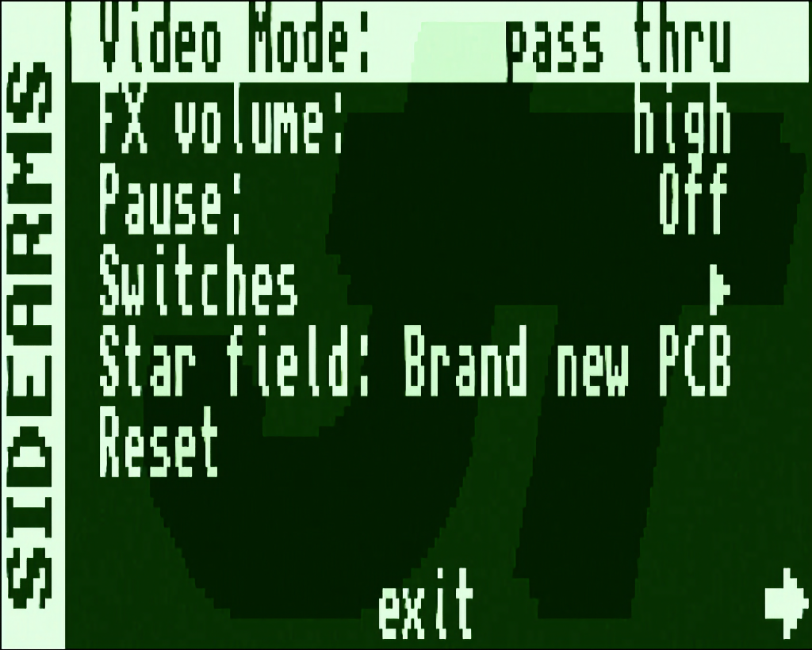
|===

Estas son las principales:

- `Video Mode`: Sólo en el caso de salida de vídeo VGA, para aplicar distintos filtros a la imagen
- `FX Volume`: Volumen de los efectos de sonido
- `Pause`: Para detener el core
- `Switches`: Accede a ver y modificar el estado de los https://es.wikipedia.org/wiki/Interruptor_DIP[interruptores DIP] que haya definidos en el fichero ARC
- `Star field`: Permite elegir si el campo de estrellas se comporta como el original de una placa nueva o como el de una placa envejecida
- `Reset`: Soft Reset (reinicia el Core)
- `Exit`: Cierra el menú de opciones

<<<

==== Super Basketball (Jotego)

https://es.wikipedia.org/wiki/Super_Basketball[Super Basketball] es un juego de deportes lanzado por Konami en 1984 para máquinas recreativas.

La versión para neptUNO+ está basada en la https://github.com/jotego/jtcores/tree/master/cores/sbaskt[versión original de Jotego].

Algunas de las características del core son:

- La salida de vídeo mantiene la rotación del original
- Salida de vídeo VGA
- Salida de vídeo RGB (utilizando el puerto VGA)
- Soporte de mando real y mando emulado en teclado

===== Formato de Tarjeta microSD

Se debe utilizar una tarjeta microSD, con la primera partición en formato exFAT o FAT32, donde se hayan copiado los ficheros ARC y ROM correspondientes de los juegos.

Para <<#_mra_tool,crear los ficheros ROM y ARC>>, se pueden obtener los ficheros MRA correspondientes del https://github.com/jotego/jtbin/tree/master/mra[repositorio del creador] del core original.

===== Controles

====== Teclas especiales y botones

Durante la ejecución del core:

- `F12` o botones `Start+Select` de un mando: mostrar el menú de control del core
- Teclas de cursor o el mando 1: Controles de dirección del jugador
- `Ctrl`, `Alt` y `Espacio` o botones `A`, `B`, `Select` del mando 1: Botones 1, 2 y 3 del jugador
- `1` y `2` o botón `Start` de un mando: Iniciar partida jugador 1 o jugador 2
- `5` y `6` o botón `X` de un mando: Insertar una moneda
- `P` o botón `Y` de un mando: Pausa
- `F3`: Soft Reset (reinicia el Core)

<<<

===== Guía básica

Al pulsar `F12`, se mostrará el menú con las distintas opciones del core. Se puede navegar utilizando las teclas de cursor. `Enter` selecciona un elemento.

[role="center",width="50%",cols="1a", frame=none, grid=none]
|===
|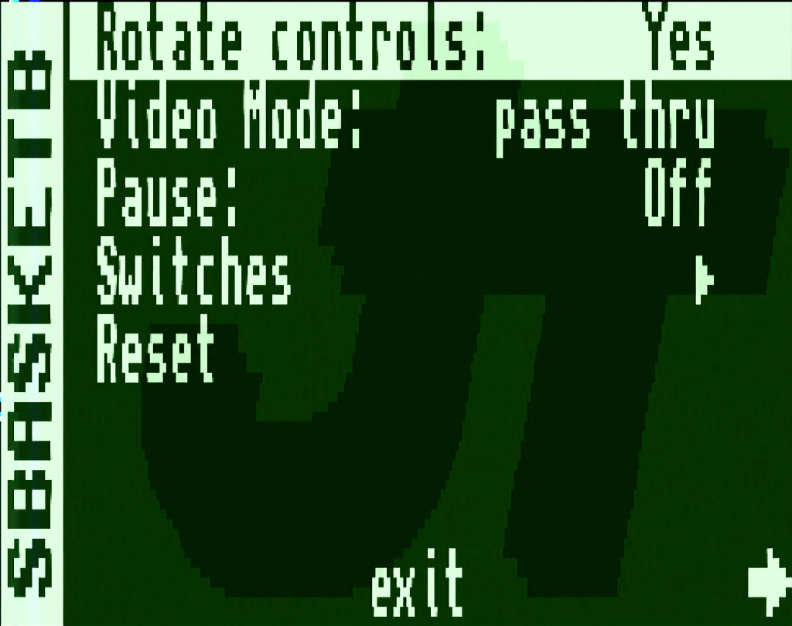
|===

Estas son las principales:

- `Rotate Controls`: Para girar el comportamiento de los controles de dirección
- `Video Mode`: Sólo en el caso de salida de vídeo VGA, para aplicar distintos filtros a la imagen
- `Pause`: Activa o desactiva la pausa
- `Switches`: Accede a ver y modificar el estado de los https://es.wikipedia.org/wiki/Interruptor_DIP[interruptores DIP] que haya definidos en el fichero ARC
- `Reset`: Soft Reset (reinicia el Core)
- `Exit`: Cierra el menú de opciones

<<<

==== Section Z (Jotego)

https://es.wikipedia.org/wiki/Section_Z[Section Z] es videojuego creado por Capcom y lanzado originalmente como un juego para máquina recreativa en 1985.

Este core permite ejecutar ROM de varios juegos (consultar <<#_section_z_hardware,la sección de referencias para más información>>).

La versión para neptUNO+ está basada en la https://github.com/jotego/jtcores/tree/master/cores/sectnz[versión original de Jotego].

Algunas de las características del core son:

- La salida de vídeo mantiene la rotación del original
- Salida de vídeo VGA
- Salida de vídeo RGB (utilizando el puerto VGA)
- Soporte de mando real y mando emulado en teclado

===== Formato de Tarjeta microSD

Se debe utilizar una tarjeta microSD, con la primera partición en formato exFAT o FAT32, donde se hayan copiado los ficheros ARC y ROM correspondientes de los juegos.

Para <<#_mra_tool,crear los ficheros ROM y ARC>>, se pueden obtener los ficheros MRA correspondientes del https://github.com/jotego/jtbin/tree/master/mra[repositorio del creador] del core original.

===== Controles

====== Teclas especiales y botones

Durante la ejecución del core:

- `F12` o botones `Start+Select` de un mando: mostrar el menú de control del core
- Teclas de cursor o el mando 1: Controles de dirección
- `Ctrl`, `Alt` o botones `A`, `B` del mando 1: Botones 1, 2 del jugador
- `1` y `2` o botón `X` de un mando: Iniciar partida 1 ó 2 jugadores
- `5` y `6` o botón `Start` de un mando: Insertar una moneda
- `P` o botón `Y` de un mando: Pausa
- `F3`: Soft Reset (reinicia el Core)

<<<

===== Guía básica

Al pulsar `F12`, se mostrará el menú con las distintas opciones del core. Se puede navegar utilizando las teclas de cursor. `Enter` selecciona un elemento.

[role="center",width="50%",cols="1a", frame=none, grid=none]
|===
|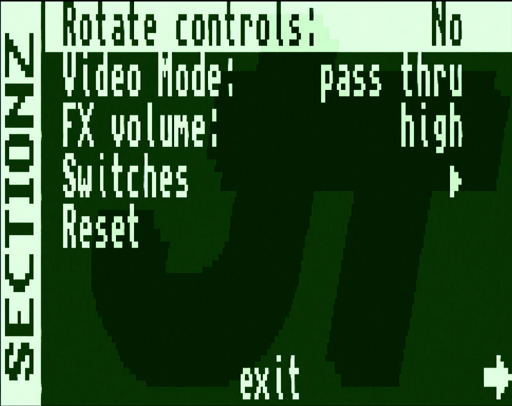
|===

Estas son las principales:

- `Rotate Controls`: Para girar el texto del menú de opciones, así como el comportamiento de los controles de dirección
- `Video Mode`: Sólo en el caso de salida de vídeo VGA, para aplicar distintos filtros a la imagen
- `FX Volume`: Volumen de los efectos de sonido
- `Switches`: Accede a ver y modificar el estado de los https://es.wikipedia.org/wiki/Interruptor_DIP[interruptores DIP] que haya definidos en el fichero ARC
- `Reset`: Soft Reset (reinicia el Core)
- `Exit`: Cierra el menú de opciones

<<<

==== Street Fighter (Jotego)

https://es.wikipedia.org/wiki/Street_Fighter_(videojuego)[Street Fighter] es un videojuego desarrollado por Capcom en 1987.

La versión para neptUNO+ está basada en la https://github.com/jotego/jtcores/tree/master/cores/sf[versión original de Jotego].

Algunas de las características del core son:

- Salida de vídeo VGA
- Salida de vídeo RGB (utilizando el puerto VGA)
- Soporte de mando real y mando emulado en teclado

===== Formato de Tarjeta microSD

Se debe utilizar una tarjeta microSD, con la primera partición en formato exFAT o FAT32, donde se hayan copiado los ficheros ARC y ROM correspondientes de los juegos.

Para <<#_mra_tool,crear los ficheros ROM y ARC>>, se pueden obtener los ficheros MRA correspondientes del https://github.com/jotego/jtbin/tree/master/mra[repositorio del creador] del core original.

===== Controles

====== Teclas especiales y botones

Durante la ejecución del core:

- `F12` o botones `Start+Select` de un mando: mostrar el menú de control del core
- Teclas de cursor o el mando 1: Controles de dirección del jugador uno
- `Ctrl`, `Alt` y `Espacio` o botones `A`, `B`, `Select` del mando 1: Botones 1, 2 y 3 del jugador uno
- `Espacio`, `Z`, `X`, o botones `Start`, `X`, `Y` del mando 1: Botones 4, 5, 6 del jugador uno
- `R`,`D`,`F`,`G` o mando 2: Movimiento del jugador dos
- `A`, `S` y `D` o botones `A`, `B`, `Select` del mando 2: Botones 1, 2 y 3 del jugador dos
- `Q`, `W`, `K` o botones `Start`, `X`, `Y` del mando 2: Botones 4, 5, 6 del jugador dos
- `1` y `2` o botón `L` de un mando: para iniciar partida jugador 1 o jugador 2
- `5` y `6` o botón `R` de un mando: para insertar una moneda
- `P` o botón `R2` de un mando: Pausa
- `F3`: Soft Reset (reinicia el Core)

<<<

===== Guía básica

Al pulsar `F12`, se mostrará el menú con las distintas opciones del core. Se puede navegar utilizando las teclas de cursor. `Enter` selecciona un elemento.

[role="center",width="50%",cols="1a", frame=none, grid=none]
|===
|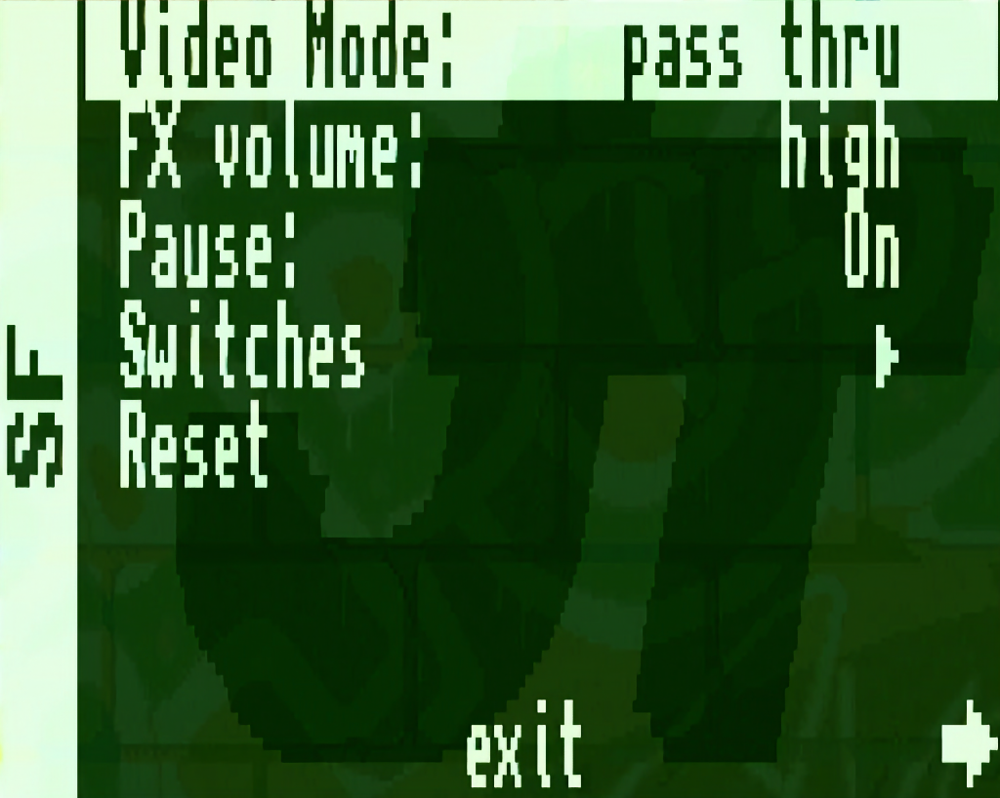
|===

Estas son las principales:

- `Video Mode`: Sólo en el caso de salida de vídeo VGA, para aplicar distintos filtros a la imagen
- `FX Volume`: Volumen de los efectos de sonido
- `Pause`: Para detener el core
- `Switches`: Accede a ver y modificar el estado de los https://es.wikipedia.org/wiki/Interruptor_DIP[interruptores DIP] que haya definidos en el fichero ARC
- `Reset`: Soft Reset (reinicia el Core)
- `Exit`: Cierra el menú de opciones

<<<

==== Super Hang-On (Jotego)

https://es.wikipedia.org/wiki/Super_Hang-On[Super Hang-On] es un videojuego de carreras de 1987 desarrollado por Sega para máquinas recreativas, y la secuela de Hang-On.

La versión para neptUNO+ está basada en la https://github.com/jotego/jtcores/tree/master/cores/shanon[versión original de Jotego].

Algunas de las características del core son:

- Salida de vídeo VGA
- Salida de vídeo RGB (utilizando el puerto VGA)
- Soporte de mando real y mando emulado en teclado

===== Formato de Tarjeta microSD

Se debe utilizar una tarjeta microSD, con la primera partición en formato exFAT o FAT32, donde se hayan copiado los ficheros ARC y ROM correspondientes de los juegos.

Para <<#_mra_tool,crear los ficheros ROM y ARC>>, se pueden obtener los ficheros MRA correspondientes del https://github.com/jotego/jtbin/tree/master/mra[repositorio del creador] del core original.

===== Controles

====== Teclas especiales y botones

Durante la ejecución del core:

- `F12` o botones `Start+Select` de un mando: mostrar el menú de control del core
- Teclas de cursor o el mando 1: Controles de dirección del jugador
- `Ctrl` o botón A del mando 1: Acelerar
- `Alt` o o botón B del mando 1: Frenar
- `1` y `2` o botón `X` de un mando: para iniciar partida
- `5` y `6` o botón `Y` de un mando: para insertar una moneda
- `P` o botón `L` de un mando: Pausa
- `F3`: Soft Reset (reinicia el Core)

<<<

===== Guía básica

Al pulsar `F12`, se mostrará el menú con las distintas opciones del core. Se puede navegar utilizando las teclas de cursor. `Enter` selecciona un elemento.

[role="center",width="50%",cols="1a", frame=none, grid=none]
|===
|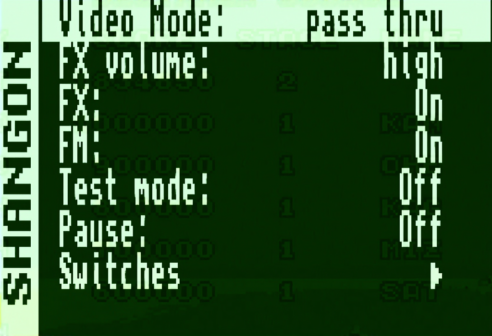
|===

Estas son las principales:

- `Video Mode`: Sólo en el caso de salida de vídeo VGA, para aplicar distintos filtros a la imagen
- `FX Volume`: Volumen de los efectos de sonido
- `FX`: Activar o desactivar efectos de sonido
- `FM`: Activar o desactivar efectos de sonido FM
- `Test Mode`: Activa o deactiva el modo de prueba
- `Pause`: Para detener el core
- `Switches`: Accede a ver y modificar el estado de los https://es.wikipedia.org/wiki/Interruptor_DIP[interruptores DIP] que haya definidos en el fichero ARC
- `Save NVRAM`: Para guardar el contenido de la NVRAM (récords de puntuación) en la tarjeta microSD
- `Reset`: Soft Reset (reinicia el Core)
- `Exit`: Cierra el menú de opciones

<<<

==== Splatterhouse (Jotego)

https://es.wikipedia.org/wiki/Splatterhouse[Splatterhouse] es un juego de máquina recreativa desarrollado y publicado por Namco en 1988.

Este core permite ejecutar ROM de varios juegos (consultar <<#_splatterhouse_hardware,la sección de referencias para más información>>).

La versión para neptUNO+ está basada en la https://github.com/jotego/jtcores/tree/master/cores/shouse[versión original de Jotego].

Algunas de las características del core son:

- Salida de vídeo VGA
- Salida de vídeo RGB (utilizando el puerto VGA)
- Soporte de mando real y mando emulado en teclado

===== Formato de Tarjeta microSD

Se debe utilizar una tarjeta microSD, con la primera partición en formato exFAT o FAT32, donde se hayan copiado los ficheros ARC y ROM correspondientes de los juegos.

Para <<#_mra_tool,crear los ficheros ROM y ARC>>, se pueden obtener los ficheros MRA correspondientes del https://github.com/jotego/jtbin/tree/master/mra[repositorio del creador] del core original.

===== Controles

====== Teclas especiales y botones

Durante la ejecución del core:

- `F12` o botones `Start+Select` de un mando: mostrar el menú de control del core
- Teclas de cursor o el mando 1: Controles de dirección del jugador uno
- `Ctrl`, `Alt` o botones `A`, `B` del mando 1: Botones 1, 2 del jugador uno
- `R`,`D`,`F`,`G` o mando 2: Movimiento del jugador dos
- `A`, `S` o botones `A`, `B` del mando 2: Botones 1, 2 del jugador dos
- `1` y `2` o botón `R` de un mando: Iniciar partida jugador 1 o jugador 2
- `5` y `6` o botón `L` de un mando: Insertar una moneda
- `P` o botón `L2` de un mando: Pausa
- `F3`: Soft Reset (reinicia el Core)

<<<

===== Guía básica

Al pulsar `F12`, se mostrará el menú con las distintas opciones del core. Se puede navegar utilizando las teclas de cursor. `Enter` selecciona un elemento.

[role="center",width="50%",cols="1a", frame=none, grid=none]
|===
|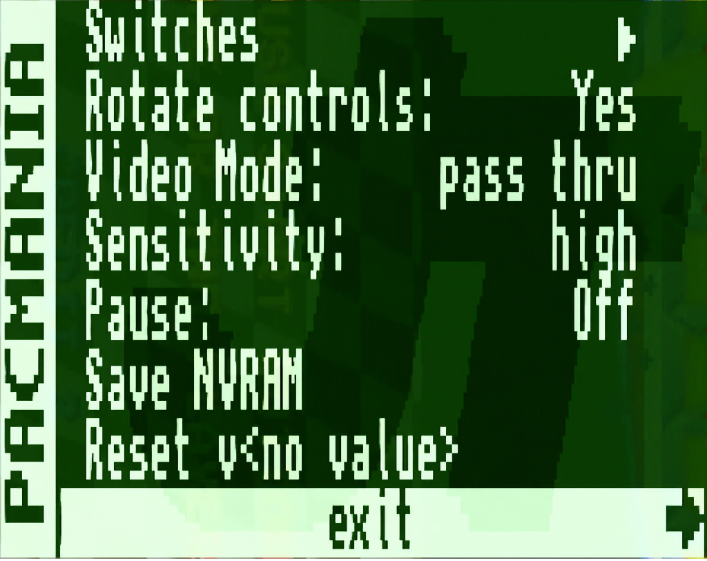
|===

Estas son las principales:

- `Switches`: Accede a ver y modificar el estado de los https://es.wikipedia.org/wiki/Interruptor_DIP[interruptores DIP] que haya definidos en el fichero ARC
- `Rotate Controls`: Para girar el texto del menú de opciones, así como el comportamiento de los controles de dirección
- `Video Mode`: Sólo en el caso de salida de vídeo VGA, para aplicar distintos filtros a la imagen
- `Sensitivity`: Ajusta la sensibilidad de los controles
- `Pause`: Para detener el core
- `Save NVRAM`: Para guardar el contenido de la NVRAM (récords de puntuación) en la tarjeta microSD
- `Reset`: Soft Reset (reinicia el Core)
- `Exit`: Cierra el menú de opciones

<<<

==== The Simpsons (Jotego)

https://es.wikipedia.org/wiki/The_Simpsons_(videojuego)[The Simpsons] es un videojuego de máquina recreativa producido en el año 1991 por la empresa japonesa Konami.

Este core permite ejecutar ROM de varios juegos (consultar <<#_the_simpsons_hardware,la sección de referencias para más información>>).

La versión para neptUNO+ está basada en la https://github.com/jotego/jtcores/tree/master/cores/simson[versión original de Jotego].

Algunas de las características del core son:

- Salida de vídeo VGA
- Salida de vídeo RGB (utilizando el puerto VGA)
- Soporte de mando real y mando emulado en teclado

===== Formato de Tarjeta microSD

Se debe utilizar una tarjeta microSD, con la primera partición en formato exFAT o FAT32, donde se hayan copiado los ficheros ARC y ROM correspondientes de los juegos.

Para <<#_mra_tool,crear los ficheros ROM y ARC>>, se pueden obtener los ficheros MRA correspondientes del https://github.com/jotego/jtbin/tree/master/mra[repositorio del creador] del core original.

===== Controles

====== Teclas especiales y botones

Durante la ejecución del core:

- `F12` o botones `Start+Select` de un mando: mostrar el menú de control del core
- `F2`: Acceder al menú de servicio del core (equivalente a https://es.wikipedia.org/wiki/Interruptor_DIP[interruptores DIP] en otros cores)
- Teclas de cursor o el mando 1: Controles de dirección del jugador uno
- `Ctrl`, `Alt` o botones `A`, `B` del mando 1: Botones 1, 2 del jugador uno
- `R`,`D`,`F`,`G` o mando 2: Movimiento del jugador dos
- `A`, `S` o botones `A`, `B` del mando 2: Botones 1, 2 del jugador dos
- `1` y `2` o botón `R` de un mando: Iniciar partida jugador 1 o jugador 2
- `5` y `6` o botón `L` de un mando: Insertar una moneda
- `P` o botón `L2` de un mando: Pausa
- `F3`: Soft Reset (reinicia el Core)

<<<

===== Guía básica

Al pulsar `F12`, se mostrará el menú con las distintas opciones del core. Se puede navegar utilizando las teclas de cursor. `Enter` selecciona un elemento.

[role="center",width="50%",cols="1a", frame=none, grid=none]
|===
|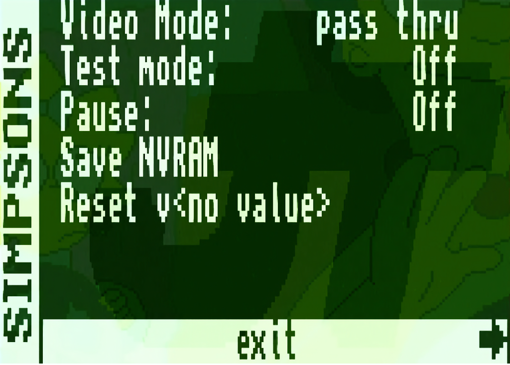
|===

Estas son las principales:

- `Video Mode`: Sólo en el caso de salida de vídeo VGA, para aplicar distintos filtros a la imagen
- `Test Mode` Activar o desactivar el modo de prueba
- `Pause`: Para detener el core
- `Save NVRAM`: Para guardar el contenido de la NVRAM (récords de puntuación) en la tarjeta microSD
- `Reset`: Soft Reset (reinicia el Core)
- `Exit`: Cierra el menú de opciones

<<<

==== Sly Spy (Jotego)

https://es.wikipedia.org/wiki/Sly_Spy[Sly Spy: Secret Agent] (Secret Agent en Japón y Sly Spy en EE. UU.) es un videojuego desarrollado y publicado en 1989 por Data East para máquinas recreativas.

Este core permite ejecutar ROM de varios juegos (consultar <<#_sly_spy_hardware,la sección de referencias para más información>>).

La versión para neptUNO+ está basada en la https://github.com/jotego/jtcores/tree/master/cores/slyspy[versión original de Jotego].

Algunas de las características del core son:

- Salida de vídeo VGA
- Salida de vídeo RGB (utilizando el puerto VGA)
- Soporte de mando real y mando emulado en teclado

===== Formato de Tarjeta microSD

Se debe utilizar una tarjeta microSD, con la primera partición en formato exFAT o FAT32, donde se hayan copiado los ficheros ARC y ROM correspondientes de los juegos.

Para <<#_mra_tool,crear los ficheros ROM y ARC>>, se pueden obtener los ficheros MRA correspondientes del https://github.com/jotego/jtbin/tree/master/mra[repositorio del creador] del core original.

===== Controles

====== Teclas especiales y botones

Durante la ejecución del core:

- `F12` o botones `Start+Select` de un mando: mostrar el menú de control del core
- Teclas de cursor o el mando 1: Controles de dirección del jugador
- `Ctrl`, `Alt` o botones `A`, `B` del mando: Botones 1, 2 del jugador
- `1` y `2` o botón `X` de un mando: para iniciar partida 1 ó 2 jugadores
- `5` y `6` o botón `L` de un mando: para insertar una moneda
- `P` o botón `R` de un mando: Pausa
- `F3`: Soft Reset (reinicia el Core)

<<<

===== Guía básica

Al pulsar `F12`, se mostrará el menú con las distintas opciones del core. Se puede navegar utilizando las teclas de cursor. `Enter` selecciona un elemento.

[role="center",width="50%",cols="1a", frame=none, grid=none]
|===
|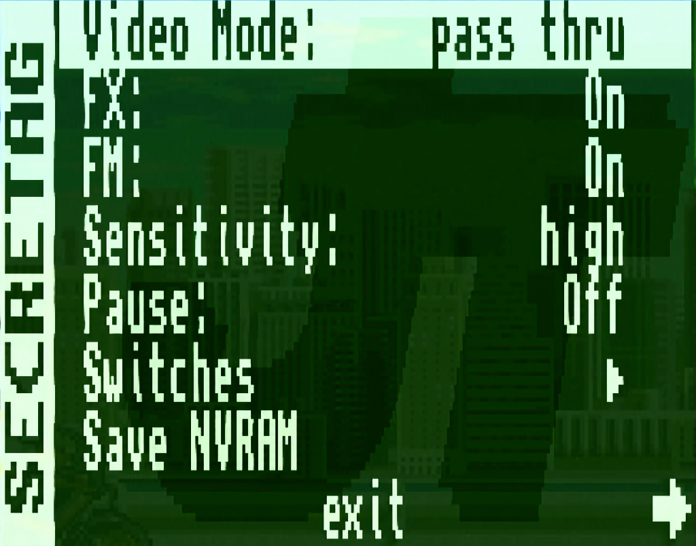
|===

Estas son las principales:

- `Video Mode`: Sólo en el caso de salida de vídeo VGA, para aplicar distintos filtros a la imagen
- `FX`: Activar o desactivar efectos de sonido
- `FM`: Activar o desactivar efectos de sonido FM
- `Sensitivity`: Ajusta la sensibilidad de los controles
- `Pause`: Para detener el core
- `Switches`: Accede a ver y modificar el estado de los https://es.wikipedia.org/wiki/Interruptor_DIP[interruptores DIP] que haya definidos en el fichero ARC
- `Save NVRAM`: Para guardar el contenido de la NVRAM (récords de puntuación) en la tarjeta microSD
- `Reset`: Soft Reset (reinicia el Core)
- `Exit`: Cierra el menú de opciones

<<<

==== Teenage Mutant Ninja Turtles (Jotego)

https://es.wikipedia.org/wiki/Teenage_Mutant_Ninja_Turtles_(arcade)[Teenage Mutant Ninja Turtles] es un videojuego de máquina recreativa producido por Konami en 1989, basado en la serie animada de 1987.

Este core implementa permite ejecutar ROM de varios juegos (consultar <<#_teenage_mutant_ninja_turtles_hardware,la sección de referencias para más información>>).

La versión para neptUNO+ está basada en la https://github.com/jotego/jtcores/tree/master/cores/tmnt[versión original de Jotego].

Algunas de las características del core son:

- Salida de vídeo VGA
- Salida de vídeo RGB (utilizando el puerto VGA)
- Soporte de mando real y mando emulado en teclado

===== Formato de Tarjeta microSD

Se debe utilizar una tarjeta microSD, con la primera partición en formato exFAT o FAT32, donde se hayan copiado los ficheros ARC y ROM correspondientes de los juegos.

Para <<#_mra_tool,crear los ficheros ROM y ARC>>, se pueden obtener los ficheros MRA correspondientes del https://github.com/jotego/jtbin/tree/master/mra[repositorio del creador] del core original.

===== Controles

====== Teclas especiales y botones

Durante la ejecución del core:

- `F12` o botones `Start+Select` de un mando: mostrar el menú de control del core
- Teclas de cursor o el mando 1: Controles de dirección del jugador uno
- `Ctrl`, `Alt` o botones `A`, `B` del mando 1: Botones 1, 2 del jugador uno
- `R`,`D`,`F`,`G` o mando 2: Movimiento del jugador dos
- `A`, `S` o botones `A`, `B` del mando 2: Botones 1, 2 del jugador dos
- `1` y `2` o botón `A` de un mando: Iniciar partida jugador 1 o jugador 2
- `5` y `6` o botón `R` de un mando: Insertar una moneda
- `P` o botón `L2` de un mando: Pausa
- `F3`: Soft Reset (reinicia el Core)

<<<

===== Guía básica

Al pulsar `F12`, se mostrará el menú con las distintas opciones del core. Se puede navegar utilizando las teclas de cursor. `Enter` selecciona un elemento.

[role="center",width="50%",cols="1a", frame=none, grid=none]
|===
|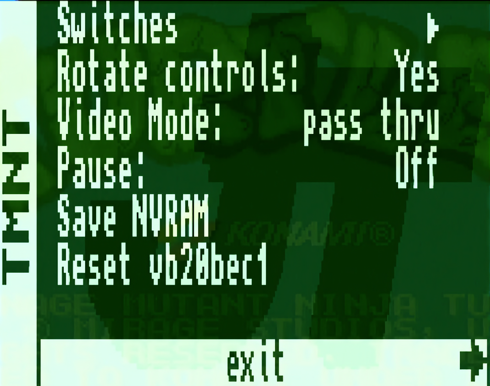
|===

Estas son las principales:

- `Switches`: Accede a ver y modificar el estado de los https://es.wikipedia.org/wiki/Interruptor_DIP[interruptores DIP] que haya definidos en el fichero ARC
- `Rotate Controls`: Para girar el texto del menú de opciones, así como el comportamiento de los controles de dirección
- `Video Mode`: Sólo en el caso de salida de vídeo VGA, para aplicar distintos filtros a la imagen
- `Pause`: Para detener el core
- `Save NVRAM`: Para guardar el contenido de la NVRAM (récords de puntuación) en la tarjeta microSD
- `Reset`: Soft Reset (reinicia el Core)
- `Exit`: Cierra el menú de opciones

<<<

==== Toki (Jotego)

https://es.wikipedia.org/wiki/Toki_(videojuego)[Toki] es un videojuego creado por TAD Corporation en 1989 para máquinas recreativas.

La versión para neptUNO+ está basada en la https://github.com/jotego/jtcores/tree/master/cores/toki[versión original de Jotego].

Algunas de las características del core son:

- Salida de vídeo VGA
- Salida de vídeo RGB (utilizando el puerto VGA)
- Soporte de mando real y mando emulado en teclado

===== Formato de Tarjeta microSD

Se debe utilizar una tarjeta microSD, con la primera partición en formato exFAT o FAT32, donde se hayan copiado los ficheros ARC y ROM correspondientes de los juegos.

Para <<#_mra_tool,crear los ficheros ROM y ARC>>, se pueden obtener los ficheros MRA correspondientes del https://github.com/jotego/jtbin/tree/master/mra[repositorio del creador] del core original.

===== Controles

====== Teclas especiales y botones

Durante la ejecución del core:

- `F12` o botones `Start+Select` de un mando: mostrar el menú de control del core
- Teclas de cursor o el mando 1: Controles de dirección del jugador
- `Ctrl`, `Alt` o botones `A`, `B` del mando: Botones 1, 2 del jugador
- `1` y `2` o botón `A` de un mando: Iniciar partida
- `5` y `6` o botón `R` de un mando: Insertar una moneda
- `P` o botón `L2` de un mando: Pausa
- `F3`: Soft Reset (reinicia el Core)

<<<

===== Guía básica

Al pulsar `F12`, se mostrará el menú con las distintas opciones del core. Se puede navegar utilizando las teclas de cursor. `Enter` selecciona un elemento.

[role="center",width="50%",cols="1a", frame=none, grid=none]
|===
|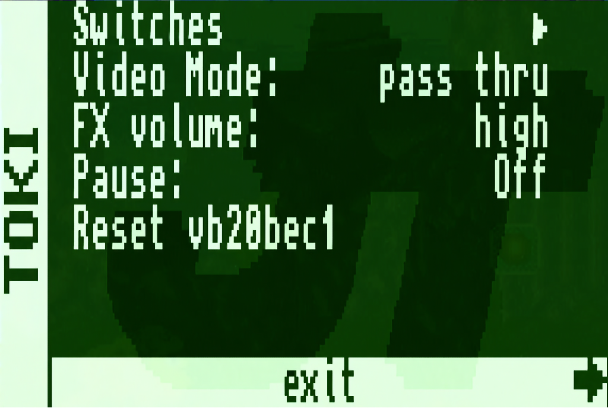
|===

Estas son las principales:

- `Switches`: Accede a ver y modificar el estado de los https://es.wikipedia.org/wiki/Interruptor_DIP[interruptores DIP] que haya definidos en el fichero ARC
- `Video Mode`: Sólo en el caso de salida de vídeo VGA, para aplicar distintos filtros a la imagen
- `FX Volume`: Volumen de los efectos de sonido
- `Pause`: Para detener el core
- `Reset`: Soft Reset (reinicia el Core)
- `Exit`: Cierra el menú de opciones

<<<

==== Tiger Road (Jotego)

https://es.wikipedia.org/wiki/Tiger_Road[Tiger Road]es un videojuego de acción para máquinas recreativas creado y distribuido por Capcom en 1987.

Este core permite ejecutar ROM de varios juegos (consultar <<#_tiger_road_hardware,la sección de referencias para más información>>).

La versión para neptUNO+ está basada en la https://github.com/jotego/jtcores/tree/master/cores/tora[versión original de Jotego].

Algunas de las características del core son:

- La salida de vídeo mantiene la rotación del original
- Salida de vídeo VGA
- Salida de vídeo RGB (utilizando el puerto VGA)
- Soporte de mando real y mando emulado en teclado

===== Formato de Tarjeta microSD

Se debe utilizar una tarjeta microSD, con la primera partición en formato exFAT o FAT32, donde se hayan copiado los ficheros ARC y ROM correspondientes de los juegos.

Para <<#_mra_tool,crear los ficheros ROM y ARC>>, se pueden obtener los ficheros MRA correspondientes del https://github.com/jotego/jtbin/tree/master/mra[repositorio del creador] del core original.

===== Controles

====== Teclas especiales y botones

Durante la ejecución del core:

- `F12` o botones `Start+Select` de un mando: mostrar el menú de control del core
- Teclas de cursor o el mando 1: Controles de dirección
- `Ctrl`, `Alt` o botones `A`, `B` del mando: Botones 1, 2 del jugador
- `1` y `2` o botón `Select` de un mando: Iniciar partida 1 ó 2 jugadores
- `5` y `6` o botón `Start` de un mando: Insertar una moneda
- `P` o botón `Y` de un mando: Pausa
- `F3`: Soft Reset (reinicia el Core)

<<<

===== Guía básica

Al pulsar `F12`, se mostrará el menú con las distintas opciones del core. Se puede navegar utilizando las teclas de cursor. `Enter` selecciona un elemento.

[role="center",width="50%",cols="1a", frame=none, grid=none]
|===
|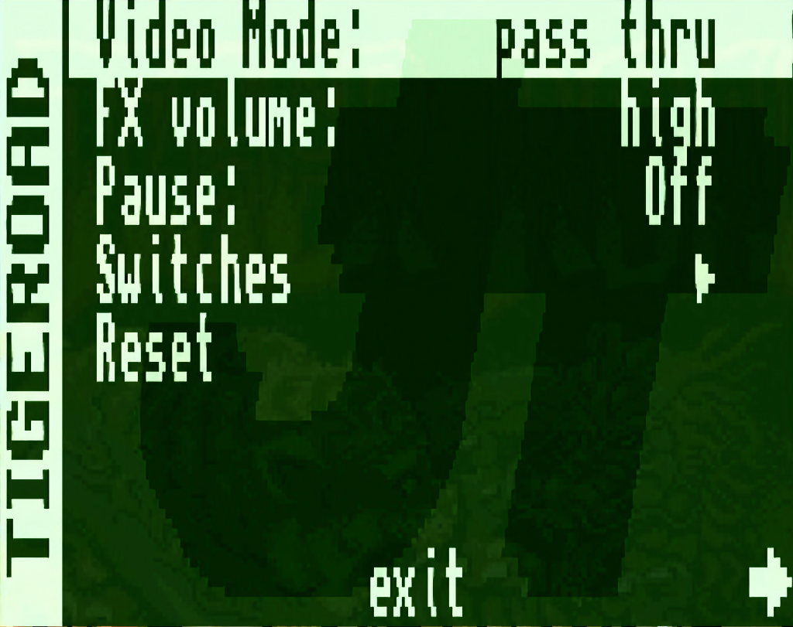
|===

Estas son las principales:

- `Video Mode`: Sólo en el caso de salida de vídeo VGA, para aplicar distintos filtros a la imagen
- `FX Volume`: Volumen de los efectos de sonido
- `Pause`: Para detener el core
- `Switches`: Accede a ver y modificar el estado de los https://es.wikipedia.org/wiki/Interruptor_DIP[interruptores DIP] que haya definidos en el fichero ARC
- `Reset`: Soft Reset (reinicia el Core)
- `Exit`: Cierra el menú de opciones

<<<

==== Track & Field (Jotego)

https://es.wikipedia.org/wiki/Track_%26_Field[Track & Field], conocido en Japón como Hyper Olympic, es un videojuego deportivo desarrollado por Konami en 1983.

La versión para neptUNO+ está basada en la https://github.com/jotego/jtcores/tree/master/cores/track[versión original de Jotego].

Algunas de las características del core son:

- Salida de vídeo VGA
- Salida de vídeo RGB (utilizando el puerto VGA)
- Soporte de mando real y mando emulado en teclado

===== Formato de Tarjeta microSD

Se debe utilizar una tarjeta microSD, con la primera partición en formato exFAT o FAT32, donde se hayan copiado los ficheros ARC y ROM correspondientes de los juegos.

Para <<#_mra_tool,crear los ficheros ROM y ARC>>, se pueden obtener los ficheros MRA correspondientes del https://github.com/jotego/jtbin/tree/master/mra[repositorio del creador] del core original.

===== Controles

====== Teclas especiales y botones

Durante la ejecución del core:

- `F12` o botones `Start+Select` de un mando: mostrar el menú de control del core
- `Ctrl`, `Alt` o botones `A`, `B` del mando 1: Botones 1, 2 del jugador uno
- `A`, `S` o botones `A`, `B` del mando 2: Botones 1, 2 del jugador dos
- `1` y `2` o botón `Start` de un mando: Iniciar partida 1 ó 2 jugadores
- `5` y `6` o botón `X` de un mando: Insertar una moneda
- `P` o botón `Y` de un mando: Pausa
- `F3`: Soft Reset (reinicia el Core)

<<<

===== Guía básica

Al pulsar `F12`, se mostrará el menú con las distintas opciones del core. Se puede navegar utilizando las teclas de cursor. `Enter` selecciona un elemento.

[role="center",width="50%",cols="1a", frame=none, grid=none]
|===
|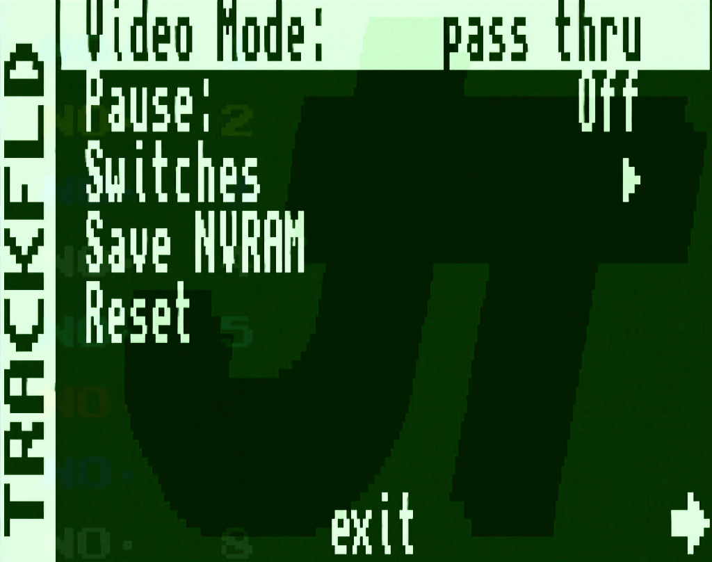
|===

Estas son las principales:

- `Video Mode`: Sólo en el caso de salida de vídeo VGA, para aplicar distintos filtros a la imagen
- `Pause`: Para detener el core
- `Switches`: Accede a ver y modificar el estado de los https://es.wikipedia.org/wiki/Interruptor_DIP[interruptores DIP] que haya definidos en el fichero ARC
- `Save NVRAM`: Para guardar el contenido de la NVRAM (récords de puntuación) en la tarjeta microSD
- `Reset`: Soft Reset (reinicia el Core)
- `Exit`: Cierra el menú de opciones

<<<

==== Trojan (Jotego)

https://en.wikipedia.org/wiki/Trojan_(video_game)[Trojan] es un videojuego de acción desarrollado por Capcom, lanzado originalmente como juego de máquina recreativa en 1986.

La versión para neptUNO+ está basada en la https://github.com/jotego/jtcores/tree/master/cores/trojan[versión original de Jotego].

Algunas de las características del core son:

- Salida de vídeo VGA
- Salida de vídeo RGB (utilizando el puerto VGA)
- Soporte de mando real y mando emulado en teclado

===== Formato de Tarjeta microSD

Se debe utilizar una tarjeta microSD, con la primera partición en formato exFAT o FAT32, donde se hayan copiado los ficheros ARC y ROM correspondientes de los juegos.

Para <<#_mra_tool,crear los ficheros ROM y ARC>>, se pueden obtener los ficheros MRA correspondientes del https://github.com/jotego/jtbin/tree/master/mra[repositorio del creador] del core original.

===== Controles

====== Teclas especiales y botones

Durante la ejecución del core:

- `F12` o botones `Start+Select` de un mando: mostrar el menú de control del core
- Teclas de cursor o el mando 1: Controles de dirección
- `Ctrl`, `Alt` o botones `A`,  `B` del mando 1: Botones 1, 2 del jugador
- `1` y `2` o botón `Select` de un mando: Iniciar partida de 1 ó 2 jugadores
- `5` y `6` o botón `Start` de un mando: Insertar una moneda
- `P` o botón `X` de un mando: Pausa
- `F3`: Soft Reset (reinicia el Core)

<<<

===== Guía básica

Al pulsar `F12`, se mostrará el menú con las distintas opciones del core. Se puede navegar utilizando las teclas de cursor. `Enter` selecciona un elemento.

[role="center",width="50%",cols="1a", frame=none, grid=none]
|===
|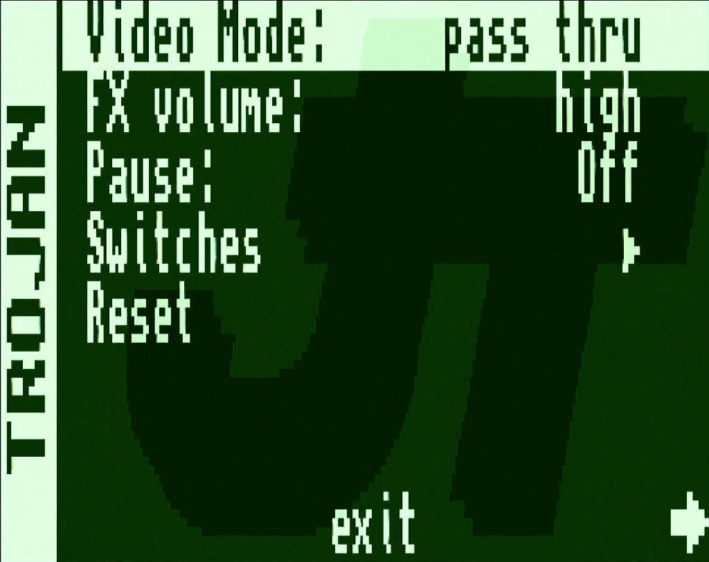
|===

Estas son las principales:

- `Video Mode`: Sólo en el caso de salida de vídeo VGA, para aplicar distintos filtros a la imagen
- `FX Volume`: Volumen de los efectos de sonido
- `Pause`: Para detener el core
- `Switches`: Accede a ver y modificar el estado de los https://es.wikipedia.org/wiki/Interruptor_DIP[interruptores DIP] que haya definidos en el fichero ARC
- `Reset`: Soft Reset (reinicia el Core)
- `Exit`: Cierra el menú de opciones

<<<

==== Konami Twin 16 (Jotego)

https://es.wikipedia.org/wiki/Konami_Twin_16[Konami Twin 16] es una placa para máquinas recreativas creada por Konami en 1987.

Este core permite ejecutar ROM de varios juegos (consultar <<#_konami_twin_16_hardware,la sección de referencias para más información>>).

La versión para neptUNO+ está basada en la https://github.com/jotego/jtcores/tree/master/cores/twin16[versión original de Jotego].

Algunas de las características del core son:

- Salida de vídeo VGA
- Salida de vídeo RGB (utilizando el puerto VGA)
- Soporte de mando real y mando emulado en teclado

===== Formato de Tarjeta microSD

Se debe utilizar una tarjeta microSD, con la primera partición en formato exFAT o FAT32, donde se hayan copiado los ficheros ARC y ROM correspondientes de los juegos.

Para <<#_mra_tool,crear los ficheros ROM y ARC>>, se pueden obtener los ficheros MRA correspondientes del https://github.com/jotego/jtbin/tree/master/mra[repositorio del creador] del core original.

===== Controles

====== Teclas especiales y botones

Durante la ejecución del core:

- `F12` o botones `Start+Select` de un mando: mostrar el menú de control del core
- Teclas de cursor o el mando 1: Controles de dirección del jugador uno
- `Alt` y `Espacio` o botones `B`, `X` del mando 1: Botones 1, 2  del jugador uno
- `R`,`D`,`F`,`G` o mando 2: Movimiento del jugador dos
- `S` y `Q` o botones `B`, `X` del mando 2: Botones 1, 2 del jugador dos
- `Ctrl` y `A` o botón `A` de un mando: Botón `Start` en Devil World o botón de selección de mejora en Vulcan
- `5` y `6` o botón `R` de un mando: para insertar una moneda
- `1` o botón `L` del mando 1: Botón `Map` en Devil World o botón `Start` en Vulcan
- `P` o botón `R2` de un mando: Pausa
- `F3`: Soft Reset (reinicia el Core)

<<<

===== Guía básica

Al pulsar `F12`, se mostrará el menú con las distintas opciones del core. Se puede navegar utilizando las teclas de cursor. `Enter` selecciona un elemento.

[role="center",width="50%",cols="1a", frame=none, grid=none]
|===
|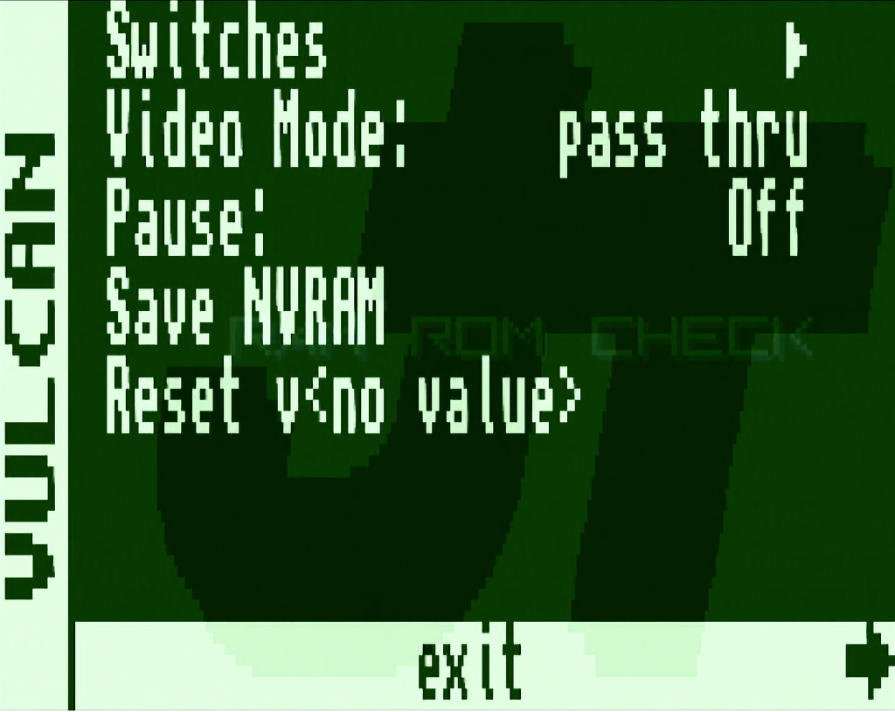
|===

Estas son las principales:

- `Switches`: Accede a ver y modificar el estado de los https://es.wikipedia.org/wiki/Interruptor_DIP[interruptores DIP] que haya definidos en el fichero ARC
- `Video Mode`: Sólo en el caso de salida de vídeo VGA, para aplicar distintos filtros a la imagen
- `Pause`: Para detener el core
- `Save NVRAM`: Para guardar el contenido de la NVRAM (récords de puntuación) en la tarjeta microSD
- `Reset`: Soft Reset (reinicia el Core)
- `Exit`: Cierra el menú de opciones

<<<

==== Vigilante (Jotego)

https://es.wikipedia.org/wiki/Vigilante_(videojuego)[Vigilante] es un videojuego de lucha lateral para máquinas recreativas publicado en 1988 por Irem en Japón y por Data East en Estados Unidos.

La versión para neptUNO+ está basada en la https://github.com/jotego/jtcores/tree/master/cores/vigil[versión original de Jotego].

Algunas de las características del core son:

- Salida de vídeo VGA
- Salida de vídeo RGB (utilizando el puerto VGA)
- Soporte de mando real y mando emulado en teclado

===== Formato de Tarjeta microSD

Se debe utilizar una tarjeta microSD, con la primera partición en formato exFAT o FAT32, donde se hayan copiado los ficheros ARC y ROM correspondientes de los juegos.

Para <<#_mra_tool,crear los ficheros ROM y ARC>>, se pueden obtener los ficheros MRA correspondientes del https://github.com/jotego/jtbin/tree/master/mra[repositorio del creador] del core original.

===== Controles

====== Teclas especiales y botones

Durante la ejecución del core:

- `F12` o botones `Start+Select` de un mando: mostrar el menú de control del core
- Teclas de cursor o el mando 1: Controles de dirección del jugador
- `Ctrl`, `Alt` o botones `A`, `B` del mando: Botones 1, 2 del jugador
- `1` y `2` o botón `Select` de un mando: Iniciar partida
- `5` y `6` o botón `Start` de un mando: Insertar una moneda
- `P` o botón `X` de un mando: Pausa
- `F3`: Soft Reset (reinicia el Core)

<<<

===== Guía básica

Al pulsar `F12`, se mostrará el menú con las distintas opciones del core. Se puede navegar utilizando las teclas de cursor. `Enter` selecciona un elemento.

[role="center",width="50%",cols="1a", frame=none, grid=none]
|===
|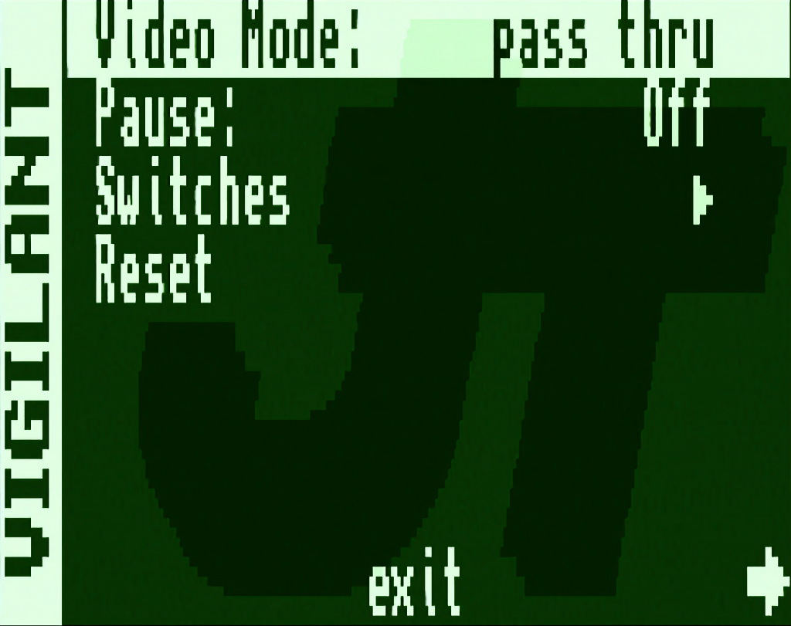
|===

Estas son las principales:

- `Video Mode`: Sólo en el caso de salida de vídeo VGA, para aplicar distintos filtros a la imagen
- `Pause`: Activa o desactiva la pausa
- `Switches`: Accede a ver y modificar el estado de los https://es.wikipedia.org/wiki/Interruptor_DIP[interruptores DIP] que haya definidos en el fichero ARC
- `Reset`: Soft Reset (reinicia el Core)
- `Exit`: Cierra el menú de opciones

<<<

==== Gridiron Fight (Jotego)

https://en.wikipedia.org/wiki/Gridiron_Fight[Gridiron Fight] también conocido como All American Football, es un videojuego de fútbol americano desarrollado y lanzado por Tehkan (más tarde conocida como Tecmo) para máquinas recreativas en 1985.

Este core permite ejecutar ROM de varios juegos (consultar <<#_gridiron_fight_hardware,la sección de referencias para más información>>).

La versión para neptUNO+ está basada en la https://github.com/jotego/jtcores/tree/master/cores/wc[versión original de Jotego].

Algunas de las características del core son:

- Salida de vídeo VGA
- Salida de vídeo RGB (utilizando el puerto VGA)
- Soporte de mando real y mando emulado en teclado

===== Formato de Tarjeta microSD

Se debe utilizar una tarjeta microSD, con la primera partición en formato exFAT o FAT32, donde se hayan copiado los ficheros ARC y ROM correspondientes de los juegos.

Para <<#_mra_tool,crear los ficheros ROM y ARC>>, se pueden obtener los ficheros MRA correspondientes del https://github.com/jotego/jtbin/tree/master/mra[repositorio del creador] del core original.

===== Controles

====== Teclas especiales y botones

Durante la ejecución del core:

- `F12` o botones `Start+Select` de un mando: mostrar el menú de control del core
- Teclas de cursor o el mando 1: Controles de dirección del jugador uno
- `Ctrl`, `Alt` o botones `A`, `B` del mando 1: Botones 1, 2 del jugador uno
- `R`,`D`,`F`,`G` o mando 2: Movimiento del jugador dos
- `A`, `S` o botones `A`, `B` del mando 2: Botones 1, 2 del jugador dos
- `1` y `2` o botón `L` de un mando: Iniciar partida jugador 1 o jugador 2
- `5` y `6` o botón `R` de un mando: Insertar una moneda
- `P` o botón `L2` de un mando: Pausa
- `F3`: Soft Reset (reinicia el Core). Si, además, se pulsan a la vez `1` y `2`. se accede al modo test

<<<

===== Guía básica

Al pulsar `F12`, se mostrará el menú con las distintas opciones del core. Se puede navegar utilizando las teclas de cursor. `Enter` selecciona un elemento.

[role="center",width="50%",cols="1a", frame=none, grid=none]
|===
|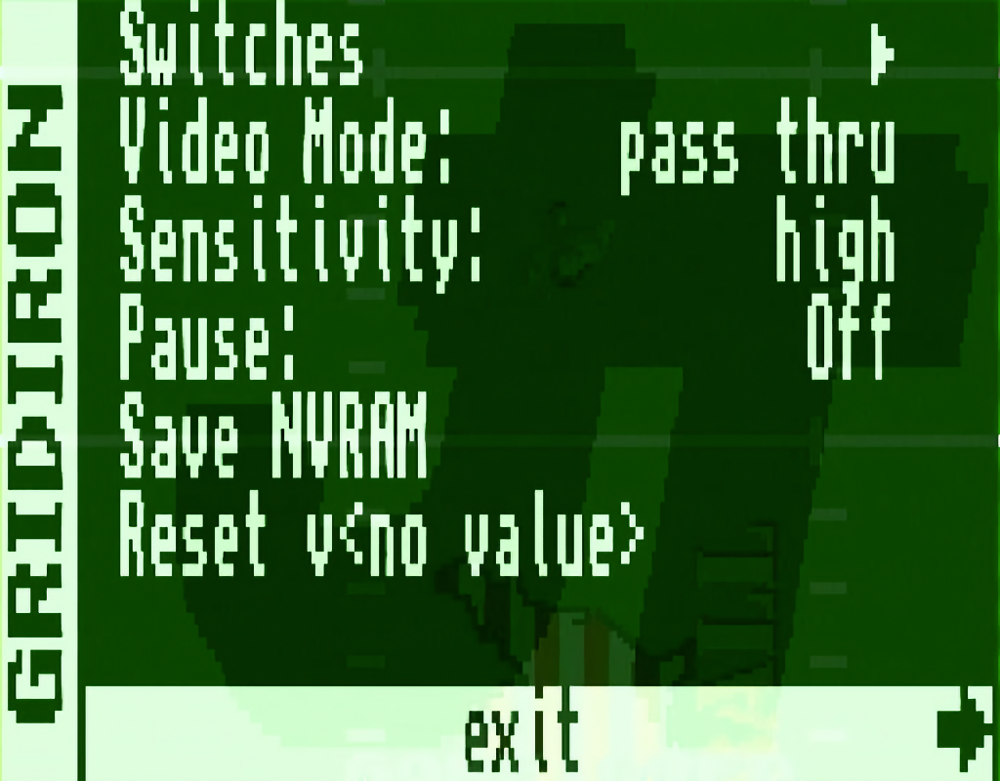
|===

Estas son las principales:

- `Switches`: Accede a ver y modificar el estado de los https://es.wikipedia.org/wiki/Interruptor_DIP[interruptores DIP] que haya definidos en el fichero ARC
- `Video Mode`: Sólo en el caso de salida de vídeo VGA, para aplicar distintos filtros a la imagen
- `Sensitivity`: Ajusta la sensibilidad
- `Pause`: Para detener el core
- `Save NVRAM`: Para guardar el contenido de la NVRAM (récords de puntuación) en la tarjeta microSD
- `Reset`: Soft Reset (reinicia el Core)
- `Exit`: Cierra el menú de opciones

<<<

==== WWF SuperStars (Jotego)

https://en.wikipedia.org/wiki/WWF_Superstars[WWF Superstars] es un videojuego de lucha libre fabricado por Technos Japan y lanzado para máquinas recreativas en 1989.

La versión para neptUNO+ está basada en la https://github.com/jotego/jtcores/tree/master/cores/wwfss[versión original de Jotego].

Algunas de las características del core son:

- Salida de vídeo VGA
- Salida de vídeo RGB (utilizando el puerto VGA)
- Soporte de mando real y mando emulado en teclado

===== Formato de Tarjeta microSD

Se debe utilizar una tarjeta microSD, con la primera partición en formato exFAT o FAT32, donde se hayan copiado los ficheros ARC y ROM correspondientes de los juegos.

Para <<#_mra_tool,crear los ficheros ROM y ARC>>, se pueden obtener los ficheros MRA correspondientes del https://github.com/jotego/jtbin/tree/master/mra[repositorio del creador] del core original.

===== Controles

====== Teclas especiales y botones

Durante la ejecución del core:

- `F12` o botones `Start+Select` de un mando: mostrar el menú de control del core
- Teclas de cursor o el mando 1: Controles de dirección del jugador uno
- `Ctrl`, `Alt` o botones `A`, `B` del mando 1: Botones 1, 2 del jugador uno
- `R`,`D`,`F`,`G` o mando 2: Movimiento del jugador dos
- `A`, `S` o botones `A`, `B` del mando 2: Botones 1, 2 del jugador dos
- `1` o botón `L` del mando 1: Iniciar partida 1 jugador contra la CPU
- `2` o botón `L` del mando 2: Iniciar partida jugador 1 contra jugador 2
- `Espacio`, `Q`, o el botón `X` de un mando: Iniciar partida 2 jugadores contra CPU
- `5` y `6` o botón `R` de un mando: Insertar una moneda
- `P` o botón `L2` de un mando: Pausa
- `F3`: Soft Reset (reinicia el Core)

<<<

===== Guía básica

Al pulsar `F12`, se mostrará el menú con las distintas opciones del core. Se puede navegar utilizando las teclas de cursor. `Enter` selecciona un elemento.

[role="center",width="50%",cols="1a", frame=none, grid=none]
|===
|image:img/jtwwfss.png[scaledwidth=100%]
|===

Estas son las principales:

- `Switches`: Accede a ver y modificar el estado de los https://es.wikipedia.org/wiki/Interruptor_DIP[interruptores DIP] que haya definidos en el fichero ARC
- `Video Mode`: Sólo en el caso de salida de vídeo VGA, para aplicar distintos filtros a la imagen
- `Pause`: Para detener el core
- `Save NVRAM`: Para guardar el contenido de la NVRAM (récords de puntuación) en la tarjeta microSD
- `Reset`: Soft Reset (reinicia el Core)
- `Exit`: Cierra el menú de opciones

<<<

==== X-Men (Jotego)

https://es.wikipedia.org/wiki/X-Men_(videojuego_de_1992)[X-Men] es un videojuego de máquina recreativa de 1992 desarrollado y publicado por Konami.

La versión para neptUNO+ está basada en la https://github.com/jotego/jtcores/tree/master/cores/xmen[versión original de Jotego].

Algunas de las características del core son:

- Salida de vídeo VGA
- Salida de vídeo RGB (utilizando el puerto VGA)
- Soporte de mando real y mando emulado en teclado

===== Formato de Tarjeta microSD

Se debe utilizar una tarjeta microSD, con la primera partición en formato exFAT o FAT32, donde se hayan copiado los ficheros ARC y ROM correspondientes de los juegos.

Para <<#_mra_tool,crear los ficheros ROM y ARC>>, se pueden obtener los ficheros MRA correspondientes del https://github.com/jotego/jtbin/tree/master/mra[repositorio del creador] del core original.

===== Controles

====== Teclas especiales y botones

Durante la ejecución del core:

- `F12` o botones `Start+Select` de un mando: mostrar el menú de control del core
- Teclas de cursor o el mando 1: Controles de dirección del jugador uno
- `Ctrl`, `Alt`, `Espacio` o botones `A`, `B`, `Select` del mando 1: Botones 1, 2, 3 del jugador uno
- `R`,`D`,`F`,`G` o mando 2: Movimiento del jugador dos
- `A`, `S`, `Q` o botones `A`, `B`, `Select` del mando 2: Botones 1, 2, 3 del jugador dos
- `1` y `2` o botón `X` de un mando: Iniciar partida jugador 1 o jugador 2
- `5` y `6` o botón `Y` de un mando: Insertar una moneda jugador 1 o jugador 2
- `P o botón `L` de un mando: : Pausa
- `F3`: Soft Reset (reinicia el Core)

<<<

===== Guía básica

Al pulsar `F12`, se mostrará el menú con las distintas opciones del core. Se puede navegar utilizando las teclas de cursor. `Enter` selecciona un elemento.

[role="center",width="50%",cols="1a", frame=none, grid=none]
|===
|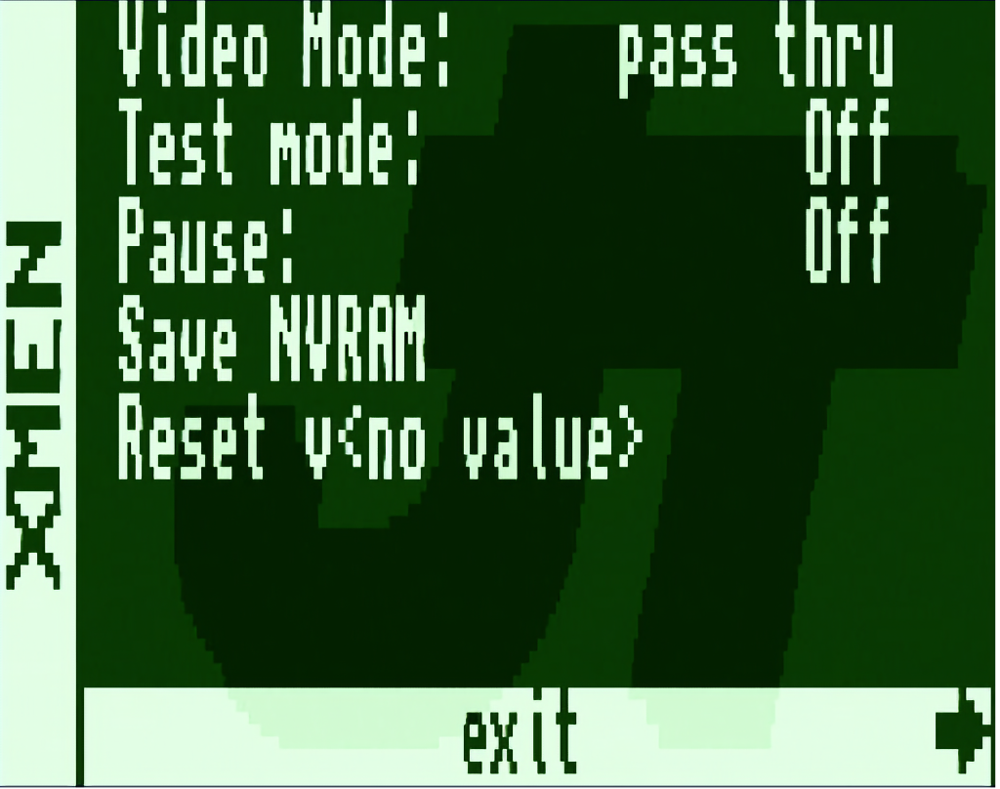
|===

Estas son las principales:

- `Video Mode`: Sólo en el caso de salida de vídeo VGA, para aplicar distintos filtros a la imagen
- `Test Mode` Activar o desactivar el modo de prueba
- `Pause`: Para detener el core
- `Save NVRAM`: Para guardar el contenido de la NVRAM (récords de puntuación) en la tarjeta microSD
- `Reset`: Soft Reset (reinicia el Core)
- `Exit`: Cierra el menú de opciones

<<<

==== Yie Ar Kung-Fu (Jotego)

https://es.wikipedia.org/wiki/Yie_Ar_Kung-Fu[Yie Ar Kung-Fu] es un videojuego de máquina recreativa. Fue desarrollado por Imagine Entertainment y Konami y publicado en 1985.

La versión para neptUNO+ está basada en https://github.com/jotego/jtcores/tree/master/cores/yiear[versión original de Jotego].

Algunas de sus características son:

- Salida de vídeo VGA
- Salida de vídeo RGB (utilizando el puerto VGA)
- Soporte de mando real y mando emulado en teclado

===== Formato de Tarjeta microSD

Se debe utilizar una tarjeta microSD, con la primera partición en formato exFAT o FAT32, donde se hayan copiado los ficheros ARC y ROM correspondientes de los juegos.

Para <<#_mra_tool,crear los ficheros ROM y ARC>>, se pueden obtener los ficheros MRA correspondientes del https://github.com/jotego/jtbin/tree/master/mra[repositorio del creador] del core original.

===== Controles

====== Teclas especiales y botones

Durante la ejecución del core:

- `F12` o botones `Start+Select` de un mando: mostrar el menú de control del core
- Teclas de cursor o el mando 1: Controles de dirección del jugador
- `Ctrl`, `Alt` o botones `A`, `B` del mando: Botones 1, 2 del jugador
- `1` y `2` o botón `Select` de un mando: Iniciar partida
- `5` y `6` o botón `Start` de un mando: Insertar una moneda
- `P` o botón `X` de un mando: Pausa
- `F3`: Soft Reset (reinicia el Core)

<<<

===== Guía básica

Al pulsar `F12`, se mostrará el menú con las distintas opciones del core. Se puede navegar utilizando las teclas de cursor. `Enter` selecciona un elemento.

[role="center",width="50%",cols="1a", frame=none, grid=none]
|===
|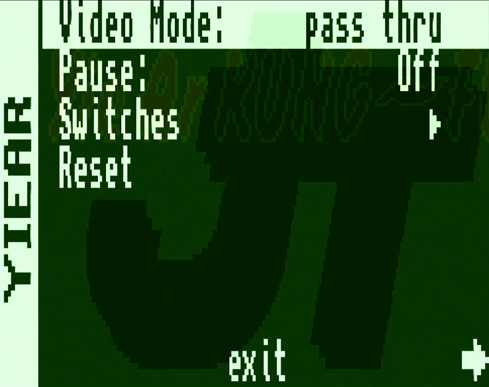
|===

Estas son las principales:

- `Video Mode`: Sólo en el caso de salida de vídeo VGA, para aplicar distintos filtros a la imagen
- `Pause`: Activa o desactiva la pausa
- `Switches`: Accede a ver y modificar el estado de los https://es.wikipedia.org/wiki/Interruptor_DIP[interruptores DIP] que haya definidos en el fichero ARC
- `Reset`: Soft Reset (reinicia el Core)
- `Exit`: Cierra el menú de opciones

<<<

==== Kiwako Mr. Jong

https://en.wikipedia.org/wiki/List_of_arcade_video_games:_B[Mr. Jong, BlockBuster o Crazy Blocks] son juegos de máquina recreativa creados por la compañía Kiwako en 1983.

Este core permite ejecutar ROM de varios juegos (consultar <<#_kiwako_mr_jong_hardware,la sección de referencias para más información>>).

La versión para neptUNO+ está basada en https://github.com/MiSTer-devel/Arcade-MrJong_MiSTer[la implementación existente para MiSTer].

Algunas de las características del core son:

- Salida de vídeo VGA
- Salida de vídeo RGB (utilizando el puerto VGA)
- Soporte de mando real y mando emulado en teclado

===== Formato de Tarjeta microSD

Se debe utilizar una tarjeta microSD, con la primera partición en formato exFAT o FAT32, donde se hayan copiado los ficheros ARC y ROM correspondientes de los juegos.

Para <<#_mra_tool,crear los ficheros ROM y ARC>>, se pueden obtener los ficheros MRA correspondientes del https://github.com/mist-devel/mist-binaries/tree/master/cores/arcade/Kiwako%20MrJong[repositorio de la versión original para MiST].

===== Controles

====== Teclas especiales y botones

Durante la ejecución del core:

- `F12`: Mostrar el menú de control del core
- Teclas de cursor o el mando 1: Controles de dirección del jugador 1
- `Ctrl Dcha` o el botón `A` del mando 1: botón `A` del jugador 1
- `R`, `D`, `F`, `G` o mando 2: Controles de dirección del jugador 2
- `A` o el botón `A` del mando 2: botón `A` del jugador 2
- `1` y `2`: Iniciar partida jugador 1 o jugador 2
- `5` y `6`: Insertar una moneda

<<<

===== Guía básica

Al pulsar `F12`, se mostrará el menú con las distintas opciones del core. Se puede navegar utilizando las teclas de cursor. `Enter` selecciona un elemento.

[role="center",width="50%",cols="1a", frame=none, grid=none]
|===
|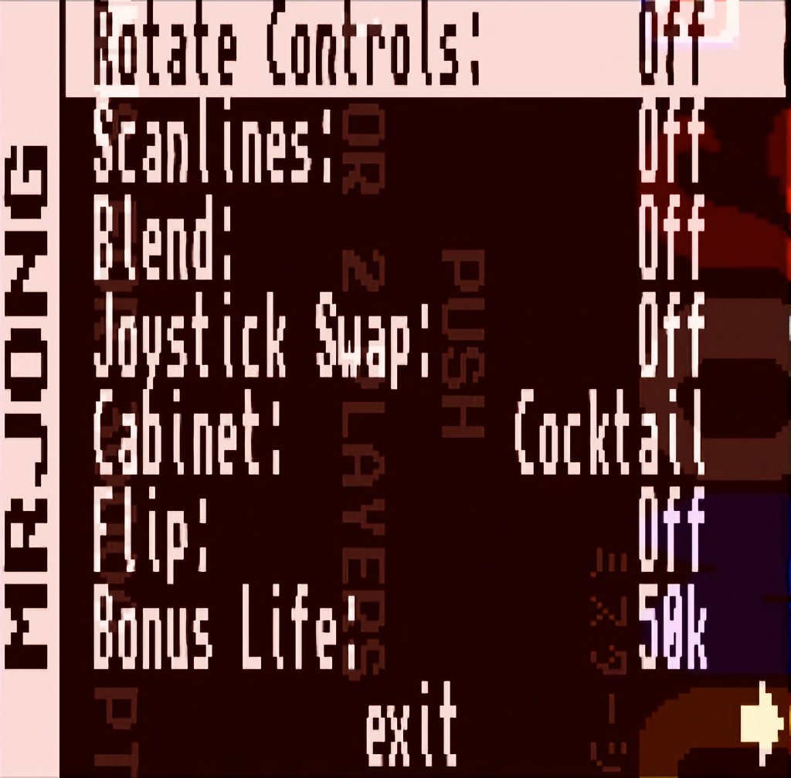
|===

Estas son las principales:

- `Rotate Controls`: Para girar el texto del menú de opciones, así como el comportamiento de los controles de dirección
- `Scanlines`: Para añadir un efecto de líneas de exploración (sólo con salida VGA)
- `Blend`: Para activar si se desea, un efecto de suavizado de la imagen
- `Joystick Swap`: Para intercambiar los controles del jugador 1 y el jugador 2
- `Cabinet`: Configura el parámetro de tipo de gabinete en los https://es.wikipedia.org/wiki/Interruptor_DIP[interruptores DIP]
- `Flip`: Para rotar 180º cómo se muestra la imagen en la pantalla
- `Bonus Life`: Configura los ajustes de vida extra en los https://es.wikipedia.org/wiki/Interruptor_DIP[interruptores DIP]
- `Difficulty`: Configura la dificultad en los https://es.wikipedia.org/wiki/Interruptor_DIP[interruptores DIP]
- `Lives`: Configura el número de vidas en los https://es.wikipedia.org/wiki/Interruptor_DIP[interruptores DIP]
- `Coin`: Configura en los https://es.wikipedia.org/wiki/Interruptor_DIP[interruptores DIP] el comportamiento según las monedas introducidas
- `Reset`: Soft Reset (reinicia el Core)
- `Exit`: Cierra el menú

<<<

==== Konami Finalizer

https://en.wikipedia.org/wiki/Finalizer_(video_game)[Konami Finalizer - Super Transformation] es un juego de disparos de desplazamiento vertical lanzado en salas recreativas por Konami en 1985.

La versión para neptUNO+ está basada en https://github.com/mist-devel/mist-binaries/tree/master/cores/arcade/Konami%20Finalizer[la implementación existente para MiST].

Algunas de las características del core son:

- La salida de vídeo mantiene la rotación del original
- Salida de vídeo VGA
- Salida de vídeo RGB (utilizando el puerto VGA)
- Soporte de mando real y mando emulado en teclado

===== Formato de Tarjeta microSD

Se debe utilizar una tarjeta microSD, con la primera partición en formato exFAT o FAT32, donde se hayan copiado los ficheros ARC y ROM correspondientes del juego.

Para <<#_mra_tool,crear los ficheros ROM y ARC>>, se pueden obtener los ficheros MRA correspondientes del https://github.com/mist-devel/mist-binaries/tree/master/cores/arcade/Konami%20Finalizer[repositorio de la versión original para MiST].

===== Controles

====== Teclas especiales y botones

Durante la ejecución del core:

- `F12` o botones `Start+Select` de un mando: mostrar el menú de control del core
- Teclas de cursor o el mando: Controles de dirección del jugador
- `Ctrl`, `Alt` o botones `A`, `B` del mando: Botones 1, 2 del jugador
- `1` o `2`: Iniciar partida 1 ó 2 jugadores
- `5` y `6`: Insertar una moneda

<<<

===== Guía básica

Al pulsar `F12`, se mostrará el menú con las distintas opciones del core. Se puede navegar utilizando las teclas de cursor. `Enter` selecciona un elemento.

[role="center",width="50%",cols="1a", frame=none, grid=none]
|===
|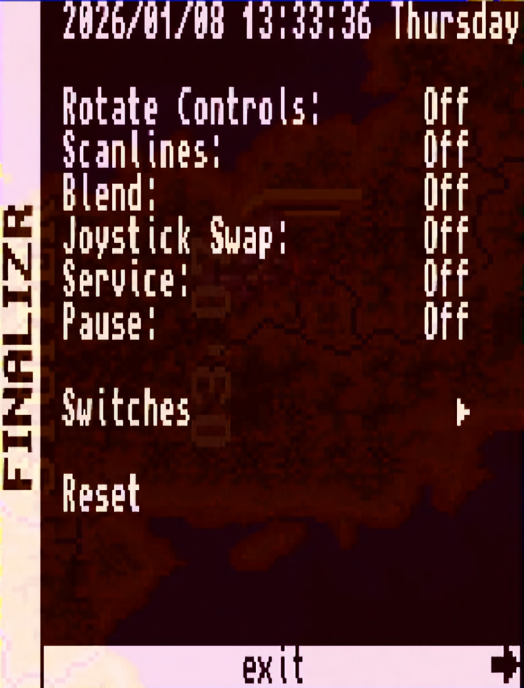
|===

Estas son las principales:

- `Rotate Controls`: Para girar el texto del menú de opciones, así como el comportamiento de los controles de dirección
- `Scanlines`: Para añadir un efecto de líneas de exploración (sólo con salida VGA)
- `Blend`: Para activar si se desea, un efecto de suavizado de la imagen
- `Joystick Swap`: Para intercambiar los controles del jugador 1 y el jugador 2
- `Service`: Activa o desactiva el modo de servicio
- `Pause`: Para detener el core
- `Switches`: Accede a ver y modificar el estado de los https://es.wikipedia.org/wiki/Interruptor_DIP[interruptores DIP] que haya definidos en el fichero ARC
- `Reset`: Soft Reset (reinicia el Core)
- `Exit`: Cierra el menú de opciones

<<<

==== Konami Gyruss

https://es.wikipedia.org/wiki/Gyruss[Konami Gyruss] es un videojuego, publicado por Konami, y lanzado en recreativas en 1983.

La versión para neptUNO+ está basada en https://github.com/mist-devel/mist-binaries/tree/master/cores/arcade/Konami%20Gyruss[la implementación existente para MiST].

Algunas de las características del core son:

- La salida de vídeo mantiene la rotación del original
- Salida de vídeo VGA
- Salida de vídeo RGB (utilizando el puerto VGA)
- Soporte de mando real y mando emulado en teclado

===== Formato de Tarjeta microSD

Se debe utilizar una tarjeta microSD, con la primera partición en formato exFAT o FAT32, donde se hayan copiado los ficheros ARC y ROM correspondientes del juego.

Para <<#_mra_tool,crear los ficheros ROM y ARC>>, se pueden obtener los ficheros MRA correspondientes del https://github.com/mist-devel/mist-binaries/tree/master/cores/arcade/Konami%20Gyruss[repositorio de la versión original para MiST].

===== Controles

====== Teclas especiales y botones

Durante la ejecución del core:

- `F12` o botones `Start+Select` de un mando: mostrar el menú de control del core
- Teclas de cursor o el mando 1: Controles de dirección del jugador
- `Ctrl` o botón `A` del mando 1: Botón 1 jugador
- `1` ó `2`: Iniciar partida 1 ó 2 jugadores
- `5` y `6`: Insertar una moneda

<<<

===== Guía básica

Al pulsar `F12`, se mostrará el menú con las distintas opciones del core. Se puede navegar utilizando las teclas de cursor. `Enter` selecciona un elemento.

[role="center",width="50%",cols="1a", frame=none, grid=none]
|===
|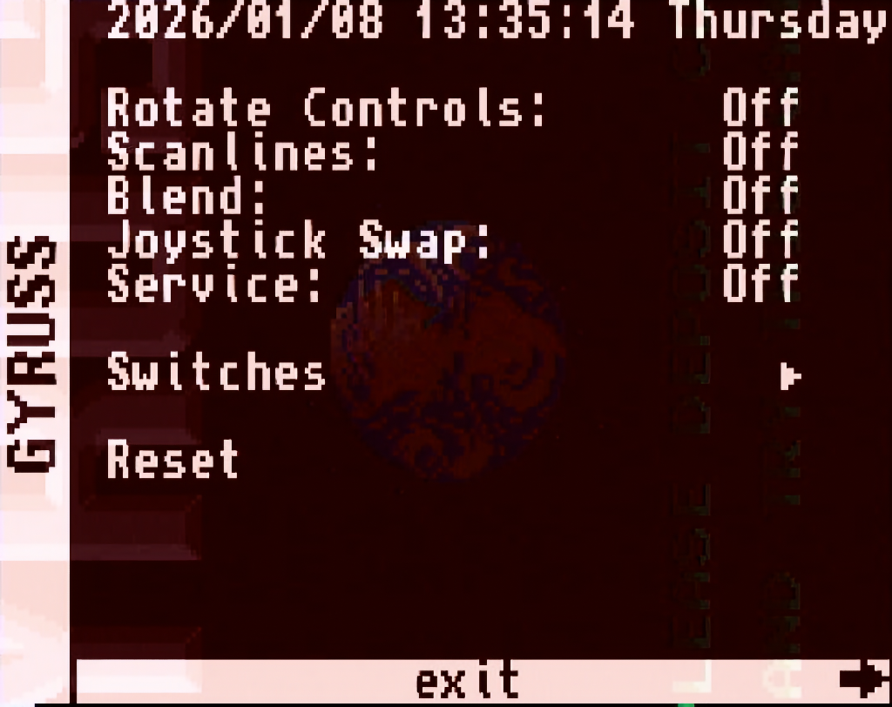
|===

Estas son las principales:

- `Rotate Controls`: Para girar el texto del menú de opciones, así como el comportamiento de los controles de dirección
- `Scanlines`: Para añadir un efecto de líneas de exploración (sólo con salida VGA)
- `Blend`: Para activar si se desea, un efecto de suavizado de la imagen
- `Joystick Swap`: Para intercambiar los controles del jugador 1 y el jugador 2
- `Service`: Activa o desactiva el modo de servicio
- `Switches`: Accede a ver y modificar el estado de los https://es.wikipedia.org/wiki/Interruptor_DIP[interruptores DIP] que haya definidos en el fichero ARC
- `Reset`: Soft Reset (reinicia el Core)
- `Exit`: Cierra el menú de opciones

<<<

==== Konami Iron Horse

https://konami.fandom.com/wiki/Iron_Horse[Konami Iron Horse] es un videojuego lanzado en 1986 por Konami para máquinas recreativas.

La versión para neptUNO+ está basada en https://github.com/mist-devel/mist-binaries/tree/master/cores/arcade/Konami%20Iron%20Horse[la implementación existente para MiST].

Algunas de las características del core son:

- Salida de vídeo VGA
- Salida de vídeo RGB (utilizando el puerto VGA)
- Soporte de mando real y mando emulado en teclado

===== Formato de Tarjeta microSD

Se debe utilizar una tarjeta microSD, con la primera partición en formato exFAT o FAT32, donde se hayan copiado los ficheros ARC y ROM correspondientes del juego.

Para <<#_mra_tool,crear los ficheros ROM y ARC>>, se pueden obtener los ficheros MRA correspondientes del https://github.com/mist-devel/mist-binaries/tree/master/cores/arcade/Konami%20Iron%20Horse[repositorio de la versión original para MiST].

===== Controles

====== Teclas especiales y botones

Durante la ejecución del core:

- `F12` o botones `Start+Select` de un mando: mostrar el menú de control del core
- Teclas de cursor o el mando 1: Controles de dirección del jugador
- `Alt` y `Espacio` o botones `B`, `Select` del mando 1: Botones 1, 2 del jugador
- `1` ó `2`: Iniciar partida 1 ó 2 jugadores
- `5` y `6`: Insertar una moneda

<<<

===== Guía básica

Al pulsar `F12`, se mostrará el menú con las distintas opciones del core. Se puede navegar utilizando las teclas de cursor. `Enter` selecciona un elemento.

[role="center",width="50%",cols="1a", frame=none, grid=none]
|===
|image:img/ironHors.png[scaledwidth=100%]
|===

Estas son las principales:

- `Rotate Controls`: Para girar el texto del menú de opciones, así como el comportamiento de los controles de dirección
- `Scanlines`: Para añadir un efecto de líneas de exploración (sólo con salida VGA)
- `Blend`: Para activar si se desea, un efecto de suavizado de la imagen
- `Joystick Swap`: Para intercambiar los controles del jugador 1 y el jugador 2
- `Service`: Activa o desactiva el modo de servicio
- `Pause`: Para detener el core
- `Switches`: Accede a ver y modificar el estado de los https://es.wikipedia.org/wiki/Interruptor_DIP[interruptores DIP] que haya definidos en el fichero ARC
- `Reset`: Soft Reset (reinicia el Core)
- `Exit`: Cierra el menú de opciones

<<<

==== Konami Jailbreak

https://konami.fandom.com/wiki/Jail_Break[Konami Jailbreak] es un videojuego de acción publicado por Konami para máquinas recreativas y lanzado en 1986.

Este core permite ejecutar ROM de varios juegos (consultar <<#_konami_jailbreak_hardware,la sección de referencias para más información>>).

La versión para neptUNO+ está basada en https://github.com/mist-devel/mist-binaries/tree/master/cores/arcade/Konami%20Jailbreak[la implementación existente para MiST].

Algunas de las características del core son:

- Salida de vídeo VGA
- Salida de vídeo RGB (utilizando el puerto VGA)
- Soporte de mando real y mando emulado en teclado

===== Formato de Tarjeta microSD

Se debe utilizar una tarjeta microSD, con la primera partición en formato exFAT o FAT32, donde se hayan copiado los ficheros ARC y ROM correspondientes de los juegos.

Para <<#_mra_tool,crear los ficheros ROM y ARC>>, se pueden obtener los ficheros MRA correspondientes del https://github.com/mist-devel/mist-binaries/tree/master/cores/arcade/Konami%20Jailbreak[repositorio de la versión original para MiST].

===== Controles

====== Teclas especiales y botones

Durante la ejecución del core:

- `F12` o botones `Start+Select` de un mando: mostrar el menú de control del core
- Teclas de cursor: Controles de dirección
- `Ctrl``: Botón 1 del jugador
- `1` ó `2`: Iniciar partida 1 ó 2 jugadores
- `5` y `6`: Insertar una moneda

<<<

===== Guía básica

Al pulsar `F12`, se mostrará el menú con las distintas opciones del core. Se puede navegar utilizando las teclas de cursor. `Enter` selecciona un elemento.

[role="center",width="50%",cols="1a", frame=none, grid=none]
|===
|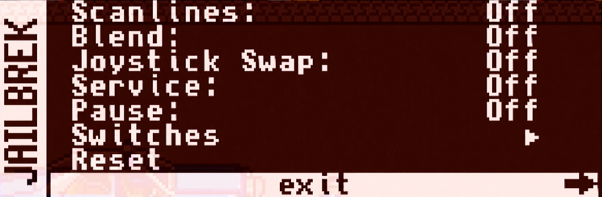
|===

Estas son las principales:

- `Rotate Controls`: Para girar el texto del menú de opciones, así como el comportamiento de los controles de dirección
- `Scanlines`: Para añadir un efecto de líneas de exploración (sólo con salida VGA)
- `Blend`: Para activar si se desea, un efecto de suavizado de la imagen
- `Joystick Swap`: Para intercambiar los controles del jugador 1 y el jugador 2
- `Service`: Activa o desactiva el modo de servicio
- `Pause`: Para detener el core
- `Switches`: Accede a ver y modificar el estado de los https://es.wikipedia.org/wiki/Interruptor_DIP[interruptores DIP] que haya definidos en el fichero ARC
- `Reset`: Soft Reset (reinicia el Core)
- `Exit`: Cierra el menú de opciones

<<<

==== Konami Pooyan

https://es.wikipedia.org/wiki/Pooyan[Konami Pooyan] es un videojuego de máquina recreativa lanzado en 1982 por Konami y Hudson Soft.

La versión para neptUNO+ está basada en https://github.com/mist-devel/mist-binaries/tree/master/cores/arcade/Konami%20Pooyan[la implementación existente para MiST].

Algunas de las características del core son:

- La salida de vídeo mantiene la rotación del original
- Salida de vídeo VGA
- Salida de vídeo RGB (utilizando el puerto VGA)
- Soporte de mando real y mando emulado en teclado

===== Formato de Tarjeta microSD

Se debe utilizar una tarjeta microSD, con la primera partición en formato exFAT o FAT32, donde se haya copiado el fichero ROM correspondiente del juego.

===== Controles

====== Teclas especiales y botones

Durante la ejecución del core:

- `F12` o botones `Start+Select` de un mando: mostrar el menú de control del core
- Teclas de cursor: Controles de dirección
- `Ctrl`: Botón 1 del jugador
- `1` ó `2`: Iniciar partida 1 ó 2 jugadores
- `5`: Insertar una moneda

<<<

===== Guía básica

Al pulsar `F12`, se mostrará el menú con las distintas opciones del core. Se puede navegar utilizando las teclas de cursor. `Enter` selecciona un elemento.

[role="center",width="50%",cols="1a", frame=none, grid=none]
|===
|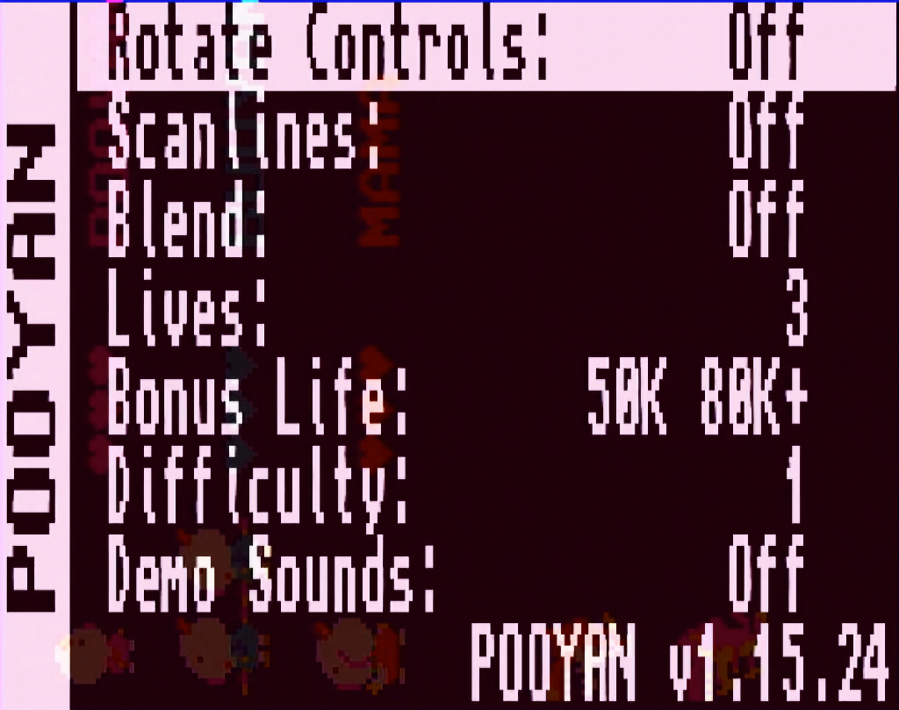
|===

Estas son las principales:

- `Rotate Controls`: Para girar el texto del menú de opciones, así como el comportamiento de los controles de dirección
- `Scanlines`: Para añadir un efecto de líneas de exploración (sólo con salida VGA)
- `Blend`: Para activar si se desea, un efecto de suavizado de la imagen
- `Lives`: Configura el número de vidas en los https://es.wikipedia.org/wiki/Interruptor_DIP[interruptores DIP]
- `Bonus Life`: Configura los ajustes de vida extra en los https://es.wikipedia.org/wiki/Interruptor_DIP[interruptores DIP]
- `Difficulty`: Configura la dificultad en los https://es.wikipedia.org/wiki/Interruptor_DIP[interruptores DIP]
- `Demo Sounds`: Configura en los https://es.wikipedia.org/wiki/Interruptor_DIP[interruptores DIP] la activación de sonidos de demostración
- `Reset`: Soft Reset (reinicia el Core)
- `Exit`: Cierra el menú de opciones

<<<

==== Konami Scooter Shooter

https://en.wikipedia.org/wiki/Scooter_Shooter[Konami ScooterShooter] es un juego lanzado en salas recreativas por Konami en 1985.

La versión para neptUNO+ está basada en https://github.com/mist-devel/mist-binaries/tree/master/cores/arcade/Konami%20ScooterShooter[la implementación existente para MiST].

Algunas de las características del core son:

- La salida de vídeo mantiene la rotación del original
- Salida de vídeo VGA
- Salida de vídeo RGB (utilizando el puerto VGA)
- Soporte de mando real y mando emulado en teclado

===== Formato de Tarjeta microSD

Se debe utilizar una tarjeta microSD, con la primera partición en formato exFAT o FAT32, donde se hayan copiado los ficheros ARC y ROM correspondientes del juego.

Para <<#_mra_tool,crear los ficheros ROM y ARC>>, se pueden obtener los ficheros MRA correspondientes del https://github.com/mist-devel/mist-binaries/tree/master/cores/arcade/Konami%20ScooterShooter[repositorio de la versión original para MiST].

===== Controles

====== Teclas especiales y botones

Durante la ejecución del core:

- `F12` o botones `Start+Select` de un mando: mostrar el menú de control del core
- Teclas de cursor o el mando 1: Controles de dirección del jugador uno
- `Ctrl`, o botón `A` del mando 1: Botón 1 del jugador uno
- `R`,`D`,`F`,`G` o mando 2: Movimiento del jugador dos
- `A` o botón `A` del mando 2: Botón 1 del jugador uno
- `1` y `2`: Iniciar partida jugador 1 o jugador 2
- `5` y `6`: Insertar una moneda

<<<

===== Guía básica

Al pulsar `F12`, se mostrará el menú con las distintas opciones del core. Se puede navegar utilizando las teclas de cursor. `Enter` selecciona un elemento.

[role="center",width="50%",cols="1a", frame=none, grid=none]
|===
|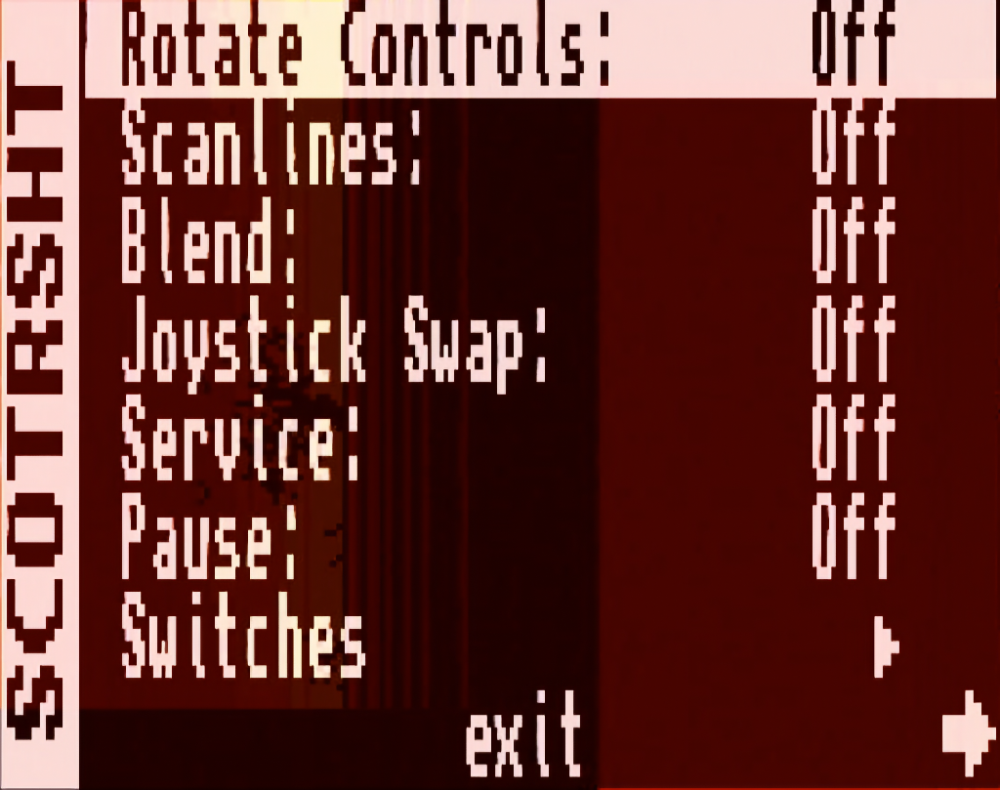
|===

Estas son las principales:

- `Rotate Controls`: Para girar el texto del menú de opciones, así como el comportamiento de los controles de dirección
- `Scanlines`: Para añadir un efecto de líneas de exploración (sólo con salida VGA)
- `Blend`: Para activar si se desea, un efecto de suavizado de la imagen
- `Joystick Swap`: Para intercambiar los controles del jugador 1 y el jugador 2
- `Service`: Activa o desactiva el modo de servicio
- `Pause`: Para detener el core
- `Switches`: Accede a ver y modificar el estado de los https://es.wikipedia.org/wiki/Interruptor_DIP[interruptores DIP] que haya definidos en el fichero ARC
- `Reset`: Soft Reset (reinicia el Core)
- `Exit`: Cierra el menú de opciones

<<<

==== Konami Time Pilot '84

https://es.wikipedia.org/wiki/Time_Pilot_%2784[Konami Time Pilot '84] un videojuego de máquina recreativa lanzado en 1984 por Konami.

La versión para neptUNO+ está basada en https://github.com/mist-devel/mist-binaries/tree/master/cores/arcade/Konami%20TimePilot84[la implementación existente para MiST].

Algunas de las características del core son:

- La salida de vídeo mantiene la rotación del original
- Salida de vídeo VGA
- Salida de vídeo RGB (utilizando el puerto VGA)
- Soporte de mando real y mando emulado en teclado

===== Formato de Tarjeta microSD

Se debe utilizar una tarjeta microSD, con la primera partición en formato exFAT o FAT32, donde se hayan copiado los ficheros ARC y ROM correspondientes del juego.

Para <<#_mra_tool,crear los ficheros ROM y ARC>>, se pueden obtener los ficheros MRA correspondientes del https://github.com/mist-devel/mist-binaries/tree/master/cores/arcade/Konami%20TimePilot84[repositorio de la versión original para MiST].

===== Controles

====== Teclas especiales y botones

Durante la ejecución del core:

- `F12` o botones `Start+Select` de un mando: mostrar el menú de control del core
- Teclas de cursor o el mando: Controles de dirección del jugador
- `Ctrl`, `Alt` o botones `A`, `B` del mando: Botones 1, 2 del jugador
- `1` o `2`: Iniciar partida 1 ó 2 jugadores
- `5` y `6`: Insertar una moneda

<<<

===== Guía básica

Al pulsar `F12`, se mostrará el menú con las distintas opciones del core. Se puede navegar utilizando las teclas de cursor. `Enter` selecciona un elemento.

[role="center",width="50%",cols="1a", frame=none, grid=none]
|===
|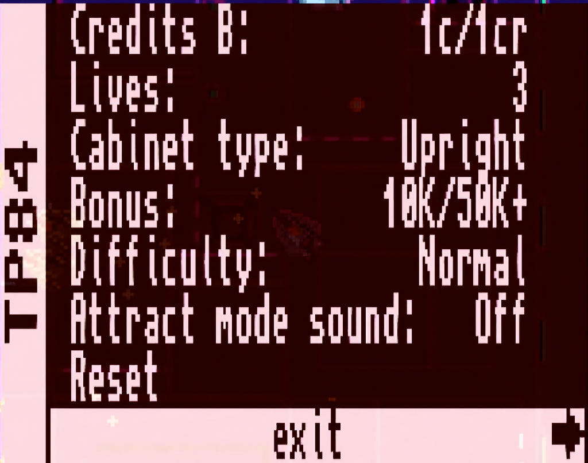
|===

Estas son las principales:

- `Rotate Controls`: Para girar el texto del menú de opciones, así como el comportamiento de los controles de dirección
- `Scanlines`: Para añadir un efecto de líneas de exploración (sólo con salida VGA)
- `Blend`: Para activar si se desea, un efecto de suavizado de la imagen
- `Joystick Swap`: Para intercambiar los controles del jugador 1 y el jugador 2
- `Service`: Activa o desactiva el modo de servicio
- `Credits A`: Configura en los https://es.wikipedia.org/wiki/Interruptor_DIP[interruptores DIP] el comportamiento según las monedas introducidas
- `Credits B`: Configura en los https://es.wikipedia.org/wiki/Interruptor_DIP[interruptores DIP] el comportamiento según las monedas introducidas
- `Lives`: Configura el número de vidas en los https://es.wikipedia.org/wiki/Interruptor_DIP[interruptores DIP]
- `Cabinet Type`: Configura el parámetro de tipo de gabinete en los https://es.wikipedia.org/wiki/Interruptor_DIP[interruptores DIP]
- `Bonus`: Configura los ajustes de vida extra en los https://es.wikipedia.org/wiki/Interruptor_DIP[interruptores DIP]
- `Difficulty`: Configura la dificultad en los https://es.wikipedia.org/wiki/Interruptor_DIP[interruptores DIP]
- `Attract Mode Sound`: Configura en los https://es.wikipedia.org/wiki/Interruptor_DIP[interruptores DIP] la activación de sonidos de demostración
- `Reset`: Soft Reset (reinicia el Core)
- `Exit`: Cierra el menú de opciones

<<<

==== Midway MCR-1

https://www.system16.com/hardware.php?id=601[Midway MCR-1] es una placa de máquina recreativa lanzada en 1981 por Bally Midway. En su período de vida, fueron lanzados 4 juegos para las distintas variantes del sistema.

Este core permite ejecutar ROM de varios juegos (consultar <<#_midway_mcr_1_hardware,la sección de referencias para más información>>).

La versión para neptUNO+ está basada en https://github.com/mist-devel/mist-binaries/tree/master/cores/arcade/Midway%20MCR%201[la implementación existente para MiST].

Algunas de las características del core son:

- La salida de vídeo mantiene la rotación del original
- Salida de video sólo VGA
- Soporte de mando real y mando emulado en teclado

===== Formato de Tarjeta microSD

Se debe utilizar una tarjeta microSD, con la primera partición en formato exFAT o FAT32, donde se hayan copiado los ficheros ARC y ROM correspondientes de los juegos.

Para <<#_mra_tool,crear los ficheros ROM y ARC>>, se pueden obtener los ficheros MRA correspondientes del https://github.com/mist-devel/mist-binaries/tree/master/cores/arcade/Midway%20MCR%201[repositorio de la versión original para MiST].

===== Controles

====== Teclas especiales y botones

Durante la ejecución del core:

- `F12` o botones `Start+Select` de un mando: mostrar el menú de control del core
- Teclas de cursor o el mando: Controles de dirección del jugador
- `Ctrl`, `Alt` o botones `A`, `B` del mando: Botones 1, 2 del jugador
- `1` o `2`: Iniciar partida 1 ó 2 jugadores
- `5` y `6`: Insertar una moneda

<<<

===== Guía básica

Al pulsar `F12`, se mostrará el menú con las distintas opciones del core. Se puede navegar utilizando las teclas de cursor. `Enter` selecciona un elemento.

[role="center",width="50%",cols="1a", frame=none, grid=none]
|===
|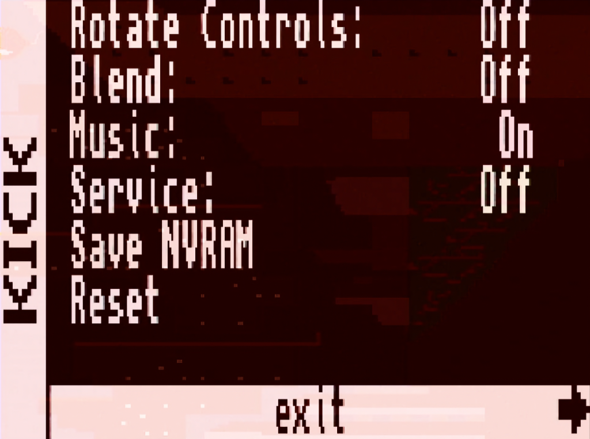
|===

Estas son las principales:

- `Rotate Controls`: Para girar el texto del menú de opciones, así como el comportamiento de los controles de dirección
- `Blend`: Para activar si se desea, un efecto de suavizado de la imagen
- `Service`: Activa o desactiva el modo de servicio
- `Save NVRAM`: Para guardar el contenido de la NVRAM (récords de puntuación) en la tarjeta microSD
- `Reset`: Soft Reset (reinicia el Core)
- `Exit`: Cierra el menú de opciones

Además, aparecerán otras opciones para ver y modificar el estado de los https://es.wikipedia.org/wiki/Interruptor_DIP[interruptores DIP] que haya definidos en el fichero ARC cargado actualmente.

<<<

==== Midway MCR-2

https://www.system16.com/hardware.php?id=602[Midway MCR-2] es la segunda variante de la placa MCR de máquina recreativa, lanzada en 1981 por Bally Midway. En su período de vida, fueron lanzados 7 juegos para las distintas variantes del sistema.

Existen dos cores que implementan este tipo de placa, y permiten ejecutar ROM de varios juegos (consultar <<#_midway_mcr_2_hardware,la sección de referencias para más información>>).

Las versiones para neptUNO+ están basadas en https://github.com/mist-devel/mist-binaries/tree/master/cores/arcade/Midway%20MCR%202[la implementación existente para MiST].

Algunas de las características de los cores son:

- La salida de vídeo mantiene la rotación del original
- Salida de video sólo VGA
- Soporte de mando real y mando emulado en teclado

===== Formato de Tarjeta microSD

Se debe utilizar una tarjeta microSD, con la primera partición en formato exFAT o FAT32, donde se hayan copiado los ficheros ARC y ROM correspondientes de los juegos.

Para <<#_mra_tool,crear los ficheros ROM y ARC>>, se pueden obtener los ficheros MRA correspondientes del https://github.com/mist-devel/mist-binaries/tree/master/cores/arcade/Midway%20MCR%202[repositorio de la versión original para MiST].

===== Controles

====== Teclas especiales y botones

Durante la ejecución del core:

- `F12` o botones `Start+Select` de un mando: mostrar el menú de control del core
- Teclas de cursor o el mando: Controles de dirección del jugador
- `Ctrl`, `Alt` o botones `A`, `B` del mando: Botones 1, 2 del jugador
- `1` o `2`: Iniciar partida 1 ó 2 jugadores
- `5` y `6`: Insertar una moneda

<<<

===== Guía básica

Al pulsar `F12`, se mostrará el menú con las distintas opciones del core. Se puede navegar utilizando las teclas de cursor. `Enter` selecciona un elemento.

[role="center",width="50%",cols="1a", frame=none, grid=none]
|===
|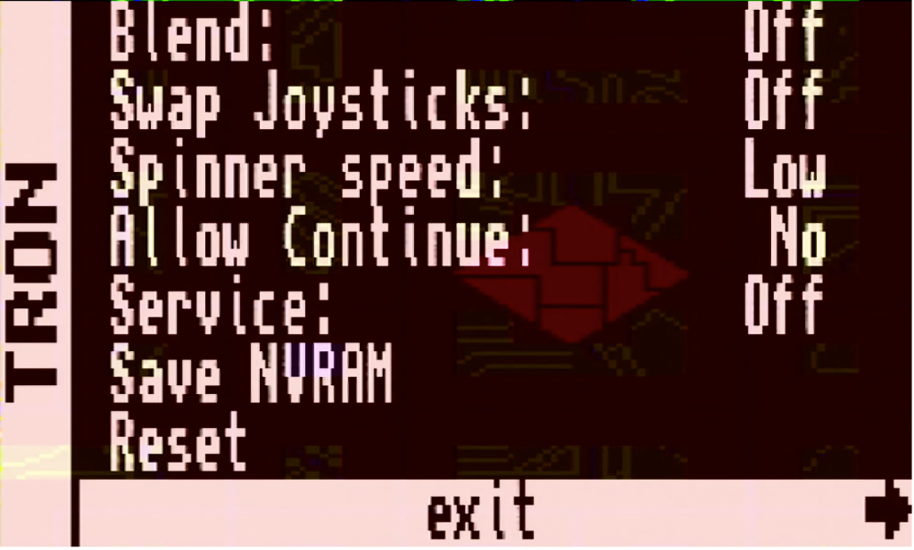
|===

Estas son las principales:

- `Rotate Controls`: Para girar el texto del menú de opciones, así como el comportamiento de los controles de dirección
- `Blend`: Para activar si se desea, un efecto de suavizado de la imagen
- `Swap Joysticks`: Para intercambiar los controles del jugador 1 y el jugador 2
- `Service`: Activa o desactiva el modo de servicio
- `Save NVRAM`: Para guardar el contenido de la NVRAM (récords de puntuación) en la tarjeta microSD
- `Reset`: Soft Reset (reinicia el Core)
- `Exit`: Cierra el menú de opciones

Además, aparecerán otras opciones para ver y modificar el estado de los https://es.wikipedia.org/wiki/Interruptor_DIP[interruptores DIP] que haya definidos en el fichero ARC cargado actualmente.

<<<

==== Midway MCR-3

https://www.system16.com/hardware.php?id=603[Midway MCR-3] es la tercera variante de la placa MCR de máquina recreativa, lanzada en 1983 por Bally Midway. En su período de vida, fueron lanzados 7 juegos para las distintas variantes del sistema.

Este core permite ejecutar ROM de varios juegos (consultar <<#_midway_mcr_3_hardware,la sección de referencias para más información>>).

La versión para neptUNO+ está basada en https://github.com/mist-devel/mist-binaries/tree/master/cores/arcade/Midway%20MCR%203[la implementación existente para MiST].

Algunas de las características del core son:

- Salida de video sólo VGA
- Soporte de mando real y mando emulado en teclado

===== Formato de Tarjeta microSD

Se debe utilizar una tarjeta microSD, con la primera partición en formato exFAT o FAT32, donde se hayan copiado los ficheros ARC y ROM correspondientes de los juegos.

Para <<#_mra_tool,crear los ficheros ROM y ARC>>, se pueden obtener los ficheros MRA correspondientes del https://github.com/mist-devel/mist-binaries/tree/master/cores/arcade/Midway%20MCR%203[repositorio de la versión original para MiST].

===== Controles

====== Teclas especiales y botones

Durante la ejecución del core:

- `F12` o botones `Start+Select` de un mando: mostrar el menú de control del core
- Teclas de cursor o el mando 1: Controles de dirección del jugador uno
- `Ctrl`, `Alt` y `Espacio` o botones `A`, `B`, `X` del mando 1: Botones 1, 2 y 3 del jugador uno
- `R`,`D`,`F`,`G` o mando 2: Movimiento del jugador dos
- `A`, `S` y `Q` o botones `A`, `B`, `X` del mando 2: Botones 1, 2 y 3 del jugador dos
- `1` y `2`: Iniciar partida 1 ó 2 jugadores
- `5` y `6`: Insertar una moneda

<<<

===== Guía básica

Al pulsar `F12`, se mostrará el menú con las distintas opciones del core. Se puede navegar utilizando las teclas de cursor. `Enter` selecciona un elemento.

[role="center",width="50%",cols="1a", frame=none, grid=none]
|===
|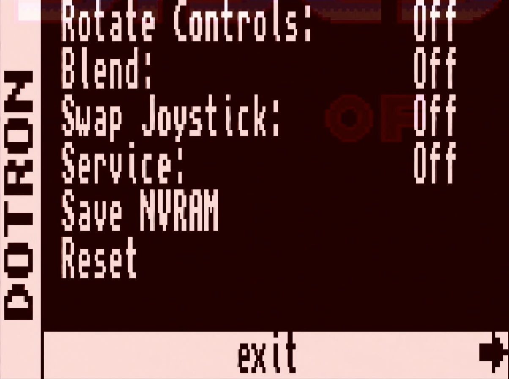
|===

Estas son las principales:

- `Rotate Controls`: Para girar el texto del menú de opciones, así como el comportamiento de los controles de dirección
- `Blend`: Para activar si se desea, un efecto de suavizado de la imagen
- `Swap Joysticks`: Para intercambiar los controles del jugador 1 y el jugador 2
- `Service`: Activa o desactiva el modo de servicio
- `Save NVRAM`: Para guardar el contenido de la NVRAM (récords de puntuación) en la tarjeta microSD
- `Reset`: Soft Reset (reinicia el Core)
- `Exit`: Cierra el menú de opciones

Además, aparecerán otras opciones para ver y modificar el estado de los https://es.wikipedia.org/wiki/Interruptor_DIP[interruptores DIP] que haya definidos en el fichero ARC cargado actualmente.

<<<

==== Namco Galaxian

https://es.wikipedia.org/wiki/Galaxian[Galaxian] es un videojuego de consola recreativa publicado en 1979 por Namco. La placa base fue reutilizada para otros videojuegos posteriores, como Azurian o Moon Cresta, por ejemplo.

Este core permite ejecutar ROM de varios juegos (consultar <<#_namco_galaxian_hardware,la sección de referencias para más información>>).

La versión para neptUNO+ está basada en https://github.com/Gehstock/Mist_FPGA_Cores/tree/master/Arcade_MiST/Namco%20Galaxian%20Hardware/Z80%20Based[la implementación existente para MiST].

Algunas de las características del core son:

- La salida de vídeo mantiene la rotación del original
- Salida de vídeo VGA
- Salida de vídeo RGB (utilizando el puerto VGA)
- Soporte de mando real y mando emulado en teclado

===== Formato de Tarjeta microSD

Se debe utilizar una tarjeta microSD, con la primera partición en formato exFAT o FAT32, donde se hayan copiado los ficheros ARC y ROM correspondientes de los juegos.

Para <<#_mra_tool,crear los ficheros ROM y ARC>>, se pueden obtener los ficheros MRA correspondientes del https://github.com/Gehstock/Mist_FPGA_Cores/tree/master/Arcade_MiST/Namco%20Galaxian%20Hardware/Z80%20Based[repositorio de la versión original para MiST].

===== Controles

====== Teclas especiales y botones

Durante la ejecución del core:

- `F12` o botones `Start+Select` de un mando: mostrar el menú de control del core
- Teclas de cursor o el mando 1: Controles de dirección
- `Ctrl`, o botón `A` del mando 1: Botón 1 del jugador uno
- `R`,`D`,`F`,`G` o mando 2: Movimiento del jugador dos
- `A` o botón `A` del mando 2: Botón 1 del jugador dos
- `1` y `2` o botón `L` de un mando: Iniciar partida jugador 1 o jugador 2
- `5` y `6` o botón `R` de un mando: Insertar una moneda

<<<

===== Guía básica

Al pulsar `F12`, se mostrará el menú con las distintas opciones del core. Se puede navegar utilizando las teclas de cursor. `Enter` selecciona un elemento.

[role="center",width="50%",cols="1a", frame=none, grid=none]
|===
|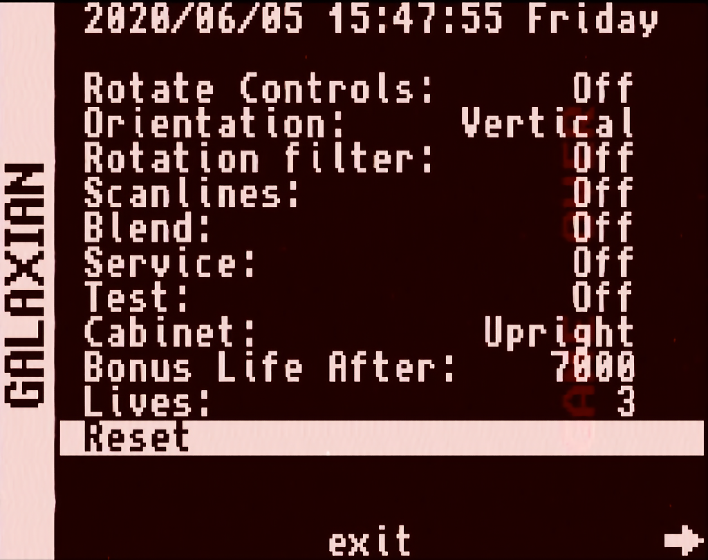
|===

Estas son las principales:

- `Rotate Controls`: Para girar el texto del menú de opciones, así como el comportamiento de los controles de dirección
- `Orientation`:  Define la orientación
- `Rotation Filter`: Define filtro de rotado
- `Scanlines`: Para añadir un efecto de líneas de exploración (sólo con salida VGA)
- `Blend`: Para activar si se desea, un efecto de suavizado de la imagen
- `Reset`: Soft Reset (reinicia el Core)
- `Exit`: Cierra el menú

Además, aparecerán otras opciones para ver y modificar el estado de los https://es.wikipedia.org/wiki/Interruptor_DIP[interruptores DIP] que haya definidos en el fichero ARC cargado actualmente.

<<<

==== Namco Pac-Man

https://es.wikipedia.org/wiki/Pac-Man[Namco Pac-Man] es un videojuego originalmente para máquina recreativa, de la empresa Namco y distribuido por Midway Games al mercado estadounidense a principios de los años 1980.

Este core permite ejecutar ROM de varios juegos (consultar <<#_namco_pac_man_hardware,la sección de referencias para más información>>).

La versión para neptUNO+ está basada en https://github.com/mist-devel/mist-binaries/tree/master/cores/arcade/Namco%20Pacman%20Hardware[la implementación existente para MiST].

Algunas de las características del core son:

- La salida de vídeo mantiene la rotación del original
- Salida de vídeo VGA
- Salida de vídeo RGB (utilizando el puerto VGA)
- Soporte de mando real y mando emulado en teclado

===== Formato de Tarjeta microSD

Se debe utilizar una tarjeta microSD, con la primera partición en formato exFAT o FAT32, donde se hayan copiado los ficheros ARC y ROM correspondientes de los juegos.

Para <<#_mra_tool,crear los ficheros ROM y ARC>>, se pueden obtener los ficheros MRA correspondientes del https://github.com/mist-devel/mist-binaries/tree/master/cores/arcade/Namco%20Pacman%20Hardware[repositorio de la versión original para MiST].

===== Controles

====== Teclas especiales y botones

Durante la ejecución del core:

- `F12` o botones `Start+Select` de un mando: mostrar el menú de control del core
- Teclas de cursor: Controles de dirección
- `Ctrl`: Botón 1 del jugador
- `1` ó `2`: Iniciar partida 1 ó 2 jugadores
- `5`: Insertar una moneda

<<<

===== Guía básica

Al pulsar `F12`, se mostrará el menú con las distintas opciones del core. Se puede navegar utilizando las teclas de cursor. `Enter` selecciona un elemento.

[role="center",width="50%",cols="1a", frame=none, grid=none]
|===
|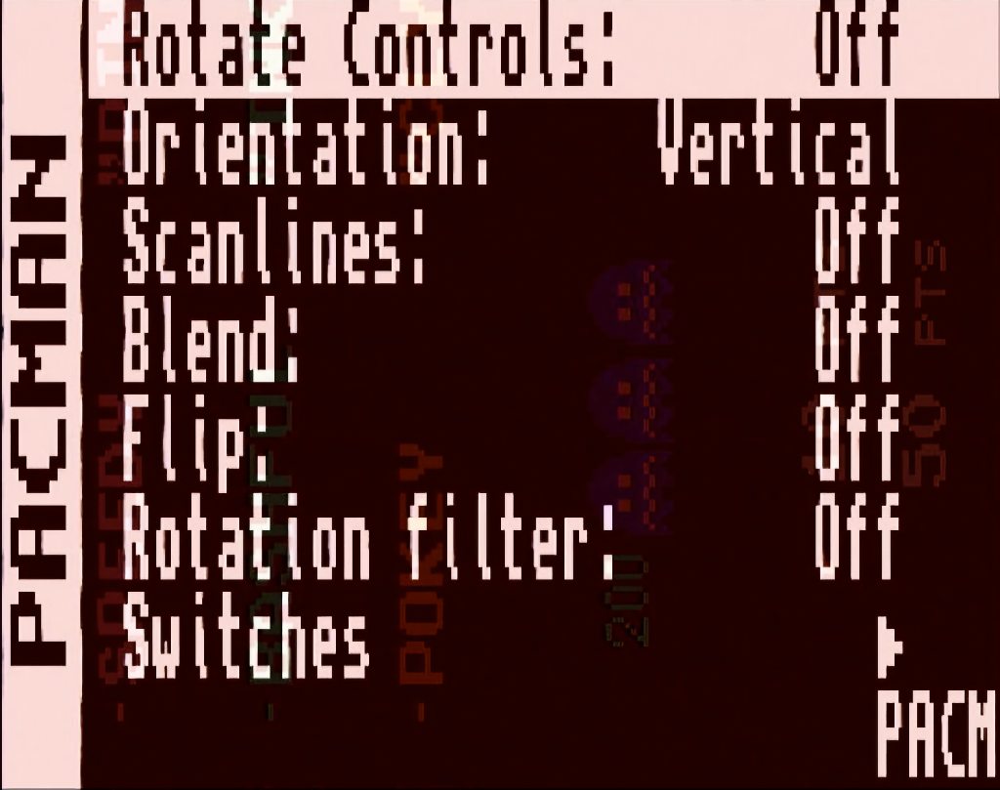
|===

Estas son las principales:

- `Rotate Controls`: Para girar el texto del menú de opciones, así como el comportamiento de los controles de dirección
- `Orientation`:  Define la orientación
- `Scanlines`: Para añadir un efecto de líneas de exploración (sólo con salida VGA)
- `Blend`: Activa o desactiva un modo de suavizad de los bordes de la imagen
- `Flip`: Para rotar 180º cómo se muestra la imagen en la pantalla
- `Rotation Filter`: Define filtro de rotado 
- `Switches`: Accede a ver y modificar el estado de los https://es.wikipedia.org/wiki/Interruptor_DIP[interruptores DIP] que haya definidos en el fichero ARC
- `Reset`: Soft Reset (reinicia el Core)
- `Exit`: Cierra el menú de opciones

<<<

==== Namco Rally-X

https://en.wikipedia.org/wiki/Rally-X[Namco Rally-X] es un videojuego de laberintos y conducción lanzado en 1980 por la empresa japonesa Namco.

Este core permite ejecutar ROM de varios juegos (consultar <<#_namco_rally_x_hardware,la sección de referencias para más información>>).

La versión para neptUNO+ está basada en https://github.com/mist-devel/mist-binaries/tree/master/cores/arcade/Namco%20Rally-X%20Hardware[la implementación existente para MiST].

Algunas de las características del core son:

- La salida de vídeo mantiene la rotación del original
- Salida de vídeo VGA
- Salida de vídeo RGB (utilizando el puerto VGA)
- Soporte de mando real y mando emulado en teclado

===== Formato de Tarjeta microSD

Se debe utilizar una tarjeta microSD, con la primera partición en formato exFAT o FAT32, donde se hayan copiado los ficheros ARC y ROM correspondientes de los juegos.

Para <<#_mra_tool,crear los ficheros ROM y ARC>>, se pueden obtener los ficheros MRA correspondientes del https://github.com/mist-devel/mist-binaries/tree/master/cores/arcade/Namco%20Rally-X%20Hardware[repositorio de la versión original para MiST].

===== Controles

====== Teclas especiales y botones

Durante la ejecución del core:

- `F12` o botones `Start+Select` de un mando: mostrar el menú de control del core
- Teclas de cursor: Controles de dirección
- `Ctrl`: Botón 1 del jugador
- `1` ó `2`: Iniciar partida 1 ó 2 jugadores
- `5` ó `6`: Insertar una moneda

<<<

===== Guía básica

Al pulsar `F12`, se mostrará el menú con las distintas opciones del core. Se puede navegar utilizando las teclas de cursor. `Enter` selecciona un elemento.

[role="center",width="50%",cols="1a", frame=none, grid=none]
|===
|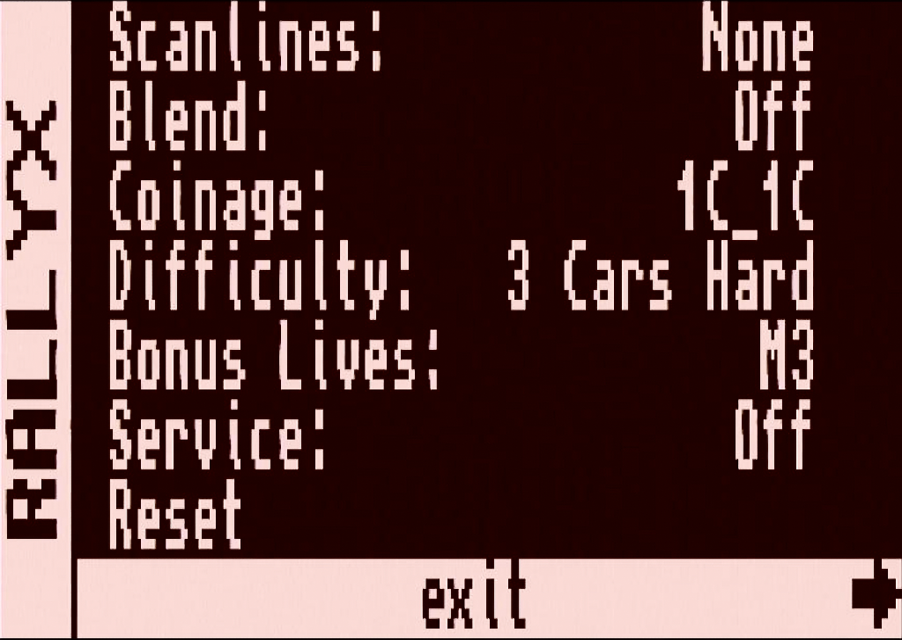
|===

Estas son las principales:

- `Rotate Controls`: Para girar el texto del menú de opciones, así como el comportamiento de los controles de dirección
- `Blend`: Para activar si se desea, un efecto de suavizado de la imagen
- `Scanlines`: Para añadir un efecto de líneas de exploración (sólo con salida VGA)
- `Service`: Activa o desactiva el modo de servicio
- `Reset`: Soft Reset (reinicia el Core)
- `Exit`: Cierra el menú de opciones

Además, aparecerán otras opciones para ver y modificar el estado de los https://es.wikipedia.org/wiki/Interruptor_DIP[interruptores DIP] que haya definidos en el fichero ARC cargado actualmente.

<<<

==== Namco Super Pac-Man

https://es.wikipedia.org/wiki/Super_Pac-Man[Namco Super Pac-Man] es la cuarta entrega de la famosa serie de videojuego Pac-Man desarrollada por Namco, lanzada en 1982 para máquinas recreativas

Este core permite ejecutar ROM de varios juegos (consultar <<#_namco_super_pac_man_hardware,la sección de referencias para más información>>).

La versión para neptUNO+ está basada en https://github.com/mist-devel/mist-binaries/tree/master/cores/arcade/Namco%20Super%20Pacman%20Hardware[la implementación existente para MiST].

Algunas de las características del core son:

- La salida de vídeo mantiene la rotación del original
- Salida de vídeo VGA
- Salida de vídeo RGB (utilizando el puerto VGA)
- Soporte de mando real y mando emulado en teclado

===== Formato de Tarjeta microSD

Se debe utilizar una tarjeta microSD, con la primera partición en formato exFAT o FAT32, donde se hayan copiado los ficheros ARC y ROM correspondientes de los juegos.

Para <<#_mra_tool,crear los ficheros ROM y ARC>>, se pueden obtener los ficheros MRA correspondientes del https://github.com/mist-devel/mist-binaries/tree/master/cores/arcade/Namco%20Super%20Pacman%20Hardware[repositorio de la versión original para MiST].

===== Controles

====== Teclas especiales y botones

Durante la ejecución del core:

- `F12` o botones `Start+Select` de un mando: mostrar el menú de control del core
- ...

<<<

===== Guía básica

Al pulsar `F12`, se mostrará el menú con las distintas opciones del core. Se puede navegar utilizando las teclas de cursor. `Enter` selecciona un elemento.

[role="center",width="50%",cols="1a", frame=none, grid=none]
|===
|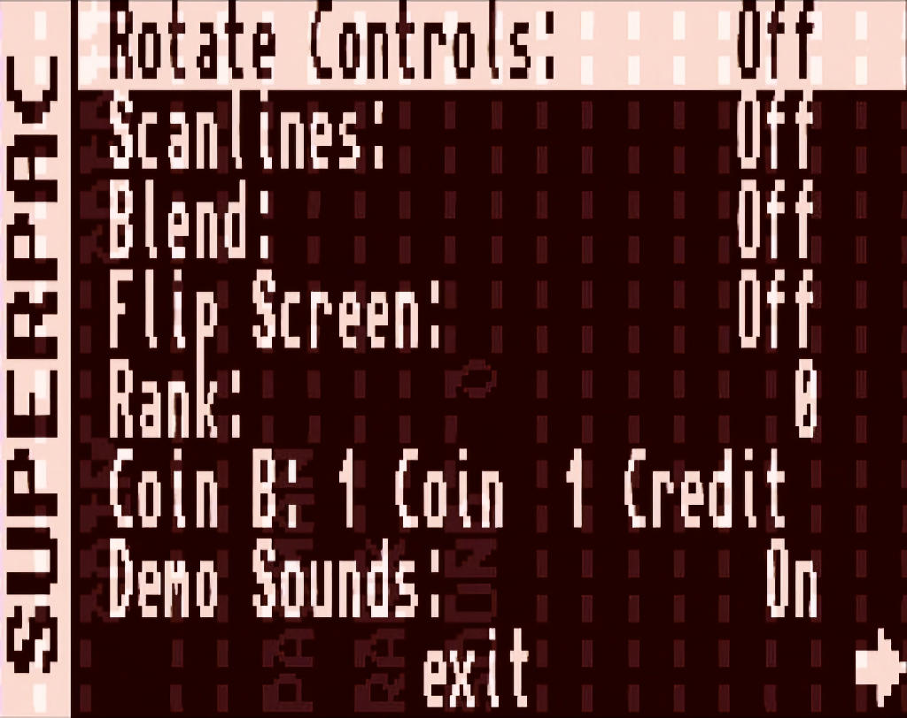
|===

Estas son las principales:

- `Rotate Controls`: Para girar el texto del menú de opciones, así como el comportamiento de los controles de dirección
- `Scanlines`: Para añadir un efecto de líneas de exploración (sólo con salida VGA)
- `Blend`: Para activar si se desea, un efecto de suavizado de la imagen
- `Flip Screen`: Para rotar 180º cómo se muestra la imagen en la pantalla
- `Service Mode`: Activa o desactiva el modo de servicio
- `Reset`: Soft Reset (reinicia el Core)
- `Exit`: Cierra el menú

Además, aparecerán otras opciones para ver y modificar el estado de los https://es.wikipedia.org/wiki/Interruptor_DIP[interruptores DIP] que haya definidos en el fichero ARC cargado actualmente.

<<<

==== Nichibutsu Galivan

https://en.wikipedia.org/wiki/Cosmo_Police_Galivan[Cosmo Police Galivan] es un videojuego de plataformas de 1985 desarrollado y publicado por Nichibutsu para salas recreativas. 

Este core implementa permite ejecutar ROM de varios juegos (consultar <<#_nichibutsu_galivan_hardware,la sección de referencias para más información>>).

La versión para neptUNO+ está basada en https://github.com/mist-devel/mist-binaries/tree/master/cores/arcade/Nichibutsu%20Galivan%20Hardware[la implementación existente para MiST].

Algunas de las características del core son:

- La salida de vídeo mantiene la rotación del original
- Salida de vídeo VGA
- Salida de vídeo RGB (utilizando el puerto VGA)
- Soporte de mando real y mando emulado en teclado.

===== Formato de Tarjeta microSD

Se debe utilizar una tarjeta microSD, con la primera partición en formato exFAT o FAT32, donde se hayan copiado los ficheros ARC y ROM correspondientes de los juegos.

Para <<#_mra_tool,crear los ficheros ROM y ARC>>, se pueden obtener los ficheros MRA correspondientes del https://github.com/mist-devel/mist-binaries/tree/master/cores/arcade/Nichibutsu%20Galivan%20Hardware[repositorio de la versión original para MiST].

===== Controles

====== Teclas especiales y botones

Durante la ejecución del core:

- `F12` o botones `Start+Select` de un mando: mostrar el menú de control del core
- Teclas de cursor o el mando: Controles de dirección del jugador
- `Ctrl`, `Alt` o botones `A`, `B` del mando: Botones 1, 2 del jugador
- `1` o `2`: Iniciar partida 1 ó 2 jugadores
- `5` y `6`: Insertar una moneda

<<<

===== Guía básica

Al pulsar `F12`, se mostrará el menú con las distintas opciones del core. Se puede navegar utilizando las teclas de cursor. `Enter` selecciona un elemento.

[role="center",width="50%",cols="1a", frame=none, grid=none]
|===
|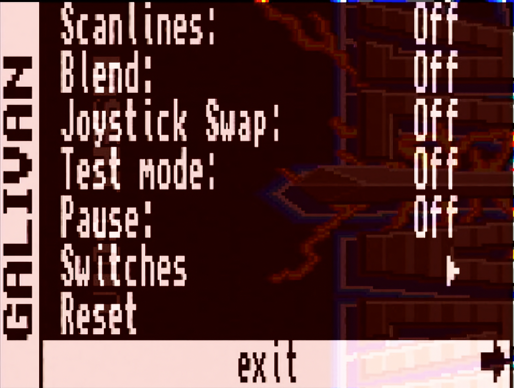
|===

Estas son las principales:

- `Rotate Controls`: Para girar el texto del menú de opciones, así como el comportamiento de los controles de dirección
- `Scanlines`: Para añadir un efecto de líneas de exploración (sólo con salida VGA)
- `Blend`: Para activar si se desea, un efecto de suavizado de la imagen
- `Joystick Swap`: Para intercambiar los controles del jugador 1 y el jugador 2
- `Test Mode` Activar o desactivar el modo de prueba
- `Pause`: Para detener el core
- `Switches`: Accede a ver y modificar el estado de los https://es.wikipedia.org/wiki/Interruptor_DIP[interruptores DIP] que haya definidos en el fichero ARC
- `Reset`: Soft Reset (reinicia el Core)
- `Exit`: Cierra el menú de opciones

<<<

==== Nichibutsu M68000

Nichibutsu M68000 es una placa de máquina recreativa lanzada en 1985 por Nichibutsu, originalmente para el juego https://es.wikipedia.org/wiki/Terra_Cresta[Terra Cresta].

Este core permite ejecutar ROM de varios juegos (consultar <<#_nichibutsu_m68000_hardware,la sección de referencias para más información>>).

La versión para neptUNO+ está basada en https://github.com/mist-devel/mist-binaries/tree/master/cores/arcade/Nichibutsu%20M68000[la implementación existente para MiST].

Algunas de las características del core son:

- La salida de vídeo mantiene la rotación del original
- Salida de vídeo VGA
- Salida de vídeo RGB (utilizando el puerto VGA)
- Soporte de mando real y mando emulado en teclado.

===== Formato de Tarjeta microSD

Se debe utilizar una tarjeta microSD, con la primera partición en formato exFAT o FAT32, donde se hayan copiado los ficheros ARC y ROM correspondientes de los juegos.

Para <<#_mra_tool,crear los ficheros ROM y ARC>>, se pueden obtener los ficheros MRA correspondientes del https://github.com/mist-devel/mist-binaries/tree/master/cores/arcade/Nichibutsu%20M68000[repositorio de la versión original para MiST].

===== Controles

====== Teclas especiales y botones

Durante la ejecución del core:

- `F12` o botones `Start+Select` de un mando: mostrar el menú de control del core
- Teclas de cursor o el mando 1: Controles de dirección del jugador uno
- `Ctrl`, `Alt` y `Espacio` o botones `A`, `B`, `X` del mando 1: Botones 1, 2 y 3 del jugador uno
- `R`,`D`,`F`,`G` o mando 2: Movimiento del jugador dos
- `A`, `S` y `Q` o botones `A`, `B`, `X` del mando 2: Botones 1, 2 y 3 del jugador dos
- `1` y `2`: Iniciar partida 1 ó 2 jugadores
- `5` y `6`: Insertar una moneda

Notar que, para algunas ROM, los controles pueden estar cambiados o mezclados. Por ejemplo, para Crazy Climber 2, se utilizan parte de los controles de movimiento del jugador uno y parte de los controles del jugador dos.

<<<

===== Guía básica

Al pulsar `F12`, se mostrará el menú con las distintas opciones del core. Se puede navegar utilizando las teclas de cursor. `Enter` selecciona un elemento.

[role="center",width="50%",cols="1a", frame=none, grid=none]
|===
|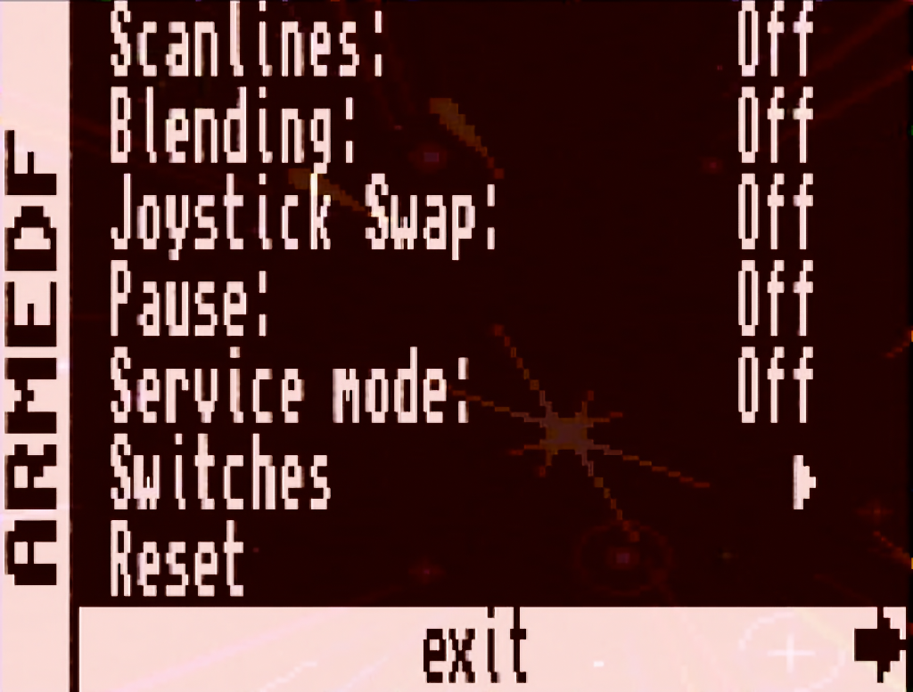
|===

Estas son las principales:

- `Rotate Controls`: Para girar el texto del menú de opciones, así como el comportamiento de los controles de dirección
- `Scanlines`: Para añadir un efecto de líneas de exploración (sólo con salida VGA)
- `Blending`: Para activar si se desea, un efecto de suavizado de la imagen
- `Joystick Swap`: Para intercambiar los controles del jugador 1 y el jugador 2
- `Pause`: Para detener el core
- `Service Mode`: Activa o desactiva el modo de servicio
- `Switches`: Accede a ver y modificar el estado de los https://es.wikipedia.org/wiki/Interruptor_DIP[interruptores DIP] que haya definidos en el fichero ARC
- `Reset`: Soft Reset (reinicia el Core)
- `Exit`: Cierra el menú de opciones

<<<

==== Nintendo Radar Scope

https://es.wikipedia.org/wiki/Radar_Scope[Nintendo Radar Scope] es un juego de máquina recreativa de 1980 desarrollado y publicado por Nintendo.

Este core permite ejecutar ROM de varios juegos (consultar <<#_nintendo_radar_scope_hardware,la sección de referencias para más información>>).

La versión para neptUNO+ está basada en https://github.com/mist-devel/mist-binaries/tree/master/cores/arcade/Nintendo%20Radar%20Scope%20Hardware[la implementación existente para MiST].

Algunas de las características del core son:

- La salida de vídeo mantiene la rotación del original
- Salida de vídeo VGA
- Salida de vídeo RGB (utilizando el puerto VGA)
- Soporte de mando real y mando emulado en teclado.

===== Formato de Tarjeta microSD

Se debe utilizar una tarjeta microSD, con la primera partición en formato exFAT o FAT32, donde se hayan copiado los ficheros ARC y ROM correspondientes de los juegos.

Para <<#_mra_tool,crear los ficheros ROM y ARC>>, se pueden obtener los ficheros MRA correspondientes del https://github.com/mist-devel/mist-binaries/tree/master/cores/arcade/Nintendo%20Radar%20Scope%20Hardware[repositorio de la versión original para MiST].
crso

===== Controles

====== Teclas especiales y botones

Durante la ejecución del core:

- `F12` o botones `Start+Select` de un mando: mostrar el menú de control del core
- ...

<<<

===== Guía básica

Al pulsar `F12`, se mostrará el menú con las distintas opciones del core. Se puede navegar utilizando las teclas de cursor. `Enter` selecciona un elemento.

[role="center",width="50%",cols="1a", frame=none, grid=none]
|===
|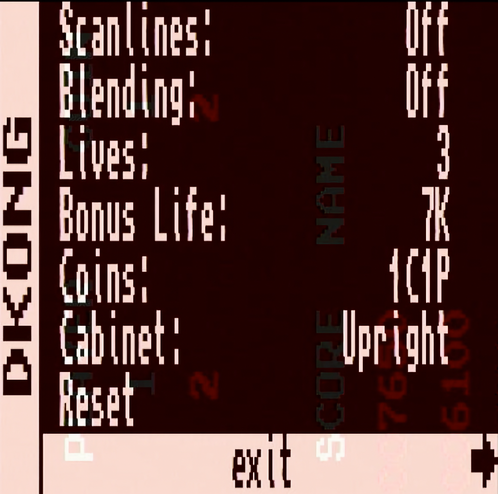
|===

Estas son las principales:

- `Rotate Controls`: Para girar el texto del menú de opciones, así como el comportamiento de los controles de dirección
- `Scanlines`: Para añadir un efecto de líneas de exploración (sólo con salida VGA)
- `Blending`: Activa o desactiva un modo de suavizad de los bordes de la imagen
- `Reset`: Soft Reset (reinicia el Core)
- `Exit`: Cierra el menú de opciones

Además, aparecerán otras opciones para ver y modificar el estado de los https://es.wikipedia.org/wiki/Interruptor_DIP[interruptores DIP] que haya definidos en el fichero ARC cargado actualmente.

<<<

==== Pengo

https://es.wikipedia.org/wiki/Pengo_(videojuego)[Pengo] es un videojuego para máquinas recreativas publicado en 1982 por Sega.

La versión para neptUNO+ está basada en https://github.com/MiSTer-devel/Arcade-Pengo_MiSTer[la implementación existente para MiSTer].

Algunas de las características del core son:

- La salida de vídeo mantiene la rotación del original
- Salida de vídeo VGA
- Salida de vídeo RGB (utilizando el puerto VGA)
- Soporte de mando real y mando emulado en teclado.

===== Formato de Tarjeta microSD

Se debe utilizar una tarjeta microSD, con la primera partición en formato exFAT o FAT32, donde se hayan copiado los ficheros ARC y ROM correspondientes de los juegos.

Para <<#_mra_tool,crear los ficheros ROM y ARC>>, se pueden obtener los ficheros MRA correspondientes del https://github.com/MiSTer-devel/Arcade-Pengo_MiSTer/tree/master/releases[repositorio de la versión original para MiSTer].

===== Controles

====== Teclas especiales y botones

Durante la ejecución del core:

- `F12` o botones `Start+Select` de un mando: mostrar el menú de control del core
- Teclas de cursor o el mando 1: Controles de dirección del jugador
- `Ctrl`o botón `A` del mando 1: Botones del jugador
- `1` y `2` o botón `L` de un mando: Iniciar partida 1 ó 2 jugadores
- `5` y `6` o botón `R` de un mando: Insertar una moneda

<<<

===== Guía básica

Al pulsar `F12`, se mostrará el menú con las distintas opciones del core. Se puede navegar utilizando las teclas de cursor. `Enter` selecciona un elemento.

[role="center",width="50%",cols="1a", frame=none, grid=none]
|===
|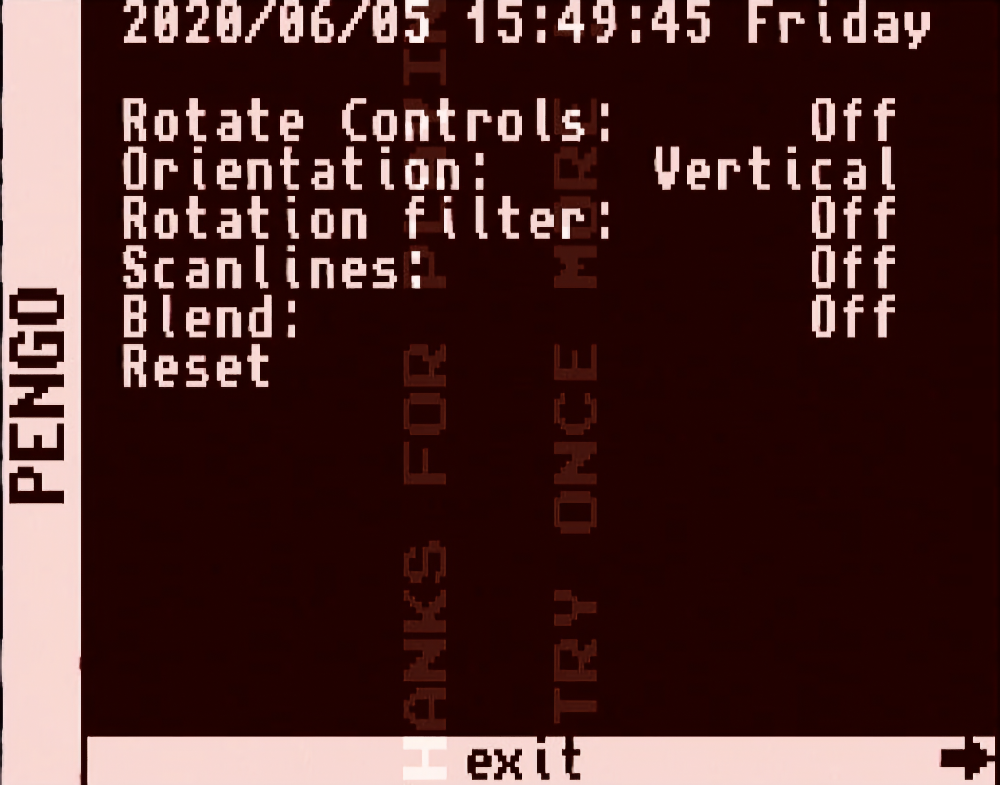
|===

Estas son las principales:

- `Rotate Controls`: Para girar el texto del menú de opciones, así como el comportamiento de los controles de dirección
- `Orientation`:  Define la orientación
- `Rotation Filter`: Define filtro de rotado 
- `Scanlines`: Para añadir un efecto de líneas de exploración (sólo con salida VGA)
- `Blend`: Activa o desactiva un modo de suavizad de los bordes de la imagen
- `Reset`: Soft Reset (reinicia el Core)
- `Exit`: Cierra el menú de opciones

<<<

==== Phoenix

https://es.wikipedia.org/wiki/Phoenix_(videojuego)[Phoenix] es un videojuego de máquina recreativa diseñado por la empresa Amstar Electronics, lanzado en 1980.​

Este core permite ejecutar ROM de varios juegos (consultar <<#_phoenix_hardware,la sección de referencias para más información>>).

La versión para neptUNO+ está basada en https://github.com/mist-devel/mist-binaries/tree/master/cores/arcade/Phoenix%20Hardware[la implementación existente para MiST].

Algunas de las características del core son:

- La salida de vídeo mantiene la rotación del original
- Salida de vídeo VGA
- Salida de vídeo RGB (utilizando el puerto VGA)
- Soporte de mando real y mando emulado en teclado.

===== Formato de Tarjeta microSD

Se debe utilizar una tarjeta microSD, con la primera partición en formato exFAT o FAT32, donde se hayan copiado los ficheros ARC y ROM correspondientes de los juegos.

Para <<#_mra_tool,crear los ficheros ROM y ARC>>, se pueden obtener los ficheros MRA correspondientes del https://github.com/mist-devel/mist-binaries/tree/master/cores/arcade/Phoenix%20Hardware[repositorio de la versión original para MiST].

===== Controles

====== Teclas especiales y botones

Durante la ejecución del core:

- `F12` o botones `Start+Select` de un mando: mostrar el menú de control del core
- Teclas de cursor o el mando 1: Controles de dirección del jugador
- `Ctrl`, `Alt` o botones `A`, `B` del mando 1: Botones 1, 2 del jugador
- `1` y `2`: Iniciar partida 1 ó 2 jugadores
- `5` y `6`: Insertar una moneda

<<<

===== Guía básica

Al pulsar `F12`, se mostrará el menú con las distintas opciones del core. Se puede navegar utilizando las teclas de cursor. `Enter` selecciona un elemento.

[role="center",width="50%",cols="1a", frame=none, grid=none]
|===
|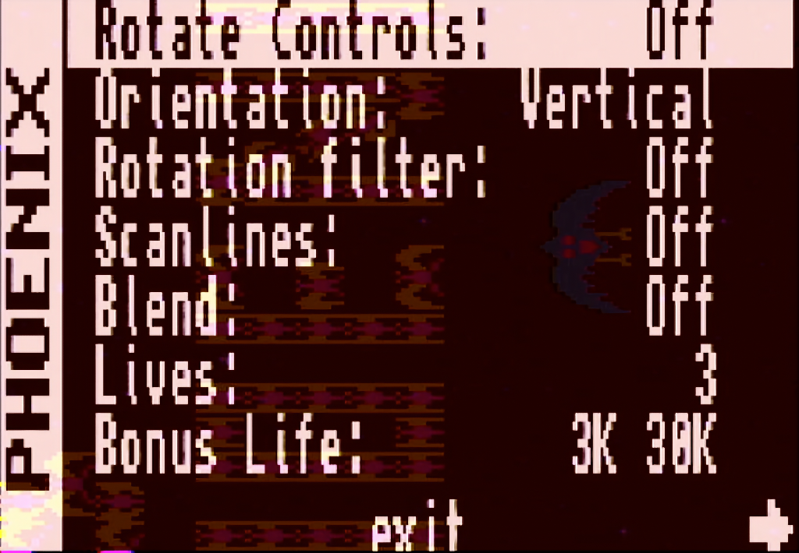
|===

Estas son las principales:

- `Rotate Controls`: Para girar el texto del menú de opciones, así como el comportamiento de los controles de dirección
- `Orientation`:  Define la orientación
- `Rotation Filter`: Define filtro de rotado 
- `Scanlines`: Para añadir un efecto de líneas de exploración (sólo con salida VGA)
- `Blend`: Activa o desactiva un modo de suavizad de los bordes de la imagen
- `Reset`: Soft Reset (reinicia el Core)
- `Exit`: Cierra el menú de opciones

Además, aparecerán otras opciones para ver y modificar el estado de los https://es.wikipedia.org/wiki/Interruptor_DIP[interruptores DIP] que haya definidos en el fichero ARC cargado actualmente.

<<<

==== Sega Bank Panic

https://en.wikipedia.org/wiki/Bank_Panic[Bank Panic] un videojuego publicado por Sega en 1984 para salas recreativas. En Norteamérica, fue distribuido por Bally Midway.

Este core permite ejecutar ROM de varios juegos (consultar <<#_sega_bank_panic_hardware,la sección de referencias para más información>>).

La versión para neptUNO+ está basada en https://github.com/mist-devel/mist-binaries/tree/master/cores/arcade/Sega%20Bank%20Panic%20Hardware[la implementación existente para MiST].

Algunas de las características del core son:

- La salida de vídeo mantiene la rotación del original
- Salida de vídeo VGA
- Salida de vídeo RGB (utilizando el puerto VGA)
- Soporte de mando real y mando emulado en teclado.

===== Formato de Tarjeta microSD

Se debe utilizar una tarjeta microSD, con la primera partición en formato exFAT o FAT32, donde se hayan copiado los ficheros ARC y ROM correspondientes de los juegos.

Para <<#_mra_tool,crear los ficheros ROM y ARC>>, se pueden obtener los ficheros MRA correspondientes del https://github.com/mist-devel/mist-binaries/tree/master/cores/arcade/Sega%20Bank%20Panic%20Hardware[repositorio de la versión original para MiST].

===== Controles

====== Teclas especiales y botones

Durante la ejecución del core:

- `F12` o botones `Start+Select` de un mando: mostrar el menú de control del core
- Teclas de cursor o el mando 1: Controles de dirección del jugador
- `Ctrl`, `Alt` y `Espacio` o botones `A`, `B` y `Select` del mando 1: Botones 1, 2 y 3 del jugador
- `1` ó `2`: Iniciar partida 1 ó 2 jugadores
- `5` y `6`: Insertar una moneda

<<<

===== Guía básica

Al pulsar `F12`, se mostrará el menú con las distintas opciones del core. Se puede navegar utilizando las teclas de cursor. `Enter` selecciona un elemento.

[role="center",width="50%",cols="1a", frame=none, grid=none]
|===
|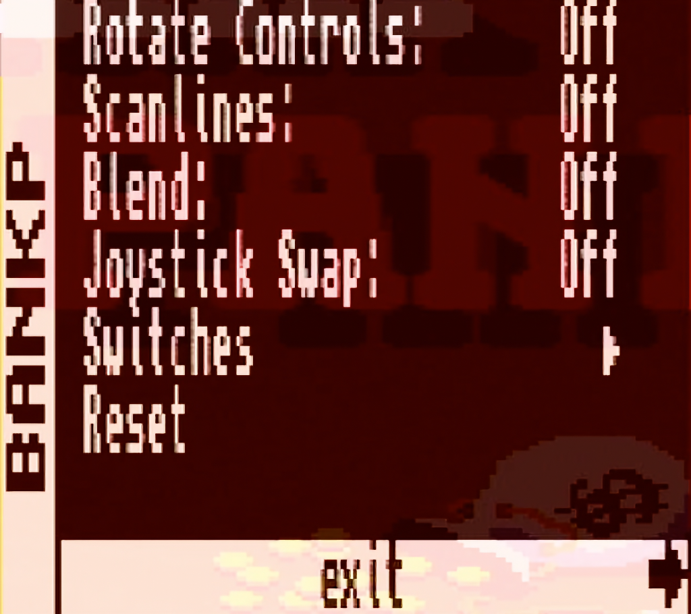
|===

Estas son las principales:

- `Rotate Controls`: Para girar el texto del menú de opciones, así como el comportamiento de los controles de dirección
- `Scanlines`: Para añadir un efecto de líneas de exploración (sólo con salida VGA)
- `Blend`: Para activar si se desea, un efecto de suavizado de la imagen
- `Joystick Swap`: Para intercambiar los controles del jugador 1 y el jugador 2
- `Switches`: Accede a ver y modificar el estado de los https://es.wikipedia.org/wiki/Interruptor_DIP[interruptores DIP] que haya definidos en el fichero ARC
- `Reset`: Soft Reset (reinicia el Core)
- `Exit`: Cierra el menú de opciones

<<<

==== Sega System 1

La https://es.wikipedia.org/wiki/Sega_System_1[Sega System 1] es una placa arcade producida por Sega entre 1983 y 1987. 

Este core permite ejecutar ROM de varios juegos (consultar <<#_sega_system_1_hardware,la sección de referencias para más información>>).

La versión para neptUNO+ está basada en https://github.com/mist-devel/mist-binaries/tree/master/cores/arcade/Sega%20System%201%20Hardware[la implementación existente para MiST].

Algunas de las características del core son:

- La salida de vídeo mantiene la rotación del original
- Salida de vídeo VGA
- Salida de vídeo RGB (utilizando el puerto VGA)
- Soporte de mando real y mando emulado en teclado.

===== Formato de Tarjeta microSD

Se debe utilizar una tarjeta microSD, con la primera partición en formato exFAT o FAT32, donde se hayan copiado los ficheros ARC y ROM correspondientes de los juegos.

Para <<#_mra_tool,crear los ficheros ROM y ARC>>, se pueden obtener los ficheros MRA correspondientes del https://github.com/mist-devel/mist-binaries/tree/master/cores/arcade/Sega%20System%201%20Hardware[repositorio de la versión original para MiST].

===== Controles

====== Teclas especiales y botones

Durante la ejecución del core:

- `F12` o botones `Start+Select` de un mando: mostrar el menú de control del core
- Teclas de cursor o el mando 1: Controles de dirección del jugador
- `Ctrl`, `Alt` o botones `A`, `B` del mando 1: Botones 1, 2 del jugador
- `1` ó `2`: Iniciar partida 1 ó 2 jugadores
- `5`: Insertar una moneda

Además, aparecerán otras opciones para ver y modificar el estado de los https://es.wikipedia.org/wiki/Interruptor_DIP[interruptores DIP] que haya definidos en el fichero ARC cargado actualmente.

<<<

===== Guía básica

Al pulsar `F12`, se mostrará el menú con las distintas opciones del core. Se puede navegar utilizando las teclas de cursor. `Enter` selecciona un elemento.

[role="center",width="50%",cols="1a", frame=none, grid=none]
|===
|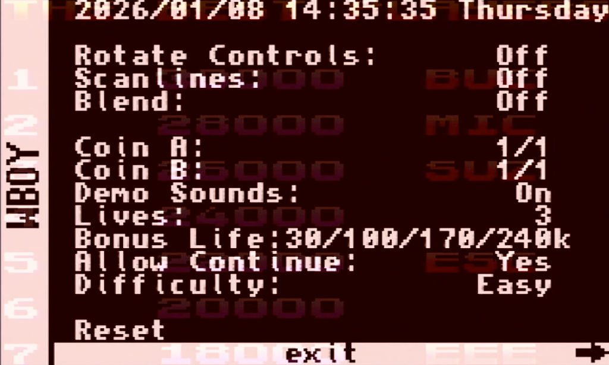
|===

Estas son las principales:

- `Load ROM`: Para cargar un archivo de ROM alternativo
- `Rotate Controls`: Para girar el texto del menú de opciones, así como el comportamiento de los controles de dirección
- `Scanlines`: Para añadir un efecto de líneas de exploración (sólo con salida VGA)
- `Blend`: Para activar si se desea, un efecto de suavizado de la imagen
- `Reset`: Soft Reset (reinicia el Core)
- `Exit`: Cierra el menú de opciones

<<<

==== SNK M68000

https://es.wikipedia.org/wiki/SNK_68000_Based_Hardware[Placa de sistema para máquinas recreativas] fabricada por SNK en 1986.

Este core permite ejecutar ROM de varios juegos (consultar <<#_snk_m68000_hardware,la sección de referencias para más información>>).

La versión para neptUNO+ está basada en la https://github.com/va7deo/SNK68[versión original para MiSTer].

Algunas de las características del core son:

- La salida de vídeo mantiene la rotación del original
- Salida de vídeo VGA
- Salida de vídeo RGB (utilizando el puerto VGA)
- Soporte de mando real y mando emulado en teclado

===== Formato de Tarjeta microSD

Se debe utilizar una tarjeta microSD, con la primera partición en formato exFAT o FAT32, donde se hayan copiado los ficheros ARC y ROM correspondientes de los juegos.

Para <<#_mra_tool,crear los ficheros ROM y ARC>>, se pueden obtener los ficheros MRA correspondientes del https://github.com/gyurco/Mist_FPGA/tree/master/Arcade_MiST/SNK%20M68000%20Harware/SNK68/meta[repositorio de la versión del core para Mist].

===== Controles

====== Teclas especiales y botones

Durante la ejecución del core:

- `F12` o botones `Start+Select` de un mando: mostrar el menú de control del core
- Teclas de cursor o el mando 1: Controles de dirección del jugador uno
- `Ctrl`, `Alt` o botones `A`, `B` del mando 1: Botones 1, 2 del jugador uno
- `R`,`D`,`F`,`G` o mando 2: Movimiento del jugador dos
- `A`, `S` o botones `A`, `B` del mando 2: Botones 1, 2 del jugador dos
- `1` y `2` o botón `X` de un mando: Iniciar partida jugador 1 o jugador 2
- `5` y `6` o botón `R` o `L` de un mando: Insertar una moneda
- Botón `L2` de un mando: Pausa

<<<

===== Guía básica

Al pulsar `F12`, se mostrará el menú con las distintas opciones del core. Se puede navegar utilizando las teclas de cursor. `Enter` selecciona un elemento.

[role="center",width="50%",cols="1a", frame=none, grid=none]
|===
|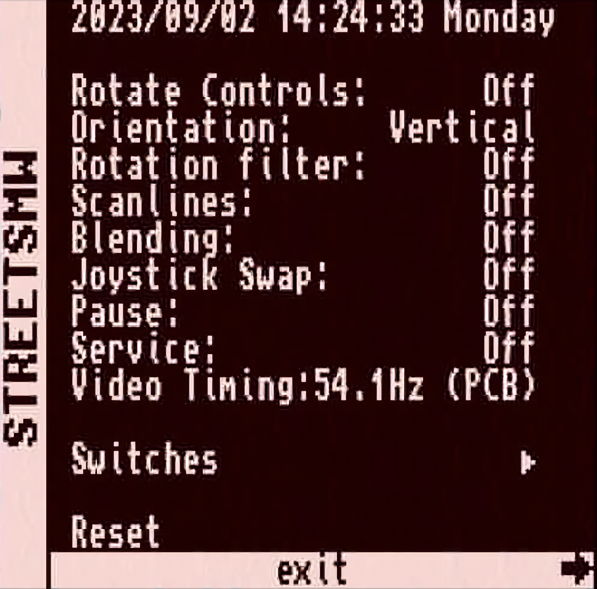
|===

- `Rotate Controls`: Para girar el texto del menú de opciones, así como el comportamiento de los controles de dirección
- `Orientation`:  Define la orientación
- `Rotation Filter`: Define filtro de rotado 
- `Scanlines`: Para añadir un efecto de líneas de exploración (sólo con salida VGA)
- `Blending`: Activa o desactiva un modo de suavizad de los bordes de la imagen
- `Joystick Swap`: Para intercambiar los controles del jugador 1 y el jugador 2
- `Pause`: Para detener el core
- `Service`: Activa o desactiva el modo de servicio
- `Video Timing`: Permite cambiar la frecuencia usada para la señal de vídeo
- `Switches`: Accede a ver y modificar el estado de los https://es.wikipedia.org/wiki/Interruptor_DIP[interruptores DIP] que haya definidos en el fichero ARC
- `Reset`: Soft Reset (reinicia el Core)
- `Exit`: Cierra el menú de opciones

<<<

==== SonSon

https://en.wikipedia.org/wiki/SonSon[SonSon] es un videojuego de plataformas de 1984 desarrollado y publicado por Capcom para salas recreativas.

La versión para neptUNO+ está basada en https://github.com/MikeS11/Arcade-Sonson_MiSTer[la implementación existente para MiSTer].

Algunas de las características del core son:

- Salida de vídeo VGA
- Salida de vídeo RGB (utilizando el puerto VGA)
- Soporte de mando real y mando emulado en teclado.

===== Formato de Tarjeta microSD

Se debe utilizar una tarjeta microSD, con la primera partición en formato exFAT o FAT32, donde se hayan copiado los ficheros ARC y ROM correspondientes del juego.

Para <<#_mra_tool,crear los ficheros ROM y ARC>>, se puede obtener el fichero MRA correspondiente del https://github.com/MikeS11/Arcade-Sonson_MiSTer/tree/main/releases[repositorio de la versión original para MiSTer].

===== Controles

====== Teclas especiales y botones

Durante la ejecución del core:

- `F12` o botones `Start+Select` de un mando: mostrar el menú de control del core
- Teclas de cursor o el mando 1: Controles de dirección del jugador
- `Ctrl` o botón `A`, del mando 1: BotBotón 1 del jugador
- `1` ó `2`: Iniciar partida 1 ó 2 jugadores
- `5` ó `6`: Insertar una moneda

<<<

===== Guía básica

Al pulsar `F12`, se mostrará el menú con las distintas opciones del core. Se puede navegar utilizando las teclas de cursor. `Enter` selecciona un elemento.

[role="center",width="50%",cols="1a", frame=none, grid=none]
|===
|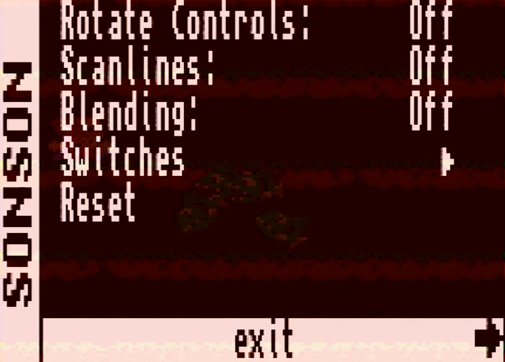
|===

Estas son las principales:

- `Rotate Controls`: Para girar el texto del menú de opciones, así como el comportamiento de los controles de dirección
- `Scanlines`: Para añadir un efecto de líneas de exploración (sólo con salida VGA)
- `Blending`: Para activar si se desea, un efecto de suavizado de la imagen
- `Switches`: Accede a ver y modificar el estado de los https://es.wikipedia.org/wiki/Interruptor_DIP[interruptores DIP] que haya definidos en el fichero ARC
- `Reset`: Soft Reset (reinicia el Core)
- `Exit`: Cierra el menú de opciones

<<<

==== Star Force (Beta)

https://es.wikipedia.org/wiki/Star_Force_(1984)[Star Force] lanzado en Norteamérica por Video Ware como Mega Force, es un juego de máquina recreativa publicado en 1984 por Tehkan.

Este core permite ejecutar ROM de varios juegos (consultar <<#_star_force_hardware,la sección de referencias para más información>>).

La versión para neptUNO+ está basada en https://github.com/madoov/MiSTer-StarForce/tree/master[la implementación existente para MiSTer].

Algunas de las características del core son:

- Salida de vídeo sólo RGB (utilizando el puerto VGA)
- Soporte de mando real y mando emulado en teclado

===== Formato de Tarjeta microSD

Se debe utilizar una tarjeta microSD, con la primera partición en formato exFAT o FAT32, donde se hayan copiado los ficheros ARC y ROM correspondientes de los juegos.

Para <<#_mra_tool,crear los ficheros ROM y ARC>>, se pueden obtener los ficheros MRA correspondientes del https://github.com/madoov/MiSTer-StarForce/tree/master/releases[repositorio de la versión original para MiSTer].

===== Controles

====== Teclas especiales y botones

Durante la ejecución del core:

- Teclas de cursor: Controles de dirección del jugador
- `Z`: Botón 1 del jugador
- `1`: Iniciar partida
- `5`: Insertar una moneda

===== Guía básica

En el momento de escribir este manual, este core se encontraba aún en pruebas, por lo que no tiene aún todas la funciones. Por ejemplo, al pulsar `F12`, no se muestra aún el menú con las distintas opciones del core.

<<<

[%always]
<<<

==== Taito Arkanoid

https://es.wikipedia.org/wiki/Arkanoid[Arkanoid] Arkanoid es un videojuego de máquina recreativa desarrollado por Taito en 1986. Está basado en Breakout de Atari.

La versión para neptUNO+ está basada en https://github.com/mist-devel/mist-binaries/tree/master/cores/arcade/Taito%20Arkanoid[la implementación existente para MiST].

Algunas de las características del core son:

- La salida de vídeo mantiene la rotación del original
- Salida de vídeo VGA
- Salida de vídeo RGB (utilizando el puerto VGA)
- Soporte de mando real y mando emulado en teclado

===== Formato de Tarjeta microSD

Se debe utilizar una tarjeta microSD, con la primera partición en formato exFAT o FAT32, donde se hayan copiado los ficheros ARC y ROM correspondientes de los juegos.

Para <<#_mra_tool,crear los ficheros ROM y ARC>>, se pueden obtener los ficheros MRA correspondientes del https://github.com/mist-devel/mist-binaries/tree/master/cores/arcade/Taito%20Arkanoid[repositorio de la versión original para MiST].

===== Controles

====== Teclas especiales y botones

Durante la ejecución del core:

- `F12` o botones `Start+Select` de un mando: mostrar el menú de control del core
- Teclas de cursor o el mando 1: Controles de dirección del jugador
- `Ctrl` o botón `A`, del mando 1: BotBotón 1 del jugador
- `1` ó `2`: Iniciar partida 1 ó 2 jugadores
- `5` ó `6`: Insertar una moneda

<<<

===== Guía básica

Al pulsar `F12`, se mostrará el menú con las distintas opciones del core. Se puede navegar utilizando las teclas de cursor. `Enter` selecciona un elemento.

[role="center",width="50%",cols="1a", frame=none, grid=none]
|===
|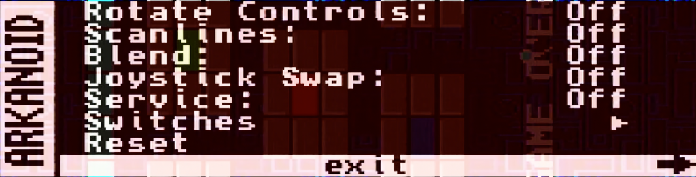
|===

Estas son las principales:

- `Rotate Controls`: Para girar el texto del menú de opciones, así como el comportamiento de los controles de dirección
- `Scanlines`: Para añadir un efecto de líneas de exploración (sólo con salida VGA)
- `Blend`: Para activar si se desea, un efecto de suavizado de la imagen
- `Joystick Swap`: Para intercambiar los controles del jugador 1 y el jugador 2
- `Service`: Activa o desactiva el modo de servicio
- `Switches`: Accede a ver y modificar el estado de los https://es.wikipedia.org/wiki/Interruptor_DIP[interruptores DIP] que haya definidos en el fichero ARC
- `Reset`: Soft Reset (reinicia el Core)
- `Exit`: Cierra el menú de opciones

<<<

==== Tehkan Bomb Jack

https://es.wikipedia.org/wiki/Bomb_Jack[Bomb Jack] es un videojuego de plataformas creado por la empresa Tehkan (después conocida como Tecmo) y publicado en 1984 para máquinas recreativas

La versión para neptUNO+ está basada en https://gitlab.com/victor.trucco/Multicore/-/tree/master/Arcades/Tehkan%20Bombjack%20Hardware/BombJack?[la implementación existente para Multicore], basada a su vez en https://github.com/d18c7db/bombjack-fpga[la versión original de d18c7db].

Algunas de las características del core son:

- La salida de vídeo mantiene la rotación del original
- Salida de video VGA
- Salida de vídeo RGB (utilizando el puerto VGA)
- Soporte de mando real y mando emulado en teclado

===== Formato de Tarjeta microSD

Se debe utilizar una tarjeta microSD, con la primera partición en formato exFAT o FAT32, donde se haya copiado el fichero ROM correspondiente del juego.

Se pueden obtener dicho fichero del https://gitlab.com/victor.trucco/Multicore/-/blob/d44ce03851c9b29fd53706af14da9b3b976a4222/Arcades/Bomb%20Jack/Release/BOMBJACK.ROM[repositorio de la versión original para Multicore].

===== Controles

====== Teclas especiales y botones

Durante la ejecución del core:

- `F12` o botones `Start+Select` de un mando: mostrar el menú de control del core
- Teclas de cursor o controles de un mando: Controles de dirección
- `Ctrl` o botón `A` de un mando: Botón de salto
- `1` ó `2`: Iniciar partida 1 ó 2 jugadores
- `5` y `6`: Insertar una moneda

<<<

===== Guía básica

Al pulsar `F12`, se mostrará el menú con las distintas opciones del core. Se puede navegar utilizando las teclas de cursor. `Enter` selecciona un elemento.

[role="center",width="50%",cols="1a", frame=none, grid=none]
|===
|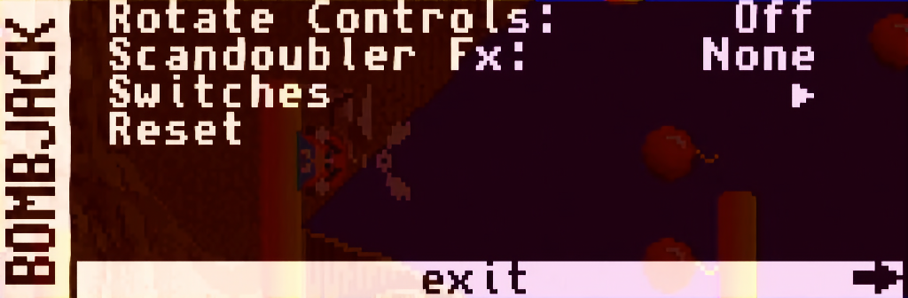
|===

Estas son las principales:

- `Rotate Controls`: Para girar el texto del menú de opciones, así como el comportamiento de los controles de dirección
- `Scandoubler Fx`: Para añadir un efecto de líneas de exploración (sólo con salida VGA)
- `Switches`: Accede a ver y modificar el estado de los https://es.wikipedia.org/wiki/Interruptor_DIP[interruptores DIP]
- `Reset`: Soft Reset (reinicia el Core)
- `Exit`: Cierra el menú

<<<

==== Universal Mr. Do

https://es.wikipedia.org/wiki/Mr._Do![Mr. Do!] es un juego de máquina recreativa creado por Universal Entertainment en 1982.

La versión para neptUNO+ está basada en https://github.com/mist-devel/mist-binaries/tree/master/cores/arcade/Universal%20MrDo[la implementación existente para MiST].

Algunas de las características del core son:

- La salida de vídeo mantiene la rotación del original
- Salida de video VGA
- Salida de vídeo RGB (utilizando el puerto VGA)
- Soporte de mando real y mando emulado en teclado

===== Formato de Tarjeta microSD

Se debe utilizar una tarjeta microSD, con la primera partición en formato exFAT o FAT32, donde se hayan copiado los ficheros ARC y ROM correspondientes de los juegos.

Para <<#_mra_tool,crear los ficheros ROM y ARC>>, se pueden obtener los ficheros MRA correspondientes del https://github.com/mist-devel/mist-binaries/tree/master/cores/arcade/Universal%20MrDo[repositorio de la versión original para MiST].

===== Controles

====== Teclas especiales y botones

Durante la ejecución del core:

- `F12` o botones `Start+Select` de un mando: mostrar el menú de control del core
- Teclas de cursor o el mando 1: Controles de dirección del jugador
- `1` ó `2`: Iniciar partida 1 ó 2 jugadores
- `5`: Insertar una moneda

<<<

===== Guía básica

Al pulsar `F12`, se mostrará el menú con las distintas opciones del core. Se puede navegar utilizando las teclas de cursor. `Enter` selecciona un elemento.

[role="center",width="50%",cols="1a", frame=none, grid=none]
|===
|image:img/mrdo.png[scaledwidth=100%]
|===

Estas son las principales:

- `Rotate Controls`: Para girar el texto del menú de opciones, así como el comportamiento de los controles de dirección
- `Scandoubler Fx`: Para añadir un efecto de líneas de exploración (sólo con salida VGA)
- `Blend`: Para activar si se desea, un efecto de suavizado de la imagen
- `Flip`: Para rotar 180º cómo se muestra la imagen en la pantalla
- `Switches`: Accede a ver y modificar el estado de los https://es.wikipedia.org/wiki/Interruptor_DIP[interruptores DIP] que haya definidos en el fichero ARC
- `Reset`: Soft Reset (reinicia el Core)
- `Exit`: Cierra el menú

<<<

==== UPL Nova 2001

https://en.wikipedia.org/wiki/Nova_2001[Nova 2001] es un videojuego desarrollado y publicado por UPL para salas recreativas en 1983.

Este core permite ejecutar ROM de varios juegos (consultar <<#_upl_nova_2001_hardware,la sección de referencias para más información>>).

La versión para neptUNO+ está basada en https://github.com/mist-devel/mist-binaries/tree/master/cores/arcade/UPL%20Nova2001_Hardware[la implementación existente para MiST].

Algunas de las características del core son:

- Salida de video VGA
- Salida de vídeo RGB (utilizando el puerto VGA)
- Soporte de mando real y mando emulado en teclado

===== Formato de Tarjeta microSD

Se debe utilizar una tarjeta microSD, con la primera partición en formato exFAT o FAT32, donde se hayan copiado los ficheros ARC y ROM correspondientes de los juegos.

Para <<#_mra_tool,crear los ficheros ROM y ARC>>, se pueden obtener los ficheros MRA correspondientes del https://github.com/mist-devel/mist-binaries/tree/master/cores/arcade/UPL%20Nova2001_Hardware[repositorio de la versión original para MiST].

===== Controles

====== Teclas especiales y botones

Durante la ejecución del core:

- `F12` o botones `Start+Select` de un mando: mostrar el menú de control del core
- Teclas de cursor o el mando 1: Controles de dirección del jugador
- `Ctrl`, `Alt` o botones `A`, `B` del mando 1: Botones 1, 2 del jugador
- `1` ó `2`: Iniciar partida 1 ó 2 jugadores
- `5` y `6`: Insertar una moneda

<<<

===== Guía básica

Al pulsar `F12`, se mostrará el menú con las distintas opciones del core. Se puede navegar utilizando las teclas de cursor. `Enter` selecciona un elemento.

[role="center",width="50%",cols="1a", frame=none, grid=none]
|===
|image:img/ninjakun.png[scaledwidth=100%]
|===

Estas son las principales:

- `Rotate Controls`: Para girar el texto del menú de opciones, así como el comportamiento de los controles de dirección
- `Scandoubler Fx`: Para añadir un efecto de líneas de exploración (sólo con salida VGA)
- `Blend`: Para activar si se desea, un efecto de suavizado de la imagen
- `Service`: Activa o desactiva el modo de servicio
- `Switches`: Accede a ver y modificar el estado de los https://es.wikipedia.org/wiki/Interruptor_DIP[interruptores DIP] que haya definidos en el fichero ARC
- `Reset`: Soft Reset (reinicia el Core)
- `Exit`: Cierra el menú de opciones

<<<

==== Williams 6809 rev.1

https://www.system16.com/hardware.php?id=598&gid=1045[Williams 6809 Rev.1] una placa de máquina recreativa lanzada en 1980 por Midway. En su período de vida, fueron lanzados 12 juegos para las distintas variantes del sistema,.

Este core permite ejecutar ROM de varios juegos (consultar <<#_williams_6809_rev_1_hardware,la sección de referencias para más información>>).

La versión para neptUNO+ está basada en https://github.com/mist-devel/mist-binaries/tree/master/cores/arcade/Williams%206809%20rev.1%20Hardware[la implementación existente para MiST].

Algunas de las características del core son:

- La salida de vídeo mantiene la rotación del original
- Salida de video VGA
- Salida de vídeo RGB (utilizando el puerto VGA)
- Soporte de mando real y mando emulado en teclado

===== Formato de Tarjeta microSD

Se debe utilizar una tarjeta microSD, con la primera partición en formato exFAT o FAT32, donde se hayan copiado los ficheros ARC y ROM correspondientes de los juegos.

Para <<#_mra_tool,crear los ficheros ROM y ARC>>, se pueden obtener los ficheros MRA correspondientes del https://github.com/mist-devel/mist-binaries/tree/master/cores/arcade/Williams%206809%20rev.1%20Hardware[repositorio de la versión original para MiST].

===== Controles

====== Teclas especiales y botones

Durante la ejecución del core:

- `F12` o botones `Start+Select` de un mando: mostrar el menú de control del core
- Teclas de cursor o el mando 1: Controles de dirección del jugador
- `Ctrl`, `Alt`, `Espacio` y `Mayús Izda` o botones `A`, `B`, `Start` y `Select` del mando 1: Botones 1, 2, 3 y 4 del jugador
- `1` ó `2`: Iniciar partida 1 ó 2 jugadores
- `5`: Insertar una moneda

<<<

===== Guía básica

Al pulsar `F12`, se mostrará el menú con las distintas opciones del core. Se puede navegar utilizando las teclas de cursor. `Enter` selecciona un elemento.

[role="center",width="50%",cols="1a", frame=none, grid=none]
|===
|image:img/defender.png[scaledwidth=100%]
|===

Estas son las principales:

- `Rotate Controls`: Para girar el texto del menú de opciones, así como el comportamiento de los controles de dirección
- `Scanlines`: Para añadir un efecto de líneas de exploración (sólo con salida VGA)
- `Blend`: Para activar si se desea, un efecto de suavizado de la imagen
- `Save NVRAM`: Para guardar el contenido de la NVRAM (récords de puntuación) en la tarjeta microSD
- `Reset`: Soft Reset (reinicia el Core)
- `Exit`: Cierra el menú de opciones

<<<

=== Ordenadores

==== Acerca de los ficheros VHD

Algunos cores de ordenador necesitan para funcionar ficheros `vhd` de imagen de disco. Según el sistema operativo, estos se pueden crear y utilizar de las siguientes maneras:

===== Windows

Abrir la utilidad de administración de discos de Windows, y elegir la acción que crea ficheros VHD.

[role="center",width="50%",cols="1a", frame=none, grid=none]
|===
|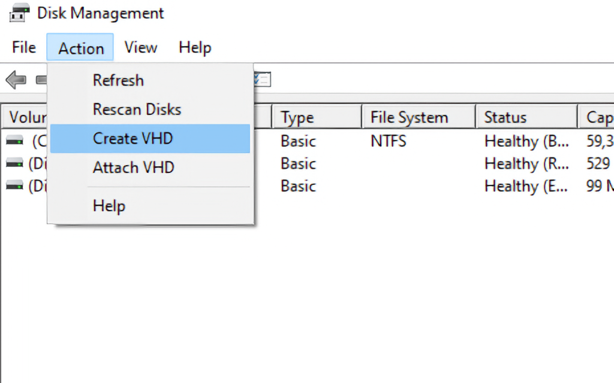
|===

Indicar un nombre para el fichero, así como el tamaño. Mantener el formato como VHD y de tamaño fijo.

[role="center",width="50%",cols="1a", frame=none, grid=none]
|===
|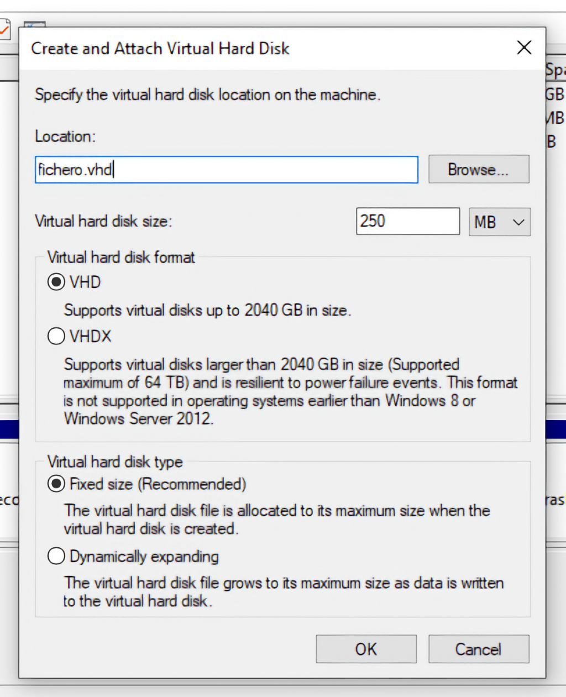
|===

<<<

Una vez el disco virtual está disponible, elegir la opción de inicialización.

[role="center",width="50%",cols="1a", frame=none, grid=none]
|===
|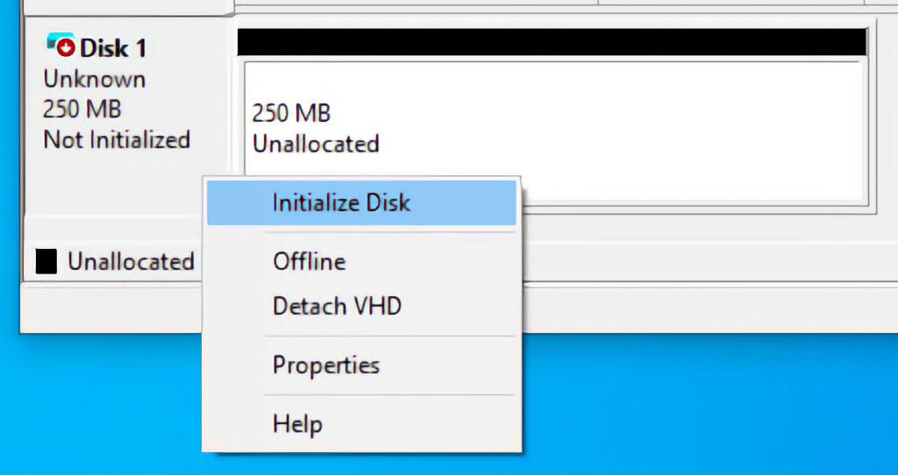
|===

Indicar el tipo de estilo de particiones (normalmente MBR).

[role="center",width="50%",cols="1a", frame=none, grid=none]
|===
|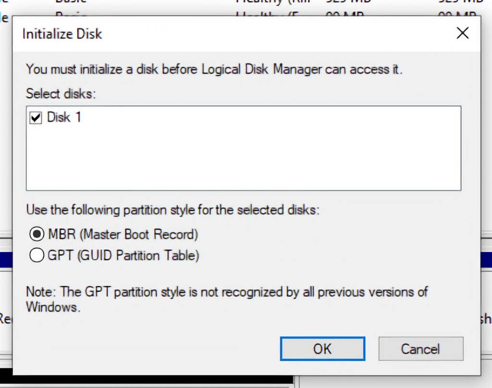
|===

Ahora abrir el asistente para formatear la partición

[role="center",width="50%",cols="1a", frame=none, grid=none]
|===
|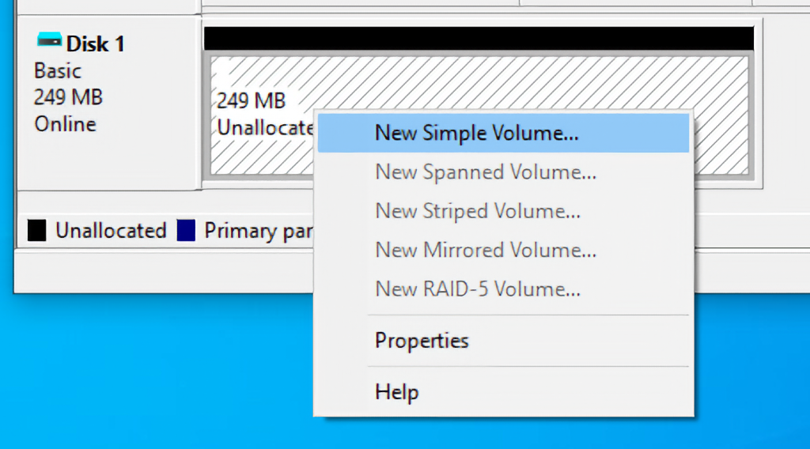
|===

<<<

Elegir el formato deseado, así como la etiqueta de volumen

[role="center",width="50%",cols="1a", frame=none, grid=none]
|===
|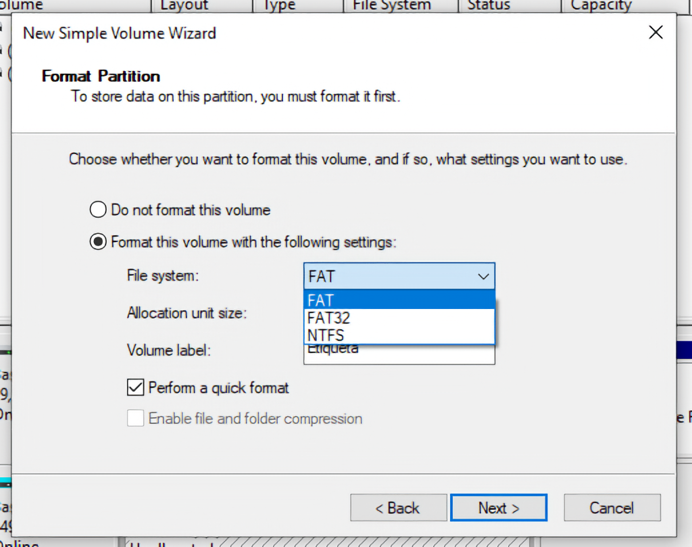
|===

Una vez creada la imagen, se pueden copiar los ficheros que se quiera incorporar, y finalmente desconectarla, para poder guardar todos los cambios y poder usarla con un core.

[role="center",width="50%",cols="1a", frame=none, grid=none]
|===
|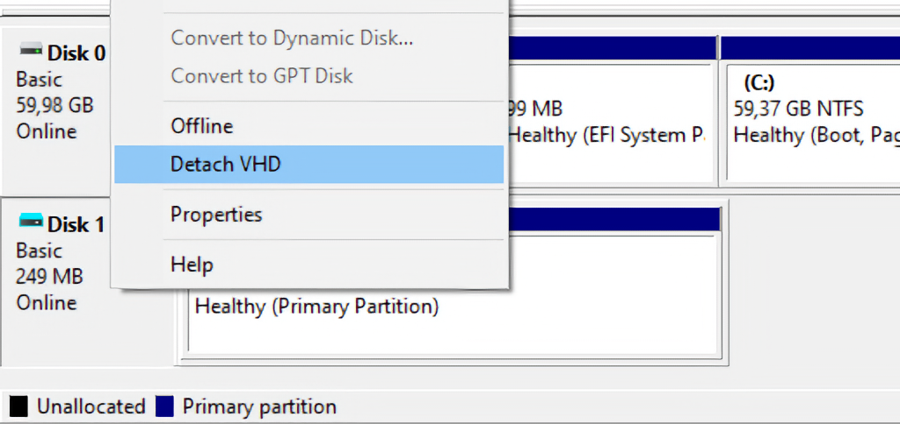
|===

En el futuro, si se desea modificar el contenido de la imagen, basta con el elegir la opción de montaje en el menú contextual de Windows al elegir el fichero de imagen.

[role="center",width="50%",cols="1a", frame=none, grid=none]
|===
|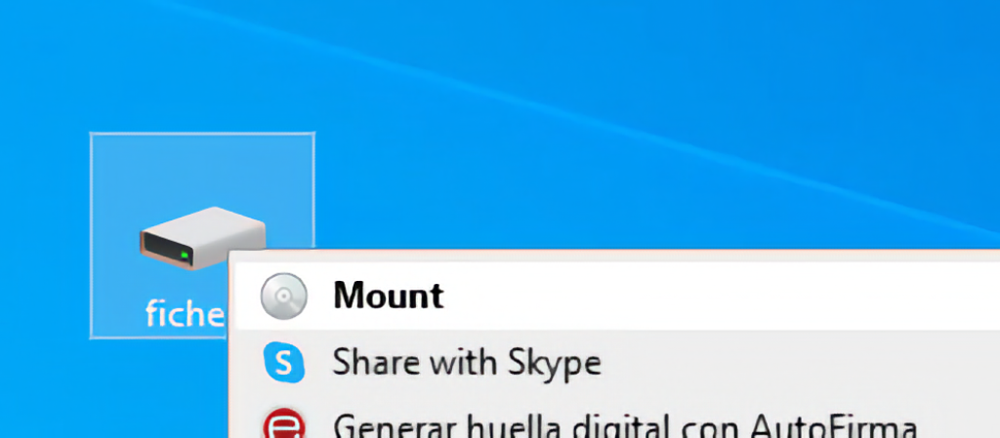
|===

<<<

===== macOS

Para generar un fichero de disco con particiones MBR y formato FAT16:

[source,shell]
----
hdiutil create -size <tamaño> -layout MBRSPUD -fs "MS-DOS FAT16" -volname <etiqueta> <fichero.vhd>
----

Donde `<tamaño>` indica lo grande que se quiere que sea (ej: `200M` para 200MB o `1.5GB` para 1,5GB), `<etiqueta` es la etiqueta de volumen y `<fichero.vhd>` es el nombre del fichero a crear.

Si se desea formato FAT32 en vez de FAT16, cambiar `MS-DOS FAT16` por `MS-DOS FAT32`. Otras opciones pueden ser `MS-DOS` o `MS-DOS FAT12`.

Esto creará un fichero llamado `fichero.vhd.dmg`. Haciendo doble clic sobre el o el comando `hdiutil attach <fichero.vhd.dmg` hará que aparezca como un disco más en el sistema y podremos copiar los ficheros deseados en su interior.

Una vez preparado, expulsar el disco, y renombrar el fichero eliminado la extensión `.dmg` para que sea sólo `.vhd`.

Posteriormente, si se quiere volver a montar la imagen sin tener que renombrar el fichero como `.dmg`, usar un comando en la terminal como el siguiente:

[source,shell]
----
hdiutil attach -imagekey diskimage-class=CRawDiskImage "<fichero.vhd>"
----

<<<

===== Linux

Crear un fichero de imagen de disco.

[source,shell]
----
dd if=/dev/zero of=<fichero.vhd> bs=1024 count=<tamaño>
fdisk --compatibility=dos <fichero.vhd>
----

Donde `<tamaño>` indica lo grande que se quiere que sea (en bytes. Por ejemplo, 250000 para 250MB), y `<fichero.vhd>` es el nombre del richero a crear.

Crear ahora el esquema de particiones.

[source]
----
(...)
Command (m for help): n
Partition type
   p   primary (0 primary, 0 extended, 4 free)
   e   extended (container for logical partitions)
Select (default p): p
Partition number (1-4, default 1): 1
First sector (62-31116288, default 62):
Last sector, +/-sectors or +/-size{K,M,G,T,P} (128-31116288, default 31116288):
Created a new partition 1 of type 'Linux'

Command (m for help): t
Selected partition 1
Hex code (type L to list all codes): 6
Changed type of partition 'Linux' to 'FAT16'.

Command (m for help): a
Partition number (1, default 1): 1
The bootable flag on partition 1 is enabled now.

Command (m for help): p
Disk fichero.vhd: 244,14 MiB, 256000000 bytes, 500000 sectors
(...)
Disk identifier:

Device     Boot   Start     End  Sectors   Size Id Type
fichero.vhd1 *            63 499999   499937 244,1M  6 FAT16

Command (m for help): w
Partition table modified
----

Si se desea la partición FAT32 en vez de FAT16, inciar el código de tipo de `b` en vez de '6':

[source]
----
Hex code (type L to list all codes): b
Changed type of partition 'Linux' to 'W95 FAT32'.
----

Montar la imagen sin formato y formatear la partición FAT (requiere permisos de root).

[source,shell]
----
sudo losetup -f -P fichero.vhd
losetup -l

NAME       SIZELIMIT OFFSET AUTOCLEAR RO BACK-FILE                   DIO LOG-SEC
/dev/loop0         0      0         0  0  fichero.vhd                 0     512

sudo mkfs.fat -F 16 -n <etiqueta> /dev/loop0p1
sudo losetup -d /dev/loop0
----

Donde `<etiqueta>` es la etiqueta de volumen.

Si se desa formato FAT32 en vez de FAT16, cambiar `-F 16` por `-F 32`.

Ahora, para montar la imagen como un dsico más en el sistema, para poder copiar los ficheros deseados en su interior.

[source,shell]
----
sudo losetup -f -P fichero.vhd
losetup -l

NAME       SIZELIMIT OFFSET AUTOCLEAR RO BACK-FILE                   DIO LOG-SEC
/dev/loop0         0      0         0  0  fichero.vhd                 0     512

sudo mount /dev/loop0p1 /mnt
----

Una vez preparado, expulsar el disco

[source,shell]
----
sudo umount /mnt
sudo losetup -d /dev/loop0
----

'''

A continuación se enumeran los cores de ordenadores existentes en el momento de redactarse este manual.

<<<

==== Acorn Archimedes

[role="center",width="100%",cols="5a,1a", frame=none, grid=none]
|===
|[.text-justify]
El https://es.wikipedia.org/wiki/Acorn_Archimedes[Archimedes] es un ordenador doméstico, diseñado por Acorn en 1987, que utilizaba un procesador ARM. Este procesador es muy rápido, ofreciendo 4 MIPs a 8MHz, y rindiendo aproximadamente a la misma velocidad que un 486 en casos de uso real. El sistema operativo, RiscOS, tiene una interfaz gráfica, con multitarea y protección de memoria.
|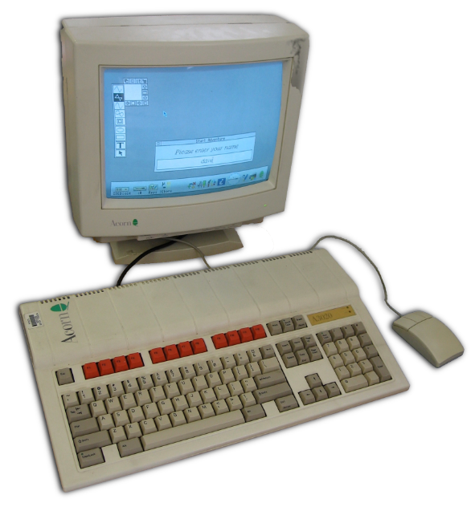
|===

La versión para neptUNO+ está basada en la https://github.com/mist-devel/archimedes[implementación para MiST].

Algunas de las características del core son:

- Soporte de disquete
- Soporte de ratón
- Sonido
- Compatible con RISC OS 2, RISC OS 3.10, RISC OS 3.11 y RISC OS 3.19

===== Formato de Tarjeta microSD

Se debe utilizar una tarjeta microSD con la primera partición en formato exFAT o FAT32, para almacenar todos los ficheros necesarios. Para el funcionamiento correcto del core se ha de copiar a la raíz de la tarjeta microSD, al menos, un fichero con la ROM de RISC OS, y llamado `riscos.rom`.

Además, se pueden utilizar imágenes de disquete, en formato ADF para Acorn Archimedes, y de 819200 bytes de tamaño.

===== Controles

====== Teclas especiales y botones

Durante la ejecución del core:

- `Impr. Pant`: mostrar y ocultar el menú de control del core

<<<

===== Guía básica

Si se detecta y carga correctamente el fichero `riscos.rom`, el core se inicializará tras unos segundos, mostrando un marco rojo y emitiendo varios sonidos.

[role="center",width="70%",cols="1a", frame=none, grid=none]
|===
|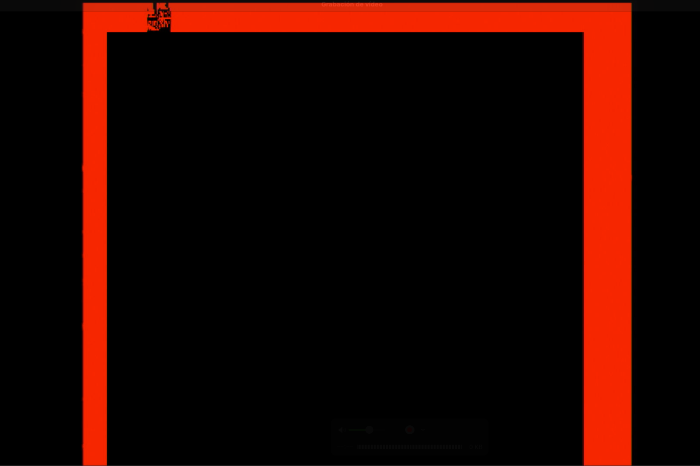
|===

Al pulsar `F12`, se mostrará el menú con las distintas opciones del core. Se puede navegar utilizando las teclas de cursor. `Enter` selecciona un elemento.

[role="center",width="50%",cols="1a", frame=none, grid=none]
|===
|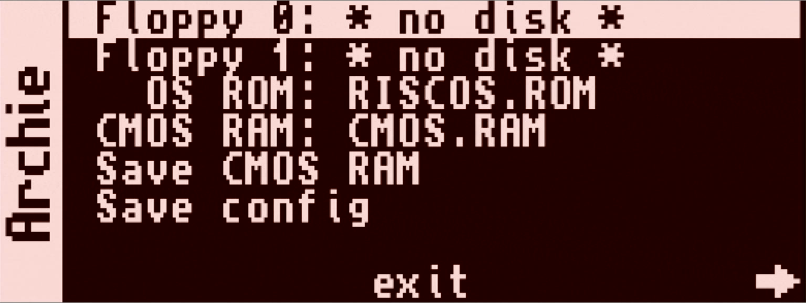
|===

Estas son las principales:

- `Floppy 0`: Para elegir un fichero ADF a insertar en la primera unidad de disquete
- `Floppy 1`: Para elegir un fichero ADF a insertar en la segunda unidad de disquete
- `OS ROM`: Para elegir un fichero de ROM alternativo
- `CMOS RAM`: Para elegir un fichero de ajustes de CMOS alternativo
- `Save Config`: Para guardar la configuración actual de ROM y CMOS como configuración por defecto

<<<

El escritorio de Risc OS necesita un ratón de tres botones (ya que los menús se muestran usando el botón central del ratón) y teclado. En algunos casos, tras el arranque, es necesario desconectar y volver a conectar el ratón de neptUNO+ para que el core lo detecte correctamente.

[role="center",width="70%",cols="1a", frame=none, grid=none]
|===
|image:img/archie_riscos.png[scaledwidth=100%]
|===

Se puede encontrar documentación, manuales, etc. en sitios como https://www.4corn.co.uk y http://www.riscos.com.

<<<

[%always]
<<<

==== Amiga (Minimig-AGA)

[role="center",width="100%",cols="5a,1a", frame=none, grid=none]
|===
|[.text-justify]
https://es.wikipedia.org/wiki/Commodore_Amiga[Commodore Amiga] es una gama de ordenadores personales comercializados por Commodore International entre 1985 y 1994. Debido a su precio y sus capacidades multimedia obtuvo una gran popularidad. Su sistema tiene la particularidad que fuese el primer ordenador multitarea y multimedia orientado al gran público.
|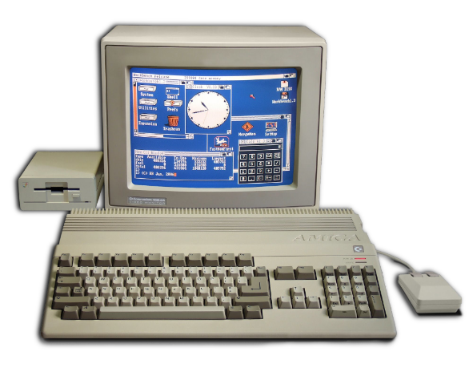
|===

La versión para neptUNO+ está basada en minimig (abreviatura de Mini Amiga), que es una reimplementación de código abierto cuyo autor original es Dennis van Weeren. La variante AGA ha sido actualizada con capacidades de chipset AGA, lo que le permite emular modelos más recientes de Amiga.

Algunas de las características del core son:

- Salida de vídeo VGA emulando PAL/NTSC
- Soporte para ratones PS/2
- Sólo audio Sigma-Delta
- Variantes de chipset : OCS, ECS, AGA
- ChipRAM : 0.5MB - 2.0MB, SlowRAM : 0.0MB - 1.5MB y fastRAM : 0,0MB - 24MB
- CPU : 68000, 68010, 68020
- Soporte para kickstart : 1.2 - 3.1
- HRTmon
- 1-4 disquetes con velocidades normal y turbo
- 1-2 imágenes de disco duro

<<<

===== Formato de Tarjeta microSD

Se debe utilizar una tarjeta microSD, con la primera partición en formato FAT32, para almacenar todos los ficheros necesarios. Para el funcionamiento correcto del core se ha de copiar a la raíz de la tarjeta microSD, al menos, el fichero `832OSDAD.BIN` disponible en el https://github.com/neptunoplus/Binaries/tree/main/Computers/Minimig-AGA[repositorio de cores de neptUNO+], junto con un fichero ROM de https://es.wikipedia.org/wiki/Kickstart[Kickstart] de Amiga, con el nombre `KICK.ROM`.

[WARNING]
====
El core no funciona si la tarjeta microSD está en formato exFAT.
====

Opcionalmente, para que se muestre una animación en el inicio del core, se pueden copiar también a la raíz los ficheros `minimig.art`,`minimig.bal` y `minimig.cop` que se pueden obtener de la https://retroramblings.net/?page_id=1422[página oficial de Minimig AGA para Turbo Chameleon 64].

También es interesante copiar al lugar que se desee de la microSD, los ficheros de imagen de disquete (`ADF`) o de disco duro virtual de https://www.winuae.net[WinUAE] (`HDF`) que se quieran utilizar.

===== Controles

====== Teclas especiales y botones

Durante la ejecución del core:

- `F12`: mostrar y ocultar el menú de control del core
- `Bloq. Num.`:  Encenter o apagar  el uso del teclado numérico como ratón

<<<

===== Guía básica

Al pulsar `F12`, se mostrará el menú con las distintas opciones del core. Se puede navegar utilizando las teclas de cursor. `Enter` selecciona un elemento.

[role="center",width="70%",cols="1a", frame=none, grid=none]
|===
|image:img/minimig.jpg[scaledwidth=100%]
|===

Estas son las principales:

- `df0`, `df1`, etc.: Para seleccionar una imagen de disquete `ADF`.
- `Floppy Disk Settings`: Para configurar el número de disqueteras y otras opciones
- `Primary Hard Disk`: Para poder configurar dónde están los datos del disco primario (normalmente un fichero `HDF`)
- `Secondary Hard Disk`: Para poder configurar dónde están los datos del disco secundario
- `Exit`: Sale del menú de configuración

Usando las flechas de cursor del teclado se puede acceder a más opciones de configuración:

- `Load Configuration`: Para cargar los datos de una configuración
- `Save Configuration`: Para guardar la configuración actual. Si se hace en el espacio por defecto (`default`), es la que se utilizará cada vez que se inicie el core
- `Chipset Settings`: Aquí se puede elegir la CPU, modo turbo, tipo de vídeo (PAL o NTSC), Chipset a simular
- `Memory Settings`: Para configurar las distintas cantidades de memoria RAM, así como el fichero de ROM a utilizar
- `Video Settings`: Para activar o desactivar filtros de vídeo, desentrelazado, etc.
- `Reset`: Reinicia el core con las opciones por defecto
- `Reboot` Reinicia el core con la configuración actual

<<<

[%always]
<<<

==== Amstrad CPC 6128

[role="center",width="100%",cols="5a,1a", frame=none, grid=none]
|===
|[.text-justify]
El https://es.wikipedia.org/wiki/Amstrad_CPC_6128[Amstrad CPC 6128] es un ordenador comercializado por Amstrad en 1985. Es el sucesor del Amstrad CPC 664, que solo duró 6 meses en el mercado. Como novedad, aparte de tener más memoria RAM, incorporaba unidad de disco.
|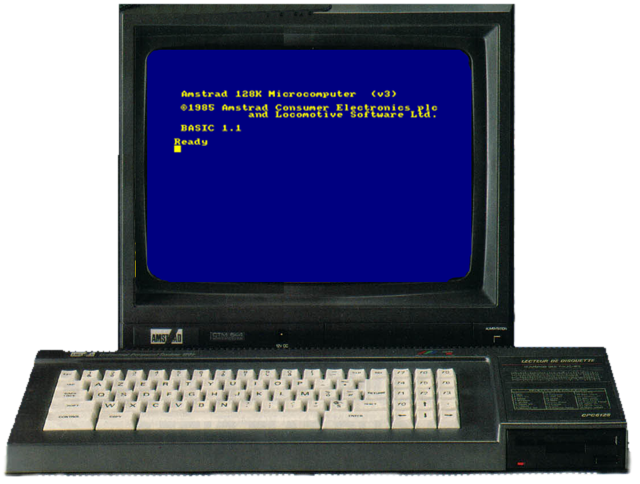
|===

La versión para neptUNO+ está basada en https://github.com/rampa069/Amstrad_MiST[la implementación para MiST]. Esta era inicialmente una adaptación de https://github.com/renaudhelias/CoreAmstrad[CoreAmstrad de Renaud Hélias], pero actualmente todos los módulos han sido reescritos o reemplazados, así que se puede considerar como un core completamente nuevo.

Algunas de sus características son:

- Tiempos de CPU precisos, incluido un modelo de contención adecuado
- Gate Array exacto, creado a partir de ingeniería inversa del decapado del chip original Amstrad 40010
- Modelo CRTC preciso que admite muchos trucos de los tipos 1 y 0
- 2 unidades de disco
- Soporte de escritura en disco
- Emulación de unidad de disco cercana a la real con soporte de algunas protecciones
- Modo CPC 6128/664 seleccionable con juegos de ROM separados
- Multiface 2.
- Varios modos monocromo y 2 tipos de paleta (GA/ASIC).
- Opciòn para cagar ROM de expansión
- Soporte de joystick
- Ratones Kempston, SYMBiFACE II y Multiplay.
- HQ2x y Scanlines FX para scandoubler.
- Soporta archivos de cinta *.CDT.
- Salida de cinta a través de altavoz.

<<<

===== Formato de Tarjeta microSD

Se debe utilizar una tarjeta microSD con la primera partición en formato exFAT o FAT32.

Además es necesario un fichero llamado `amstrad.rom` que se puede obtener en el https://github.com/neptunoplus/Binaries/tree/main/Computers/Amstrad6128[repositorio de GitHub]. Este fichero está compuesto, secuencialmente, por los datos de las siguientes ROM:

- `OS6128`
- `BASIC1.1`
- `AMSDOS`
- `MF2`
- `OS664`
- `BASIC664`
- `AMSDOS`
- `MF2`

También es interesante disponer de uno o más ficheros con imágenes de disco (`DSK`) o de cinta (`CDT`) con el software que se quiera ejecutar.

Copiar el fichero `amstrad.rom` al mismo lugar donde se encuentre el fichero del core en la tarjeta microSD. Copiar también los ficheros `DSK`,`CDT` al lugar que se desee dentro de la tarjeta.

<<<

===== Controles

====== Teclas especiales y botones

Durante la ejecución del core:

- `F12`: mostrar y ocultar el menú de control del core
- `F11`: activar Multiface 2
- `Alt+F11`: Reset

===== Guía básica

Al pulsar `F12`, se mostrará el menú principal del core.

[role="center",width="50%",cols="1a", frame=none, grid=none]
|===
|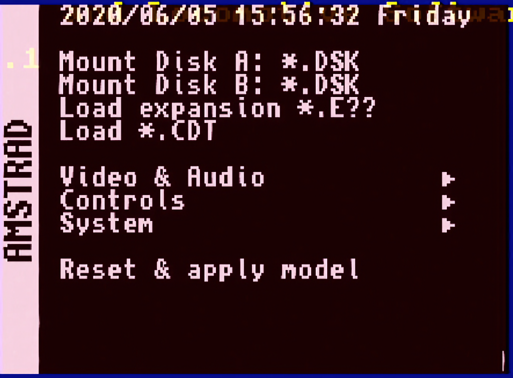
|===

Estas son las principales opciones:

- `Mount Disk A`: Para asignar un fichero `DSK` en la microSD a la unidad de disco A. Backspace (la tecla de borrar hacia atrás, encima de `Enter`) quita un disco asignado previamente
- `Mount Disk B`: Para asignar un fichero `DSK` en la microSD a la unidad de disco B. Backspace quita un disco asignado previamente
- `Load Expansion`: Para cargar un fichero de expansión de ROM véase https://github.com/gyurco/Amstrad_MiST?tab=readme-ov-file#expansion-rom[el repositorio oficial para más detalles]
- `Load *.CDT`: Para asignar un fichero `CDT` en la microSD como cinta de datos
- `Reset & Apply Model`: Reinicia el core aplicando los últimos cambios de configuración (si los hubiera)
- `Exit`: Cierra el menú de opciones

<<<

Si se elige la opción `Video & Audio` en el menú principal del core, se mostrará este menú.

[role="center",width="50%",cols="1a", frame=none, grid=none]
|===
|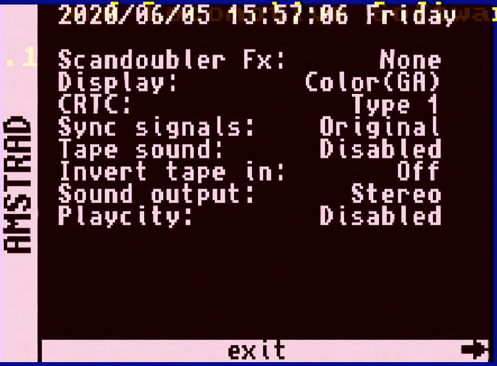
|===

Desde aquí se pueden modificar los siguientes ajustes:

- `Scandoubler FX`: Para activar distintos filtros (sólo con <<#_configuración_avanzada,salida VGA activa>>)
- `Display`: Alterna entre distintos modos de color
- `CRTC`: Define el https://www.cpcwiki.eu/index.php/CRTC[modelo de CRTC] a utilizar
- `Sync Signals`: Elige el tipo de señal de sincronía
- `Tape Sound`: Permite activar o desactivar el audio durante la carga de cinta
- `Invert Tape In`: Para invertir la polaridad de audio de la cinta
- `Sound output`: Para elegir entre sonido mono o estéreo
- `Playcity`: Para activar o desactivar la https://www.cpcwiki.eu/index.php/PlayCity[tarjeta de expansión Playcity]

<<<

Si se elige la opción `Controls` en el menú principal del core, se mostrará este otro menú.

[role="center",width="50%",cols="1a", frame=none, grid=none]
|===
|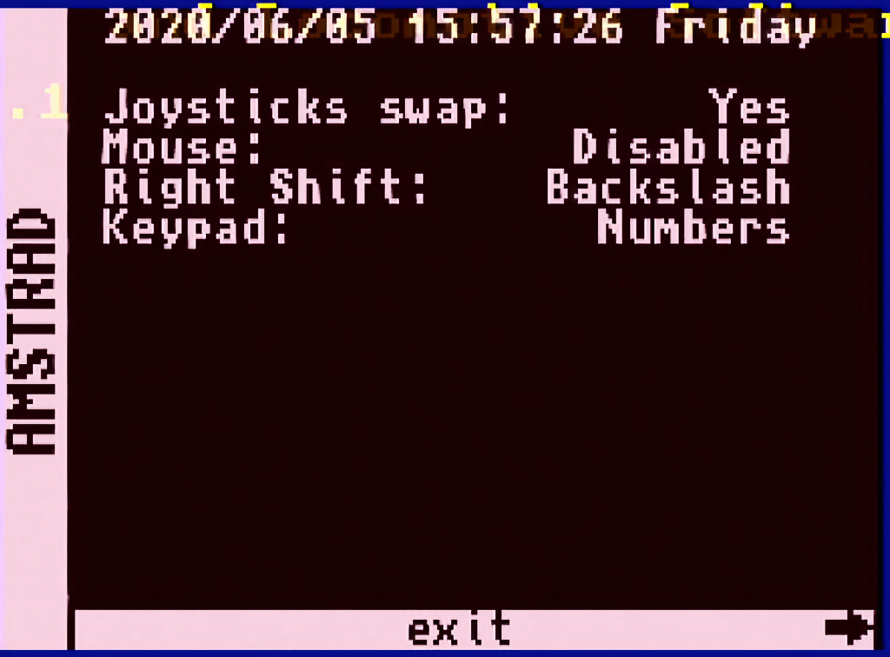
|===

Desde aquí se pueden modificar los siguientes ajustes:

- `Joysticks swap`: Para intercambiar el orden de los puertos de mando
- `Mouse`: Habilita o deshabilita el ratón
- `Right Shift`: Define el comportamiento de la tecla mayúsculas derecha
- `Keypad`: Define el comportamiento del teclado numérico

Si se elige la opción `System` en el menú principal del core, se mostrará este menú.

[role="center",width="50%",cols="1a", frame=none, grid=none]
|===
|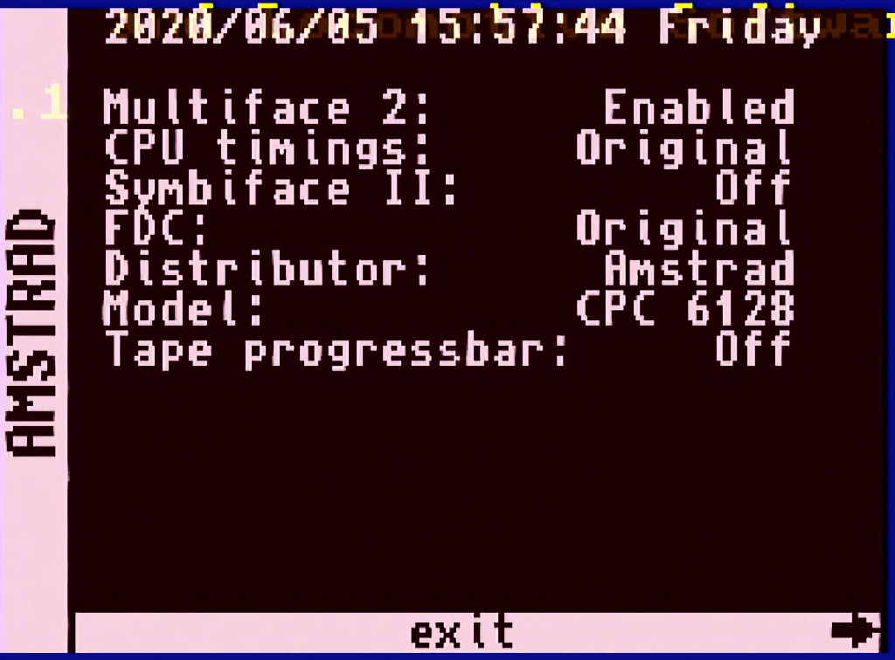
|===

Desde aquí se pueden modificar los siguientes ajustes:

- `Multiface 2`: Desactiva o activa multiface 2
- `CPU Timings`: Para activar timings más rápidos que los originales
- `Symbiface II`: Para activar o desactivar la expansión https://www.cpcwiki.eu/index.php/SYMBiFACE_II[Symbiface II] (soporte de ratón)
- `FDC`: Para elegir entre una implementación de disquetera más rápida o más compatible
- `Distributor`: Si se desea cambiar el comportamiento entre Amstrad o Schneider
- `Model`: Para elegir entre 6128 y 664
- `Tape progressbar`: Permite mostrar una barra de progreso durante la carga de cintas

<<<

Una vez seleccionada una imagen de disco, escribir el comando `CAT` para ver el contenido del fichero DSK cargado actualmente.

[role="center",width="70%",cols="1a", frame=none, grid=none]
|===
|image:img/cpc6128_01.png[scaledwidth=100%]
|===

Escribir el comando `RUN"<nombre>` para cargar un programa del disco

[role="center",width="70%",cols="1a", frame=none, grid=none]
|===
|image:img/cpc6128_02.png[scaledwidth=100%]
|===

Usar los comandos `|b` y `|a` para seleccionar las unidades de disco B: y A: respectivamente (el símbolo `|` se obtiene pulsando `Mayúsculas` y la tecla situada a la derecha de la `P`).

También es posible cargar desde una cinta (u otro dispositivo externo de audio) escribiendo primero el comando `|TAPE`. A continuación, usar el comando `RUN"`.

<<<

==== Amstrad PCW

[role="center",width="100%",cols="5a,1a", frame=none, grid=none]
|===
|[.text-justify]
La https://es.wikipedia.org/wiki/Amstrad_PCW[gama de ordenadores personales PCW] fueron fabricados por la empresa británica Amstrad entre 1985 y 1998. PCW es una abreviatura de Personal Computer Word-processor, y era un ordenador orientado a la ofimática doméstica.
|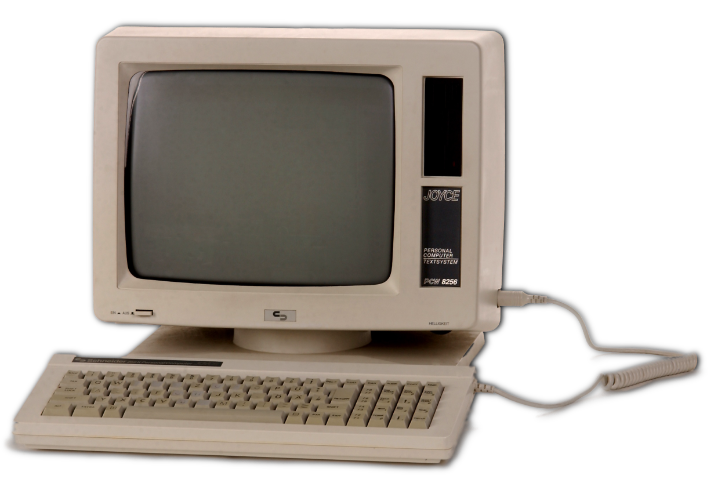
|===

La https://github.com/rampa069/Amstrad-PCW_Demistify[implementación para NeptunoPlus] está basada en la original https://github.com/MiSTer-devel/Amstrad-PCW_MiSTer[creada para MiSTer].

Algunas de sus características son:

- Amstrad PCW con CPU Z80 a 4Mhz y soporte para Turbo a 8Mhz (2x), 16 Mhz(4x) o 32 Mhz (8x)
- Memoria ampliada hasta un máximo de 2 MB
- Unidades de disco de 3" y 3,5" con soporte de lectura y escritura (formato DSK estándar de emulador)
- Compatible con resolución PAL (720x256) o NTSC (720x200)
- Asignación completa de teclado de PC
- Soporte de joystick
- Ratón
- Sonido PCW Beeper normal y el generador de sonido DKTronics (AY-3-8912)
- Modo de color configurable

===== Formato de Tarjeta microSD

Se debe utilizar una tarjeta microSD, con la primera partición en formato exFAT o FAT32.

Es interesante disponer de uno o más ficheros con imágenes de disco (`DSK`) con el software que se quiera ejecutar.

Copiar los ficheros `DSK` al lugar que se desee dentro de la tarjeta.

===== Controles

====== Teclas especiales y botones

- `F12`: mostrar y ocultar el menú de control del core
- `F9`: Mover la línea de activación de línea de color hacia arriba (soporte de color EGA o CGA)
- `F10`: Mover la línea de activación de la línea de color hacia abajo (soporte de color EGA o CGA)
- `F11`: Activar/desactivar el modo de color a pantalla completa (soporte de color EGA o CGA)

<<<

===== Guía básica

Al pulsar `F12`, se mostrará el menú principal del core.

[role="center",width="50%",cols="1a", frame=none, grid=none]
|===
|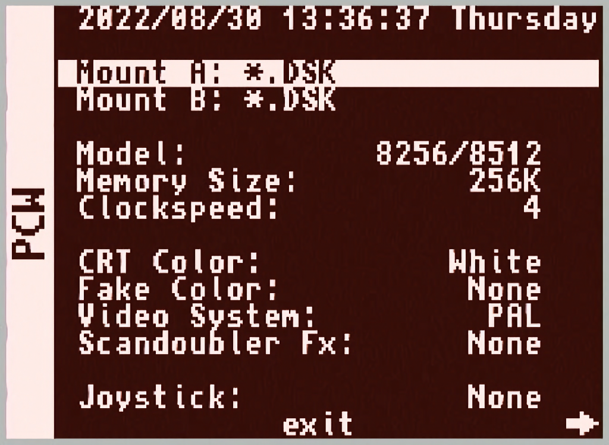
|===

Estas son las principales opciones:

- `Mount A`: Para asignar un fichero `DSK` en la microSD a la unidad de disco A. Backspace (la tecla de borrar hacia atrás, encima de `Enter`) quita un disco asignado previamente
- `Mount B`: Para asignar un fichero `DSK` en la microSD a la unidad de disco B. Backspace quita un disco asignado previamente
- `Model`: Para elegir el modelo de PCW a utilizar
- `Memory Size`: Tamaño de la memoria deseado
- `Clockspeed`: Elige la velocidad de reloj
- `CRT Color`: Selecciona el modo de color de monitor a usar
- `Fake Color`: Para activar el soporte de color EGA o CGA
- `Video System`: Para elegir entre PAL y NTSC
- `Scandoubler FX`: Para activar distintos filtros (sólo con <<#_configuración_avanzada,salida VGA activa>>)
- `Joystick`: Para seleccionar el tipo de joystick a asignar a los mandos
- `Mouse`: Para seleccionar el tipo de ratón a asignar
- `DkTronix I/F`: Para activar o desactiva la interfaz de sonido DkTronix
- `Reset`: Reinicia el core aplicando los últimos cambios de configuración (si los hubiera)
- `Exit`: Sale del menú de configuración

Es normal asignar un disco a la unidad A con el https://es.wikipedia.org/wiki/CP/M[sistema operativo CP/M], y usar la segunda unidad para el software a utilizar.

<<<

==== Atari 800XL

[role="center",width="100%",cols="5a,1a", frame=none, grid=none]
|===
|[.text-justify]
El https://es.wikipedia.org/wiki/Atari_800XL[Atari 800XL] era un ordenador personal lanzado por Atari en la década de los 80, siendo el modelo de gama alta con respecto al Atari 600XL, con el que coexistió. Disponía de unidad de casete además de disquetera. Contaba con una paleta de 256 colores y un intérprete BASIC.
|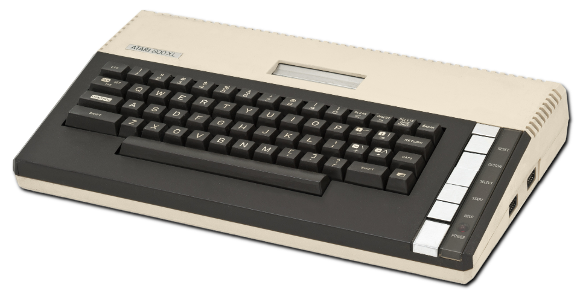
|===

La versión para neptUNO+ tiene estas características:

- Memoria ampliada hasta 320K, seleccionable
- Soporte de unidad de disco (hasta 4 unidades), mediante tarjeta microSD
- Soporte de cartuchos, también mediante carga por SD
- Soporte para vídeo compuesto y VGA
- Scanlines en modo VGA
- Soporte de joystick norma Atari

===== Formato de Tarjeta microSD

Se debe utilizar una tarjeta microSD con la primera partición en formato exFAT o FAT32, para almacenar todos los ficheros necesarios.

Si en la raíz de la tarjeta hay un fichero `A800XL.ROM`, con la ROM correspondiente, se cargará automáticamente. En otro caso, se tendrá que seleccionar uno desde el menú del core.

Además, se pueden utilizar imágenes de disquete o de cartuchos.

===== Controles

====== Teclas especiales y botones

Durante la ejecución del core:

- `F5`: `Help`
- `F6`: `Start`
- `F7`: `Select`
- `F8`: `Option`
- `F9`: `Reset`
- `F10`: `Cold Reset`
- `F11`: Cargar un disco
- `F12`: Acceder al menú de opciones

<<<

===== Guía básica

Al pulsar `F12`, se mostrará el menú con las distintas opciones del core. Se puede navegar utilizando las teclas de cursor. `Enter` selecciona un elemento. `F12` oculta el menú si se estaba mostrando.

[role="center",width="50%",cols="1a", frame=none, grid=none]
|===
|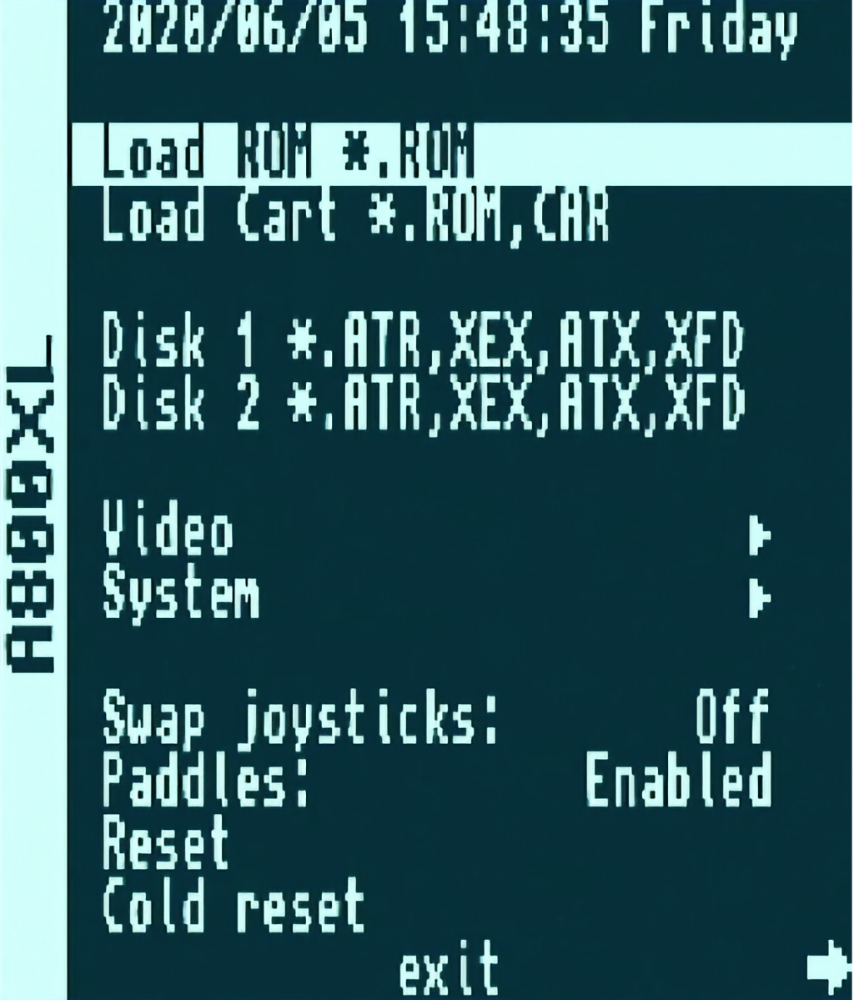
|===

En él se pueden activar, desactivar o configurar las siguientes opciones:

- `Load ROM`: Para cargar un archivo de ROM alternativo
- `Load cart`: Para cargar un archivo de imagen de un cartucho
- `Disk 1`: Para elegir un fichero de imagen de disco (ATR, XEX, ATX o FXD) para utilizar
- `Disk 2`: Para elegir un segundo fichero de imagen de disco (ATR, XEX, ATX o FXD)
- `Swap Joysticks`: Para intercambiar los controles del jugador 1 y el jugador 2
- `Paddles`: Activa el soporte para https://es.wikipedia.org/wiki/Paddle_(controlador_de_videojuegos)[paddle] vía ratón u otro dispositivo compatible
- `Reset`: Reinicia el core en caliente
- `Cold Reset`: Reinicia el core
- `Exit`: Sale del menú de configuración

<<<

Si se elige la opción `Video` en el menú principal del core, se mostrará este otro menú.

Desde aquí se pueden modificar los siguientes ajustes:

[role="center",width="50%",cols="1a", frame=none, grid=none]
|===
|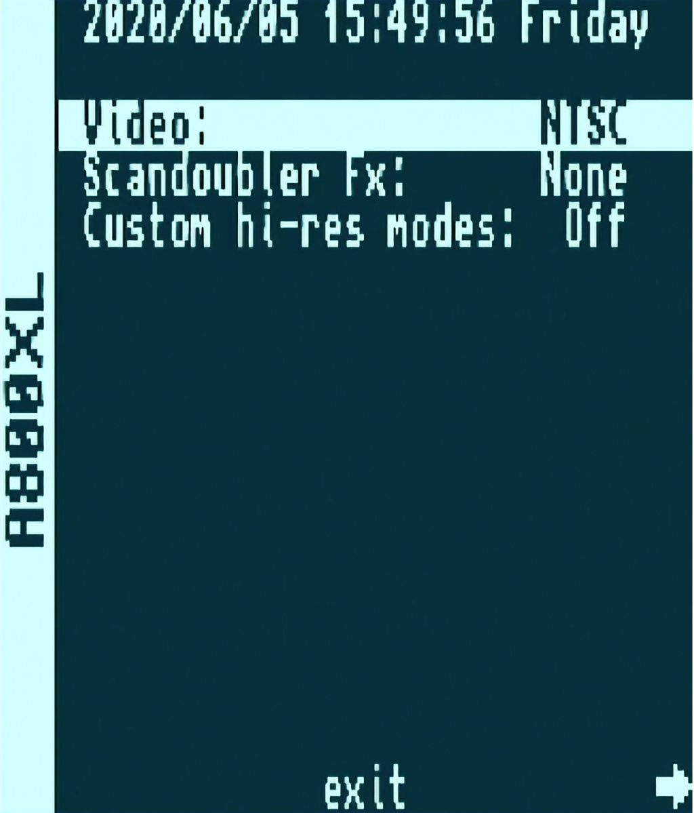
|===

- `Video`: Selecciona entre NTSC y PAL
- `Scandoubler Fx`: Activa efectos de línea de exploración (sólo en la salida VGA)
- `Custom hi-res modes`: Activa el soporte para modos personalizados de alta resolución

<<<

Si se elige la opción `System` en el menú principal del core, se mostrará este otro menú.

[role="center",width="50%",cols="1a", frame=none, grid=none]
|===
|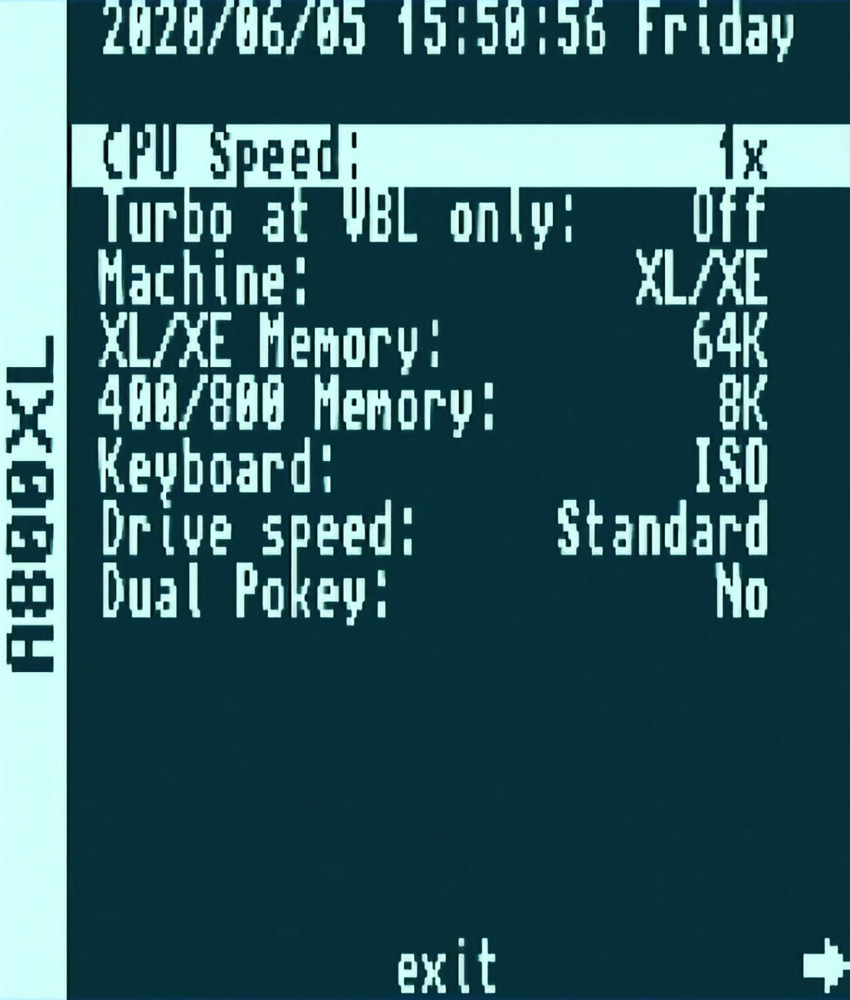
|===

Desde aquí se pueden modificar los siguientes ajustes:

- `CPU Speed`: Para acelerar la velocidad de la CPU
- `Turbo at VBL only`: Para restringir el turbo durante la interrupción de vídeo vertical
- `Machine`: para elegir el tipo de máquina
- `XL/XE memory`: modifica la cantidad de memoria RAM asignada en los modelos XL y XE
- `400/800 memory`: modifica la cantidad de memoria RAM
- `Keyboard`: Tipo de teclado
- `Drive speed`: Para acelerar la lectura de las imágenes de disco
- `Dual Pokey`: Habilita el soporte de audio con dual pokey

Para cargar una imagen de disco, suele ser suficiente con elegir el archivo correspondiente desde el menú del core y, a continuación, hacer Cold Reset, bien desde el menú, bien con la tecla `F10`.

[TIP]
====
Algunos juegos requieren que el soporte para BASIC esté desactivado para funcionar correctamente. En estos casos, pulsar `F8` mientras se realiza el reset.
====

<<<

==== Atari ST/STe (MiSTery)

[role="center",width="100%",cols="5a,1a", frame=none, grid=none]
|===
|[.text-justify]
https://es.wikipedia.org/wiki/Atari_ST[Atari ST] es una línea de ordenadores doméstcisos domésticas, sucesora de la familia Atari de 8 bits. El ST, que fue el primer modelo, fue lanzado 1985. El Atari ST fue el primer ordenador doméstico con interfaz gráfica de mapa de bits en color, la GEM de Digital Research.
|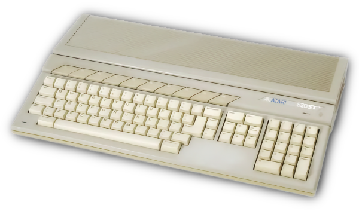
|===

La versión para neptUNO+ está basada en https://github.com/delgrom/MiSTery[la versión original para MiST], y tiene, entre otras, las siguientes características:

- CPU FX68K de ciclo exacto
- Blitter de ciclo exacto
- Modo CPU MegaSTe a 16 MHz
- Turbo bus - doble velocidad de acceso a la RAM
- RAM de hasta 14 MB
- Soporte para todas las versiones de TOS
- 2 unidades de disquete
- Compatible con discos duros ACSI
- Compatible con tarjeta de alta resolución (monocromo) Viking

===== Formato de Tarjeta microSD

Se debe utilizar una tarjeta microSD con la primera partición en formato exFAT o FAT32, para almacenar todos los ficheros necesarios.

Si en la raíz de la tarjeta hay un https://avtandil.narod.ru/tose.html[fichero `TOS.IMG`], con una ROM de TOS válida, se cargará automáticamente. En otro caso, se tendrá que seleccionar una desde el menú del core.

También es posible utilizar imágenes de disco duro `.HD` o `.ST` de disquete.

[WARNING]
====
Todos los ficheros de ROM, disco, etc. se tienen que dejar en la raíz de la tarjeta SD. El core no permite navegar por subdirectorios para elegir ficheros.
====

===== Controles

====== Teclas especiales y botones

Durante la ejecución del core:

- `F12`: mostrar y ocultar el menú de control del core

<<<

===== Guía básica

Si se detecta y carga correctamente el fichero `tos.img`, el core se inicializará automáticamente.

[role="center",width="70%",cols="1a", frame=none, grid=none]
|===
|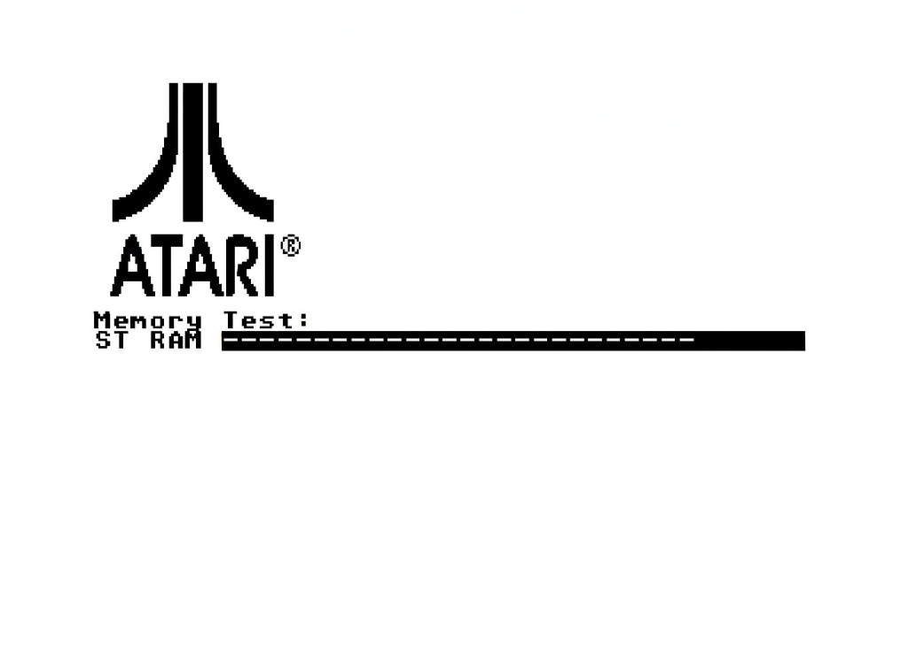
|===

Al pulsar `F12`, se mostrará el menú con las distintas opciones del core. Se puede navegar utilizando las teclas de cursor. `Enter` selecciona un elemento. `F12` oculta el menú si se estaba mostrando.

[role="center",width="50%",cols="1a", frame=none, grid=none]
|===
|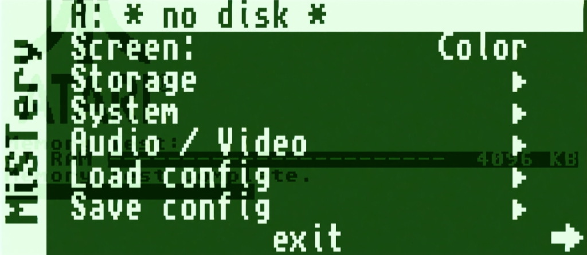
|===

En él se pueden activar, desactivar o configurar las siguientes opciones:

- `A:`: Permite elegir una imagen de disquete para cargar en la unidad A:
- `Screen`: Permite seleccionar rápidamente entre Monocromo y color
- `Load Config`: Para crgar una configuración desde la tarjeta microSD.
- `Save Config`: Para guardar la configuración actual en la tarjeta microSD. Se pueden guardar hasta 5 distintas.
- `Exit`: Sale del menú de configuración

<<<

Si se elige la opción `Storage` en el menú principal del core, se mostrará este otro menú.

[role="center",width="50%",cols="1a", frame=none, grid=none]
|===
|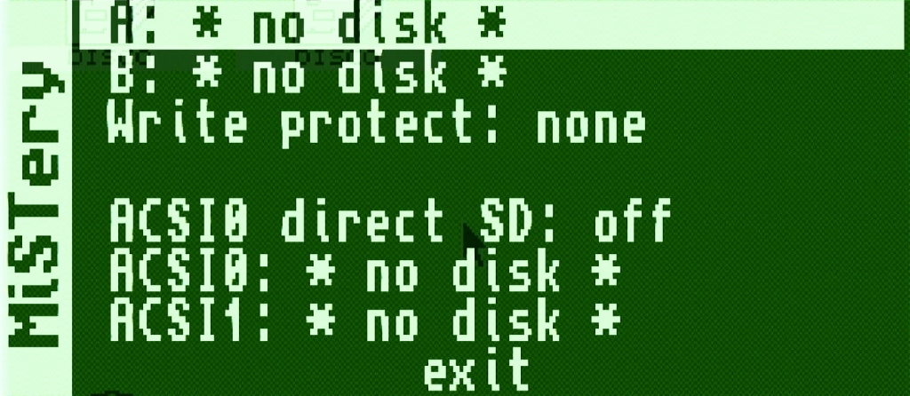
|===

Desde aquí se pueden modificar los siguientes ajustes:

- `A:`: Permite elegir un fichero `ST` de imagen de disquete para cargar en la unidad A:
- `B:`: Permite elegir un fichero `ST` de imagen de disquete para cargar en la unidad B:
- `Write protect`: Para activar a desactivar la protección de escritura en disquetes
- `ACSI direct SD`: Para utilizar la SD entera como unidad de disco
- `ACSI0:`: Para elegir un fichero `HD` de imagen de dico duro en la primera unidad
- `ACSI1:`: Para elegir un fichero `HD` de imagen de dico duro en la segunda unidad

Si se elige la opción `System` en el menú principal del core, se mostrará este otro menú.

[role="center",width="50%",cols="1a", frame=none, grid=none]
|===
|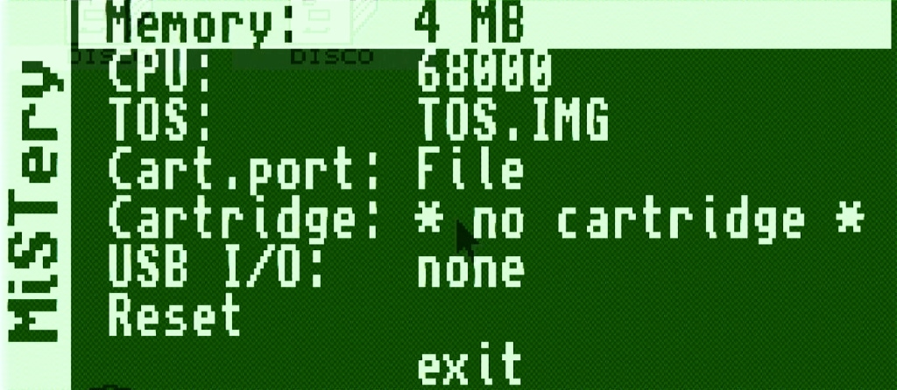
|===

Desde aquí se pueden modificar los siguientes ajustes:

- `Memory`: Para elegir la cantidad de memoria RAM a utilizar
- `CPU`: Para seleccionar el modelo de CPU
- `TOS`: Para elegir un fichero de ROM con el sistema operativo Atari TOS
- `Cart.port`: Para elegir el comportamienteo del puerto de cartuchos
- `USB I/O`:
- `Reset`: Reinicia el core en caliente
- `Cold boot`: Reinicia el core con un arranque en frío
- `Exit`: Cierra el menú de opciones

<<<

Si se elige la opción `Audio/Video` en el menú principal del core, se mostrará este otro menú.

[role="center",width="50%",cols="1a", frame=none, grid=none]
|===
|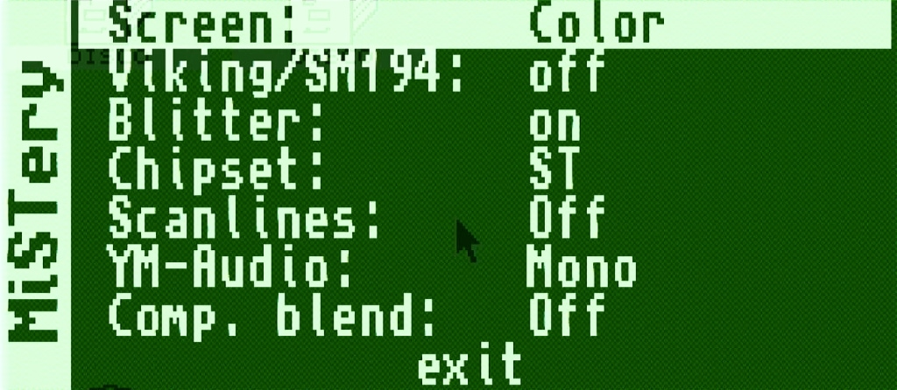
|===

Desde aquí se pueden modificar los siguientes ajustes:

- `Screen`: Para elegir pantalla en color o monocromo
- `Viking/SM194`: Activa y desactiva el soporte de tarjeta Viking
- `Blitter`: Activa o desactiva el soporte del chip blitter
- `Chipset`: Permite elegir entre distintos tipos de chipste (ST, STe, etc.)
- `Scanlines`: Activa efectos de línea de exploración (sólo en la salida VGA)
- `YM-Audio`: Para elegir el comportamiento del chip YM de sonido
- `Comp. blend`:

<<<

==== Camputers Lynx

[role="center",width="100%",cols="5a,1a", frame=none, grid=none]
|===
|[.text-justify]
El https://es.wikipedia.org/wiki/Camputers_Lynx[Lynx] fue un ordenador doméstico británico de 8 bits lanzado a principios de 1983 por la compañía Camputers. Se lanzaron en total tres modelos, con 48kB, 96kB ó 128kB de RAM.
|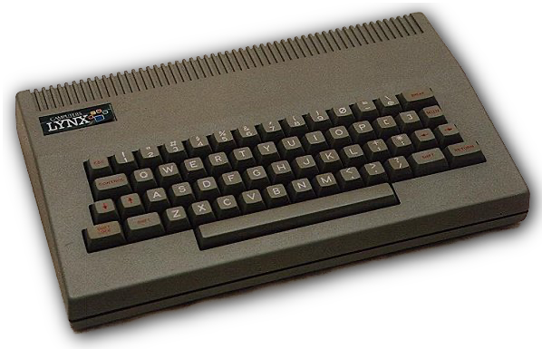
|===

La versión para neptUNO+ ha sido https://github.com/Kyp069/lynx[desarrollada por Kyp069] y tiene las siguientes características:

- Modos 48kB, 96 kB y 96kB Scorpion
- Carga de programas usando la entrada de audio
- Carga desde archivos TZX
- Emulación de controladora de disquete 

===== Formato de Tarjeta microSD

Se debe utilizar una tarjeta microSD con la primera partición en formato exFAT o FAT32, para almacenar todos los ficheros necesarios.

Es posible almacenar en la tarjeta microSD ficheros de cinta en formato `TZX`, así como ficheros `LDF` de imagen de disquete de 200K.

===== Controles

====== Teclas especiales y botones

Durante la ejecución del core:

- `Re Pág`: Reproducir TZX (cargado previamente desde el menú)
- `Av Pág`: Detener la reproducción de TZX
- `F9`: Reset
- `F12`: mostrar y ocultar el menú de control del core

<<<

===== Guía básica

Al pulsar `F12`, se mostrará el menú con las distintas opciones del core. Se puede navegar utilizando las teclas de cursor. `Enter` selecciona un elemento. `F12` oculta el menú si se estaba mostrando.

[role="center",width="50%",cols="1a", frame=none, grid=none]
|===
|image:img/lynx.png[scaledwidth=100%]
|===

En él se pueden activar, desactivar o configurar las siguientes opciones:

- `Load TZX`: Para cargar desde la tarjeta un archivo de imagen de cinta TAP, CSW o TZX
- `Tape Sound`: Para indicar si se quiere poder oir el sonido de carga de cinta
- `Mount LDF`: Para montar una imagen de disco
- `Floppy`: Para deshabilitar o habilitar el soporte de imágenes de disco
- `Model`: Para indicar el modelo de Lynx a simular
- `Bank 2 CAS enable`:
- `Reset`: Reinicia el core
- `Exit`: Sale del menú de configuración

<<<

[role="center",width="70%",cols="1a", frame=none, grid=none]
|===
|
|===

Desde BASIC, se suele cargar desde un archivo TZX en la microSD, una cinta (u <<#_miniduino,otro dispositivo externo de audio>>) con la secuencia de comandos:

[source]
----
TAPE n
LOAD "NOMBRE"
RUN
----

Donde `n` es un número (entre 1 y 5), según como se haya realizado la grabación, y `NOMBRE` es, obligatoriamente el nombre a cargar desde la cinta.

Si no se sabe el nombre a cargar, se puede averiguar con la misma secuencia de comandos, pero escribiendo `LOAD ""`.

Para ficheros binarios, se debe usar `MLOAD` en vez de `LOAD`.

[NOTE]
====
El software incorporando en <<#_miniduino,Miniduino o Maxduino>> no tiene, por el momento, soporte para los archivos de cinta `TAP` de Lynx.
====

Es posible utilizar programas como <<#_conversión_a_fichero_de_audio,Lynx2Wav>> con los ficheros `TAP` de cinta de Lynx. Los ficheros de audio obtenidos se pueden embeber a su vez dentro de ficheros TSX o TZX con herramientas como <<#_creación_de_ficheros_tzx_o_tsx_desde_otros_formatos,MakeTSX o RetroConverter>>.

El script http://retrowiki.es/viewtopic.php?f=31&t=200036835[lince] facilita todo este proceso, permitiendo crear directamente ficheros `TZX` compatibles con Maxduino desde ficheros `TAP` de Lynx.

<<<

Además, las versiones más recientes del core, incorporan soporte para imágenes de disco `LDF`.

Para utilizarlas, primero se ha de inicializar la controladora de disco:

[source]
----
XROM
----

Para ver el contenido de un disco insertado, usar la sequencia de comandos:

[source]
----
EXT DIR
----

De forma similar a la carga desde cinta, se puede usar `EXT LOAD` para cargar ficheros de BASIC, y `EXT MLOAD` para ficheros binarios. También es obligatorio indicar el nombre del fichero a cargar, entre `"`.

[source]
----
EXT LOAD "NOMBRE"
RUN
----

<<<

==== Coleco Adam

[role="center",width="100%",cols="5a,1a", frame=none, grid=none]
|===
|[.text-justify]
El Coleco Adam es un ordenador doméstico, con dos encarnaciones: una como equipo independiente, y otra como el módulo de expansión de la videoconsola ColecoVision, lanzado en 1983 por el fabricante Coleco.
|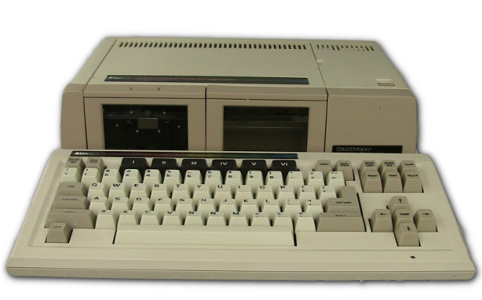
|===

La versión para neptUNO+ está basada en https://github.com/MiSTer-devel/ColecoAdam_MiSTer[la existente para MiSTer] y tiene, entre otras, las siguientes características:

- Modo ordenador Adam con soporte para discos (`DSK`) y Data Packs (`DDP`)
- Modo consola Coleco con soporte para ROM en formato `COL`, `BIN`, `ROM`
- Sin soporte para impresora
- Sin soporte de escritura en `DSK` o `DDP`

===== Formato de Tarjeta microSD

Se debe utilizar una tarjeta microSD con la primera partición en formato exFAT o FAT32, para almacenar todos los ficheros necesarios.

Según el modo de funcionamiento, es posible cargar ficheros de cartucho en formato `DSK`, `DDP`, `COL`, `BIN` o `ROM` desde la tarjeta microSD.

===== Controles

====== Teclas especiales y botones

Durante la ejecución del core:

- `F12`: mostrar y ocultar el menú de control del core

<<<

===== Guía básica

Al pulsar `F12`, se mostrará el menú con las distintas opciones del core. Se puede navegar utilizando las teclas de cursor. `Enter` selecciona un elemento. `F12` oculta el menú si se estaba mostrando.

[role="center",width="50%",cols="1a", frame=none, grid=none]
|===
|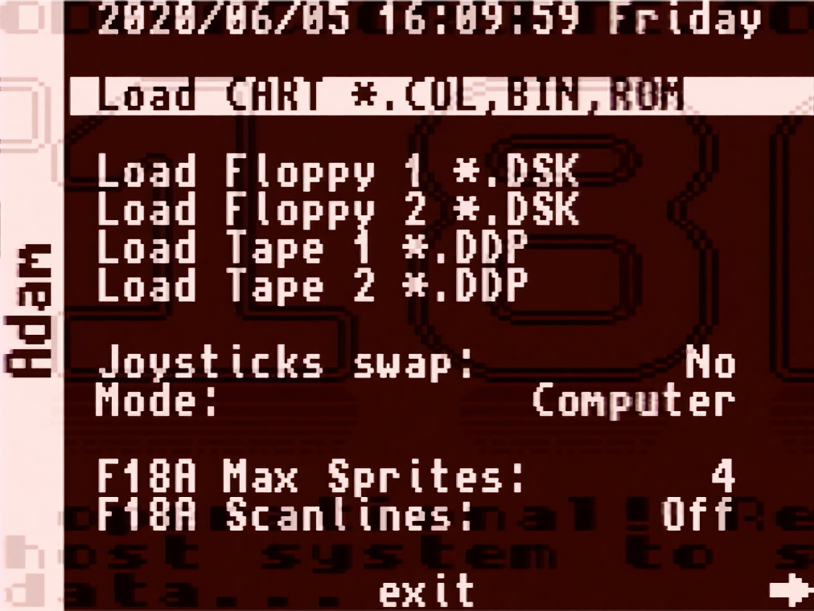
|===

En él se pueden activar, desactivar o configurar las siguientes opciones:

- `Load CART`: Para cargar un fichero de imagen de cartucho (ROM). Backspace (la tecla de borrar hacia atrás, encima de `Enter`) quita un disco asignado previamente
- `Load Floppy 1`: Cargar fichero `DSK` en la disquetera principal. Backspace (la tecla de borrar hacia atrás, encima de `Enter`) quita un disco asignado previamente
- `Load Floppy 2`: Cargar fichero `DSK` en la disquetera secundaria
- `Load Tape 1`: Cargar fichero `DDP`. Backspace (la tecla de borrar hacia atrás, encima de `Enter`) quita un disco asignado previamente
- `Load Tape 2`: Cargar fichero `DDP`
- `Joysticks Swap`: Para intercambiar los controles del jugador 1 y el jugador 2
- `Mode`: Para alternar entre el modo ordenador y el modo consola
- `F18A Max Sprites`: Configura el máximo de sprites del chip gráfico
- `F18A Scanlines`: Activa o desactiva el efecto de línea de exploración

<<<

[role="center",width="70%",cols="1a", frame=none, grid=none]
|===
|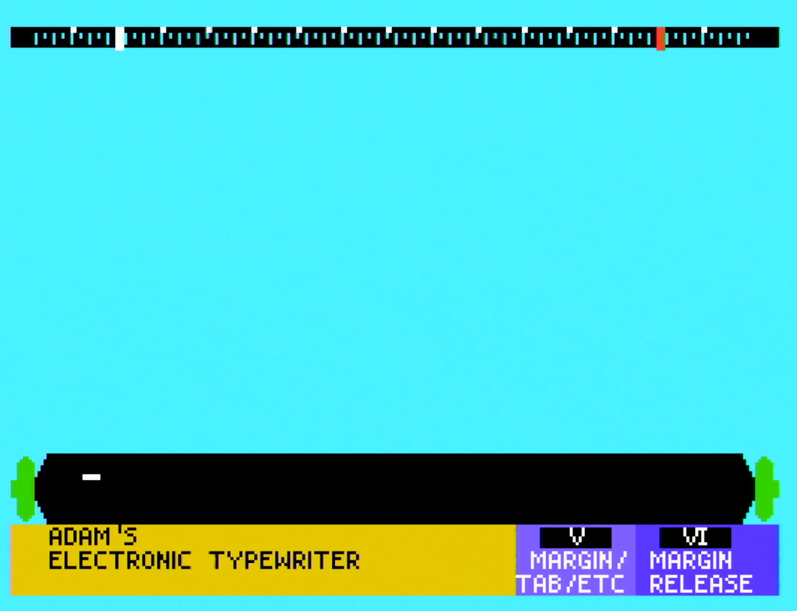
|===

Cuando se inicia el core sin tener ningún disco o data pack insertado, aparece la interfaz de máquina de escribir electrónica (Adam's Electronic Typewriter).

En general, los discos y data pack se inician automáticamente. Para ello, elegir en el menú el fichero correspondiente, y luego elegir la opción `Reset`.

<<<

[%always]
<<<

==== Commodore 16

[role="center",width="100%",cols="5a,1a", frame=none, grid=none]
|===
|[.text-justify]
El https://es.wikipedia.org/wiki/Commodore_16[Commodore 16] es un ordenador doméstico fabricado por la empresa Commodore International en 1984.
|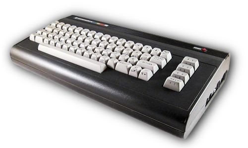
|===

https://github.com/rampa069/c16[El core de neptUNO+] está basado en el https://github.com/mist-devel/c16[proyecto FPGATED de István Hegedus], con algunos pequeños cambios y mejoras, como la lectura de cassetes reales por audio.

Características:

- Implementa un Commodore 16 PAL ampliado a 64K de RAM
- Carga de programas desde ficheros `PRG` y de cinta `TAP`
- Disquetera 1541 de sólo lectura (compatible con imágenes .D64)
- Switch entre modos PAL y NTSC
- Scanlines en modo VGA

===== Formato de Tarjeta microSD

Se debe utilizar una tarjeta microSD con la primera partición en formato exFAT o FAT32.

Además es necesario un fichero llamado `c16.rom`. Este fichero está compuesto, secuencialmente, por los datos de las siguientes ROM:

- `C1541`
- `Kernal`
- `Basic`
- `Function LOW` (opcional)
- `Function HIGH` (opcional)

También es interesante disponer de uno o más ficheros con programas (`PRG`), cinta (`TAP`) o imágenes de disco (`D64`) con el software que se quiera ejecutar.

Copiar el fichero `c16.rom` al mismo lugar donde se encuentre el fichero del core en la tarjeta microSD. Copiar los ficheros `PRG`,`D64` al lugar que se desee dentro de la tarjeta.

===== Controles

====== Teclas especiales y botones

Durante la ejecución del core:

- `F1` a `F3`: F1 a F3
- `F4`: HELP
- `F12`: mostrar y ocultar el menú de control del core

<<<

===== Guía básica

Al pulsar `F12`, se mostrará el menú con las distintas opciones del core. Se puede navegar utilizando las teclas de cursor. `Enter` selecciona un elemento. `F12` oculta el menú si se estaba mostrando.

[role="center",width="50%",cols="1a", frame=none, grid=none]
|===
|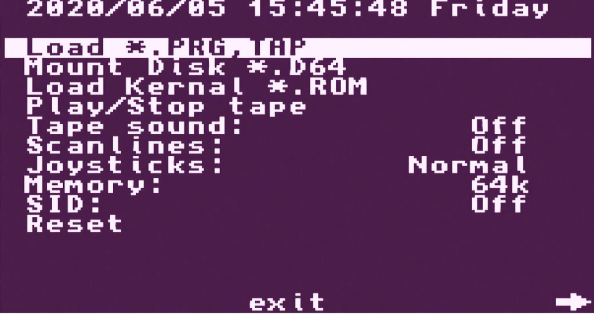
|===

En él se pueden activar, desactivar o configurar las siguientes opciones:

- `LOAD PRG, TAP`: Para cargar un fichero de programa o de cinta
- `Mount Disk`: Para montar un archivo de imagen de disco
- `Load Kernal ROM`: Para cargar una imagen alternativa de Kernal
- `Play/Stop Tape`: Reproducir o detener una cinta cargada previamente
- `Tape Sound`: Habilita o deshabilita el sonido de carga de cinta
- `Scanlines`: Activa el efecto de línea de exploración (sólo en VGA)
- `Joysticks`: Permite intercambiar el orden de los mandos del jugador 1 y jugador 2
- `Memory`: Alterna entre 16k y 64k
- `SID`: Habilita o deshabilita el chip de sonido SID deseado
- `Reset`: Reinicia el core
- `Exit`: Sale del menú de configuración

Tras cargar un programa `PRG`,  escribir `RUN` y pulsar `Enter` para ejecutarlo.

Desde BASIC, se puede cargar desde una cinta con el comando `LOAD`. Una vez finalizadada la carga, escribir `RUN` y pulsar `Enter` si fuese necesario.

Para listar el directorio del disco seleccionado, pulsar `F3` o introducir el comando `DIRECTORY`. Para cargar un fichero del disco, usar el comando `DLOAD"<nombre de fichero>"` y luego, normalmente, `RUN`.

Para cargar rápidamente el primer fichero `PRG` de un disco pulsar `Mayús+TAB` o usar el comando `DLOAD"*"`, y luego, normalmente, `RUN`.

<<<

==== Commodore 64

[role="center",width="100%",cols="5a,1a", frame=none, grid=none]
|===
|[.text-justify]
Commodore 64 (C64, CBM 64/CBM64, C=64,C-64, VIC-641​) era una https://es.wikipedia.org/wiki/Commodore_64[computadora doméstica de 8 bits] desarrollada por Commodore International en 1982.
|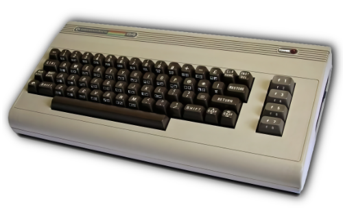
|===

https://github.com/delgrom/c64[El core de neptUNO+] está basado en el https://github.com/mist-devel/c64[desarrollado para MiST].

Características:

- Salida RGB (15KHz) y VGA (31Khz)
- Soporte  PAL(50Hz) y NTSC(60Hz)
- Salida de sonido SID
- Carga de programas desde la microSD
- Carga de imágenes de disco desde microSD

===== Formato de Tarjeta microSD

Se debe utilizar una tarjeta microSD con la primera partición en formato exFAT o FAT32.

Además es necesario un fichero llamado `c64.rom` con las ROM correspondientes.

También es interesante disponer de uno o más ficheros con programas (`PRG`, ), cinta (`TAP`) o imágenes de disco (`D64`) con el software que se quiera ejecutar.

Copiar el fichero `c64.rom` al mismo lugar donde se encuentre el fichero del core en la tarjeta microSD. Copiar los ficheros `PRG`,`D64`, etc. al lugar que se desee dentro de la tarjeta.

===== Controles

====== Teclas especiales y botones

Durante la ejecución del core:

- `Esc`: Start/Stop
- `Alt Izda` = Commodore
- `F1` a `F8`: F1 a F8
- `F9`: Tecla del símbolo de la libra
- `F10`: Tecla del símbolo `+`

<<<

===== Guía básica

Al pulsar `F12`, se mostrará el menú con las distintas opciones del core. Se puede navegar utilizando las teclas de cursor. `Enter` selecciona un elemento. `F12` oculta el menú si se estaba mostrando.

[role="center",width="50%",cols="1a", frame=none, grid=none]
|===
|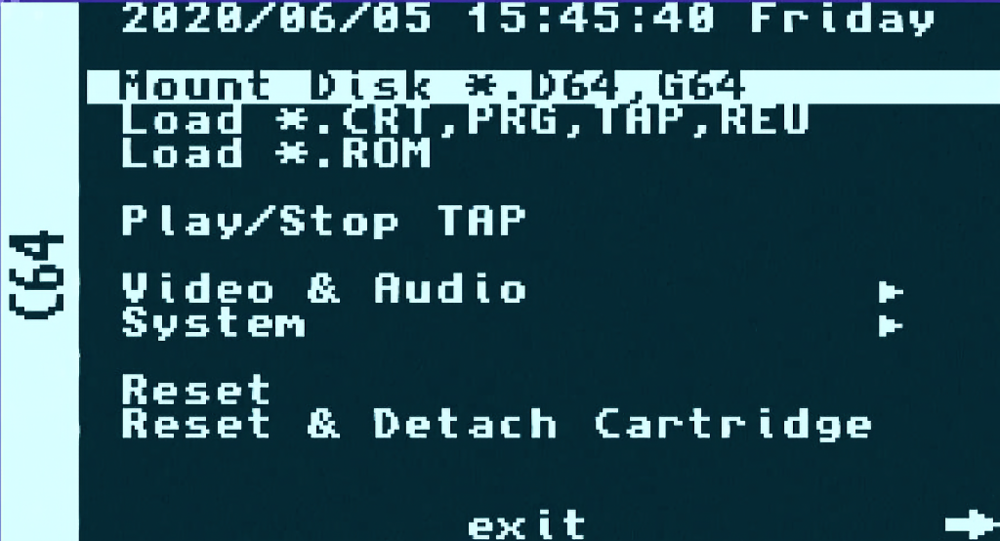
|===

- `Mount Disk`: Para montar un archivo de imagen de disco
- `LOAD CRT, PRG, TAP, REU`: Para cargar un fichero de programa o de cinta
- `Load ROM`: Para cargar una imagen alternativa de ROM
- `Play/Stop TAP`: Reproducir o detener una cinta cargada previamente
- `Reset`: Reinicia el core
- `Reset & Detach Cartridge`: Reinicia el core, expulsando el cartucho si hubiera uno insertado
- `Exit`: Sale del menú de configuración

Si se elige la opción `Video & Audio` en el menú principal del core, se mostrará este otro menú.

[role="center",width="50%",cols="1a", frame=none, grid=none]
|===
|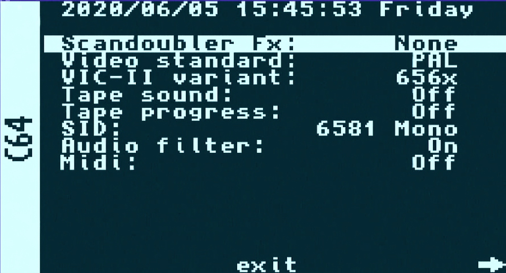
|===

Desde aquí se pueden modificar los siguientes ajustes:

- `Scandoubler FX`: Activa diferentes efectos de vídeo (sólo en VGA)
- `Video Standard`: Elige entre PAL y NTSC
- `VIC II Variant`: Para seleccionar el modelo de chip gráfico a usar
- `Tape Sound`: Habilita o deshabilita el sonido de carga de cinta
- `Tape Progress`: Mostrar información durante la reproducción de un archivo de cinta
- `SID`: Elige el chip de sonido SID deseado
- `Audio filter`: Permite deshabilitar o habilitar el filtro de sonido
- `Midi`:

<<<

Si se elige la opción `System` en el menú principal del core, se mostrará este otro menú.

[role="center",width="50%",cols="1a", frame=none, grid=none]
|===
|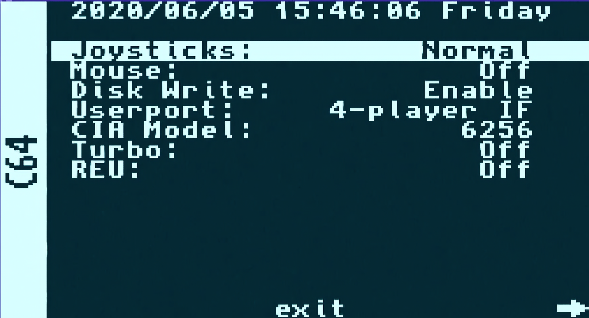
|===

Desde aquí se pueden modificar los siguientes ajustes:

- `Joysticks`: Permite intercambiar el orden de los mandos del jugador 1 y jugador 2
- `Mouse`: Para activar el soporte de ratón
- `Disk Write`: Permite desactiva o activar la escritura en las imágenes de disco
- `Userport`: Para configurar el puerto de expansión entre el uso como acceso a mandos de juego extra, etc.
- `CIA Model`: Para elegir el modelo de chip CIA a usar
- `Turbo`: Activa o desactiva el modo turbo del core
- `REU`: Para activar expansiones de memoria

Desde BASIC, se puede cargar desde una cinta con el comando `LOAD`. Una vez finalizadada la carga, escribir `RUN` y pulsar `Enter` si fuese necesario.

Para cargar desde un disco, habitualmente, se puede pulsar `Mayus+Esc` o bien escribir `LOAD "*",8,1` y pulsar `Enter`. Una vez aparezca `READY` en la pantalla, escribir `RUN` y pulsar `Enter` para ejecutar el programa.

Si el disco tuviera varios programas, usar `F1` para listar el contenido, o bien escribir `LOAD "$",8` y pulsar `Enter`. A continuación, escribir `LIST`, y pulsar `Enter`, para ver una lista con los archivos dentro del disco.

Ahora, para cargar el archivo deseado, escribir `LOAD "<nombre>",8` (donde `<nombre>` es el nombre del archivo a cargar) y pulsar `Enter`. Una vez aparezca `READY` en la pantalla, escribir `RUN` y pulsar `Enter` para ejecutar el programa. Si esto no funcionase, probar con el comando `LOAD "<nombre>",8,1`.

[TIP]
====
Se puede usar el símbolo `*` al cargar un programa para no tener que escribir el nombre completo. Así, si por ejemplo hubiera un programa con el nombre `BRUCE LEE.PRG`, y ningún otro con un nombre parecido, el comando `LOAD "BRUCE*",8,1`, lo cargaría.
====

<<<

[%always]
<<<

==== Jupiter ACE

[role="center",width="100%",cols="5a,1a", frame=none, grid=none]
|===
|[.text-justify]
El https://es.wikipedia.org/wiki/Jupiter_Ace[Jupiter ACE] es un microordenador británico lanzado al mercado en 1982 por la empresa Jupiter Cantab.
|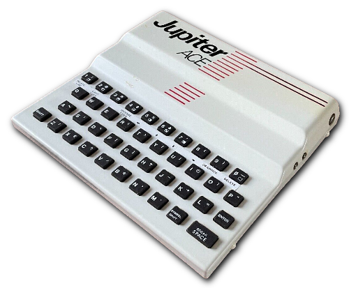
|===

El https://github.com/neptUNO+/jupiter_ace[core para neptUNO+] ha sido desarrollado por Kyp a partir del esquema de la máquina original.

Tiene, entre otras, las siguientes características:

- Salida de vídeo VGA y RGB
- Soporte para carga desde dispositivos de audio externo o desde ficheros TZX
- Memoria de usuario configurable entre 3KB y 51KB

===== Formato de Tarjeta microSD

Se puede utilizar una tarjeta microSD con la primera partición en formato exFAT o FAT32.

Es interesante disponer de uno o más ficheros con programas en cinta (`TZX`) con el software que se quiera ejecutar.

===== Controles

====== Teclas especiales y botones

Durante la ejecución del core:

- `Re Pág`: Reproducir TZX (cargado previamente desde el menú)
- `Av Pág`: Detener la reproducción de TZX
- `F9`: Reset
- `F12`: mostrar y ocultar el menú de control del core

<<<

Al pulsar `F12`, se mostrará el menú con las distintas opciones del core. Se puede navegar utilizando las teclas de cursor. `Enter` selecciona un elemento. `F12` oculta el menú si se estaba mostrando.

[role="center",width="50%",cols="1a", frame=none, grid=none]
|===
|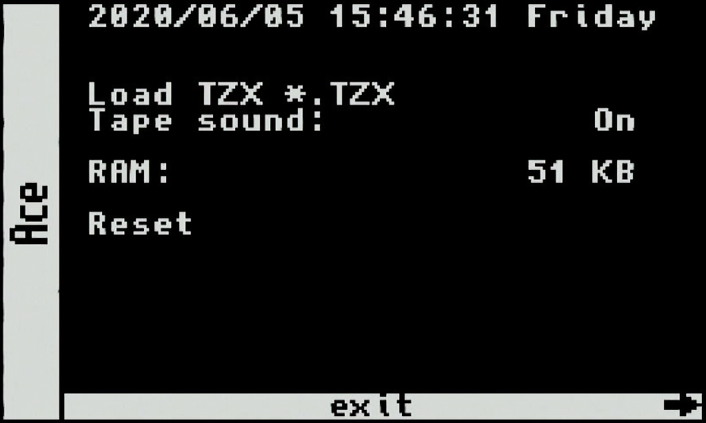
|===

- `Load TZX`: Para elegir un fichero de cinta
- `Tape Sound`: Para escuche, o no, el sonido de carga de cinta
- `RAM`: Para elegir la cantidad de RAM a asignar
- `Reset`: Reinicia el core
- `Exit`: Cierra el menú de opciones

Desde Forth, se puede cargar desde una cinta (u <<#_miniduino,otro dispositivo externo de audio>>), o un fichero TZX cargado desde el menú, con el comando `LOAD <nombre>`.

[CAUTION]
====
Los ficheros `TAP` de Jupiter ACE son diferentes de los de ZX Spectrum, y, para poder utilizarse con algunos reproductores o versiones antiguas de firmware de <<#_miniduino,Miniduino o Maxduino>>, han de ser convertidos previamente a `TZX` con la utilidad `acetap2zx` disponible en el https://github.com/mcleod-ideafix/jupiter_ace_tap_to_tzx/tree/master[repositorio de McLeod].
====

Una vez la cinta ha cargado, escribir el comando necesario para iniciar el programa.

[NOTE]
====
En lugar de BASIC como otros sistemas, el Jupiter ACE utiliza https://es.wikipedia.org/wiki/Forth[Forth]. Para ver los comandos disponibles (incluyendo los que inician un programa cargado desde cinta), se tiene que utilizar `vlist`.
====

<<<

==== Mega65

[role="center",width="100%",cols="5a,1a", frame=none, grid=none]
|===
|[.text-justify]
Este core es una adaptación del https://github.com/MEGA65/mega65-core[core original] utilizado por el proyecto https://mega65.org[Mega65], cuya meta consiste en recrear el Commodore 65 (también conocido como C64DX), un prototipo de ordenador creado en Commodore Business Machines en 1990-1991. Es una versión mejorada del Commodore 64, y se pretendía que fuera retrocompatible con el ordenador anterior, al tiempo que proporcionaba una serie de características avanzadas cercanas a las del Amiga.
|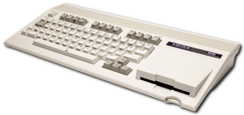
|===

Algunas de las características del core son:

- CPU GS4510
- 384 KB de RAM rápida accesible para el VIC-IV (128 KB ocupados por la ROM)
- 8MB de «Hyper RAM
- 32KB de RAM color accesible par el  VIC-IV
- GPU VIC IV (retrocompatible con VIC-III y VIC-II)
- Memoria gráfica de 128 KB
- Paleta de 2^23 colores (23 Bits: 7 rojo, 8 verde, 8 azul)
- Sprites de hasta 256 colores
- Cuatro soft-SID + cuatro DAC conmutables de 4/8/16 bits.
- Soporte para imágenes de disco desde tarjeta microSD

<<<

===== Formato de Tarjeta microSD

Se necesita una tarjeta microSD https://es.wikipedia.org/wiki/SDHC[SDHC] con, al menos, 4GB de capacidad.

Aunque el formato necesario para la tarjeta microSD está basado en FAT32, y es compatible con el resto de cores, es necesario realizar dicho formato desde el propio core de Mega65, antes de poder utilizarla.

[CAUTION]
====
El proceso que se describe a continuación borrará completamente la tarjeta microSD. Se debe tener una copia de seguridad aparte de todo el contenido que se desee conservar.
====

. Iniciar el core manteniendo pulsada la tecla `Alt`. Si se hace correctamente, aparecerá una imagen como la siguiente.

[role="center",width="70%",cols="1a", frame=none, grid=none]
|===
|image:img/mega65_alt.png[scaledwidth=100%]
|===

[start=2]
. Pulsar `2` para comenzar el proceso de borrado y formateo de la tarjeta

[role="center",width="70%",cols="1a", frame=none, grid=none]
|===
|image:img/mega65_format1.png[scaledwidth=100%]
|===

<<<

[start=3]
. Pulsar `Enter`

[role="center",width="70%",cols="1a", frame=none, grid=none]
|===
|image:img/mega65_format2.png[scaledwidth=100%]
|===

[start=4]
. Escribir, usando letras mayúsculas, el texto `DELETE EVERYTHING`

[role="center",width="70%",cols="1a", frame=none, grid=none]
|===
|image:img/mega65_format3.png[scaledwidth=100%]
|===

[start=5]
. Pulsar `Enter` y esperar mientras se hace el formateo

[role="center",width="70%",cols="1a", frame=none, grid=none]
|===
|image:img/mega65_format4.png[scaledwidth=100%]
|===

<<<

[start=6]
. Si se hace correctamente, aparecerá una imagen como la siguiente.

[role="center",width="70%",cols="1a", frame=none, grid=none]
|===
|image:img/mega65_format5.png[scaledwidth=100%]
|===

[start=7]
. Ahora se ha de apagar el neptUNO+, extraer la tarjeta, y copiar dentro, tanto los https://files.mega65.org/?id=0fb941fe-5c5f-4608-b0f1-32849d4a8dff[ficheros necesarios] https://retrocombs.com/mega65[para Mega65], como otros ficheros de neptUNO+ que se quiera utilizar (por ejemplo, el menú core de Mist y el fichero `RBF` con el core de Mega65)

[role="center",width="70%",cols="1a", frame=none, grid=none]
|===
|image:img/mega65_format6.png[scaledwidth=100%]
|===

Tras este proceso, se dispondrá de una tarjeta compatible con el core y lista para usar.

<<<

===== Guía básica

Si se formateado adecuadamente y se han copiado todos los ficheros en la tarjeta microSD, incluyendo los de demo, y se inicia el core, aparecerá una imagen parecida a la siguiente:

[role="center",width="70%",cols="1a", frame=none, grid=none]
|===
|image:img/mega65_demo.png[scaledwidth=100%]
|===

Es recomendable consultar la https://dansanderson.com/mega65/welcome/singlehtml/[guía oficial de bienvenida] donde se explican conceptos importantes del uso del ordenador Mega65.

<<<

[%always]
<<<

==== MSX1

[role="center",width="100%",cols="5a,1a", frame=none, grid=none]
|===
|[.text-justify]
MSX1FPGA es un proyecto para clonar MSX1 en una FPGA. El desarrollo original es de Fabio Belavenuto y se encuentra disponible https://github.com/fbelavenuto/msx1fpga[en GitHub].
|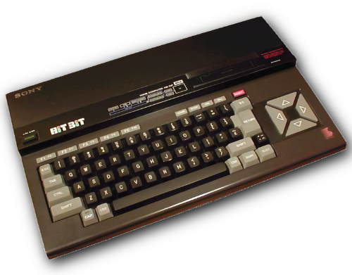
|===

Algunas de sus características son:

- Acceso directo a microSD
- Carga de ficheros de imagen de disco
- Soporte para Nextor ROM con un controlador para SD
- F18A (implementación de la familia de VDP Texas Instruments TMS-9918AP)
- Simulación de línea de exploración (Scanlines)
- Soporte para joystick

===== Formato de Tarjeta microSD

Se puede utilizar una tarjeta microSD con la primera partición en formato FAT16 (https://es.wikipedia.org/wiki/C%C3%B3digo_de_tipo_de_partici%C3%B3n[código de partición `0x06` (16-bit FAT)].

Otra opción consiste en utilizar una tarjeta micrSD con la primera partición en formato exFAT, FAT32 o FAT16 y un <<#_acerca_de_los_ficheros_vhd,fichero VHD de imagen de disco>>, con formato FAT16 (https://es.wikipedia.org/wiki/C%C3%B3digo_de_tipo_de_partici%C3%B3n[código de partición `0x06` (16-bit FAT)]), conteniendo los ficheros o programas que se quieran utilizar. Si este fichero está en la raíz de la microSD, y se llama `msx1.vhd`, se cargará automáticamente.

También se pueden cargar directamente desde la microSD ficheros de imagen de disco (`.DSK`, `.IMG`).

Para preparar la microSD o la imagen `VHD`, obtener lo siguiente:

- Ficheros básicos del proyecto para la microSD https://github.com/fbelavenuto/msx1fpga/tree/master/Support/SD[desde GitHub]
- Controlador (`NEXTOR.SYS`) y ROM (`NEXTOR.ROM`) de Nextor https://github.com/fbelavenuto/msx1fpga/tree/master/Software/nextor[también desde GitHub]

Se ha de instalar según se haya decidido, directamente en la tarjeta microSD o en el fichero `VHD`:

- El contenido del https://github.com/fbelavenuto/msx1fpga/tree/master/Support/SD[directorio SD] en la raíz de la primera partición.
- Copiar `NEXTOR.SYS` en el mismo lugar.
- Copiar `NEXTOR.ROM` en el directorio `MSX1FPGA`.

<<<

En el fichero `/MSX1FPGA/config.txt` se guarda la configuración del core, según este formato:

----
11SP01
||||||
|||||+-Modo de línea de exploración: 1=Activo, 0=Inactivo
||||+--Turbo: 1=Arrancar con el modo turbo activo
|||+---Sistema de color: N=NTSC, P=PAL
||+----Mapa de Teclado: E=Inglés, B=Brasileño, F=Francés, S=Castellano
|+-----Scandoubler(VGA): 1=Activo, 0=Inactivo
+------Nextor: 1=Activo, 0=Inactivo
----

Se pueden encontrar imágenes `VHD` ya preparadas, como la de http://www.forofpga.es/viewtopic.php?t=316[MSX1PACK].

===== Controles

====== Teclas especiales y botones

Durante la ejecución del core:

- `F1` a `F5`: `F1` a `F5`
- `ALT Izquierdo`: MSX GRAPH
- `ALT Derecho`: MSX CODE
- `Re Pág`: MSX SELECT
- `Inicio`: MSX HOME (`Mayús Dcha+Inicio`: CLS)
- `Fin`: MSX STOP
- `F12`: mostrar y ocultar el menú de control del core

[NOTE]
====
En BASIC, se puede usar `CTRL + STOP` (`Ctrl+Fin`) para detener la ejecución de un programa.
====

<<<

===== Guía básica

Al pulsar `F12`, se mostrará el menú con las distintas opciones del core. Se puede navegar utilizando las teclas de cursor. `Enter` selecciona un elemento. `F12` oculta el menú si se estaba mostrando.

[role="center",width="50%",cols="1a", frame=none, grid=none]
|===
|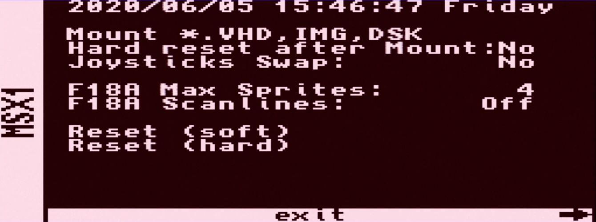
|===

- `Mount`: Para cargar un fichero de imagen de disco
- `Hard reset after mount`: Establece si se debe hacer un reinicio del core tras montar un disco
- `Joysticks Swap`: Para intercambiar los controles del jugador 1 y el jugador 2
- `F18A Max Sprites`: Máximo de sprites posibles en el chip de VDP
- `F18A Scanlines`: Activar o desactivar línea de exploración
- `Reset (soft)`: Reinicia el core en caliente
- `Reset (hard)`: Reinicia el core
- `Exit`: Cierra el menú de opciones

Para acceder a BASIC desde MSX-DOS, ejecutar el comando `BASIC`.

Para acceder a MSX-DOS desde BASIC, ejecutar `CALL SYSTEM`.

<<<

===== MSXCTRL

Se trata de una utilidad exclusiva de los cores basados en MSX1FPGA, que sirve para controlar todas las opciones del core que antes solo eran accesibles a través del fichero de configuración o pulsando determinadas teclas.

Al ejecutar `MSXCTRL` se muestran los parámetros de uso:

----
MSXCTRL.COM - Utility to manipulate MSX1FPGA core.
HW ID = 08 - BigMiST
Version 1.3
Mem config = 84
Has HWDS = FALSE

Use:

MSXCTRL -h -i -r -b -[5|6] -m<0-2>
        -c<0-1> -d<0-1> -t<0-1>
        [-w<filename> | -l<filename>]
        -k<0-255> -e<0-255> -p<0-255>
        -s<0-255> -o<0-255> -a<0-255>
(...)
----

`MSXCTRL -h` muestra ayuda para cada parámetro. Así, `MSXCTRL -i` presenta la configuración actual, etc.

===== Otros

El comando https://github.com/fbelavenuto/msx1fpga/blob/master/Support/SD/UTIL/TURBO.COM[`TURBO`] sirve para activar o desactivar el modo turbo desde la línea de comandos.

Existen múltiples sistemas para cargar los juegos dependiendo del tipo de archivo: .CAS, .DSK o ROM (ver https://www.zxuno.com/forum/viewtopic.php?f=53&t=2080[este hilo del foro de ZX-Uno] para más información).

<<<

==== MSX2

[role="center",width="100%",cols="5a,1a", frame=none, grid=none]
|===
|[.text-justify]
En 1985 apareció una nueva versión de las https://es.wikipedia.org/wiki/MSX[máquinas MSX] que se denominó MSX2. Presentaba el mismo procesador Z80A pero se habían implementado mejoras sobre todo gráficas y sonoras, con nuevos chip de vídeo y de sonido así como unidades de disquete incluidas en el propio armazón de la máquina.
|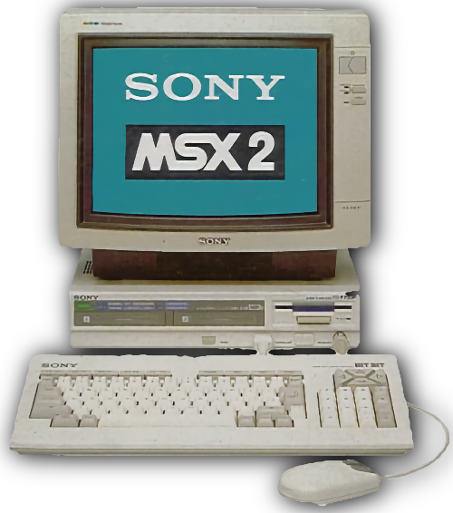
|===

La versión para neptUNO+ está basada en la https://github.com/mist-devel/MSX_MiST[implementación para MiST].

Algunas de las características del core son:

- Velocidad de CPU normal y turbo
- 2 MB/ 4MB de RAM interna
- Varias extensiones en Slot 1 y Slot 2
- Soporte de tarjeta SD virtual para MSX-DOS

===== Formato de Tarjeta microSD

Se debe utilizar una tarjeta microSD con la primera partición en formato exFAT, FAT16 o FAT32.

Se necesitar poner, en la microSD, un <<#_acerca_de_los_ficheros_vhd,fichero VHD de imagen de disco>>, con formato FAT16 (https://es.wikipedia.org/wiki/C%C3%B3digo_de_tipo_de_partici%C3%B3n[código de partición `0x06` (16-bit FAT)]) tal que el primer fichero copiado en el directorio raíz sea un fichero de BIOS llamado `OCM-BIOS.DAT` que se puede obtener del https://gnogni.altervista.org/[OCM-EXTRA Pack]. Si este fichero está en la raíz de la microSD, y se llama `msx.vhd`, se cargará automáticamente.

Además, es recomendable hacer una instalación, dentro del fichero VHD, de MSX-DOS y los ficheros o programas que se quieran utilizar.

Se pueden encontrar diversas imágenes `VHD` ya preparadas en internet, como la de https://www.retrowiki.es/viewtopic.php?p=200138120#p200138120[MSX2PACK].

<<<

===== Controles

====== Teclas especiales y botones

Durante la ejecución del core:

- `F1` a `F5`: `F1` a `F5`
- `ALT Izquierdo`: MSX GRAPH
- `ALT Derecho`: MSX CODE
- `Re Pág`: MSX SELECT
- `Inicio`: MSX HOME (`Mayús Dcha+Inicio`: CLS)
- `Fin`: MSX STOP
- `F12`: mostrar y ocultar el menú de control del core

[NOTE]
====
En BASIC, se puede usar `CTRL + STOP` (`Ctrl+Fin`) para detener la ejecución de un programa.
====

<<<

===== Guía básica

Al pulsar `F12`, se mostrará el menú con las distintas opciones del core. Se puede navegar utilizando las teclas de cursor. `Enter` selecciona un elemento. `F12` oculta el menú si se estaba mostrando.

[role="center",width="50%",cols="1a", frame=none, grid=none]
|===
|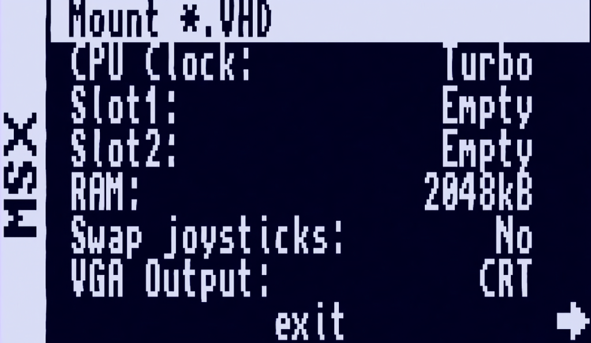
|===

- `Mount VHD`: Para cargar un fichero de imagen de disco
- `CPU Clock`: Activa o desactiva el modo turbo
- `Slot 1`: Para asignar, opcionalmente, la extensión Mega-SCC (1MB)
- `Slot 2`: Para asignar, opcionalmente, la extensión Mega-SCC (2MB) o https://www.msx.org/wiki/Megaram[MegaRAM] (1MB ó 2MB)
- `RAM`: Define la cantidad de RAM estándar disponible en el core
- `Swap Joysticks`: Para intercambiar los controles del jugador 1 y el jugador 2
- `VGA Output`: Ajusta el comportamiento de la salida en modo VGA para CRT o LCD
- `Tape Sound`: Activar o desactivar el sonido de carga de cinta
- `UART TX`:
- `Reset`: Reinicia el core
- `Exit`: Cierra el menú de opciones

<<<

[%always]
<<<

==== Oric-1 y Oric Atmos

[role="center",width="100%",cols="4a,1a,1a", frame=none, grid=none]
|===
|[.text-justify]
El https://es.wikipedia.org/wiki/Oric_1[Oric-1] fue un ordenador doméstico fabricado por Tangerine Computer Systems, en 1983. Su sucesor fue el https://es.wikipedia.org/wiki/Oric_Atmos[Oric Atmos], en el año siguiente.
|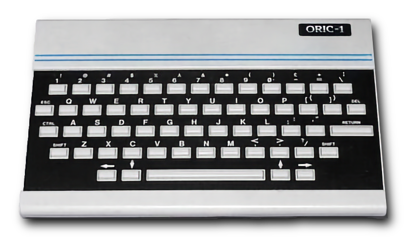
|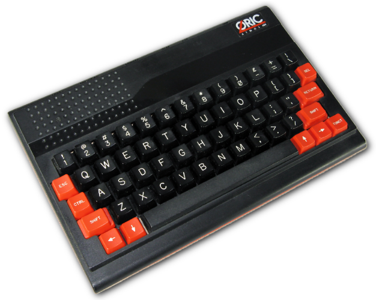
|===

El core de neptUNO+ está basado en https://github.com/BigMist/Oric[la versión de Rampa para MiST, Mistica y SiDi], y tiene, entre otras, las siguientes características:

- Soporte para Oric 1, Oric Atmos
- ULA HCS10017
- VIA 6522
- CPU 6502
- 64KB completos de RAM
- Teclado gestionado por GI-8912
- Sonido (AY-3-8910)
- ROM conmutable (entre versión 1.1a ATMOS y versión 1.0 ORIC 1).
- Carga de cinta (vía cable de audio).
- Operaciones de lectura/escritura de disco en imágenes con formato EDSK (El mismo que amstrad cpc).
- Carga del Sistema Operativo Disc Sedoric/OricDOS

<<<

===== Formato de Tarjeta microSD

Se debe utilizar una tarjeta microSD con la primera partición en formato exFAT, FAT16 o FAT32.

Además, es recomendable copiar ficheros de imagen de disco `DSK`. Notar que, aunque la extensión utilizada es `.dsk`, las imágenes han de ser en formato EDSK estándar (también conocido como "Amstrad CPC Etended Format"). Para convertir imágenes en formato `DSK` de Oric, se puede utilizar https://hxc2001.com/download/floppy_drive_emulator/index.html [HxCFloppyEmulator] que se puede descargar https://hxc2001.com/download/floppy_drive_emulator/HxCFloppyEmulator_soft.zip[desde aquí]. El formato a seleccionar para la exportación es `CPC DSK`.

Opcionalmente se puede crear un directorio llamado `ORIC` en la raíz de la microSD, que será utilizado por defecto para buscar ficheros de imagen de disco, etc.

===== Controles

====== Teclas especiales y botones

Durante la ejecución del core:

- `F10`: Botón NMI, actúa como el NMI original de ORIC
- `F11`: Reset. Útil una vez que una imagen de disco se haya seleccionado en el menú
- `F12`: Menú principal OSD.

====== Joystick

Pocos juegos de Oric tienen algún tipo de soporte para joystick, pero se pueden asignar las teclas más comúnmente utilizadas a un joystick añadiendo lo siguiente al fichero `mist.ini`.

[oric]
joy_key_map=1,4f ; cursor derecha
joy_key_map=2,50 ; cursor izquierda
joy_key_map=4,51 ; cursor abajo
joy_key_map=8,52 ; cursor arriba
joy_key_map=10,2c ; botón A como ESPACIO
joy_key_map=40,28 ; botón SEL como ENTER
joy_key_map=80,44 ; botón STA como F11

<<<

===== Guía básica

Al pulsar `F12`, se mostrará el menú con las distintas opciones del core. Se puede navegar utilizando las teclas de cursor. `Enter` selecciona un elemento. `F12` oculta el menú si se estaba mostrando.

[role="center",width="70%",cols="1a", frame=none, grid=none]
|===
|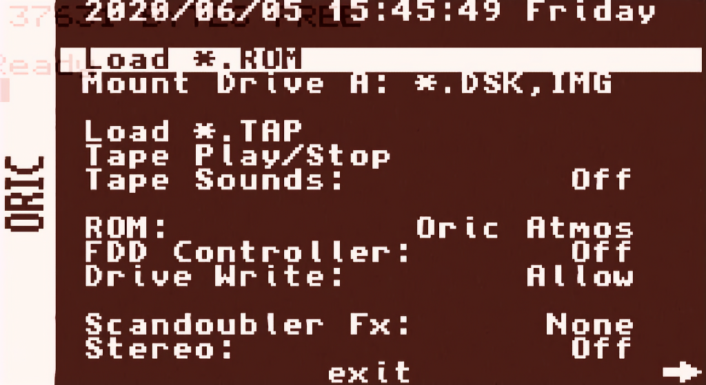
|===

- `Load .ROM`:
- `Mount Drive A`: Permite cargar un fichero de imagen de disco
- `Load TAP`:
- `Tape Play/Stop`:
- `ROM`: Para cambiar entre la ROM de Oric Atmos y Oric-1
- `FDD Controller`: Activa o desactiva la controladora de disco
- `Drive Write`: Para permitir escribir o no en la imagen de disco insertada
- `Scandoubler fx`: Efectos a aplicar (sólo en la salida VGA)
- `Stereo`: Activa o desactiva el sonido estéreo
- `Reset`: Reiniciar el core
- `Exit`: Cierra el menú de opciones

Para cargar una imagen de disco, lo habitual es habilitar la controladora de disco en el menú, cargar la imagen deseada, y luego realizar un reset, bien desde el menú, bien pulsando la tecla `F11`.

<<<

Desde BASIC, también se puede cargar desde una cinta (u <<#_miniduino,otro dispositivo externo de audio>>) usando el comando `CLOAD ""` y `Enter`. A continuación, aparecerá en pantalla el mensaje

[source]
----
Searching...
----

Cuando se detecte un programa en la carga, el texto cambiará a

[source]
----
Loading...<nombre de programa>
----

[TIP]
====
En los http://www.retrowiki.es/viewtopic.php?f=110&t=200037261[foros de RetroWiki] hay disponible un script de linux llamado `calorico.sh` que usa bash y PHP, junto con https://github.com/nataliapc/MSX_devs/tree/master/TSXphpclass[las utilidades TSXphpclass de Natalia Pujol] para convertir ficheros `.TAP` de Oric en archivos `.TSX`.
====

[TIP]
====
El programa https://github.com/oric-international/oric-tools/tree/master/euphoric-tools/tape_tools/wav_format[`tap2wav`] de https://github.com/oric-international/oric-tools/tree/master[oric-tools] permite generar ficheros de audio desde archivos de cinta `TAP` de Oric.
====

<<<

==== Oric Telestrat

[role="center",width="100%",cols="5a,1a", frame=none, grid=none]
|===
|[.text-justify]
El https://es.wikipedia.org/wiki/Oric_Telestrat[Oric Telestrat] fue un ordenador doméstico fabricado por Oric Products International Ltd bajo el nombre inicial de Stratos, en 1983.
|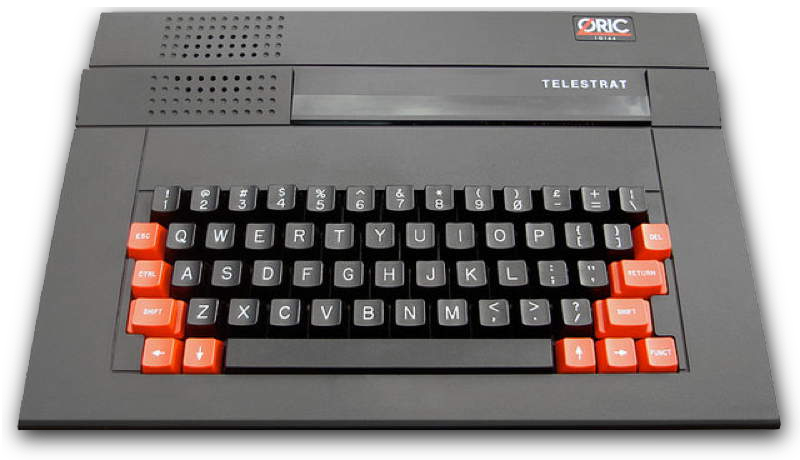
|===

El core de neptUNO+ está basado en https://github.com/BigMist/Oric_Telestrat[la versión de SiDi128, etc.], y tiene, entre otras, las siguientes características:

- Múltiples chips ULA (HCS10017, HCS3119, HCS3120)
- VIA 6522 X2
- CPU 6502
- 128KB de RAM
- Hasta 64K de ROM (Via cartuchos)
- Sonido (AY-3-8912).
- Controladora de disco WD1793 con dos unidades
- Lectura/escritura de disco en imágenes con formato EDSK (El mismo que Amstrad CPC), así como ficheros raw IMG

===== Formato de Tarjeta microSD

Se debe utilizar una tarjeta microSD con la primera partición en formato exFAT, FAT16 o FAT32.

Además, es recomendable copiar ficheros de imagen de disco raw `IMG` o bien `DSK`. Notar que, aunque la extensión utilizada es `.dsk`, las imágenes han de ser en formato EDSK estándar (también conocido como "Amstrad CPC Extended Format"). Para convertir imágenes en otros formatos, se puede utilizar https://hxc2001.com/download/floppy_drive_emulator/index.html [HxCFloppyEmulator] que se puede descargar https://hxc2001.com/download/floppy_drive_emulator/HxCFloppyEmulator_soft.zip[desde aquí]. El formato a seleccionar para la exportación es `CPC DSK` o bien `IMG File (Raw sector file format)`.

Los cartuchos ROM se construyen concatenando los bancos de memoria en este orden: `BANK7+BANK6+BANK5+BANK4`.

Opcionalmente se puede crear un directorio llamado `TeleStrat` en la raíz de la microSD, que será utilizado por defecto para buscar ficheros de imagen de disco, etc.

===== Controles

====== Teclas especiales y botones

Durante la ejecución del core:

- `F11`: Reset.
- `F12`: Menú principal OSD.

<<<

===== Guía básica

Al pulsar `F12`, se mostrará el menú con las distintas opciones del core. Se puede navegar utilizando las teclas de cursor. `Enter` selecciona un elemento. `F12` oculta el menú si se estaba mostrando.

[role="center",width="70%",cols="1a", frame=none, grid=none]
|===
|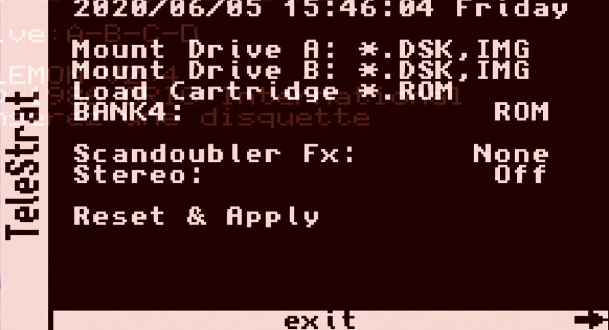
|===

- `Mount Drive A`: Permite cargar un fichero de imagen de disco
- `Mount Drive B`: Permite cargar un fichero de imagen de disco
- `Load Cartridge`: Para cargar un cartucho ROM
- `BANK4`:
- `Scandoubler fx`: Efectos a aplicar (sólo en la salida VGA)
- `Stereo`: Activa o desactiva el sonido estéreo
- `Reset & Apply`: Reiniciar el core y aplicar los cambios del menú
- `Exit`: Cierra el menú de opciones

<<<

==== PC XT

[role="center",width="100%",cols="5a,1a", frame=none, grid=none]
|===
|[.text-justify]
El https://es.wikipedia.org/wiki/IBM_Personal_Computer_XT[IBM Personal Computer XT] o PC/XT es el segundo modelo de la línea PC de IBM, puesto a la venta en 1983.
|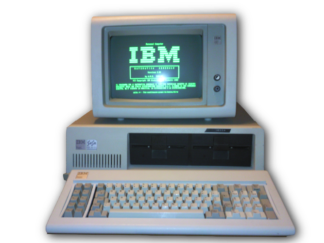
|===

El https://github.com/neptunoplus/Binaries/tree/main/Computers/PCXT[core de neptUNO+] ha sido implementado @somhi a partir del core https://github.com/MiSTer-devel/PCXT_MiSTer[PC XT para MiSTer FPGA] de @spark2k06

Algunas de sus características son:

- CPU 8088 a 4,77 MHz, 7,16 MHz, 9,54 MHz de y PC/AT 286 a 3,5 MHz equivalentes
- Selección de BIOS (Tandy 1000 / PCXT)
- Compatible con IBM Tandy 1000
- Compatible con XT-IDE
- Soporte para IBM PCXT 5160 y clones (gráficos CGA)
- Memoria principal 640Kb + 384Kb de memoria UMB
- Memoria EMS de hasta 2Mb
- MDA monocromo
- Audio Adlib, Tandy, Game Blaster, altavoz
- Soporte para joystick
- Soporte para ratón en el puerto serie COM2, funciona como cualquier ratón Microsoft. Solo se necesita un driver para configurarlo, como CTMOUSE 1.9
- Carga de BIOS y de imágenes de disco desde la tarjeta microSD

<<<

===== Formato de Tarjeta microSD

Se debe utilizar una tarjeta microSD, con la primera partición en formato FAT16 o FAT32, para almacenar los ficheros de imagen de disco y BIOS que se deseen cargar.

Para que los archivos de BIOS se carguen de forma automática, han de estar en la la raíz de la tarjeta microSD con los siguientes nombres:

- `PCXT.ROM` para la BIOS PCXT
- `TANDY.ROM` para la BIOS TANDY 1000
- `XTIDE.ROM` para la BIOS XT-IDE (necesaria para cargar un sistema desde una imagen de disco)

Además también está preparado para trabajar con ficheros de imagen de disco formateado internamente en el sistema de ficheros DOS, como por ejemplo el que está disponible en https://github.com/MiSTer-devel/PCXT_MiSTer/raw/main/games/PCXT/hd_image.zip[el repositorio de código del core].

Al igual que los ficheros de BIOS, si se crean en la raíz de la tarjeta ficheros de imagen de disco con los nombres `PCXT.HD0` (IDE primario) y `PCXT.HD1` (IDE secundario), se cargarán automáticamente al iniciar una BIOS con el core.

Si se quiere disponer de imagens de BIOS alternativas, se pueden dejar en un directorio llamado `PCXT` creado en la raíz de la tarjeta microSD.

===== Controles

====== Teclas especiales y botones

Durante la ejecución del core:

- `F11`: pausar el core y mostrar los créditos de sus creadores
- `F12`: mostrar u ocultar el menú de control del core

<<<

===== Guía Básica

Al iniciar el core, si no hay ficheros válidos de BIOS y de imagen de disco en la raíz de la tarjeta, aparece una imagen como la siguiente:

[role="center",width="80%",cols="1a", frame=none, grid=none]
|===
|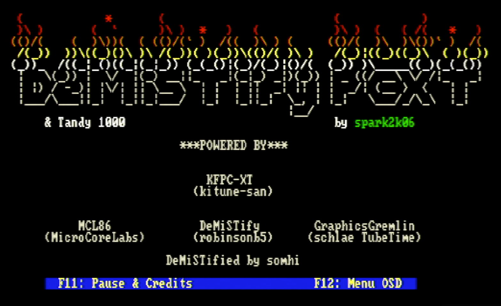
|===

Al pulsar `F12`, se mostrará el menú con las distintas opciones del core. Se puede navegar utilizando las teclas de cursor o un mando. `Enter` o el botón B del mando selecciona un elemento.

[role="center",width="70%",cols="1a", frame=none, grid=none]
|===
|image:img/pcxt_menu.png[scaledwidth=100%]
|===

Estas son las principales:

- `Model`: Para elegir entre PC XT y Tandy
- `CPU Speed`: Velocidad de la CPU. 4.77 MHz ofrece la mejor compatibilidad, 3.5 Mhz la mejor velocidad
- `Exit`: Cierra el menú de opciones del core

<<<

Si se elige la opción `BIOS` en el menú principal del core, se mostrará este otro menú.

[role="center",width="70%",cols="1a", frame=none, grid=none]
|===
|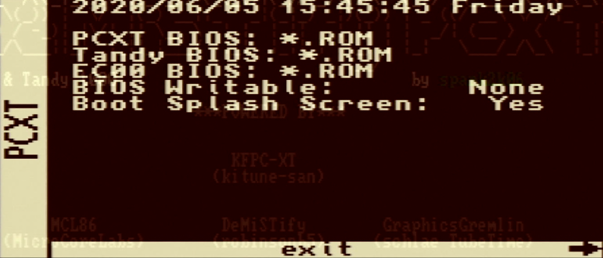
|===

Desde aquí se pueden modificar los siguientes ajustes:

- `PCXT BIOS`: Selección de BIOS para PC XT
- `Tandy BIOS`: Selección de BIOS para Tandy
- `EC00 BIOS`: Selección de BIOS para la carga de discos IDE (`XTIDE`)
- `BIOS writable`: Para permitir o no que la BIOS sea de lectura y escritura
- `Boot Splash Screen`: Para mostrar o no la pantalla de arranque al inicio

Si se elige la opción `Audio` en el menú principal del core, se mostrará este otro menú.

[role="center",width="70%",cols="1a", frame=none, grid=none]
|===
|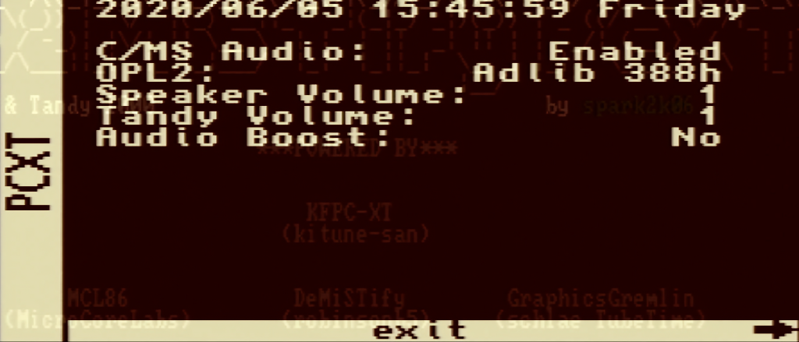
|===

Desde aquí se pueden modificar los siguientes ajustes:

- `C/MS Audio`:
- `OPL2`:
- `Speaker Volume`:
- `Tandy Volume`:
- `Audio Boost`:

<<<

Si se elige la opción `Video` en el menú principal del core, se mostrará este otro menú.

[role="center",width="70%",cols="1a", frame=none, grid=none]
|===
|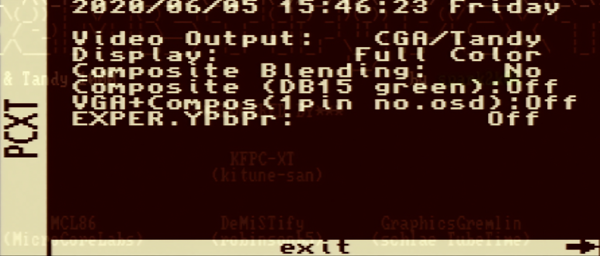
|===

Desde aquí se pueden modificar los siguientes ajustes:

- `Video Output`: Alterna entre el modo CGA/Tandy y el modo MDA monocromo
- `Display`: Alterna entre el modo a color y distintos modos monocromos
- `Composite Blending`: Activa o desactiva un modo de suavizad de los bordes de la imagen
- `Composite (DB15 green)`:
- `VGA+Compos (1pin no osd)`:
- `EXPER. YPbPr`:

Si se elige la opción `Hardware` en el menú principal del core, se mostrará este otro menú.

[role="center",width="70%",cols="1a", frame=none, grid=none]
|===
|image:img/pcxt_hardware.png[scaledwidth=100%]
|===

Desde aquí se pueden modificar los siguientes ajustes:

- `Lo-tech 2MB EMS`:
- `EMS Frame`:
- `A000 UMB`:
- `Joystick 1`:
- `Joystick 2`:
- `Sync Joy to CPU Speed`:
- `Swap Joystick`: Para intercambiar los controles del jugador 1 y el jugador 2

<<<

[%always]
<<<

==== Sharp X68000

[role="center",width="100%",cols="5a,1a", frame=none, grid=none]
|===
|[.text-justify]
https://es.wikipedia.org/wiki/Sharp_X68000[Sharp X68000], es una computadora personal que fue vendida únicamente en Japón. El primer modelo se lanzó en 1987 y el último modelo fue lanzado en 1993.
|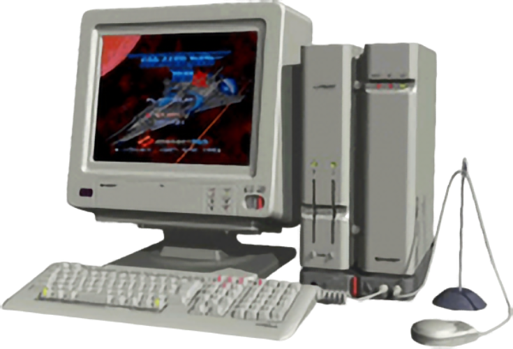
|===

El core de neptUNO+ está basado en https://github.com/BigMist/X68000[la versión de Rampa para MiST, Mistica y SiDi], y tiene, entre otras, las siguientes características:

- Carga de ROM desde microSD
- Soporte para imágenes de disquete `XDF`
- Soporte para imágenes de disco SASI `HDF`
- Chip de sonido FM
- Distribución de teclado seleccionable

===== Formato de Tarjeta microSD

Se debe utilizar una tarjeta microSD con la primera partición en formato exFAT, FAT16 o FAT32.

Descargar `boot.rom` desde https://github.com/BigMist/X68000/tree/master/releases[el repositorio del core] y copiarlo en la raíz de la tarjeta microSD, con el nombre `X68000.ROM`.

Además, es recomendable copiar ficheros de imagen de disquete `XDF` o bien de disco SASI `HDF`.

===== Controles

====== Teclas especiales y botones

Durante la ejecución del core:

- `F12`: Menú principal OSD.

<<<

===== Guía básica

Al pulsar `F12`, se mostrará el menú con las distintas opciones del core. Se puede navegar utilizando las teclas de cursor. `Enter` selecciona un elemento. `F12` oculta el menú si se estaba mostrando.

[role="center",width="70%",cols="1a", frame=none, grid=none]
|===
|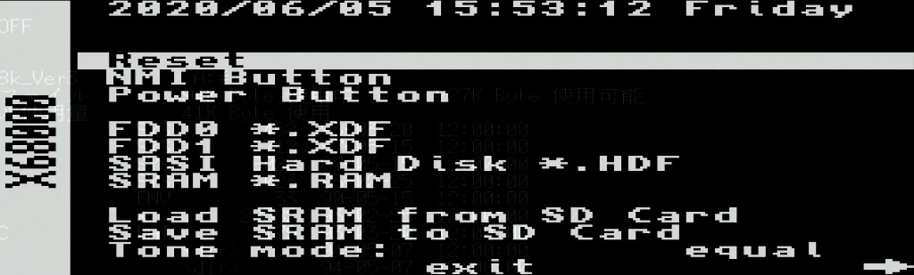
|===

Estas son las principales:

- `Reset`: Realiza un soft Reset del core
- `NMI Button`: Envía una interrupción `NMI`
- `Power Buton`:
- `FDD0`: Para elegir un fichero de imagen de disquete `XDF` principal
- `FDD1`: Para elegir un fichero de imagen de disquete `XDF` secundaria
- `SASI Hard Disk`: Para elegir un fichero de imagen de disco SAS `HDF`
- `SRAM`: Permite elegir un fichero .SRAM para utilizar
- `Load SRAM`: Carga SRAM desde el fichero en la microSD
- `Save SRAM`: Guarda la SRAM en fichero en la microSD
- `Tone Mode`: Para seleccionar distintos tipos de tono, cambiando el original a una escala pitagórica, basada en do mayor, etc.
- `FM Sound`: Permite elegir entre la implementación original del chip de sonido o https://github.com/jotego/jt51[JT51 de Jotego]
- `FDD Wait`: Deshabilita habilita la espera en la implementación de las disqueteras
- `KB Layout`: Permite elegir la distribución de teclado a utilizar. Las diferentes opciones se pueden consultar en https://github.com/MiSTer-devel/X68000_MiSTer/blob/master/Doc/keymap.pdf]este fichero PDF]
- `Swap Joysticks`: Para intercambiar los controles del jugador 1 y el jugador 2
- `Mute Midi`:
- `Exit`: Cierra el menú de opciones

Tras elegir una imagen de disco XDF (`FDD0`) o HDF (`SASI Hard Disk`), elegir la opción `Reset` del menú OSD para que se cargue automáticamente.

<<<

==== Sinclair QL

[role="center",width="100%",cols="5a,1a", frame=none, grid=none]
|===
|[.text-justify]
El https://es.wikipedia.org/wiki/Sinclair_QL[Sinclair QL], es un ordenador personal lanzado por Sinclair Research en 1984. Posterior al ZX Spectrum, se diseñó orientado al uso de aplicaciones domésticas y para la pequeña empresa.
|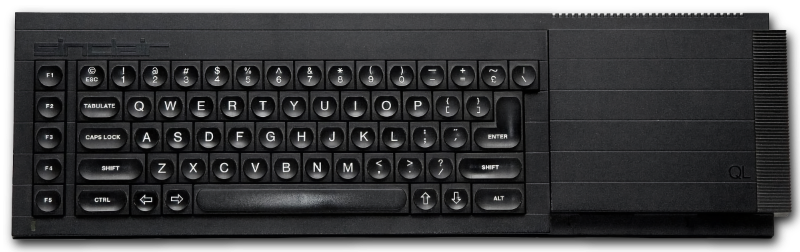
|===

El core de neptUNO+ está basado en https://github.com/BigMist/Sinclair_QL[la versión de Rampa para MiST, Mistica y SiDi], y tiene, entre otras, las siguientes características:

- CPU basada en fx68
- Velocidad de CPU ajustable entre QL/16Mhz/24Mhz/42Mhz
- RAM configurable hasta 4096 kB
- Carga de ROM desde microSD
- Soporte para imágenes QL-SD
- Soporte para imágenes de https://es.wikipedia.org/wiki/ZX_Microdrive[ZX Microdrive]
- Autoarranque desde QL-SD o Microdrive
- Velocidad de ejecución y cantidad de RAM ajustables

===== Formato de Tarjeta microSD

Se debe utilizar una tarjeta microSD, con la primera partición en formato FAT16 o FAT32, para almacenar los ficheros de imagen de ROM, disco o microdrive que se deseen cargar.

Se necesita, al menos, un fichero `ql.rom` con una ROM de Sinclair QL dentro del directorio `mist`. Además, se pueden utilizar ficheros QL-SD (`.WIN`) y ficheros de imágenes de Microdrive (ficheros `.mdv`).

[TIP]
====
Se necesita un fichero `ROM` adecuado para el uso de ficheros QL-SD. Por ejemplo, el que se puede descargar desde https://github.com/neptunoplus/Binaries/blob/main/Computers/Sinclair%20QL/QL-SD.zip[el repositorio del core] (utilizar el fichero llamado `ql_SD.rom`)
====

Algunos lugares donde encontrar software para Sinclair QL son:

- http://sinclairql.es
- http://www.speccy.org/sinclairql/utils/aventuras.zip
- http://www.speccy.org/sinclairql/utils/mgames.zip

===== Controles

====== Teclas especiales y botones

Durante la ejecución del core:

- `F12`: Mostrar y ocultar el menú de ajustes del core

<<<

===== Guía básica

Al pulsar `F12`, se mostrará el menú con las distintas opciones del core. Se puede navegar utilizando las teclas de cursor. `Enter` selecciona un elemento. `F12` oculta el menú si se estaba mostrando.

[role="center",width="70%",cols="1a", frame=none, grid=none]
|===
|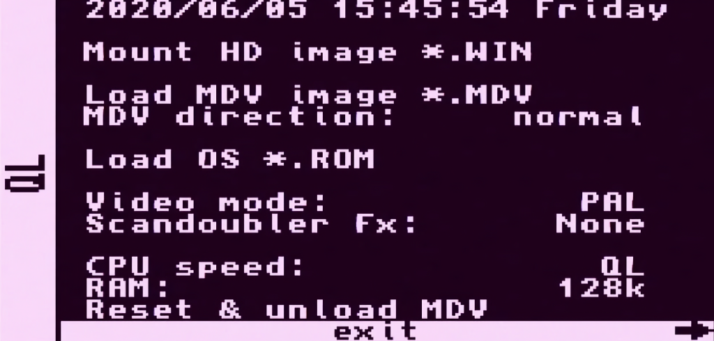
|===

Estas son las principales:

- `Mount HD image`: Para cargar un fichero de imagen QL-SD con extensión `.WIN`
- `Load MDV image`: Para cargar un fichero de imagen en el lector de Microdrive
- `MDV direction`:
- `Load OS *.ROM`: Para cargar un fichero .rom de Sinclair QL
- `Video Mode`: Para cambiar el modo de vídeo entre PAL y NTSC
- `Scandoubler Fx`: Para activar, ajustar o desactivar líneas de exploración (Scanlines)
- `CPU Speed`: Para configurar la velocidad de funcionamiento de la CPU
- `RAM`: Para configurar la cantidad de memoria RAM disponible en el core
- `Reset & unload MDV`: Para reiniciar el core y extraer la imagen de MDV (si estaba seleccionada)
- `Exit`: Cierra el menú de opciones

Tras la comprobación de memoria, el arranque del sistema pregunta por el tipo de pantalla. Lo más habitual es seleccionar la opción Monitor (pulsar `F1`).  El modo TV está pensado para pantallas de baja resolución, con un tipo de letra y un borde más grandes.

En el modo monitor aparecerán dos ventanas, una para la salida de datos, y otra para mostrar información sobre el directorio actual, listado de programas, etc.

<<<

Desde la consola de SuperBASIC, se puede acceder a unidades de disco o microdrive que se hayan seleccionado desde el menú del core.

Así, para ver los ficheros que hay en microdrive:

[source]
----
dir mdv1_
----

De la misma manera, para ver los ficheros en la raíz de una imagenn QL-SD:

[source]
----
dir win1_
----

Para acceder a ficheros en subdirectorios, se utiliza el símbolo `_` como separador. Así, un fichero con el nombre `ajedrez` en un directorio llamado `juegos`, dentro del microdrive se referenciaría como `mdv1_juegos_ajedrez`.

Existen comandos variados de SuperBASIC para poder cargar ficheros, ejecutarlos, guardarlos, etc. Por ejemplo, para cargar y ejecutar un programa de basic llamado `boot` en el directorio `g` dentro de una imagen de disco QL-SD:

[source]
----
lrun win1_g_boot
----

Para más información se pueden consultar los manuales originales de Sinclair QL, como, por ejemplo, los disponibles en https://sinclairql.speccy.org/manuales/sqlgu.htm[sinclairql.speccy.org].

<<<

[%always]
<<<

==== Sinclair ZX80 y ZX81

[role="center",width="100%",cols="4a,1a,1a", frame=none, grid=none]
|===
|[.text-justify]
El https://es.wikipedia.org/wiki/Sinclair_ZX80[Sinclair ZX80] y su sucesor el https://es.wikipedia.org/wiki/ZX81[Sinclair ZX81], fueron computadores personales comercializados en 1980 y 1981 respectivamente, siendo los de menor precio de la época.
|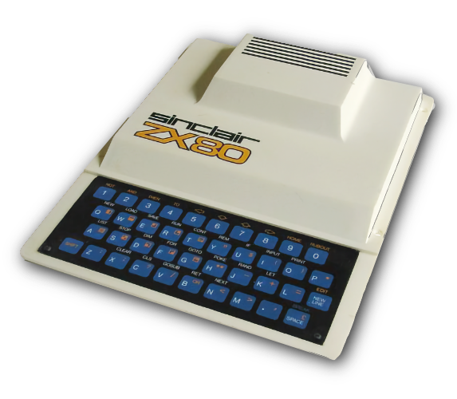
|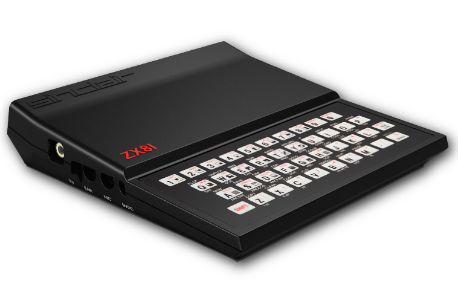
|===

El core de neptUNO+ está basado en https://github.com/BigMist/Sinclair_ZX8X[la versión de Rampa para MiST, Mistica y SiDi], y tiene, entre otras, las siguientes características:

- Basado en la página http://searle.wales/z80/SimpleZ80.html[ZX80 de Grant Searle]
- ZX80 o ZX81 seleccionables
- RAM configurable entre 16k, 32k, 48k
- 8KB con el addon CHR$128/UDG
- QS CHRS
- Soporte para CHROMA81
- Turbo en modo lento: NoWait, x2, x8
- Chip de sonido YM2149 (compatible con ZON X-81)
- Joystick emulados: Cursor, Sinclar, ZX81, ZXpand
- Timings PAL y NTSC
- Carga turbo de archivos .o y .p
- Soporte para ROM alternativa
- Carga de archivos de coloración y char

===== Formato de Tarjeta microSD

Se debe utilizar una tarjeta microSD, con la primera partición en formato FAT16 o FAT32, para almacenar ficheros de cinta (`.O` para ZX80 o `.P` para ZX81), color (`.COL`) o caracteres (`.CHR`) que se deseen cargar.

===== Controles

====== Teclas especiales y botones

Durante la ejecución del core:

- `F1`: Activar/desactivar los caracteres alternativos de QS CHRS
- `Alt+F11`: Reset
- `F12`: Mostrar y ocultar el menú de ajustes del core

<<<

===== Guía básica

Al pulsar `F12`, se mostrará el menú con las distintas opciones del core. Se puede navegar utilizando las teclas de cursor. `Enter` selecciona un elemento. `F12` oculta el menú si se estaba mostrando.

[role="center",width="70%",cols="1a", frame=none, grid=none]
|===
|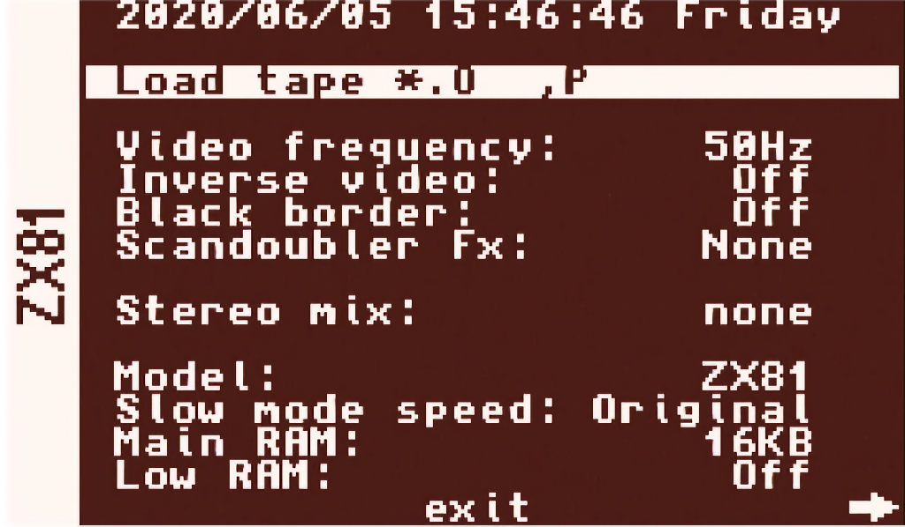
|===

Estas son las principales:

- `Load tape`: Para cargar un fichero de cinta `,o` o `.p`
- `Video frequency`: Alterna la frecuencia de vídeo entre 50Hz y 60Hz
- `Inverse video`: Invierte los colores de vídeo blanco/negro
- `Black Border`: Activa o desactiva el borde negro de la pantalla
- `Scandoubler Fx`: Efectos a aplicar (sólo en la salida VGA) incluyendo suavizado, líneas de exploración, etc.
- `Stereo mix`:  Configura el comportamiento del chip de sonido YM2149
- `Model`: Alterna el modelo entre ZX81 y ZX80
- `Slow mode speed`: Para seleccionar la velocidad de turbo en modo lento
- `Main RAM`: Permite elegir la cantidad de RAM disponible para el core
- `Low RAM`: Habilita RAM en el banco entre los 8K y los 16K (utilizando la parte no usada por la ROM)
- `QS CHRS`: Habilita el soporte para caracteres alternativos (QS Character board)
- `CHROMA81`: Habilita el soporte para color (Chroma 81 interface)
- `Joystick`: Para elegir tipo de joystick a utilizar (Cursor, Sinclair, etc.)
- `Keyboard`:
- `Reset`: Reinicia el core
- `Exit`: Cierra el menú de opciones

<<<

Al seleccionar un fichero de cinta (`.O` para ZX80 o `.P` para ZX81) esta queda disponible para su carga.

En ZX80 el comando `LOAD` (`Y` y luego `Enter`) realizará la carga como en la máquina original. En ZX81 el comando correspondiente es `LOAD ""` (`J`, `Mayúsculas+P`, Mayúsculas+P` y luego `Enter`).

Al realizar un reset (desde menú o con el teclado) la cinta deja de estar disponible.

Se pueden utilizar http://www.fruitcake.plus.com/Sinclair/ZX81/Chroma/ChromaInterface_Software_ChromaProgramEnhancementCreator.htm[ficheros `.CHR` (con datos de definición de caracteres) y `.COL` (con datos de color)] junto con un fichero `.p` si tienen el mismo nombre. Para que funcionen correctamente, la opción correspondiente del menú tiene que estar activa antes de cargar los ficheros.

<<<

[%always]
<<<

==== Sinclair ZX Spectrum

[role="center",width="100%",cols="4a,1a,1a", frame=none, grid=none]
|===
|[.text-justify]
El Sinclair ZX Spectrum es una familia de ordenadores de 8 bits basados en el microprocesador Z80, lanzado originalmente al mercado por la compañía británica Sinclair Research en 1982.
|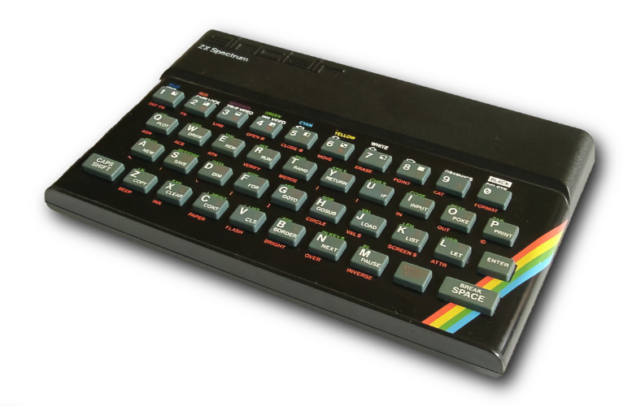
|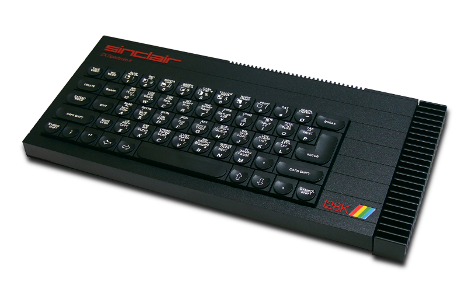
|===

El core para neptUNO+ es una una adaptación del https://github.com/gyurco/ZX_Spectrum-128K_MIST[core original para Mist] y tiene, entre otras, las siguientes características:

- ZX Spectrum 48K, 128K, +3 y Pentagon 128 completamente funcionales con timings de CPU y Video correctos.
- Interfaces de memoria Pentagon 1024K y Profi 1024K
- Turbo (7MHz, 14MHz, 28MHz, 56MHz)
- Soporte para ULA+ v1.1 y con modo Timex extendido
- Modos Timex HiColor, HiRes
- Soporte para ficheros de cinta TAP con turbo (inyección directa de bytes) y carga normal
- Soporte para formatos de cinta TZX y CSW (versión 1.x) con carga rápida (16x) y normal
- Carga instantánea de ficheros Z80/SNA
- TR-DOS (Beta Disk Interface) - imágenes TRD(lectura/escritura) y SCL(sólo lectura)
- G+DOS (MGT +D Disk Interface) - imágenes IMG, MGT (sólo en modos de memoria no +2A/+3)
- Unidad de disco +3 utilizable con +3DOS
- DivMMC con <<#_esxdos,exsdos>>
- Multiface 128 y Multiface 3 (en modo +3)
- Guardado y carga de instantáneas de memoria en +D y Multiface
- Ratón Kempston
- Joysticks: Kempston, Sinclair I/II, Cursor

<<<

===== Formato de Tarjeta microSD

Se debe utilizar una tarjeta microSD, con la primera partición en formato FAT16 o FAT32, donde ha de haber un fichero `spectrum.rom` en el mismo directorio donde se encuentre el fichero `.rbf` del core. Se puede descargar desde la web del proyecto original (https://github.com/neptunoplus/Binaries/blob/main/Computers/Spectrum128/spectrum.rom) o bien construir uniendo los siguientes trozos (cada uno ocupa exactamente 16KiB, excepto el último que es de 4KiB:

ESXMMC.BIN (2 veces) + TRDOS + 128 ROM0 + 128 ROM1 + +3 ROM0+ +3 ROM1 + +3 ROM2 + +3 ROM3 + PlusD + MF128 + MF3 + 48K ROM + GS(low) + GS(high) + Currah uSpeech(2x)

Además es recomendable tener, en el lugar que se desee de la tarjeta, ficheros con imágenes de cinta o de disco según el sistema con el que se quiera jugar.

La emulación de dispositivos divMMC, etc. requiere, en la raíz de la microSD,  un <<#_acerca_de_los_ficheros_vhd,fichero VHD de imagen de disco>>, un llamado `spectrum.vhd` y con formato adecuado al uso que se quiera hacer (ej: FAT32 para <<#_esxdos,exsdos>>, <<#_formato_avanzado_de_imágenes_vhd_3e,+3DOS>> para una ROM +3e, etc.), conteniendo los ficheros o programas que se quieran utilizar.

[TIP]
====
Para usar una <<#_formato_avanzado_de_imágenes_vhd_3e,imagen VHD +3DOS>> (como https://www.retrowiki.es/viewtopic.php?f=110&t=200037816[la imagen Mar Oceána de desUBIKado]), se ha de utilizar un archivo `spectrum.rom` cuyas +3ROM sean las correspondientes a una de +3e.
====

<<<

===== Controles

El teclado no está mapeado a la distribución PS/2 estándar, y mantiene la distribución de la máquina original.

====== Teclas especiales y botones

Durante la ejecución del core:

- `F1`: Pausa/Reproducción del archivo de cinta cargado actualmente (`TAP`, `CSW` o `TZX`)
- `F2`: Retroceder a la parte anterior de un archivo de cinta `TAP`
- `F3`: Avanzar a la siguiente parte de un archivo de cinta `TAP`
- `F4`: CPU a 3,5MHz (velocidad normal)
- `F5`: CPU a 7MHz
- `F6`: CPU a 14MHz
- `F7`: CPU a 28MHz
- `F8`: CPU a 56MHz
- `F9`: Pausa de la CPU o continuar
- `F10`: Entrar en menú de snapshots de +D (si hay una imagen MGT activa). En otro caso, NMI (o entrar en multiface).
- `Mayús.Dcha.+F10`: NMI (por ejemplo, para navegador de <<#_esxdos,esxdos>> o entrar en multiface)
- `F11`: Reinicio del core (en caliente)
- `Alt+F11`: Reinicio del core (en frío)
- `Ctrl+F11`: Reinicio del core (en caliente) y ejecutar `LOAD ""`
- `F12`: Mostrar y ocultar el menú de ajustes del core

<<<

===== Guía básica

Al pulsar `F12`, se mostrará el menú con las distintas opciones del core. Se puede navegar utilizando las teclas de cursor. `Enter` selecciona un elemento. `F12` oculta el menú si se estaba mostrando.

[role="center",width="35%",cols="1a", frame=none, grid=none]
|===
|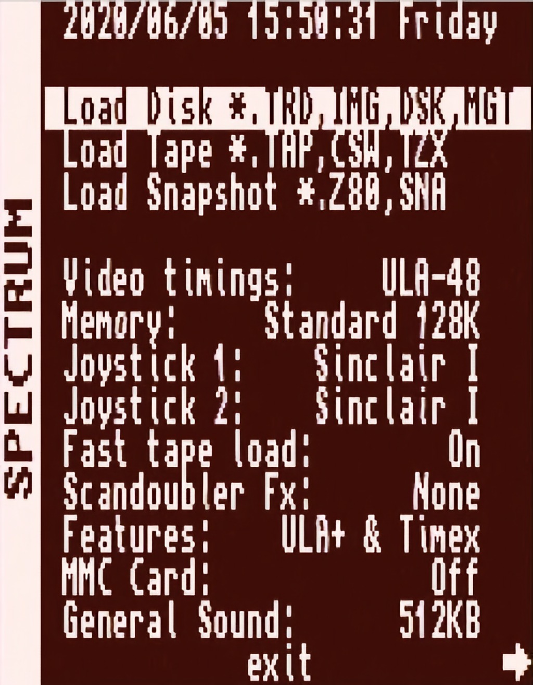
|===

Estas son las principales:

- `Load Disk`: Para cargar desde la microSD un archivo de imagen de disco TRD, IMG, DSK o MGT
- `Load Tape`: Para cargar desde la tarjeta un archivo de imagen de cinta TAP, CSW o TZX
- `Load Snapshot`: Para cargar desde la tarjeta un archivo de imagen memoria Z80 o SNA
- `Video timings`: Configuración de temporización de vídeo (según distintos modelos de ULA)
- `Memory`: Cantidad de memoria a asignar
- `Joystick 1`:  Para asignar al mando número 1 (bien conectado al puerto o bien USB, según la configuración de Mist)
- `Joystick 2`: Para asignar al mando número 1 (bien conectado al puerto o bien USB, según la configuración de Mist)
- `Fast tape load`: Activar o desactivar la carga rápida de cinta (56MHz)
- `Scandoubler fx`: Efectos a aplicar (sólo en la salida VGA)
- `Features`: Para activar o desactivar ULA+ y/o Timex
- `MMC Card`: Para activar la emulación de dispositivos de almacenamiento (divMMC, ZXMMC, divMMC+esxdos etc.)
- `General Sound`: Configuración de sonido General Sound
- `Currah uSpeech`: Permite activar un dispositivo https://en.wikipedia.org/wiki/Currah[Currah μSpeech]
- `Keyboard`: Tipo de issue de teclado a usar
- `Snowing`: Activar o desactivar el efecto "nieve" de la ULA
- `Reset`: Reiniciar el core
- `Exit`: Cierra el menú de opciones

<<<

==== Timex Sinclair 2068

[role="center",width="100%",cols="5a,1a", frame=none, grid=none]
|===
|[.text-justify]
El https://es.wikipedia.org/wiki/Timex_Sinclair_2068[Timex Sinclair 2068 (TS2068)], basado en el Sinclair ZX Spectrum y lanzado en noviembre de 1983, fue el último ordenador doméstico producido por Timex Sinclair para el mercado de Estados Unidos. Incluía nuevo hardware como soporte para joysticks, cartuchos de memoria y un generador de sonido AY-3-8912. 
|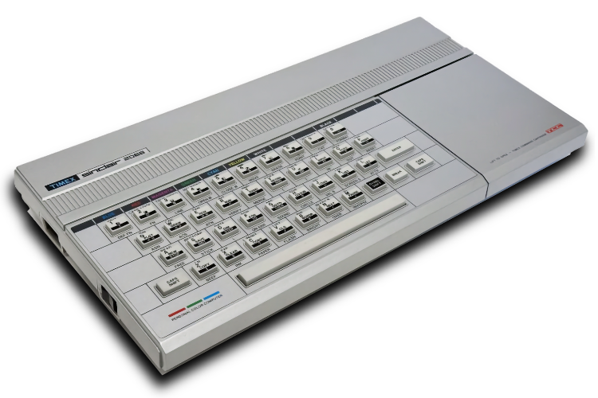
|===

El core para neptUNO+ es una una https://github.com/Kyp069/ts2068[implementación original] realizada por Kyp069 y tiene, entre otras, las siguientes características:

- Incluida la ROM original de 24K
- Chip de sonido AY-3-8912
- ULA con modos gráficos adicionales
- Gestión de bancos de memoria (para carga de cartuchos, etc.)
- Soporte para carga de ficheros de cinta `.TZX`
- Soporte para carga de ROMs
- Soporte para carga de ficheros `.DCK` de https://loadzx.com/timexcomputerworld/timex-cartridge/[cartuchos] 

===== Formato de Tarjeta microSD

Se debe utilizar una tarjeta microSD con la primera partición en formato exFAT, FAT16 o FAT32,donde es recomendable tener, en el lugar que se desee de la tarjeta, ficheros con imágenes de cinta `.TZX` o de cartucho `.DCK`.

===== Controles

El teclado no está mapeado a la distribución PS/2 estándar, y mantiene la distribución de la máquina original.

====== Teclas especiales y botones

Durante la ejecución del core:

- `Re Pág`: Reproducir TZX (cargado previamente desde el menú)
- `Av Pág`: Detener la reproducción de TZX
- `F5`: NMI
- `F9`: Reset
- `F12`: mostrar y ocultar el menú de control del core

<<<

===== Guía básica

Al pulsar `F12`, se mostrará el menú con las distintas opciones del core. Se puede navegar utilizando las teclas de cursor. `Enter` selecciona un elemento. `F12` oculta el menú si se estaba mostrando.

[role="center",width="70%",cols="1a", frame=none, grid=none]
|===
|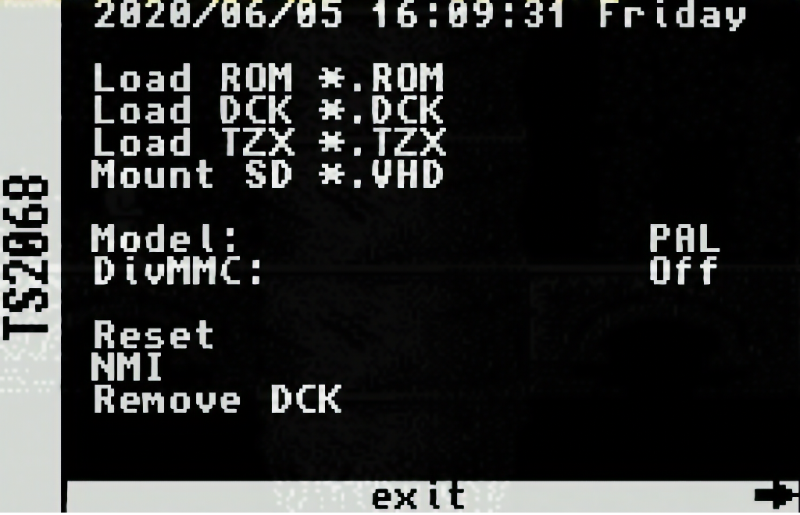
|===

Estas son las principales:

- `Load ROM`: Para cargar desde la microSD un archivo de ROM
- `Load DCK`: Para cargar desde la microSD un archivo de imagen de cartucho DCK
- `Load TZX`: Para cargar desde la tarjeta un archivo de imagen de cinta TZX
- `Mount SD .VHD`:
- `Model`: Para elegir el modelo a utilizar entre PAL y NTSC
- `DivMMC`: Para activar desactivar la emulación de almacenamiento divMMC
- `Reset`: Reiniciar el core
- `NMI Button`: Envía una interrupción `NMI`
- `Remove DCK`: Para descartar y retirar un cartucho previamente cargado
- `Exit`: Cierra el menú de opciones

[TIP]
====
La ROM fue ampliada con más comandos para que el nuevo hardware integrado pudiera utilizarse desde BASIC. Debido a esto, no cabía en 16K, por lo que se añadió una ROM de 8K donde se trasladaron algunos de los comandos originales de ZX BASIC, lo que hizo que los programas que utilizaban rutinas ROM quedaran inutilizables mientras que los programas en BASIC seguían funcionando sin problemas.

Con este cambio, solo alrededor del 7 % del software de Spectrum funcionaba bien en el TS2068. Para solucionarlo, y poder usar software de Spectrum, se puede cargar un cartucho con la ROM original del ZX Spectrum.
====

<<<

==== Zemmix Neo

[role="center",width="100%",cols="5a,1a", frame=none, grid=none]
|===
|[.text-justify]
Zemmix Neo es pequeño proyecto de algunas personas del foro "MSX nun Gudakdari" que crearon nuevo tipo de MSX, sólo por diversión, compatible con MSX2+, para celebrar su 30 aniversario.
|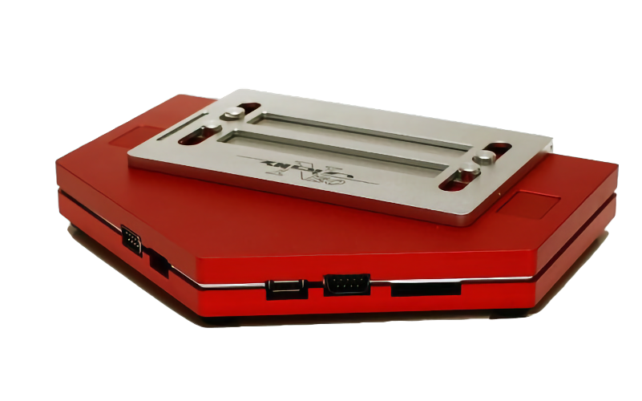
|===

El core de neptUNO+ está basado en https://github.com/BigMist/BigMiST[la implementación para SiDi128 y Poseidon].

===== Formato de Tarjeta microSD

Se debe utilizar una tarjeta microSD con la primera partición en formato exFAT, FAT16 o FAT32.

Se necesitar tener, en la microSD, un <<#_acerca_de_los_ficheros_vhd,fichero VHD de imagen de disco>> , con formato FAT16 (https://es.wikipedia.org/wiki/C%C3%B3digo_de_tipo_de_partici%C3%B3n[código de partición `0x06` (16-bit FAT) o `0x0e` (DOS FAT-16)]) y, en su interior, los ficheros necesarios para funcionamiento de MSX2.

Si este fichero está en la raíz de la microSD, y se llama `zemmix.vhd`, se cargará automáticamente. Al ser un core compatible con <<#_msx2,MSX2>>, las imágenes para este tipo de sistema o MSX deberían ser compatibles sin problemas, como por ejemplo, la de https://www.retrowiki.es/viewtopic.php?p=200138120#p200138120[MSX2PACK] o http://www.forofpga.es/viewtopic.php?t=316[MSX1PACK].

===== Controles

El teclado no está mapeado a la distribución PS/2 estándar, y mantiene la distribución de la máquina original.

====== Teclas especiales y botones

Durante la ejecución del core:

- `F1` a `F5`: `F1` a `F5`
- `ALT Izquierdo`: MSX GRAPH
- `ALT Derecho`: MSX CODE
- `Re Pág`: MSX SELECT
- `Inicio`: MSX HOME (`Mayús Dcha+Inicio`: CLS)
- `Fin`: MSX STOP
- `F12`: mostrar y ocultar el menú de control del core

[NOTE]
====
En BASIC, se puede usar `CTRL + STOP` (`Ctrl+Fin`) para detener la ejecución de un programa.
====

<<<

===== Guía básica

Al pulsar `F12`, se mostrará el menú con las distintas opciones del core. Se puede navegar utilizando las teclas de cursor. `Enter` selecciona un elemento. `F12` oculta el menú si se estaba mostrando.

[role="center",width="70%",cols="1a", frame=none, grid=none]
|===
|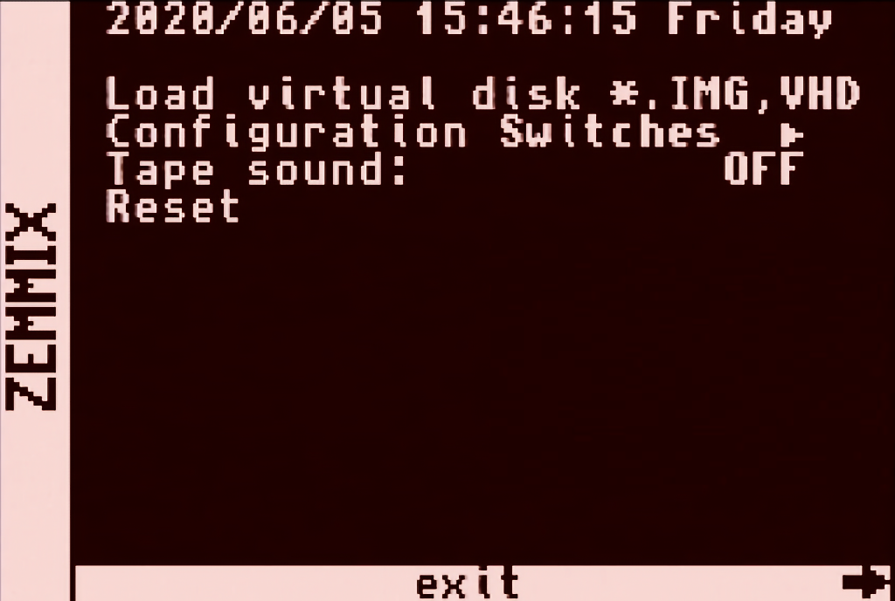
|===

- `Load virtual disk`: Para cargar un fichero de imagen de disco
- `Tape Sound`:
- `Reset`: Reiniciar el core
- `Exit`: Cierra el menú de opciones

<<<

Si se elige la opción `Configuration Switches` en el menú principal del core, se mostrará este otro menú.

[role="center",width="70%",cols="1a", frame=none, grid=none]
|===
|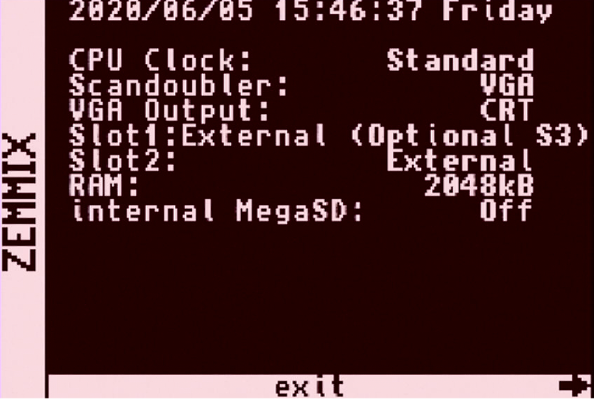
|===

Desde aquí se pueden modificar los siguientes ajustes:

- `CPU Clock`: Permite modificar la velocidad de reloj de la CPU
- `Scandoubler`:
- `VGA Output`: Permite elegir la señal de salida utilizada en el puerto VGA
- `Slot 1`:
- `Slot 2`:
- `RAM`: Para seleccionar la cantidad de memoria RAM disponible
- `internal MegaSD`:

<<<

[%always]
<<<

==== ZX Evolution TS-Conf

[role="center",width="100%",cols="5a,1a", frame=none, grid=none]
|===
|[.text-justify]
http://nedopc.com/zxevo/zxevo_eng.php[ZX Evolution] o ZXEvo es una placa de desarrollo para clones de ZX Spectrum, creada por un grupo de entusiastas llamado «NedoPC». Originalmente ZXEvo se suministró con la configuración básica (baseconf). Posteriormente, se desarrolló PentEvo, una evolución del ordenador compatible ATM-2 desarrollado en la URSS. Y https://forum.tslabs.info/viewtopic.php?f=12&t=157[TS-Conf] es la tercera configuración creada para ZXEvo por el autor conocido como TS Labs. TS-Conf se basa en la arquitectura Pentagon-1024 complementada con mejoras como gráficos avanzados, motor de de sprites y tiles vía hardware, shadow DMA, etc.
|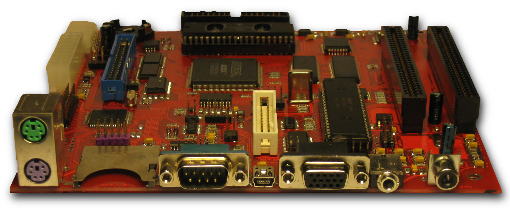
|===

Algunas características de la versión de TS-Conf para NeptUNO+, basada en la https://github.com/Maverick-Shark/TSConf[versión original del core para MiST] son:

- Scandoubler
- VDAC 1
- RTC
- Turbosound FM (dual YM2203)
- General Sound 2MB
- SAA1099
- Covox
- SounDrive
- 2x Kempston/Sinclair/Cursor joystick
- Ratón Kempston

===== Formato de Tarjeta microSD

Se debe utilizar una tarjeta microSD con la primera partición en formato exFAT o FAT32. Junto con el fichero RBF del core se han de copiar dos ficheros:

`TSConf.rom` - https://github.com/tslabs/zx-evo/blob/83afbba6f5d366f96297028aa3d64512fa254a51/pentevo/rom/bin/ts-bios.rom[BIOS principal de TSConf]
`TSConf.r01` - https://github.com/psbhlw/gs-firmware[General Sound ROM v1.05b]

Finalmente, es necesario, en la raíz de la microSD un <<#_acerca_de_los_ficheros_vhd,fichero VHD de imagen de disco>>, con formato FAT32, llamado `TSConf.vhd`, conteniendo los ficheros o programas que se quieran utilizar.
Lo habitual es incluir https://forum.tslabs.info/viewtopic.php?f=26&t=143[Wild Commander] un explorador de archivos que facilita la carga del resto del software que se haya copiado. Véase <<#_wild_commander,más adelante>> para más información sobre Wild Commander.

También es posible copiar directamente todos los ficheros en la raíz de la tarjeta microSD.

Hay programas, demos, etc. disponible en https://prods.tslabs.info[la página oficial de TS Labs].

<<<

===== Controles

====== Teclas especiales y botones

Durante la ejecución del core:

- `F11`: Reinicio del core
- `Mayús+F11`: Reinicio alternativo del core
- `Ctrl+F11`: Reinicio del core y acceso a BIOS
- `F12`: Mostrar y ocultar el menú de ajustes del core

===== Guía básica

Al pulsar `F12`, se mostrará el menú principal del core.

[role="center",width="50%",cols="1a", frame=none, grid=none]
|===
|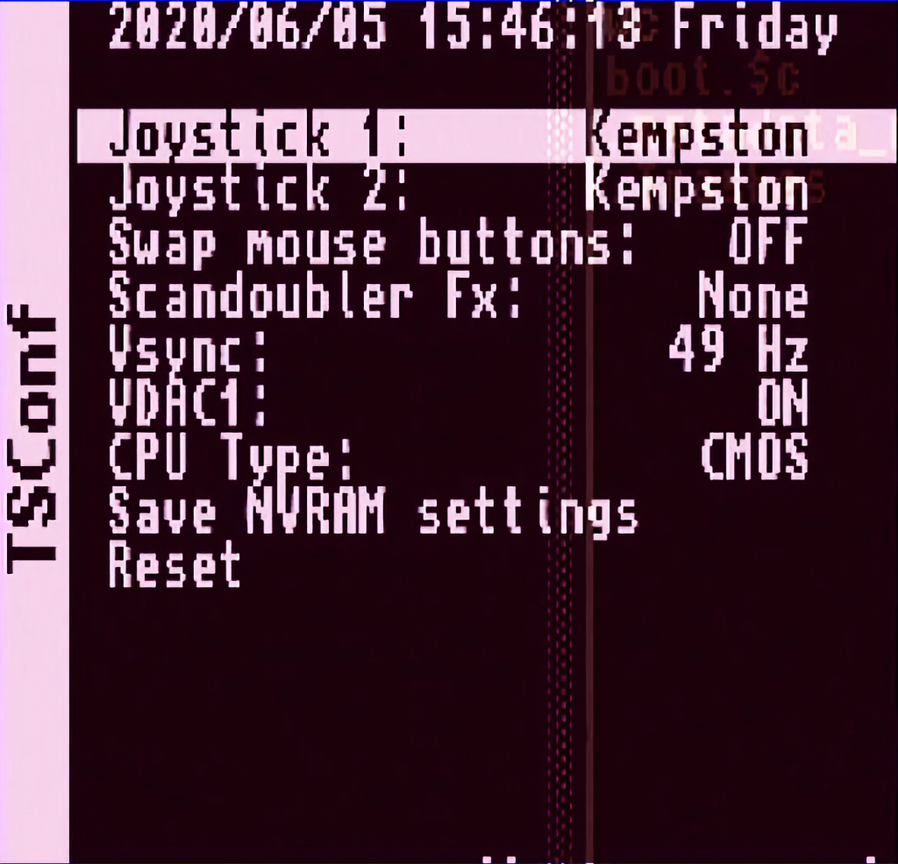
|===

Estas son las principales opciones:

- `Joystick 1`:  Para asignar un tipo de joystick (Kempston, etc.) al mando número 1
- `Joystick 2`: Para asignar al mando número 2
- `Swap Mouse Buttons`: Para intercambiar la asignación de botones del ratón
- `Scandoubler fx`: Efectos a aplicar (sólo en la salida VGA)
- `VSync`: Elige la frecuencia de refresco vertical a utilizar
- `VDAC1`: Activar o desactivar el módulo VDAC, que amplía el número de colores que se pueden mostrar
- `General Sound`: Configuración de sonido General Sound
- `CPU Type`: Tipo de CPU (CMOS o NMOS)
- `Save NVRAM Settings`: Hacer permanentes los cambios realizados en BIOS
- `Reset`: Reiniciar el core
- `Exit`: Cierra el menú de opciones

====== BIOS

Durante el  inicio, usar la tecla `Ctrl` para mostrar el menú de la BIOS. También posible acceder, una vez el core está funcionando, pulsando `Ctrl+F11`

[role="center",width="75%",cols="1a", frame=none, grid=none]
|===
|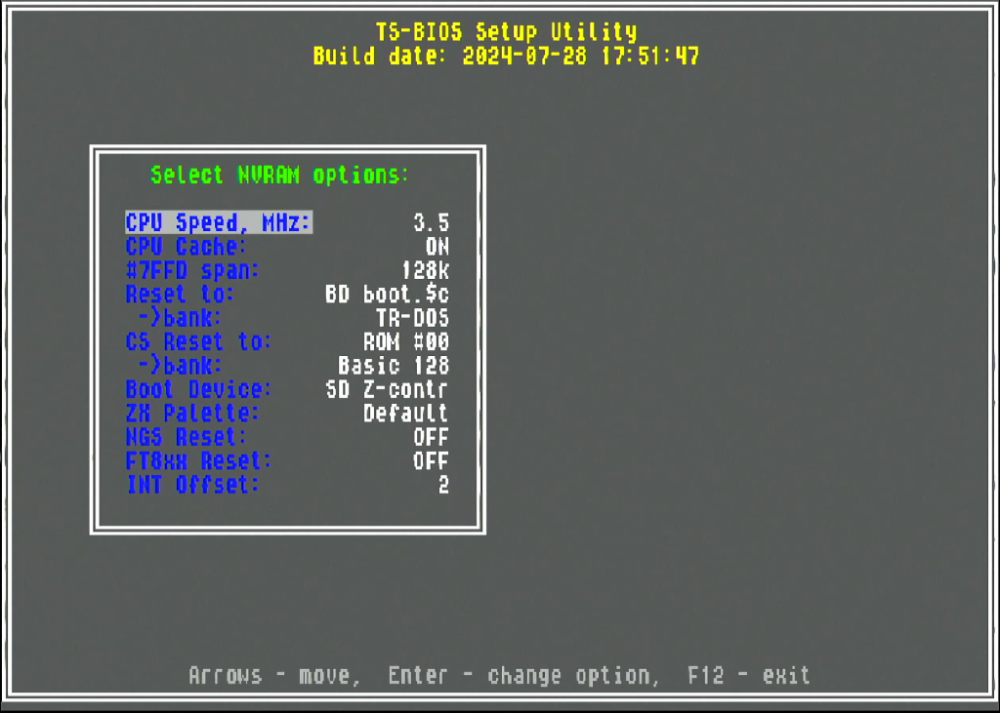
|===

Este menú permite configurar las siguientes opciones:

- `CPU Speed`:
- `CPU Cache`:
- `#7FFD Span`:
- `Reset To`:
- `->Bank`:
- `CS Reset To`:
- `->Bank`:
- `Boot Device`:
- `ZX Palette`:
- `NGS Reset`:
- `FT8xx Reset`:
- `INT Offset`:

Una vez realizados los cambios deseados, pulsar `F11` para reiniciar el core y utilizarlos.

[TIP]
====
Para que los cambios de configuración en BIOS sean permanentes, se tiene que acceder al menú del core y elegir la opción `Save NVRAM Settings`.
====

<<<

====== Wild Commander

Wild Commander es un gestor de ficheros para TS-Conf, similar a Midnight Commander o Norton Commander. A través de plug-in incorporados y de terceros, es posible usar o visualizar muchos tipos de programas (guardados como `SPG`, `TRD`, `TAP`, `SNA`, `Z80`, `SCL`, `$C`), ficheros de audio o vídeo (`MOD`, `PT3`, `STC`, `WAV`, `MP3`, `TGV`), imagen (`TGA`, `BMP`, `SCR`. http://users.atw.hu/zxspectrum/zx_gfx_modes_en.htm[MultiGigaScreen], `GIF`, `IFF`, `LBM`). La pantalla principal del programa consiste en dos paneles en los cuales se muestra el sistema de ficheros.

[role="center",width="75%",cols="1a", frame=none, grid=none]
|===
|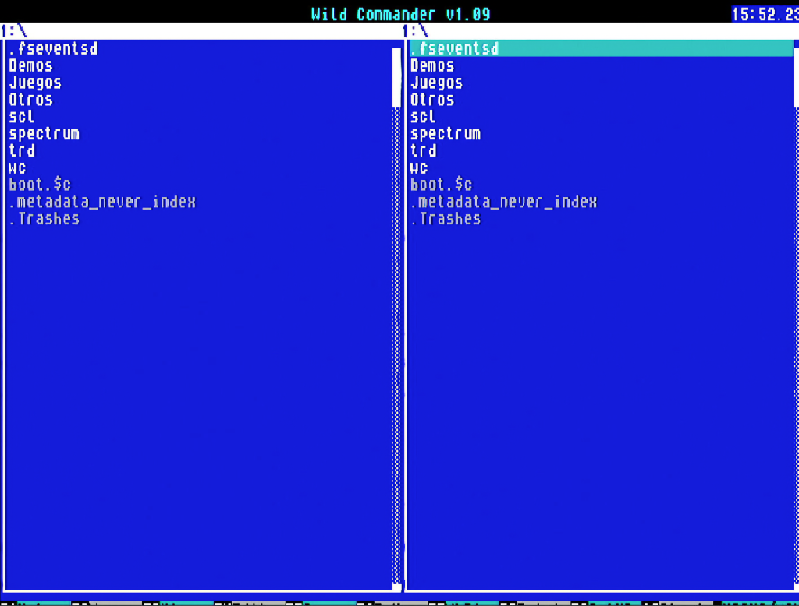
|===

Se puede obtener la última versión desde el https://github.com/tslabs/zx-evo/tree/master/pentevo/soft/WC[repositorio en Github de ZX Evolution]. Una vez descargado, copiar el fichero `boot.$c` junto con el directorio `WC` en la raíz de la imagen de disco VHD.

Controles al editar texto:

- `Ctrl+Mayúsculas`: Cambiar la disposición de teclado entre inglés y ruso
- `Insert`: Cambiar modo de escritura entre insertar o sobreescribir
- `Bloq. Mayús`: Activar o desactivar el modo mayúsculas

<<<

Controles mientras se navega por los paneles:

- Teclas de cursor: Navegar por el panel activo
- `Alt+F1` o `Alt+F2`: Elegir el controlador de dispositivos a usar en el panel correspondiente (No tiene un uso útil con el core actual)
- `Tabulador`: cambiar el panel activo
- `Espacio` o `Insert`- Alternar entre marcar o no el archivo actual
- `F2`: Abrir menú de usuario (si se ha cargado un plugin). Se configura en wc.mnu (en la carpeta de los plugins).
- `F4`: Editar el archivo seleccionado con el editor de texto (si el plugin está cargado)
- `F5`: Copiar los archivos/directorios marcados al panel opuesto (muestra un cuadro de diálogo)
- `F6`: Renombra el fichero/directorio seleccionado (no cambia la fecha de creación del fichero)
- `F7`: Crear un directrorio en la ubicación del panel activo
- `F8` o `Supr`: Borrar ficheros/directorios marcados
- `F9`: Configurar el archivo INI (crea automáticamente la carpeta WC en el dispositivo de arranque si no existe)
- `F10`: Muestra el menú de ejecución o eliminación de plug-ins. Con `Enter` se activa el plug-in seleccionado (en el caso de que lo soporte con `Supr` se eliminan.
- `Ctrl+F3`: Activar o desactivar la ordenación por nombre
- `Ctrl+F4`: Activar o desactivar la ordenación por extensión
- `Ctrl+F6`: Activar o desactivar la ordenación por tamaño
- `Ctrl+R`: Volver a leer el contenido del directorio
- `Enter`: Entrar en el directorio seleccionado, cargar el fichero seleccionado (plugin WMF, SPG/$C) o intentar ver su contenido
- `Mayús+Enter`: Muestra el menú par elegir el modo de visualización (formado por los visores incorporados y los plug-ins cargados que lo admitan)
- `F3`: Vusyakuzar el fichero como texto/HEX/imagen (TGA/SCR/Gigascreen/MGS). Carga archivos de hasta 1MB. Si no se reconoce la extensión, se mostrará el menú par elegir el modo de visualización
- `Esc`: Vuelve atrás o cancela la operación actual

<<<

[%always]
<<<

==== ZX Spectrum Next

[role="center",width="100%",cols="5a,1a", frame=none, grid=none]
|===
|[.text-justify]
https://www.specnext.com[ZX Spectrum Next] es un proyecto, basado en FPGA, que aspira a ser la evolución de los ordenadores Sinclair ZX Spectrum, manteniendo la compatibilidad hardware y software con los modelos anteriores, pero añadiendo nuevas características.
|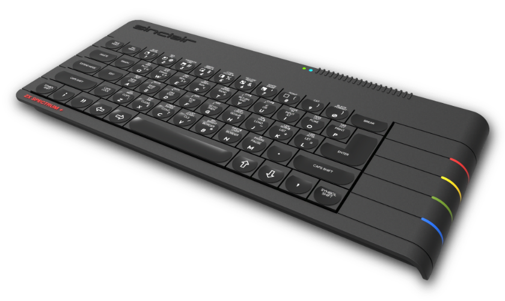
|===

La versión para neptUNO+ está basada en la https://gitlab.com/gyurco/ZX_Spectrum_Next_FPGA/-/tree/altera_sdram_changes[versión adaptada del core original] y tiene, entre otras, las siguientes características

- 2 MB de RAM
- Soporte para imagen de disco VHD
- Hard Reset (no oficial)
- Permite la carga como audio desde ficheros de cinta TZX

El manual de uso se puede descargar desde https://www.specnext.com/zx-spectrum-next-user-manual-first-edition/[la página oficial].

===== Formato de Tarjeta microSD

Se debe utilizar una tarjeta microSD con la primera partición en formato exFAT o FAT32.

Además es necesario, en la raíz de la microSD un <<#_acerca_de_los_ficheros_vhd,fichero VHD de imagen de disco>>, de, al menos 200MB de tamaño, llamado `zxn.vhd`, con la distribución de NextZXOS y otros ficheros o programas que se quieran utilizar.

Se pueden obtener todos los ficheros oficiales de la distribución de NextZXOS https://www.specnext.com/latestdistro/[en la página oficial]. basta con descomprimir el contenido de NextZXOS dentro de la imagen de disco VHD.

===== Controles

El teclado no está mapeado a la distribución PS/2 estándar, y mantiene la distribución de la máquina original. Así, por ejemplo, para obtener `"` se ha de pulsar `Ctrl+P` o para activar el modo extendido, `Mayús+Ctrl`.

====== Teclas especiales y botones

Notar que no hay botón físico de Reset o Drive.

Durante la ejecución del core:

- `F1`: Hard Reset
- `F3`: Alternar vídeo entre 50Hz y 60Hz
- `F4`: Soft Reset
- `F7`: Para activar distintas opciones de líneas de exploración (sólo con <<#_configuración_avanzada,salida VGA activa>>)
- `F9`: NMI
- `F12`: mostrar y ocultar el menú de control del core

<<<

===== Guía básica

Al pulsar `F12`, se mostrará el menú principal del core.

[role="center",width="50%",cols="1a", frame=none, grid=none]
|===
|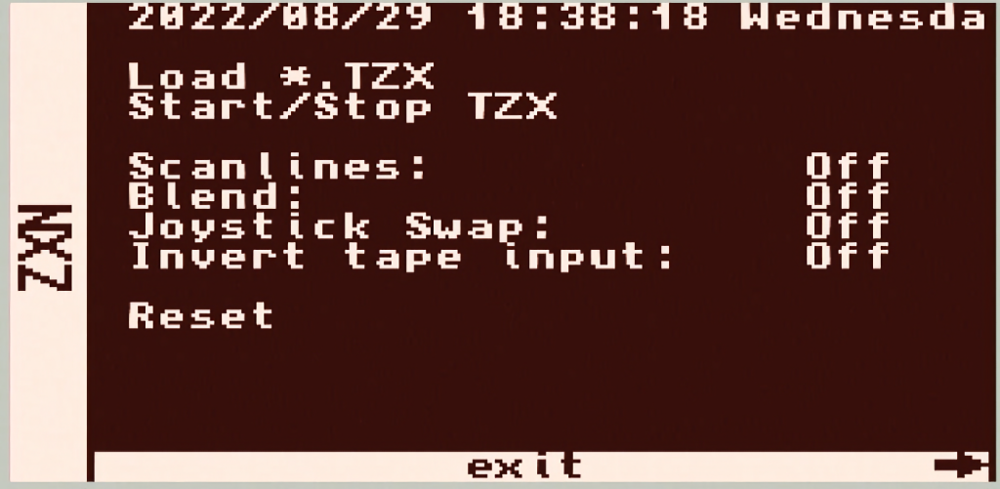
|===

Estas son las principales opciones:

- `Load TZX`: Para cargar un fichero TZX desde la tarjeta microSD
- `Start/Stop TZX`: Para reproducir o detener el audtio de un fichero de cinta cargado con la opción anterior
- `Scanlines`: Para activar distintas opciones de líneas de exploración (sólo con <<#_configuración_avanzada,salida VGA activa>>)
- `Blend`: Para realizar un suavizado de la imagen
- `Joystick swap`: Intercambia la asignación de los puertos de mando
- `Invert tape input`: Para invertir la polaridad de audio de la cinta
- `Reset`: Reinicia el core
- `Exit`: Cierra el menú de opciones

<<<

Durante el primer inicio, usar la tecla `N` hasta encontrar un modo que se vea correctamente, y entonces pulsar `Enter` para guardar la configuración.

Al iniciarse, aparecerán una serie de pantallas de ayuda. Tras pulsar la tecla `Espacio`, se mostrará el menú de inicio de NextZXOS.

[role="center",width="70%",cols="1a", frame=none, grid=none]
|===
|image:img/next_neptunoplus.png[scaledwidth=100%]
|===

Se puede navegar utilizando las teclas de cursor, las teclas `5`, `6`, `7` y `8`, o un joystick (si se ha configurado en modo Kempston, MD o cursor). `Enter` o el botón del joystick selecciona un elemento.

[TIP]
====
Durante el arranque, se puede forzar la salida de vídeo analógica a utilizar, pulsando `A`, `R` o `V`.
====

<<<

La opción `More…` muestra un segundo menú con más opciones.

[role="center",width="70%",cols="1a", frame=none, grid=none]
|===
|image:img/next2_neptunoplus.png[scaledwidth=100%]
|===

Si se elige `Browser`, se cargará el navegador de NextZXOS, desde el que es posible desplazarse viendo el contenido de la tarjeta microSD y cargar directamente diferentes tipos de archivo (TAP, NEX, DSK, SNA, SNX, Z80, Z8, etc.).

[role="center",width="70%",cols="1a", frame=none, grid=none]
|===
|image:img/next3_neptunoplus.png[scaledwidth=100%]
|===

[NOTE]
====
Por defecto, no es posible cargar ficheros TRD dede el navegador (se debe configurar NextZXOS para cargar una "personalidad" con <<#_esxdos,esxdos>>).
====

Para más información, consultar el https://www.specnext.com/zx-spectrum-next-user-manual-first-edition/[manual de uso oficial].

<<<

[%always]
<<<

=== Consolas

==== Utilidades y herramientas

===== uCON64

Esta es una herramienta que sirve, entre otras muchas cosas, para convertir ficheros de ROM entre diferentes formatos. Se puede descargar desde https://ucon64.sourceforge.io/#download[La web oficial] (para macOS se pueden descargar ficheros en https://github.com/kounch/uCON64/releases/latest[este repositorio de GitHub]).

Por ejemplo, para convertir un fichero ROM de <<#_sega_genesis_mega_drive,Sega Genesis (Mega Drive)>> a formato `.BIN`

[source,shell]
----
...ucon64 --bin <fichero ROM>
----

Donde `<fichero ROM>` es la ruta al fichero a convertir. Esto creará un nuevo fichero con extensión `.BIN` al lado del original.

Para obtener una descripción de los distintos parámetros de uso de la herramienta:

[source,shell]
----
...ucon64 --h
----

===== chdman

https://docs.mamedev.org/tools/chdman.html[Esta es una herramienta] que sirve, entre otras muchas cosas, para comprimir imágenes de CD. Forma parte de la distribución del emulador MAME, de cuya https://www.mamedev.org/release.html[web oficial] se puede descargar.

Para aquellos cores de consola con CD que necesitan imágenes de disco en un único fichero, se pueden seguir los siguiente pasos para combinar volcados de múltiples ficheros.

. Crear un fichero comprimido desde la distribución múltiple:

[source,shell]
----
...chdman createcd -i <fichero original.cue> -o <fichero comprimido.chd>
----

Donde `<fichero original.cue>` es la ruta al fichero de referencia original a convertir. Esto creará un nuevo fichero con extensión `fichero comprimido.chd`.

[start=2]
. Ahora, convertir el fichero `.CHD` en una nueva imagen `.CUE` junto con un único fichero `.BIN` que contenga todos los datos.

[source,shell]
----
...chdman extractcd -i <fichero comprimido.chd> -o <fichero nuevo.cue> -ob <fichero nuevo.bin>
----

'''

A continuación se enumeran los cores de consolas existentes en el momento de redactarse este manual.

<<<

==== Atari 7800

[role="center",width="100%",cols="5a,1a", frame=none, grid=none]
|===
|[.text-justify]
La https://es.wikipedia.org/wiki/Atari_7800[Atari 7800] es sucesora de la consola Atari 5200 (o supersystem) lanzada al mercado en 1984.
|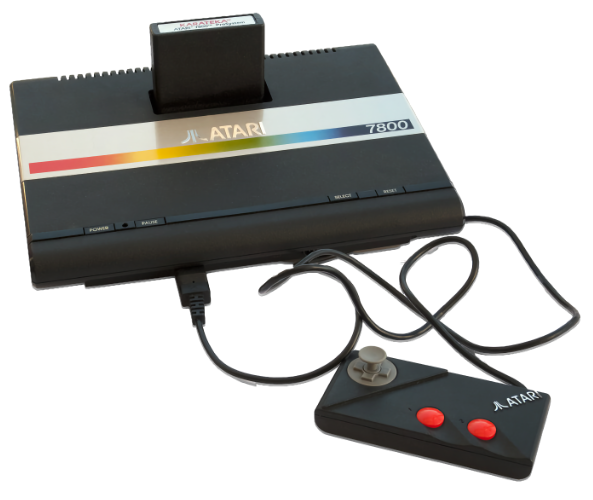
|===

La versión para neptUNO+ está basada en https://github.com/mist-devel/mist-binaries/tree/master/cores/atari7800[la implementación para MiST], que está a su vez basada en la https://github.com/gyurco/Atari7800_FPGA[implementación para MiSTer].

Algunas de las características del core son:

- Compatible con la biblioteca completa de Atari 7800
- Soporta regiones NTSC y PAL
- Audio Covox e YM2151 (usando JT51 de Jotego)
- Soporte para módulos XM y XBoard
- Soporta los http://blog.kevtris.org/blogfiles/Atari%202600%20Mappers.txt[mappers]: Activision, Absolute, Bankset, Souper, y Supergame hasta 1Mb
- Varias opciones de temperatura de color

===== Formato de Tarjeta microSD

Se debe utilizar una tarjeta microSD, con la primera partición en formato FAT16 o FAT32, donde, opcionalmente puede haber un fichero de BIOS `boot0.rom` en el mismo directorio donde se encuentre el fichero `.rbf` del core.

Además es recomendable tener, en el lugar que se desee de la tarjeta, ficheros ROM que tengan una cabecera correcta según la especificación https://7800.8bitdev.org/index.php/A78_Header_Specification[del emulador A7800 de Dan Boris].

===== Controles

====== Teclas especiales y botones

Durante la ejecución del core:

- `F1`: Botón Select
- `F2`: Botón Start
- `F3`: Interruptor blanco y negro / color
- `F4`: Interruptor de dificultad izquierdo A/B
- `F5`: Interruptor de dificultad derecho A/B
- `F6`: Botón Pausa
- `F12`: mostrar y ocultar el menú de control del core
- Teclas de cursor: Controles de dirección
- `Ctrl`, `Alt`: Botones 1, 2 del jugador uno
- `R`,`D`,`F`,`G`: Movimiento del jugador dos
- `A`, `S`: Botones 1, 2 del jugador dos

<<<

===== Guía básica

Al pulsar `F12`, se mostrará el menú con las distintas opciones del core. Se puede navegar utilizando las teclas de cursor. `Enter` selecciona un elemento.

[role="center",width="50%",cols="1a", frame=none, grid=none]
|===
|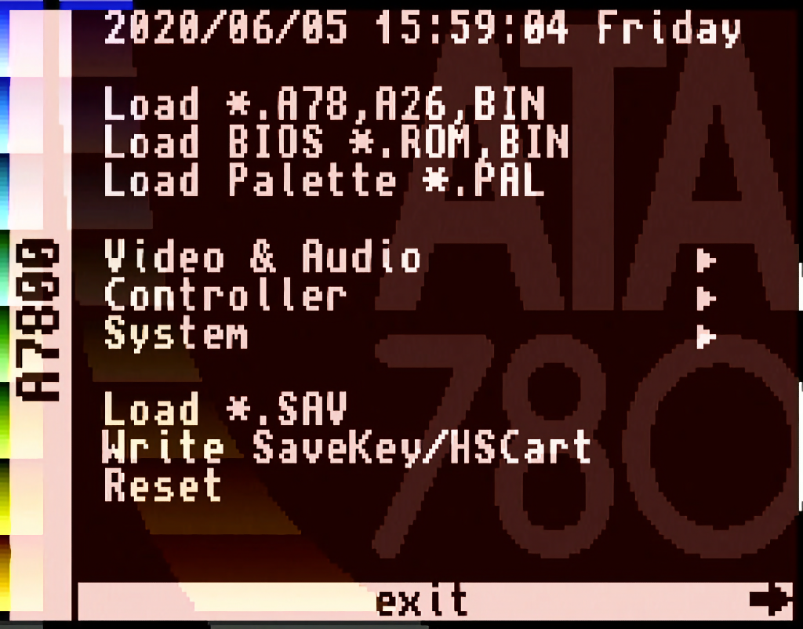
|===

Estas son las principales:

- `Load A78…`: Para cargar una ROM de Atari 7800 o Atari 2600 desde la microSD
- `Load BIOS`:
- `Load Palette`:
- `Load SAV`:
- `Write SaveKey/HSCart`:
- `Reset`: Reiniciar el core
- `Exit`: Cierra el menú de opciones

<<<

Si se elige la opción `Video & Audio` en el menú principal del core, se mostrará este menú.

[role="center",width="50%",cols="1a", frame=none, grid=none]
|===
|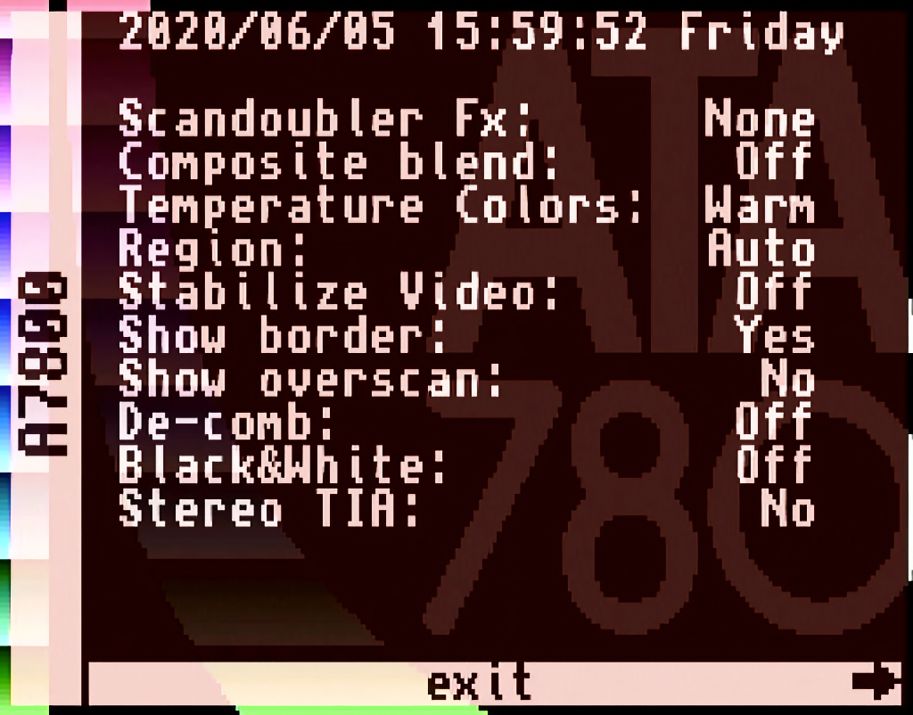
|===

Desde aquí se pueden modificar los siguientes ajustes:

- `Scandoubler Fx`: Para añadir un efecto de líneas de exploración (sólo con salida VGA)
- `Composite Blend`: Para activar si se desea, un efecto de suavizado de la imagen
- `Temperature colors`: Permite elegir entre distintas paletas de color
- `Region`: Para forzar una región concreta (USA, PAL) o dejar activa la detección automática
- `Stabilize Video`:
- `Show border`:
- `Show overscan`:
- `De-Comb`:
- `Black&White`:
- `Stereo TIA`:

<<<

Si se elige la opción `Controller` en el menú principal del core, se mostrará este menú.

[role="center",width="50%",cols="1a", frame=none, grid=none]
|===
|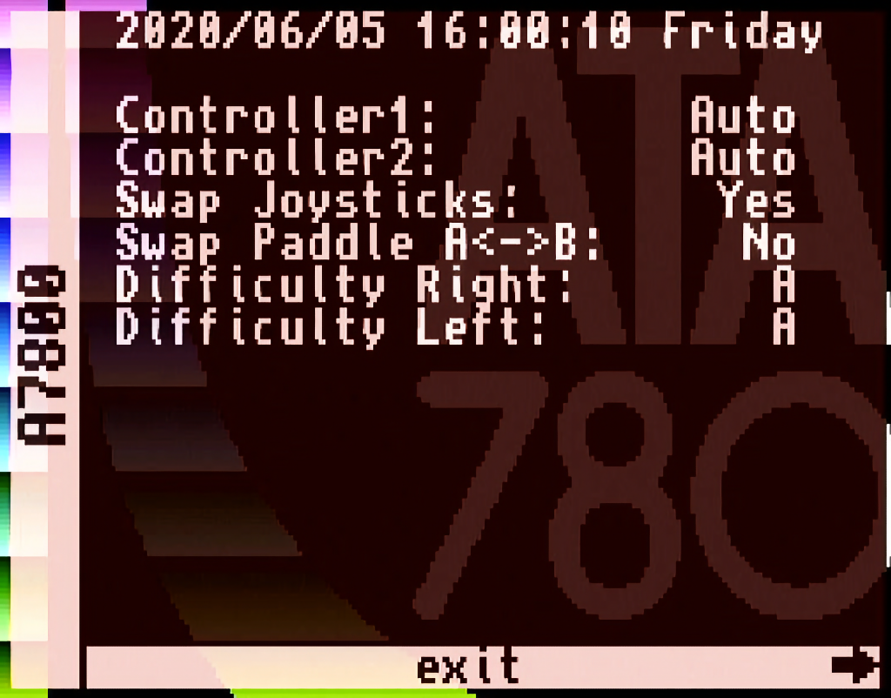
|===

Desde aquí se pueden modificar los siguientes ajustes:

- `Controller1`: Define el comportamienteo del mando del jugador 1
- `Controller2`: Define el comportamienteo del mando del jugador 1
- `Swap Joysticks`: Para intercambiar los controles del jugador 1 y el jugador 2
- `Swap Paddle A<->B`:
- `Difficulty Right`:
- `Difficulty Left`:

<<<

Si se elige la opción `System` en el menú principal del core, se mostrará este menú.

[role="center",width="50%",cols="1a", frame=none, grid=none]
|===
|image:img/a7800_system.png[scaledwidth=100%]
|===

Desde aquí se pueden modificar los siguientes ajustes:

- `Bypass BIOS`:
- `High Score Cart`:
- `Clear Memory`:
- `CPU Driver`:
- `Pokey IRQ Enabled`:
- `Bankswitching`:

<<<

[%always]
<<<

==== Coleco Colecovision y Sega SG-1000

[role="center",width="100%",cols="4a,1a,1a", frame=none, grid=none]
|===
|[.text-justify]
https://es.wikipedia.org/wiki/ColecoVision[ColecoVision] es una consola de videojuegos lanzada al mercado por la empresa Coleco en 1982.
La SG-1000a​ es una consola de videojuegos doméstica fabricada por Sega a partir de 1983.
|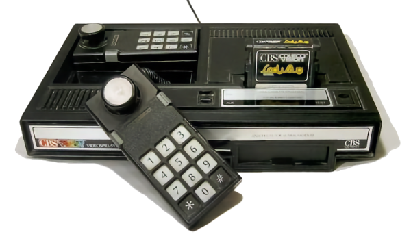
|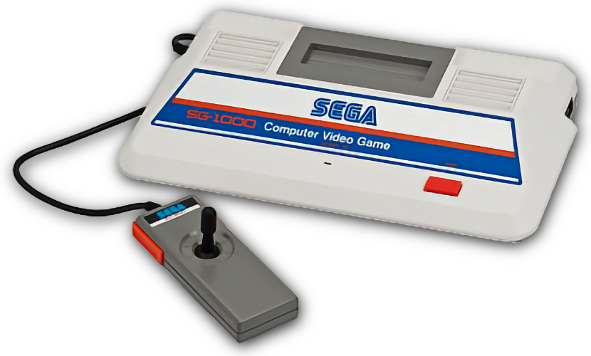
|===

La versión para neptUNO+ está basada en la https://github.com/MiSTer-devel/ColecoVision_MiSTer[versión para MiSTer].

Algunas de las características del core son:

- Implementación de ColecoVision
- Implementación de SG-1000
- Soporte de SuperGameModule de ColecoVision
- Los controles de los juegos son sólo con mandos. No hay emulación en teclado

===== Formato de Tarjeta microSD

Se debe utilizar una tarjeta microSD, con la primera partición en formato FAT16 o FAT32, para almacenar los ficheros con las imágenes ROM o de cartucho.

===== Controles

====== Teclas especiales y botones

Durante la ejecución del core:

- `F12`: mostrar y ocultar el menú de control del core

[WARNING]
====
Se necesita, al menos, un mando conectado, ya que este core no simula los controles con el teclado.
====

<<<

===== Guía básica

Al pulsar `F12`, se mostrará el menú con las distintas opciones del core. Se puede navegar utilizando las teclas de cursor. `Enter` selecciona un elemento. `F12` oculta el menú si se estaba mostrando.

[role="center",width="50%",cols="1a", frame=none, grid=none]
|===
|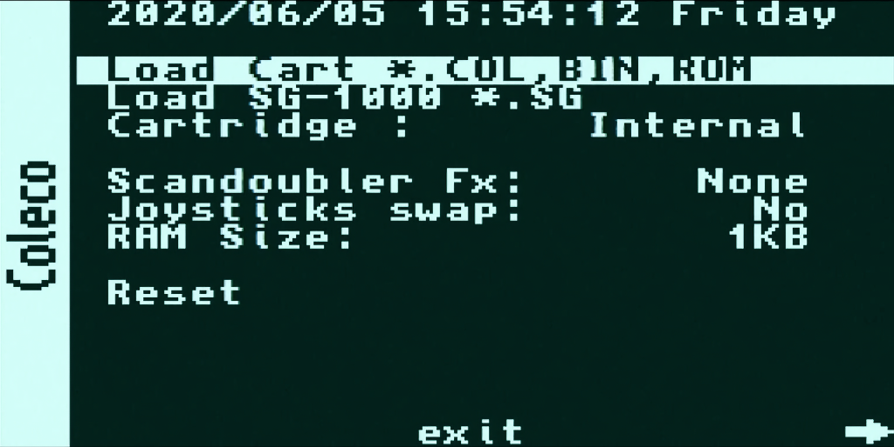
|===

Estas son las principales opciones:

- `Load Cart`: Para cargar ROMs de Colecovision desde la tarjeta SD
- `Load SG-1000`: Para cargar una ROM de SG-1000
- `Cartridge`:
- `Scandoubler fx`: Para añadir un efecto de líneas de exploración (sólo con salida VGA)
- `Joystick Swap`: Para intercambiar los controles del jugador 1 y el jugador 2
- `Ram Size`: Permite elegir elige el tamaño de la RAM. SGM en modo Colecovision permite el SuperGameModule con 32K de extensión RAM.
- `Reset`: Reiniciar el core
- `Exit`: Cierra el menú de opciones

<<<

==== CollectorVision Phoenix (Colecovision)

[role="center",width="100%",cols="5a,1a", frame=none, grid=none]
|===
|[.text-justify]
La https://collectorvision.com/phoenix/index.html[CollectorVision Phoenix] es un sistema FPGA de código abierto compatible con ColecoVision y que cuenta con dos cores incorporados de ColecoVision y Atari 2600.
|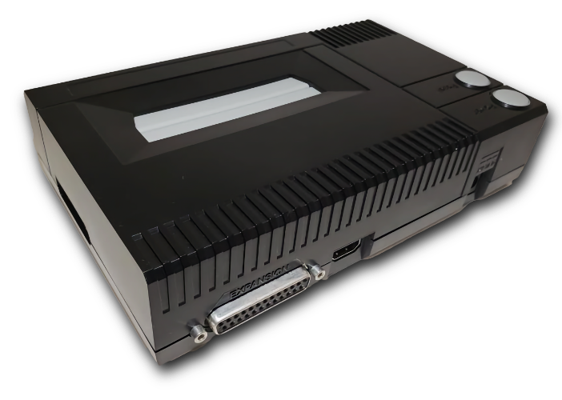
|===

El core de neptUNO+ es una adaptación del core de ColecoVision para CollectorVision Phoenix.

Notar que los controles de los juegos y la navegación para elegir ROMs son sólo con mandos. No hay emulación de los mandos en teclado.

===== Formato de Tarjeta microSD

Se debe utilizar una tarjeta microSD con la primera partición en formato exFAT o FAT32.  Es necesario un <<#_acerca_de_los_ficheros_vhd,fichero VHD de imagen de disco>>, sin particiones y con formato FAT32, conteniendo los ficheros que se quieran utilizar.

Los nombres de archivos rom en la imagen VHD deben cumplir lo siguiente:

- Longitud máxima de archivo de 126 caracteres
- Máximo de 254 archivos en un directorio (incluidos subdirectorios)
- 512 caracteres de ongitud máxima de la ruta completa
- Utilizar sólo ASCII de 7 bits en los nombres de archivo (básicamente, los caracteres de un teclado estadounidense)

Si este fichero está en la raíz de la microSD con el nombre `phoenix.vhd`, se cargará automáticamente durante el inicio del core. De no ser así, se tendrá que seleccionar desde el menú de opciones del core.

===== Controles

====== Teclas especiales y botones

Durante la ejecución del core:

- `F12`: mostrar y ocultar el menú de control del core
- `Impr. Pant` (en la pantalla de selección de ROMs): mostrar el menú de control del core phoenix

[WARNING]
====
Se necesita, al menos, un mando conectado, ya que este core no simula los controles con el teclado.
====

<<<

===== Guía básica

Al pulsar `F12`, se mostrará el menú con las distintas opciones del core. Se puede navegar utilizando las teclas de cursor. `Enter` selecciona un elemento. `F12` oculta el menú si se estaba mostrando.

[role="center",width="50%",cols="1a", frame=none, grid=none]
|===
|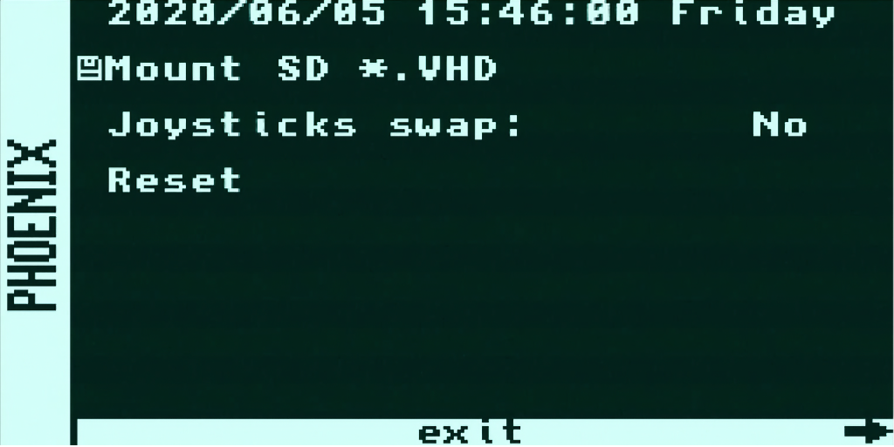
|===

Estas son las principales opciones:

- `Mount SD`:
- `Joysticks swap`: Para intercambiar el orden de los puertos de mando
- `Reset`: Reiniciar el core
- `Exit`: Cierra el menú de opciones

Si se pulsa la tecla `Impr. Pant` o el botón `Start` del mando en la pantalla de selección de ROMs de la imagen de disco, se mostrará el menú interno del core Phoenix.

[role="center",width="50%",cols="1a", frame=none, grid=none]
|===
|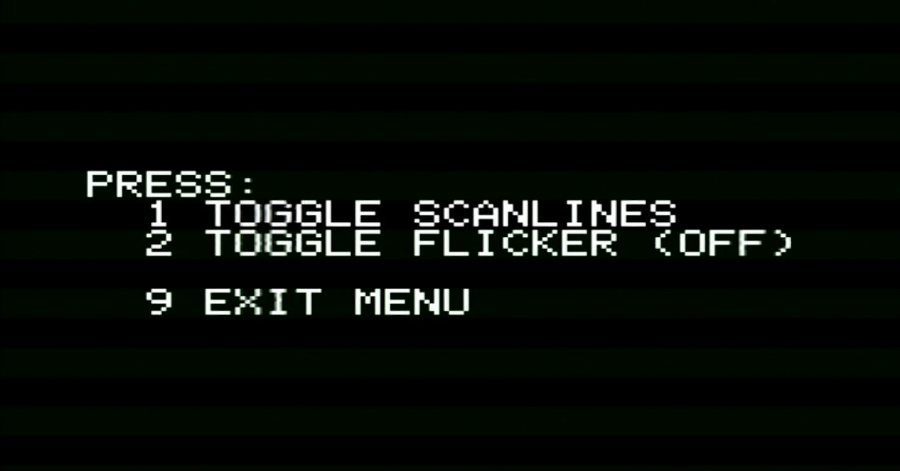
|===

- Pulsando `1` se podrán activar o desactivar las líneas de exploración
- Pulsando `2` se puede activar un efecto de parpadeo de la señal de vídeo
- Pulsando `3` se cierra este menú

<<<

==== Nintendo Entertainment System (NES)

[role="center",width="100%",cols="5a,1a", frame=none, grid=none]
|===
|[.text-justify]
Nintendo Entertainment System (también conocida como Nintendo NES o simplemente NES) es la https://es.wikipedia.org/wiki/Nintendo_Entertainment_System[segunda consola de sobremesa de Nintendo].
|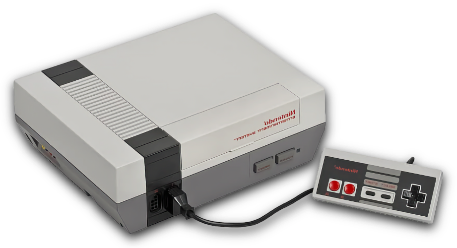
|===

Este core es una adaptación del https://github.com/mist-devel/nes[core original para Mist].

La versión adaptada de Mist tiene, entre otras, las siguientes características:

- Soporta los tipos de sistema NTSC, PAL y Dendy
- Soporta FDS con audio de expansión
- Múltiples opciones de paleta
- Soporta NSF Player
- Los controles de los juegos son sólo con mandos. No hay emulación en teclado

===== Formato de Tarjeta microSD

Se debe utilizar una tarjeta microSD con la primera partición en formato exFAT o FAT32, para almacenar los ficheros con las imágenes ROM o de cartucho, con extensión `.NES`, `FDS` o `NSF`.

Si se deja un fichero de imagen de cartucho, llamado `nes.rom`, al lado del fichero RBF correspondiente, se cargará automáticamente al iniciar el core. Este fichero puede ser invisible.

[TIP]
====
Se puede usar <<#_ucon64,uCON64>> para convertir ficheros ROM a un formato compatible con este core.
====

===== Controles

Durante la ejecución del core:

- `F12`: mostrar y ocultar el menú de control del core

[WARNING]
====
Se necesita, al menos, un mando conectado, ya que este core no simula los controles con el teclado.
====

<<<

===== Guía básica

Al pulsar `F12`, se mostrará el menú con las distintas opciones del core. Se puede navegar utilizando las teclas de cursor. `Enter` selecciona un elemento. `F12` oculta el menú si se estaba mostrando.

[role="center",width="50%",cols="1a", frame=none, grid=none]
|===
|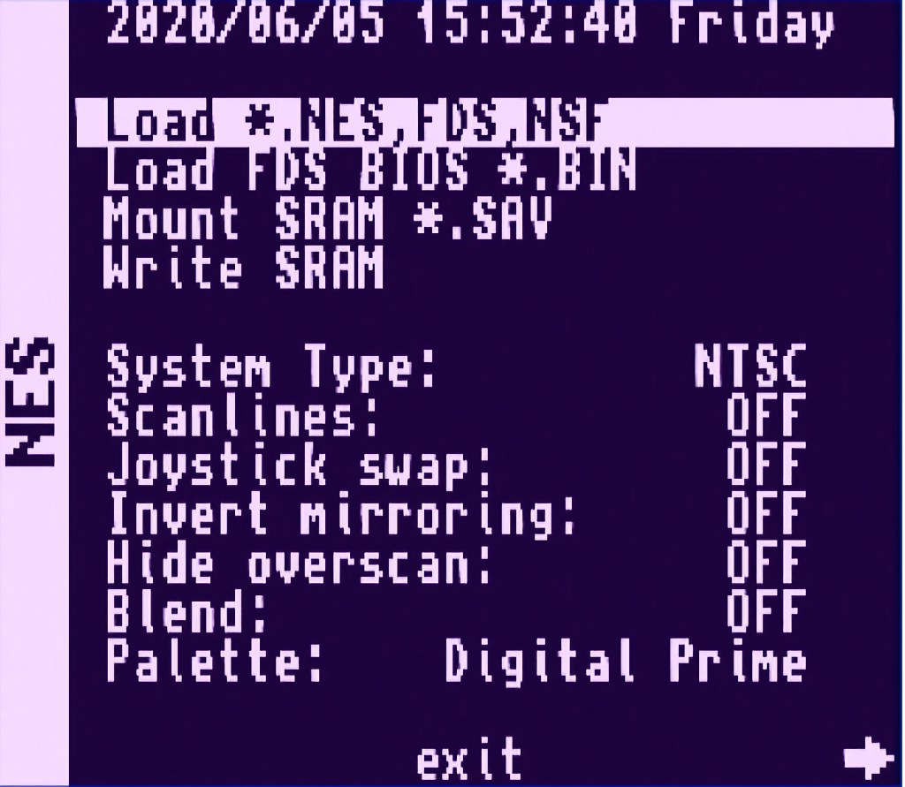
|===

En él se pueden usar las siguientes opciones:

- `Load  NES,FDS,NSF`: Para cargar un fichero de imagen de cartucho
- `Load FDS BIOS BIN`: Para cargar una BIOS de FDS. Esto es obligatorio antes de cargar un fichero `FDS`
- `Mount SRAM SAV`: Para elegir un fichero de almacenamiento SRAM, véase a continuación para más información
- `Write SRAM`: Para guardar la información de SRAM en un fichero elegido anteriormente
- `System Type`: Permite elegir el comportamiento como NTSC, PAL o Dendy
- `Scanlines`: Para añadir un efecto de líneas de exploración (sólo con salida VGA)
- `Joystick swap`: Para intercambiar los controles del jugador 1 y el jugador 2
- `Invert mirroring`:
- `Hide overscan`: Oculta o muestra los bordes extra de la imagen de vídeo
- `Blend`: Activa o desactiva un suavizado de la imagen
- `Palette`: Permite elegir entre distintas paletas de color
- `Famicon Keyboard`:
- `Disk Side`:
- `Reset`: Reiniciar el core
- `Exit`: Cierra el menú de opciones

<<<

Existen juegos que permiten guardar la partida, las mejores puntuaciones, etc. en un chip SRAM con batería. El core simula esta opción si se siguen los siguientes pasos:

- Crear un archivo vacío en la tarjeta SD con extensión `.SAV`. Ha de ser un archivo con al menos 8KiB (8192 bytes) y hasta 32KiB (32768 bytes) de tamaño.
- Después de cargar la ROM del juego, elegir la opción "Mount SRAM SAV" del menú y seleccionar el archivo creado previamente.
- Antes de cargar una nueva ROM, cambiar de core o apagar, no hay que olvidarse de volver a escribir el contenido de la RAM de respaldo en la tarjeta SD usando la opción del menú "Write Save RAM". Esto sólo es posible cuando se ha cargado previamente un fichero `.SAV`.

[TIP]
====
Los ficheros de memoria en formato de emulador son compatibles con el core. Basta con cambiar la extensión, si fuese distinta, a `.SAV` para utilizarlos con el core, y viceversa.
====

<<<

[%always]
<<<

==== Nintendo Game Boy

[role="center",width="100%",cols="5a,1a", frame=none, grid=none]
|===
|[.text-justify]
La Game Boy es una videoconsola portátil desarrollada y fabricada por Nintendo, y que salió a la venta por primera vez en Japón en 1989.
|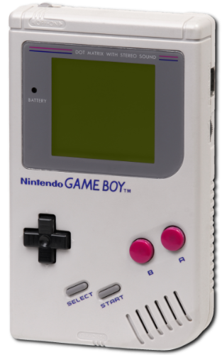
|===

Este core es una adaptación del https://github.com/delgrom/gameboy[core original para Mist] y tiene, entre otras, las siguientes características:

- Soporte para Game Boy y Game Boy Color
- Opción de inicio rápido
- DMA desde la RAM de los cartuchos
- Los controles de los juegos son sólo con mandos. No hay emulación en teclado

===== Formato de Tarjeta microSD

Se debe utilizar una tarjeta microSD, con la primera partición en formato FAT16 o FAT32, para almacenar los ficheros con las imágenes ROM o de cartucho, con extensión `GB` o `GBC`.

[TIP]
====
Se puede usar <<#_ucon64,uCON64>> para convertir ficheros ROM a un formato compatible con este core.
====

===== Controles

Durante la ejecución del core:

- `F12`: mostrar y ocultar el menú de control del core

[WARNING]
====
Se necesita, al menos, un mando conectado, ya que este core no simula los controles con el teclado.
====

<<<

===== Guía básica

Al pulsar `F12`, se mostrará el menú con las distintas opciones del core. Se puede navegar utilizando las teclas de cursor. `Enter` selecciona un elemento. `F12` oculta el menú si se estaba mostrando.

[   role="center",width="50%",cols="1a", frame=none, grid=none]
|===
|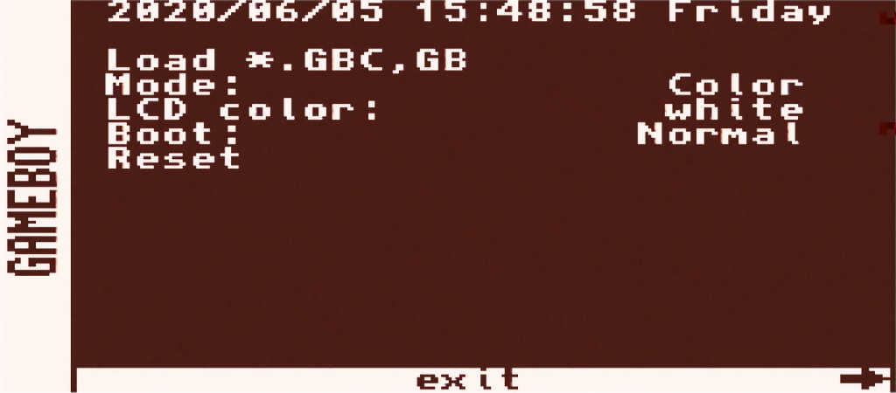
|===

En él se pueden usar las siguientes opciones:

- `Load GBC, GB`: Para elegir un fichero de cartucho
- `Mode`: Para forzar el modo como Game Boy Color o dejarlo automático
- `LCD color`:
- `Boot`: Para activar o desactivar el modo turbo de carga (sin logo)
- `Reset`: Reiniciar el core sin expulsar el cartucho seleccionado
- `Exit`: Cierra el menú de opciones

<<<

==== Philips Videopac (Magnavox Odyssey²)

[role="center",width="100%",cols="5a,1a", frame=none, grid=none]
|===
|[.text-justify]
La https://es.wikipedia.org/wiki/Magnavox_Odyssey²[Philips Videopac], también conocida como Magnavox Odyssey², Philips Videopac G7000 o Philips Odyssey² es una videoconsola lanzada en 1978.
|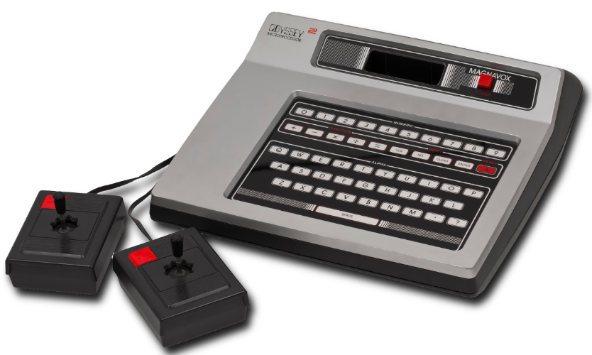
|===

La versión para neptUNO+ basada en la https://github.com/BigMist/Odyssey2-Videopac[versión para MiST, Mistica y SiDi], y tiene, entre otras, las siguientes características:

https://github.com/RW-FPGA-devel-Team/Videopac-G7000[versión creada para MiSTer].

Algunas de las características del core son:

- Modos Odyssey2 y Videopac
- Múltiples paletas de color (emulación RF compuesto y RGB para colores más vivos)
- Soporte para teclado
- Botones de joystick para las teclas 0-9
- VDC ROM charset modificable para algunas roms personalizadas
- Periférico "The Voice"

===== Formato de Tarjeta microSD

Se debe utilizar una tarjeta microSD con la primera partición en formato exFAT o FAT32, para almacenar los ficheros con las imágenes ROM que se deseen cargar, en formato `.BIN` y `.XROM`, así como los ficheros de charset en formato `.CHR`.

===== Controles

====== Teclas especiales y botones

Durante la ejecución del core:

- `F12`: mostrar y ocultar el menú de control del core
- `0`, '1', `2`, … `9` o botón `A` de un mando: Iniciar partida

[WARNING]
====
Se necesita, al menos, un mando conectado, ya que este core no simula los controles con el teclado.
====

<<<

===== Guía básica

Al pulsar `F12`, se mostrará el menú con las distintas opciones del core. Se puede navegar utilizando las teclas de cursor. `Enter` selecciona un elemento. `F12` oculta el menú si se estaba mostrando.

[role="center",width="50%",cols="1a", frame=none, grid=none]
|===
|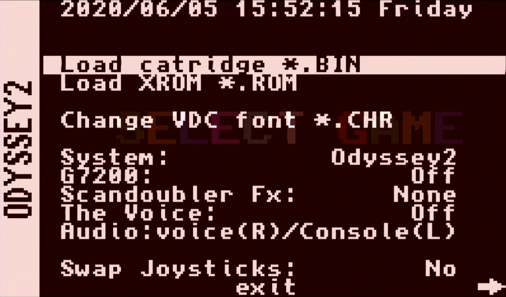
|===

En él se pueden activar, desactivar o configurar las siguientes opciones:

- `Load cartridge`: Para elegir un fichero de cartucho
- `Load XROM`: Para elegir un fichero XROM
- `Change VDC font`: Para elegir un fichero de charset
- `System`: Permite elegir entre Videopac y Odyssey²
- `G7200`: Para elegir la paleta de color a utilizar
- `Scandoubler Fx`: Para añadir un efecto de líneas de exploración (sólo con salida VGA)
- `The Voice`: Activa o desactiva el módulo the expansión "The Voice"
- `Audio`: Para elegir la distribución de sonido de la consola y "The Voice" (cuando está activo)
- `Swap Joysticks`:  Para intercambiar los controles del jugador 1 y el jugador 2
- `Reset`: Reiniciar el core sin expulsar el cartucho seleccionado
- `Exit`: Cierra el menú de opciones

Tras cargar una ROM, la mayoría de los juegos mostrarán un mensaje "SELECT GAME". Pulsar una tecla entre `0` y `9` o el botón del mando para jugar.

[WARNING]
====
El sistema no tiene claramente definido qué joystick se corresponde a cada jugador, e incluso puede irse alternando para algunos juegos, así que puede ser necesario ir cambiando entre los dos, o bien (para partidas de un sólo jugador ) usar la opción del menú que unifica los dos joysticks.
====

[TIP]
====
No suele haber información en pantalla de las opciones, así que es interesante consultar las instrucciones de cada juego (por ejemplo en https://videopac.weebly.com/[este enlace]) para saber qué hacer para jugar.
====

[TIP]
====
Si, al navegar por el directorio donde están las ROMS, no se ven todas, se puede dividir el contenido en varios subdirectorios con menos ficheros por directorio (por ejemplo, clasificando por letras) para solucionarlo.
====

===== Cambio del charset de la ROM de VDC

Es posible, para algunas ROM, cargar un archivo `CHR` con una fuente modificada, en vez de la original incluida en el chip Intel 8244/8245.

Estos archivos se pueden crear siguiendo las instrucciones y utilizando el editor disponible en el repositorio del proyecto, siguiendo https://github.com/RW-FPGA-devel-Team/videopac-G7000/tree/main/doc/Charset%20Edit[este enlace].

<<<

[%always]
<<<

==== Sega Genesis (Mega Drive)

[role="center",width="100%",cols="5a,1a", frame=none, grid=none]
|===
|[.text-justify]
https://es.wikipedia.org/wiki/Mega_Drive[Mega Drive], también conocida como Genesis en diversos territorios de América, es una videoconsola de sobremesa de 16 bits desarrollada por Sega Enterprises, Ltd. Mega Drive fue la tercera consola de Sega y la sucesora de Master System.
|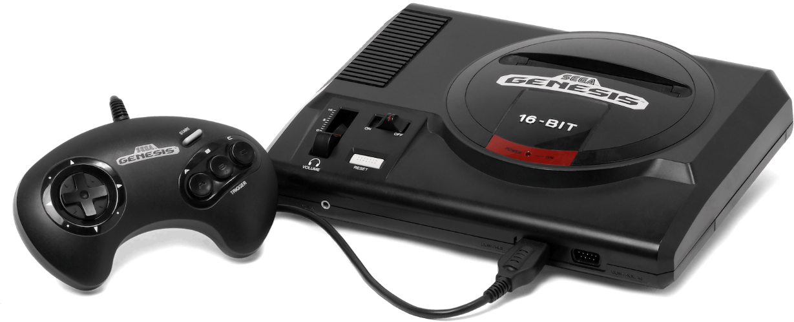
|===

La versión para neptUNO+ basada en la https://github.com/mist-devel/mist-binaries/tree/master/cores/fpgagen[ersión de MiST], y tiene, entre otras, las siguientes características:

- Procesador 68000, utilizando el núcleo TG68
- Procesador Z80, utilizando el núcleo T80
- Controlador de vídeo (VDP)
- Sonido estéreo
- Salida de vídeo analógica
- Compatibilidad con mandos de 3/6 botones

===== Formato de Tarjeta microSD

Se debe utilizar una tarjeta microSD con la primera partición en formato exFAT o FAT32, para almacenar los ficheros con las imágenes de cartucho que se deseen cargar, en formato `.BIN` o `.GEN`.

Si se deja un fichero de imagen de cartucho, llamado `genesis.rom`, al lado del fichero RBF correspondiente, se cargará automáticamente al iniciar el core. Este fichero puede ser invisible.

[TIP]
====
Se puede usar <<#_ucon64,uCON64>> para convertir ficheros ROM a un formato compatible con este core.
====

===== Controles

====== Teclas especiales y botones

Durante la ejecución del core:

- `F12`: mostrar y ocultar el menú de control del core

[WARNING]
====
Se necesita, al menos, un mando conectado, ya que este core no simula los controles con el teclado.
====

<<<

===== Guía básica

Al pulsar `F12`, se mostrará el menú con las distintas opciones del core. Se puede navegar utilizando las teclas de cursor. `Enter` selecciona un elemento. `F12` oculta el menú si se estaba mostrando.

[role="center",width="50%",cols="1a", frame=none, grid=none]
|===
|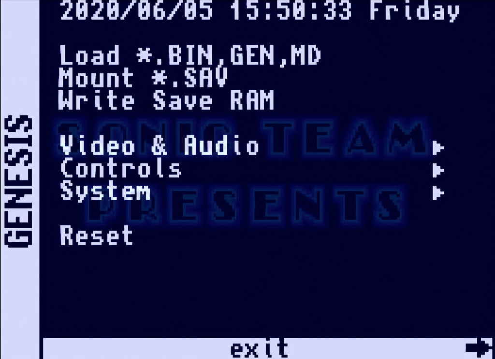
|===

En él se puede acceder a las siguientes opciones:

- `Load BIN, GEN`: Para elegir un fichero de ROM y cargarlo
- `Mount SAV`: Para elegir un fichero de almacenamiento SRAM. Véase más adelante para más información
- `Write Save RAM`: Para guardar la información de SRAM en un fichero elegido anteriormente
- `Reset`: Reiniciar el core sin expulsar el cartucho seleccionado
- `Exit`: Cierra el menú de opciones

Si se elige la opción `Video & Audio` en el menú principal del core, se mostrará este menú.

[role="center",width="40%",cols="1a", frame=none, grid=none]
|===
|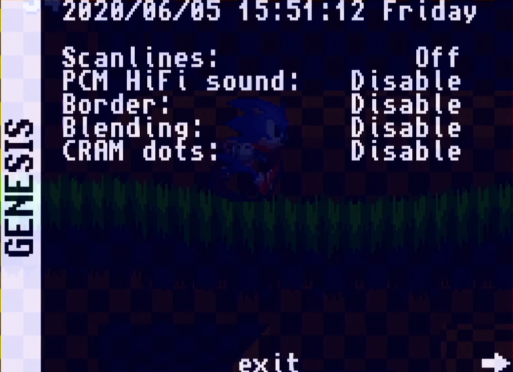
|===

Desde aquí se pueden modificar los siguientes ajustes:

- `Scanlines`: Para añadir un efecto de líneas de exploración (sólo con salida VGA)
- `PCM HiFi Sound`: Para desactivar o activar mejoras en la calidad del sonido
- `Border`: Para mostrar u ocultar el borde
- `Blending`: Para activar si se desea, un efecto de suavizado de la imagen
- `CRAM Dots`: Muestra u oculta los puntos de colores que son artefactos que suceden en modos con más de 224 líneas (NTSC). Normalmente, estas líneas no se veían en televisores reales.

Si se elige la opción `Controls` en el menú principal del core, se mostrará este menú.

[role="center",width="40%",cols="1a", frame=none, grid=none]
|===
|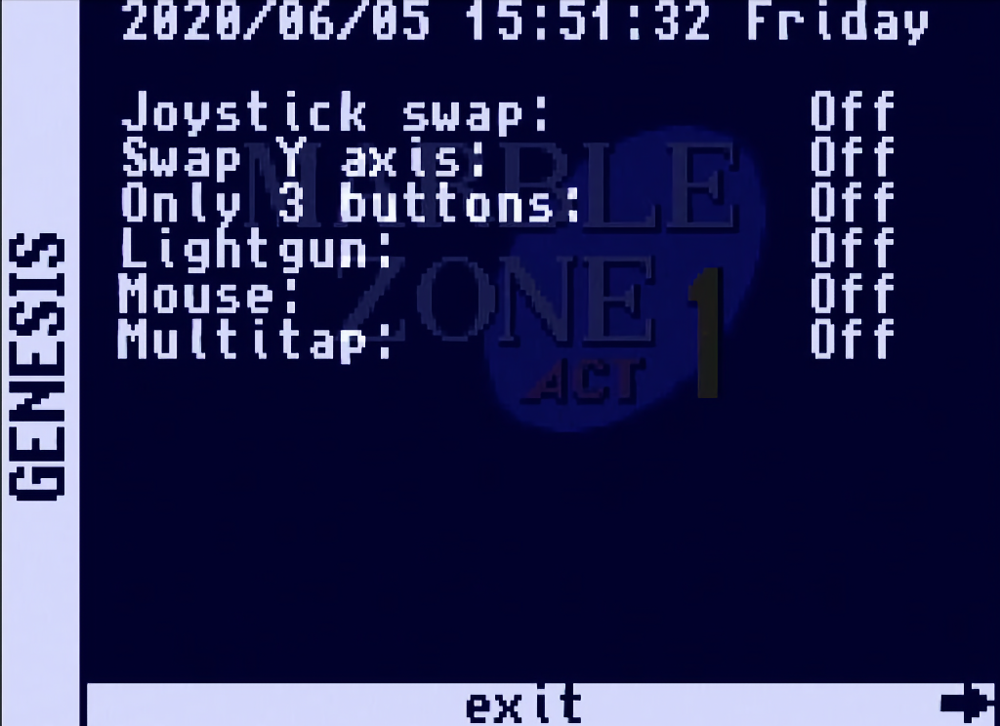
|===

Desde aquí se pueden modificar los siguientes ajustes:

- `Joystick Swap`: Para intercambiar los controles del jugador 1 y el jugador 2
- `Swap Y axis`: Invierte el comportamienteo del eje Y de los mandos, intercambiando arriba y abajo
- `Only 3 buttons`: Considera los mandos como de sólo tres botones. Esto puede mejorar la compatibilidad con algunos tipos de mando
- `Lightgun`: Activa la simulación de mandos tipo pistola
- `Mouse`: Activa la simulación de ratón
- `Multitap`: Activa la simulación de multitap

Si se elige la opción `System` en el menú principal del core, se mostrará este menú.

[role="center",width="40%",cols="1a", frame=none, grid=none]
|===
|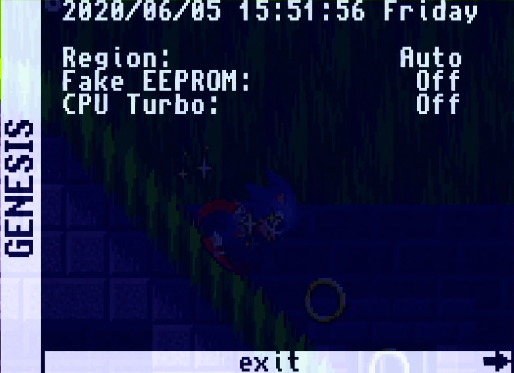
|===

Desde aquí se pueden modificar los siguientes ajustes:

- `Region`: Permite forzar una región concreta o que se configure automáticamente
- `Fake EEPROM`: Activa el soporte de EEPROM falsa
- `CPU Turbo`: Permite poner la CPU en modo ultrarrápido

<<<

Hay juegos que permiten guardar el estado o las mejores puntuaciones en un chip SRAM con batería. Esto es posible si se siguen los siguientes pasos:

- Crear un archivo vacío en la tarjeta SD con extensión `.SAV`. El tamaño máximo de la memoria RAM puede ser de 32KiB, por lo que es seguro crear un archivo con 32768 bytes de tamaño.
- Después de cargar la ROM del juego, elegir la opción "Mount SAV" del menú y elegir el archivo creado previamente.
- Antes de cargar una nueva ROM, cambiar de core o apagar, no hay que olvidarse de volver a escribir el contenido de la RAM de respaldo en la tarjeta SD usando la opción del menú "Write Save RAM". Esto sólo es posible cuando se ha cargado previamente un fichero `.SAV`.

[TIP]
====
Los archivos `.SAV` cuyo nombre coincida con el del fichero ROM correspondiente, se cargarán automáticamente. Seguirá siendo necesario guardar los datos antes de cargar otra ROM, cambiar de core o apagar.
====

[NOTE]
====
Sólo funcionan los dispositivos de backup de tipo RAM normal, la EEPROM es falsa.
Hay una lista de cartuchos que soportan copia de RAM, en https://forum.digitpress.com/forum/showthread.php?134961-NES-SNES-Genny-Games-with-Battery-Back-up-Save-feature&p=1614576&viewfull=1#post1614576
====

<<<

==== Sega Master System

[role="center",width="100%",cols="5a,1a", frame=none, grid=none]
|===
|[.text-justify]
La https://es.wikipedia.org/wiki/Master_System[Master System] es una consola de videojuegos doméstica de 8 bits fabricada y desarrollada por Sega a partir de 1986.
|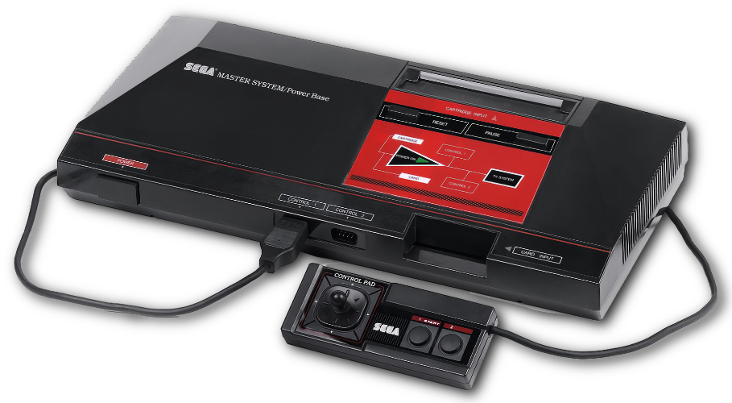
|===

Este core es una adaptación del https://github.com/gyurco/SMS-Nuked[original para Mist] y tiene las siguientes características:

- Carga de ROM desde microSD
- Soporte para mandos
- Zilog Z80 (CPU)
- Yamaha YM2602B (VDP)
- Sega 315-5216 (IO)
- Chip de sonido YM2413.

===== Formato de Tarjeta microSD

Se debe utilizar una tarjeta microSD con la primera partición en formato exFAT o FAT32, para almacenar los ficheros con las imágenes de cartucho que se deseen cargar, en formato `.BIN` o `.SMS`.

Si se deja un fichero de imagen de cartucho, llamado `NukedSMS.rom`, al lado del fichero RBF correspondiente, se cargará automáticamente al iniciar el core. Este fichero puede ser invisible.

[TIP]
====
Se puede usar <<#_ucon64,uCON64>> para convertir ficheros ROM a un formato compatible con este core.
====

===== Controles

====== Teclas especiales y botones

Durante la ejecución del core:

- `F12` o la tecla `Menu de Windows`: Mostrar y ocultar el menú de ajustes del core

[WARNING]
====
Se necesita, al menos, un mando conectado, ya que este core no simula los controles con el teclado.
====

<<<

===== Guía básica

Al pulsar `F12`, se mostrará el menú con las distintas opciones del core. Se puede navegar utilizando las teclas de cursor. `Enter` selecciona un elemento. `F12` oculta el menú si se estaba mostrando.

[role="center",width="70%",cols="1a", frame=none, grid=none]
|===
|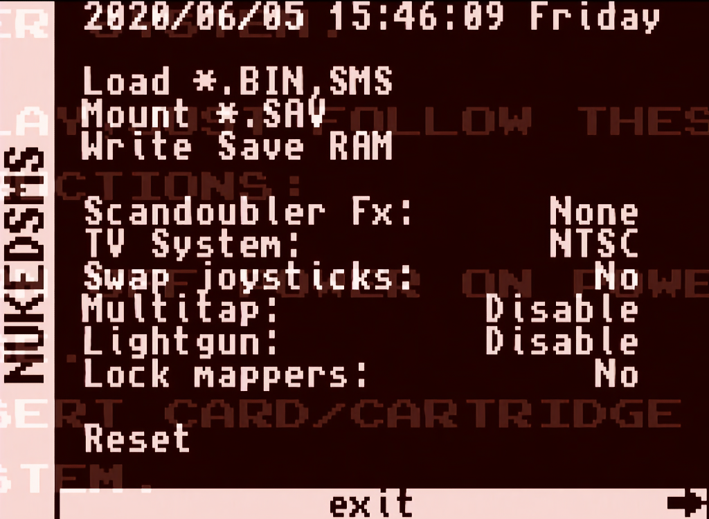
|===

Estas son las principales:

- `Load BIN, SMS`: Para elegir un fichero de ROM y cargarlo
- `Mount SAV`: Para elegir un fichero de almacenamiento SRAM, véase a continuación para más información
- `Write Save RAM`: Para guardar la información de SRAM en un fichero elegido anteriormente
- `Scandoubler Fx`: Para añadir un efecto de líneas de exploración (sólo con salida VGA)
- `TV System`:
- `Swap Joysticks`: Para intercambiar los controles del jugador 1 y el jugador 2
- `Multitap`: Activa la simulación de multitap
- `Lightgun`: Activa la simulación de mandos tipo pistola
- `Lock mappers`:
- `Reset`: Reiniciar el core sin expulsar el cartucho seleccionado
- `Exit`: Cierra el menú de opciones

<<<

Existen juegos que permiten guardar el estado o las mejores puntuaciones en un chip SRAM con batería. Esto es posible si se siguen los siguientes pasos:

- Crear un archivo vacío en la tarjeta SD con extensión `.SAV`. El tamaño máximo soportado es de 8KiB, por lo que es seguro crear un archivo con 8192 bytes de tamaño.
- Después de cargar la ROM del juego, elegir la opción "Mount SAV" del menú y seleccionar el archivo creado previamente. El LED etiquetado como `DISK` se encenderá, indicando que el archivo está cargado.
- Antes de cargar una nueva ROM, cambiar de core o apagar, no hay que olvidarse de volver a escribir el contenido de la RAM de respaldo en la tarjeta SD usando la opción del menú "Write Save RAM". Esto sólo es posible cuando se ha cargado previamente un fichero `.SAV` (el LED `DISK` está encendido).

[NOTE]
====
Hay una lista de cartuchos que soportan copia de RAM en http://www.smspower.org/Tags/MemoryBackup
====

<<<

[%always]
<<<

==== Super Nintendo Entertainment System (SNES)

[role="center",width="100%",cols="5a,1a", frame=none, grid=none]
|===
|[.text-justify]
La https://es.wikipedia.org/wiki/Super_Nintendo[Super Nintendo Entertainment System], también llamada Super Famicom es la segunda videoconsola de sobremesa de Nintendo, que la desarrolló en 1990 y la sucesora de Nintendo Entertainment System (NES) en América y Europa.
|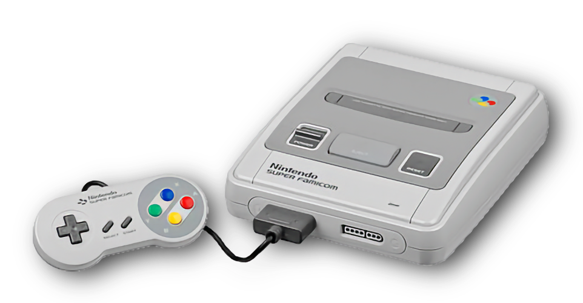
|===

La versión para neptUNO+  está basada en la https://github.com/gyurco/SNES_FPGA[versión original para MiST y MiSTer FPGA] y tiene las siguientes características:

- Réplica de ciclo preciso
- Soporta mapeo de memoria LoROM, HiROM, ExHiROM
- Chips adicionales: DSP-1/2/3/4, ST010, CX4, SDD1, SuperFX(GSU-1/2), SA1, OBC1, SPC7110, S-RTC
- Soporte MSU-1
- Permite Guardar/Cargar SRAM
- Soporte de ratón

===== Formato de Tarjeta microSD

Se debe utilizar una tarjeta microSD con la primera partición en formato exFAT o FAT32, para almacenar los ficheros con las imágenes de cartucho que se deseen cargar, en formato `.SMC`, `.SFC` o `.BIN`.

Si se deja un fichero de imagen de cartucho, llamado `snes.rom`, al lado del fichero RBF correspondiente, se cargará automáticamente al iniciar el core. Este fichero puede ser invisible.

===== Controles

====== Teclas especiales y botones

Durante la ejecución del core:

- `F12`: mostrar y ocultar el menú de control del core

[WARNING]
====
Se necesita, al menos, un mando conectado, ya que este core no simula los controles con el teclado.
====

<<<

===== Guía básica

Al pulsar `F12`, se mostrará el menú con las distintas opciones del core. Se puede navegar utilizando las teclas de cursor. `Enter` selecciona un elemento. `F12` oculta el menú si se estaba mostrando.

[role="center",width="70%",cols="1a", frame=none, grid=none]
|===
|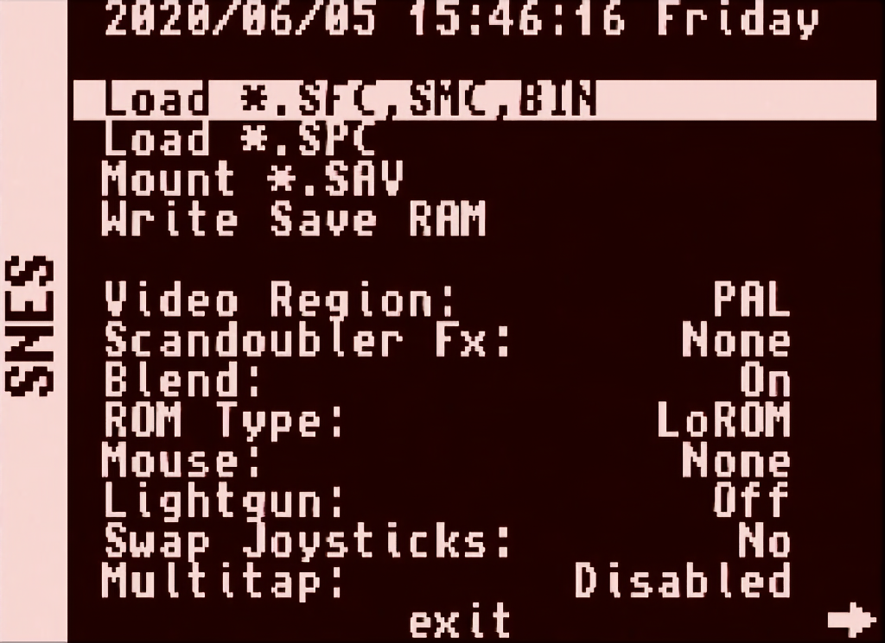
|===

Estas son las principales:

- `Load SFC, SMC, BIN`: Para elegir un fichero de imagen de cartucho y cargarlo
- `Load SPC`:
- `Mount SAV`: Para elegir un fichero de almacenamiento SRAM, véase a continuación para más información
- `Write Save RAM`: Para guardar la información de SRAM en un fichero elegido anteriormente
- `Video Region`: Para elegir una región concreta (USA, PAL)
- `Scandoubler Fx`: Para añadir un efecto de líneas de exploración (sólo con salida VGA)
- `Blend`: Para activar si se quiere, un efecto de suavizado de la imagen
- `ROM Type`:
- `Mouse`:
- `Lightgun`:
- `Swap Joysticks`: Para intercambiar los controles del jugador 1 y el jugador 2
- `Multitap`:
- `GSU Turbo`:
- `Reset`: Reiniciar el core sin expulsar el cartucho seleccionado
- `Exit`: Cierra el menú de opciones

<<<

Existen juegos que permiten guardar la partida, las mejores puntuaciones, etc. en un chip SRAM con batería. El core simula esta opción si se siguen los siguientes pasos:

- Crear un archivo vacío en la tarjeta SD con extensión `.SAV`. Ha de ser un archivo con 256KiB (262144 bytes) de tamaño.
- Después de cargar la ROM del juego, elegir la opción "Mount SAV" del menú y seleccionar el archivo creado previamente.
- Antes de cargar una nueva ROM, cambiar de core o apagar, no hay que olvidarse de volver a escribir el contenido de la RAM de respaldo en la tarjeta SD usando la opción del menú "Write Save RAM". Esto sólo es posible cuando se ha cargado previamente un fichero `.SAV`.

[TIP]
====
Los ficheros de memoria en formato de emulador son compatibles con el core. Basta con cambiar la extensión, si fuese distinta, a `.SAV` para utilizarlos con el core, y viceversa.
====

<<<

[%always]
<<<

==== SNK Neo-Geo

[role="center",width="100%",cols="5a,1a", frame=none, grid=none]
|===
|[.text-justify]
https://es.wikipedia.org/wiki/Neo-Geo[Neo-Geo] es el nombre de un sistema de 16 bits basado en cartuchos máquinas recreativas así como videoconsolas para el hogar lanzado en 1990 por la compañía de videojuegos japonesa SNK. En un principio el sistema Neo-Geo se creó como plataforma para máquinas recreativas (MVS o Multi Video System), así como videoconsola doméstica (AES o Advanced Entertainment System). Posteriormente se lanzó una versión más económica, que utilizaba discos en vez de cartuchos, https://en.wikipedia.org/wiki/Neo_Geo_CD[Neo-Geo CD].
|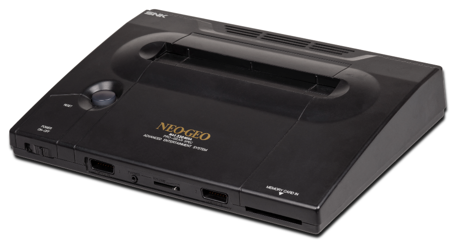
|===

La versión para neptUNO+ está basada en la la https://github.com/gyurco/NeoGeo_FPGA[versión original para MiST y MiSTer FPGA].

Algunas de las características del core son:

- Soporte para MVS, AES, CD y CDZ
- Soporte para http://unibios.free.fr/download.html[Universe BIOS]
- Compatible con ROMS en https://wiki.terraonion.com/index.php/Neobuilder_Guide[formato `.NEO`]
- Compatible con imágenes de CD, `.CUE` + `.BIN`
- Soporte con expansión de memoria de neptUNO+

===== Formato de Tarjeta microSD

Se debe utilizar una tarjeta microSD con la primera partición en formato exFAT o FAT32, para almacenar los ficheros con las imágenes de cartucho que se deseen cargar, en https://wiki.terraonion.com/index.php/Neobuilder_Guide[formato `.NEO`] o `.CUE` + `.BIN`.

Una vez copiados los ficheros en la tarjeta, se necesita, además, un fichero con las BIOS de Neo-Geo. Este se puede crear utilizando <<#_mra_tool,MRA Tool>> y tomando como referencia el fichero `.MRA` disponible en https://github.com/mist-devel/mist-binaries/blob/master/cores/neogeo/bios/Universe%20BIOS%20(Hack%2C%20Ver.%204.0).mra[el repositorio de código de la versión para MiST]. Si se copia en en el mismo directorio donde se encuentre el fichero `.rbf` del core y con el nombre `neogeo.rom`, se cargará automáticamente.

Para poder usar los modelos CD o CDZ se tiene que haber copiado también en la tarjeta microSD un fichero `.ROM` de Universe BIOS para CD, disponible para descarga http://unibios.free.fr/download.html[aquí]. Las imágenes de disco han de ser formadas únicamente por un archivo `.CUE` y un archivo de imagen. Se puede usar <<#_chdman,chdman>> para combinar ficheros de imágenes de disco múltiples.

El sistema Neo-Geo original utilizaba una gran cantidad de memoria RAM/ROM para los juegos, lo cual limita, en el caso de NeptUNO+, de la siguiente forma:

- 32 MiB - soporta 6 MiB PROMS y 24 MiB CROM+VROMs (en cualquier combinación de tamaños)
- 64 MiB - soporta 14 MiB PROMS y 48 MiB CROM+VROMs (en cualquier combinación de tamaños).
- 128 Mib - soporte completo

Véase <<#_uso_de_memoria,la sección de referencias para más información>>.

<<<

===== Controles

====== Teclas especiales y botones

Durante la ejecución del core:

- `F12`: Mostrar el menú de control del core
- Teclas de cursor o el mando 1: Controles de dirección del jugador 1
- `Ctrl Dcha` o el botón `A` del mando 1: botón `A` del jugador 1
- `Alt Dcha` o el botón `B` del mando 1: Botón `B` del jugador 1
- `Z` o el botón `X` del mando 1: botón `C` del jugador 1
- `X` o el botón `Y` del mando 1: Botón `D` del jugador 1
- `Espacio` o botón `Select` del mando 1: Insertar moneda jugador 1 (MVS)
- `Mayús. Izda` o botón `Start` del mando 1: Botón `Start` del jugador 1
- `R`, `D`, `F`, `G` o mando 2: Controles de dirección del jugador 2
- `Ctrl Izda` o el botón `A` del mando 2: botón `A` del jugador 2
- `Alt Izda` o el botón `B` del mando 2: Botón `B` del jugador 2
- `I` o el botón `X` del mando 2: botón `C` del jugador 2
- `K` o el botón `Y` del mando 2: Botón `D` del jugador 2
- `Q` o botón `Select` del mando 2: Insertar moneda jugador 2 (MVS)
- `E` o botón `Start` del mando 2: Botón `Start` del jugador 2

===== Guía básica

Si se han copiado los ficheros correctos en la tarjeta microSD y se inicia el core, aparecerá una pantalla en blanco. Al pulsar `F12`, se mostrará el menú con las distintas opciones del core. Se puede navegar utilizando las teclas de cursor. `Enter` selecciona un elemento. `F12` oculta el menú si se estaba mostrando.

[role="center",width="70%",cols="1a", frame=none, grid=none]
|===
|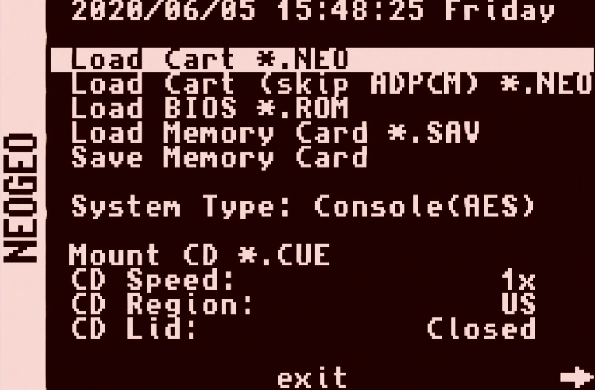
|===

Estas son las principales opciones del menú:

- `Load Cart`: Para cargar desde la tarjeta microSD un fichero .neo
- `Load Cart (skip ADPCM)`
- `Load BIOS`: Para cargar desde la tarjeta microSD un fichero BIOS distinto de `neogeo.rom`
- `Load Memory Card`: Para elegir un fichero de almacenamiento de tarjeta de memoria. Véase más adelante para más información
- `Save Memory Card`: Para guardar la información de la tarjeta de memoria en un fichero elegido anteriormente
- `System Type`: Para elegir el sistema a implementar: MVS, AES, CD o CDZ
- `Mount CD`: Para cargar desde la tarjeta un fichero `.CUE`.
- `CD Speed`: Para ajustar la velocidad del CD virtual
- `CD Region`: Región a usar en el CD virtual
- `CD Lid`: Indica el estado de la bandeja virtual de CD (abierta o cerrada)
- `Video Mode`: NTSC o PAL
- `Scanlines`: Para añadir, si se quiere, un efecto de líneas de exploración (scanlines)
- `Blending`: Para activar si se quiere, un efecto de suavizado de la imagen
- `Swap Joystick`: Para intercambiar los controles del jugador 1 y el jugador 2
- `Input`: Permite alternar entre el uso de un mando o un ratón como dispositivo de entrada
- `[DIP] Settings`: Ajustes de https://es.wikipedia.org/wiki/Interruptor_DIP[interruptores DIP]
- `[DIP] Freeplay`: Activar el luego gratis https://es.wikipedia.org/wiki/Interruptor_DIP[interruptores DIP]
- `[DIP] Freeze`: Parar el juego usando https://es.wikipedia.org/wiki/Interruptor_DIP[interruptores DIP]
- `Reset`: Reiniciar el core sin expulsar el cartucho seleccionado
- `Exit`: Cierra el menú de opciones

<<<

Si se elige la opción `Cart Options` en el menú principal del core, se mostrará este menú.

[role="center",width="50%",cols="1a", frame=none, grid=none]
|===
|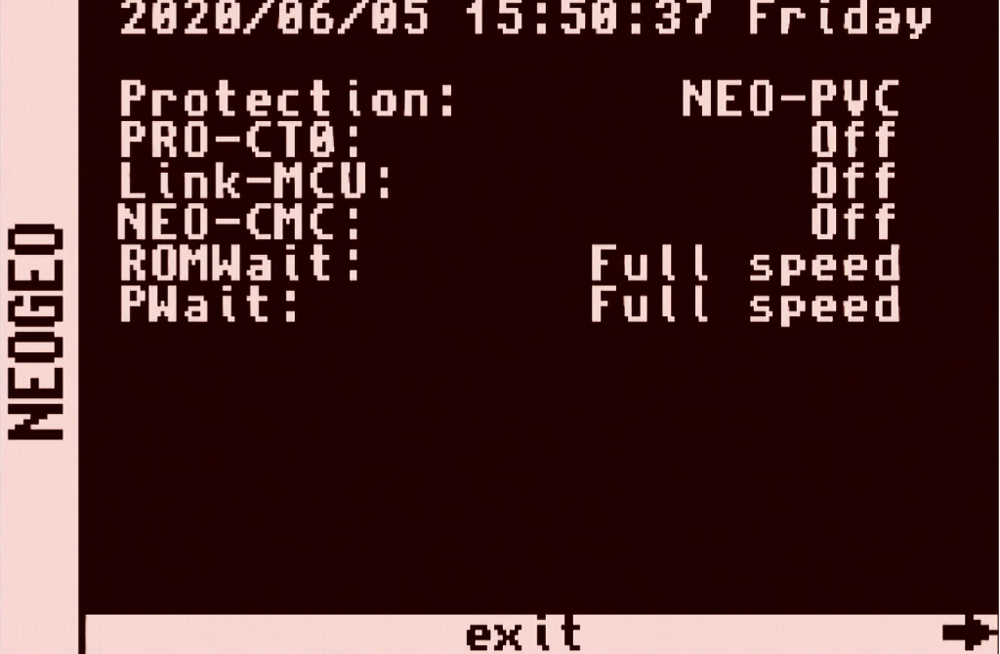
|===

Desde aquí se pueden modificar los siguientes ajustes:

- `Protection`: Para activar soporte de protecciones. Véase a continuación para más detalles. 
- `Pro-CT0`: 
- `Link-MCU`: 
- `Neo-CMC`: 
- `RomWait`: 
- `PWait`: 

Para poder cargar imágenes de disco, se tiene que elegir un modelo compatible (CD o CDZ) y cargar la BIOS correspondiente desde el menú.

Algunos juegos requieren activar desde el menú `Cart Options` la opción "Protection" correspondiente. Si se había cargado el juego, para que funcione hay que hacer `Reset` después de haber elegido la protección. Sin embargo, si se elige la protección antes de cargarlo, se iniciará correctamente desde el principio. Consultar <<#_protecciones,la sección de referencias para más información>>.

Se puede simular una tarjeta de memoria, para utilizarla con juegos que lo soporten (para guardar las mejores puntuaciones, etc.), si se siguen los siguientes pasos:

- Crear un archivo vacío en la tarjeta SD con extensión `.SAV`. Ha de ser un archivo con 8KiB (8192 bytes) de tamaño.
- Después de cargar la ROM del juego, elegir la opción "Mount SAV" del menú y seleccionar el archivo creado previamente.
- Antes de cargar una nueva ROM, cambiar de core o apagar, no hay que olvidarse de volver a escribir el contenido de la RAM de respaldo en la tarjeta SD usando la opción del menú "Write Save RAM". Esto sólo es posible cuando se ha cargado previamente un fichero `.SAV`.

[TIP]
====
Si el archivo de memoria `.SAV` se guarda en la raíz de la tarjeta con el nombre `NeoGeo.vhd`, se montará automáticamente.
====

<<<

==== TurboGrafx-16 (PC Engine) y PC Engine SuperGrafx

[role="center",width="100%",cols="5a,1a", frame=none, grid=none]
|===
|[.text-justify]
https://es.wikipedia.org/wiki/PC_Engine[PC Engine], también conocida como TurboGrafx-16 en Estados Unidos y Turbografx en Europa, es una videoconsola que fue lanzada por NEC y Hudson Soft en 1987. PC Engine SuperGrafx es la consola sucesora, fabricada por NEC Home Electronics y lanzada en Japón en 1989.
|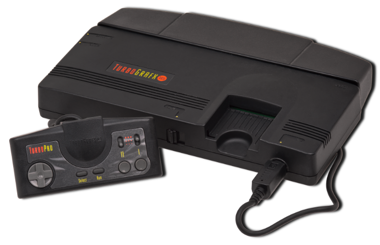
|===

La versión para neptUNO+ basada en la https://github.com/mist-devel/TurboGrafx16_FPGA[versión para MiST, MiSTer, etc.] y tiene, entre otras, las siguientes características:

- Compatible con SuperGrafx
- Compatible con CD-ROM
- Soporte de SRAM
- Soporte para mapeadores de ROM especiales de 384K, 768K, Populous y SF2
- Multitap hasta 5 mandos (4 funcionan)

===== Formato de Tarjeta microSD

Se debe utilizar una tarjeta microSD con la primera partición en formato exFAT o FAT32, para almacenar los ficheros con las imágenes de cartucho o de disco  que se deseen cargar.

Una vez copiados los ficheros en la tarjeta, se necesita, además, un fichero con una  BIOS de PC Engine (normalmente `syscard3.pce`). Si se copia en en el mismo directorio donde se encuentre el fichero `.rbf` del core y con el nombre `tgfx16.rom`, se cargará automáticamente.

Para usar imágenes de disco, estas han de ser formadas únicamente por un archivo `.CUE` y un archivo de imagen. Se puede usar <<#_chdman,chdman>> para combinar ficheros de imágenes de disco múltiples.

[TIP]
====
Se puede usar <<#_ucon64,uCON64>> para convertir ficheros ROM a un formato compatible con este core.
====

===== Controles

====== Teclas especiales y botones

Durante la ejecución del core:

- `F12`: mostrar y ocultar el menú de control del core

[WARNING]
====
Se necesita, al menos, un mando conectado, ya que este core no simula los controles con el teclado.
====

<<<

===== Guía básica

Al pulsar `F12`, se mostrará el menú con las distintas opciones del core. Se puede navegar utilizando las teclas de cursor. `Enter` selecciona un elemento. `F12` oculta el menú si se estaba mostrando.

[role="center",width="70%",cols="1a", frame=none, grid=none]
|===
|image:img/pcengine_menu.png[scaledwidth=100%]
|===

- `Load *.BIN,*.PCE,*.SGX`: Carga una ROM. Según la extensión lo hará en modo en modo TurboGrafx o SuperGrafx
- `Mount CD *.CUE`: Monta una imagen de disco
- `Mount *.SAV`: Carga un archivo de guardado para juegos de CD que lo soporten
- `Write Save RAM`: Para guardar la información de SRAM en un fichero elegido anteriormente
- `Arcade Card`: Añade RAM extra para juegos de CD
- `Sprite Limit`: Permite aumentar el número gráficos (sprites) por encima del límite del hardware original
- `Reset`: Reiniciar el core sin expulsar el juego cargado
- `Exit`: Cierra el menú de opciones

<<<

Si se elige la opción `Video Options` en el menú principal del core, se mostrará este menú.

[role="center",width="70%",cols="1a", frame=none, grid=none]
|===
|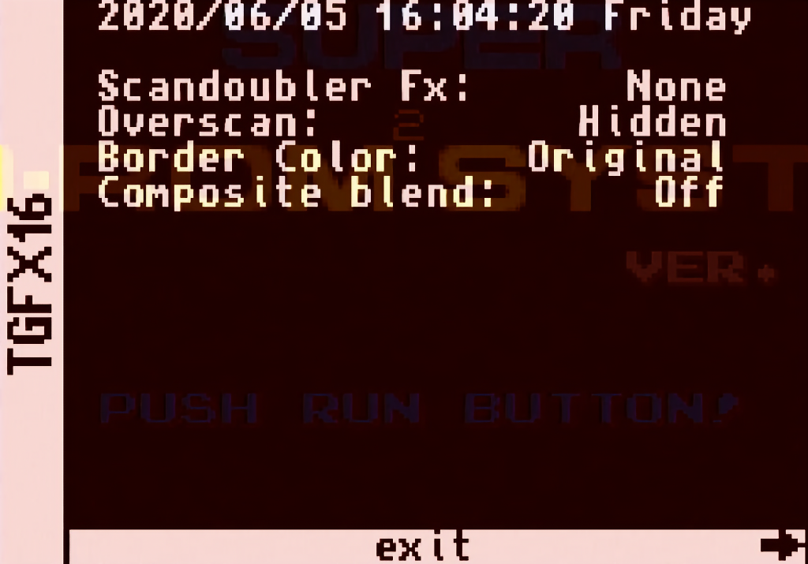
|===

Desde aquí se pueden modificar los siguientes ajustes:

- `Scandoubler Fx`: Para añadir un efecto de líneas de exploración (sólo con salida VGA)
- `Overscan`: Permite mostrar u ocultar la imagen extra de vídeo (normalmente oculta en monitores CRT)
- `Border Color`: Para configurar el comportamiento del color del borde, alterando el original o no
- `Composite blend`: Para activar si se quiere, un efecto de suavizado de la imagen

<<<

Si se elige la opción `Controllers` en el menú principal del core, se mostrará este menú.

[role="center",width="70%",cols="1a", frame=none, grid=none]
|===
|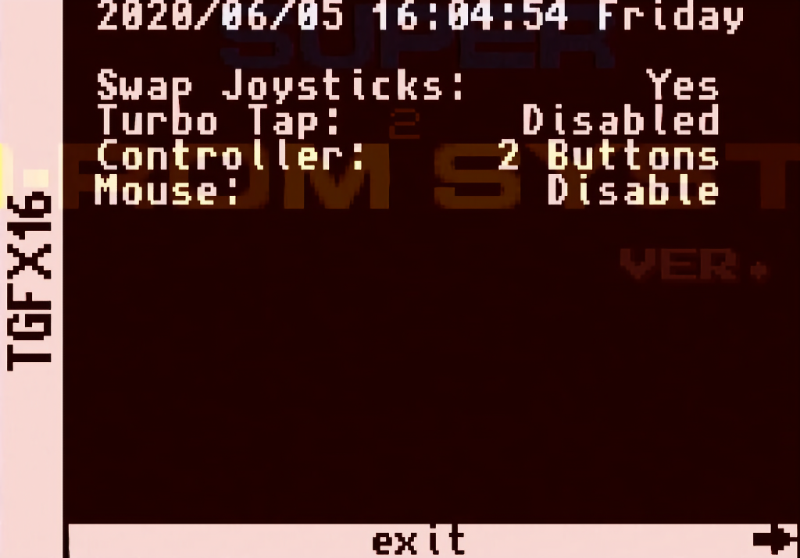
|===

Desde aquí se pueden modificar los siguientes ajustes:

- `Swap Joysticks`: Para intercambiar el puerto utilizado ara los controles del jugador
- `Turbo Tap`: Activa o desactiva el soporte para varios mandos
- `Controller`: Permite elegir entre controles de 2 o de 6 botones
- `Mouse`: Habilita el soporte de control con ratón

Existen juegos de disco que permiten guardar el estado o las mejores puntuaciones. Esto es posible si se siguen los siguientes pasos:

- Crear un archivo vacío en la tarjeta SD con extensión `.SAV` Ha de ser un archivo con 2KiB (2048 bytes) de tamaño.
- Elegir la opción "Mount SAV" del menú y seleccionar el archivo creado previamente. Antes del primer uso, formatearlo usando la opción el menú "Write Save RAM"
- Antes de cargar una nueva ROM, cambiar de core o apagar, no hay que olvidarse de volver a escribir el contenido en la tarjeta SD usando la opción del menú "Write Save RAM".

<<<

== Otro hardware

=== Carga desde cinta

Para algunos cores como, por ejemplo, el de Spectrum o el de MSX, es posible cargar, igual que se hacía en las máquinas originales, desde un dispositivo externo de audio como un reproductor de cassette u otro que lo simule.

Normalmente, se debe utilizar un cable adecuado para la <<#_puertos_y_conectores,entrada de sonido de neptUNO+>>, concretamente, ha de ser un cable con un jack estéreo de 3,5 mm en un extremo dos salidas mono en el otro (una para cada canal de audio), conectando el extremo del canal mono derecho al dispositivo de reproducción de cintas, o bien usar un cable estéreo, pero asegurándose de que el sonido se está transmitiendo por el canal derecho (esto no es necesario en <<#_miniduino,Miniduino o Maxduino>>, ya que utilizan automáticamente sólo el canal derecho de sonido al reproducir).

==== Reproductor de cassette

El funcionamiento es exactamente igual que se hacía con los equipos originales:

. Conectar el cable de audio
. Ejecutar en el equipo o elegir la opción correspondiente a la carga desde cinta. Por ejemplo, en ZX Spectrum 48K, pulsando `J`, a continuación, dos veces, `"` y luego `Enter` para ejecutar el clásico `LOAD "" + Enter`
. Iniciar la reproducción de la cinta (es posible que haya que hacer distintos intentos ajustando el volumen del reproductor)

==== Ordenador

Según el sistema operativo (Windows, macOS, Linux) existen múltiples alternativas de programas que pueden, o bien reproducir directamente un archivo de cinta (`TAP`, `TZX`, `PZX`, etc.) y emitir el sonido por la salida de auriculares, o bien crear un fichero de sonido (`WAV`, `VOC`, `AU`, etc.) que se puede reproducir también con programas de música o sonido.

===== PlayTZX

Este programa para Windows, macOS o Linux, permite reproducir un fichero de cinta `TZX` a través de la salida de sonido del ordenador.

Se puede descargar el fichero binario (por ejemplo, para Windows desde https://worldofspectrum.net/utilities/%23tzxtools[World of Spectrum Classic] y para Mac desde https://github.com/kounch/playtzx/releases[este repositorio de GitHub]) o compilar el código fuente como se explica <<#_compilar_código_fuente_macos_o_linux,a continuación>>.

. Conectar el cable de audio entre la salida del ordenador y la entrada de audio del neptUNO+ (recordar conectar únicamente el extremo del canal mono derecho al extremo del PC/Mac, etc.)
. Ejecutar en el equipo o elegir la opción correspondiente a la carga desde cinta. Por ejemplo, en ZX Spectrum 48K pulsando `J` a continuación, dos veces, `"` y luego `Enter` para ejecutar el clásico `LOAD "" + Enter`

<<<

[start=3]
. Iniciar la reproducción de un fichero de cinta con el siguiente comando (es posible que haya que hacer distintos intentos ajustando el volumen de salida del equipo)

[source,shell]
----
./playtzx <fichero de cinta>
----

Si todo va bien, se irá viendo en la consola los distintos bloque de carga de la cinta, mientras el sonido se produce y el core del neptUNO+ carga el programa.

[TIP]
====
En Linux, el programa utiliza como salida el dispositivo `/dev/dsp`, así que, en versiones más modernas, es posible, por ejemplo, que haya que cargar módulos como `snd_pcm_oss` (en el caso de sistemas que utilicen ALSA), para que funcione correctamente.
====

====== Compilar código fuente (macOS o Linux)

Verificar que están instaladas las herramientas de desarrollo, incluyendo un compilador de C (`gcc`, `clang` herramientas de desarrollador de línea de comandos en Mac, etc.) y https://es.wikipedia.org/wiki/GNU_build_system[GNU Autotools].

Descargar el código fuente https://github.com/kounch/playtzx[desde este repositorio]), descomprimirlo y acceder en una consola al directorio, y ejecutar los comandos:

[source,shell]
----
aclocal && autoconf && autoheader && automake --add-missing
./configure
make
----

Si todo se ha hecho correctamente, se habrá generado el fichero `playtzx` que se puede copiar a donde se desee en el disco duro y utilizar. Se puede borrar el directorio descomprimido donde se compiló.

==== Teléfono móvil, tableta, reproductor de sonido MP3, etc.

En general, existen muy pocas alternativas (o ninguna) alternativas de programas que puedan reproducir directamente un archivo de cinta en un dispositivo móvil, así que, normalmente, será necesario convertir a un fichero de audio el contenido de la cinta antes de intentar cargarla con uno de estos aparatos.

https://zxtape.net es una web, compatible con dispositivos móviles, con soporte para reproducir ficheros TAP y TZX

https://github.com/semack/zx_tape_player[ZX Tape Player] es una App para sistemas iOS y Android que es capaz de reproducir directamente a través de la salida de auriculares

https://play.google.com/store/apps/details?id=com.baltazarstudios.playzxtapes[PlayZX] es otra App similar, pero sólo para sistemas Android.

[WARNING]
====
Los dispositivos con salida de auriculares modernos, suelen estar pensados para manejar impedancias el orden de unas pocas decenas de ohmios. Esto, a veces, puede ser insuficiente para la entrada del neptUNO+.

En esos casos, se recomienda (si es posible) desactivar las limitaciones de volumen máximo de auriculares y/o utilizar un dispositivo amplificador de auriculares, que eleve la impedancia.
====

Los pasos a seguir en este caso son:

. Conectar el cable de audio entre la salida del dispositivo móvil y la entrada de audio del neptUNO+ (recordar conectar únicamente el extremo del canal mono derecho al extremo del PC/Mac, etc.)
. Ejecutar en el equipo o elegir la opción correspondiente a la carga desde cinta. Por ejemplo, en ZX Spectrum 48K pulsando `J` a continuación, dos veces, `"` y luego `Enter` para ejecutar el clásico `LOAD "" + Enter`
. Iniciar la reproducción del fichero de audio (o del fichero de cinta en el caso de PlayZX). Es posible que haya que hacer distintos intentos ajustando el volumen del reproductor/amplificador.

===== Conversión a fichero de audio

A continuación se indican algunos de los muchos programas que existen para distintos sistemas operativos, y que pueden exportar ficheros de cinta a ficheros de audio.

https://www.alessandrogrussu.it/tapir/index.html[Tapir] es un programa con interfaz gráfica para Windows (pero que se puede usar también con Wine en Linux o Mac) que permite cargar ficheros `TZX` y `TAP` y exportarlos como `WAV` de audio

`tape2wav` de https://fuse-emulator.sourceforge.net/[Fuse Utilities] es una utilidad de línea de comandos que exporta desde ficheros `TZX` `PZX` y `TAP` a `WAV`. Disponibles para muchos sistemas operativos distintos.

`pzx2wav` en http://zxds.raxoft.cz/pzx.html[PZX Tools] es otra utilidad de comandos que exporta desde ficheros `PZX` a `WAV`. Disponible como ejecutable para Windows, y con el código fuente disponible para compilar en otros sistemas.

<<<

==== Miniduino

include::miniduino_es.adoc[leveloffset=+3]

<<<

== Referencias

=== Características Técnicas

Estas son las características técnicas principales:

- FPGA: https://ark.intel.com/content/www/us/en/ark/products/210476/cyclone-iv-ep4cgx150-fpga.html[Altera EP4CGX150 Cyclone IV] de 150K celdas
- Memoria: 32MB, 64MB o 128MB de https://es.wikipedia.org/wiki/SDRAM[SDRAM]
- Almacenamiento: Lector de https://es.wikipedia.org/wiki/MicroSD[tarjetas MicroSDHC]
- Vídeo: https://es.wikipedia.org/wiki/Conversor_de_señal_digital_a_analógica[DAC] RGB (https://es.wikipedia.org/wiki/Color_verdadero[(truecolor - 24-bit]). Salida DE-15 (VGA y RGB)
- Salida de sonido: https://es.wikipedia.org/wiki/Modulación_Sigma-Delta[Sigma-Delta] e https://es.wikipedia.org/wiki/I²S[I^2^S]. Conector para jack de 3,5mm.
- Entrada de sonido: Conector para jack de 3,5mm.
- https://sinclair.wiki.zxnet.co.uk/wiki/ZX_Spectrum_edge_connector[Conector edge] de ZX Spectrum: Abre la posibilidad de usar dispositivos externos como los usados por el Spectrum, cartuchos de MSX, etc.
- Mandos: 2 entradas de joystick DB-9 compatibles con norma Atari (2 botones) y megadrive (8 botones).
- 2 entradas PS/2: Para conectar teclado y un ratón.
- 1 entrada USB A: Para conectar teclados o mandos de juegos.

<<<

=== Compatibilidad de Mandos DB9

En principio, todos los mandos norma Atari o Mega Drive con conector DB9 son compatibles con aquellos cores que estén preparados para este tipo de conexión. Esto incluye mandos de Mega Drive o Master System, Joysticks Quickshot, Joysticks Sony, etc.

[role="center",options="header"]
|===
|Core|Compat.|Notas
|Amstrad CPC|No|
|Arcades IREM62|No|
|Arcades IREM72|Sí|
|Arcades Jotego|Parcial|Algunos cores funcionan
|Atari 7800|Sí|
|Atari ST|Sí|
|Commodore 64|No|
|Commodore Amiga|Sí|
|Megadrive|Sí|
|MSX|No|
|Neo Geo|Sí|
|Nes|Sí|
|PC Engine|Sí|
|Snes|No|
|ZX Spectrum|No|
|===

Recordar que es posible <<#_configuración_de_mandos_db9,configurar el firmware de Mist para que detecte los 6 botones de mandos de mega drive>>.

<<<

=== Mandos USB Compatibles

En el momento de redactar este manual, se sabía que los siguientes mandos funcionaban correctamente

[role="center",options="header"]
|===
|Nombre|Notas
|8 Bitdo M30 Wireless Pad 2,4Ghz Mega Drive/Saturn style|
|Capcom Home Arcade|en modo USB
|Control Pad Megadrive mini 2 usb|
|DATA FROG P02 Mando inalámbrico para PS4|vía cable USB
|Guillemot DA Leader|Requiere remapeo de botones
|Hori Fighting Commander 5 USB PS3/PS4/PC|sólo funciona en modo PS3
|Hori Fighting Stick Hayabusa PS4/PS3/PC|
|Madcatz T.E.2+ ps3/4|
|MayFlash F300 Arcade Stick|
|Mega Drive Mini 3 button pad|
|PCE mini Turbo Controller|
|Quanba Q1 PS3/PC|vía cable USB
|Retrobit Megadrive 8-button Arcade Pad 2.4GHz Wireless|
|Retrobit Sega Saturn 8-button Arcade Pad 2.4GHz Wireless|
|Super Nintendo Classic Mini:The EDGE Super Joystick|
|Sony PlayStation Classic Mini:Mandos incluidos|
|Taito Egret II Mini Arcade Stick|
|Taito Egret II Mini Pad|
|Venom Arcade Stick ps3/4|
|===

<<<

=== Arcades

==== Juegos por core

A continuación se enumeran distintos juegos de máquina recreativa, según el core asociado, e indicando el nombre correspondiente de MAME.

===== Alpha Densi M68000 Hardware

Nombre habitual del core: `alpha68k`.

[role="center",options="header"]
|===
|Nombre Juego|Nombre ROM
|Gang Wars|gangwars
|Gold Medalist|goldmedl
|Sky Adventure|skyadvnt
|Sky Soldiers|skysoldr
|Super Champion Baseball|sbasebal
|Time Soldiers|timesold
|===

===== Atari Centipede Hardware

Nombre habitual del core: `centiped`.

[role="center",options="header"]
|===
|Nombre Juego|Nombre ROM
|Centipede|centiped
|Millipede|milliped
|===

===== Atari Missile Command

Nombre habitual del core: `MissileC`.

[role="center",options="header"]
|===
|Nombre Juego|Nombre ROM
|Missile Command|missile
|===

===== Atari Tetris Hardware

Nombre habitual del core: `ataritetris`.

[role="center",options="header"]
|===
|Nombre Juego|Nombre ROM
|Tetris|atetris
|===

<<<

===== Bagman Hardware

Nombre habitual del core: `bagman`.

[role="center",options="header"]
|===
|Nombre Juego|Nombre ROM
|Bagman|bagman
|Botanic|botanic
|Pickin'|pickin
|Squash|squaitsa
|Super Bagman|sbagman
|===

===== Crazy Climber Hardware

Nombre habitual del core: `cclimber`.

[role="center",options="header"]
|===
|Nombre Juego|Nombre ROM
|Big Kong|ckong
|Crazy Climber|cclimber
|Crazy Kong (Kyoei)|ckong
|Crazy Kong Part II|ckongpt2
|Donkey Kong (Spanish Crazy Kong bootleg)|ckong
|Guzzler|guzzler
|River Patrol|rpatrol
|Silver Land|rpatrol
|Swimmer|swimmer
|Yamato|yamato
|===

===== Data East Express Raider

Nombre habitual del core: `expressraider`.

[role="center",options="header"]
|===
|Nombre Juego|Nombre ROM
|Express Raider|exprraid
|Western Express|exprraid
|===

<<<

===== Gottlieb QBert Hardware

Nombre habitual del core: `qbert`.

[role="center",options="header"]
|===
|Nombre Juego|Nombre ROM
|Argus|argusg
|Curve Ball|curvebal
|Insector|insector
|Knightmare|kngtmare
|Krull|krull
|Mad Planets|mplanets
|Q'bert|qbert
|QBert Qubes|qbertqub
|Tylz|tylz
|===

===== Gremlin Blockade Hardware

Nombre habitual del core: `blockade`.

[role="center",options="header"]
|===
|Nombre Juego|Nombre ROM
|Blasto|blasto
|Blockade|blockade
|CoMotion|comotion
|Hustle|hustle
|Minesweeper|mineswpr
|Minesweeper4P|mineswpr
|===

===== Irem M-52 Hardware

Nombre habitual del core: `travrusa`.

[role="center",options="header"]
|===
|Nombre Juego|Nombre ROM
|Strider|shtrider
|Traverse USA|travrusa
|===

<<<

===== Irem M-57 Hardware

Nombre habitual del core: `TropicalAngel`.

[role="center",options="header"]
|===
|Nombre Juego|Nombre ROM
|New Tropical Angel|troangel
|Tropical Angel|troangel
|===

===== Irem M-62 Hardware

Nombre habitual del core: `iremm62`.

[role="center",options="header"]
|===
|Nombre Juego|Nombre ROM
|Battle Road|battroad
|Horizon|horizon
|Kid Niki|kidniki
|Kung Fu Master|kungfum
|Lode Runner|ldrun
|Lode Runner 2|ldrun2
|Lode Runner 3|ldrun3
|Lode Runner 4|ldrun4
|Spelunker|spelunkr
|Spelunker 2|spelunk2
|Youjyudn|youjyudn
|===

<<<

===== Irem M-72 Hardware

Nombre habitual del core: `IremM72`.

[role="center",options="header"]
|===
|Nombre Juego|Nombre ROM
|Air Duel|airduelm72
|Daiku no Gensan|dkgensan
|Dragon Breed|dbreedjm72
|Gallop - Armed Police Unit|cosmccop
|Hammerin' Harry|hharry
|Image Fight|imgfightj
|Legend of Hero Tonma|lohtj
|Mr. HELI no Daibouken|mrheli
|Ninja Spirit|nspirit
|R-Type|rtype
|R-Type II|rtype2
|X Multiply|xmultiplm72
|===

===== Irem M-92 Hardware

Nombre habitual del core: `IremM92`.

[role="center",options="header"]
|===
|Nombre Juego|Nombre ROM
|Blade Master|bmaster
|Dream Soccer '94|dsoccr94
|Gun Force II|gunforc2
|Gunforce - Battle Fire Engulfed Terror Island|gunforce
|Hook|hook
|In The Hunt|inthunt
|Lethal Thunder|lethalth
|Major Title 2|majtitl2
|Mystic Riders|mysticri
|Ninja Baseball Bat Man|nbbatman
|R-Type Leo|rtypeleo
|Superior Soldiers|ssoldier
|Undercover Cops|uccops
|Undercover Cops - Alpha Renewal Version|uccops
|===

===== Jaleco Mega System 1 A Hardware

Nombre habitual del core: `megasys1_a`.

[role="center",options="header"]
|===
|Nombre Juego|Nombre ROM
|E.D.F. : Earth Defense Force (Japan, Prototype)|edfp
|Hachoo|hachoo
|Iga Ninjyutsuden (Japan)|iganinju
|In Your Face (US, Prototype)|inyourfa
|Jitsuryoku!! Pro Yakyuu (Japan)|jitsupro
|Ninja Kazan (World)|kazan
|P-47 - The Freedom Fighter (Japan, Export)|p47je
|P-47 - The Freedom Fighter (Japan)|p47j
|P-47 - The Phantom Fighter (World)|p47
|Phantasm (Japan)|phantasm
|Plus Alpha|plusalph
|R&T (Rod-Land Prototype)|rittam
|Rod-Land (Japan)|rodlandj
|Rod-Land (World, Set 1)|rodland
|Rod-Land (World, Set 2)|rodlanda
|Saint Dragon (Set 1)|stdragon
|Saint Dragon (Set 2)|stdragona
|Soldam (Japan)|soldamj
|Soldam|soldam
|The Astyanax (EPROM Version)|astyanax
|The Astyanax (Mask ROM Version)|astyanaxa
|The Lord of King (Japan)|lordofk
|===

===== 1942 Hardware

Nombre habitual del core: `jt1942`.

[role="center",options="header"]
|===
|Nombre Juego|Nombre ROM
|1942|1942
|Pirate Ship Higemaru|higemaru
|Vulgus|vulgus
|===

===== 1943 Hardware

Nombre habitual del core: `jt1943`.

[role="center",options="header"]
|===
|Nombre Juego|Nombre ROM
|1943 Kai Midway Kaisen|1943kai
|1943 The Battle of Midway|1943
|1943 The Battle of Midway Mark II|1943mii
|===

===== A-Jax Hardware

Nombre habitual del core: `jtajax`.

[role="center",options="header"]
|===
|Nombre Juego|Nombre ROM
|Ajax|ajax
|Ajax (Japan)|ajaxj
|Typhoon|typhoon
|===

===== Aliens Hardware

Nombre habitual del core: `jtaliens`.

[role="center",options="header"]
|===
|Nombre Juego|Nombre ROM
|Aliens|aliens
|Crime Fighters|crimfght
|Gang Busters|gbusters
|Super Contra|scontra
|Thunder Cross|thunderx
|===

===== Bionic Commando Hardware

Nombre habitual del core: `jtbiocom`.

[role="center",options="header"]
|===
|Nombre Juego|Nombre ROM
|Bionic Commando|bionicc
|===

<<<

===== Black Tiger Hardware

Nombre habitual del core: `jtbtiger`.

[role="center",options="header"]
|===
|Nombre Juego|Nombre ROM
|Black Tiger|blktiger
|===

===== Bubble Bobble Hardware

Nombre habitual del core: `jtbubl`.

[role="center",options="header"]
|===
|Nombre Juego|Nombre ROM
|Bubble Bobble|bublbobl
|Tokio - Scramble Formation|tokio
|===

===== Haunted Castle Hardware

Nombre habitual del core: `jtcastle`.

[role="center",options="header"]
|===
|Nombre Juego|Nombre ROM
|Haunted Castle|hcastle
|===

===== Circus Charlie Hardware

Nombre habitual del core: `jtcircus`.

[role="center",options="header"]
|===
|Nombre Juego|Nombre ROM
|Circus Charlie|circusc
|===

===== Commando Hardware

Nombre habitual del core: `jtcommnd`.

[role="center",options="header"]
|===
|Nombre Juego|Nombre ROM
|Commando|commando
|===

<<<

===== Combat School Hardware

Nombre habitual del core: `jtcomsc`.

[role="center",options="header"]
|===
|Nombre Juego|Nombre ROM
|Combat School|combatsc
|===

===== Contra Hardware

Nombre habitual del core: `jtcontra`.

[role="center",options="header"]
|===
|Nombre Juego|Nombre ROM
|Contra|contra
|===

===== Robocop Hardware

Nombre habitual del core: `jtcop`.

[role="center",options="header"]
|===
|Nombre Juego|Nombre ROM
|Hippodrome|hippodrm
|Robocop|robocop
|===

<<<

===== Capcom Play System 1 Hardware

Nombre habitual del core: `jtcps1`.

[role="center",options="header"]
|===
|Nombre Juego|Nombre ROM
|1941 Counter Attack|1941
|Adventure Quiz Capcom World 2|cworld2j
|Captain Commando|captcomm
|Carrier Air Wing|cawing
|Dynasty Wars|dynwar
|Final Fight|ffight
|Forgotten Worlds|forgottn
|Ghouls'n Ghosts|ghouls
|Gulun.Pa!|gulunpa
|Knights of the Round|knights
|Magic Sword Heroic Fantasy|msword
|Magical Pumpkin Puroland de Daibouken|mpumpkin
|Mega Man The Power Battle|megaman
|Mega Twins|mtwins
|Mercs|mercs
|Nemo|nemo
|Pang! 3|pang3
|Pnickies|pnickj
|Pokonyan! Balloon|pokonyan
|Quiz & Dragons Capcom Quiz Game|qad
|Quiz Tonosama no Yabou 2 Zenkoku-ban|qtono2j
|Street Fighter II The World Warrior|sf2
|Street Fighter II' Champion Edition|sf2ce
|Street Fighter II' Hyper Fighting|sf2hf
|Street Fighter Zero|sfzch
|Strider|strider
|The King of Dragons|kod
|Three Wonders|3wonders
|U.N. Squadron|unsquad
|Varth Operation Thunderstorm|varth
|Willow|willow
|===

===== Capcom Play System 1.5 Hardware

Nombre habitual del core: `jtcps15`.

[role="center",options="header"]
|===
|Nombre Juego|Nombre ROM
|Cadillacs and Dinosaurs|dino
|Muscle Bomber Duo Ultimate Team Battle|mbombrd
|Saturday Night Slam Masters|slammast
|Tenchi wo Kurau II Sekiheki no Tatakai|wofch
|The Punisher|punisher
|Warriors of Fate|wof
|===

===== Capcom Play System 2 Hardware

Nombre habitual del core: `jtcps2`.

[role="center",options="header"]
|===
|Nombre Juego|Nombre ROM
|1944 The Loop Master|1944
|19XX The War Against Destiny|19xx
|Alien vs. Predator|avsp
|Armored Warriors|armwar
|Battle Circuit|batcir
|Capcom Sports Club|csclub
|Cyberbots Fullmetal Madness|cybots
|Darkstalkers The Night Warriors|dstlk
|Dimahoo|dimahoo
|Dungeons & Dragons Shadow over Mystara|ddsom
|Dungeons & Dragons Tower of Doom|ddtod
|Eco Fighters|ecofghtr
|Giga Wing|gigawing
|Hyper Street Fighter II The Anniversary Edition|hsf2
|Janpai Puzzle Choukou|choko
|Jyangokushi Haoh no Saihai|jyangoku
|Mars Matrix Hyper Solid Shooting|mmatrix
|Marvel Super Heroes|msh
|Marvel Super Heroes Vs. Street Fighter|mshvsf
|Marvel Vs. Capcom Clash of Super Heroes|mvsc
|Mega Man 2 The Power Fighters|megaman2
|Mighty! Pang (Euro 001010)|mpang
|Night Warriors Darkstalkers' Revenge|nwarr
|Progear (USA 010117)|progear
|Puzz Loop 2 (Euro 010302)|pzloop2
|Quiz Nanairo Dreams Nijiirochou no Kiseki|qndream
|Ring of Destruction Slammasters II|ringdest
|Street Fighter Alpha 2|sfa2
|Street Fighter Alpha 3|sfa3
|Street Fighter Alpha Warriors' Dreams|sfa
|Street Fighter Zero 2 Alpha|sfz2al
|Super Gem Fighter Mini Mix|sgemf
|Super Puzzle Fighter II Turbo|spf2t
|Super Street Fighter II The New Challengers|ssf2
|Super Street Fighter II Turbo|ssf2t
|Vampire Hunter 2 Darkstalkers Revenge|vhunt2
|Vampire Savior 2 The Lord of Vampire|vsav2
|Vampire Savior The Lord of Vampire|vsav
|X-Men Children of the Atom|xmcota
|X-Men Vs. Street Fighter|xmvsf
|===

===== Double Dragon Hardware

Nombre habitual del core: `jtdd`.

[role="center",options="header"]
|===
|Nombre Juego|Nombre ROM
|Double Dragon|ddragon
|===

===== Double Dragon 2 Hardware

Nombre habitual del core: `jtdd2`.

[role="center",options="header"]
|===
|Nombre Juego|Nombre ROM
|Double Dragon II The Revenge|ddragon2
|===

<<<

===== Exed Exes Hardware

Nombre habitual del core: `jtexed`.

[role="center",options="header"]
|===
|Nombre Juego|Nombre ROM
|Exed Exes|exedexes
|===

===== Fast Lane Hardware

Nombre habitual del core: `jtflane`.

[role="center",options="header"]
|===
|Nombre Juego|Nombre ROM
|Fast Lane|fastlane
|===

===== The FairyLand Story Hardware

Nombre habitual del core: `jtflstory`.

[role="center",options="header"]
|===
|Nombre Juego|Nombre ROMs
|Bronx|bronx
|N.Y. Captor|nycaptor
|Onna Sanshirou - Typhoon Gal|onna34ro
|Rumba Lumber|rumba
|The FairyLand Story|flstory
|Victorious Nine|victnine
|===

===== The Final Round Hardware

Nombre habitual del core: `jtfround`.

[role="center",options="header"]
|===
|Nombre Juego|Nombre ROM
|The Final Round |fround
|===

===== Ninja Gaiden Hardware

Nombre habitual del core: `jtgaiden`.

[role="center",options="header"]
|===
|Nombre Juego|Nombre ROM
|Raiga - Strato Fighter|stratof
|Shadow Warriors|shadoww
|Wild Fang - Tecmo Knight|wildfang
|===

===== Ghosts'n Goblins Hardware

Nombre habitual del core: `jtgng`.

[role="center",options="header"]
|===
|Nombre Juego|Nombre ROM
|Ghosts'n Goblins |gng
|===

===== Gun.Smoke Hardware

Nombre habitual del core: `jtgunsmk`.

[role="center",options="header"]
|===
|Nombre Juego|Nombre ROM
|Gun.Smoke|gunsmoke
|===

===== Karnov Hardware

Nombre habitual del core: `jtkarnov`.

[role="center",options="header"]
|===
|Nombre Juego|Nombre ROM
|Chelnov - Atomic Runner|chelnov
|Karnov|karnov
|Wonder Planet|wndrplnt
|===

===== Karate Champ Hardware

Nombre habitual del core: `jtkchamp`.

[role="center",options="header"]
|===
|Nombre Juego|Nombre ROM
|Karate Champ|kchamp
|===

===== Kicker Hardware

Nombre habitual del core: `jtkicker`.

[role="center",options="header"]
|===
|Nombre Juego|Nombre ROM
|Kicker|kicker
|===

===== The NewZealand Story Hardware

Nombre habitual del core: `jtkiwi`.

[role="center",options="header"]
|===
|Nombre Juego|Nombre ROM
|Arkanoid - Revenge of DOH|arknoid2
|Dr. Toppel's Adventure|drtoppel
|Extermination|extrmatn
|Insector X|insectx
|Kageki|kageki
|The NewZealand Story|tnzs
|===

===== Renegade Hardware

Nombre habitual del core: `jtkunio`.

[role="center",options="header"]
|===
|Nombre Juego|Nombre ROM
|Renegade|renegade
|===

===== Trick Trap Hardware

Nombre habitual del core: `jtlabrun`.

[role="center",options="header"]
|===
|Nombre Juego|Nombre ROM
|Trick Trap|tricktrp
|===

<<<

===== Midnight Resistance Hardware

Nombre habitual del core: `jtmidres`.

[role="center",options="header"]
|===
|Nombre Juego|Nombre ROM
|Midnight Resistance|midres
|===

===== Mikie Hardware

Nombre habitual del core: `jtmikie`.

[role="center",options="header"]
|===
|Nombre Juego|Nombre ROM
|Mikie|mikie
|===

===== MX 5000 Hardware

Nombre habitual del core: `jtmx5k`.

[role="center",options="header"]
|===
|Nombre Juego|Nombre ROM
|MX 5000|mx5000
|===

===== Bad Dudes Vs. DragonNinja Hardware

Nombre habitual del core: `jtninja`.

[role="center",options="header"]
|===
|Nombre Juego|Nombre ROM
|Bad Dudes vs. Dragonninja|baddudes
|Heavy Barrel|hbarrel
|===

===== Out Run Hardware

Nombre habitual del core: `jtoutrun`.

[role="center",options="header"]
|===
|Nombre Juego|Nombre ROM
|Out Run|outrun
|Turbo Out Run (Out Run upgrade)|toutrun
|===

===== Pac-Land Hardware

Nombre habitual del core: `jtpaclan`.

[role="center",options="header"]
|===
|Nombre Juego|Nombre ROM
|Pac-Land|pacland
|===

===== Pang Hardware

Nombre habitual del core: `jtpang`.

[role="center",options="header"]
|===
|Nombre Juego|Nombre ROM
|Block Block|block
|Capcom World|cworld
|Dokaben|dokaben
|Pang|pang
|Super Pang|spang
|===

===== Parodius Da! Hardware

Nombre habitual del core: `jtparoda`.

[role="center",options="header"]
|===
|Nombre Juego|Nombre ROM
|Parodius Da! Shinwa kara Owarai e|parodius
|Surprise Attack|suratk
|===

===== Konami's Ping-Pong Hardware

Nombre habitual del core: `jtpinpon`.

[role="center",options="header"]
|===
|Nombre Juego|Nombre ROM
|Konami's Ping-Pong|pingpong
|===

===== Rastan Saga Hardware

Nombre habitual del core: `jtrastan`.

[role="center",options="header"]
|===
|Nombre Juego|Nombre ROM
|Rastan|rastan
|===

<<<

===== Road Fighter Hardware

Nombre habitual del core: `jtroadf`.

[role="center",options="header"]
|===
|Nombre Juego|Nombre ROM
|Hyper Sports|hyperspt
|Road Fighter|roadf
|===

===== Roc'n Rope Hardware

Nombre habitual del core: `jtroc`.

[role="center",options="header"]
|===
|Nombre Juego|Nombre ROM
|Roc'n Rope|rocnrope
|===

===== The Speed Rumbler Hardware

Nombre habitual del core: `jtrumble`.

[role="center",options="header"]
|===
|Nombre Juego|Nombre ROM
|The Speed Rumbler|srumbler
|===

===== Sega System 16 Hardware

Nombre habitual del core: `jts16`.

[role="center",options="header"]
|===
|Nombre Juego|Nombre ROM
|Ace Attacker|aceattaca
|Action Fighter|afighter
|Alex Kidd The Lost Stars|alexkidd
|Body Slam|bodyslam
|Fantasy Zone|fantzone
|Major League|mjleague
|Quartet|quartet
|Quartet 2|quartet2a
|SDI Strategic Defense Initiative|sdi
|Shinobi|shinobi
|Tetris|tetris
|===

<<<

===== Sega System 16B Hardware

Nombre habitual del core: `jts16b`.

[role="center",options="header"]
|===
|Nombre Juego|Nombre ROM
|Alien Syndrome|aliensyn
|Altered Beast|altbeast
|Aurail|aurail
|Bay Route|bayroute
|Bullet|bullet
|Cotton|cotton
|Dunk Shot|dunkshot
|Dynamite Dux|ddux
|E-Swat - Cyber Police|eswat
|Excite League|exctleag
|Fantasy Zone II - The Tears of Opa-Opa|fantzn2x
|Flash Point|fpoint
|Golden Axe|goldnaxe
|MVP|mvp
|Passing Shot|passsht
|Riot City|riotcity
|RyuKyu|ryukyu
|Sonic Boom|sonicbom
|Sukeban Jansi Ryuko|sjryuko
|Super League|suprleag
|Time Scanner|timescan
|Toryumon|toryumon
|Tough Turf|tturfu
|Wonder Boy III - Monster Lair|wb3
|Wrestle War|wrestwar
|===

<<<

===== Sega System 18 Hardware

Nombre habitual del core: `jts18`.

[role="center",options="header"]
|===
|Nombre Juego|Nombre ROM
|Alien Storm (World, 2 Players)|astorm
|Bloxeed|bloxeed
|Clockwork Aquario|aquario
|Clutch Hitter|cltchitr
|D. D. Crew|ddcrew
|Desert Breaker|desertbr
|Hammer Away|hamaway
|Laser Ghost|lghost
|Michael Jackson's Moonwalker|mwalk
|Shadow Dancer|shdancer
|Wally wo Sagase!|wwallyj
|===

<<<

===== Hyper Dyne Side Arms Hardware

Nombre habitual del core: `jtsarms`.

[role="center",options="header"]
|===
|Nombre Juego|Nombre ROM
|Side Arms|sidearms
|===

===== Super Basketball Hardware

Nombre habitual del core: `jtsbaskt`.

[role="center",options="header"]
|===
|Nombre Juego|Nombre ROM
|Super Basketball|sbasketb
|===

===== Section Z Hardware

Nombre habitual del core: `jtsectnz`.

[role="center",options="header"]
|===
|Nombre Juego|Nombre ROM
|Legendary Wings|lwings
|Section Z|sectionz
|===

===== Street Fighter Hardware

Nombre habitual del core: `jtsf`.

[role="center",options="header"]
|===
|Nombre Juego|Nombre ROM
|Street Fighter|sf
|===

<<<

===== Super Hang-On Hardware

Nombre habitual del core: `jtshanon`.

[role="center",options="header"]
|===
|Nombre Juego|Nombre ROM
|Super Hang-On|shangon
|===

===== Splatterhouse Hardware

Nombre habitual del core: `jtshouse`.

[role="center",options="header"]
|===
|Nombre Juego|Nombre ROM
|Bakutotsu Kijuutei|bakutotu
|Blast Off|blastoff
|Blazer|blazer
|Boxy Boy|boxyboy
|Chou Zetsurinjin Berabowman|berabohm
|Dangerous Seed|dangseed
|Dragon Spirit|dspirit
|Face Off|faceoff
|Galaga '88|galaga88
|Marchen Maze|mmaze
|Pac-Mania|pacmania
|Pistol Daimyo no Bouken|pistoldm
|Pro Tennis World Court|wldcourt
|Pro Yakyuu World Stadium|ws
|Quester|quester
|Rompers|rompers
|Shadowland|shadowld
|Splatter House|splatter
|Tank Force|tankfrce
|===

===== The Simpsons Hardware

Nombre habitual del core: `jtsimson`.

[role="center",options="header"]
|===
|Nombre Juego|Nombre ROM
|The Simpsons|simpsons
|Vendetta|vendetta
|===

===== Sly Spy Hardware

Nombre habitual del core: `jtslyspy`.

[role="center",options="header"]
|===
|Nombre Juego|Nombre ROM
|Boulder Dash - Boulder Dash Part 2|bouldash
|Secret Agent|secretag
|===

===== Teenage Mutant Ninja Turtles Hardware

Nombre habitual del core: `jttmnt`.

[role="center",options="header"]
|===
|Nombre Juego|Nombre ROM
|M.I.A. - Missing in Action|mia
|Punk Shot|punkshot
|Teenage Mutant Ninja Turtles|tmnt
|===

===== Toki Hardware

Nombre habitual del core: `jttoki`.

[role="center",options="header"]
|===
|Nombre Juego|Nombre ROM
|Toki|toki
|===

===== Tiger Road Hardware

Nombre habitual del core: `jttora`.

[role="center",options="header"]
|===
|Nombre Juego|Nombre ROM
|F-1 Dream|f1dream
|Tiger Road|tigeroad
|===

===== Track & Field Hardware

Nombre habitual del core: `jttrack`.

[role="center",options="header"]
|===
|Nombre Juego|Nombre ROM
|Track & Field|trackfld
|===

===== Trojan Hardware

Nombre habitual del core: `jttrojan`.

[role="center",options="header"]
|===
|Nombre Juego|Nombre ROM
|Trojan|trojan
|===

===== Konami Twin 16 Hardware

Nombre habitual del core: `jttwin16`.

[role="center",options="header"]
|===
|Nombre Juego|Nombre ROM
|Devil World|devilw
|Vulcan Venture|vulcan
|===

===== Vigilante Hardware

Nombre habitual del core: `jtvigil`.

[role="center",options="header"]
|===
|Nombre Juego|Nombre ROM
|Vigilante|vigilant
|===

===== Gridiron Fight Hardware

Nombre habitual del core: `jtwc`.

[role="center",options="header"]
|===
|Nombre Juego|Nombre ROM
|Gridiron Fight|gridiron
|Tehkan World Cup (set 1)|tehkanwc
|===

===== WWF SuperStars Hardware

Nombre habitual del core: `jtwwfss`.

[role="center",options="header"]
|===
|Nombre Juego|Nombre ROM
|WWF Superstars|wwfsstar
|===

===== X-Men Hardware

Nombre habitual del core: `jtxmen`.

[role="center",options="header"]
|===
|Nombre Juego|Nombre ROM
|X-Men|xmen

|===

===== Yie Ar Kung-Fu Hardware

Nombre habitual del core: `jtyiear`.

[role="center",options="header"]
|===
|Nombre Juego|Nombre ROM
|Yie Ar Kung-Fu|yiear
|===

===== Kiwako Mr. Jong Hardware

Nombre habitual del core: `mrjong`.

[role="center",options="header"]
|===
|Nombre Juego|Nombre ROM
|BlockBuster|blkbustr
|CrazyBlocks|crazyblk
|Mr Jong|mrjong
|===

===== Konami Finalizer Hardware

Nombre habitual del core: `Finalizr`.

[role="center",options="header"]
|===
|Nombre Juego|Nombre ROM
|Finalizer - Super Transformation|finalizr
|===

===== Konami Gyruss Hardware

Nombre habitual del core: `Gyruss`.

[role="center",options="header"]
|===
|Nombre Juego|Nombre ROM
|Gyruss|gyruss
|===

===== Konami Iron Horse Hardware

Nombre habitual del core: `IronHors`.

[role="center",options="header"]
|===
|Nombre Juego|Nombre ROM
|Iron Horse|ironhors
|===

===== Konami Jailbreak Hardware

Nombre habitual del core: `jailbrek`.

[role="center",options="header"]
|===
|Nombre Juego|Nombre ROM
|Green Beret|gberet
|Jailbreak|jailbrek
|Manhattan 24 Bunsyo|jailbrek
|Mr. Goemon|mrgoemon
|Rush'n Attack|gberet
|===

===== Konami Pooyan Hardware

Nombre habitual del core: `pooyan`.

[role="center",options="header"]
|===
|Nombre Juego|Nombre ROM
|Pooyan|pooyan
|===

===== Konami Scooter Shooter Hardware

Nombre habitual del core: `ScotrSht`.

[role="center",options="header"]
|===
|Nombre Juego|Nombre ROM
|Scooter Shooter|scotrsht
|===

===== Konami Time Pilot '84 Hardware

Nombre habitual del core: `TP84`.

[role="center",options="header"]
|===
|Nombre Juego|Nombre ROM
|Time Pilot '84|tp84
|===

===== Midway MCR-1 Hardware

Nombre habitual del core: `mcr1`.

[role="center",options="header"]
|===
|Nombre Juego|Nombre ROM
|Draw Poker|dpoker
|Kick|kick
|Kick-Man|kick
|Solar Fox|solarfox
|===

===== Midway MCR-2 Hardware

Nombre habitual del core: `mcr2` o `Journey`.

[role="center",options="header"]
|===
|Nombre Juego|Nombre ROM
|Journey|journey
|Domino Man|domino
|Kozmik Kroozr|kroozr
|Satans Hollow|shollow
|Tron|tron
|Two Tigers|twotiger
|Wacko|wacko
|===

===== Midway MCR-3 Hardware

Nombre habitual del core: `mcr3`.

[role="center",options="header"]
|===
|Nombre Juego|Nombre ROM
|Demolition Derby|demoderb
|Discs of Tron|dotron
|Max RPM|maxrpm
|Power Drive|powerdrv
|Rampage|rampage
|Sarge|sarge
|Tapper|tapper
|Timber|timber
|===

<<<

===== Namco Galaxian Hardware

Nombre habitual del core: `galaxian`.

[role="center",options="header"]
|===
|Nombre Juego|Nombre ROM
|Azurian Attack|azurian
|Black Hole|blkhole
|Catacomb|catacomb
|Chewing Gum|luctoday
|Devil Fish|devilfsh
|Galaxian|galaxian
|King and Balloon|kingball
|Lucky Today|luctoday
|Moon Cresta|mooncrst
|Omega|theend
|Orbitron|orbitron
|Pisces|pisces
|Triple Draw Poker|tdpgal
|UniWar S|uniwars
|Victory|victoryc
|War of the Bugs|warofbug
|===

<<<

===== Namco Pac-Man Hardware

Nombre habitual del core: `pacman`.

[role="center",options="header"]
|===
|Nombre Juego|Nombre ROM
|Ali Baba and 40 Thieves|alibaba
|Beastie Feastie (Pac-Man Conversion)|suprglob
|Birdiy|birdiy
|Crush Roller|crush
|Dream Shopper|dremshpr
|Eeek! (Pac-Man Conversion)|eeekk
|Eggor|eggor
|Eyes|eyes
|Gorkans|mrtnt
|Jump Shot|jumpshot
|Lizard Wizard|lizwiz
|Mr. TNT|mrtnt
|Ms. Pac-Man|mspacman
|Number Crash|numcrash
|Pac-Man (Midway)|puckman
|Pac-Man Club- Club Lambada|clubpacm
|Pac-Man Plus|pacplus
|Pac-Manic Miner|pacminer
|Ponpoko|ponpoko
|Puck Man|puckman
|Super Glob (Pac-Man)|suprglob
|The Glob (Pac-Man Hardware)|suprglob
|Van-Van Car|vanvan
|Woodpecker|woodpeck
|===

<<<

===== Namco Rally-X Hardware

Nombre habitual del core: `rallyx`.

[role="center",options="header"]
|===
|Nombre Juego|Nombre ROM
|Commando (Sega)|commsega
|Jungler|jungler
|Loco-motion|locomotn
|New Rally-X|nrallyx
|Rally-X|rallyx
|Tactician|tactcian
|===

===== Namco Super Pac-Man Hardware

Nombre habitual del core: `druaga`.

[role="center",options="header"]
|===
|Nombre Juego|Nombre ROM
|Dig Dug 2|digdug2
|Grobda|grobda
|Mappy|mappy
|Motos|motos
|Pac n Pal|pacnpal
|Pac-Man & Chomp Chomp|pacnpal
|Super Pacman|superpac
|The Tower of Druaga|todruaga
|===

===== Nichibutsu Galivan Hardware

Nombre habitual del core: `galivan`.

[role="center",options="header"]
|===
|Nombre Juego|Nombre ROM
|Cosmo Police Galivan|galivan
|Ufo Robo Dangar|dangar
|===

<<<

===== Nichibutsu M68000 Hardware

Nombre habitual del core: `armedf` y `terracresta`.

[role="center",options="header"]
|===
|Nombre Juego|Nombre ROM
|Armed F|armedf
|Crazy Climber 2|cclimbr2
|Kozure Ookami|kozure
|Legion - Spinner-87|legion
|Sky Robo|skyrobo
|Terra Force|terraf
|Kid no Hore Hore Daisakusen|horekid
|Sei Senshi Amatelass|amatelas
|Terra Cresta|terracre
|===

===== Nintendo Radar Scope Hardware

Nombre habitual del core: `dkong`.

[role="center",options="header"]
|===
|Nombre Juego|Nombre ROM
|Donkey Kong|dkong
|Donkey Kong 3|dkong3
|Donkey Kong Junior|dkongjr
|Pest Place|pestplce
|Radar Scope|radarscp
|===

===== Phoenix Hardware

Nombre habitual del core: `phoenix`.

[role="center",options="header"]
|===
|Nombre Juego|Nombre ROM
|Capitol|pleiads
|Phoenix (Amstar)|phoenix
|Pleiads (Tehkan)|pleiads
|===

<<<

===== Sega Bank Panic Hardware

Nombre habitual del core: `bankpanic`.

[role="center",options="header"]
|===
|Nombre Juego|Nombre ROM
|BankPanic|bankp
|Combat Hawk|combh
|===

===== Sega System 1 Hardware

Nombre habitual del core: `segasys1`.

[role="center",options="header"]
|===
|Nombre Juego|Nombre ROM
|4D Warriors|4dwarrio
|Block Gal|blockgal
|Brain|brain
|Bull Fight|bullfgt
|Choplifter|choplift
|Flicky|flicky
|Gardia|gardia
|Heavy Metal|hvymetal
|I'm Sorry|imsorry
|Mister Viking|mrviking
|My Hero|myhero
|Pitfall II|pitfall2
|Rafflesia|raflesia
|Regulus|regulus
|Sega Ninja|seganinj
|Spatter|spatter
|Star Jacker|starjack
|Swat|swat
|TeddyBoy Blues|teddybb
|Toki no Senshi - Chrono Soldier|tokisens
|Ufo Senshi Yohko Chan|ufosensi
|Up'n Down|upndown
|Water Match|wmatch
|Wonder Boy|wboy
|Wonder Boy in Monster Land|wbml
|===

===== SonSon Hardware

Nombre habitual del core: `sonson`.

[role="center",options="header"]
|===
|Nombre Juego|Nombre ROM
|SonSon|sonson
|===

===== SNK M68000 Hardware

Nombre habitual del core: `snk68`.

[role="center",options="header"]
|===
|Nombre Juego|Nombre ROM
|Datsugoku - Prisoners of War (Japan)|powj
|Ikari III - The Rescue (US, Rotary Joystick)|ikari3u
|Ikari III - The Rescue (World Version 1, 8-Way Joystick)|ikari3
|Ikari III - The Rescue (World, Rotary Joystick)|ikari3w
|Ikari Three (Japan, Rotary Joystick)|ikari3j
|Ikari Three (Korea, 8-Way Joystick)|ikari3k
|P.O.W. - Prisoners of War (US Version 1, Mask ROM Sprites)|powa
|P.O.W. - Prisoners of War (US Version 1)|pow
|SAR - Search And Rescue (Japan version 3)|searcharj
|SAR - Search And Rescue (US)|searcharu
|SAR - Search And Rescue (World)|searchar
|Street Smart (Japan version 1)|streetsmj
|Street Smart (US version 1)|streetsm1
|Street Smart (US Version 2)|streetsm
|Street Smart (World version 1)|streetsmw
|===

===== Star Force Hardware

Nombre habitual del core: `starforce`.

[role="center",options="header"]
|===
|Nombre Juego|Nombre ROM
|Baluba-louk no Densetsu|baluba
|StarForce|starforc
|===

===== Taito Arkanoid

Nombre habitual del core: `arkanoid`.

[role="center",options="header"]
|===
|Nombre Juego|Nombre ROM
|Arkanoid|arkanoid
|===

===== Tehkan Bombjack

Nombre habitual del core: `bombjack`.

[role="center",options="header"]
|===
|Nombre Juego|Nombre ROM
|Bomb Jack|bombjack
|===

===== Universal Mr Do

Nombre habitual del core: `MrDo`.

[role="center",options="header"]
|===
|Nombre Juego|Nombre ROM
|Mr.Do|mrdo
|Mr.Do.Fixed|mrdofix
|===

===== UPL Nova 2001 Hardware

Nombre habitual del core: `ninjakun`.

[role="center",options="header"]
|===
|Nombre Juego|Nombre ROM
|Ninjakun|ninjakun
|Nova 2001|nova2001
|Penguin-Kun Wars|pkunwar
|Raiders5|raiders5
|===

===== Williams 6809 rev.1 Hardware

Nombre habitual del core: `defender` o `robotron`.

[role="center",options="header"]
|===
|Nombre Juego|Nombre ROM
|Colony7|colony7
|Defender|defender
|Jin|jin
|Mayday|mayday
|Alien Arena|alienar
|Bubbles|bubbles
|Joust|joust
|LottoFun|lottofun
|Playball|playball
|Robotron 2084|robotron
|Sinistar|sinistar
|SpeedBall|spdball
|Splat|splat
|Stargate|stargate
|===

<<<

=== Ordenadores

==== Formato avanzado de imágenes VHD (+3e)

Una de las ROM que se pueden cargar con el core de ZX Spectrum es la de ZX Spectrum +3e, que es una versión mejorada del Sinclair ZX Spectrum +3, y que soporta el uso de discos duros o tarjetas de memoria.

El +3e usa su propio esquema de particionado (llamado IDEDOS) para dividir el disco duro en diferentes particiones donde se pueden almacenar datos. Se necesita una version 1.28 o superior de la ROM para poder compartir particiones IDEDOS con particiones MBR. En otro caso, se ha dedicar la imagen completa al particionado IDEDOS.

[WARNING]
====
El esquema de particionado que se presentará a continuación sólo se podrá utilizar con el core de Spectrum. Otros cores que intenten acceder al fichero VHD posiblemente fallen o no se inicien correctamente.
====

[TIP]
====
En IDEDOS, cada partición puede tener un tamaño entre 1 y 16 Megabytes (16 millones de bytes), y cada disco puede tener entre 1 y 65535 particiones. Por tanto, lo máximo que se puede ocupar de una tarjeta será alrededor de 1 TB de espacio.
====

A continuación se explica una forma de particionar un fichero VHD en dos o tres partes, con la primera partición IDEDOS (1GB de tamaño), la segunda FAT16 (4GB) y la tercera FAT32 (resto del espacio de la imagen).

En la segunda partición se puede instalar <<#_esxdos,exsdos>> y otros programas.

===== Windows

Se puede utilizar el administrador de discos de Windows. Los pasos a seguir serían:

. Crear un <<#_acerca_de_los_ficheros_vhd,fichero VHD de imagen de disco>>

. Crear una partición extendida, del tamaño que se quiera utilizar para IDEDOS

. Crear una partición primaria de 4GB y formatear como FAT16

. Opcionalmente, crear otra partición primaria ocupando el resto del espacio y formatear como FAT32

<<<

===== macOS

Será necesario utilizar la línea de comandos, editando el esquema de particiones:

[source,shell]
----
fdisk -e ...fichero.vhd
----

[source]
----
fdisk: could not open MBR file /usr/standalone/i386/boot0: No such file or directory
Enter 'help' for information
fdisk: 1> erase
fdisk:*1> edit 1
Partition id ('0' to disable) [0 - FF]: [0] (? for help) 7F
Do you wish to edit in CHS mode? [n]
Partition offset [0 - 31116288]: [63] 128
Partition size [1 - 31116287]: [31116287] 2017152

fdisk:*1> edit 2
Partition id ('0' to disable) [0 - FF]: [0] (? for help) 06
Do you wish to edit in CHS mode? [n]
Partition offset [0 - 31116288]: [2017280]
Partition size [1 - 29099135]: [29099135] 7812504

fdisk:*1> flag 2

fdisk:*1> edit 3
Partition id ('0' to disable) [0 - FF]: [0] (? for help) 0B
Do you wish to edit in CHS mode? [n]
Partition offset [0 - 31116288]: [9829784]
Partition size [1 - 21286504]: [21286504]

fdisk:*1> print
         Starting       Ending
 #: id  cyl  hd sec -  cyl  hd sec [     start -       size]
------------------------------------------------------------------------
 1: 7F 1023 254  63 - 1023 254  63 [       128 -    2017152] <Unknown ID>
 2: 06 1023 254  63 - 1023 254  63 [   2017280 -    7812504] DOS > 32MB
 3: 0B 1023 254  63 - 1023 254  63 [   9829784 -   21286504] Win95 FAT-32
 4: 00    0   0   0 -    0   0   0 [         0 -          0] unused

fdisk:*1> write
fdisk: 1> quit
----

[start=2]
. Formatear las particiones FAT y determinar el disco a editar (en este ejemplo es el disco 6)

[source,shell]
----
hdiutil attach -imagekey diskimage-class=CRawDiskImage "<fichero.vhd>"
diskutil list
diskutil unmountDisk /dev/disk6
sudo newfs_msdos -F 16 -v NEPTUNOPL -c 128 /dev/rdisk6s2
sudo newfs_msdos -F 32 -v EXTRA -b 4096 -c 128 /dev/rdisk6s3
----

[start=3]
. Comprobar cómo el esquema de particiones ha cambiado y ya es el que se deseaba:

[source,shell]
----
diskutil list
----

[source]
----
(...)
/dev/disk6 (external, physical):
   #:                       TYPE NAME                    SIZE       IDENTIFIER
   0:     FDisk_partition_scheme                        *15.9 GB    disk6
   1:                       0x7F                         1.0 GB     disk6s1
   2:                 DOS_FAT_16 NEPTUNOPL               4.0 GB     disk6s2
   3:                 DOS_FAT_32 EXTRA                   10.9 GB    disk6s3
----

<<<

===== Linux

Será necesario utilizar la línea de comandos para editar el esquema de particiones:

[source,shell]
----
fdisk --compatibility=dos <fichero.vhd>
----

[source]
----
Welcome to fdisk
Changes will remain in memory only, until you decide to write them.
Be careful before using the write command.

Command (m for help): n
Partition type
   p   primary (0 primary, 0 extended, 4 free)
   e   extended (container for logical partitions)
Select (default p): p
Partition number (1-4, default 1): 1
First sector (62-31116288, default 62): 128
Last sector, +/-sectors or +/-size{K,M,G,T,P} (128-31116288, default 31116288): 2017152

Created a new partition 1 of type 'Linux'

Command (m for help): t
Selected partition 1
Hex code (type L to list all codes): 7f
Changed type of partition 'Linux' to 'unknown'.

Command (m for help): n
Partition type
   p   primary (1 primary, 0 extended, 3 free)
   e   extended (container for logical partitions)
Select (default p): p
Partition number (2-4, default 2):
First sector (45-31116288, default 45): 2017280
Last sector, +/-sectors or +/-size{K,M,G,T,P} (2017153-31116288, default 31116288): 7812504

Created a new partition 2 of type 'Linux'

Command (m for help): t
Partition number (1,2, default 2): 2
Hex code (type L to list all codes): 6

Changed type of partition 'Linux' to 'FAT16'.

Command (m for help): a
Partition number (1,2, default 2): 2

The bootable flag on partition 2 is enabled now.

Command (m for help): n
Partition type
   p   primary (1 primary, 0 extended, 3 free)
   e   extended (container for logical partitions)
Select (default p): p
Partition number (2-4, default 3): 3
First sector (45-31116288, default 45): 9829784
Last sector, +/-sectors or +/-size{K,M,G,T,P} (2017153-31116288, default 31116288): 31116288

Created a new partition 2 of type 'Linux'

Command (m for help): t
Partition number (1,2, default 2): 2
Hex code (type L to list all codes): b

Changed type of partition 'Linux' to 'W95 FAT32'.

Command (m for help): p
Disk /dev/sda
Disklabel type: dos
Disk identifier

Device     Boot   Start     End  Sectors   Size Id Type
/dev/sda1           128 2017152  2017025 984,9M 7f unknown
/dev/sda2  *    2017280 7626751  7812504   2,7G  b FAT16
/dev/sda3       9829784 7626751 21286504    21G  b W95 FAT32
----

[start=2]
. Montar la imagen y formatear las particiones FAT (requiere permisos de root)

[source,shell]
----
sudo losetup -f -P fichero.vhd
losetup -l

NAME       SIZELIMIT OFFSET AUTOCLEAR RO BACK-FILE                   DIO LOG-SEC
/dev/loop0         0      0         0  0  fichero.vhd                 0     512

sudo mkfs.fat -F 16 -n <etiqueta> /dev/loop0p2
sudo mkfs.fat -F 32 -n EXTRA -s 128 /dev/loop0p3
----

===== +3e

Una vez preparada la imagen para su uso, se puede arrancar el core de Spectrum con una ROM de +3e, y formatear la parte de IDEDOS según se desee.

El primer paso consiste en determinar la geometría de la imagen. Con la imagen `spectrum.vhd` en la micro, desde el core de Spectrum con la ROM de +3e y divMMC activado, ejecutar el comando:

[source,basic]
----
CAT TAB
----

Esto devolverá un resultado indicando el número de https://es.wikipedia.org/wiki/Cilindro-Cabezal-Sector[cilindros, cabezales y sectores].

Teniendo esto en cuenta, calculamos el espacio que ocupa nuestra partición, en cilindros. Por ejemplo, si el número de cilindros obtenido es de 32768, y queremos utilizar 1GB de una imagen de 16GB, el número de cilindros que se necesitarían son 32768/16=2048. Por tanto, podemos formatear la partición IDEDOS usando ese número:

[source,basic]
----
FORMAT TO 0,100,2048
----

El primer valor (`0`) indica el disco a utilizar (el primero), el segundo valor es el número máximo de particiones IDEDOS que se podrán usar, y el tercer valor es el número de cilindros a utilizar.

Una vez hecho el formato, ya será posible crear nuevas particiones. Por ejemplo, para crear una partición llamada "Software" de 16MB, una llamada "Swap1", de 4MB (para usar como espacio swap) y otra llamada "Utils" de 8MB:

[source,basic]
----
NEW DATA "Software",16
NEW EXP "Swap1",4
NEW DATA "Utils",8
----

Para más información sobre el uso de los distintos comandos de +3e para acceso al disco, se puede visitar https://worldofspectrum.org/zxplus3e/espanol/index.html[esta página en World of Spectrum].

<<<

==== ZX Spectrum

===== esxdos

https://esxdos.org/index.html[esxdos] es un firmware para la interfaz the DivIDE/DivMMC, que permite el acceso a dispositivos de almacenamiento como tarjetas, discos, etc. Incluye comandos similares a los de UNIX, aunque para usarlos hay que precederlos con un punto, por ejemplo `.ls`, `.cd`, `.mv`, etc.

Para poder utilizarlo es necesario incluir los ficheros correspondientes en la primera partición activa del disco que utilice el ZX Spectrum.

En el momento de escribir este documento, la versión más reciente es la 0.8.9, y se puede descargar desde la página oficial https://www.esxdos.org/files/esxdos089.zip[en este enlace].

[WARNING]
====
Los ficheros de esxdos en el disco (directorios `BIN` y `SYS`) deben coincidir exactamente con la versión de ROM esxdos del fichero `spectrum.rom`. De no ser así, el sistema no funcionará correctamente.
====

Una vez descargado y descomprimido, se han de copiar, a la raíz de imagen, los directorios `BIN`, `SYS` y `TMP` con todo su contenido.

Si todo se ha hecho correctamente, al reiniciar el core de Spectrum se verá cómo esxdos detecta el disco y carga los componentes necesarios para funcionar.

[role="center",width="70%",cols="1a", frame=none, grid=none]
|===
|image:./img/esxdos.png[scaledwidth=100%]
|===

<<<

====== Comandos de esxdos

Existen dos tipos diferentes de comandos de esxdos, los llamados comandos "DOT", que, como su nombre indica, comienzan por un punto, y las extensiones de la funcionalidad de comandos existentes en BASIC.

Los principales comandos "DOT" son los siguientes:

- `128`: Para pasar al modo 128K desde el modo 48K.
- `cd`: Cambiar el directorio actual de trabajo.
- `chmod`: Cambiar los atributos de los ficheros de la tarjeta microSD.
- `cp`: Copiar un archivo.
- `divideo`: Reproduce un archivo de vídeo Divideo (.DVO).
- `drives`: Mostrar las unidades disponibles.
- `dskprobe`: Utilidad para ver el contenido a bajo nivel de un dispositivo de almacenamiento.
- `dumpmem`: Permite volcar contenido de la memoria RAM a un fichero.
- `file`: Intenta determinar el tipo de un fichero por su contenido (como el comando de UNIX).
- `gramon`: Monitor para buscar gráficos, sprites, fuentes de texto, etc. en la memoria RAM.
- `hexdump`: Muestra el contenido de un fichero usando notación hexadecimal.
- `hexview`: Permite ver y navegar por el contenido de un fichero usando notación hexadecimal.
- `launcher`: Crea un atajo (launcher) para abrir directamente un fichero TAP.
- `ls`: Ver el contenido de un directorio.
- `lstap`: Ver el contenido de un fichero .TAP
- `mkdir`: Crear un directorio.
- `mktrd`: Crear un fichero imagen de disquete .TRD
- `more`: Ver el contenido de un archivo de texto.
- `mv`: Mover un archivo.
- `partinfo`: Muestra información sobre las particiones de un dispositivo de almacenamiento.
- `playpt3`: Reproducir un archivo musical .PT3.
- `playsqt`: Reproducir un archivo musical .SQT.
- `playstc`: Reproducir un archivo musical .STC.
- `playtfm`: Reproducir un archivo musical .TFC.
- `playwav`: Reproducir un archivo de audio .WAV.
- `rm`: Borrar un archivo o directorio.
- `snapload`: Carga ficheros snapshot.
- `speakcz`: Reproduces texto usando pronunciación checa.
- `tapein`: Montar un archivo .TAP para poder ser utilizado luego desde BASIC con la sentencia LOAD
- `tapeout`: Montar un archivo .TAP para poder ser utilizado luego desde BASIC con la sentencia SAVE
- `vdisk`: Monta una unidad de disquete .TRD para usar en el entorno TR-DOS (Una vez montadas todas las unidades deseadas, se puede entrar en el emulador de TR-DOS escribiendo: `RANDOMIZE USR 15616`)

Algunos comandos extendidos de BASIC son:

- `GO TO` para cambiar de unidad y/o directorio (ej: `GO TO hd1` o `GO TO hd0"juegos"`)
- `CAT` para mostrar el contenido de una unidad
- `LOAD` para cargar un fichero desde una unidad (programa en BASIC, pantalla, código, etc. por ejemplo `LOAD *"Pantalla.scr" SCREEN$`)
- `SAVE` para guardar datos en un fichero (Ej: `SAVE *"Programa.bas"`)
- `ERASE` para borrar un fichero

Además, esxdos incluye un gestor NMI, es decir, una aplicación que se carga cuando se pulsa NMI (F5) y que facilita la navegación por la tarjeta microSD y la carga de algunos tipos de archivo (TAP, Z80, TRD, etc.). Pulsando la tecla "H" se accede a una pantalla de ayuda, en la que se indican todas las teclas disponibles.

[NOTE]
====
El gestor NMI por defecto de esxdos muestra las entradas de archivos y directorios en el orden de la tabla FAT interna, y no de manera alfabética. Si se desea ver esta información ordenada, se debe reorganizar la estructura de la tarjeta con una utilidad como FAT Sorter para Windows, https://fatsort.sourceforge.io/[FATsort] para Linux y macOS, https://www.luisrios.eti.br/public/en_us/projects/yafs/[YAFS], http://www.trustfm.net/software/utilities/SDSorter.phpp[SDSorter] u otros.
====

[TIP]
=====
El https://spectrumcomputing.co.uk/forums/viewtopic.php?t=2553[navegador NMI de Bob Fossil] es un gestor NMI para esxdos más moderno que el que de se ofrece por defecto, y que, entre otras mejoras, proporciona soporte para nombres largos de ficheros y directorios.
=====

<<<

=== Consolas

==== SNK Neo-Geo

===== Protecciones

lgunos juegos requieren activar desde el menú `Cart Options` la opción "Protection" correspondiente. Si se había cargado el juego, para que funcione hay que hacer `Reset` después de haber elegido la protección. Sin embargo, si se elige la protección antes de cargarlo, se iniciará correctamente desde el principio.

A continuación se indican las opciones según el juego:

[role="center",options="header"]
|===
|ROM|Protection
|Metal Slug 3|MSLUG3
|Metal Slug 5|Neo-PVC
|Garou - Mark of the wolves| Garou
|SNK vs Capcom - Chaos SVC|Neo-PVC
|The King of Fighters 99 |KOF99
|The King of Fighters 2000 |KOF2000
|The King of Fighters 2003 |Neo-PVC
|===

===== Uso de memoria

El sistema Neo-Geo original utilizaba una gran cantidad de memoria RAM/ROM para los juegos, que pueden no caber, según el tamaño de memoria disponible en la FPGA. La limitación en el caso de NeptUNO+ es la siguiente:

- 32 MiB - soporta 6 MiB PROMS y 24 MiB CROM+VROMs (en cualquier combinación de tamaños)
- 64 MiB - soporta 14 MiB PROMS y 48 MiB CROM+VROMs (en cualquier combinación de tamaños).
- 128 Mib - soporte completo

[WARNING]
====
Para poder cargar algunos juegos de 64 MiB, así como todos los de 128 MiB, es necesario tener conectada una expansión de memoria a la FPGA, así como cargar el core correspondiente (normalmente llamado DualRam)
====

'''

A continuación se clasifican los distintos juegos según el consumo de memoria.

<<<

====== 32MB SDRAM

[role="center",options="header"]
|===
|ROM|Juego|Publisher|Año
|2020bb|2020 Super Baseball|SNK / Pallas|1991
|2020bba|2020 Super Baseball (set 2)|SNK / Pallas|1991
|2020bbh|2020 Super Baseball (set 3)|SNK / Pallas|1991
|3countb|3 Count Bout / Fire Suplex|SNK|1993
|alpham2|Alpha Mission II / ASO II: Last Guardian|SNK|1991
|alpham2p|Alpha Mission II (prototype) / ASO II: Last Guardian (prototype)|SNK|1991
|androdun|Andro Dunos|Visco|1992
|aodk|Aggressors of Dark Kombat / Tsuukai GANGAN Koushinkyoku|ADK / SNK|1994
|aof|Art of Fighting / Ryuuko no Ken|SNK|1992
|aof2|Art of Fighting 2 / Ryuuko no Ken 2|SNK|1994
|aof2a|Art of Fighting 2 (NGH-056) / Ryuuko no Ken 2 (NGH-056)|SNK|1994
|aof3|Art of Fighting 3: The Path of the Warrior / Art of Fighting: Ryuuko no Ken Gaiden|SNK|1996
|aof3k|Art of Fighting 3: The Path of the Warrior (Korean release)|SNK|1996
|b2b|Bang Bang Busters|Visco|2000
|bakatono|Bakatonosama Mahjong Manyuuki|Monolith Corp.|1991
|bangbead|Bang Bead|Visco|2000
|bjourney|Blue's Journey / Raguy|Alpha Denshi Co.|1990
|breakers|Breakers|Visco|1996
|breakrev|Breakers Revenge|Visco|1998
|bstars|Baseball Stars Professional|SNK|1990
|bstarsh|Baseball Stars Professional (NGH-002)|SNK|1990
|bstars2|Baseball Stars 2|SNK|1992
|burningf|Burning Fight|SNK|1991
|burningfh,brningfh|Burning Fight (NGH-018, US)|SNK|1991
|burningfpa,brnngfpa|Burning Fight (prototype, near final, ver 23.3, 910326)|SNK|1991
|burningfp,brningfp|Burning Fight (prototype, older)|SNK|1991
|columnsn|Columns|Neobitz|2003
|crswd2bl|Crossed Swords 2 (CD conversion)|ADK / Razoola|1995
|crsword|Crossed Swords|Alpha Denshi Co.|1991
|ctomaday|Captain Tomaday|Visco|1999
|cyberlip|Cyber-Lip|SNK|1990
|diggerma|Digger Man|Kyle Hodgetts|2000
|doubledr|Double Dragon|Technos Japan|1995
|eightman|Eight Man|SNK / Pallas|1991
|fatfursp|Fatal Fury Special / Garou Densetsu Special|SNK|1993
|fatfurspa,ftfurspa|Fatal Fury Special (NGM-058 ~ NGH-058, set 2) / Garou Densetsu Special (NGM-058 ~ NGH-058, set 2)|SNK|1993
|fatfury1|Fatal Fury: King of Fighters / Garou Densetsu: Shukumei no Tatakai|SNK|1991
|fatfury2|Fatal Fury 2 / Garou Densetsu 2: Arata-naru Tatakai|SNK|1992
|fatfury3|Fatal Fury 3: Road to the Final Victory / Garou Densetsu 3: Haruka-naru Tatakai|SNK|1995
|fbfrenzy|Football Frenzy|SNK|1992
|fightfev|Fight Fever / Wang Jung Wang|Viccom|1994
|fightfeva,fghtfeva|Fight Fever (set 2) / Wang Jung Wang (set 2)|Viccom|1994
|flipshot|Battle Flip Shot|Visco|1998
|frogfest|Frog Feast|RasterSoft|2005
|froman2b|Idol Mahjong Final Romance 2 (CD conversion)|Video System Co.|1995
|fswords|Fighters Swords (Korean release of Samurai Shodown III)|SNK|1995
|galaxyfg|Galaxy Fight: Universal Warriors|Sunsoft|1995
|ganryu|Ganryu / Musashi Ganryuki|Visco|1999
|ghostlop|Ghostlop|Data East Corporation|1996
|goalx3|Goal! Goal! Goal!|Visco|1995
|gowcaizr|Voltage Fighter Gowcaizer / Choujin Gakuen Gowcaizer|Technos Japan|1995
|gpilots|Ghost Pilots|SNK|1991
|gpilotsh|Ghost Pilots (NGH-020, US)|SNK|1991
|gururin|Gururin|Face|1994
|hyprnoid|Hypernoid|NeoHomeBrew|2021
|ironclad|Ironclad / Choutetsu Brikin'ger|Saurus|1996
|ironclado,irnclado|Ironclad (prototype, bootleg) / Choutetsu Brikin'ger (prototype, bootleg)|Bootleg|1996
|irrmaze|Irritating Maze, The / Ultra Denryu Iraira Bou|SNK / Saurus|1997
|janshin|Janshin Densetsu: Quest of Jongmaster|Aicom|1994
|jockeygp|Jockey Grand Prix|Sun Amusement / BrezzaSoft|2001
|joyjoy|Puzzled / Joy Joy Kid|SNK|1990
|kabukikl|Far East of Eden: Kabuki Klash / Tengai Makyou: Shin Den|Hudson|1995
|karnovr|Karnov's Revenge / Fighter's History Dynamite|Data East Corporation|1994
|kizuna|Kizuna Encounter: Super Tag Battle / Fu'un Super Tag Battle|SNK|1996
|kof94|King of Fighters '94, The|SNK|1994
|kof95|King of Fighters '95, The|SNK|1995
|kof95a|King of Fighters '95, The (NGM-084, alt board)|SNK|1995
|kof95h|King of Fighters '95, The (NGH-084)|SNK|1995
|kotm|King of the Monsters|SNK|1991
|kotmh|King of the Monsters (set 2)|SNK|1991
|kotm2|King of the Monsters 2: The Next Thing|SNK|1992
|kotm2p|King of the Monsters 2: The Next Thing (prototype)|SNK|1992
|lans2004|Lansquenet|Hack / Bootleg|2004
|lbowling|League Bowling|SNK|1990
|legendos|Legend of Success Joe / Ashita no Joe Densetsu|Wave|1991
|lresort|Last Resort|SNK|1992
|lresortp|Last Resort (prototype)|SNK|1992
|magdrop2|Magical Drop II / Magical Drop 2|Data East Corporation|1996
|magdrop3|Magical Drop III|Data East Corporation|1997
|maglord|Magician Lord|Alpha Denshi Co.|1990
|maglordh|Magician Lord (NGH-005)|Alpha Denshi Co.|1990
|mahretsu|Mahjong Kyo Retsuden|SNK|1990
|marukodq|Chibi Marukochan Deluxe Quiz|Takara|1995
|miexchng|Money Puzzle Exchanger / Money Idol Exchanger|Face|1997
|minasan|Minasan no Okagesamadesu! Dai Sugoroku Taikai|Monolith Corp.|1990
|montest|Monitor Test ROM
|moshougi|Shougi no Tatsujin: Master of Syougi|ADK / SNK|1995
|mslug|Metal Slug: Super Vehicle-001|Nazca|1996
|mslug2|Metal Slug 2: Super Vehicle-001/II|SNK|1998
|mslug2t|Metal Slug 2 Turbo (hack)|Hack / Bootleg|1998
|mutnat|Mutation Nation|SNK|1992
|nam1975|NAM-1975|SNK|1990
|ncombat|Ninja Combat|Alpha Denshi Co.|1990
|ncombath|Ninja Combat (NGH-009)|Alpha Denshi Co.|1990
|ncommand|Ninja Commando|Alpha Denshi Co.|1992
|neobombe|Neo Bomberman|Hudson|1997
|neocup98|Neo-Geo Cup 98: The Road to the Victory|SNK|1998
|neodrift|Neo Drift Out: New Technology|Visco|1996
|neofight|Neo Fight|Kannagi|2015
|neomrdo|Neo Mr. Do!|Visco|1996
|neothund|Neo Thunder|Sebastian Mihai|2012
|nitd|Nightmare in the Dark|Eleven / Gavaking|2000
|nitdbl|Nightmare in the Dark (bootleg)|Bootleg|2000
|overtop|OverTop|ADK|1996
|panicbom|Panic Bomber|Eighting / Hudson|1995
|pbobbl2n|Puzzle Bobble 2 / Bust-A-Move Again|Taito|1999
|pbobblen|Puzzle Bobble / Bust-A-Move|Taito|1994
|pbobblenb,pbbblenb|Puzzle Bobble (bootleg) / Bust-A-Move (bootleg)|Bootleg|1994
|pgoal|Pleasure Goal|Saurus|1996
|pnyaa|Pochi and Nyaa / Pochi to Nyaa|Aiky / Taito|2003
|popbounc|Pop 'n Bounce / Gapporin|Video System Co.|1997
|pspikes2|Power Spikes II|Video System Co.|1994
|puzzldpr|Puzzle De Pon! R!|Visco|1997
|puzzledp|Puzzle De Pon!|Visco|1995
|quizdai2|Quiz Meitantei Neo & Geo: Quiz Daisousa Sen part 2|SNK|1992
|quizdais|Quiz Daisousa Sen: The Last Count Down|SNK|1991
|quizdask|Quiz Salibtamjeong: The Last Count Down (Korean localized Quiz Daisousa Sen)|SNK|1991
|quizkof|Quiz King of Fighters|Saurus|1995
|quizkofk|Quiz King of Fighters (Korean release)|Saurus / Viccom|1995
|rbff1|Real Bout Fatal Fury / Real Bout Garou Densetsu|SNK|1995
|rbff1a|Real Bout Fatal Fury (bug fix revision) / Real Bout Garou Densetsu (bug fix revision)|SNK|1995
|ridhero|Riding Hero|SNK|1990
|ridheroh|Riding Hero (set 2)|SNK|1990
|roboarmy|Robo Army|SNK|1991
|roboarmya,roboarma|Robo Army (NGM-032 ~ NGH-032)|SNK|1991
|samsho|Samurai Shodown / Samurai Spirits|SNK|1993
|samshoh|Samurai Shodown (NGH-045) / Samurai Spirits (NGH-045)|SNK|1993
|samsho2|Samurai Shodown II / Shin Samurai Spirits: Haohmaru Jigokuhen|SNK|1994
|samsho2k|Saulabi Spirits (Korean release of Samurai Shodown II)|SNK|1994
|samsho2ka,smsho2k2|Saulabi Spirits (Korean release of Samurai Shodown II, set 2)|SNK|1994
|samsho3|Samurai Shodown III / Samurai Spirits: Zankurou Musouken|SNK|1995
|samsho3h|Samurai Shodown III (NGH-087) / Samurai Spirits: Zankurou Musouken (NGH-087)|SNK|1995
|savagere|Savage Reign / Fu'un Mokushiroku: Kakutou Sousei|SNK|1995
|sbp|Super Bubble Pop|Vektorlogic|2004
|sdodgeb|Super Dodge Ball / Kunio no Nekketsu Toukyuu Densetsu|Technos Japan|1996
|sengoku|Sengoku / Sengoku Denshou|SNK|1991
|sengokuh|Sengoku (NGH-017, US) / Sengoku Denshou (NGH-017, US)|SNK|1991
|sengoku2|Sengoku 2 / Sengoku Denshou 2|SNK|1993
|socbrawl|Soccer Brawl|SNK|1991
|socbrawlh,scbrawlh|Soccer Brawl (NGH-031)|SNK|1991
|sonicwi2|Aero Fighters 2 / Sonic Wings 2|Video System Co.|1994
|sonicwi3|Aero Fighters 3 / Sonic Wings 3|Video System Co.|1995
|spinmast|Spinmaster / Miracle Adventure|Data East Corporation|1993
|ssideki|Super Sidekicks / Tokuten Ou|SNK|1992
|ssideki2|Super Sidekicks 2: The World Championship / Tokuten Ou 2: Real Fight Football|SNK|1994
|ssideki3|Super Sidekicks 3: The Next Glory / Tokuten Ou 3: Eikou e no Chousen|SNK|1995
|ssideki4|Ultimate 11, The: The SNK Football Championship / Tokuten Ou: Honoo no Libero|SNK|1996
|stakwin|Stakes Winner / Stakes Winner: GI Kinzen Seiha e no Michi|Saurus|1995
|stakwin2|Stakes Winner 2|Saurus|1996
|strhoop|Street Hoop / Street Slam / Dunk Dream|Data East Corporation|1994
|superspy|Super Spy, The|SNK|1990
|tetrismn|Tetris
|tophuntr|Top Hunter: Roddy &amp; Cathy|SNK|1994
|tophuntrh,tphuntrh|Top Hunter: Roddy &amp; Cathy (NGH-046)|SNK|1994
|totc|Treasure of the Caribbean|Face Corporation / N.C.I - Le Cortex|2011
|tpgolf|Top Player's Golf|SNK|1990
|trally|Thrash Rally|Alpha Denshi Co.|1991
|turfmast|Neo Turf Masters / Big Tournament Golf|Nazca|1996
|twinspri|Twinkle Star Sprites|ADK / SNK|1996
|tws96,twsoc96|Tecmo World Soccer '96|Tecmo|1996
|viewpoin|Viewpoint|Sammy / Aicom|1992
|vliner|V-Liner|Dyna / BrezzaSoft|2001
|wakuwak7|Waku Waku 7|Sunsoft|1996
|wh1|World Heroes|Alpha Denshi Co.|1992
|wh1h|World Heroes (ALH-005)|Alpha Denshi Co.|1992
|wh1ha|World Heroes (set 3)|Alpha Denshi Co.|1992
|wh2|World Heroes 2|ADK|1993
|wh2j|World Heroes 2 Jet|ADK / SNK|1994
|whp|World Heroes Perfect|ADK / SNK|1995
|wjammers|Windjammers / Flying Power Disc|Data East Corporation|1994
|wjammss|Windjammers Supersonic|Hack / Bootleg|1994
|zedblade|Zed Blade / Operation Ragnarok|NMK|1994
|zintrckb|ZinTricK / Oshidashi Zentrix|Hack / Bootleg|1996
|zintrkcd|ZinTricK (CD conversion) / Oshidashi Zentrix (CD conversion)|ADK / Razoola|1996
|zupapa|Zupapa!|Video System Co.|2001
|abyssal|Abyssal Infants|Kako Eimon|2021
|cabalng|Cabal|iq_132|2021
|lasthope|Last Hope|NG:DEV.TEAM|2005
|looptris|LoopTris|Blastar|2021
|teot|Eye of Typhoon, The: Tsunami Edition|Viccom / OzzyOuzo|2022
|captainbarrel|Captain Barrel!|NEO.BYTE.FORCE / OzzyOuzo|2024
|knightsch|Knight's Chance|Neobitz|2014
|===

====== 64MB SDRAM

[role="center",options="header"]
|===
|ROM|Juego|Publisher|Año
|blazstar|Blazing Star|Yumekobo|1998
|dragonsh|Dragon's Heaven|Face|1997
|kof96|King of Fighters '96, The|SNK|1996
|kof96h|King of Fighters '96, The (NGH-214)|SNK|1996
|kof97|King of Fighters '97, The|SNK|1997
|kof97h|King of Fighters '97, The (NGH-2320)|SNK|1997
|kof97k|King of Fighters '97, The (Korean release)|SNK|1997
|kof97oro|King of Fighters '97 Chongchu Jianghu Plus 2003, The (bootleg)|Hack / Bootleg|1997
|kof97pls|King of Fighters '97 Plus, The (bootleg)|Hack / Bootleg|1997
|kog|King of Gladiators (The King of Fighters '97 bootleg)|Hack / Bootleg|1997
|lastblad|Last Blade, The / Bakumatsu Roman: Gekka no Kenshi|SNK|1997
|lastbladh,lstbladh|Last Blade, The (NGH-2340) / Bakumatsu Roman: Gekka no Kenshi (NGH-2340)|SNK|1997
|lastbld2|Last Blade 2, The / Bakumatsu Roman: Dai Ni Maku Gekka no Kenshi|SNK|1998
|lastsold|Last Soldier, The|SNK|1997
|mslug4|Metal Slug 4|Mega / Noise Factory / Playmore|2002
|mslug4h|Metal Slug 4 (NGH-2630)|Mega / Noise Factory / Playmore|2002
|ms4plus|Metal Slug 4 Plus (bootleg)|Hack / Bootleg|2002
|mslugx|Metal Slug X: Super Vehicle-001|SNK|1999
|neotris|NeoTRIS (free beta version)|Chipsonsteroids|2020
|ninjamas|Ninja Master's / Haoh-ninpo-cho|ADK / SNK|1996
|preisle2|Prehistoric Isle 2|Yumekobo / Saurus|1999
|pulstar|Pulstar|Aicom|1995
|ragnagrd|Ragnagard / Shin-Oh-Ken|Saurus|1996
|rbff2|Real Bout Fatal Fury 2: The Newcomers / Real Bout Garou Densetsu 2: The Newcomers|SNK|1998
|rbff2h|Real Bout Fatal Fury 2: The Newcomers (NGH-2400) / Real Bout Garou Densetsu 2: The Newcomers (NGH-2400)|SNK|1998
|rbff2k|Real Bout Fatal Fury 2: The Newcomers (Korean release)|SNK|1998
|rbffspec|Real Bout Fatal Fury Special / Real Bout Garou Densetsu Special|SNK|1997
|rbffspeck,rbffspck|Real Bout Fatal Fury Special (Korean release)|SNK|1997
|samsho4|Samurai Shodown IV: Amakusa's Revenge / Samurai Spirits: Amakusa Kourin|SNK|1996
|samsho4k|Pae Wang Jeon Seol: Legend of a Warrior|SNK|1996
|sengoku3|Sengoku 3 / Sengoku Denshou 2001|Noise Factory / SNK Playmore|2001
|shocktr2|Shock Troopers: 2nd Squad|Saurus|1998
|shocktro|Shock Troopers|Saurus|1997
|shocktroa,shcktroa|Shock Troopers (set 2)|Saurus|1997
|xenocrisis|Xeno Crisis|Bitmap Bureau Ltd|2021
|cyborgforce|Cyborg Force|Neo Byte Force|2023
|===

====== 96MB SDRAM

[role="center",options="header"]
|===
|ROM|Juego|Publisher|Año
|garou|Garou: Mark of the Wolves|SNK|1999
|garoubl|Garou: Mark of the Wolves (bootleg)|Hack / Bootleg|1999
|garouh|Garou: Mark of the Wolves (earlier release)|SNK|1999
|garoup|Garou: Mark of the Wolves (prototype)|SNK|1999
|kof98|King of Fighters '98, The: The Slugfest / King of Fighters '98: Dream Match Never Ends|SNK|1998
|kof98a|King of Fighters '98, The: The Slugfest (NGM-2420, alt board) / King of Fighters '98: Dream Match Never Ends (NGM-2420, alt board)|SNK|1998
|kof98h|King of Fighters '98, The: The Slugfest (NGH-2420) / King of Fighters '98: Dream Match Never Ends (NGH-2420)|SNK|1998
|kof98k|King of Fighters '98, The: The Slugfest (Korean release)|SNK|1998
|kof98ka|King of Fighters '98, The: The Slugfest (Korean release, set 2)|SNK|1998
|kof99|King of Fighters '99, The: Millennium Battle|SNK|1999
|kof99e|King of Fighters '99, The: Millennium Battle (earlier release)|SNK|1999
|kof99h|King of Fighters '99, The: Millennium Battle (NGH-2510)|SNK|1999
|kof99k|King of Fighters '99, The: Millennium Battle (Korean release)|SNK|1999
|kof99p|King of Fighters '99, The: Millennium Battle (prototype)|SNK|1999
|kof2000,kof2000n|King of Fighters 2000, The|SNK|2000
|kof2001|King of Fighters 2001, The|Eolith / Playmore|2001
|kof2001h|King of Fighters 2001, The (NGH-2620)|Eolith / Playmore|2001
|ct2k3sa|Crouching Tiger Hidden Dragon 2003 Super Plus (The King of Fighters 2001 bootleg)|Hack / Bootleg|2003
|kof2002|King of Fighters 2002, The|Eolith / Playmore|2002
|kof2002b|King of Fighters 2002, The (bootleg)|Bootleg|2002
|kf2k2mp|King of Fighters 2002 Magic Plus, The (bootleg)|Hack / Bootleg|2002
|kf2k2mp2|King of Fighters 2002 Magic Plus II, The (bootleg)|Hack / Bootleg|2002
|kf2k2pls|King of Fighters 2002 Plus, The (bootleg)|Hack / Bootleg|2002
|kf2k2pla|King of Fighters 2002 Plus, The (bootleg set 2)|Hack / Bootleg|2002
|kf10thep|King of Fighters 10th Anniversary Extra Plus, The (The King of Fighters 2002 bootleg)|Hack / Bootleg|2005
|kof2k4se|King of Fighters Special Edition 2004, The (The King of Fighters 2002 bootleg)|Hack / Bootleg|2004
|kf2k5uni|King of Fighters 10th Anniversary 2005 Unique, The (The King of Fighters 2002 bootleg)|Hack / Bootleg|2003
|kof2003|King of Fighters 2003, The|SNK Playmore|2003
|kof2003h|King of Fighters 2003, The (NGH-2710)|SNK Playmore|2003
|matrim|Power Instinct Matrimelee / Shin Goketsuji Ichizoku: Tokon Matrimelee|Atlus / Noise Factory|2003
|mslug3|Metal Slug 3|SNK|2000
|mslug3h|Metal Slug 3 (NGH-2560)|SNK|2000
|mslug3b6,mslug6|Metal Slug 6 (Metal Slug 3 bootleg)|Hack / Bootleg|2000
|mslug5|Metal Slug 5|SNK Playmore|2003
|mslug5h|Metal Slug 5 (NGH-2680)|SNK Playmore|2003
|ms5plus|Metal Slug 5 Plus (bootleg)|Bootleg|2003
|ms5pcb|Metal Slug 5 (PCB)|SNK Playmore|2003
|nblktigr|Neo Black Tiger|OzzyOuzo|2020
|rotd|Rage of the Dragons|Evoga|2002
|rotdh|Rage of the Dragons (NGH-2640?)|Evoga|2002
|s1945p|Strikers 1945 Plus|Psikyo|1999
|samsh5sp|Samurai Shodown V Special / Samurai Spirits Zero Special|SNK Playmore / Yuki Enterprise|2004
|samsh5sph,smsh5sph|Samurai Shodown V Special (2nd release, less censored) / Samurai Spirits Zero Special (2nd release, less censored)|SNK Playmore / Yuki Enterprise|2004
|samsh5spho,smsh5spo|Samurai Shodown V Special (1st release, censored) / Samurai Spirits Zero Special (1st release, censored)|SNK Playmore / Yuki Enterprise|2004
|samsho5|Samurai Shodown V / Samurai Spirits Zero|SNK Playmore / Yuki Enterprise|2003
|samsho5b|Samurai Shodown V (bootleg) / Samurai Spirits Zero (bootleg)|Hack / Bootleg|2003
|samsho5h|Samurai Shodown V (NGH-2700) / Samurai Spirits Zero (NGH-2700)|SNK Playmore / Yuki Enterprise|2003
|samsho5x|Samurai Shodown V (XBOX version hack) / Samurai Spirits Zero (XBOX version hack)|Hack / Bootleg|2003
|smbng|New Super Mario Bros. Demo|OzzyOuzo|2020
|svc|SNK vs. Capcom: SVC Chaos|SNK Playmore|2003
|svcplus|SNK vs. Capcom Plus (bootleg)|Hack / Bootleg|2003
|svcsplus|SNK vs. Capcom Super Plus (bootleg)|Hack / Bootleg|2003
|svccpru|SNK vs. Capcom Remix Ultra|Hack / Bootleg|2003
|svcpcb,svcpcba|SNK vs. Capcom (PCB)|SNK Playmore|2003
|cphd|Crouching Pony Hidden Dragon Demo|Le Cortex|2013
|kof2003ps2|King of Fighters 2003, The (PS2)|SNK Playmore|2003
|nsmb|New Super Mario Bros.|OzzyOuzo|2020
|samsh5fe|Samurai Shodown V Special Final Edition / Samurai Shodown Zero Special Final Edition|Yuki Enterprise / SNK Playmore|2004
|samsh5pf|Samurai Shodown V Perfect / Samurai Spirits Zero Perfect|SNK|2020
|===

====== 128MB SDRAM

[role="center",options="header"]
|===
|badapple|Bad Apple Demo|BEY|2017
|kof98ae2016|King of Fighters '98, The: Anniversary Edition|Hack|2016
|kof98Ultimate|King of Fighters '98, The: Ultimate Match|Hack|2020
|kof99ae|King of Fighters '99 (15th Anniversary Edition)|Hack|2020
|===

<<<

=== Enlaces

https://www.forofpga.es/[foroFPGA]

https://t.me/neptuno_plus[Canales oficiales en Telegram de neptUNO+]

https://github.com/mist-devel/mist-board/wiki/WhatIsThis[MiST FPGA]

https://github.com/ZXMicroJack/mist-firmware-rp2040[MiST firmware para RP2040]

https://github.com/mist-devel/mra-tools-c[MRA Tools]

https://github.com/mist-devel/mist-binaries/tree/master/cores/arcade[MiST Arcade Cores]

https://github.com/benitoss/Mega65_Altera[Mega65 para Altera]

https://github.com/semack/zx_tape_player[ZX Tape Player]

https://play.google.com/store/apps/details?id=com.baltazarstudios.playzxtapes[PlayZX]

https://www.alessandrogrussu.it/tapir/index.html[Tapir]

https://fuse-emulator.sourceforge.net/[Fuse Utilities]

https://github.com/nataliapc/makeTSX/releases[MakeTSX]

https://github.com/RW-FPGA-devel-Team/lynx2wav[Lynx2Wav]

https://github.com/rcmolina/CamputersLYNX[2lynx2wav]

https://github.com/kounch/cgc2wav[cgc2wav]

https://original.sharpmz.org/mzf2wav.htm[mzf2wav]

https://github.com/jorgefuertes/retroconverter/releases[RetroConverter]

http://retrowiki.es/viewtopic.php?f=31&t=200036835[Lince Script]

https://github.com/chernandezba/zesarux-extras/tree/master/extras/docs/zxevo/tsconf[ZEsarUX Extras TS-Conf docs]

https://www.zxuno.com/forum/viewtopic.php?f=37&t=1871[Foro ZX-Uno ¿Qué es exactamente TS-Conf?]

https://prods.tslabs.info[Software para TS-Conf]

https://github.com/tslabs/zx-evo/blob/master/pentevo/docs/TSconf/tsconf_en.md[TS-Conf English docs]

https://forum.tslabs.info/viewtopic.php?f=26&t=143[Wild Commander para TS-Conf]

https://zxart.ee/spa/software/system-software/media-admin/commander/wild-commander/[Wild Commander en zxart]

ifdef::backend-pdf[]
// add custom placed toc only in pdf
toc::[]
endif::[]
